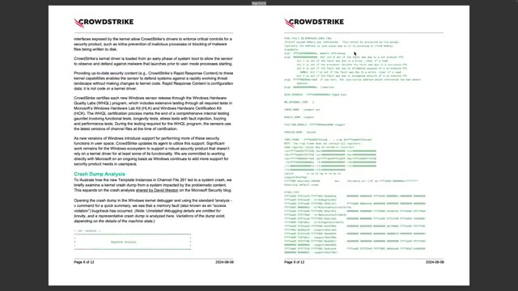
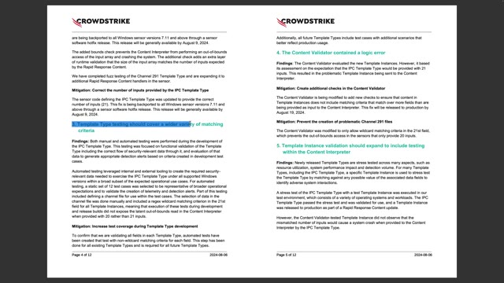
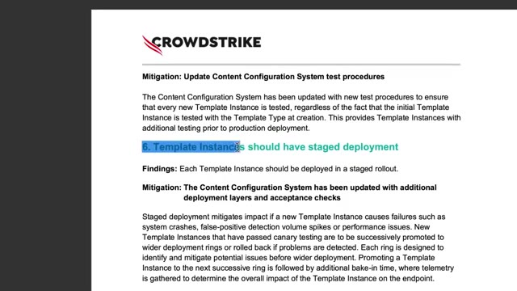
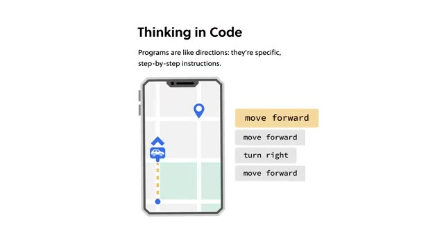
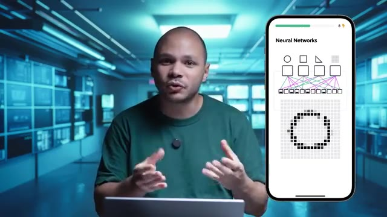
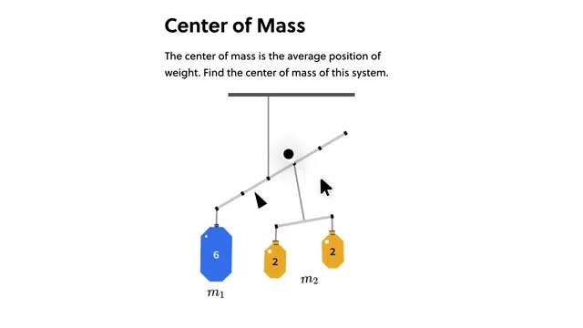

# 🎬 La source du bug Crowdstrike enfin révélée

> **Chaîne** : [cocadmin](https://www.youtube.com/@cocadmin)  
> **Lien YouTube** : [https://www.youtube.com/watch?v=9qaRqO3GPTs](https://www.youtube.com/watch?v=9qaRqO3GPTs)  
> **Date de publication** : 20240817  
> **Durée** : 00:15:23  
> **Identifiant vidéo** : `9qaRqO3GPTs`  
> **Transcription & Analyse** : `whisper-v3-large-turbo+gemini-3.5-flash-lite`  

---

## 📌 Synthèse Exécutive & Outils

### 💡 Résumé
L'incident planétaire CrowdStrike, survenu en juillet 2024, a paralysé des millions de machines critiques (hôpitaux, banques, aéroports) à travers le monde en déclenchant une vague massive de *Blue Screen of Death* (BSOD). La cause racine (*Root Cause Analysis* ou RCA), formalisée dans un rapport technique officiel de 10 pages, lève le voile sur une défaillance systémique liée à la mise à jour asynchrone de fichiers de configuration dynamiques par un pilote de noyau (*kernel driver*). Contrairement aux idées reçues, le binaire principal n'a pas changé, mais un fichier de définitions de menaces a introduit un décalage critique entre les structures de données attendues et les données fournies, provoquant une erreur de type *Out-of-Bounds* en espace noyau.

Pour contourner la lourdeur des processus de certification logicielle (tels que le WHQL de Microsoft) et réagir instantanément aux nouvelles menaces, CrowdStrike dissocie la logique de détection (le pilote validé) de sa base de règles (les fichiers de configuration dits « Channel Files »). L'incident s'est produit lorsque le pilote a tenté de lire un 21e champ dans un fichier de configuration n'en fournissant que 20, accédant ainsi à un emplacement mémoire non alloué. Ce dysfonctionnement a été aggravé par la nature *boot-start* du pilote : s'exécutant au démarrage avant même l'initialisation de l'OS pour intercepter toute activité malveillante, son crash en boucle a rendu les systèmes inbootables, nécessitant une intervention manuelle en mode sans échec pour supprimer le fichier corrompu.

Pour les administrateurs systèmes et les ingénieurs DevOps, cet événement constitue une étude de cas magistrale sur les risques inhérents au code bas niveau en C/C++, à la gestion des dépendances implicites entre configuration et binaire, et aux failles dans les pipelines de validation de bout en bout. Les leçons tirées de cette crise imposent une refonte des processus de CI/CD pour les logiciels s'exécutant au niveau du noyau, en particulier l'implémentation rigoureuse du *fuzzing*, la validation stricte des schémas à la compilation et la généralisation de tests d'intégration globaux (*end-to-end*) avant tout déploiement automatisé en production.

---

### 🛠️ Outils, Modèles & Logiciels Présentés
* **CrowdStrike Falcon** : Solution EDR (*Endpoint Detection and Response*) avancée fonctionnant comme un pilote de noyau pour surveiller en temps réel le comportement du système et bloquer les menaces.
* **Pilote de noyau (*Kernel Driver*)** : Programme doté des privilèges ultimes du système d'exploitation, s'exécutant au même niveau que le noyau Windows pour observer l'intégralité des processus.
* **Pilote de démarrage (*Boot-Start Driver*)** : Type de pilote spécifique qui s'initialise obligatoirement avant tous les autres processus au démarrage de la machine, bloquant le boot de l'OS en cas de défaillance.
* **WHQL (*Windows Hardware Quality Labs*)** : Laboratoire et processus de certification de Microsoft validant la robustesse et la stabilité des pilotes logiciels avant leur déploiement.
* **Fichiers de configuration Channel (*Channel Files*)** : Fichiers de définitions dynamiques (notamment le fichier incriminé de la série 291) mis à jour régulièrement pour alimenter les moteurs de détection sans nécessiter la recompilation du pilote.
* **Outils de Fuzzing** : Outils de test automatisés consistant à injecter des données aléatoires ou corrompues dans un programme pour éprouver sa robustesse face aux entrées inattendues.

---

### 🔑 Points Clés & Enseignements Stratégiques
* **Dangers du mode noyau (*Ring 0*)** : Tout code exécuté au niveau du noyau partage les privilèges de l'OS ; un crash applicatif à ce niveau entraîne instantanément un *kernel panic* ou un BSOD de la machine entière.
* **Criticité des pilotes *Boot-Start*** : Un pilote requis dès le démarrage du système ne tolère aucune défaillance, sous peine de rendre la machine totalement inbootable et de bloquer les mécanismes de récupération automatique.
* **Dichotomie code/configuration** : Séparer la logique applicative des fichiers de configuration accélère le déploiement des correctifs de sécurité, mais introduit un risque critique de désynchronisation des structures de données.
* **Erreur *Out-of-Bounds* en C++** : L'accès à un index mémoire inexistant (ex: tenter de lire un 21e élément dans un tableau de 20) est une faille classique de programmation bas niveau imputable à l'absence de vérification de limites.
* **Limites du masquage par joker (*Wildcard*)** : Un bug de logique peut rester latent durant des mois en production si les jeux de données de test utilisent systématiquement des caractères génériques masquant l'absence d'un champ.
* **Nécessité de la validation à la compilation** : Les processus de build doivent intégrer des assertions strictes pour s'assurer que le nombre de colonnes ou de champs d'un fichier de configuration correspond toujours exactement aux structures attendues par le code.
* **Impératif du *Fuzzing* applicatif** : L'injection systématique de charges utiles corrompues, aléatoires ou mal formées dans les parseurs de configuration est indispensable pour garantir la résilience logicielle.
* **Insuffisance des tests isolés** : Valider des composants de manière unitaire ne suffit pas ; il est impératif de mettre en place des tests d'intégration de bout en bout (*End-to-End*) simulant l'environnement réel d'exécution.
* **Gouvernance des processus de test internes** : S'appuyer uniquement sur des collaborateurs ou des bêta-testeurs internes présente des angles morts méthodologiques nécessitant des pipelines de test automatisés et diversifiés.
* **Contournement des goulots d'étranglement de certification** : Bien que les processus rigoureux comme le WHQL protègent la stabilité, l'agilité face aux cybermenaces exige des mécanismes de mise à jour rapide qui doivent être encadrés par des garde-fous internes infaillibles.
* **Résilience opérationnelle et plan de reprise** : L'incident rappelle l'importance vitale de disposer de procédures de secours documentées (comme le démarrage en mode sans échec pour supprimer un fichier corrompu) pour le personnel d'exploitation.
* **Responsabilité de la chaîne d'approvisionnement logicielle (*Software Supply Chain*)** : Une mise à jour de sécurité automatisée ne doit jamais être poussée en production sans une validation automatisée de non-régression à grande échelle.

---

## ⏱️ Chronologie & Transcription Complète Audio & Visuelle (Mot pour Mot)

### ⏱️ `[00:00:00 - 00:00:26]` | Segment #01

**🔊 Audio (Transcription Intégrale Mot pour Mot en Français) :**
> On va enfin savoir qu'est-ce qui s'est vraiment passé dans l'épisode CrowdStrike qui a fait bugger le monde entier, les aéroports, les hôpitaux, les banques, les appels d'urgence, tout ! Presque toutes les industries ont été touchées par ça. Il vient enfin de sortir une route cause analysiste d'où vient précisément l'origine du bug. Pour comprendre ce bug, il faut déjà comprendre le fonctionnement de CrowdStrike Falcon, qui est le programme qui tournait sur toutes ces machines qui ont tous blue screen en boucle.

**👁️ Analyse Visuelle d'Écran (gemini-3.5-flash-lite) :**
**Interface & Outils** : Navigateur web affichant un tableau de bord d'impact des pannes (dashboard de suivi d'incidents).

**Contenu textuel & Code** : Statistiques d'impact par site critique : customer facing, affected people, estimated damages, status (fixed: no).

**Action / Démonstration** : Présentation visuelle et introduction de l'analyse d'impact de l'incident mondial CrowdStrike sur les différentes industries touchées.

*📸 00:00:06 — Capture d'écran montrant un tableau de bord illustrant l'impact de la panne mondiale CrowdStrike sur différentes infrastructures critiques (aéroports de Dubaï, LAX, Espagne, Amsterdam, Microsoft Office et la banque centrale d'Israël) avec des métriques d'impact.*

---

### ⏱️ `[00:00:26 - 00:00:44]` | Segment #02

**🔊 Audio (Transcription Intégrale Mot pour Mot en Français) :**
> Ce qui fait ce programme, c'est qu'il surveille tous les événements qui se passent sur la machine. Donc ça peut être la création d'un fichier, la création d'un processus, d'un nouveau trait, la modification d'un fichier, tout ce que les programmes font sur la machine. Et ils regardent qu'est-ce qui a l'air bizarre ou pas. Et quand ça a l'air bizarre, ils prennent des actions ou pas.

**👁️ Analyse Visuelle d'Écran (gemini-3.5-flash-lite) :**
**Interface & Outils** : Aucun

**Contenu textuel & Code** : Aucun

**Action / Démonstration** : Explication théorique du fonctionnement d'un programme de surveillance système (EDR/monitoring).

---

### ⏱️ `[00:00:44 - 00:01:04]` | Segment #03

**🔊 Audio (Transcription Intégrale Mot pour Mot en Français) :**
> Plus précisément, ça s'appelle un EDR. C'est un espèce de type d'antivirus pour simplifier, un petit peu plus avancé. Il n'y a pas simplement regarder une base de données et de fichiers pour savoir si c'est un virus ou pas. Il va analyser le comportement du système et de tous les processus sur le système pour savoir s'ils font des trucs suspects ou pas. Et donc pour pouvoir faire ça, ce programme CrowdStrike Falcon, il est installé en tant que kernel driver.

**👁️ Analyse Visuelle d'Écran (gemini-3.5-flash-lite) :**
**Interface & Outils** : Aucune interface logicielle ou console active visible.

**Contenu textuel & Code** : Aucun code, commande ou métrique technique.

**Action / Démonstration** : Explication orale du concept d'EDR et d'analyse comportementale des processus par le créateur.

---

### ⏱️ `[00:01:04 - 00:01:25]` | Segment #04

**🔊 Audio (Transcription Intégrale Mot pour Mot en Français) :**
> Ça veut dire qu'il a un niveau de privilège encore plus élevé que ton mode administrateur, si tu veux. Il a un peu les droits ultimes sur ta machine. Il a les mêmes droits que le kernel Windows même sur ta machine. Donc il peut vraiment faire tout ce qu'il veut. L'avantage de faire ça, c'est qu'il peut vraiment observer tout ce qui se passe sur ta machine. Parce que la plupart des programmes malissieux, ils vont tout faire pour être le plus discret possible, faire des trucs un petit peu en cachet pour pas que ça se voit.

**👁️ Analyse Visuelle d'Écran (gemini-3.5-flash-lite) :**
**Interface & Outils** : Aucun outil, terminal ou console n'est affiché.

**Contenu textuel & Code** : Aucun code, commande, architecture ou métrique n'est visible.

**Action / Démonstration** : Explication orale par le créateur concernant les privilèges système avancés et le niveau d'accès au noyau Windows.

---

### ⏱️ `[00:01:25 - 00:01:48]` | Segment #05

**🔊 Audio (Transcription Intégrale Mot pour Mot en Français) :**
> Malgré ça, si CrowdStrike, il tourne en tant que kernel driver, ils peuvent pas se cacher en gros. L'inconvénient de ça, c'est que quand tu es un kernel driver, tu es au même niveau que Windows. C'est comme si tu étais intégré directement à Windows. Donc d'habitude, un programme, quand il crache sur ta machine, c'est juste le programme qui se ferme, ce n'est pas si grave. Mais là, comme il est carrément intégré à Windows, s'il crache, tu as tout Windows qui crache. Et deuxièmement, c'est un type de kernel driver particulier parce que c'est un boot start driver.

**👁️ Analyse Visuelle d'Écran (gemini-3.5-flash-lite) :**
**Interface & Outils** : AUCUNE

**Contenu textuel & Code** : AUCUNE

**Action / Démonstration** : Explication théorique et pédagogique sur le fonctionnement de CrowdStrike au niveau du noyau (kernel) Windows.

---

### ⏱️ `[00:01:48 - 00:02:07]` | Segment #06

**🔊 Audio (Transcription Intégrale Mot pour Mot en Français) :**
> Ça veut dire qu'une fois que ce programme-là est installé, Windows ne peut pas démarrer si ce programme-là ne démarre pas. L'avantage de ça, c'est que Crashtra va démarrer avant tous les autres processus sur la machine. et donc il va pouvoir voir tout ce qui s'est passé à partir du moment où la machine a démarré. Donc il n'y a pas un malware qui pourrait commencer à faire des trucs bizarres avant que ton antivirus démarre. L'inconvénient, c'est que si ce programme-là crache, eh bien la machine ne peut plus booter.

**👁️ Analyse Visuelle d'Écran (gemini-3.5-flash-lite) :**
**Interface & Outils** : Aucune

**Contenu textuel & Code** : Aucun

**Action / Démonstration** : Aucune, l'intervenant explique de manière théorique le chargement d'un agent de sécurité de type ELAM (Early Launch Anti-Malware) sous Windows, conçu pour s'exécuter avant les autres pilotes et processus afin de neutraliser les menaces dès la phase de boot.

---

### ⏱️ `[00:02:07 - 00:02:41]` | Segment #07

**🔊 Audio (Transcription Intégrale Mot pour Mot en Français) :**
> C'est ça qui a causé l'étendue de ce bug, parce qu'une machine qui bug à droite ou à gauche, ce n'est pas si grave, mais là c'était des millions de machines à droite ou à gauche qui buggaient parce qu'elles ne pouvaient juste plus redémarrer. Et donc on peut se dire, comment c'est possible que Microsoft laisse faire ça, des programmes qui s'installent et qui foutent le bordel sur mon ordi ? Et justement, Microsoft, ils ont une certification pour ça. Pas une certification que les gens peuvent passer, mais une certification logicielle qui s'appelle le WHQL pour Windows High Quality Labs, qui est en gros un laboratoire chez Microsoft qui va prendre ton programme, ton kernel driver, et il va l'inspecter, ils vont le tester, ils vont faire toute une tas de panoplies de tests

**👁️ Analyse Visuelle d'Écran (gemini-3.5-flash-lite) :**
**Interface & Outils** : Aucune interface technique ou console active.

**Contenu textuel & Code** : Aucun code, commande ou métrique visible.

**Action / Démonstration** : Explication verbale du contexte du bug sans manipulation technique à l'écran.

---

### ⏱️ `[00:02:41 - 00:03:10]` | Segment #08

**🔊 Audio (Transcription Intégrale Mot pour Mot en Français) :**
> pour s'assurer que ton programme est solide, il marche bien, il bugge pas, il crache pas, dans toutes les conditions. Une fois que ça s'est validé, ils vont le certifier, ils vont donner un certificat, qui fait que les gens vont avoir le droit de l'installer sur sa machine parce que c'est un programme qui est validé par Microsoft. Le problème c'est que les malwares, les virus, etc. il y en a des nouveaux tous les jours. Et donc si à chaque fois qu'il y a des nouveaux malwares, il faut repasser à travers tout le processus de certification Microsoft qui prend je sais pas combien de temps, mais bon même s'il prend une semaine ou deux, ça veut dire que c'est à chaque fois une semaine ou deux avec des menaces qui sont existantes et auxquelles on peut pas répondre.

**👁️ Analyse Visuelle d'Écran (gemini-3.5-flash-lite) :**
**Interface & Outils** : Aucun outil, terminal ou console technique affiché.

**Contenu textuel & Code** : Aucun code, commande ou architecture visible (présence uniquement d'un texte explicatif sur la sécurité).

**Action / Démonstration** : Explication orale sur le processus de validation de programmes et de certification par Microsoft.

---

### ⏱️ `[00:03:10 - 00:03:28]` | Segment #09

**🔊 Audio (Transcription Intégrale Mot pour Mot en Français) :**
> Donc pour pouvoir répondre plus rapidement aux menaces aux nouveaux virus qui arrivent, ce que CrowdStrike a fait, c'est qu'ils ont leur kernel driver d'un côté qui a été validé par Microsoft au moment où il l'a envoyé. Mais ce kernel driver là, il va utiliser des fichiers de configuration. Et c'est ces fichiers de configuration là, qui vont contenir les nouvelles techniques de détection des nouveaux malwares, qui vont être mis à jour.

**👁️ Analyse Visuelle d'Écran (gemini-3.5-flash-lite) :**
**Interface & Outils** : Présentation ou face-caméra sans interface informatique partagée.

**Contenu textuel & Code** : Explications orales des concepts, architectures et retours d'expérience.

**Action / Démonstration** : Démonstration pédagogique et mise en perspective technique.

---

### ⏱️ `[00:03:29 - 00:03:48]` | Segment #10

**🔊 Audio (Transcription Intégrale Mot pour Mot en Français) :**
> Comme ça, on n'a pas besoin de mettre à jour le driver si souvent que ça. On va juste mettre à jour les fichiers de configuration entre guillemets. Et le fameux fichier channel 291, blablabla, c'était justement un de ces fameux fichiers de configuration. Et c'est pour ça que quand on rebootait en mode sans échec et qu'on efface ce fichier, et bien là, comme par magie, tout se remettait à fonctionner.

**👁️ Analyse Visuelle d'Écran (gemini-3.5-flash-lite) :**
**Interface & Outils** : Aucun outil, terminal ou console active n'est visible (simple incrustation textuelle sur l'image 1).

**Contenu textuel & Code** : Mention textuelle du fichier système 'CHANNEL00000291.sys'.

**Action / Démonstration** : Explication orale de l'architecture des fichiers de configuration et des pilotes système (pas de manipulation technique filmée).

---

### ⏱️ `[00:03:48 - 00:04:08]` | Segment #11

**🔊 Audio (Transcription Intégrale Mot pour Mot en Français) :**
> Donc maintenant qu'on comprend comment ça fonctionne, qu'est-ce qui a mal allé ? C'était quoi le problème ? Donc ils ont fait un rapport de 10 pages qui explique un petit peu en détail ce qui s'est passé. Et je passe à travers comme ça, t'as pas besoin. Et ce que ça dit, c'est que l'erreur de base, c'est que ces fameux fichiers de configuration, il y a un endroit où il donnait 21 champs différents à vérifier, sauf que le kernel driver en lui-même, il donnait juste 20 éléments.

**👁️ Analyse Visuelle d'Écran (gemini-3.5-flash-lite) :**
**Interface & Outils** : Document PDF (Rapport d'incident CrowdStrike avec pages 6 et 9 visibles).

**Contenu textuel & Code** : Texte technique décrivant le fonctionnement des pilotes en mode noyau Windows (kernel mode), la certification WHQL et l'analyse de crash dump (`PAGE_FAULT_IN_NONPAGED_AREA`).

**Action / Démonstration** : Présentation et analyse détaillée du rapport d'incident post-mortem publié par CrowdStrike suite à la panne mondiale.

*📸 00:03:53 — Extrait du rapport d'incident de CrowdStrike détaillant l'analyse du crash dump et les spécifications techniques des pilotes noyau.*

---

### ⏱️ `[00:04:08 - 00:04:28]` | Segment #12

**🔊 Audio (Transcription Intégrale Mot pour Mot en Français) :**
> Et ce qui se passait, c'est que le programme, il allait vérifier chacun des éléments, 1, 2, 3, 4, 5, 6, jusqu'à 20. Et quand il arrivait pour vérifier l'événement numéro 21, et comme il n'existait pas, ça déclenche une out of bound error, C'est-à-dire que ton programme, il essaie d'aller lire un espace en mémoire qui n'existe pas, qui fait pas de sens. Et quand ça, ça arrive, le programme crache. Comme le programme est un kernel driver intégré à Windows, Windows crache.

**👁️ Analyse Visuelle d'Écran (gemini-3.5-flash-lite) :**
**Interface & Outils** : Aucun outil, terminal ou logiciel affiché.

**Contenu textuel & Code** : Aucun code, commande ou métrique visible.

**Action / Démonstration** : Explication orale de concepts techniques (erreur de dépassement de mémoire / out of bounds error).

---

### ⏱️ `[00:04:28 - 00:04:49]` | Segment #13

**🔊 Audio (Transcription Intégrale Mot pour Mot en Français) :**
> Et comme c'est un bootstart driver, Windows peut jamais redémarrer. Ce qui est intéressant, les détails qu'il donne, c'est que ce bug, en fait, il est dans CrowdStrike depuis février-mars. Mais il n'avait encore jamais été déclenché. Il a passé inaperçu pendant tout ce temps-là. Parce qu'avant ça, dans ce fichier, le champ numéro 21, c'était tout le temps un wildcard. Donc c'est un caractère spécial qui est un petit peu comme un joker qui veut dire « pour ce champ-là, n'importe quoi, ça ira ».

**👁️ Analyse Visuelle d'Écran (gemini-3.5-flash-lite) :**
**Interface & Outils** : AUCUNE

**Contenu textuel & Code** : AUCUN

**Action / Démonstration** : Explication orale du bug CrowdStrike par le présentateur (face-caméra).

---

### ⏱️ `[00:04:49 - 00:05:10]` | Segment #14

**🔊 Audio (Transcription Intégrale Mot pour Mot en Français) :**
> Ce qui fait que probablement ce qui s'est passé, le programme, il vérifiait les champs de 1 à 20 et pour le champ numéro 21, comme il y avait un wildcard dedans, il vérifiait pas. Il essayait pas d'aller vérifier parce que de toute manière, c'est censé matcher avec n'importe quoi. Comme le champ 21, c'était tout le temps un wildcard dans leur test, et bah ils ont jamais vu le bug. Et c'est seulement le 19 juin, dans une nouvelle nouvelle nouvelle mise à jour, que là cette fois-ci, le champ, c'était pas un wildcard, c'était une valeur n'importe laquelle.

**👁️ Analyse Visuelle d'Écran (gemini-3.5-flash-lite) :**
**Interface & Outils** : Présentation ou face-caméra sans interface informatique partagée.

**Contenu textuel & Code** : Explications orales des concepts, architectures et retours d'expérience.

**Action / Démonstration** : Démonstration pédagogique et mise en perspective technique.

---

### ⏱️ `[00:05:10 - 00:05:28]` | Segment #15

**🔊 Audio (Transcription Intégrale Mot pour Mot en Français) :**
> et donc là comme on essaie de chercher cette valeur là, boum ça fait tout cracher. Donc là ça veut dire que ça soulève pas mal de problèmes parce qu'il y a pas mal de choses qui auraient pu être faites pour pouvoir empêcher ça. La première chose c'est de ne jamais générer un fichier de config qui va comporter plus de champs que ce que le programme peut vérifier. Donc ça c'est une des premières choses qu'ils ont fixées et qu'ils expliquent dans leur rapport.

**👁️ Analyse Visuelle d'Écran (gemini-3.5-flash-lite) :**
**Interface & Outils** : AUCUNE

**Contenu textuel & Code** : AUCUNE

**Action / Démonstration** : Explication orale par le présentateur sur les erreurs de configuration et la gestion des fichiers de configuration.

---

### ⏱️ `[00:05:28 - 00:05:48]` | Segment #16

**🔊 Audio (Transcription Intégrale Mot pour Mot en Français) :**
> C'est qu'à la compilation du programme, ils vont vraiment vérifier que pour tous les fichiers de configuration, les nombres de colonnes, le nombre d'événements à regarder correspond au nombre d'événements qui existent vraiment sur la machine dans le kernel driver. La deuxième chose qui est problématique, c'est que même si le fichier de config donne plus de champs à vérifier, le programme n'aurait jamais dû aller essayer d'aller accéder à une valeur qui n'existe pas.

**👁️ Analyse Visuelle d'Écran (gemini-3.5-flash-lite) :**
**Interface & Outils** : Présentation ou face-caméra sans interface informatique partagée.

**Contenu textuel & Code** : Explications orales des concepts, architectures et retours d'expérience.

**Action / Démonstration** : Démonstration pédagogique et mise en perspective technique.

---

### ⏱️ `[00:05:49 - 00:06:13]` | Segment #17

**🔊 Audio (Transcription Intégrale Mot pour Mot en Français) :**
> Donc ça, c'est la deuxième chose aussi qu'ils ont corrigé, c'est de faire en sorte que leur programme, à cet endroit-là en particulier, mais aussi ailleurs dans le programme, c'est de faire en sorte que quand on a par exemple un tableau de 20 éléments, qu'on n'essaie pas d'accéder au 21e élément, parce que ça ne fait pas de sens, c'est ça qui cause ce type d'erreur-là. Et ça, c'est un type d'erreur qui est quand même assez fréquent quand on fait de la programmation en bas niveau, en C++. Comme c'est un langage bas niveau, c'est vraiment nous qui avons la responsabilité de devoir fermer ce qu'on a ouvert, vérifier que ce qu'on ouvre existe bien, etc.

**👁️ Analyse Visuelle d'Écran (gemini-3.5-flash-lite) :**
**Interface & Outils** : Présentation ou face-caméra sans interface informatique partagée.

**Contenu textuel & Code** : Explications orales des concepts, architectures et retours d'expérience.

**Action / Démonstration** : Démonstration pédagogique et mise en perspective technique.

---

### ⏱️ `[00:06:13 - 00:06:33]` | Segment #18

**🔊 Audio (Transcription Intégrale Mot pour Mot en Français) :**
> Et ça c'est probablement quelque chose qui est vérifié la plupart du temps, mais comme un programme c'est quelque chose qui est dynamique ou quelque chose où on va tout le temps faire des modifications, corriger des bugs, rajouter des fonctionnalités, et donc du coup comme l'erreur est humaine, toujours un moment ou un endroit où on peut oublier de faire cette vérification, et du coup ça cause des crashs. Donc ils ont fixé ça particulièrement à ce endroit là. Ils ont aussi fait ce qu'on appelle du fuzzing.

**👁️ Analyse Visuelle d'Écran (gemini-3.5-flash-lite) :**
**Interface & Outils** : Présentation ou face-caméra sans interface informatique partagée.

**Contenu textuel & Code** : Explications orales des concepts, architectures et retours d'expérience.

**Action / Démonstration** : Démonstration pédagogique et mise en perspective technique.

---

### ⏱️ `[00:06:33 - 00:06:57]` | Segment #19

**🔊 Audio (Transcription Intégrale Mot pour Mot en Français) :**
> Et le fusing, c'est prendre un programme ou une fonction et lui envoyer un petit peu n'importe quoi. Soit des entrées qu'on va faire exprès d'être mauvaises, soit lui donner des valeurs aléatoires. Mais en gros, on va faire en sorte d'essayer de tout péter. Et c'est ce qu'ils ont fait avec ce fichier Channel 291. Ils ont essayé de mettre plein de trucs, n'importe quoi dedans, et essayer de voir comment se comporte le programme, pour faire en sorte que, quelles que soient les conneries que peut y avoir dans ce fichier de config-là, que ça ne fasse pas cracher le programme principal.

**👁️ Analyse Visuelle d'Écran (gemini-3.5-flash-lite) :**
**Interface & Outils** : Présentation ou face-caméra sans interface informatique partagée.

**Contenu textuel & Code** : Explications orales des concepts, architectures et retours d'expérience.

**Action / Démonstration** : Démonstration pédagogique et mise en perspective technique.

---

### ⏱️ `[00:06:57 - 00:07:21]` | Segment #20

**🔊 Audio (Transcription Intégrale Mot pour Mot en Français) :**
> Donc là, ils l'ont fait pour ce fichier-là en particulier. Ils expliquent qu'ils sont en cours de le faire pour tous les autres Channel 5, parce qu'on imagine bien que si c'est Channel 5 numéro 291, il y en a quelques centaines d'autres à checker. Troisième gros problème dans cette histoire, c'est peut-être même un des premiers trucs auxquels on pense, on se dit mais comment c'est possible, ils n'ont pas testé ? Et en fait, si, il y a plein de tests qui sont faits à plein de niveaux, même des tests performants, des choses comme ça, mais il se trouve que ce problème-là en particulier n'a jamais été testé.

**👁️ Analyse Visuelle d'Écran (gemini-3.5-flash-lite) :**
**Interface & Outils** : Document PDF / Rapport d'analyse technique CrowdStrike.

**Contenu textuel & Code** : Texte technique listant les points "3. Template Type testing should cover a wider variety of matching criteria", "4. The Content Validator contained a logic error", et "5. Template Instance validation should expand to include testing within the Content Interpreter".

**Action / Démonstration** : Analyse et explication du rapport de root cause de CrowdStrike concernant la validation des fichiers de template et les correctifs apportés.

*📸 00:07:15 — Extrait du rapport technique CrowdStrike (pages 4 et 5) détaillant les conclusions (Findings) et mesures d'atténuation (Mitigation) concernant les erreurs de validation de contenu et de test des Template Types.*

---

### ⏱️ `[00:07:21 - 00:07:44]` | Segment #21

**🔊 Audio (Transcription Intégrale Mot pour Mot en Français) :**
> C'est quand même balou parce que ça veut dire qu'ils n'ont pas ce qu'on appelle de end-to-end testing, c'est-à-dire un test qui va simplement prendre une machine, installer, cross-throw dessus, jouer un peu avec, faire quelques petites modifications, des trucs comme ça, et puis vérifier que juste ça fonctionne. C'est-à-dire que probablement qu'ils testent certaines fonctionnalités de manière isolée, mais ils ne testent pas globalement le programme. C'est peut-être quelque chose qui est aussi très compliqué à faire parce que c'est un carline driver, ce n'est pas non plus une calculatrice.

**👁️ Analyse Visuelle d'Écran (gemini-3.5-flash-lite) :**
**Interface & Outils** : Aucun outil, terminal ou console technique affiché.

**Contenu textuel & Code** : Aucun code, configuration ou architecture visible.

**Action / Démonstration** : Explication théorique sur l'absence de tests end-to-end (E2E).

---

### ⏱️ `[00:07:44 - 00:08:04]` | Segment #22

**🔊 Audio (Transcription Intégrale Mot pour Mot en Français) :**
> Apparemment, dans leur batterie de test, ils testent en interne, c'est-à-dire que toutes les personnes qui travaillent dans cette entreprise-là, ils testent les nouvelles versions, et ensuite ils ont un autre petit groupe de bêta-testeurs pour pouvoir vérifier que les nouvelles versions fonctionnent correctement. Ça c'est quelque chose que je trouve quand même un petit peu bizarre, ou du moins je trouve que c'est dommage que ça n'a pas été expliqué dans le document.

**👁️ Analyse Visuelle d'Écran (gemini-3.5-flash-lite) :**
**Interface & Outils** : Présentation ou face-caméra sans interface informatique partagée.

**Contenu textuel & Code** : Explications orales des concepts, architectures et retours d'expérience.

**Action / Démonstration** : Démonstration pédagogique et mise en perspective technique.

---

### ⏱️ `[00:08:04 - 00:08:25]` | Segment #23

**🔊 Audio (Transcription Intégrale Mot pour Mot en Français) :**
> C'est pourquoi est-ce qu'un problème aussi facile à détecter, entre guillemets, qui est passé à travers toute leur couche de différents tests. Ça, ça aurait été intéressant à savoir, parce que clairement il y a un problème dans tout le processus de test. Probablement que ce qui s'est passé, c'est qu'ils considéraient peut-être pas vraiment ça comme du code, parce que c'était entre guillemets juste un fichier de configuration.

**👁️ Analyse Visuelle d'Écran (gemini-3.5-flash-lite) :**
**Interface & Outils** : AUCUNE

**Contenu textuel & Code** : AUCUN

**Action / Démonstration** : Explication verbale sur les processus de test et la détection de bogues informatiques.

---

### ⏱️ `[00:08:25 - 00:08:46]` | Segment #24

**🔊 Audio (Transcription Intégrale Mot pour Mot en Français) :**
> donc ils l'ont testé au départ quand ils ont ajouté cette nouvelle fonctionnalité en février mars. Pour le coup tout fonctionnait bien parce que la valeur numéro 21 avait un wildcard dedans et ils n'ont jamais vraiment retesté avec les nouvelles versions des fichiers de configuration. Donc clairement ça veut dire qu'il y a un problème au niveau de la chaîne de test, la chaîne de qualité du programme. Donc évidemment ils expliquent qu'ils ont rajouté plein de batteries test pour plus que ça arrive.

**👁️ Analyse Visuelle d'Écran (gemini-3.5-flash-lite) :**
**Interface & Outils** : Présentation ou face-caméra sans interface informatique partagée.

**Contenu textuel & Code** : Explications orales des concepts, architectures et retours d'expérience.

**Action / Démonstration** : Démonstration pédagogique et mise en perspective technique.

---

### ⏱️ `[00:08:46 - 00:09:15]` | Segment #25

**🔊 Audio (Transcription Intégrale Mot pour Mot en Français) :**
> Ils ont également embauché deux entreprises de sécurité externes pour pouvoir à la fois vérifier le code qu'il n'y ait pas de ce type d'erreur là ailleurs dans le code parce que c'est quand même une erreur fréquente qui peut arriver ailleurs, et aussi pour pouvoir regarder tout leur processus de test pour pouvoir voir où est arrivé le problème et le fixer. Le problème un petit peu avec ce genre d'audit, c'est que oui, ils vont peut-être trouver le problème à ce moment-là, mais comme dans le développement logiciel, on est toujours en train d'ajouter des nouvelles fonctionnalités, corriger des bugs, faire plein de modifications tout le temps, tout le temps, ça, c'est des problèmes qui vont revenir de manière constante.

**👁️ Analyse Visuelle d'Écran (gemini-3.5-flash-lite) :**
**Interface & Outils** : Présentation ou face-caméra sans interface informatique partagée.

**Contenu textuel & Code** : Explications orales des concepts, architectures et retours d'expérience.

**Action / Démonstration** : Démonstration pédagogique et mise en perspective technique.

---

### ⏱️ `[00:09:15 - 00:09:38]` | Segment #26

**🔊 Audio (Transcription Intégrale Mot pour Mot en Français) :**
> Le faire un audit à un instant T, ça peut trouver des problèmes, d'autres problèmes qui n'ont pas encore forcément été trouvés, mais c'est pas forcément une solution long terme. Donc c'est pour ça qu'il faut corriger et améliorer le processus de test au maximum pour pouvoir attraper ces erreurs parce que c'est sûr et certain qu'elles vont revenir. Un autre problème, ou plutôt quelque chose qui aurait pu être mis en place pour pouvoir éviter ce type de problème, c'est ce qu'on appelle un déploiement en canaries, ou du stage déploiement.

**👁️ Analyse Visuelle d'Écran (gemini-3.5-flash-lite) :**
**Interface & Outils** : Présentation ou face-caméra sans interface informatique partagée.

**Contenu textuel & Code** : Explications orales des concepts, architectures et retours d'expérience.

**Action / Démonstration** : Démonstration pédagogique et mise en perspective technique.

---

### ⏱️ `[00:09:38 - 00:09:58]` | Segment #27

**🔊 Audio (Transcription Intégrale Mot pour Mot en Français) :**
> Et ce nom, déploiement en canaries, ça vient vraiment du petit canary, le petit canard jaune. En gros, à l'époque, dans les mines, on savait pas trop comment mesurer le niveau d'oxygène et quand l'oxygène devenait trop bas, les mineurs s'en rendaient pas compte avant que ça soit trop tard et personne n'avait le temps de ressortir et c'était une catastrophe. Donc ce qu'ils ont commencé à faire, c'est d'emmener avec eux dans les mines des petits canaris, des tout petits canards jeunes. Et ces canaris, ils font tout le temps du bruit.

**👁️ Analyse Visuelle d'Écran (gemini-3.5-flash-lite) :**
**Interface & Outils** : Aucune interface technique, terminal ou console visible (illustrations historiques uniquement).

**Contenu textuel & Code** : Aucune commande, code, architecture ou métrique technique affichée.

**Action / Démonstration** : Illustration historique du concept de déploiement en canari (origine du terme avec les mineurs et les canaris dans les mines).

---

### ⏱️ `[00:09:58 - 00:10:19]` | Segment #28

**🔊 Audio (Transcription Intégrale Mot pour Mot en Français) :**
> Ils sont là, tip, tip, tip, tip, tip. Et la particularité de ces canaris, en plus de jamais se taire, c'est qu'ils sont plus sensibles que les humains aux baisses de niveaux d'oxygène. Et donc quand l'oxygène va descendre en dessous d'un certain niveau, le canari va commencer à fermer sa bouche un petit peu parce qu'il est mort. Et donc les mineurs, quand ils n'entendent plus le canari en train de brailler, ça veut dire qu'il n'y a plus d'oxygène et qu'il faut se barrer.

**👁️ Analyse Visuelle d'Écran (gemini-3.5-flash-lite) :**
**Interface & Outils** : AUCUNE

**Contenu textuel & Code** : AUCUN

**Action / Démonstration** : Explication du concept de déploiement "canary" par analogie historique avec les mineurs et les canaris dans les mines.

---

### ⏱️ `[00:10:19 - 00:10:38]` | Segment #29

**🔊 Audio (Transcription Intégrale Mot pour Mot en Français) :**
> Donc, c'est ballot pour le canari, mais au moins, tout le monde a pu ressortir sain et sauf. Donc là, c'est le même principe, sauf qu'on n'a pas besoin de tuer des petits canaris. C'est qu'on va faire notre déploiement en petits morceaux. Donc, quand on a une nouvelle version de notre logiciel, au lieu de le déployer à tout le monde d'un coup, on va le déployer une petite partie. Par exemple, juste 1% des utilisateurs. Et ces 1%, ça va être notre fameux canari.

**👁️ Analyse Visuelle d'Écran (gemini-3.5-flash-lite) :**
**Interface & Outils** : Présentation ou face-caméra sans interface informatique partagée.

**Contenu textuel & Code** : Explications orales des concepts, architectures et retours d'expérience.

**Action / Démonstration** : Démonstration pédagogique et mise en perspective technique.

---

### ⏱️ `[00:10:38 - 00:11:01]` | Segment #30

**🔊 Audio (Transcription Intégrale Mot pour Mot en Français) :**
> On va mesurer comment se passe ces 1%. Est-ce qu'il y a plus de crash que d'habitude ? Est-ce qu'ils sont plus lents ? Et si toutes ces valeurs-là sont normales, c'est-à-dire comme d'habitude, on va continuer le développement, on va déployer à 10%. Et à 10%, pareil, on va mesurer, voir si tout se passe bien, et on va attendre encore un petit peu plus de temps pour pouvoir le déployer peut-être à 50% et ensuite à 100%.

**👁️ Analyse Visuelle d'Écran (gemini-3.5-flash-lite) :**
**Interface & Outils** : Présentation ou face-caméra sans interface informatique partagée.

**Contenu textuel & Code** : Explications orales des concepts, architectures et retours d'expérience.

**Action / Démonstration** : Démonstration pédagogique et mise en perspective technique.

---

### ⏱️ `[00:11:01 - 00:11:21]` | Segment #31

**🔊 Audio (Transcription Intégrale Mot pour Mot en Français) :**
> De cette manière, si jamais il y a un problème, on va le voir assez rapidement. Si jamais c'est un problème qui affecte par exemple une machine sur 1000, là c'est quelque chose qu'on n'aurait peut-être pas vu en déployant juste à 1% des machines, parce que ça ne fait juste pas assez de machines. Donc quand on fait la deuxième partie du développement à 10% par exemple, là il y a beaucoup plus de machines. Donc on a beaucoup plus d'échantillons pour pouvoir voir si jamais ça cause des problèmes.

**👁️ Analyse Visuelle d'Écran (gemini-3.5-flash-lite) :**
**Interface & Outils** : Aucune interface technique, terminal ou outil DevOps visible.

**Contenu textuel & Code** : Aucun code, configuration, commande ou métrique affiché à l'écran.

**Action / Démonstration** : Explication orale par le créateur concernant les stratégies de déploiement et la gestion des pannes sur un grand nombre de machines.

---

### ⏱️ `[00:11:22 - 00:11:44]` | Segment #32

**🔊 Audio (Transcription Intégrale Mot pour Mot en Français) :**
> À chaque étape, on attend un petit peu plus longtemps. Comme ça, s'il y a des problèmes qui prennent un peu plus de temps à arriver, on peut les attraper aussi. Et donc avec cette technique, ça permet d'empêcher l'étendue du problème comme on a vu avec CrowdStrike. C'est quelque chose qu'ils ont aussi mis en place pour pouvoir éviter dans l'avenir ces problèmes-là. Ils ont aussi fait en sorte que les clients de CrowdStrike, donc les administrateurs système en gros, puissent pouvoir mieux paramétrer à quel moment sont faits les mises à jour.

**👁️ Analyse Visuelle d'Écran (gemini-3.5-flash-lite) :**
**Interface & Outils** : Document texte / rapport technique officiel au format PDF ou web.

**Contenu textuel & Code** : Texte technique décrivant la mise en place de procédures de test et d'un déploiement progressif (staged rollout) pour les Template Instances afin d'éviter les pannes système.

**Action / Démonstration** : Explication de la mise en place de politiques de déploiement par anneaux progressifs pour contrer les régressions similaires à l'incident CrowdStrike.

*📸 00:11:33 — Extrait de document officiel de CrowdStrike détaillant les mesures d'atténuation et la nécessité d'un déploiement par étapes (staged deployment / anneaux de déploiement).*

---

### ⏱️ `[00:11:44 - 00:12:08]` | Segment #33

**🔊 Audio (Transcription Intégrale Mot pour Mot en Français) :**
> Parce que là, en gros, toutes les mises à jour ont été faites instantanément à tout le monde et les administrateurs de système n'avaient pas forcément assez de contrôle pour pouvoir choisir quand est-ce qu'ils font des mises à jour. Donc là, maintenant, tu peux choisir si tu préfères attendre un peu avant d'avoir les toutes dernières mises à jour. Comme ça, tu es peut-être un petit peu moins protégé, mais au moins, tu as le temps de voir venir si jamais il y a un gros problème. Et le dernier problème que ça soulève, qui est un petit peu plus global, qui dépasse peut-être un petit peu CrowdStrike, c'est est-ce qu'on a vraiment besoin de kernel driver ?

**👁️ Analyse Visuelle d'Écran (gemini-3.5-flash-lite) :**
**Interface & Outils** : AUCUNE

**Contenu textuel & Code** : AUCUN

**Action / Démonstration** : Explication orale de concepts d'administration système et de gestion des mises à jour.

---

### ⏱️ `[00:12:08 - 00:12:28]` | Segment #34

**🔊 Audio (Transcription Intégrale Mot pour Mot en Français) :**
> Parce que si on voit ce que ça peut causer, le fait que ça peut cracher des machines, les empêcher de rebooter, et qu'encore pire que ça, un kernel driver, CrowdStrike Falcon, c'est un programme qui est close source. Donc c'est-à-dire qu'on ne sait pas ce qu'il fait. Il peut y avoir n'importe quoi dedans, même si CrowdStrike est de bonne volonté. Peut-être qu'il y a un employé qui est malveillant, peut-être qu'ils se sont fait hacker et qu'ils ne le savent pas.

**👁️ Analyse Visuelle d'Écran (gemini-3.5-flash-lite) :**
**Interface & Outils** : AUCUNE

**Contenu textuel & Code** : AUCUN

**Action / Démonstration** : Explication orale sur les risques liés aux pilotes de noyau (kernel drivers) propriétaires et les pannes système.

---

### ⏱️ `[00:12:28 - 00:12:46]` | Segment #35

**🔊 Audio (Transcription Intégrale Mot pour Mot en Français) :**
> Tu vois, il peut se passer un mille heures de trucs qui font que sur mon ordi, j'ai un truc qui tourne avec plus de privilèges que moi-même, qui est administrateur de ma machine, et qui peut faire n'importe quoi sur ma machine. Donc d'un point de vue sécurité, c'est un petit peu un truc qui est abusé. Parce qu'on peut se dire que, par exemple, pour un logiciel antivirus, peut-être ça peut faire du sens, qu'il ait des accès un peu privilégiés, ces choses comme ça.

**👁️ Analyse Visuelle d'Écran (gemini-3.5-flash-lite) :**
**Interface & Outils** : Aucune interface ou console technique visible.

**Contenu textuel & Code** : Aucun code, commande ou métrique affiché.

**Action / Démonstration** : Explication orale sur les risques de sécurité liés aux privilèges administrateur des processus en arrière-plan.

---

### ⏱️ `[00:12:47 - 00:13:11]` | Segment #36

**🔊 Audio (Transcription Intégrale Mot pour Mot en Français) :**
> Mais un autre type d'application qu'utilisent beaucoup les kernel drivers, c'est les anti-cheats. Par exemple, quand tu installes Valorant sur ton ordi, qui est un jeu en ligne, ça installe aussi un programme qui s'appelle Vanguard et qui est un kernel driver. C'est pour ça que tu as besoin de rebooter ton ordi quand tu installes Valorant. Et pour ça, on se dit, est-ce que vraiment pour pouvoir jouer à un jeu en ligne, j'ai besoin d'avoir un bout de programme qui tourne dont j'ai aucune idée de ce qu'il fait, qui tourne avec des privilèges maximum sur mon ordi.

**👁️ Analyse Visuelle d'Écran (gemini-3.5-flash-lite) :**
**Interface & Outils** : Aucune interface ou console active visible.

**Contenu textuel & Code** : Aucun code, commande ou architecture visible.

**Action / Démonstration** : Explication orale sur le fonctionnement des anti-cheats fonctionnant en mode kernel, comme Vanguard pour Valorant.

---

### ⏱️ `[00:13:11 - 00:13:31]` | Segment #37

**🔊 Audio (Transcription Intégrale Mot pour Mot en Français) :**
> Là, ça vaut peut-être beaucoup moins le coup. Donc ça soulève vraiment cette question de est-ce que c'est vraiment nécessaire qu'on ait ce type de programme sur nos ordi ? Et dans le rapport, ils en parlent un petit peu. Ils expliquent que justement, Windows a commencé petit à petit à mettre certaines des fonctionnalités qui sont disponibles juste pour les drivers à les rendre disponibles dans le userland.

**👁️ Analyse Visuelle d'Écran (gemini-3.5-flash-lite) :**
**Interface & Outils** : Aucune interface affichée.

**Contenu textuel & Code** : Aucun contenu technique ou graphique visible.

**Action / Démonstration** : Explication orale par le présentateur sur la nécessité des programmes et l'évolution de Windows.

---

### ⏱️ `[00:13:31 - 00:13:52]` | Segment #38

**🔊 Audio (Transcription Intégrale Mot pour Mot en Français) :**
> Le userland, c'est l'endroit où roulent les programmes normaux comme Word, la calculatrice, Google Chrome, des choses comme ça. Et donc quand un programme roule dans le userland, il n'y a pas tous ces problèmes-là. S'il crache, c'est juste le programme qui crache, tu le redémarres et ça ne fout pas le bordel sur tout ton ordi. Ça n'empêche pas ton ordi de rebooter, etc. Donc CrowdStrike, ils ont commencé justement à utiliser ces fonctionnalités qui sont dans le user LAN pour les enlever de la partie kernel driver.

**👁️ Analyse Visuelle d'Écran (gemini-3.5-flash-lite) :**
**Interface & Outils** : Présentation ou face-caméra sans interface informatique partagée.

**Contenu textuel & Code** : Explications orales des concepts, architectures et retours d'expérience.

**Action / Démonstration** : Démonstration pédagogique et mise en perspective technique.

---

### ⏱️ `[00:13:52 - 00:14:16]` | Segment #39

**🔊 Audio (Transcription Intégrale Mot pour Mot en Français) :**
> Mais il y a encore plein de fonctionnalités qui sont réservées juste au kernel driver. Donc ça, c'est quelque chose qui vraiment doit venir de Microsoft. Si jamais ils décident que, ok, bon, maintenant on a compris, les kernel drivers, c'est un petit peu abusé, il faut que toutes les fonctionnalités qui sont en ce moment disponibles pour les kernel drivers soit disponible dans le user-lane. Et c'est d'ailleurs ce qu'a fait Apple avec macOS. Depuis 2019, ils ont apprécié et même enlevé la plupart des fonctionnalités qui étaient dans les kernels drivers.

**👁️ Analyse Visuelle d'Écran (gemini-3.5-flash-lite) :**
**Interface & Outils** : Présentation ou face-caméra sans interface informatique partagée.

**Contenu textuel & Code** : Explications orales des concepts, architectures et retours d'expérience.

**Action / Démonstration** : Démonstration pédagogique et mise en perspective technique.

---

### ⏱️ `[00:14:16 - 00:14:35]` | Segment #40

**🔊 Audio (Transcription Intégrale Mot pour Mot en Français) :**
> Ça s'appelle les kernels extensions sur macOS. Et ils les ont remplacés par ce qu'ils appellent des systèmes extensions. Et les systèmes extensions, elles tournent dans le user-lane. Donc, c'est quelque chose qui est possible. C'est juste qu'il faut que Microsoft s'y mette un petit peu. Ce qui est intéressant avec ce type de problème, c'est que ça permet d'apprendre comment les choses fonctionnent. Et c'est pour ça que j'aime bien le sponsor d'aujourd'hui Brilliant. Je kiffe parce que c'est visuel et interactif.

**👁️ Analyse Visuelle d'Écran (gemini-3.5-flash-lite) :**
**Interface & Outils** : Aucune interface technique, terminal ou console visible.

**Contenu textuel & Code** : Aucun contenu technique, code ou architecture affiché.

**Action / Démonstration** : Explication orale sur le fonctionnement des extensions de noyau (kernel extensions) et system extensions sur macOS sans support visuel technique.

---

### ⏱️ `[00:14:35 - 00:14:54]` | Segment #41

**🔊 Audio (Transcription Intégrale Mot pour Mot en Français) :**
> et pour moi c'est ça la meilleure façon d'apprendre. Il y a plein de sujets à découvrir comme par exemple les bases de la programmation en Python, les réseaux de neurones ou les modèles de langage ou plein d'autres. Et moi j'ai particulièrement aimé la leçon sur les réseaux de neurones parce que c'est un sujet qui est assez vague et qui n'est jamais vraiment expliqué en détail sur comment est-ce qu'une machine fait pour apprendre ou pour détecter des images par exemple.

**👁️ Analyse Visuelle d'Écran (gemini-3.5-flash-lite) :**
**Interface & Outils** : Interface graphique mobile / application ludo-éducative de programmation et d'apprentissage des concepts d'intelligence artificielle.

**Contenu textuel & Code** : Blocs logiques séquentiels ('move forward', 'turn right') et schéma visuel d'un réseau de neurones multicouche traitant une grille de pixels.

**Action / Démonstration** : Explication pédagogique des concepts fondamentaux de la programmation et des réseaux de neurones à l'aide d'exemples visuels interactifs.

*📸 00:14:40 — Illustration conceptuelle 'Thinking in Code' montrant un smartphone avec des blocs d'instructions séquentiels pour guider un véhicule sur une carte.*

*📸 00:14:49 — Présentation d'une interface mobile sur fond bleu illustrant le fonctionnement des réseaux de neurones (Neural Networks) pour la reconnaissance de formes.*

---

### ⏱️ `[00:14:54 - 00:15:13]` | Segment #42

**🔊 Audio (Transcription Intégrale Mot pour Mot en Français) :**
> Et même si ce n'est pas quelque chose qui va forcément me servir dans la vie de tous les jours, à mon avis le plus de sujets tu explores, le plus ça habitue ton cerveau à résoudre des problèmes de plus en plus difficiles. Si comme moi tu aimes bien comprendre comment le monde fonctionne, tu peux essayer gratuitement en allant sur brilliant.org.coqadmin, dans le lien dans la description, ou même en scannant ce QR code avec ton téléphone. Et si ça te plaît, ça te donnera droit à 20% de réduction sur ton abonnement annuel.

**👁️ Analyse Visuelle d'Écran (gemini-3.5-flash-lite) :**
**Interface & Outils** : Interface web ludo-éducative (Brilliant.org) avec éléments graphiques interactifs (curseurs, masses, diagrammes de physique).

**Contenu textuel & Code** : Problème de physique interactif titré "Center of Mass" avec des masses m1 (6) et m2 (2).

**Action / Démonstration** : Présentation d'un exercice de résolution de problème logique/scientifique pour stimuler la réflexion algorithmique et analytique.

*📸 00:14:59 — Schéma interactif de physique illustrant le calcul du centre de masse avec un système de poids suspendus (plateforme Brilliant.org).*

---

### ⏱️ `[00:15:13 - 00:15:22]` | Segment #43

**🔊 Audio (Transcription Intégrale Mot pour Mot en Français) :**
> Donc voilà, maintenant tu sais tout ce qui s'est passé, comment, pourquoi, et qu'est-ce qu'il reste à faire. Et c'est la fin du rapport, donc si tu aimes ce style de vidéo, je te recommande d'aller voir celle-là, et on se voit dans la prochaine.

**👁️ Analyse Visuelle d'Écran (gemini-3.5-flash-lite) :**
**Interface & Outils** : Aucun outil, terminal ou interface n'est affiché.

**Contenu textuel & Code** : Aucun code, commande ou architecture visible.

**Action / Démonstration** : Le présentateur conclut la vidéo en s'adressant directement à l'audience (face-caméra).

---

