# 🎬 10ans de Docker en 20min

> **Chaîne** : [cocadmin](https://www.youtube.com/@cocadmin)  
> **Lien YouTube** : [https://www.youtube.com/watch?v=PUpgGtq0xSw](https://www.youtube.com/watch?v=PUpgGtq0xSw)  
> **Date de publication** : 20240824  
> **Durée** : 00:21:34  
> **Identifiant vidéo** : `PUpgGtq0xSw`  
> **Transcription & Analyse** : `whisper-v3-large-turbo+gemini-3.5-flash-lite`  

---

## 📌 Synthèse Exécutive & Outils

### 💡 Résumé

La gestion des conteneurs s'est considérablement industrialisée au fil des années, mais de nombreux ingénieurs et développeurs ignorent encore l'existence de fonctionnalités avancées et de commandes modernes intégrées à l'écosystème Docker. Cette présentation met en lumière des techniques méconnues et des outils natifs récents permettant d'optimiser radicalement le flux de travail (workflow) de développement, de test et de débogage, tout en s'affranchissant des limitations matérielles ou logistiques habituelles.

L'une des capacités les plus spectaculaires abordées est l'exécution d'applications graphiques et de navigateurs complets au sein de conteneurs Linux, y compris l'émulation d'architectures x86 sur des stations de travail ARM (comme les puces Apple Silicon M1). Grâce au serveur de fenêtrage X11 et à des outils de pontage adaptés comme XQuartz sur macOS, il devient possible de lancer des jeux ou de tester instantanément des versions spécifiques de navigateurs sans polluer l'environnement hôte. Cette approche s'avère particulièrement puissante pour l'assurance qualité et le débogage multi-plateforme.

Sur le plan de l'expérience de développement (DX), Docker a introduit des fonctionnalités majeures telles que `docker init`, `Docker Compose Watch` et `Docker Debug`. L'initialisation automatisée génère instantanément les fichiers de configuration conformes aux meilleures pratiques (Dockerfiles multi-étapes, sécurité sans root, configurations WSGI) à partir d'une simple analyse du code source. De plus, la synchronisation intelligente des répertoires et le redémarrage à chaud via Compose Watch éliminent la nécessité de reconstruire manuellement les images à chaque modification, accélérant ainsi la boucle de rétroaction des développeurs.

### 🛠️ Outils, Modèles & Logiciels Présentés

* **Docker** : La plateforme de conteneurisation de référence, enrichie de nouvelles commandes natives facilitant l'initialisation et le débogage.
* **X11 / XQuartz** : Le système de fenêtrage graphique (et son implémentation pour macOS) indispensable pour afficher des interfaces graphiques Linux sur un système hôte non-Linux.
* **Doom 2 / DOSBox** : Un jeu vidéo historique exécuté ici dans un conteneur Linux pour démontrer la viabilité des applications graphiques et émulées.
* **Mozilla Firefox** : Un navigateur web utilisé pour illustrer la capacité à lancer des versions ciblées et isolées pour des tests de régression.
* **Python / Flask** : Le langage et le framework web utilisés comme cas pratique pour l'initialisation de projets et le déploiement local.
* **Gunicorn (WSGI)** : Le serveur HTTP Python configuré automatiquement pour la mise en production d'applications web.
* **Docker Compose** : L'orchestrateur de conteneurs multi-services utilisé pour piloter le cycle de vie applicatif et intégrer des dépendances (comme des bases de données).
* **Docker Compose Watch** : La fonctionnalité de surveillance et de synchronisation à chaud des fichiers pour accélérer l'itération en environnement de développement.
* **Nginx** : Le serveur web et proxy inverse couramment utilisé, souvent déployé sous forme d'image conteneurisée minimale.
* **Docker Debug** : Un outil avancé conçu pour inspecter et dépanner des conteneurs légers ou minimalistes dépourvus d'utilitaires système classiques.

### 🔑 Points Clés & Enseignements Stratégiques

* **Déportation graphique X11** : Il est possible de faire tourner des applications graphiques lourdes (jeux, navigateurs) dans des conteneurs Linux et d'afficher leur interface sur macOS ou Windows en configurant correctement les variables d'environnement (`DISPLAY`) et les volumes de sockets X11 (`/tmp/.X11-unix`).
* **Émulation d'architecture multi-plateforme** : Docker gère nativement l'émulation d'architecture (ex. : exécuter du code x86 sur un processeur ARM Apple Silicon M1), permettant de tester des environnements hétérogènes sans disposer du matériel physique dédié.
* **Isolation et tests de régression navigateurs** : Lancer des versions spécifiques de navigateurs via des conteneurs évite l'installation locale de multiples binaires et garantit un environnement de test strictement reproductible pour le débogage web.
* **Initialisation automatisée avec `docker init`** : Cette commande analyse la base de code existante (ex. : Python, Node.js) pour générer automatiquement des Dockerfiles optimisés, des fichiers `docker-compose.yml` et des configurations `.dockerignore` adaptés.
* **Application des meilleures pratiques de sécurité par défaut** : Les fichiers générés par `docker init` intègrent d'office les standards de l'art, tels que l'évitement de l'exécution en tant qu'utilisateur `root` et la configuration rigoureuse des points d'entrée.
* **Architecture modulaire via Docker Compose** : La commande d'initialisation propose d'inclure des services additionnels prêts à l'emploi (comme des bases de données PostgreSQL) qu'il suffit de décommenter pour constituer un stack complet.
* **Accélération du développement avec Docker Compose Watch** : L'option `develop` surveille l'arborescence du code source pour synchroniser les modifications de fichiers en temps réel et redémarrer le conteneur sans passer par une phase de reconstruction complète (`docker build`).
* **Arbitrage des stratégies de mise à jour** : Selon la nature de l'application, il est possible de configurer Watch pour une simple synchronisation de fichiers, un redémarrage de service ou un re-build complet, optimisant ainsi le compromis entre vitesse et exactitude de l'environnement.
* **Éviter le piège des images minimalistes pour le debug** : Les images de production (comme Nginx) sont souvent "minifiées" (distroless ou Alpine épuré) et ne contiennent ni shell interactif (`bash`), ni éditeur, ni outils de diagnostic (`ps`), rendant les commandes `docker exec` inefficaces.
* **Nécessité d'outils de diagnostic modernes** : Face à des conteneurs de production durcis et dépourvus d'outils d'administration basiques, l'utilisation de solutions dédiées comme `Docker Debug` devient indispensable pour auditer l'état interne sans corrompre l'intégrité de l'image.

---

## ⏱️ Chronologie & Transcription Complète Audio & Visuelle (Mot pour Mot)

### ⏱️ `[00:00:00 - 00:00:22]` | Segment #01

**🔊 Audio (Transcription Intégrale Mot pour Mot en Français) :**
> J'ai mis 10 ans avant de découvrir qu'on pouvait faire ça sur Docker. C'est vraiment des astuces, des hacks, de pros, d'experts, de beaux gosses même. Et la première, c'est que dans Docker, on n'est pas obligé d'utiliser des applications en ligne de commande. On peut très bien utiliser des applications qui sont graphiques, comme des jeux, des navigateurs. Et donc pour ça, tu as besoin du système de fenêtre X11 qui est par défaut sur Linux, mais que tu peux quand même avoir sur Windows ou sur Mac.

**👁️ Analyse Visuelle d'Écran (gemini-3.5-flash-lite) :**
**Interface & Outils** : Navigateur web sur moniteur externe affichant une page de documentation technique (Quartz), ordinateur portable (MacBook) sur support, et poste de travail.

**Contenu textuel & Code** : Page web de téléchargement rapide et informations de licence de l'outil open-source Quartz (quartz 4.2.3).

**Action / Démonstration** : Présentation d'astuces et de fonctionnalités avancées et méconnues autour de Docker, en illustrant avec des outils et navigateurs sur le poste de travail.

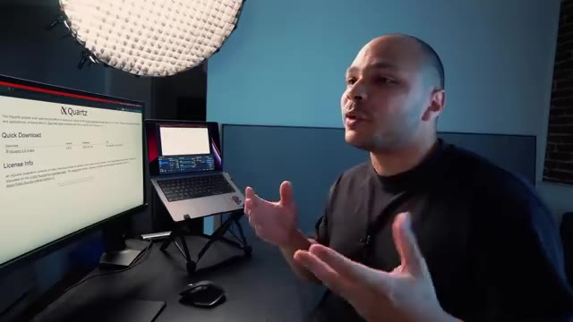
*📸 00:00:16 — Vue du poste de travail avec le moniteur externe affichant la documentation d'un outil open-source (Quartz) et le MacBook portable ouvert.*

---

### ⏱️ `[00:00:22 - 00:00:42]` | Segment #02

**🔊 Audio (Transcription Intégrale Mot pour Mot en Français) :**
> Donc par exemple sur Mac, pour pouvoir l'installer, on peut utiliser XQuartz. Donc là on peut soit l'installer ici, soit arriver et faire directement brou install xquartz. Ensuite il faut récupérer son adresse IP locale, donc là pour moi c'est 2.100. Et on va autoriser notre adresse IP à se connecter à notre serveur X, qui va être notre serveur de fenêtre.

**👁️ Analyse Visuelle d'Écran (gemini-3.5-flash-lite) :**
**Interface & Outils** : Terminal macOS (CLI).

**Contenu textuel & Code** : Invite de commande du terminal : `-2 repos %`.

**Action / Démonstration** : Présentation de la configuration d'un serveur X sur macOS pour du déport d'affichage graphique.

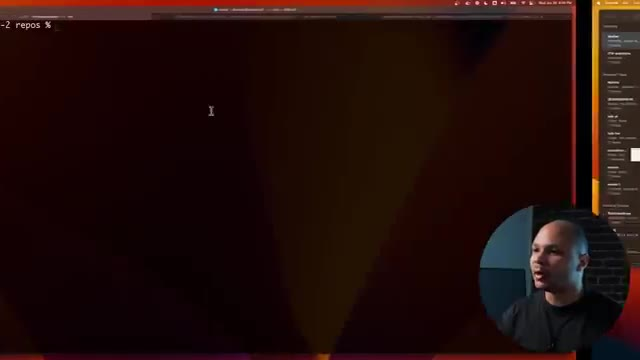
*📸 00:00:27 — Un terminal macOS affichant l'invite de commande, avec une incrustation vidéo du présentateur en bas à droite.*

---

### ⏱️ `[00:00:42 - 00:01:00]` | Segment #03

**🔊 Audio (Transcription Intégrale Mot pour Mot en Français) :**
> Donc pour ça on va faire xhost plus pour autoriser et l'adresse IP. Là ça me dit que mon adresse IP a été ajouté à la liste. Et ensuite je peux lancer ma commande Docker comme d'habitude avec une petite modification. c'est que ici je vais lancer un conteneur qui s'appelle Doom 2 pour pouvoir jouer à Doom, qui est une application qui a besoin d'une fenêtre pour pouvoir être utilisée.

**👁️ Analyse Visuelle d'Écran (gemini-3.5-flash-lite) :**
**Interface & Outils** : Terminal Unix / macOS (zsh sur l'hôte coca@canette-2)

**Contenu textuel & Code** : echo $ip (affiche 192.168.2.100), xhost + $ip (ajoute l'IP à la liste de contrôle d'accès X11)

**Action / Démonstration** : Configuration des permissions du serveur X11 pour permettre l'affichage graphique d'un conteneur Docker distant sur la machine hôte.

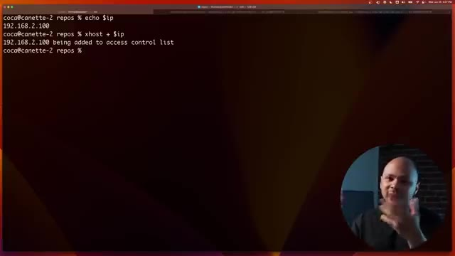
*📸 00:00:47 — Terminal Linux affichant la commande xhost pour autoriser l'adresse IP à accéder au serveur X11.*

---

### ⏱️ `[00:01:00 - 00:01:20]` | Segment #04

**🔊 Audio (Transcription Intégrale Mot pour Mot en Français) :**
> Et il y a deux arguments spéciaux que je vais rajouter. Un, je vais lui passer une variable d'environnement qui s'appelle Display. Et Display, ça va être mon IP 2.0 et utilise ça comme fenêtre. Et ensuite ici, je vais lui passer un volume qui va faire en sorte que X11 peut marcher en gros. Et donc si je fais ça, j'ai une nouvelle fenêtre qui s'ouvre ici, qui est en train de charger et qui est Doom.

**👁️ Analyse Visuelle d'Écran (gemini-3.5-flash-lite) :**
**Interface & Outils** : Bureau macOS avec une fenêtre de terminal X11/XQuartz active en haut à gauche et la webcam du présentateur en incrustation.

**Contenu textuel & Code** : Logs d'initialisation du jeu DOOM (vérification des WADs, allocation mémoire, chargement des graphismes) affichés dans une fenêtre graphique.

**Action / Démonstration** : Démonstration du résultat du conteneur Docker configuré avec la variable d'environnement DISPLAY et le partage de volume X11, permettant d'afficher une application graphique (jeu DOOM) sur l'hôte.

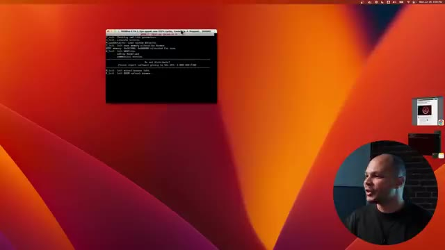
*📸 00:01:15 — Fenêtre graphique de terminal affichant l'exécution réussie de DOOM dans un conteneur via X11.*

---

### ⏱️ `[00:01:20 - 00:01:47]` | Segment #05

**🔊 Audio (Transcription Intégrale Mot pour Mot en Français) :**
> Et donc là, j'ai Doom qui tourne dans DOS Box, qui est animateur pour les vieux ordinateurs DOS. Et normalement, je peux faire une nouvelle partie. Voilà. Et si je me souviens bien, je crois que c'est 0 pour tirer. Bam, bam, bam, bam, bam. Allez, tiens, tiens, tiens, tiens ! Tu veux quoi, toi ? Bon, bref, tout ça pour dire que là, je suis en train de jouer à une application qui tourne dans Linux, dans un conteneur, alors que je suis sur macOS, et qui est visuel, qui est dans une fenêtre, et donc je peux interagir avec.

**👁️ Analyse Visuelle d'Écran (gemini-3.5-flash-lite) :**
**Interface & Outils** : Émulateur DOSBox 0.74-3 (interface de jeu DOS).

**Contenu textuel & Code** : Menu principal et phases de gameplay du jeu Doom 2 avec affichage des statistiques (munitions, santé, armure).

**Action / Démonstration** : Lancement et démonstration d'un jeu rétro (Doom 2) dans un environnement émulé sous DOSBox.

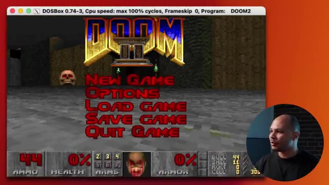
*📸 00:01:27 — Écran principal affichant le menu du jeu Doom 2 émulé dans DOSBox 0.74-3.*

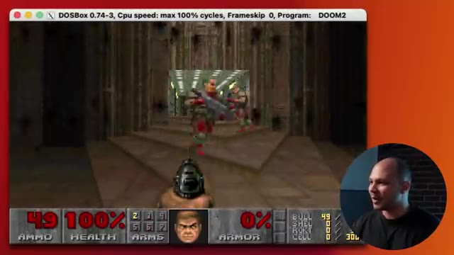
*📸 00:01:34 — Scène de gameplay de Doom 2 en cours d'exécution dans l'émulateur DOSBox, montrant le joueur face à des ennemis.*

---

### ⏱️ `[00:01:47 - 00:02:08]` | Segment #06

**🔊 Audio (Transcription Intégrale Mot pour Mot en Français) :**
> Donc là, bon, Doom, ce n'est pas super utile, même si ça peut être sympa pour certains jeux, des choses comme ça, qui peuvent tourner que sur Linux. Mais un truc qui peut être cool, c'est que par exemple, imagine que tu veux lancer une version particulière d'un navigateur pour débuguer qu'un bug qui est juste sur telle ou telle version de Firefox. Eh bien, je peux lancer Firefox dans Linux, choisir une version particulière en trouvant l'image qu'il y a besoin.

**👁️ Analyse Visuelle d'Écran (gemini-3.5-flash-lite) :**
**Interface & Outils** : Terminal de commande (shell) sur macOS avec une fenêtre active.

**Contenu textuel & Code** : Invite de commande du terminal : `coca@canette-2 repos %`.

**Action / Démonstration** : Le présentateur introduit l'utilisation pratique de conteneurs pour exécuter des versions spécifiques de logiciels (comme des navigateurs pour du débogage).

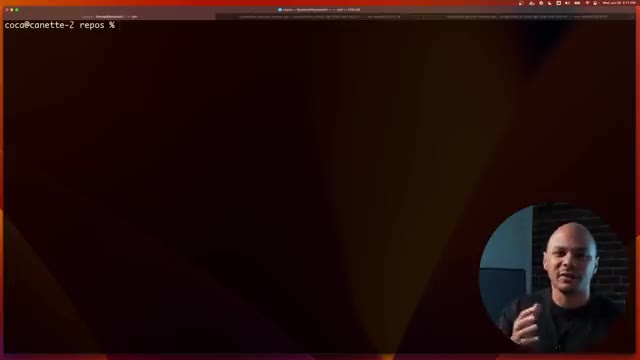
*📸 00:01:57 — Affichage d'un terminal de commande macOS dans un environnement de travail, avec le prompt utilisateur actif et une incrustation vidéo du présentateur.*

---

### ⏱️ `[00:02:08 - 00:02:31]` | Segment #07

**🔊 Audio (Transcription Intégrale Mot pour Mot en Français) :**
> Et là, de la même manière, j'ai une fenêtre qui est Mozilla Firefox, que je n'ai pas eu besoin d'installer sur mon ordi, de retrouver avec 19 versions, etc. Je peux faire tourner autant de versions en parallèle que ce que je veux d'autant de navigateurs. Donc là, je peux aller sur youtube.com slash coqadmin pour pouvoir aller m'abonner, pourquoi pas, quand ça aura fini de charger. D'ailleurs, comme vous voyez, on est proche des 200 000, donc ce serait le moment pour être peut-être le 200 000ème.

**👁️ Analyse Visuelle d'Écran (gemini-3.5-flash-lite) :**
**Interface & Outils** : Système d'exploitation hôte macOS avec affichage d'une application conteneurisée (Mozilla Firefox) et incrustation vidéo de l'orateur en bas à droite.

**Contenu textuel & Code** : Interface graphique du navigateur Firefox sur le bureau, barre d'adresse avec l'URL de la chaîne YouTube cocadmin.

**Action / Démonstration** : Démonstration de l'exécution d'une application de bureau (navigateur web) isolée sans installation locale directe sur l'ordinateur hôte.

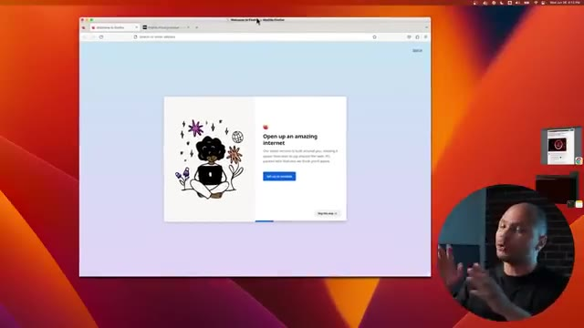
*📸 00:02:14 — Fenêtre du navigateur Mozilla Firefox affichant la page d'accueil d'installation, exécutée de manière isolée sur le système.*

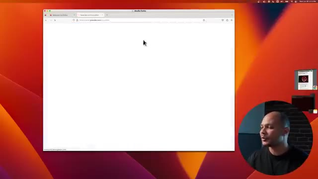
*📸 00:02:25 — Navigation vers l'URL youtube.com/cocadmin dans la fenêtre Mozilla Firefox isolée.*

---

### ⏱️ `[00:02:31 - 00:02:56]` | Segment #08

**🔊 Audio (Transcription Intégrale Mot pour Mot en Français) :**
> Et ce qui est cool aussi, c'est que là, si tu vois, je suis dans une version qui est x86, alors que je suis sur un MacBook M1 qui est un processeur ARM. C'est-à-dire que je peux lancer des applications qui sont en x86, qui vont être émulées par la machine virtuelle Docker et qui ont des fenêtres avec lesquelles je peux interagir, cliquer, etc. Donc c'est vraiment super stylé pour pouvoir tester différents types d'applications sans avoir rien à installer sur sa machine, même si on n'a pas le bon type de CPU, etc.

**👁️ Analyse Visuelle d'Écran (gemini-3.5-flash-lite) :**
**Interface & Outils** : Navigateur Web (interface de configuration de build/environnement), bureau macOS et fenêtre d'application GUI émulée.

**Contenu textuel & Code** : Menu de configuration d'environnement ("Build Configuration") et retour d'une application x86 s'exécutant de manière interactive au sein d'un conteneur ou d'une machine virtuelle Docker.

**Action / Démonstration** : Démonstration de l'interopérabilité et de la capacité de Docker à émuler et faire tourner des applications graphiques x86 sur un processeur Apple Silicon ARM (M1).

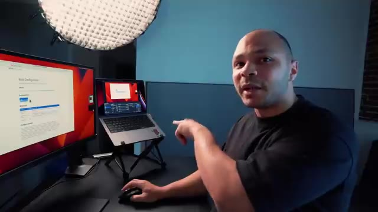
*📸 00:02:37 — Plan de l'espace de travail montrant un écran avec une page web de configuration technique ("Build Configuration") et un MacBook M1 exécutant une interface applicative graphique émulée.*

*📸 00:02:43 — Vue similaire du poste de travail avec le créateur expliquant le fonctionnement de l'émulation x86 sur l'architecture ARM du MacBook.*

---

### ⏱️ `[00:02:56 - 00:03:23]` | Segment #09

**🔊 Audio (Transcription Intégrale Mot pour Mot en Français) :**
> Et donc, comme certains d'entre vous savent, moi, quand j'ai commencé mes vidéos, les plus anciens d'entre vous se souviendront que j'ai commencé en faisant des tutos Docker. Salut à tous, si vous cherchez un tuto pour découvrir les bases de Docker, vous êtes au bon endroit. Donc je suis super content aujourd'hui de faire une vidéo en partenariat avec Docker carrément. Et donc depuis le temps il y a quand même pas mal de petites fonctionnalités en plus et de petites astuces sympas qui ont été ajoutées à Docker. Donc c'est l'occasion de découvrir tout ça ensemble.

**👁️ Analyse Visuelle d'Écran (gemini-3.5-flash-lite) :**
**Interface & Outils** : Aucune interface technique ou console active affichée.

**Contenu textuel & Code** : Aucun code, commande ou architecture visible.

**Action / Démonstration** : Introduction de la vidéo et rappel historique sur les débuts de la chaîne avec les tutoriels Docker.

---

### ⏱️ `[00:03:23 - 00:04:00]` | Segment #10

**🔊 Audio (Transcription Intégrale Mot pour Mot en Français) :**
> Une autre astuce qui vient d'être ajoutée il n'y a pas si longtemps que ça dans Docker, c'est la commande Docker init. Et cette commande est assez stylée parce que parfois on a une application peut-être parce que c'est une vieille appli ou alors c'est un nouveau projet et c'est un peu chiant, on a un petit peu la flemme de dockeriser cette application parce qu'il faut créer un docker file, il faut créer un docker compose, il faut aller se re-souvenir de toutes les options etc. Mais cette option, elle permet de faire tout ça automatiquement tout seul. Donc là par exemple je viens de cloner une application qui est une application d'exemple en python. Donc j'ai simplement tapé docker init et là ça va me dire bah on va te créer un docker ignore, un docker file,

**👁️ Analyse Visuelle d'Écran (gemini-3.5-flash-lite) :**
**Interface & Outils** : Terminal Linux / macOS.

**Contenu textuel & Code** : `git clone https://github.com/mishankov/flask-gunicorn-sample-app.git`

**Action / Démonstration** : Clonage d'un projet d'application d'exemple pour préparer sa dockerisation.

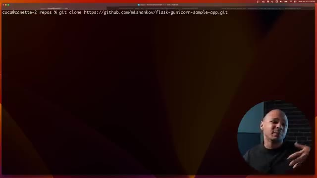
*📸 00:03:32 — Terminal affichant la commande git clone d'un dépôt d'exemple Flask/Gunicorn.*

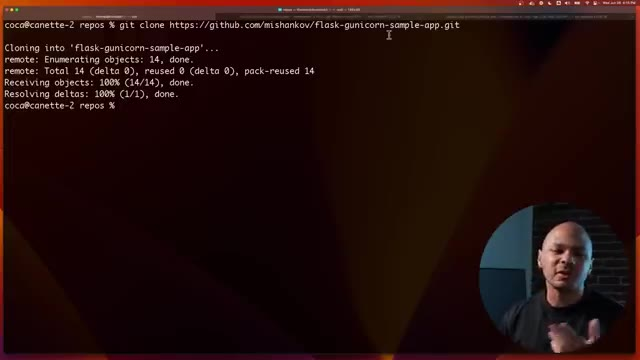
*📸 00:03:51 — Terminal affichant la fin du clonage réussi du dépôt git.*

---

### ⏱️ `[00:04:00 - 00:04:33]` | Segment #11

**🔊 Audio (Transcription Intégrale Mot pour Mot en Français) :**
> un docker compose et même un petit remy pour savoir comment utiliser. Et juste après ça me pose quelques petites questions avec des défauts qui sont un petit peu intelligents. Donc là, il m'a dit qu'il m'a détecté que mon application était une application Python, ce qui est le cas. Donc, j'ai même pas besoin de changer. Mais si jamais j'avais une application un peu compliquée où il y avait deux projets, deux applis ou quoi, j'aurais pu choisir vraiment c'était lequel que j'avais besoin. Donc là, Python, ok. Quelle version de Python tu veux utiliser ? 3.10, moi ça me va. Quel port tu veux utiliser ? Le port UIL, pourquoi pas ? Et là, il me dit quelle commande tu voudrais utiliser pour pouvoir lancer ton application dans le conteneur. Donc ça, c'est normalement, en tant que développeur, je suis censé savoir ça. Mais il me propose quand même quelque chose,

**👁️ Analyse Visuelle d'Écran (gemini-3.5-flash-lite) :**
**Interface & Outils** : Présentation ou face-caméra sans interface informatique partagée.

**Contenu textuel & Code** : Explications orales des concepts, architectures et retours d'expérience.

**Action / Démonstration** : Démonstration pédagogique et mise en perspective technique.

---

### ⏱️ `[00:04:33 - 00:05:05]` | Segment #12

**🔊 Audio (Transcription Intégrale Mot pour Mot en Français) :**
> chose qui fait du sens d'utiliser un unicorn WSJ bla bla bla. Moi je vais juste changer un petit truc parce que je sais que cette application en particulier il faut rajouter deux points app ici parce que c'est le nom d'application c'est une application flasque. Entrée et bam boum bim ça m'a tout créé déjà. Mes Dockerfiles sont ready et donc si je fais lsla et bah je vois que j'ai mes nouveaux fichiers qui ont été créés mon Dockerfile mon readme etc. Donc si je veux on va regarder par exemple mon Dockerfile ça m'a créé automatiquement un Dockerfile qui utilise Python 3.10.9.

**👁️ Analyse Visuelle d'Écran (gemini-3.5-flash-lite) :**
**Interface & Outils** : Présentation ou face-caméra sans interface informatique partagée.

**Contenu textuel & Code** : Explications orales des concepts, architectures et retours d'expérience.

**Action / Démonstration** : Démonstration pédagogique et mise en perspective technique.

---

### ⏱️ `[00:05:05 - 00:05:27]` | Segment #13

**🔊 Audio (Transcription Intégrale Mot pour Mot en Français) :**
> Ça m'a automatiquement mis toutes les bonnes pratiques. Le fait de ne pas utiliser l'utilisateur root, etc. De configurer le WGI, les mounts, l'user, blablabla. Et ma commande. Donc ça m'a tout fait. Je n'ai rien eu à faire. On peut voir aussi le Docker Compose. Ça m'a créé un service qui m'expose le port 8000 automatiquement. Et ça m'a même rajouté en commentaire si jamais j'ai besoin.

**👁️ Analyse Visuelle d'Écran (gemini-3.5-flash-lite) :**
**Interface & Outils** : Présentation ou face-caméra sans interface informatique partagée.

**Contenu textuel & Code** : Explications orales des concepts, architectures et retours d'expérience.

**Action / Démonstration** : Démonstration pédagogique et mise en perspective technique.

---

### ⏱️ `[00:05:27 - 00:05:46]` | Segment #14

**🔊 Audio (Transcription Intégrale Mot pour Mot en Français) :**
> Je peux rajouter une base de données. Naïk m'a dit, pourquoi pas si tu veux une base de données Postgre. Tu as juste à décommenter ça. Et boum, tu la dirais. C'est vraiment un truc qui peut faire gagner beaucoup de temps. Donc ça fait que maintenant, je peux simplement faire Docker Compose. Et ça va me lancer mon application. Donc là, boum, ça crée mon image avec le Dockerfile. Et crée un conteneur à partir de cette image.

**👁️ Analyse Visuelle d'Écran (gemini-3.5-flash-lite) :**
**Interface & Outils** : Présentation ou face-caméra sans interface informatique partagée.

**Contenu textuel & Code** : Explications orales des concepts, architectures et retours d'expérience.

**Action / Démonstration** : Démonstration pédagogique et mise en perspective technique.

---

### ⏱️ `[00:05:46 - 00:06:06]` | Segment #15

**🔊 Audio (Transcription Intégrale Mot pour Mot en Français) :**
> Et ça m'a lancé mon application dans ce conteneur. Et là, l'application, elle tourne. Donc là, en théorie, si je vais sur mon port 8000, sur localhost, 2.8000. Boum, j'ai mon appli qui tourne là. Amflask, ASD, ASD. C'est mon application d'exemple. Elle tourne, elle fonctionne. et tout ça dans Docker, dans Docker Compose. Et ça m'a créé une image qui peut être prête à envoyer dans un répertoire, etc.

**👁️ Analyse Visuelle d'Écran (gemini-3.5-flash-lite) :**
**Interface & Outils** : Navigateur web Google Chrome.

**Contenu textuel & Code** : - Image 1 : Site officiel de XQuartz (xquartz.org).
- Image 2 : Message de l'application Flask : "Hello. I'm flask, asdsad" à l'adresse `http://localhost:8000`.

**Action / Démonstration** : Validation du démarrage et du bon fonctionnement de l'application Python Flask s'exécutant dans un conteneur Docker en interrogeant le port exposé 8000 en local.

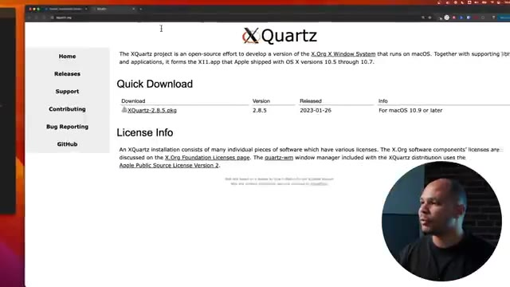
*📸 00:05:51 — Page d'accueil du projet open-source XQuartz (X.Org X Window System pour macOS) affichant le lien de téléchargement de la version 2.8.5.*

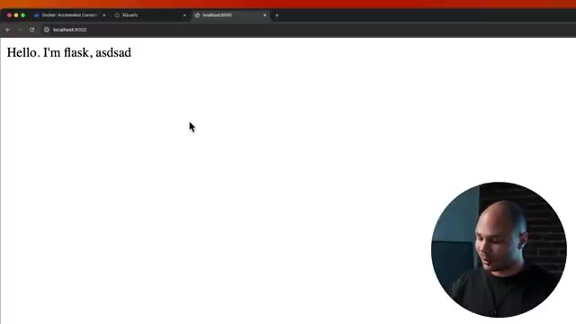
*📸 00:05:56 — Navigateur web affichant le rendu de l'application de démonstration Flask accessible sur localhost sur le port 8000.*

---

### ⏱️ `[00:06:07 - 00:06:28]` | Segment #16

**🔊 Audio (Transcription Intégrale Mot pour Mot en Français) :**
> Tout ça en genre une commande Docker init, boom, boom, c'était fini. Une autre fonction que tu ne connectes pas, qui vient d'être ajoutée récemment aussi, c'est Docker Compose Watch. Et un truc qui est chiant quand tu utilises des conteneurs pour développer, c'est que si tu fais des modifications, soit il faut que tu aies un volume qui soit monté dans ton conteneur, et donc du coup, ce n'est pas vraiment ce qu'il y a dans l'image, soit il faut que tu rebuild toute l'image à chaque fois que tu fais une modification.

**👁️ Analyse Visuelle d'Écran (gemini-3.5-flash-lite) :**
**Interface & Outils** : Terminal de commande, macOS, OBS Studio sur l'ordinateur portable.

**Contenu textuel & Code** : Interface de terminal sombre (non lisible en détail sur ce plan large).

**Action / Démonstration** : Explication théorique et présentation générale de Docker Compose Watch et des problématiques de volumes montés pour le développement.

*📸 00:06:18 — Vue de profil du poste de travail montrant un ordinateur portable surélevé et un écran externe affichant un terminal en arrière-plan.*

---

### ⏱️ `[00:06:28 - 00:06:49]` | Segment #17

**🔊 Audio (Transcription Intégrale Mot pour Mot en Français) :**
> Et ça, ça peut être un petit peu chiant dans certains cas. Et Docker Watch, ça peut résoudre ce problème. Donc là, par exemple, si je vais dans mon Compose, je vois mon service ici. Je vais lui rajouter une petite option qui s'appelle Develop. Et Develop, ça va faire en sorte que là, je suis dans mon environnement de développement, je suis sur mon ordi. Et bien, tu vas watcher, tu vas surveiller un répertoire en question.

**👁️ Analyse Visuelle d'Écran (gemini-3.5-flash-lite) :**
**Interface & Outils** : Terminal Unix (zsh)

**Contenu textuel & Code** : `coca@canette-2 flask-gunicorn-sample-app % `

**Action / Démonstration** : Navigation dans l'arborescence du projet pour préparer la modification du fichier Docker Compose.

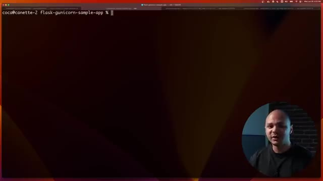
*📸 00:06:33 — Terminal ouvert dans le répertoire du projet flask-gunicorn-sample-app sur une machine macOS, avec incrustation vidéo du présentateur.*

---

### ⏱️ `[00:06:49 - 00:07:09]` | Segment #18

**🔊 Audio (Transcription Intégrale Mot pour Mot en Français) :**
> Là, je vais surveiller le répertoire Slash App, parce que c'est là où est mon application, là où je vais faire mes modifications. Et je vais lui dire, quand tu vois qu'il y a un changement qui est fait dans un des fichiers de ce répertoire, et bien tu vas synchroniser les fichiers et restarter le conteneur. Il y a deux ou trois actions. Tu peux demander de rebuilder complètement le conteneur de zéro, tu peux demander de juste restarter le conteneur si tu as déjà un volume qui est synchronique, etc.

**👁️ Analyse Visuelle d'Écran (gemini-3.5-flash-lite) :**
**Interface & Outils** : Présentation ou face-caméra sans interface informatique partagée.

**Contenu textuel & Code** : Explications orales des concepts, architectures et retours d'expérience.

**Action / Démonstration** : Démonstration pédagogique et mise en perspective technique.

---

### ⏱️ `[00:07:10 - 00:07:28]` | Segment #19

**🔊 Audio (Transcription Intégrale Mot pour Mot en Français) :**
> Ou tu peux demander de juste synchroniser. Synchroniser, ça peut être bien si ton application, automatiquement, elle détecte les changements et elle réfraîche la page. Si c'est une webapp, par exemple, moi, comme c'est une simple app flasque, elle détecte rien du tout, elle fait juste un hello world, si tu veux. Donc, je vais lui dire que tu vas synchroniser, c'est-à-dire changer les fichiers, et tu vas restarter.

**👁️ Analyse Visuelle d'Écran (gemini-3.5-flash-lite) :**
**Interface & Outils** : Écran de monitoring et ordinateur portable en arrière-plan flou.

**Contenu textuel & Code** : Fichier de configuration docker-compose visible partiellement sur le moniteur de gauche.

**Action / Démonstration** : Explication théorique sur la synchronisation des applications et la gestion des conteneurs.

---

### ⏱️ `[00:07:28 - 00:07:46]` | Segment #20

**🔊 Audio (Transcription Intégrale Mot pour Mot en Français) :**
> Et ça, c'est sans avoir besoin de rebuilder toute l'image. Donc, c'est beaucoup plus rapide. Donc, on s'en va regarder ici. On va voir un nouvel onglet. Ici, on va faire Docker Compose Watch. Donc là, j'ai mon application qui tourne actuellement. Donc là, mon répertoire, il est en train d'être surveillé. Et pourquoi j'ai mis Slash App ? Parce que Slash App, c'est le répertoire dans le conteneur qui s'appelle comme ça.

**👁️ Analyse Visuelle d'Écran (gemini-3.5-flash-lite) :**
**Interface & Outils** : Terminal macOS (CLI)

**Contenu textuel & Code** : Message de connexion : "Last login: Wed Jun 26 16:20:09 on ttys005"

**Action / Démonstration** : Préparation de l'ouverture d'un nouvel onglet de terminal pour lancer la commande Docker Compose Watch.

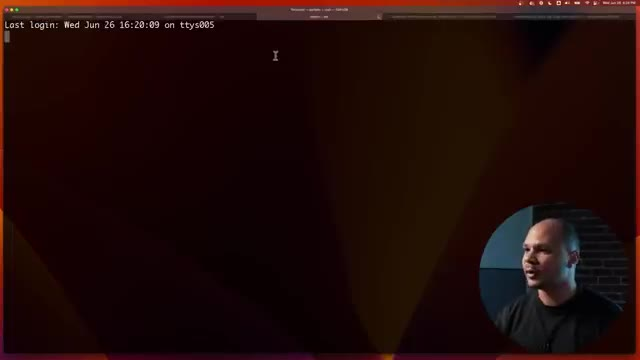
*📸 00:07:32 — Un terminal de commande macOS affichant l'historique de connexion, avec une pastille vidéo du présentateur en bas à droite.*

---

### ⏱️ `[00:07:46 - 00:08:10]` | Segment #21

**🔊 Audio (Transcription Intégrale Mot pour Mot en Français) :**
> Et c'est là où il y a mon application. Ce qui fait que si maintenant, je viens ici et je viens modifier mon testapp.pi, là, de le dire Hello, I'm Flask, Je vais lui dire subscribe to coqadmin avec un seul C. J'enregistre. Là, ici, ça m'a dit, ah, j'ai détecté que tu as changé le test.app.

**👁️ Analyse Visuelle d'Écran (gemini-3.5-flash-lite) :**
**Interface & Outils** : Présentation ou face-caméra sans interface informatique partagée.

**Contenu textuel & Code** : Explications orales des concepts, architectures et retours d'expérience.

**Action / Démonstration** : Démonstration pédagogique et mise en perspective technique.

---

### ⏱️ `[00:08:10 - 00:08:32]` | Segment #22

**🔊 Audio (Transcription Intégrale Mot pour Mot en Français) :**
> Et donc, je vais synchroniser mes fichiers et redémarrer le conteneur pour que tu puisses accéder à la nouvelle version automatiquement sans que tu fasses rien. Ce qui fait que si je reviens dans mon navigateur ici et que je fais refresh, j'ai hello and flask subscribe to coqadmin. Bim bam boum. Plus besoin de se casser la tête avec des volumes ou quoi. ou avec des systèmes d'auto-refresh, Docker Watch, ça le fait tout seul.

**👁️ Analyse Visuelle d'Écran (gemini-3.5-flash-lite) :**
**Interface & Outils** : Navigateur web (Google Chrome / Safari) affichant localhost sur un port local.

**Contenu textuel & Code** : Texte affiché dans la page web : "Hello. I'm flask, subscribe to cocadmin".

**Action / Démonstration** : Test et validation dans le navigateur du bon fonctionnement de l'application Flask suite au redémarrage et à la synchronisation automatique du conteneur.

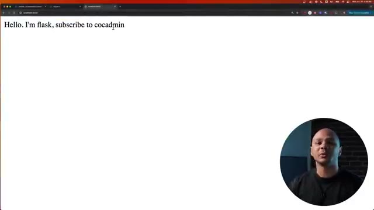
*📸 00:08:21 — Navigateur web affichant le résultat de l'application Flask avec le texte mis à jour "Hello. I'm flask, subscribe to cocadmin" et la caméra du créateur en incrustation.*

---

### ⏱️ `[00:08:32 - 00:08:55]` | Segment #23

**🔊 Audio (Transcription Intégrale Mot pour Mot en Français) :**
> Une autre nouvelle option, il ne chante pas un Docker, il rajoute quand même des nouveaux trucs. Ça s'appelle Docker Debug. C'est grave utile si tu travailles beaucoup avec des conteneurs et que tu as souvent des trucs qui ne vont pas, tu dois essayer de débuguer, des trucs comme ça. Ça te permet de rentrer dans un conteneur et d'essayer de voir ce qui ne va pas. Donc là, je vais lancer un conteneur Docker Run-D pour lancer en arrière-plan, Tiret Name pour l'appeler mon site, par exemple.

**👁️ Analyse Visuelle d'Écran (gemini-3.5-flash-lite) :**
**Interface & Outils** : Terminal de commande macOS (Zsh)

**Contenu textuel & Code** : Invite de commande affichant `coca@canette-2 repos % docker run` avec le curseur actif.

**Action / Démonstration** : Saisie et démonstration d'une commande Docker dans le terminal pour illustrer l'utilisation des conteneurs.

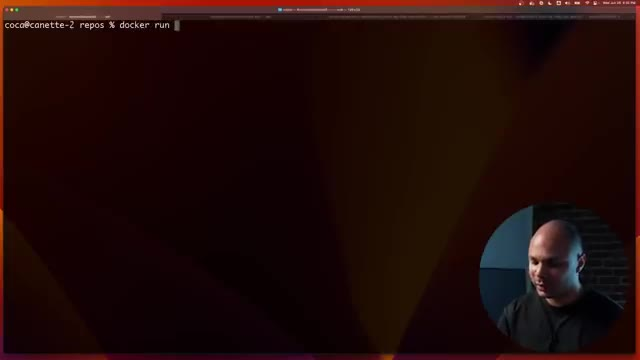
*📸 00:08:49 — Capture d'écran d'un terminal de commande montrant l'utilisation de Docker avec l'invite de commande utilisateur.*

---

### ⏱️ `[00:08:55 - 00:09:22]` | Segment #24

**🔊 Audio (Transcription Intégrale Mot pour Mot en Français) :**
> Et ça va être le conteneur qui s'appelle Nginx. Voilà, je ne sais jamais trop comment écrire. Et normalement, ça devrait me lancer en arrière-plan. Si je fais Docker PS, j'ai mon conteneur qui s'appelle Nginx qui vient d'être lancé. Imagine que dans ce conteneur-là, j'ai un problème. D'habitude, la façon de faire, ça serait de faire Docker exec-ti, mon site pour pouvoir entrer dans ce conteneur qui a ce nom, et de lancer Bash.

**👁️ Analyse Visuelle d'Écran (gemini-3.5-flash-lite) :**
**Interface & Outils** : Terminal macOS (zsh)

**Contenu textuel & Code** : coca@canette-2 repos % docker ex

**Action / Démonstration** : Saisie d'une commande Docker dans le terminal pour interagir avec un conteneur Nginx.

*📸 00:09:15 — Terminal macOS affichant une ligne de commande Docker en cours de saisie.*

---

### ⏱️ `[00:09:22 - 00:09:41]` | Segment #25

**🔊 Audio (Transcription Intégrale Mot pour Mot en Français) :**
> Là, je suis dans le conteneur. J'aurais voulu pouvoir faire PS pour pouvoir voir la liste des processus qui tournent. Mais je ne fais pas parce que c'est un conteneur qui a été minifié. Donc, en fait, il n'y a pas grand-chose dedans. Tu vois, si je vais ici et que je veux voir, par exemple, le entrypoint, si je fais vdocker entrypoint.sh, eh bien, v, ce n'est pas notre file non plus. Donc, en fait, je peux rentrer, mais c'est chiant.

**👁️ Analyse Visuelle d'Écran (gemini-3.5-flash-lite) :**
**Interface & Outils** : Présentation ou face-caméra sans interface informatique partagée.

**Contenu textuel & Code** : Explications orales des concepts, architectures et retours d'expérience.

**Action / Démonstration** : Démonstration pédagogique et mise en perspective technique.

---

### ⏱️ `[00:09:41 - 00:10:04]` | Segment #26

**🔊 Audio (Transcription Intégrale Mot pour Mot en Français) :**
> Là, j'ai eu de la chance qu'il y avait bash dans l'image du conteneur et que je puisse me connecter. Parfois, tu n'as pas bash, tu n'as PSH, donc tu as l'autocomplétion qui ne marche pas ou parfois, tu n'as même pas SH. C'est vraiment chiant. Et surtout, tu n'as aucun des outils que tu as besoin pour pouvoir commencer à débugger. Tu ne peux même pas éditer un fichier si tu as besoin. Tu ne peux même pas voir ce qui se passe. Donc, ça veut dire que d'habitude, pour pouvoir régler ce problème-là, tu te retrouves à réinstaller pour la cinquantième fois.

**👁️ Analyse Visuelle d'Écran (gemini-3.5-flash-lite) :**
**Interface & Outils** : Écran de bureau et terminal affichant des lignes de commande en environnement Linux / Docker.

**Contenu textuel & Code** : Commandes Docker exécutées dans le terminal et affichage des répertoires du conteneur.

**Action / Démonstration** : Explication des difficultés de débogage et d'accès aux conteneurs légers ne disposant pas de shell complet.

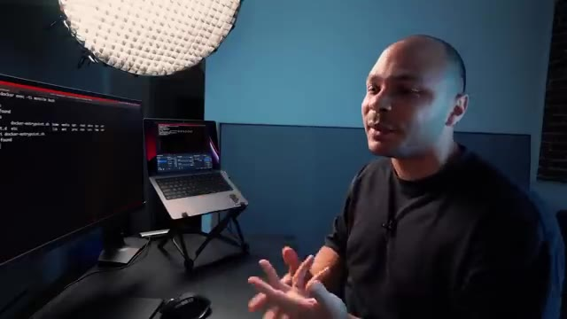
*📸 00:09:58 — Vue du créateur en studio avec un écran externe affichant un terminal de commande et un ordinateur portable en arrière-plan.*

---

### ⏱️ `[00:10:04 - 00:10:29]` | Segment #27

**🔊 Audio (Transcription Intégrale Mot pour Mot en Français) :**
> APT, install, vim, c'est trop chiant. À la place, on peut utiliser la commande docker-debug, parce que c'est ce que je veux faire. Je vais débugger et mon site, parce que c'est comme ça que ça s'appelle mon conteneur. Je vais débugger mon conteneur qui s'appelle mon site. Et là, ce que ça va faire, c'est que ça va prendre une image spécialement faite par Docker Donc ça va monter tout le file system et tout le nivespace dans mon conteneur où j'ai tout ce qu'il faut pour pouvoir débugger, etc.

**👁️ Analyse Visuelle d'Écran (gemini-3.5-flash-lite) :**
**Interface & Outils** : Terminal Linux

**Contenu textuel & Code** : Commandes 'docker ps' et 'docker debug', affichage de la liste des conteneurs dont 'monsite' (basé sur nginx) et un conteneur flask-gunicorn.

**Action / Démonstration** : Listage des conteneurs Docker actifs pour identifier la cible à déboguer et initialisation de la commande docker debug.

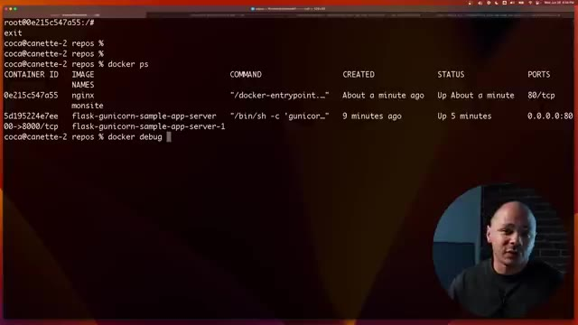
*📸 00:10:10 — Terminal affichant l'exécution de la commande docker ps listant les conteneurs en cours d'exécution, puis la saisie de la commande docker debug.*

---

### ⏱️ `[00:10:29 - 00:10:52]` | Segment #28

**🔊 Audio (Transcription Intégrale Mot pour Mot en Français) :**
> Donc là, tu vois, j'ai un shell. Si je fais ls, je retrouve, tu vois, mes entry points, etc. Et donc là, je peux bien faire mon vim docker entry point.sh. J'ai même une commande directement qui s'appelle entry point et qui permet d'expliquer dans ce conteneur-là qu'est-ce qui a été configuré en tant que CMD et en tant qu'entry point. alors que si je n'avais pas ça, c'est-à-dire qu'il faut que j'aille voir dans les sources de l'image, de retrouver sur GitHub ou je ne sais pas quoi.

**👁️ Analyse Visuelle d'Écran (gemini-3.5-flash-lite) :**
**Interface & Outils** : Présentation ou face-caméra sans interface informatique partagée.

**Contenu textuel & Code** : Explications orales des concepts, architectures et retours d'expérience.

**Action / Démonstration** : Démonstration pédagogique et mise en perspective technique.

---

### ⏱️ `[00:10:52 - 00:11:13]` | Segment #29

**🔊 Audio (Transcription Intégrale Mot pour Mot en Français) :**
> Bref, tu vas perdre 5 minutes. Là, je l'ai direct. Et surtout, j'ai tous mes outils. Je peux faire PS, Nano, j'ai tous les outils que j'ai besoin de base pour pouvoir savoir ce qui se passe, débugger, trouver l'entrepont, voir ce qu'il y a à l'intérieur de cette image-là. Tout ça avec la simple commande Docker Debug, qui est mille fois plus simple que docker exec-ti slash bin slash base.

**👁️ Analyse Visuelle d'Écran (gemini-3.5-flash-lite) :**
**Interface & Outils** : Terminal Linux / iTerm2 sur écran externe, IDE ou console de debug.

**Contenu textuel & Code** : Logs d'exécution Docker, messages d'erreur de ENTRYPOINT, commandes shell interactives (zsh, ps).

**Action / Démonstration** : Explication de l'utilisation de Docker Debug pour inspecter et dépanner rapidement une image conteneurisée.

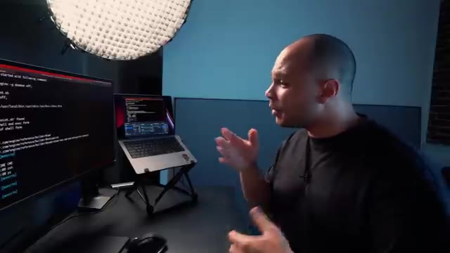
*📸 00:11:03 — Vue de profil du créateur présentant son écran avec un terminal montrant des logs de debug Docker et des commandes shell.*

---

### ⏱️ `[00:11:14 - 00:11:34]` | Segment #30

**🔊 Audio (Transcription Intégrale Mot pour Mot en Français) :**
> C'est mille fois mieux. Le seul bémol entre guillemets c'est que Docker Debug c'est disponible que si tu as la version pro de Docker. Pour 5 dollars par mois c'est à dire genre 4 euros. Et à mon avis si tu manipules beaucoup de conteneurs tous les jours juste pour cette feature ça vaut largement les 4 euros par mois. Ensuite puisqu'on est dans les nouvelles features on va continuer avec Docker Scout.

**👁️ Analyse Visuelle d'Écran (gemini-3.5-flash-lite) :**
**Interface & Outils** : Navigateur web affichant la page de tarification (pricing) de Docker.

**Contenu textuel & Code** : Tableau comparatif des abonnements Docker : Personal à 0$, Pro à 5$ par mois incluant notamment la fonctionnalité "Docker Debug", Team à 9$ et Business à 24$.

**Action / Démonstration** : Présentation des différents plans tarifaires de Docker pour illustrer le coût de la version Pro nécessaire à l'utilisation de Docker Debug.

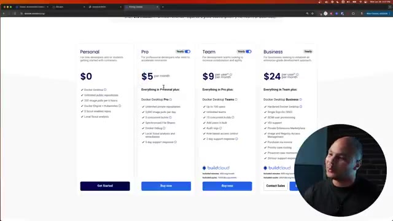
*📸 00:11:24 — Capture d'écran du navigateur affichant la grille des tarifs officiels de Docker, montrant les offres Personal ($0), Pro ($5/mois), Team ($9/mois) et Business ($24/mois).*

---

### ⏱️ `[00:11:34 - 00:12:04]` | Segment #31

**🔊 Audio (Transcription Intégrale Mot pour Mot en Français) :**
> Qui est un outil qui va permettre de fouiller dans les images pour voir non seulement s'il y a des vulnérabilités dedans. Mais surtout à quel endroit est cette vulnérabilité. parce que souvent quand tu crées une image, elle est basée sur une autre image qui elle-même est peut-être basée sur une autre image et en fait la vulnérabilité elle peut être trois images plus haut. Donc parfois ça peut être difficile de savoir qui ou quoi a introduit quelle faille à quel endroit. Avec Docker Scout on peut très facilement voir d'où ça vient, comparer différentes versions etc. On peut faire ici Docker Scout Quick View pour pouvoir voir qu'est ce qui se passe.

**👁️ Analyse Visuelle d'Écran (gemini-3.5-flash-lite) :**
**Interface & Outils** : AUCUNE

**Contenu textuel & Code** : AUCUN

**Action / Démonstration** : Explication orale sur l'analyse de vulnérabilités dans les images conteneurs.

---

### ⏱️ `[00:12:04 - 00:12:36]` | Segment #32

**🔊 Audio (Transcription Intégrale Mot pour Mot en Français) :**
> Et là ça me donne un petit résumé de c'est quoi les problèmes de sécurité potentiels que peut y y avoir dans mon image d'exemple la flasque que j'utilisais tout à l'heure. Donc là ça me dit qu'il y a 0 faille critique, ça va, mais il y a quand même 6 failles qui sont de type high qui sont quand même un peu gênantes, 14 médium et 23 low. Donc bon en général je dirais que les médium et les low ça va être des trucs quand même tu vois assez durs à exploiter mais les high si on pouvait les diminuer ça pourrait être bien. Et donc là ça me dit qu'en fait ça vient de l'image

**👁️ Analyse Visuelle d'Écran (gemini-3.5-flash-lite) :**
**Interface & Outils** : Terminal Linux (zsh) sur macOS avec incrustation vidéo du présentateur.

**Contenu textuel & Code** : Commande `docker scout quickview` affichant un tableau récapitulatif des failles de sécurité (Critical: 0, High: 6, Medium: 14, Low: 23) pour l'image `flask-gunicorn-sample-app-server:latest` basée sur `python:3.10-slim`, ainsi que des recommandations de mise à jour vers `python:3.12-slim`.

**Action / Démonstration** : Analyse rapide de la sécurité d'une image Docker pour identifier les vulnérabilités et comparer l'impact d'une mise à jour de l'image de base.

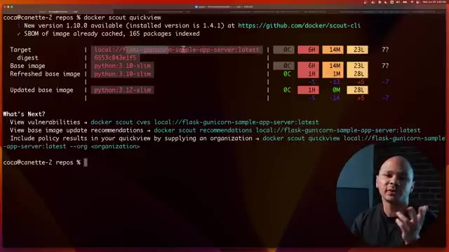
*📸 00:12:12 — Exécution de la commande Docker Scout pour analyser les vulnérabilités d'une image conteneurisée.*

---

### ⏱️ `[00:12:36 - 00:13:02]` | Segment #33

**🔊 Audio (Transcription Intégrale Mot pour Mot en Français) :**
> de base de Python 3.10 Slim. C'est celle-là qui rajoute le plus de problèmes. Et il me fait même une suggestion. Il me dit bon là tu utilises 3.10 Slim mais ce que tu pourrais faire c'est simplement passer sur 3.12. Tu serais toujours sur une version Slim, tu serais toujours sur Python. Probablement que de 10 à 12 tu n'auras pas trop de problèmes d'incompatibilité mais tu vas réduire à une seule vulnérabilité high, 0 médium et tu vas garder 28 lots quand même.

**👁️ Analyse Visuelle d'Écran (gemini-3.5-flash-lite) :**
**Interface & Outils** : Présentation ou face-caméra sans interface informatique partagée.

**Contenu textuel & Code** : Explications orales des concepts, architectures et retours d'expérience.

**Action / Démonstration** : Démonstration pédagogique et mise en perspective technique.

---

### ⏱️ `[00:13:02 - 00:13:21]` | Segment #34

**🔊 Audio (Transcription Intégrale Mot pour Mot en Français) :**
> En fait même c'est pire parce que là il te dit t'as plus 5. T'as moins 5, moins 14 et plus 5. Donc bon c'est à toi de voir si tu veux rajouter des lots pour enlever des rags mais je pense que ça vaut le coup. Si on veut un petit peu plus d'infos sur ok tu me dis qu'il y a des failles etc mais j'aimerais bien savoir qu'est-ce que c'est. Ça se trouve c'est pas si grave que ça. Donc on peut faire ici CVE.

**👁️ Analyse Visuelle d'Écran (gemini-3.5-flash-lite) :**
**Interface & Outils** : Terminal Linux / CLI Docker Scout

**Contenu textuel & Code** : Sortie de la commande `docker scout` affichant des métriques de vulnérabilités par sévérité (carrés rouge/orange/vert) et des recommandations de mise à jour d'images.

**Action / Démonstration** : Explication et analyse des résultats d'audit de sécurité des conteneurs via Docker Scout, illustrant les failles détectées.

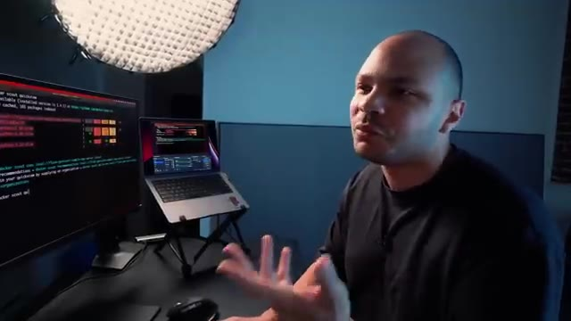
*📸 00:13:16 — Vue de profil du créateur avec un écran d'ordinateur montrant un terminal affichant les résultats de Docker Scout et l'analyse de vulnérabilités.*

---

### ⏱️ `[00:13:21 - 00:13:45]` | Segment #35

**🔊 Audio (Transcription Intégrale Mot pour Mot en Français) :**
> Donc CVE c'est le nom des failles. Là ça me donne toutes les différentes failles avec directement le lien pour aller voir c'est quoi le problème. Donc là si je vois par exemple ça, tac, on va aller voir qu'est-ce que c'est. Donc là, cette file est sortie en 2023 et c'est un problème avec OpenSSL. Donc là, ça me dit qu'avec cette version spécifique d'OpenSSL, on pourrait faire une dinguerie avec les certificats.

**👁️ Analyse Visuelle d'Écran (gemini-3.5-flash-lite) :**
**Interface & Outils** : Terminal Linux et navigateur web (interface Docker Scout)

**Contenu textuel & Code** : Rapports de vulnérabilités listant des CVE (HIGH CVE-2023-0464, CVE-2023-0286) ciblant des paquets OpenSSL sur Debian avec les versions affectées et corrigées.

**Action / Démonstration** : Explication et analyse des vulnérabilités de sécurité (CVE) détectées sur une image conteneurisée à l'aide de Docker Scout, avec consultation des liens détaillés.

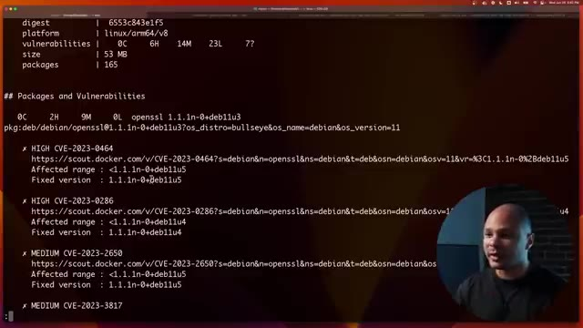
*📸 00:13:27 — Terminal Linux affichant le rapport de vulnérabilités de Docker Scout avec le détail des CVE (dont CVE-2023-0464 sur OpenSSL).*

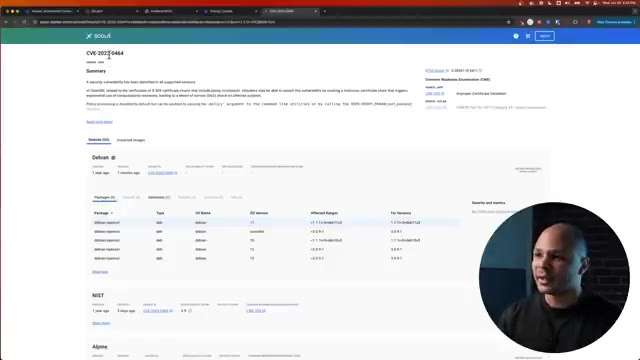
*📸 00:13:33 — Navigateur web affichant l'interface de Docker Scout avec les détails de la vulnérabilité CVE-2023-0464 et les packages Debian affectés.*

---

### ⏱️ `[00:13:45 - 00:14:09]` | Segment #36

**🔊 Audio (Transcription Intégrale Mot pour Mot en Français) :**
> Donc c'est quand même assez high. Maintenant, c'est à toi de voir. Peut-être que dans ton application, tu n'utilisent jamais OpenSSL. Et donc, ce n'est pas vraiment un problème pour toi. Mais peut-être que oui. Donc tu vois, c'est comme ça que tu peux savoir qu'est-ce qui est un problème ou pas en regardant la liste de tous les problèmes potentiels qu'il peut y avoir dans ton image. Un autre truc qui est cool aussi, c'est que comme on a vu dans le Quick View, on peut faire Recommendations. Par contre, il faut savoir l'écrire et Recommendations, c'est avec deux M.

**👁️ Analyse Visuelle d'Écran (gemini-3.5-flash-lite) :**
**Interface & Outils** : Terminal Linux, interface CLI Docker Scout, écran externe et ordinateur portable.

**Contenu textuel & Code** : Rapports de vulnérabilités CVE (ex: CVE-2023-47038, CVE-2017-18018, coreutils), résumé des vulnérabilités (50 total : 7 unspecified, 23 low, 14 medium, 6 high, 0 critical), et commandes `docker scout cves | less` / `docker scout rec`.

**Action / Démonstration** : Analyse et explication des vulnérabilités de sécurité détectées dans une image de conteneur par Docker Scout, expliquant comment trier et identifier les problèmes pertinents.

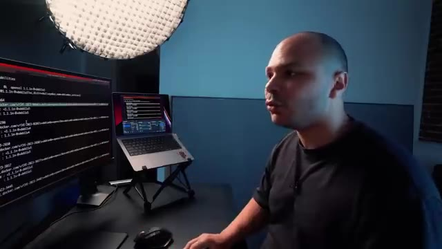
*📸 00:13:57 — Vue de profil du créateur devant un double écran affichant des résultats de scan de vulnérabilités Docker Scout.*

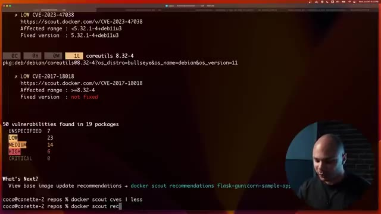
*📸 00:14:03 — Capture plein écran d'un terminal affichant un rapport de vulnérabilités Docker Scout avec les compteurs (High, Medium, Low) et la commande docker scout cves.*

---

### ⏱️ `[00:14:09 - 00:14:44]` | Segment #37

**🔊 Audio (Transcription Intégrale Mot pour Mot en Français) :**
> Et donc là, ça va pousser un petit peu plus loin. Au lieu de juste mettre une recommandation, ça te donne un peu plus en fonction de... Ok, peut-être que si tu n'avais pas la Alpine, peut-être que ça irait mieux, mais peut-être etc. Donc là, il me dit, tu vois, si tu passes à la 12 Slim, ça me donne une liste de bénéfices. Tu gardes le SameOS, la différence de version de Python, elle est mineure. L'image, elle a une taille à peu près similaire, etc. Mais si ça ne te convient pas parce que par exemple tu dis ah bah non impossible je peux pas passer à la point 12, il te dit ok mais si à la place tu veux la 11 et bah voilà t'as tel ou tel bénéfice là tu vois que c'est à peu près pareil. Là par exemple il nous dit ok à la place tu pourrais prendre la Alpine et la Alpine elle elle a 0 low, 0 critique elle a juste une high. Par contre

**👁️ Analyse Visuelle d'Écran (gemini-3.5-flash-lite) :**
**Interface & Outils** : Présentation ou face-caméra sans interface informatique partagée.

**Contenu textuel & Code** : Explications orales des concepts, architectures et retours d'expérience.

**Action / Démonstration** : Démonstration pédagogique et mise en perspective technique.

---

### ⏱️ `[00:14:44 - 00:15:02]` | Segment #38

**🔊 Audio (Transcription Intégrale Mot pour Mot en Français) :**
> du coup c'est pas le même OS parce que t'es pas avec un debu en small, t'es avec une Alpine. Le fait de tourner sur Alpine il y a des choses qui vont pas forcément tourner exactement pareil donc c'est peut-être pas quelque chose que tu veux mais si ton application elle est 100% en Python normalement ça devrait pas... ça devrait... ça pourrait... je sais pas. Mais si tu sais que ton application sur Alpine elle tourne bien, bah peut-être que ça serait la meilleure des solutions.

**👁️ Analyse Visuelle d'Écran (gemini-3.5-flash-lite) :**
**Interface & Outils** : Aucune interface technique ou console affichée.

**Contenu textuel & Code** : Aucun code ou commande visible.

**Action / Démonstration** : Explication orale sur les différences d'OS et de compatibilité logicielle entre Debian et Alpine.

---

### ⏱️ `[00:15:02 - 00:15:39]` | Segment #39

**🔊 Audio (Transcription Intégrale Mot pour Mot en Français) :**
> Donc en fait ça te donne un peu plus de solutions possibles pour pouvoir réduire au maximum le nombre de vulnérabilités dans tes images Docker. Un autre truc qui peut te faire gagner pas mal de temps, c'est utiliser la nouvelle commande toujours, Docker Build Cloud. Il y a pas mal de petits trucs qui peut te faire perdre un petit peu de temps quand par exemple tu build une image sur ton ordi, sur ton laptop et que ton laptop sert à un laptop ARM, si tu as un MacBook ou si tu as les nouveaux laptop Windows ARM. Et bien ce n'est pas la même architecture que ce que tournent la plupart des serveurs qui est X86, même si maintenant on commence à avoir des serveurs ARM. Et donc ça veut dire que pour pouvoir les builder en X86, tu peux quand même le faire mais tu passes par une espèce

**👁️ Analyse Visuelle d'Écran (gemini-3.5-flash-lite) :**
**Interface & Outils** : Aucun outil, terminal ou interface graphique visible.

**Contenu textuel & Code** : Aucun code, commande ou métrique technique visible.

**Action / Démonstration** : Explication orale du créateur sur l'utilisation de Docker Build Cloud et la réduction des vulnérabilités, sans support visuel technique à l'écran.

---

### ⏱️ `[00:15:39 - 00:16:15]` | Segment #40

**🔊 Audio (Transcription Intégrale Mot pour Mot en Français) :**
> de couche d'émulation sur ta machine qui fait que les bulles peuvent prendre deux fois, trois fois, 4 fois le temps que ce qui prendrait sur une machine équivalente en x86. A l'inverse, si ton pipeline de CI-CD ou tes images elles sont buildées pour x86 parce qu'elles tournent sur des serveurs x86, si toi tu veux les utiliser sur ta machine qui est machine ARM, et bien pareil tu dois passer par une couche de simulation et les performances elles sont moins bien. Mais avec Docker Cloud Build tout ça c'est fini. En gros Cloud Build ça va permettre de builder ton image sur un serveur à distance donc c'est pas ton ordi qui va le builder et ce compatible avec toutes les architectures, que ce soit ARM, X86 ou même les autres différents types d'architecture. Donc ce

**👁️ Analyse Visuelle d'Écran (gemini-3.5-flash-lite) :**
**Interface & Outils** : AUCUNE

**Contenu textuel & Code** : AUCUNE

**Action / Démonstration** : Explication orale des problématiques d'émulation et de compatibilité d'architecture dans les pipelines de CI/CD.

---

### ⏱️ `[00:16:15 - 00:16:48]` | Segment #41

**🔊 Audio (Transcription Intégrale Mot pour Mot en Français) :**
> qui fait que ton image elle est disponible pour toutes les architectures en même temps. Donc quand tu utilises sur ton laptop Windows ARM ou sur ton Mac ARM c'est rapide parce que l'image a été buildée en ARM et quand tu utilises sur tes serveurs qui sont en S86 c'est rapide aussi parce que ça a été buildé en S86. Et le processus de build est lui-même aussi beaucoup plus rapide parce que non seulement c'est fait en parallèle, l'ARM et le X86 ils sont faits en même temps, et en plus de ça c'est quelque chose que tu peux partager entre différents utilisateurs. Donc ce Ce qui fait que si Jean-Martin, il a buildé un truc ce matin et que toi tu rebuldes un truc cet après-midi, et bien comme vous utilisez le même cache, parce que c'est le cache du serveur, et bien toi ton build, il va être 10 fois plus rapide.

**👁️ Analyse Visuelle d'Écran (gemini-3.5-flash-lite) :**
**Interface & Outils** : Aucune interface technique ou console visible.

**Contenu textuel & Code** : Aucun code, commande ou diagramme d'architecture affiché.
[N/A] Explication verbale de la disponibilité des images pour différentes architectures (ARM et x86).

**Action / Démonstration** : Démonstration pédagogique et mise en perspective technique.

---

### ⏱️ `[00:16:48 - 00:17:09]` | Segment #42

**🔊 Audio (Transcription Intégrale Mot pour Mot en Français) :**
> Parce que ça va prendre en compte tous les layers de cache qui ont déjà été buildés pour Jean-Martin ce matin. Donc bref, ça, que des avantages. Donc là, j'ai lancé un build en local avec Docker BuildX Build. Je lui ai passé un repo à builder et je lui ai dit de le builder en AMD64 ou x86 qui est à peu près la même chose. Donc ça veut dire que ce n'est pas la même plateforme que ce qui est mon ordi. Mon ordi, c'est un ARM, que je le redis encore une fois.

**👁️ Analyse Visuelle d'Écran (gemini-3.5-flash-lite) :**
**Interface & Outils** : Terminal de commande sous macOS/Linux avec affichage de la sortie standard d'un build Docker.

**Contenu textuel & Code** : Commande exécutée : `docker buildx build https://github.com/dockersamples/buildme.git --platform linux/amd64`, avec affichage des étapes du build (étapes cachées [CACHED], téléchargement des dépendances Go, exportation de l'image).

**Action / Démonstration** : Lancement d'un build Docker multi-plateforme/spécifique (AMD64) directement à partir d'un dépôt Git distant en exploitant le cache local.

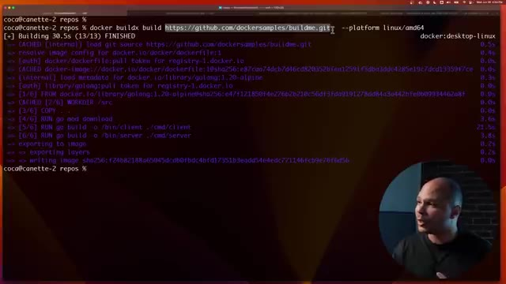
*📸 00:16:58 — Terminal affichant l'exécution d'une commande Docker BuildX avec utilisation du cache et ciblage d'une architecture spécifique.*

---

### ⏱️ `[00:17:09 - 00:17:27]` | Segment #43

**🔊 Audio (Transcription Intégrale Mot pour Mot en Français) :**
> Il peut quand même builder pour des processeurs X86 AMD64. Mais là, on voit que ça a pris 30 secondes à peu près. Et là maintenant, je vais le builder. Mais dans le cloud, j'ai juste rajouté ici "-builder", cloud.coqadmin.builder. C'est comme ça que ça s'appelle mon builder. Pour avoir un builder, il faut simplement créer un compte sur build.docker.com.

**👁️ Analyse Visuelle d'Écran (gemini-3.5-flash-lite) :**
**Interface & Outils** : Présentation ou face-caméra sans interface informatique partagée.

**Contenu textuel & Code** : Explications orales des concepts, architectures et retours d'expérience.

**Action / Démonstration** : Démonstration pédagogique et mise en perspective technique.

---

### ⏱️ `[00:17:28 - 00:17:49]` | Segment #44

**🔊 Audio (Transcription Intégrale Mot pour Mot en Français) :**
> C'est gratuit. Et ensuite, tu peux créer un builder, lui donner le nom que tu veux. Et ensuite, ce que ça va faire, c'est qu'au lieu de builder localement sur ma machine, Ça va builder tout ça directement dans le cloud et ça va builder dans la plateforme que j'ai envie. Donc là pour AMD64 et là on voit que ça a pris une seconde. Ça a pris une seconde parce que en fait c'était déjà en cache. Et comme je te disais, s'il y a déjà quelqu'un qui l'a fait avant, et bien ça va être en cache et donc ça va être beaucoup plus rapide.

**👁️ Analyse Visuelle d'Écran (gemini-3.5-flash-lite) :**
**Interface & Outils** : Présentation ou face-caméra sans interface informatique partagée.

**Contenu textuel & Code** : Explications orales des concepts, architectures et retours d'expérience.

**Action / Démonstration** : Démonstration pédagogique et mise en perspective technique.

---

### ⏱️ `[00:17:49 - 00:18:23]` | Segment #45

**🔊 Audio (Transcription Intégrale Mot pour Mot en Français) :**
> Mais là je l'ai lancé sans le cache pour que vraiment ça soit comparable avec ce qu'a fait mon ordi, qui est quand même un ordi puissant. Quand j'étais en local, ça m'a pris 30 secondes, alors que dans le cloud ça a pris 9 secondes. Pas parce que mon ordi il est lent, c'est juste parce que mon ordi c'est pas la même plateforme, donc il doit émuler. et donc du coup ça prend trois fois le temps. Et ce que j'aurais même pu faire c'est demander à builder les deux en même temps à la fois le MD64 et à la fois le RM64 et en espace de 10 secondes j'aurais buildé deux plateformes avant même que mon ordi ait fini de builder pour une seule plateforme. C'est aussi utile dans ton pipeline le CI-CD parce que ton pipeline souvent il va tourner lui-même sous Docker donc pour pouvoir

**👁️ Analyse Visuelle d'Écran (gemini-3.5-flash-lite) :**
**Interface & Outils** : Terminal CLI, Docker Buildx, macOS / bash.

**Contenu textuel & Code** : Commande `docker buildx build https://github.com/dockersamples/buildme.git --platform linux/amd64` montrant un temps de build total de 30.5s sur une architecture non native (émulation).

**Action / Démonstration** : Exécution d'un build d'image Docker à distance depuis un dépôt Git avec spécification de la plateforme cible pour démontrer l'impact de l'émulation sur les performances.

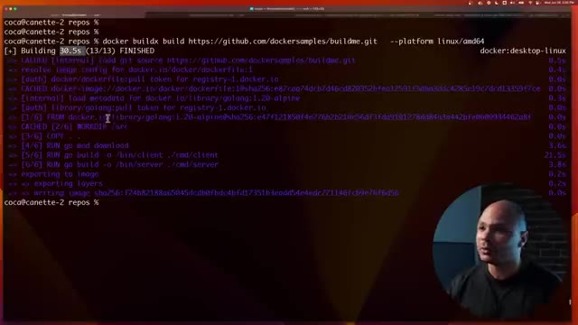
*📸 00:17:57 — Terminal Linux affichant l'exécution d'une commande Docker Buildx avec les détails des différentes étapes de build et le temps total écoulé.*

---

### ⏱️ `[00:18:23 - 00:18:45]` | Segment #46

**🔊 Audio (Transcription Intégrale Mot pour Mot en Français) :**
> builder des images Docker dans Docker il faut faire du Docker in Docker qui peut être un petit peu chiant ou un petit peu insécurisé etc. Là quand tu utilises BuildX eh ben, t'as plus de problème de sécurité. Le cache est gardé entre les différents builds si t'as envie, donc c'est beaucoup plus rapide, ce qui n'est pas forcément toujours le cas dans un pipeline de CNC-D. Et en plus de ça, c'est multi-architecture, donc les développeurs qui ont un ordi ARM, c'est rapide, les serveurs, c'est rapide, c'est tout mieux en fait.

**👁️ Analyse Visuelle d'Écran (gemini-3.5-flash-lite) :**
**Interface & Outils** : Aucun

**Contenu textuel & Code** : Aucun

**Action / Démonstration** : Explication orale sur l'utilisation de Docker BuildX par rapport au Docker-in-Docker.

---

### ⏱️ `[00:18:45 - 00:19:07]` | Segment #47

**🔊 Audio (Transcription Intégrale Mot pour Mot en Français) :**
> Est-ce que c'est payant par contre ? Si je vais sur build.docker.com, je crois qu'il y a une version gratuite. Je vais juste vérifier pour être sûr. Ouais, c'est ça. Ça, c'est une des fonctionnalités qui est gratuite. Ou du moins, t'as un plan qui est gratuit où tu as 100 minutes de build gratuite par mois. Donc, pour un petit projet, c'est parfait. Et puis, si jamais tu as besoin de plus, pareil, tu as différents plans qui ne sont pas très chers.

**👁️ Analyse Visuelle d'Écran (gemini-3.5-flash-lite) :**
**Interface & Outils** : Navigateur web Google Chrome, interface de tarification SaaS Build Cloud.

**Contenu textuel & Code** : Tableau comparatif des plans de tarification (Personal à 0$, Pro à 5$, Team à 9$) détaillant les minutes de build incluses, le cache et les builds parallèles.

**Action / Démonstration** : Vérification de la tarification et des fonctionnalités gratuites de Docker Build Cloud.

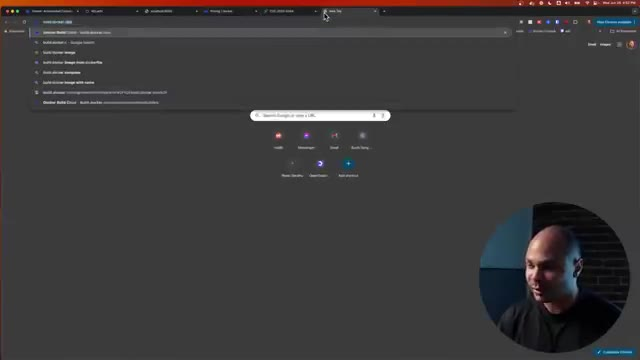
*📸 00:18:51 — Navigateur web affichant une recherche Google sur build.docker.com.*

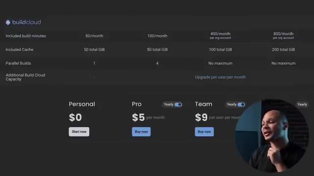
*📸 00:18:56 — Page de tarification de Build Cloud montrant les plans Personal, Pro et Team avec leurs quotas respectifs.*

---

### ⏱️ `[00:19:07 - 00:19:28]` | Segment #48

**🔊 Audio (Transcription Intégrale Mot pour Mot en Français) :**
> Donc là, je vais vous montrer une astuce que j'ai découverte il n'y a pas longtemps qui paraît carrément trop beau pour être vrai. En gros, il y a un repo qui s'appelle Docker avec un U à la place du E et qui propose simplement Windows. Voilà, Windows dans Docker, voire même macOS. Pourquoi pas ? Pourquoi pas ? Tu peux voir Windows ou macOS comme ça en lançant juste une simple ligne de commandes.

**👁️ Analyse Visuelle d'Écran (gemini-3.5-flash-lite) :**
**Interface & Outils** : Navigateur web affichant une interface GitHub (dépôt Dockur).

**Contenu textuel & Code** : Page README du projet GitHub "dockur/windows" présentant les fonctionnalités (Multi-language, ISO downloader, KVM acceleration, Web-based viewer).

**Action / Démonstration** : Présentation du dépôt GitHub non officiel Dockur permettant d'exécuter des machines virtuelles Windows au sein de conteneurs Docker.

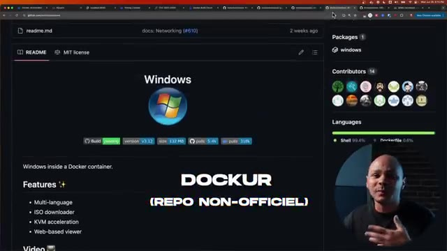
*📸 00:19:17 — Capture d'écran du navigateur affichant le dépôt GitHub du projet Dockur permettant de faire tourner Windows dans un conteneur Docker.*

---

### ⏱️ `[00:19:28 - 00:19:47]` | Segment #49

**🔊 Audio (Transcription Intégrale Mot pour Mot en Français) :**
> Donc soit via Docker Compose, soit carrément via juste une ligne de commande, Docker Run, bababam. Donc j'ai testé pour vous, pour voir si ça marchait vraiment. Et donc cette ligne de commande, c'est une commande Docker Run, comme d'habitude. Il y a quelques petits arguments classiques. Et là, on arrive ici, on voit « device.dev.kvm ». Et c'est là où on voit la petite astuce.

**👁️ Analyse Visuelle d'Écran (gemini-3.5-flash-lite) :**
**Interface & Outils** : Navigateur web affichant un dépôt GitHub (README.md) avec le flux vidéo incrusté du créateur.

**Contenu textuel & Code** : Fichier YAML de configuration Docker Compose (image dockurr/windows, version win11, devices /dev/kvm, cap_add NET_ADMIN, ports 8006 et 3389) et commande CLI `docker run -it --rm -p 8006:8006 --device=/dev/kvm --cap-add NET_ADMIN ...`.

**Action / Démonstration** : Explication et démonstration des différentes méthodes de déploiement (Docker Compose et Docker CLI) pour lancer Windows dans Docker avec l'accélération matérielle KVM.

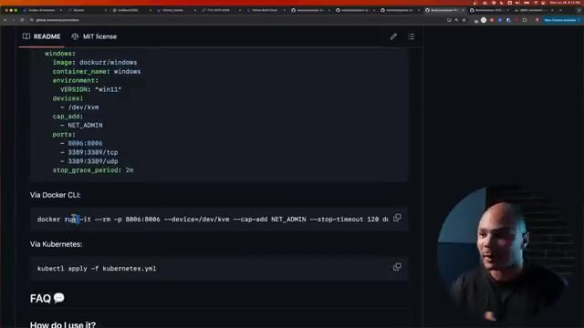
*📸 00:19:32 — Documentation GitHub montrant un fichier Docker Compose et une commande Docker CLI pour exécuter un conteneur Windows avec KVM.*

---

### ⏱️ `[00:19:47 - 00:20:12]` | Segment #50

**🔊 Audio (Transcription Intégrale Mot pour Mot en Français) :**
> Ce conteneur, il va utiliser le KVM, c'est-à-dire l'hyperviseur de la machine haute. Donc tu as besoin d'être sur Linux pour pouvoir utiliser ça. Donc du coup, KVM va lancer une machine Windows. Et ce qui va être dans ce conteneur, ça va être un espèce de VNC qui va capturer l'écran de la machine virtuelle Windows et le renvoyer dans notre navigateur pour qu'on puisse accéder à notre Windows ou notre Mac OS dans le confort de notre navigateur.

**👁️ Analyse Visuelle d'Écran (gemini-3.5-flash-lite) :**
**Interface & Outils** : Présentation ou face-caméra sans interface informatique partagée.

**Contenu textuel & Code** : Explications orales des concepts, architectures et retours d'expérience.

**Action / Démonstration** : Démonstration pédagogique et mise en perspective technique.

---

### ⏱️ `[00:20:12 - 00:20:33]` | Segment #51

**🔊 Audio (Transcription Intégrale Mot pour Mot en Français) :**
> Donc en fait, pour résumer, ce n'est pas vraiment un Windows dans Docker, c'est un Windows dans KVM via le VNC du Docker renvoyé dans le navigateur dans ton ordi. Donc on va quand même voir si ça marche bien. Je lancé un petit peu à la vente parce que ça met quand même un petit peu de temps. On parle quand même de démarrer Windows. Et donc là, j'ai tapé l'adresse IP de ma machine sur le port 8.6.

**👁️ Analyse Visuelle d'Écran (gemini-3.5-flash-lite) :**
**Interface & Outils** : Terminal Linux (bash/shell) sous Ubuntu

**Contenu textuel & Code** : `docker run -it --rm -p 8006:8006 --device=/dev/kvm --cap-add NET_ADMIN --stop-timeout 120 dockurr/windows` ainsi que les logs d'initialisation, le téléchargement de l'ISO Windows 11 (6.34 Go) et le démarrage de QEMU v8.2.4.

**Action / Démonstration** : Explication technique du fonctionnement réel de l'image Docker (virtualisation KVM sous-jacente avec export VNC) et observation du processus de démarrage dans le terminal.

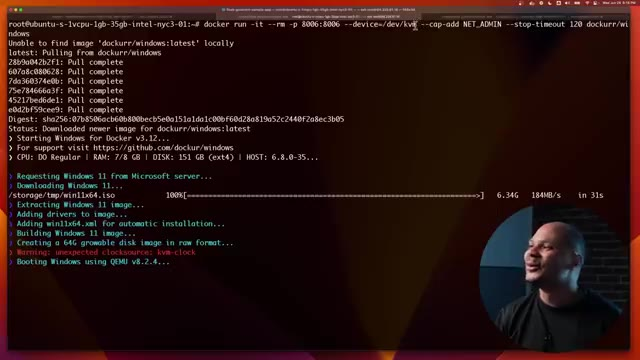
*📸 00:20:22 — Terminal Linux affichant le lancement de la commande Docker pour exécuter l'image dockurr/windows avec les paramètres KVM et réseau.*

---

### ⏱️ `[00:20:33 - 00:20:51]` | Segment #52

**🔊 Audio (Transcription Intégrale Mot pour Mot en Français) :**
> Et donc, j'ai un Windows qui a l'air à peu près de fonctionner. Donc là, tu as vu, j'ai mon Edge. Je peux aller sur Docker.com, le sponsor de cette vidéo. Et donc, j'ai un Windows qui est accessible comme ça assez rapidement en simplement une seule ligne du commande à partir du moment où tu tournes sur Linux ou alors que tu as un serveur de dispo.

**👁️ Analyse Visuelle d'Écran (gemini-3.5-flash-lite) :**
**Interface & Outils** : Navigateur Microsoft Edge, bureau Windows virtualisé dans un navigateur/conteneur.

**Contenu textuel & Code** : Page d'accueil de Docker.com (« Docker Builds: Now Lightning Fast »).

**Action / Démonstration** : Navigation sur le site web de Docker depuis un environnement Windows conteneurisé accessible via le web.

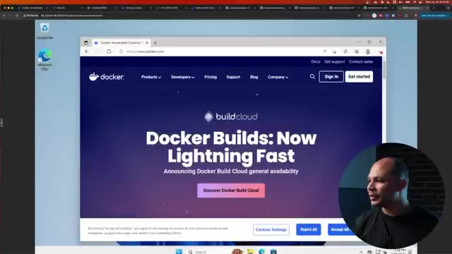
*📸 00:20:38 — Navigateur Microsoft Edge affichant le site officiel Docker.com au sein d'un bureau Windows conteneurisé.*

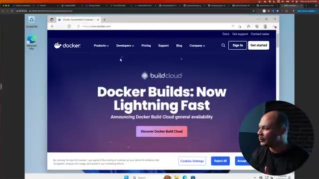
*📸 00:20:42 — Vue similaire montrant le site Docker.com sur un navigateur web dans l'environnement Windows virtuel.*

---

### ⏱️ `[00:20:51 - 00:21:12]` | Segment #53

**🔊 Audio (Transcription Intégrale Mot pour Mot en Français) :**
> Ils ont aussi une version macOS que j'ai testée vite fait. Mais c'est pareil, ça télécharge l'ISO des serveurs d'Apple ou l'ISO des serveurs de Microsoft. Et tu passes à travers tout le setup d'installation. Donc ça peut être cool si tu le fais une fois puis tu le gardes en coin. Mais sinon, pour booter vite fait un Windows, c'est pas si vite fait que ça.

**👁️ Analyse Visuelle d'Écran (gemini-3.5-flash-lite) :**
**Interface & Outils** : Aucune

**Contenu textuel & Code** : Aucun

**Action / Démonstration** : Explication orale du fonctionnement des installations d'OS sur macOS.

---

### ⏱️ `[00:21:12 - 00:21:32]` | Segment #54

**🔊 Audio (Transcription Intégrale Mot pour Mot en Français) :**
> Ça prend au moins une demi-heure le temps de tout télécharger et de tout installer, etc. Mais le fait que c'est possible grâce à Docker, c'est quand même un truc de fou. Et donc encore une fois, merci beaucoup à Docker pour avoir sponsorisé cette vidéo. Moi c'est un outil que j'utilisais tout le temps dans mon taf et que je continue à beaucoup utiliser presque tous les jours aujourd'hui. Donc si tu veux jeter un coup d'œil à leurs nouvelles fonctionnalités, je te laisse un petit lien dans la description.

**👁️ Analyse Visuelle d'Écran (gemini-3.5-flash-lite) :**
**Interface & Outils** : Présentation ou face-caméra sans interface informatique partagée.

**Contenu textuel & Code** : Explications orales des concepts, architectures et retours d'expérience.

**Action / Démonstration** : Démonstration pédagogique et mise en perspective technique.

---

### ⏱️ `[00:21:32 - 00:21:33]` | Segment #55

**🔊 Audio (Transcription Intégrale Mot pour Mot en Français) :**
> Et on se retrouve très vite dans la prochaine vidéo.

**👁️ Analyse Visuelle d'Écran (gemini-3.5-flash-lite) :**
**Interface & Outils** : Présentation ou face-caméra sans interface informatique partagée.

**Contenu textuel & Code** : Explications orales des concepts, architectures et retours d'expérience.

**Action / Démonstration** : Démonstration pédagogique et mise en perspective technique.

---

