# 🎬 Comment la pire faille de Linux a été trouvé par pure chance ?

> **Chaîne** : [cocadmin](https://www.youtube.com/@cocadmin)  
> **Lien YouTube** : [https://www.youtube.com/watch?v=Q5a92asc7hM](https://www.youtube.com/watch?v=Q5a92asc7hM)  
> **Date de publication** : 20240910  
> **Durée** : 00:23:38  
> **Identifiant vidéo** : `Q5a92asc7hM`  
> **Transcription & Analyse** : `whisper-v3-large-turbo+gemini-3.5-flash-lite`  

---

## 📌 Synthèse Exécutive & Outils

### 💡 Résumé

Cette affaire met en lumière l'une des attaques de supply chain (chaîne d'approvisionnement logicielle) les plus sophistiquées et redoutables de l'histoire de l'écosystème Open Source Linux. Par un concours de circonstances purement fortuit, un développeur enquêtant sur une surconsommation CPU minime de son serveur SSH a mis au jour une porte dérobée (backdoor) critique infiltrée au cœur de la bibliothèque de compression `XZ` (anciennement `LibLZMA`). Cette faille n'était pas un simple bug de code, mais le fruit d'une opération d'ingénierie sociale menée sur plusieurs années par un acteur malveillant (se faisant passer pour plusieurs intervenants sous les pseudonymes de Denis, Kumar et Jia). Ce groupe de pression a méthodiquement harcelé et discrédité le mainteneur historique du projet, Las Collins, jusqu'à l'épuisement, pour obtenir des privilèges de co-maintenance et injecter du code malveillant de manière insidieuse.

L'impact opérationnel pour les administrateurs systèmes, les ingénieurs DevOps et les équipes de sécurité est monumental. La bibliothèque compromise n'était pas directement ciblée dans les applications finales grand public, mais insérée de manière transitive via des dépendances critiques telles que `systemd`, qui l'utilise pour la gestion et la compression des journaux (logs). Par effet domino, les démons SSH de nombreuses distributions Linux majeures se sont retrouvés compromis au moment de la compilation de leurs paquets, ouvrant potentiellement un accès distant non authentique à l'échelle mondiale. Le vecteur d'attaque contournait totalement les revues de code traditionnelles de GitHub en masquant la charge utile (payload) malveillante non pas dans le dépôt source public, mais uniquement dans les archives de publication (*tarballs* de *release*) générées pour la compilation, combinée à des scripts de test obfusqués.

Cette cyberattaque démontre la fragilité structurelle de l'écosystème open source, souvent reposant sur le bénévolat exténué d'un unique mainteneur non rémunéré. Pour les professionnels du cloud et des infrastructures, elle redéfinit radicalement la posture de sécurité : la confiance aveugle envers les dépendances logicielles en amont n'est plus permise. Elle impose une refonte des processus de validation des paquets, l'intégration d'analyses comportementales au runtime (comme l'audit de l'utilisation CPU et mémoire des daemons système), et une vigilance accrue lors de l'intégration de bibliothèques tierces dans les chaînes d'intégration et de livraison continues (CI/CD).

### 🛠️ Outils, Modèles & Logiciels Présentés

* **XZ / LibLZMA** : Bibliothèque logicielle open source de compression et de décompression de données hautement performante, largement adoptée par l'ensemble des distributions Linux.
* **SSH (Secure Shell)** : Protocole et service réseau standard de l'industrie permettant l'administration et la connexion à distance sécurisée aux serveurs.
* **Systemd** : Suite logicielle de gestion du système et des services pour Linux, intégrant de manière transitive des dépendances de compression comme `XZ` pour la gestion des logs.
* **7-Zip** : Logiciel d'archivage populaire (originellement sous interface graphique Windows) ayant popularisé l'adoption du format de compression LZMA.
* **GitHub** : Plateforme de collaboration et d'hébergement de code source utilisée pour le versioning et le suivi des tickets (*issues*) du projet compromis.

### 🔑 Points Clés & Enseignements Stratégiques

* **Vigilance face aux anomalies de performance** : Une surconsommation CPU infime (quelques millisecondes sur un démon critique comme SSH) doit être traitée comme un signal faible potentiel d'intrusion ou de compromis bas niveau.
* **Vulnérabilité humaine de l'Open Source** : L'é puisement et l'isolement des mainteneurs bénévoles constituent des vecteurs d'attaque privilégiés pour l'ingénierie sociale et la prise hostile de projets (*takeover*).
* **Attaques par usurpation d'identité multiple** : Le recours à de faux profils coordonnés pour harceler, culpabiliser et forcer la main d'un mainteneur légitime est une technique avancée de manipulation de communauté.
* **Divergence entre Code Source et Archives de Release** : Un attaquant redoutable n'injecte pas son code dans les branches publiques visibles, mais directement dans les paquets de distribution (*tarballs*) compilés pour le grand public.
* **Dépendances transitives invisibles** : Une bibliothèque de compression apparemment anodine peut se retrouver embarquée au cœur de composants critiques du système d'exploitation (`systemd`, SSH), démultipliant la surface d'attaque.
* **Patience stratégique des attaquants (Long Game)** : Accepter de contribuer de manière légitime pendant des années pour accumuler du capital de confiance avant d'introduire le moindre code malveillant démontre un niveau de menace étatique ou APT.
* **Obfuscation par expressions régulières (Regex)** : L'utilisation de scripts de modification de fichiers de test complexes et obscurs permet de masquer l'injection initiale de charges malveillantes sous couvert d'opérations de maintenance routinières.
* **Nécessité du SBOM (Software Bill of Materials)** : Pour tout ingénieur DevOps, cartographier précisément l'ensemble des dépendances directes et indirectes (transitives) d'une image ou d'un serveur est désormais une obligation de conformité et de sécurité.
* **Remise en question de la confiance aveugle aux paquets amont** : Ne jamais supposer qu'un paquet officiel issu d'une distribution ou d'un dépôt tiers est intègre sans validation cryptographique stricte et audits indépendants.
* **Urgence de la durabilité financière de l'Open Source** : Les entreprises tirant profit de milliards de dollars d'infrastructure basée sur des briques logicielles bénévoles doivent financer et auditer activement ces fondations critiques.

---

## ⏱️ Chronologie & Transcription Complète Audio & Visuelle (Mot pour Mot)

### ⏱️ `[00:00:00 - 00:00:26]` | Segment #01

**🔊 Audio (Transcription Intégrale Mot pour Mot en Français) :**
> Ça c'est une des pires attaques de sécurité que j'ai jamais vu de toute ma vie. Et on l'a évité de juste test juste par hasard. Et donc j'ai passé ces derniers jours à éplucher un petit peu cette affaire pour comprendre comment il a fait et comment ça a pu arriver. En mars dernier, il y avait un développeur qui faisait des tests sur une base de données pour pouvoir savoir quelle version a été les plus performantes. Et pour faire ça, il voulait que tout le reste de sa machine consomme le moins de ressources possibles pour pouvoir voir vraiment les micro différences de performance sur sa base de données.

**👁️ Analyse Visuelle d'Écran (gemini-3.5-flash-lite) :**
**Interface & Outils** : Moniteur d'activité (Activity Monitor) de macOS.

**Contenu textuel & Code** : Liste des processus système et utilisateurs (Virtual Machine Service, WindowServer, kernel_task, Activity Monitor, Terminal, etc.) avec l'utilisation CPU et mémoire associée.
[DESC_IMAGE_1] Plan face-caméra sans support technique pertinent.
[DESC_IMAGE_2] Vue de saisie au clavier sans affichage d'interface technique.
[DESC_IMAGE_3] Visualisation des processus et de la charge système sur macOS.

**Action / Démonstration** : Surveillance et analyse des processus actifs sur le poste de travail pour identifier une activité suspecte ou mesurer la charge de la machine.

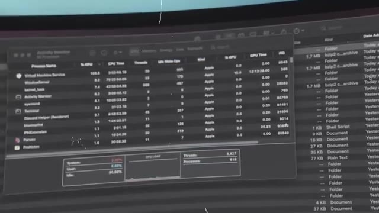
*📸 00:00:19 — Capture d'écran d'un moniteur affichant le moniteur d'activité (Activity Monitor) sous macOS avec la liste des processus en cours d'exécution.*

---

### ⏱️ `[00:00:26 - 00:00:59]` | Segment #02

**🔊 Audio (Transcription Intégrale Mot pour Mot en Français) :**
> Et là il remarque que son serveur SSH, qui est le protocole qui permet de se connecter à distance à sa machine, il consomme un petit peu de CPU. Pas beaucoup mais un petit peu plus que ce que ça devrait être. Et donc comme il est curieux il investigue et il fouille il fouille il passe toute la nuit à essayer de comprendre pourquoi est-ce que son serveur SSH il consomme 500 millisecondes de CPU en trop par rapport à d'habitude. Et donc il passe toute la nuit à essayer d'investiguer, débuguer, comprendre qu'est-ce qui se passe, si ça vraiment ça le rend malade. Jusqu'à ce qu'il découvre qu'il y a une backdoor donc un accès secret à sa machine mais pas seulement dans sa machine potentiellement dans toutes les machines et les serveurs qui utilisent Linux. Dans la fin des années 2000 il y a un

**👁️ Analyse Visuelle d'Écran (gemini-3.5-flash-lite) :**
**Interface & Outils** : Interface web d'un client Mastodon affichant un tweet ou message textuel.

**Contenu textuel & Code** : Publication d'AndresFreundTec détaillant le micro-benchmarking, l'utilisation anormale du CPU par sshd, le profilage montrant du temps CPU dans liblzma, et l'alerte Valgrind sur Postgres.

**Action / Démonstration** : Illustration visuelle de la source officielle de la découverte de la faille de sécurité (backdoor XZ Utils) par le développeur.

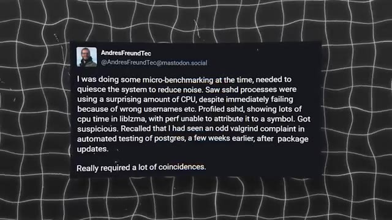
*📸 00:00:34 — Capture d'écran d'un message publié sur Mastodon par Andres Freund expliquant sa découverte d'une anomalie CPU dans sshd liée à liblzma.*

---

### ⏱️ `[00:00:59 - 00:01:31]` | Segment #03

**🔊 Audio (Transcription Intégrale Mot pour Mot en Français) :**
> nouveau format de compression qui vient d'arriver qui s'appelle le LZMA et qui est de plus en plus populaire parce qu'il est beaucoup plus performant que les anciens formats de compression, le zip, etc. Et ce format c'est le format XZ qui a été popularisé par le logiciel 7zip si vous avez utilisé à l'époque. Et donc 7zip c'était un logiciel en interface graphique principalement pour Windows. Et donc sur Linux il y a un développeur qui s'appelle Las Collins qui a développé une librairie pour que n'importe quel programme puisse compresser et décompresser des fichiers avec le format XZ et cette librairie va s'appeler LibLZMA puis ensuite LibXZ. Donc là,

**👁️ Analyse Visuelle d'Écran (gemini-3.5-flash-lite) :**
**Interface & Outils** : AUCUNE

**Contenu textuel & Code** : AUCUN

**Action / Démonstration** : Explication orale de concepts théoriques sur la compression LZMA et le format XZ par le présentateur.

---

### ⏱️ `[00:01:31 - 00:02:04]` | Segment #04

**🔊 Audio (Transcription Intégrale Mot pour Mot en Français) :**
> c'est un des fondateurs de ce projet, c'est celui qui va continuer pendant toutes ces années jusqu'à aujourd'hui même à contribuer à ce projet. C'est un projet open source, donc c'est à dire qu'il y a plein de gens qui peuvent contribuer, fixer des bugs, rajouter des fonctionnalités, etc. Mais c'est lui qui est le maintainer du projet, c'est à dire que c'est lui qui décide quels changements on va mettre ou pas dans LibLZMA. Et donc ça fait 15 ans qu'il travaille dessus donc c'est un petit peu son bébé. C'est quand même un projet open source qui est utilisé par beaucoup de gens et beaucoup d'autres projets sauf que évidemment au bout de 10 15 ans et bat un petit peu moins la pêche qu'au début parce que c'est un peu un travail à ingrat il est pas payé pour faire ça c'est vraiment

**👁️ Analyse Visuelle d'Écran (gemini-3.5-flash-lite) :**
**Interface & Outils** : AUCUNE

**Contenu textuel & Code** : AUCUNE

**Action / Démonstration** : Explication en face-caméra concernant le rôle du mainteneur et le fonctionnement collaboratif d'un projet open source.

---

### ⏱️ `[00:02:04 - 00:02:28]` | Segment #05

**🔊 Audio (Transcription Intégrale Mot pour Mot en Français) :**
> totalement bénévole en plus de ça dans sa vie perso parfois les trucs qui vont pas trop de parfois le projet xz il passe un petit peu à la trappe et donc le projet ralenti et à des demandes des bugs qui commencent à s'accumuler un petit peu mois après mois année après année et ça commence à se sentir un petit peu sur le projet et en 2022 ça commence un petit peu à râler dans la communauté On a Denis qui demande un petit peu innocentement, est-ce que ce projet est encore maintenu ?

**👁️ Analyse Visuelle d'Écran (gemini-3.5-flash-lite) :**
**Interface & Outils** : AUCUNE

**Contenu textuel & Code** : AUCUNE

**Action / Démonstration** : AUCUNE

---

### ⏱️ `[00:02:28 - 00:02:48]` | Segment #06

**🔊 Audio (Transcription Intégrale Mot pour Mot en Français) :**
> Ça fait un an que j'ai pas vu de mise à jour. Il y a un autre mec qui s'appelle Kumar qui répond ou qui dit « La dernière grosse mise à jour, elle date d'il y a 7 ans, donc t'attends pas à grand jour ». Lui aussi, il est un petit peu frustré par le manque de dynamisme du projet. Un peu plus tard, il y a un autre message qui dit « Il n'y aura jamais de progrès tant qu'on ne change pas de maintainer ». Le maintainer, il s'en fout, c'est vraiment triste de voir un repo comme ça. Kumar, lui, c'est vraiment un fils de pute.

**👁️ Analyse Visuelle d'Écran (gemini-3.5-flash-lite) :**
**Interface & Outils** : AUCUNE

**Contenu textuel & Code** : AUCUNE

**Action / Démonstration** : AUCUNE

---

### ⏱️ `[00:02:49 - 00:03:10]` | Segment #07

**🔊 Audio (Transcription Intégrale Mot pour Mot en Français) :**
> Encore d'autres messages sur des fonctionnalités qui traînent un petit peu. ça fait plus d'un mois et toujours pas merger. Je suis vraiment pas surpris. Unkumar, vraiment, lui, il l'enfonce, il tourne le couteau trois fois dans la plaie, quoi. C'est vraiment... Il est vraiment vicieux. Donc Lass, le maintainer du projet, il s'excuse. Il explique justement que ça fait longtemps qu'il fait ça gratuit, c'est un projet bénévole et qu'en plus, en ce moment, dans sa vie, ça va pas trop.

**👁️ Analyse Visuelle d'Écran (gemini-3.5-flash-lite) :**
**Interface & Outils** : AUCUNE

**Contenu textuel & Code** : AUCUN

**Action / Démonstration** : AUCUNE

---

### ⏱️ `[00:03:11 - 00:03:50]` | Segment #08

**🔊 Audio (Transcription Intégrale Mot pour Mot en Français) :**
> Donc forcément, parfois, le projet prend un peu de retard. Mais qu'il a commencé à accepter un petit peu de l'aide, en particulier d'un autre mec qui s'appelle JIA et qui a fait pas mal de bonnes contributions dernièrement. Et donc potentiellement dans le futur, JIA pourra prendre un plus grand rôle, peut-être il sera co-maintainer pour pouvoir redonner un peu vie au projet. Kumar est toujours fidèle à lui-même et il répond « il n'y a eu aucun progrès depuis avril, en ce moment tu étouffes ton repos, pourquoi attendre plus tard ? Pourquoi retarder ce dont le projet a besoin ? » Donc vraiment il pousse pour dégager la sang-cou, il dit « ouais c'était une merde, ça va rien, ton projet il ralentit, c'est mieux de ramener quelqu'un tout de suite qui va pouvoir faire avancer les choses. »

**👁️ Analyse Visuelle d'Écran (gemini-3.5-flash-lite) :**
**Interface & Outils** : Présentation ou face-caméra sans interface informatique partagée.

**Contenu textuel & Code** : Explications orales des concepts, architectures et retours d'expérience.

**Action / Démonstration** : Démonstration pédagogique et mise en perspective technique.

---

### ⏱️ `[00:03:50 - 00:04:11]` | Segment #09

**🔊 Audio (Transcription Intégrale Mot pour Mot en Français) :**
> « Bon, ne t'inquiète pas, ça ira quand même un petit peu plus vite que ce que tu penses. J'ai commencé à travailler sur quelques trucs un petit peu. La situation va s'améliorer. » Donc vraiment, tu vois, il est sympa ce JIA. Il aide, il fait des bonnes contributions, il corrige des bugs, il rajoute des fonctionnalités, il calme un petit peu les tensions. Il est vraiment cool, tu vois. C'est vraiment le nouveau maintainer parfait pour ce projet.

**👁️ Analyse Visuelle d'Écran (gemini-3.5-flash-lite) :**
**Interface & Outils** : Éditeur de code et terminal (visibles de loin sur l'écran de l'Image #1).

**Contenu textuel & Code** : Lignes de code source et interface de terminal non détaillées.

**Action / Démonstration** : Session de développement et explications sur l'utilisation d'outils d'IA pour coder.

---

### ⏱️ `[00:04:11 - 00:04:34]` | Segment #10

**🔊 Audio (Transcription Intégrale Mot pour Mot en Français) :**
> Et donc là, avec toute cette pression, au bout de 15 ans, il finit un petit peu par craquer. Et en septembre, il passe JIA, co-maintener du projet. C'est-à-dire que maintenant, ils sont deux à pouvoir revoir les corrections, revoir les mises à jour, les nouvelles fonctionnalités, et décider ensemble de quel changement va ou non dans le projet. Et donc, évidemment, Denis, Kumar et même Jiya, ce sont la même personne.

**👁️ Analyse Visuelle d'Écran (gemini-3.5-flash-lite) :**
**Interface & Outils** : Graphique chronologique animé (timeline) illustrant les jalons du projet.

**Contenu textuel & Code** : Mention textuelle "2022 Septembre" sur fond texturé avec repère temporel et icône de co-maintenance.

**Action / Démonstration** : Illustration visuelle de la chronologie du projet et de l'arrivée du co-mainteneur en septembre 2022.

*📸 00:04:17 — Timeline graphique animée affichant l'année 2022 et le mois de septembre avec une icône de collaboration communautaire.*

---

### ⏱️ `[00:04:34 - 00:04:53]` | Segment #11

**🔊 Audio (Transcription Intégrale Mot pour Mot en Français) :**
> Ce sont tous des faux comptes. Et donc, ils viennent de prendre le contrôle du repo, qui ne paraît pas si important comme ça, c'est juste une librairie pour compresser. Mais en fait, cette librairie, elle est incluse dans plein d'autres programmes qui sont eux-mêmes inclus dans plein d'autres programmes. et ce qui est le cas de SSH, qui est le logiciel qui gère l'accès à distance sur ton ordinateur.

**👁️ Analyse Visuelle d'Écran (gemini-3.5-flash-lite) :**
**Interface & Outils** : Aucune interface ou terminal affiché.

**Contenu textuel & Code** : Aucun code, commande ou diagramme technique visible.

**Action / Démonstration** : Explication orale par le créateur concernant la compromission d'un dépôt logiciel et ses répercussions sur les dépendances (comme SSH).

---

### ⏱️ `[00:04:53 - 00:05:14]` | Segment #12

**🔊 Audio (Transcription Intégrale Mot pour Mot en Français) :**
> Donc même s'ils n'ont pas pris le contrôle du projet SSH, qui serait encore beaucoup plus dur, le programme SSH, dans plein de distributions, il inclut la librairie Systemd, et Systemd inclut la librairie XZ, parce que Systemd fait plein de choses sur les machines, et parmi toutes ces choses, par exemple, il a besoin de lire les logs et de les compresser une fois qu'ils prennent en place, et bien du coup, il a besoin d'une librairie pour compresser les fichiers.

**👁️ Analyse Visuelle d'Écran (gemini-3.5-flash-lite) :**
**Interface & Outils** : Graphique explicatif animé de type schéma d'architecture logicielle.

**Contenu textuel & Code** : Représentation visuelle des dépendances logicielles avec les libellés 'SSH' et 'System D'.

**Action / Démonstration** : Explication de la chaîne de dépendances et de l'imbrication des composants logiciels (SSH et Systemd) dans les distributions Linux.

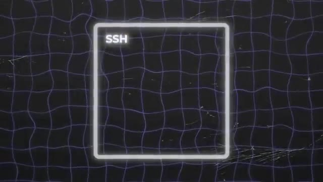
*📸 00:04:58 — Schéma conceptuel montrant un bloc représentant le protocole et le programme SSH.*

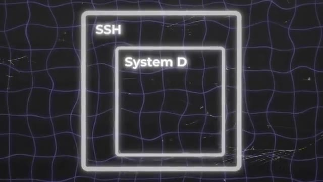
*📸 00:05:03 — Schéma conceptuel illustrant l'imbrication de la dépendance Systemd à l'intérieur du contexte SSH.*

---

### ⏱️ `[00:05:14 - 00:05:34]` | Segment #13

**🔊 Audio (Transcription Intégrale Mot pour Mot en Français) :**
> Et cette fameuse librairie, c'est la fameuse librairie XZ, et c'est par là que va être inclue la backdoor. Mais même si maintenant, JIA, il a accès au projet, il a le contrôle du projet, il peut faire ce qu'il veut, entre guillemets, c'est toujours un projet open source. C'est-à-dire que tout le monde peut voir ce qui est fait dans ce rythme. Tu peux simplement faire une mise à jour, voilà les gars, j'ai mis une nouvelle backdoor installée, c'est trop bien. Tout le monde va le voir, ça va être grillé, c'est open source, c'est ouvert.

**👁️ Analyse Visuelle d'Écran (gemini-3.5-flash-lite) :**
**Interface & Outils** : Interface web GitHub (navigateur).

**Contenu textuel & Code** : Dépôt tukaani-project/xz affichant la liste des dossiers (.github, src, m4, etc.) et des fichiers du projet open-source.

**Action / Démonstration** : Illustration visuelle de la structure du projet open-source XZ sur GitHub pour appuyer l'explication sur la transparence du code.

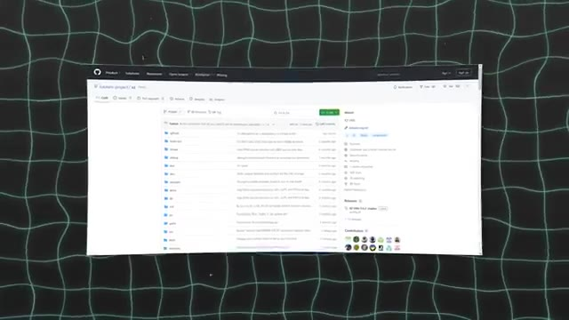
*📸 00:05:24 — Capture du dépôt GitHub officiel du projet XZ montrant l'arborescence des fichiers sources.*

---

### ⏱️ `[00:05:35 - 00:06:00]` | Segment #14

**🔊 Audio (Transcription Intégrale Mot pour Mot en Français) :**
> Il y a plein de gens qui surveillent ça, en particulier ceux qui vont inclure ta librairie dans leur programme. Comment JIA s'est pris pour pouvoir mettre cette backdoor sans que personne ne le voit ? Normalement, c'est impossible. Pour faire ça, la première chose que JIA va faire, c'est rien faire. Ou pour être plus précis, il va faire que des commits legit. Il va faire que des bonnes modifications. Il va corriger des bugs, il va ajouter plein de fonctionnalités, il va faire plein de bons ajouts au repo pour pouvoir petit à petit gagner la confiance.

**👁️ Analyse Visuelle d'Écran (gemini-3.5-flash-lite) :**
**Interface & Outils** : Aucune interface technique, terminal ou console n'est affiché.

**Contenu textuel & Code** : Aucun code source, commande, architecture réseau ou métrique visible.

**Action / Démonstration** : Explication orale sans support visuel technique à l'écran.

---

### ⏱️ `[00:06:00 - 00:06:19]` | Segment #15

**🔊 Audio (Transcription Intégrale Mot pour Mot en Français) :**
> Parce qu'en tant que nouveau maintainer, on va vraiment regarder de très près tous tes nouveaux ajouts. Parce que peut-être que t'es nouveau, peut-être que t'as pas encore l'habitude de certains trucs. Donc on va vraiment faire gaffe à ce que tu rajoutes. Donc c'est vraiment pas le moment d'en rajouter un bout de code qui va te permettre de prendre le contrôle à distance de tous les ordis du monde. Et Jia, lui, il a vraiment la pêche. parce que pendant des années, il va faire des commits qui sont legit.

**👁️ Analyse Visuelle d'Écran (gemini-3.5-flash-lite) :**
**Interface & Outils** : AUCUNE

**Contenu textuel & Code** : AUCUN

**Action / Démonstration** : Explication orale du créateur concernant la revue de code rigoureuse pour les nouveaux contributeurs open-source.

---

### ⏱️ `[00:06:19 - 00:06:40]` | Segment #16

**🔊 Audio (Transcription Intégrale Mot pour Mot en Français) :**
> Pendant deux ans. Et on a même des soupçons qu'il aurait fait pendant encore un petit peu plus longtemps. Mais il y a quelque chose qu'on verra plus tard qui lui a un petit peu forcé la main à passer à l'action un petit peu plus vite. C'est presque même à se demander si ce n'est pas un développeur complètement legit qui s'est fait piquer son compte. Mais ça, comme tous les comptes sont à peu près récents, à peu près écrits au même moment et qu'une fois qu'on a découvert la faille, tout le monde a disparu, eh bien, on sait que ce n'est pas le cas.

**👁️ Analyse Visuelle d'Écran (gemini-3.5-flash-lite) :**
**Interface & Outils** : Aucune interface technique affichée.

**Contenu textuel & Code** : Aucun contenu technique (code, commande, architecture, métrique).

**Action / Démonstration** : Explication orale de l'analyste face caméra (storytelling sur un cas de piratage de compte de développeur).

---

### ⏱️ `[00:06:40 - 00:07:05]` | Segment #17

**🔊 Audio (Transcription Intégrale Mot pour Mot en Français) :**
> Donc ça veut dire que c'est vraiment quelqu'un qui est déter et qui est prêt à passer des années pour pouvoir mettre à exécution son plan machiavélique de prendre le contrôle de tous les serveurs du monde. Et c'est seulement au bout de deux ans qu'il va avoir son premier commit, son premier changement malicieux, entre guillemets. Donc ce commit-là, ce qu'il fait, c'est que c'est une expression régulière, une regexp, et ça a l'air de rien comme ça, c'est vraiment difficile de comprendre ce que ça fait, même quand on a un développeur expérimenté.

**👁️ Analyse Visuelle d'Écran (gemini-3.5-flash-lite) :**
**Interface & Outils** : Éditeur de code (VS Code), timeline graphique animée.

**Contenu textuel & Code** : Lignes de code source dans les éditeurs et texte sur la timeline ("2 ans", "plusieurs commits legit", "commit malicieux").

**Action / Démonstration** : Explication de la stratégie d'attaque à long terme (infiltration via des contributions légitimes avant l'insertion de code malveillant).

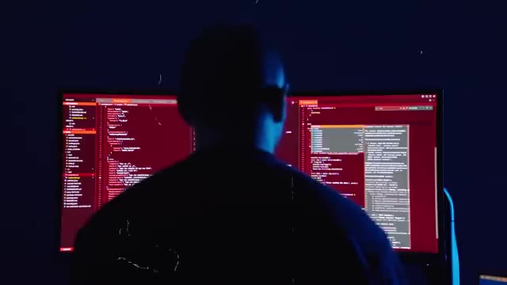
*📸 00:06:47 — Vue de dos d'un développeur devant deux écrans affichant du code source et un éditeur type VS Code avec une thématique rouge.*

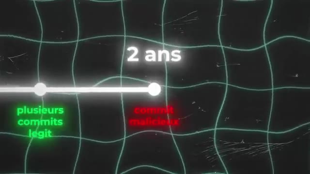
*📸 00:06:53 — Schéma chronologique (timeline) sur 2 ans illustrant la transition entre plusieurs commits légitimes (verts) et un commit malicieux (rouge).*

---

### ⏱️ `[00:07:06 - 00:07:24]` | Segment #18

**🔊 Audio (Transcription Intégrale Mot pour Mot en Français) :**
> Et cette regex, ce qu'elle se fait, c'est qu'elle va prendre un fichier, un des fichiers de test qu'il y a dans le repo, et ça va remplacer des caractères. Ça va remplacer des tirets par des tirets des bas, ça va remplacer des tirets par des espaces, faire quelque chose qui a l'air comme ça, a priori, innocent, parce qu'en fait, ça l'est, ce changement-là. A lui tout seul, au pire, il ne fait rien, tu vois ce que je veux dire ?

**👁️ Analyse Visuelle d'Écran (gemini-3.5-flash-lite) :**
**Interface & Outils** : Aucun outil, terminal ou logiciel affiché.

**Contenu textuel & Code** : Aucun contenu technique, code ou métrique visible.

**Action / Démonstration** : Explication orale du fonctionnement d'une expression régulière (regex) modifiant des fichiers de test.

---

### ⏱️ `[00:07:24 - 00:07:44]` | Segment #19

**🔊 Audio (Transcription Intégrale Mot pour Mot en Français) :**
> Au pire, il n'y a rien de malicieux. C'est-à-dire que dans le pire des cas, même si quelqu'un le voit, déjà, il peut simplement dire, ah oui, excuse-moi, c'est une erreur, j'ai fait un test sur ma machine et j'ai oublié de l'enlever, un truc comme ça. parce qu'il n'y a encore rien de magnifique, il n'y a pas de backdoor, il n'y a rien. C'est vraiment juste deux lignes qui disent « va chercher tel fichier » et puis « change tel type de caractère ». C'est vraiment quelque chose qui se fait souvent dans les projets, donc ça n'a rien de suspect.

**👁️ Analyse Visuelle d'Écran (gemini-3.5-flash-lite) :**
**Interface & Outils** : AUCUNE

**Contenu textuel & Code** : AUCUN

**Action / Démonstration** : Explication orale sur l'absence de malveillance ou de backdoor dans un code de test oublié.

---

### ⏱️ `[00:07:44 - 00:08:05]` | Segment #20

**🔊 Audio (Transcription Intégrale Mot pour Mot en Français) :**
> Et là où c'est vraiment un génie du mal, c'est que ce fichier, il n'est pas ajouté dans le repo en lui-même. C'est-à-dire que quand tu vas sur le site, sur GitHub pour pouvoir voir le projet, tu ne verras pas ce fichier. Il est ajouté seulement dans l'archive que tu télécharges quand tu veux builder, quand tu veux compiler le projet pour pouvoir l'inclure quelque part. Donc déjà, ça enlève pas mal de regards potentiels sur ce fichier.

**👁️ Analyse Visuelle d'Écran (gemini-3.5-flash-lite) :**
**Interface & Outils** : AUCUNE

**Contenu textuel & Code** : AUCUNE

**Action / Démonstration** : Explication verbale d'un concept de supply chain attack ou de dissimulation de fichier dans une archive de build, sans support visuel à l'écran.

---

### ⏱️ `[00:08:05 - 00:08:26]` | Segment #21

**🔊 Audio (Transcription Intégrale Mot pour Mot en Français) :**
> Et pour le coup, ça passe crème parce que tout le monde le voit. Et puis personne ne se dit que c'est bizarre. Parce que ça ne l'est pas tant que ça, au final. Ensuite, un mois plus tard, donc entre-temps, il a fait plein de changements, les djits, pas de problème. Il va rajouter un fichier de test. Parce que dans un projet aussi compliqué, on veut quand même avoir des tests pour pouvoir savoir que si j'ai fait un changement à gauche, ça n'a pas tout pété à droite.

**👁️ Analyse Visuelle d'Écran (gemini-3.5-flash-lite) :**
**Interface & Outils** : Animation graphique explicative (motion design).

**Contenu textuel & Code** : Représentation visuelle abstraite d'une frise chronologique Git et d'un graphe de commits.

**Action / Démonstration** : Explication schématique de l'historique des commits sur une période d'un mois.

---

### ⏱️ `[00:08:26 - 00:08:53]` | Segment #22

**🔊 Audio (Transcription Intégrale Mot pour Mot en Français) :**
> Parfois, ça peut être un peu difficile. Et surtout, on veut savoir que la librairie marche correctement. donc elle peut compresser et décompresser des fichiers normalement. Mais on voit aussi qu'elle bug pas, qu'elle fasse pas des dingueries dans le cas où ça se passe mal. C'est à dire que si on a un fichier qui est corrompu, on veut pas que la librairie commence à lire et puis elle pète un câble. Donc on a des fichiers de tests qui sont corrompus exprès pour pouvoir s'assurer que le code de la librairie, il va pas péter un câble, il va pas cracher, il va pas causer des problèmes quand il lit un fichier qui est un peu bizarre. Parce que ça peut arriver.

**👁️ Analyse Visuelle d'Écran (gemini-3.5-flash-lite) :**
**Interface & Outils** : AUCUNE

**Contenu textuel & Code** : AUCUN

**Action / Démonstration** : Explication orale de la robustesse d'une bibliothèque de compression face caméra, sans manipulation technique à l'écran.

---

### ⏱️ `[00:08:53 - 00:09:11]` | Segment #23

**🔊 Audio (Transcription Intégrale Mot pour Mot en Français) :**
> T'as télécharché un fichier à moitié ou alors t'avais un fichier sur des clés USB qui s'est abîmé ou quelque chose comme ça. ça arrive tout le temps des fichiers qui se corromptent. Et donc ils rajoutent ce fichier. En plus de ça ce fichier c'est censé être un fichier corrompu comme il y en a plusieurs autres dans l'archive. Donc c'est à la fois normal et commun d'avoir des fichiers de tests qui ne sont pas dans le repo de base qui sont juste dans l'archive qu'on télécharge.

**👁️ Analyse Visuelle d'Écran (gemini-3.5-flash-lite) :**
**Interface & Outils** : AUCUNE

**Contenu textuel & Code** : AUCUN

**Action / Démonstration** : Explication orale de concepts liés à la corruption de fichiers et aux transferts (téléchargements partiels, clés USB endommagées).

---

### ⏱️ `[00:09:11 - 00:09:35]` | Segment #24

**🔊 Audio (Transcription Intégrale Mot pour Mot en Français) :**
> Mais en même temps ce fichier est censé être corrompu donc qu'est ce qu'il y a à regarder dans un fichier corrompu ? C'est censé juste être un fichier binaire à moitié compressé avec des 1 et des 0. Il n'y a rien à voir là dedans. C'est vraiment l'endroit parfait pour planquer une dinguerie. Et pour être sûr et certain que vraiment tout le monde y voit que du feu, il va non seulement obfusquer, mais chiffrer et compresser ce fichier pour être vraiment sûr et certain que personne puisse voir et comprendre ce qu'il y a là-dedans.

**👁️ Analyse Visuelle d'Écran (gemini-3.5-flash-lite) :**
**Interface & Outils** : Aucun outil technique interactif affiché.

**Contenu textuel & Code** : Représentation visuelle de code binaire.

**Action / Démonstration** : Explication théorique sur la dissimulation de données dans des fichiers corrompus.

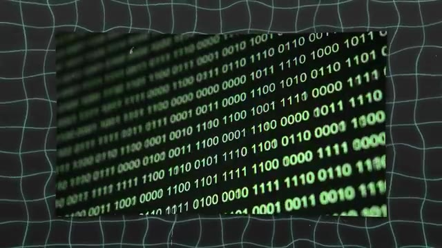
*📸 00:09:17 — Flux de données binaires (zéros et uns) illustrant le contenu d'un fichier corrompu ou d'un dump mémoire.*

---

### ⏱️ `[00:09:35 - 00:10:01]` | Segment #25

**🔊 Audio (Transcription Intégrale Mot pour Mot en Français) :**
> C'est presque un système overkill. Et c'est là où le fameux commit d'il y a un mois, il va être utile. Il va prendre ce fichier-là et il va justement changer certains caractères. Là où il y a un tiré, il va mettre un tiré du bas. Là où il y a un espace, il va remettre un tiré, un truc du style. Et cette action-là, ça va décorrompre l'archive. Ensuite, cette archive, elle est compressée. Une fois que cette archive, elle est décompressée, elle est toujours lisible Donc c'est-à-dire que même si quelqu'un arrive à la décorrompre et à la décompresser, alors que c'est censé être un truc corrompu et lisible à la base, eh bien il ne peut toujours rien voir.

**👁️ Analyse Visuelle d'Écran (gemini-3.5-flash-lite) :**
**Interface & Outils** : Aucune interface technique ou console visible.

**Contenu textuel & Code** : Aucun code, commande ou métrique affiché à l'écran.

**Action / Démonstration** : Explication orale d'un scénario de résolution de problème (décorrompre une archive via un commit Git spécifique).

---

### ⏱️ `[00:10:01 - 00:10:24]` | Segment #26

**🔊 Audio (Transcription Intégrale Mot pour Mot en Français) :**
> Et une fois qu'elle est déchiffrée, elle n'est toujours pas normalement lisible parce qu'il y a plein de charabes, il y a plein de trucs qui ne servent à rien dedans, à plein d'endroits dans le fichier. Donc c'est-à-dire qu'il faut connaître exactement la bonne technique pour enlever les morceaux du fichier qui ne servent à rien et recoller les bons fichiers pour avoir au final la backdoor. Et donc maintenant qu'on a notre petite backdoor, parce que maintenant qu'on a ce fameux fichier-là, qui est intégré dans XZ au moment du build, au moment de la compilation.

**👁️ Analyse Visuelle d'Écran (gemini-3.5-flash-lite) :**
**Interface & Outils** : Aucun outil, terminal ou interface logicielle n'est affiché.

**Contenu textuel & Code** : Aucun code, commande ou métrique technique visible à l'écran.

**Action / Démonstration** : Explication orale par le créateur sur les techniques de nettoyage et de reconstruction manuelle de fichiers déchiffrés.

---

### ⏱️ `[00:10:24 - 00:10:46]` | Segment #27

**🔊 Audio (Transcription Intégrale Mot pour Mot en Français) :**
> Comment cette backdoor dans XZ, elle se retrouve sur tous les savoirs SSH de Biorendumont ? En fait, XZ est intégré dans une librairie qui s'appelle Systemd. Et Systemd, c'est un gros programme qui fait plein plein plein de trucs différents sur la machine. Et un autre truc qu'il fait, par exemple, c'est gérer les fichiers de logs sur la machine. Et de temps en temps, les fichiers de logs, quand ils deviennent trop gros, il va les compresser.

**👁️ Analyse Visuelle d'Écran (gemini-3.5-flash-lite) :**
**Interface & Outils** : AUCUNE

**Contenu textuel & Code** : AUCUNE

**Action / Démonstration** : Explication orale de la propagation de la backdoor XZ via Systemd et les processus SSH.

---

### ⏱️ `[00:10:46 - 00:11:08]` | Segment #28

**🔊 Audio (Transcription Intégrale Mot pour Mot en Français) :**
> Historiquement, on avait plein de programmes séparés, c'est un peu la philosophie de Linux. On a un programme qui gère les logs, on a un programme qui gère la compression, on a un programme qui gère le SSH, on a un programme qui gère ceci, cela. Mais Systemd a petit à petit ramené plein de choses au comté, et donc maintenant Systemd fait plein de choses. Et Systemd est maintenant dans beaucoup de distributions, c'est le cas de Ubuntu, de Debian, intégré dans SSH.

**👁️ Analyse Visuelle d'Écran (gemini-3.5-flash-lite) :**
**Interface & Outils** : AUCUNE

**Contenu textuel & Code** : AUCUNE

**Action / Démonstration** : Explication orale de l'historique et de l'évolution de Linux et Systemd par le créateur.

---

### ⏱️ `[00:11:08 - 00:11:27]` | Segment #29

**🔊 Audio (Transcription Intégrale Mot pour Mot en Français) :**
> C'est-à-dire que quand le serveur SSH démarre, qui permet de recevoir les connexions depuis l'extérieur et de se connecter à la machine à distance, le serveur SSH intègre Systemd, et Systemd intègre XZ. et XZ intègre la backdoor qui permet d'avoir accès à distance à JIA. Et ce qui est super smart, c'est que le serveur SSH, il tourne en tant que route sur la machine.

**👁️ Analyse Visuelle d'Écran (gemini-3.5-flash-lite) :**
**Interface & Outils** : Graphique de type schéma conceptuel / architecture en boîtes imbriquées.

**Contenu textuel & Code** : Boîtes textuelles étiquetées SSH, System D, XZ et une icône d'alerte.

**Action / Démonstration** : Explication schématique de l'imbrication des composants logiciels et de la vulnérabilité de la backdoor XZ.

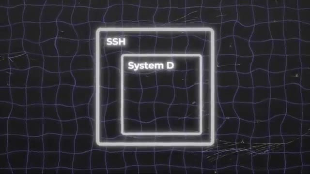
*📸 00:11:17 — Schéma imbriqué montrant le serveur SSH contenant Systemd.*

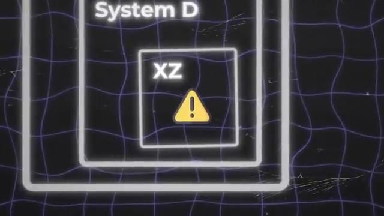
*📸 00:11:22 — Schéma imbriqué montrant Systemd contenant XZ avec une icône d'avertissement.*

---

### ⏱️ `[00:11:28 - 00:11:47]` | Segment #30

**🔊 Audio (Transcription Intégrale Mot pour Mot en Français) :**
> Donc ça veut dire que la backdoor en elle-même, elle a les accès route, elle peut tout faire sur la machine, elle peut faire tout ce qu'elle veut. C'est-à-dire qu'une fois que ça, ça tourne sur une machine, JIA, il peut se connecter à distance sur n'importe lesquelles des machines qui tournent SSH, c'est-à-dire 99% des serveurs, et faire ce qu'il veut sur la machine sans qu'il n'y ait aucune trace, sans qu'il n'y ait aucun log, et sans qu'il n'y ait aucune restriction.

**👁️ Analyse Visuelle d'Écran (gemini-3.5-flash-lite) :**
**Interface & Outils** : Terminal Linux (SSH / CLI) sur un système Ubuntu Server.

**Contenu textuel & Code** : Informations de login système, adresses IP réseau (Docker, Tailscale, interfaces locales) et prompt root actif (`root@homelab1:~#`).

**Action / Démonstration** : Affichage du statut système et des interfaces réseau pour illustrer l'accès root et la configuration des serveurs cibles.

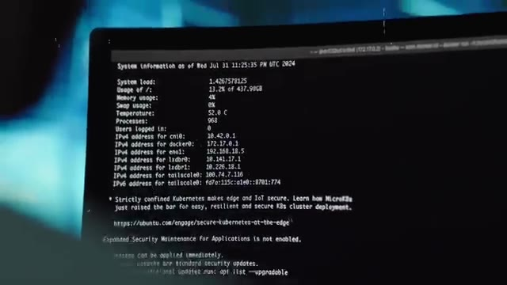
*📸 00:11:38 — Terminal Linux affichant les informations système (Ubuntu) avec la charge, l'utilisation mémoire et les adresses IP des différentes interfaces (cni0, docker0, eno1, tailscale0).*

*📸 00:11:43 — Terminal Linux montrant les dernières lignes de connexion SSH (`root@homelab1:~#`) et les notifications de mises à jour système en attente.*

---

### ⏱️ `[00:11:47 - 00:12:21]` | Segment #31

**🔊 Audio (Transcription Intégrale Mot pour Mot en Français) :**
> donc c'est pour ça que l'échelle, le scale de ce hack est vraiment incroyable. Maintenant comment on va faire pour que cette toute nouvelle version de XZ se retrouve dans justement Ubuntu, dans Debian, dans toutes les distributions Linux ? Eh bien Gilles va reprendre sa bonne vieille méthode d'aller faire pression à droite à gauche parce qu'il a déjà tous ses faux comptes donc autant aller s'en servir et donc il va aller sur la mail inis de Debian et dire ah moi j'ai eu un petit problème avec cette version de bien ça serait bien que vous mettez en place la nouvelle version de xz parce que ça fixe des problèmes ensuite il va prendre un autre compte il va aller dire ah ça serait bien que

**👁️ Analyse Visuelle d'Écran (gemini-3.5-flash-lite) :**
**Interface & Outils** : Aucun outil, terminal ou interface logicielle n'est visible sur ces images.

**Contenu textuel & Code** : Aucun code, commande, architecture ou métrique technique n'est affiché.

**Action / Démonstration** : Aucune manipulation ou explication technique n'est réalisée à l'écran, il s'agit d'une séquence narrative d'illustration (b-roll).

---

### ⏱️ `[00:12:21 - 00:12:52]` | Segment #32

**🔊 Audio (Transcription Intégrale Mot pour Mot en Français) :**
> vous mettiez la nouvelle version de xz à la pleine nouvelle fonctionnalité trop bien faire sa petite opération de communication un peu à droite à gauche pour aller pousser tous les maintainers des différents distributions linux a ajouté dans leur prochaine version la nouvelle version de l'execl qui contient la bacte or et d'eau qui pousse un peu partout et les premiers à à Morda Lamson, c'est Debian, qui vont dire « Ok, si tu insistes, ils vont rajouter cette nouvelle version de Exed dans leur nouvelle version de Debian.

**👁️ Analyse Visuelle d'Écran (gemini-3.5-flash-lite) :**
**Interface & Outils** : AUCUNE

**Contenu textuel & Code** : AUCUNE

**Action / Démonstration** : Explication orale de la stratégie d'ingénierie sociale et de communication menée pour faire adopter la version compromise de xz par les mainteneurs de distributions Linux.

---

### ⏱️ `[00:12:53 - 00:13:16]` | Segment #33

**🔊 Audio (Transcription Intégrale Mot pour Mot en Français) :**
> C'est une version qu'ils appellent « testing », parfois même « unstable ». Ça veut dire que c'est une version qui ne va pas être supportée sur le long terme, c'est une version un petit peu intermédiaire, où on va justement rajouter pas mal de nouvelles versions de nouveaux packages, qui sont censés normalement fonctionner sans problème, qui sont censés corriger plein de trucs, ajouter plein de fonctionnalités, mais qu'on n'a jamais encore vraiment testé en production sur des vrais serveurs où il y a vraiment de la charge qui tourne etc.

**👁️ Analyse Visuelle d'Écran (gemini-3.5-flash-lite) :**
**Interface & Outils** : AUCUNE

**Contenu textuel & Code** : AUCUNE

**Action / Démonstration** : Explication orale de concepts liés aux versions de distribution Linux instables et de test.

---

### ⏱️ `[00:13:16 - 00:13:35]` | Segment #34

**🔊 Audio (Transcription Intégrale Mot pour Mot en Français) :**
> Et donc c'est pour ça qu'ils sortent cette version là. Ceux qui aiment vraiment avoir les toutes dernières fonctionnalités, les toutes dernières corrections, ils vont faire tourner cette version en production. Et puis au bout d'un certain moment, un an, deux ans, suivant les différentes distributions, à quel point ils sont frileux, ils vont dire ok, ces versions là on considère qu'elles sont stables et ils vont les mettre dans une version qui est définitive.

**👁️ Analyse Visuelle d'Écran (gemini-3.5-flash-lite) :**
**Interface & Outils** : Aucun outil, terminal ou interface affiché.

**Contenu textuel & Code** : Aucun contenu technique (commandes, code ou architecture).

**Action / Démonstration** : Explication théorique sur les cycles de vie des versions logicielles et leur utilisation en production.

---

### ⏱️ `[00:13:35 - 00:14:04]` | Segment #35

**🔊 Audio (Transcription Intégrale Mot pour Mot en Français) :**
> Et donc la nouvelle version de test de Debian est disponible. Et c'est là qu'on retrouve notre fameux développeur Postgre. Donc lui en gros il travaille sur Postgre qui est une base de données et il fait des micro benchmarks, c'est à dire des tests de performance mais vraiment à 1 ou 2% près pour savoir quelle fonction, quel code est le plus performant. Et donc pour pouvoir faire ça, il faut que tout ce qui tourne sur sa machine consomme le moins de ressources possibles parce que s'il a plein de processus qui consomment 3-4% de CPU, il ne pourra jamais savoir si telle version consomme 2% de plus ou 2% de moins que la version d'avant.

**👁️ Analyse Visuelle d'Écran (gemini-3.5-flash-lite) :**
**Interface & Outils** : Terminal Linux exécutant l'utilitaire de monitoring htop.

**Contenu textuel & Code** : Affichage détaillé des 16 cœurs logiques CPU (0 à 15) avec leurs barres de charge, la barre d'utilisation de la mémoire (Mem), et la liste des processus système (K3s, Netdata, containerd) avec leurs PIDs, utilisateurs, priorités, consommation CPU/RAM et temps d'exécution.

**Action / Démonstration** : Surveillance en temps réel des performances système et de la charge des processus lors de tests ou benchmarks.

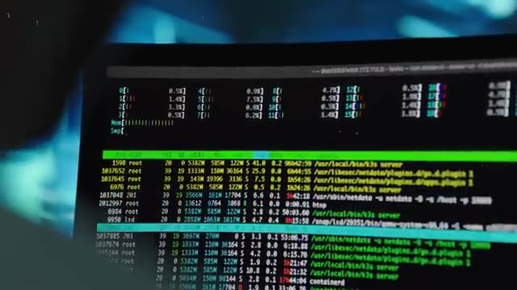
*📸 00:13:57 — Vue rapprochée d'un écran de terminal affichant un outil de surveillance système (htop) avec les métriques d'utilisation des cœurs CPU et la liste des processus en cours.*

---

### ⏱️ `[00:14:04 - 00:14:30]` | Segment #36

**🔊 Audio (Transcription Intégrale Mot pour Mot en Français) :**
> Donc dans l'idéal, il faut que tout consomme 0 à part sa base de données. Pour pouvoir voir le mieux possible les différences de performance entre deux versions, il va limiter le bruit sur sa machine. C'est-à-dire limiter le plus possible la consommation de ressources par tous les autres composants qui tournent sur sa machine, autre que sa base de données. Et donc, il regarde sur sa machine qu'est-ce qu'il consomme du CPU, il essaye de limiter un petit peu, et il se rend compte que parfois, le CPU qui est utilisé par le serveur SSH sur sa machine, il a des petits pics de CPU.

**👁️ Analyse Visuelle d'Écran (gemini-3.5-flash-lite) :**
**Interface & Outils** : Aucun outil, terminal ou console affiché.

**Contenu textuel & Code** : Aucun code, configuration ou métrique technique visible.

**Action / Démonstration** : Explication théorique sur l'optimisation des performances et la réduction du bruit système.

---

### ⏱️ `[00:14:31 - 00:15:03]` | Segment #37

**🔊 Audio (Transcription Intégrale Mot pour Mot en Français) :**
> Et il se dit, c'est quand même bizarre parce que je n'utilise pas SSH, je ne me connecte pas par SSH. donc comment ça se fait ? Et là on a encore de la chance parce qu'il se trouve que sa machine elle est exposée sur internet et que sur internet il y a plein de bots qui essayent des IP au hasard et qui essayent de se connecter en SSH peut-être avec juste mot de passe admin admin pour essayer de... voilà on sait jamais si vous avez un savoir qui est exposé sur internet allez regarder dans les logs vous verrez que c'est le cas de temps en temps il y a des gens qui essayent de se connecter à votre machine et lui il remarque qu'à chaque fois que quelqu'un se fait refuser la connexion et bah il y a un pic de CPU et il voit ce pic là et il se dit il ne devrait pas y avoir de pic parce que tu fais juste refuser la connexion,

**👁️ Analyse Visuelle d'Écran (gemini-3.5-flash-lite) :**
**Interface & Outils** : Présentation ou face-caméra sans interface informatique partagée.

**Contenu textuel & Code** : Explications orales des concepts, architectures et retours d'expérience.

**Action / Démonstration** : Démonstration pédagogique et mise en perspective technique.

---

### ⏱️ `[00:15:03 - 00:15:26]` | Segment #38

**🔊 Audio (Transcription Intégrale Mot pour Mot en Français) :**
> normalement, tu refuses, tu refuses. Tu sais, c'est vite fait. Il n'y a pas les trucs de fou à faire. Donc déjà, ça veut dire qu'il a l'intuition de savoir qu'est-ce qui est censé prendre des ressources ou pas pour un programme qu'il ne connaît pas. Mais il a quand même la confirmation de ça parce qu'il compare par rapport à la version d'avant, c'est-à-dire qu'il installe l'ancienne version de Bian, et il voit qu'effectivement, sur l'ancienne version, quand il y a une connexion SSH qui est refusée, il n'y a pas de pic de CP.

**👁️ Analyse Visuelle d'Écran (gemini-3.5-flash-lite) :**
**Interface & Outils** : Présentation ou face-caméra sans interface informatique partagée.

**Contenu textuel & Code** : Explications orales des concepts, architectures et retours d'expérience.

**Action / Démonstration** : Démonstration pédagogique et mise en perspective technique.

---

### ⏱️ `[00:15:26 - 00:15:48]` | Segment #39

**🔊 Audio (Transcription Intégrale Mot pour Mot en Français) :**
> Comme ça, un mec qui a l'habitude des tests de performance, etc., Il connaît un petit peu tous les outils pour pouvoir débugger et comprendre qu'est-ce qui se passe. Il va même un petit peu plus loin. Pour accentuer les différences de performance, il va faire exprès d'utiliser une plus vieille machine. Parce que plus la machine est faible, plus les différences de performance vont se voir. En plus de ça, et ça c'est vraiment un coup de chance, il va désactiver le turbo boost dans son CPU.

**👁️ Analyse Visuelle d'Écran (gemini-3.5-flash-lite) :**
**Interface & Outils** : AUCUNE

**Contenu textuel & Code** : AUCUN

**Action / Démonstration** : Explication orale sur les tests de performance et l'utilisation de machines plus anciennes pour accentuer les écarts de performance.

---

### ⏱️ `[00:15:48 - 00:16:08]` | Segment #40

**🔊 Audio (Transcription Intégrale Mot pour Mot en Français) :**
> Parce que dans la plupart des processeurs modernes, la fréquence va s'overclocker un petit peu automatiquement en fonction de s'il y a quelque chose à faire. Et s'il n'y a rien à faire, la fréquence diminue et comme ça, ça consomme moins d'énergie. et lui fait exprès de désactiver ça. Comme ça, son processeur, il va tout le temps tourner à une fréquence stable. Et donc, s'il y a quelque chose qui prend beaucoup de CPU, eh bien, on va avoir un pic dans l'utilisation du CPU.

**👁️ Analyse Visuelle d'Écran (gemini-3.5-flash-lite) :**
**Interface & Outils** : Aucune interface affichée (simple plan vidéo).

**Contenu textuel & Code** : Aucun contenu textuel, code ou métrique visible.

**Action / Démonstration** : Explication orale du fonctionnement de la gestion de la fréquence des processeurs et de la désactivation des modes d'économie d'énergie.

---

### ⏱️ `[00:16:08 - 00:16:31]` | Segment #41

**🔊 Audio (Transcription Intégrale Mot pour Mot en Français) :**
> Ce que la plupart des autres personnes qui ont une machine normale ne vont jamais voir. Parce que s'il y a un petit pic d'utilisation, par exemple, s'il y a un programme qui utilise 5% de CPU, le CPU, il va doubler sa fréquence. Et en fait, ce pic de 5%, tu ne le verras jamais. Ou ça sera un pic de 1%. Donc, il commence à débugger son serveur SSH et se rendre compte que le pic de CPU, il vient de la fameuse librairie XZ de compression de fichiers.

**👁️ Analyse Visuelle d'Écran (gemini-3.5-flash-lite) :**
**Interface & Outils** : AUCUNE

**Contenu textuel & Code** : AUCUNE

**Action / Démonstration** : Explication orale du fonctionnement de la fréquence CPU et du monitoring des pics de charge.

---

### ⏱️ `[00:16:32 - 00:16:52]` | Segment #42

**🔊 Audio (Transcription Intégrale Mot pour Mot en Français) :**
> Donc là il se dit, c'est vraiment bizarre parce que normalement la fonction qui est appelée à ce moment-là quand quelqu'un essaie de se connecter c'est une fonction de déchiffrement d'une clé SSH en fouillant profondément et en passant la nuit à chercher il vient à la conclusion que ça vient de la librairie XZ mais il y a bien et bien une backdoor et que c'est non pas juste sur sa machine mais que c'est sur toutes les machines qui ont cette version de Debian.

**👁️ Analyse Visuelle d'Écran (gemini-3.5-flash-lite) :**
**Interface & Outils** : Présentation ou face-caméra sans interface informatique partagée.

**Contenu textuel & Code** : Explications orales des concepts, architectures et retours d'expérience.

**Action / Démonstration** : Démonstration pédagogique et mise en perspective technique.

---

### ⏱️ `[00:16:52 - 00:17:11]` | Segment #43

**🔊 Audio (Transcription Intégrale Mot pour Mot en Français) :**
> Donc là, lui-même il n'y croit pas. C'est-à-dire que la nuit il se dit « Ok, non, je ne veux pas m'afficher, je ne veux pas commencer à alerter tout le monde. » Alors que ça se trouve, c'est moi qui est en train d'halluciner. Là, il est 3h du mat', je vais juste aller me coucher. Et puis, je re-regarderai demain matin parce que ce n'est pas possible. Ça paraît impossible qu'il y ait une bague d'or dans SSH. Et effectivement, le lendemain matin, il se réveille, il revérifie tout.

**👁️ Analyse Visuelle d'Écran (gemini-3.5-flash-lite) :**
**Interface & Outils** : Aucune interface visible.

**Contenu textuel & Code** : Aucun contenu technique, de code ou de métriques.

**Action / Démonstration** : Explication narrative illustrant le doute d'un administrateur système face à une anomalie détectée tard dans la nuit.

---

### ⏱️ `[00:17:12 - 00:17:31]` | Segment #44

**🔊 Audio (Transcription Intégrale Mot pour Mot en Français) :**
> Et à ce moment-là, c'est là qu'il alerte tout le monde. Il y a l'alerte Red Hat, il alerte Ubuntu, Debian. Et donc, très très rapidement, toute la communauté de sécurité commence à verrouiller, revenir en arrière, enlever ses versions de UXZ de partout. et très rapidement on comprend un petit peu ce qui s'est passé, on regarde le repo, on voit d'où ça vient. Et c'est là qu'on a découvert un peu toute la superchérie. Donc on a eu vraiment vraiment beaucoup de chance.

**👁️ Analyse Visuelle d'Écran (gemini-3.5-flash-lite) :**
**Interface & Outils** : Présentation ou face-caméra sans interface informatique partagée.

**Contenu textuel & Code** : Explications orales des concepts, architectures et retours d'expérience.

**Action / Démonstration** : Démonstration pédagogique et mise en perspective technique.

---

### ⏱️ `[00:17:31 - 00:17:51]` | Segment #45

**🔊 Audio (Transcription Intégrale Mot pour Mot en Français) :**
> On a eu de la chance que le développeur de Postgre fasse ses tests juste un jour ou deux après que la nouvelle version de Debian soit sortie. Que cette version qui allait être poussée sur Red Hat, sur Ubuntu, sur plein d'autres, n'était pas encore sur ces versions-là. Que ce mec-là avait le background nécessaire pour pouvoir voir que c'était bizarre et faire toute l'investigation pour pouvoir trouver la source du problème.

**👁️ Analyse Visuelle d'Écran (gemini-3.5-flash-lite) :**
**Interface & Outils** : Environnement de développement avec double écran, affichant du code et des consoles de commande.

**Contenu textuel & Code** : Lignes de code source et terminaux Unix/Linux non détaillés lisiblement.

**Action / Démonstration** : Explication technique sur les tests et la détection d'anomalies logiques par un développeur.

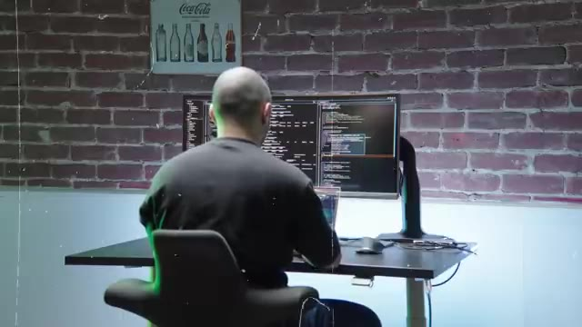
*📸 00:17:36 — Vue de dos d'un administrateur devant un double écran affichant du code source et des terminaux textuels.*

---

### ⏱️ `[00:17:51 - 00:18:15]` | Segment #46

**🔊 Audio (Transcription Intégrale Mot pour Mot en Français) :**
> et que par chance, sa machine était vraiment une machine bas de gamme, donc les différences de performance étaient exagérées. Il avait aussi désactivé le tourboboon, et que sa machine était exposée sur Internet, et qu'à ce moment-là, il y avait des bots qui essayaient de se connecter, et qui déclenchaient ce petit pic de CPU. Donc si on n'avait pas vu ce mec-là, s'il n'avait pas vu tout ça, s'il n'avait pas vu toutes ces coïncidences, la backdoor aurait continué sa vie, il y a plein de gens qui auraient commencé à utiliser ces nouvelles versions de tous ces OS.

**👁️ Analyse Visuelle d'Écran (gemini-3.5-flash-lite) :**
**Interface & Outils** : Terminal Linux / htop

**Contenu textuel & Code** : Utilisation détaillée des cœurs CPU, consommation mémoire et processus système (k3s, containerd, netdata, htop)

**Action / Démonstration** : Surveillance en temps réel de la charge CPU et des processus pour illustrer l'impact des pics d'activité sur la machine.

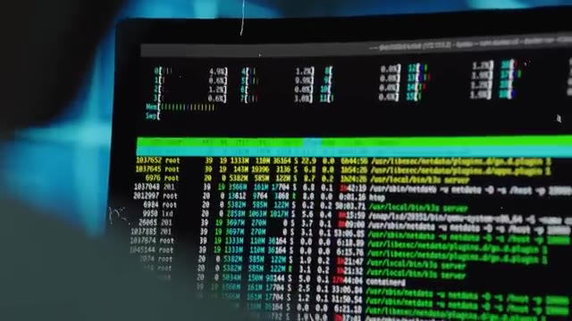
*📸 00:17:57 — Vue rapprochée d'un terminal Linux affichant l'utilitaire de surveillance système htop avec les barres d'utilisation CPU par cœur et la liste des processus en cours.*

---

### ⏱️ `[00:18:15 - 00:18:46]` | Segment #47

**🔊 Audio (Transcription Intégrale Mot pour Mot en Français) :**
> Donc là encore, ça n'aurait pas été si grave, parce que ce n'est pas tout le monde qui va utiliser des versions de testing en production, même si ça arrive. Et quelques mois plus tard, il allait y avoir une nouvelle version, cette fois-ci stable de toutes les distributions Linux, qui allait intégrer cette version de XZ. Et à partir de ce moment-là, le mec avait juste à attendre tranquillement, peut-être un an ou deux, mais ça fait déjà deux ans que le mec prépare son coup, il aurait eu accès à toutes les machines qui utilisent Red Hat, Debian, Linux, qui utilisent toutes les distributions qui intègrent Systemd à SSH.

**👁️ Analyse Visuelle d'Écran (gemini-3.5-flash-lite) :**
**Interface & Outils** : Présentation ou face-caméra sans interface informatique partagée.

**Contenu textuel & Code** : Explications orales des concepts, architectures et retours d'expérience.

**Action / Démonstration** : Démonstration pédagogique et mise en perspective technique.

---

### ⏱️ `[00:18:46 - 00:19:05]` | Segment #48

**🔊 Audio (Transcription Intégrale Mot pour Mot en Français) :**
> et c'est la plupart, voire la majorité des distributions qui sont utilisées en production par toutes les entreprises dans le monde. Donc le mec aura eu en gros le passe-partout ultime. C'est-à-dire que n'importe quel serveur SSH sur la Terre, le mec a la backdoor, il peut se connecter et faire ce qu'il veut discrètement sans que personne ne voit jamais rien, sans qu'il n'y ait jamais aucun log partout et sans qu'il n'y ait personne pour l'arrêter.

**👁️ Analyse Visuelle d'Écran (gemini-3.5-flash-lite) :**
**Interface & Outils** : Terminal de commande Linux / Console SSH.

**Contenu textuel & Code** : Métriques d'utilisation système (mémoire, température CPU, processus, nombre d'utilisateurs connectés) et interfaces réseau IPv4/IPv6, accompagnées d'informations sur les mises à jour de sécurité Ubuntu.

**Action / Démonstration** : Affichage d'informations système et réseau au démarrage d'une session sur un serveur Linux.

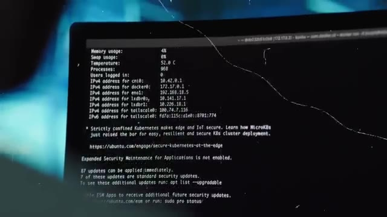
*📸 00:18:56 — Écran affichant un terminal Linux avec des informations système et réseau (adresses IP d'interfaces cni0, docker0, eno1, tailscale0) ainsi que le message MOTD d'Ubuntu.*

---

### ⏱️ `[00:19:05 - 00:19:26]` | Segment #49

**🔊 Audio (Transcription Intégrale Mot pour Mot en Français) :**
> Et donc ça ouvre une plus grosse question, c'est qui est ce fameux Jihad ? Qui est Jihad ? C'est un hack d'une telle ampleur et avec une échelle de temps, une patience tellement longue et avec aussi des ressources tellement élevées dans le sens où c'est pas n'importe qui qui est capable de faire des commits legit pendant des années d'un projet open source en C sur la compression des données.

**👁️ Analyse Visuelle d'Écran (gemini-3.5-flash-lite) :**
**Interface & Outils** : Terminaux Linux, éditeur de code et fenêtres de monitoring en arrière-plan.

**Contenu textuel & Code** : Lignes de code source et affichage de texte en colonnes (flux vert et interfaces de type IDE/terminal).

**Action / Démonstration** : Explication contextuelle sur l'analyse d'un code compromis et le profil des attaquants dans un projet open source.

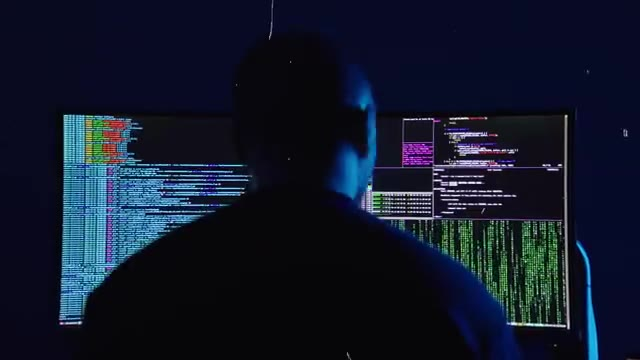
*📸 00:19:21 — Vue de dos d'un opérateur face à deux grands écrans affichant du code source et des flux de données en terminal, illustrant le travail d'analyse ou de développement.*

---

### ⏱️ `[00:19:26 - 00:19:45]` | Segment #50

**🔊 Audio (Transcription Intégrale Mot pour Mot en Français) :**
> C'est vraiment un truc profond. Donc ça laisse à penser que c'est pas forcément une personne, mais c'est peut-être un groupe de personnes, voire même une agence de surveillance gouvernementale. Évidemment, c'est pas personne va revendiquer. Sûrement qu'on saura jamais. Mais a priori, on pourrait penser que c'est une attaque peut-être qui vient de la Chine, potentiellement d'une agence de renseignement chinoise.

**👁️ Analyse Visuelle d'Écran (gemini-3.5-flash-lite) :**
**Interface & Outils** : AUCUNE

**Contenu textuel & Code** : AUCUNE

**Action / Démonstration** : AUCUNE

---

### ⏱️ `[00:19:45 - 00:20:04]` | Segment #51

**🔊 Audio (Transcription Intégrale Mot pour Mot en Français) :**
> Après tout, le mec s'appelle Jia Tan. En plus de ça, il y a des analystes qui ont vu que l'heure des commits qui ont été faits sur le repo, elle correspondait à la timezone de la Chine. Donc, ça laisse supposer. Mais il y a d'autres petits trucs qui laissent penser que c'est peut-être un leurre. Les IP qui ont été utilisées pour faire les commits, c'est une IP taïwanaise. Donc là, ça fait quand même plusieurs preuves.

**👁️ Analyse Visuelle d'Écran (gemini-3.5-flash-lite) :**
**Interface & Outils** : Logiciel de cartographie ou vue satellite de type globe virtuel.

**Contenu textuel & Code** : Carte géographique centrée sur l'Europe montrant les pays et les frontières terrestres et maritimes.

**Action / Démonstration** : Illustration visuelle de l'analyse géolocalisée (fuseaux horaires et origines des connexions/IP évoqués dans le discours).

*📸 00:19:59 — Vue satellite géographique de l'Europe et de ses frontières, illustrant l'analyse des origines géographiques ou des adresses IP.*

---

### ⏱️ `[00:20:04 - 00:20:27]` | Segment #52

**🔊 Audio (Transcription Intégrale Mot pour Mot en Français) :**
> Mais probablement que c'est simplement des leurres. Parce que, premièrement, l'IP qui vient de Taïwan, on a vu que c'est une IP qui appartient en fait à un VPN. Donc c'est-à-dire que J.A. passait pour un VPN et probablement n'était pas à Taiwan. Deuxièmement, on voit que de temps en temps, la time zone, elle change et elle passe plutôt Europe de l'Est, juste quelques fois. Donc on pourrait se dire peut-être que c'est rien, peut-être qu'un jour J.A. il s'est réveillé à 2h du mat pour faire un décomit, ou alors peut-être qu'il a oublié de changer la time zone sur son ordi de temps en temps.

**👁️ Analyse Visuelle d'Écran (gemini-3.5-flash-lite) :**
**Interface & Outils** : AUCUNE

**Contenu textuel & Code** : AUCUNE

**Action / Démonstration** : Explication orale de l'analyse des adresses IP et des fuseaux horaires (VPN, leurres), sans support visuel technique à l'écran.

---

### ⏱️ `[00:20:27 - 00:20:47]` | Segment #53

**🔊 Audio (Transcription Intégrale Mot pour Mot en Français) :**
> C'est peut-être quelque chose qui est probable aussi. Et quelque chose qui est encore plus flacrant, c'est qu'on voit que J.A. a travaillé pendant tous les jours fériés chinois. Par contre, il n'a pas travaillé pendant les fêtes plus occidentales comme Noël et choses comme ça. Donc ça l'aide plutôt à penser que le mec a changé la time zone sur son ordi, utilise un VPN et s'est mis un petit nom à consonance chinoise pour faire croire que c'est les chinois.

**👁️ Analyse Visuelle d'Écran (gemini-3.5-flash-lite) :**
**Interface & Outils** : Aucune interface technique, console ou terminal affiché.

**Contenu textuel & Code** : Aucun code, commande, architecture réseau ou métrique visible.

**Action / Démonstration** : Explication orale du créateur concernant l'analyse des fuseaux horaires et des jours de repos d'un contributeur (J.A.).

---

### ⏱️ `[00:20:47 - 00:21:20]` | Segment #54

**🔊 Audio (Transcription Intégrale Mot pour Mot en Français) :**
> Parce qu'après tout, c'est toujours les chinois. Voilà, le cancel incoming. Parce qu'après tout, les américains vont se dire de toute façon, c'est toujours les chinois. Alors qu'en fait, c'est peut-être, et c'est même ce qui est le plus probable, c'est ce qu'on pense en ce moment, que ça serait une agence de renseignement russe qui s'appelle le SVR. et pourquoi on pense que c'est elle parce que ça ressemble beaucoup à au mode opératoire qu'ils ont déjà utilisé auparavant premièrement l'excellence technique le fait que la backdoor soit over engineer faire que c'est caché dans un truc qui est caché qui est caché dans un truc qui est caché que c'est un projet en c'est sur la compression donc c'est vraiment un truc c'est pas

**👁️ Analyse Visuelle d'Écran (gemini-3.5-flash-lite) :**
**Interface & Outils** : Navigateur web (Wikipedia).

**Contenu textuel & Code** : Article Wikipédia sur le SVR (Service des renseignements extérieurs de la fédération de Russie), incluant son historique et son emblème.

**Action / Démonstration** : Illustration visuelle du sujet abordé (l'agence de renseignement russe SVR) pour appuyer les explications du discours.

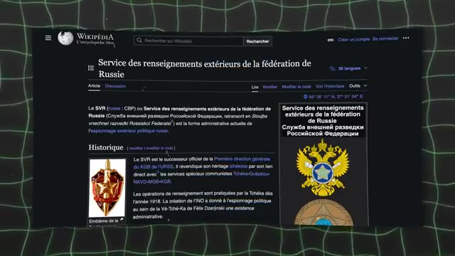
*📸 00:21:03 — Page Wikipédia en français concernant le Service des renseignements extérieurs de la fédération de Russie (SVR).*

---

### ⏱️ `[00:21:20 - 00:21:55]` | Segment #55

**🔊 Audio (Transcription Intégrale Mot pour Mot en Français) :**
> n'importe qui qui peut faire ça en termes de connaissances techniques et que en plus de ça c'est pas la première fois qu'ils mettent en place une attaque qui est pour le très long terme c'est à dire que ça les dérange pas qu'une attaque prennent deux ans quatre ans cinq ans ils s'en foutent et ils se disent de toute manière moi je m'en fous si j'étais en quatre ans, si dans quatre ans j'ai accès à tout le serveur de la terre. Pour eux ça vaut largement. Alors que pour une personne individuelle c'est déjà plus difficile de se dire que quelqu'un va penser comme ça. Donc on a eu vraiment chaud sur cette fête là. Mais ce qui fait le plus peur dans cette affaire, c'est pas qu'il y a plein de machines qui auraient pu attaquer, c'est qu'on n'avait jamais vu avant ce type d'attaque. Et donc ça laisse penser que peut-être cette attaque a déjà été utilisée

**👁️ Analyse Visuelle d'Écran (gemini-3.5-flash-lite) :**
**Interface & Outils** : AUCUNE

**Contenu textuel & Code** : AUCUNE

**Action / Démonstration** : Explication orale sur la persistance et les compétences techniques requises pour mener des attaques informatiques à long terme, sans support technique interactif affiché.

---

### ⏱️ `[00:21:55 - 00:22:14]` | Segment #56

**🔊 Audio (Transcription Intégrale Mot pour Mot en Français) :**
> dans le passé. Et d'ailleurs même J.A.Tan il a participé à plein d'autres projets open source. Donc finalement il se trouve qu'on a regardé et que tout était légit, le mec restait quand même le plus légit possible pour pas se faire cramer. Mais peut-être que si c'est une agence qui fait ça, peut-être qu'ils ont déjà fait ça plein de fois dans le passé. Et peut-être qu'il y a plein de backdoors dans plein de projets open source différents.

**👁️ Analyse Visuelle d'Écran (gemini-3.5-flash-lite) :**
**Interface & Outils** : Présentation ou face-caméra sans interface informatique partagée.

**Contenu textuel & Code** : Explications orales des concepts, architectures et retours d'expérience.

**Action / Démonstration** : Démonstration pédagogique et mise en perspective technique.

---

### ⏱️ `[00:22:14 - 00:22:46]` | Segment #57

**🔊 Audio (Transcription Intégrale Mot pour Mot en Français) :**
> Et en fait on le sait pas. Donc c'est ça qui fait le plus peur dans cette histoire. Parce que c'est une attaque qui au final qui est humaine. Tu vois on va trouver des projets open source fait par un mec tout seul qui a laissé un peu à l'abandon son projet. petit à petit on fait des trucs legit on reprend le contrôle du projet et après on va mettre ce qu'on veut là dedans et comme dans linux dans l'open source tout est un petit peu imbriqué l'un dans l'autre il ya beaucoup de projets comme dans le fameux mime xkcd il ya beaucoup de projets qui sont gérés par un ou deux mecs à droite à gauche qui sont utilisés dans plein de programmes qui sont eux-mêmes utilisés dans plein de programmes qui fait qu'en fait ça tombe partout

**👁️ Analyse Visuelle d'Écran (gemini-3.5-flash-lite) :**
**Interface & Outils** : AUCUNE

**Contenu textuel & Code** : AUCUNE

**Action / Démonstration** : Explication orale du créateur sur les attaques de supply chain et la compromission de projets open-source abandonnés, sans support visuel technique à l'écran.

---

### ⏱️ `[00:22:46 - 00:23:06]` | Segment #58

**🔊 Audio (Transcription Intégrale Mot pour Mot en Français) :**
> moi personnellement ce que j'en retire c'est que même si au final va toujours y avoir des des attaquants, des gens qui vont essayer de faire des dingueries. Au final, on a quand même fini par trouver cette attaque. Ça paraît incroyable qu'on ait trouvé ce genre de backdoor, ce genre d'attaque-là. Et en fait, on peut se dire que le point d'être open source, peut-être que c'est une faille, un inconvénient à cause justement de ce type d'attaque.

**👁️ Analyse Visuelle d'Écran (gemini-3.5-flash-lite) :**
**Interface & Outils** : AUCUNE

**Contenu textuel & Code** : AUCUNE

**Action / Démonstration** : Explication orale et analyse sur la détection de backdoors et la sécurité des systèmes.

---

### ⏱️ `[00:23:06 - 00:23:31]` | Segment #59

**🔊 Audio (Transcription Intégrale Mot pour Mot en Français) :**
> Mais en fait, à mon avis, ça montre vraiment sa force. Parce que même si dans le temps, il y a 1% de personnes qui vont être mal intentionnées, il y a tellement une grosse masse de personnes qui, elles, sont bien intentionnées qu'en fait, la chance est de notre côté, le temps est de notre côté. Et même si le développeur de Postgre n'aurait pas trouvé ça, très probablement, et même de son aveu à lui-même. Et là aussi, peut-être que ça aurait été par chance ou un peu par hasard, mais le fait que la communauté soit si grande et qu'il y ait autant de gens qui puissent regarder ce programme fait que la chance est de notre côté.

**👁️ Analyse Visuelle d'Écran (gemini-3.5-flash-lite) :**
**Interface & Outils** : Aucun outil, terminal ou console n'est affiché.

**Contenu textuel & Code** : Aucune commande, code ou métrique technique visible.

**Action / Démonstration** : Explication orale sans manipulation ou support visuel technique.

---

### ⏱️ `[00:23:31 - 00:23:35]` | Segment #60

**🔊 Audio (Transcription Intégrale Mot pour Mot en Français) :**
> Et donc, si comprendre ce genre de faille de sécurité t'intéresse, je te laisse aller voir la vidéo ici.

**👁️ Analyse Visuelle d'Écran (gemini-3.5-flash-lite) :**
**Interface & Outils** : Aucune interface ou console technique visible.

**Contenu textuel & Code** : Aucun contenu technique, code ou architecture affiché.

**Action / Démonstration** : Explication orale sans support technique visuel à l'écran.

---

