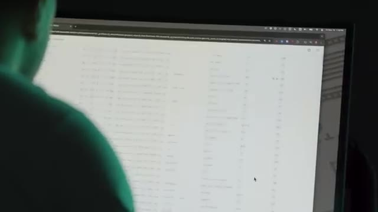
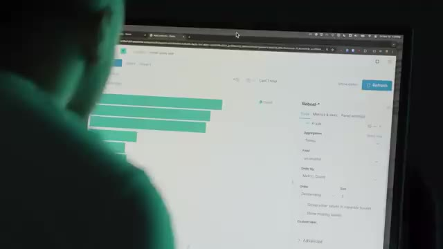
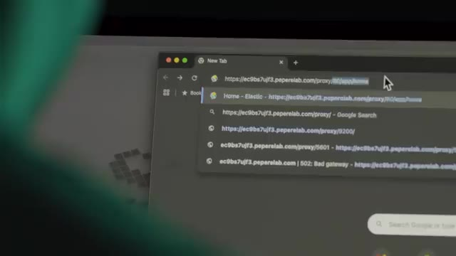

# 🎬 J'ai foutu la merde en prod ...

> **Chaîne** : [cocadmin](https://www.youtube.com/@cocadmin)  
> **Lien YouTube** : [https://www.youtube.com/watch?v=QU6yGZ17Zak](https://www.youtube.com/watch?v=QU6yGZ17Zak)  
> **Date de publication** : 20241124  
> **Durée** : 00:19:28  
> **Identifiant vidéo** : `QU6yGZ17Zak`  
> **Transcription & Analyse** : `whisper-v3-large-turbo+gemini-3.5-flash-lite`  

---

## 📌 Synthèse Exécutive & Outils

### 💡 Résumé

Cette vidéo de la chaîne *cocadmin* plonge dans le quotidien réaliste et parfois chaotique de l'administration système à travers deux anecdotes de production marquantes. La première se déroule sur une infrastructure AWS hébergeant le jeu mobile *Magic the Gathering*. Confronté à un bug mystérieux et intermittent provoquant des pannes sans surcharge apparente des ressources, l'ingénieur recourt à une « kill switch » pour afficher un message de maintenance et redémarrer le service en douceur. Faute de temps et de reproductibilité en environnement de développement, cette manipulation se transforme peu à peu en un rituel de contournement manuel non documenté, illustrant la dérive opérationnelle (« shadow process ») qui guette les équipes sous pression.

L'incident atteint son paroxysme lorsqu'un jour de grande fatigue, après avoir désactivé le jeu et s'être éclipsé pour une sieste réparatrice, l'ingénieur oublie de le réactiver. L'interruption prolongée déclenche l'inquiétude du client et du chef de produit (PM), qui finissent par le retrouver endormi dans une salle sombre. La seconde anecdote aborde les fondamentaux de la sécurité des infrastructures, en particulier l'isolation des bases de données orientées recherche (Elasticsearch) au sein de réseaux privés pour éviter toute exposition directe à l'Internet public, soulignant l'importance critique du cloisonnement réseau dès le premier poste d'administrateur système.

Sur le plan opérationnel, ces récits mettent en lumière la fragilité des solutions palliatives face à des bugs non résolus. Pour un administrateur système ou un développeur, la vidéo rappelle que le masquage d'un problème par des redémarrages fréquents ou l'utilisation d'outils d'urgence (comme un kill switch) sans investigation approfondie (Root Cause Analysis) conduit inévitablement à un point de rupture humain ou technique. Elle souligne également l'impératif d'automatiser le monitoring et la traçabilité des actions de maintenance pour éviter la dépendance à un individu unique et prévenir les angles morts opérationnels.

### 🛠️ Outils, Modèles & Logiciels Présentés

* **Amazon Web Services (AWS)** : Plateforme de cloud computing utilisée pour héberger l'infrastructure des serveurs de jeux et garantir l'extensibilité des ressources (CPU, mémoire).
* **Kill Switch** : Interface applicative d'urgence permettant de basculer instantanément le jeu en mode maintenance pour afficher un message aux utilisateurs et stabiliser les flux en cas de dysfonctionnement critique.
* **Elasticsearch** : Moteur de recherche et base de données textuelle avancé, configuré pour indexer et interroger rapidement des volumes de données textuelles complexes (utilisé à l'origine pour la recherche et la comparaison de produits).
* **Tendance Inno** : Podcast technologique de Docaposte explorant l'innovation, l'intelligence artificielle, la cybersécurité et l'entrepreneuriat au travers d'interviews d'experts.

### 🔑 Points Clés & Enseignements Stratégiques

* **Éviter le piège de la solution palliative (le "contournement magique")** : Redémarrer un service ou utiliser une kill switch de manière répétée sans identifier la cause racine crée une dette technique critique et masque un problème de code sous-jacent.
* **Le danger de la normalisation de la déviance** : Répéter une action manuelle de contournement tous les deux ou trois jours banalise l'incident et transforme une anomalie grave en une routine opérationnelle tacite.
* **L'impératif absolu de la traçabilité des actions en production** : Toute intervention manuelle sur un système critique (fermeture de service, maintenance) doit être journalisée, auditée et idéalement automatisée pour éviter l'effet de "boîte noire".
* **Ne jamais négliger l'analyse de cause racine (RCA)** : Face à un bug intermittent impossible à reproduire en développement, il est vital de mobiliser l'équipe de développement pour investiguer la base de code avant que la fatigue opérationnelle ne s'installe.
* **Le risque du SPOF (Single Point of Failure) humain** : Centraliser la gestion des incidents et des arrêts de service sur une seule personne sans documentation ni processus de suppléance expose l'entreprise à des pannes prolongées en cas d'indisponibilité (fatigue, absence).
* **L'isolement rigoureux des bases de données** : Les moteurs de recherche comme Elasticsearch et les bases de données d'entreprise doivent impérativement résider dans des réseaux privés isolés (VPC fermés), sans accès direct depuis l'Internet public, pour prémunir l'infrastructure contre les intrusions.
* **La gestion de la pression business vs dette technique** : La nécessité constante de livrer de nouvelles fonctionnalités (cartes, contenus) ne doit jamais éclipser la résolution des bugs structurels sous peine d'effondrement de la qualité perçue par les utilisateurs.
* **L'impact financier direct des temps d'indisponibilité** : Sur un modèle économique transactionnel (jeu mobile avec achats in-app), chaque seconde de coupure non planifiée représente une perte sèche de chiffre d'affaires qui pèse lourdement sur la rentabilité.
* **La fatigue opérationnelle comme vecteur d'erreur critique** : L'épuisement des administrateurs système, combiné à une charge d'astreinte mal répartie, multiplie les risques d'erreurs d'inattention aux conséquences désastreuses pour la production.
* **L'importance d'une communication transparente avec le management** : Masquer la récurrence d'un incident sous prétexte qu'on le résout rapidement de manière manuelle prive le management d'une vision objective des risques et retarde l'allocation des ressources nécessaires au vrai correctif.

---

## ⏱️ Chronologie & Transcription Complète Audio & Visuelle (Mot pour Mot)

### ⏱️ `[00:00:02 - 00:00:21]` | Segment #01

**🔊 Audio (Transcription Intégrale Mot pour Mot en Français) :**
> Bon ok, je vais tout avouer. Ça s'est passé il y a un peu plus de 10 ans maintenant. Je travaille dans une entreprise qui faisait des jeux vidéo, qui faisait des jeux mobiles. Et l'un des jeux les plus populaires sur lesquels on travaillait, c'était Magic the Gathering, le fameux jeu de cartes, mais la version mobile sur téléphone. Et on a lancé le jeu et ça a commencé à pas mal bien marcher.

**👁️ Analyse Visuelle d'Écran (gemini-3.5-flash-lite) :**
**Interface & Outils** : AUCUNE

**Contenu textuel & Code** : AUCUNE
[CONTENU_TECH] AUCUNE

**Action / Démonstration** : Introduction narrative théâtralisée du récit d'un ancien incident de production.

---

### ⏱️ `[00:00:21 - 00:00:39]` | Segment #02

**🔊 Audio (Transcription Intégrale Mot pour Mot en Français) :**
> On avait de plus en plus de joueurs, on rajoutait de plus en plus de fonctionnalités, de plus en plus de cartes, des choses comme ça. Et donc tout se passait bien jusqu'à un jour où je reçois une alerte. la fameuse alerte de monitoring que personne ne veut recevoir qui dit que le jeu ne fonctionne plus. Et donc moi, j'étais administrateur système sur ce jeu-là.

**👁️ Analyse Visuelle d'Écran (gemini-3.5-flash-lite) :**
**Interface & Outils** : Aucune interface technique ou console active visible.

**Contenu textuel & Code** : Aucun code, commande ou métrique affiché.

**Action / Démonstration** : Narration et mise en scène du témoignage sur l'incident de production.

---

### ⏱️ `[00:00:39 - 00:01:06]` | Segment #03

**🔊 Audio (Transcription Intégrale Mot pour Mot en Français) :**
> Je m'occupais des serveurs qui étaient sur AWS à l'époque. Et quand je reçois ça, je prends mon téléphone et je commence à essayer de jouer au jeu pour voir ce qui ne va pas. Et je vois qu'il n'y a rien qui va. Je n'arrive même pas à me loguer. Tout est lent, tout est bugué, tout est bizarre. Et on pourrait se dire, un jeu mobile qui ne marche pas, ce n'est pas si grave. sauf que le problème, c'est que l'entreprise continue à payer les développeurs, continue à payer les serveurs, sauf que si les gens ne peuvent pas accéder au jeu, ils ne peuvent pas dépenser dans le jeu, et donc il n'y a pas d'argent qui rentre.

**👁️ Analyse Visuelle d'Écran (gemini-3.5-flash-lite) :**
**Interface & Outils** : Aucune interface technique, console ou outil visible.

**Contenu textuel & Code** : Aucun code, commande ou métrique technique.

**Action / Démonstration** : Illustration d'illustration/narration sans lien avec une manipulation SysAdmin ou cloud.

---

### ⏱️ `[00:01:06 - 00:01:28]` | Segment #04

**🔊 Audio (Transcription Intégrale Mot pour Mot en Français) :**
> Donc c'est une situation qui est assez critique, ça veut dire qu'à chaque seconde qui passe, l'entreprise perd de l'argent. Et donc moi, comme je suis plus l'admin dans l'histoire, c'est moi qui reçois l'alerte, sauf que j'ai rien changé dans l'infrastructure. Et ça a marché hier, ça a marché ce matin, et ça ne marche plus maintenant. Donc je ne sais pas trop quoi faire. Et généralement, quand on ne sait pas trop quoi faire, quand même tu sais, on redémarre tout, on croise les doigts et on espère que ça va arriver au problème magiquement par miracle.

**👁️ Analyse Visuelle d'Écran (gemini-3.5-flash-lite) :**
**Interface & Outils** : AUCUNE

**Contenu textuel & Code** : AUCUN

**Action / Démonstration** : Illustration narrative sous forme de mise en scène humoristique ou métaphorique d'une situation de crise critique en administration système.

---

### ⏱️ `[00:01:28 - 00:01:52]` | Segment #05

**🔊 Audio (Transcription Intégrale Mot pour Mot en Français) :**
> Et donc sur ce jeu, on avait ce qu'on appelait une kill switch, qui était une petite interface où on pouvait fermer le jeu. C'est-à-dire qu'au lieu que le jeu bug ou qu'il fasse des trucs bizarres ou qu'il soit lent, on pouvait faire en sorte que les joueurs avaient un petit message qui leur dit « le jeu est en maintenance, revenez plus tard ». Et donc j'utilise ça, j'active la kill switch et pendant ce temps-là, je regarde si les machines n'ont pas de problème, il n'y avait rien de spécial, elles n'avaient pas de problème de ressources, elles avaient largement assez de CPU, de mémoire, etc.

**👁️ Analyse Visuelle d'Écran (gemini-3.5-flash-lite) :**
**Interface & Outils** : Aucune interface technique, console ou outil visible.

**Contenu textuel & Code** : Aucun code, commande, architecture ou métrique affiché.

**Action / Démonstration** : Explication conceptuelle du mécanisme de kill switch et de gestion d'incident de maintenance pour un jeu.

---

### ⏱️ `[00:01:52 - 00:02:10]` | Segment #06

**🔊 Audio (Transcription Intégrale Mot pour Mot en Français) :**
> Donc il n'y avait rien de particulier qui laissait penser que c'était un problème système au niveau de l'infrastructure des machines. Donc dans le doute, je redémarre un petit peu tout. Et puis pour retester, je désactive la kill switch. Et donc là, je prends mon téléphone et je rentre dans le jeu. Et je vois que par miracle, tout remarche.

**👁️ Analyse Visuelle d'Écran (gemini-3.5-flash-lite) :**
**Interface & Outils** : AUCUNE

**Contenu textuel & Code** : AUCUN

**Action / Démonstration** : Explication orale du diagnostic système et de la désactivation du kill switch réseau

---

### ⏱️ `[00:02:16 - 00:02:34]` | Segment #07

**🔊 Audio (Transcription Intégrale Mot pour Mot en Français) :**
> Donc tout remarche, je suis un héros, je sauvais l'infrastructure, je sauvais le jeu. Les gens peuvent continuer à jouer, on continue à faire de l'argent, tout va bien. Tout va bien, mais pas vraiment. En fait, oui, le bug est résolu sur le moment, sauf que le problème, c'est qu'on ne sait pas vraiment d'où ça vient. Et a priori, ça ne vient pas vraiment de l'infrastructure, donc ça vient plus de peut-être un bug qui serait dans le code qu'il faudrait fouiller pour trouver.

**👁️ Analyse Visuelle d'Écran (gemini-3.5-flash-lite) :**
**Interface & Outils** : AUCUNE

**Contenu textuel & Code** : AUCUN

**Action / Démonstration** : Explication orale et mise en scène narrative sans support technique affiché

---

### ⏱️ `[00:02:34 - 00:02:52]` | Segment #08

**🔊 Audio (Transcription Intégrale Mot pour Mot en Français) :**
> Et ça, je ne peux pas vraiment le régler. Et donc, il faudrait commencer à aller demander aux développeurs d'aller fouiller dans toute la code base du backend pour essayer de trouver qu'est-ce qui peut reproduire ce bug, sachant que c'est très difficile à reproduire parce que ça arrive un peu au hasard comme ça. Et dans les environnements de développement, ça n'est jamais arrivé. Donc, si on ne peut pas le reproduire, c'est le genre de bug qui peut être assez difficile à répliquer.

**👁️ Analyse Visuelle d'Écran (gemini-3.5-flash-lite) :**
**Interface & Outils** : AUCUNE

**Contenu textuel & Code** : AUCUN

**Action / Démonstration** : Explication verbale d'un problème de bug aléatoire dans le code backend à destination des développeurs.

---

### ⏱️ `[00:02:52 - 00:03:13]` | Segment #09

**🔊 Audio (Transcription Intégrale Mot pour Mot en Français) :**
> En plus de ça, il y a toujours la pression sur l'équipe parce que le jeu vient de démarrer, mais les joueurs en demandent toujours plus. Il faut rajouter constamment des nouvelles fonctionnalités, rajouter des nouvelles cartes, etc. Et ça laisse très peu de temps pour aller fouiller sur un bug qu'on ne sait même pas combien de temps ça va prendre pour le trouver, sachant que c'est quelque chose qui ne rapporte pas de l'argent directement. Et donc les jours passent, on commence à oublier un petit peu ces histoires, mais quelques jours plus tard, exactement le même bug réarrive.

**👁️ Analyse Visuelle d'Écran (gemini-3.5-flash-lite) :**
**Interface & Outils** : AUCUNE

**Contenu textuel & Code** : AUCUN

**Action / Démonstration** : Explication verbale du contexte de pression et de gestion des bugs en production.

---

### ⏱️ `[00:03:13 - 00:03:41]` | Segment #10

**🔊 Audio (Transcription Intégrale Mot pour Mot en Français) :**
> Et donc je reçois l'alerte, je retourne, je revérifie. Là évidemment, j'ai un peu une meilleure idée de ce qui se passe, donc j'active la key switch, j'attends 5-10 minutes, je désactive la key switch sans rien même toucher à l'infrastructure ni rien du tout, et le jeu se remet hors marché. C'est vraiment un bug mystère. Et donc ça veut dire qu'on a quand même une solution temporaire, et donc ce bug continue à réapparaître de temps en temps, tous les 2-3 jours, et donc moi je continue à recevoir mon alerte, à fermer le jeu, à rouvrir le jeu, et puis boum boum, voilà, Thomas il est trop fort, il a réglé le problème à chaque fois.

**👁️ Analyse Visuelle d'Écran (gemini-3.5-flash-lite) :**
**Interface & Outils** : Présentation ou face-caméra sans interface informatique partagée.

**Contenu textuel & Code** : Explications orales des concepts, architectures et retours d'expérience.

**Action / Démonstration** : Démonstration pédagogique et mise en perspective technique.

---

### ⏱️ `[00:03:42 - 00:04:03]` | Segment #11

**🔊 Audio (Transcription Intégrale Mot pour Mot en Français) :**
> Sauf que le problème n'est toujours pas réglé. Et donc ça devient un petit peu une habitude, presque un rituel, tous les un ou deux jours, hop, on referme, on ouvre le jeu. Et donc, on s'habitue et donc ça devient plus trop un gros événement. Ah ok, bon, le jeu il est indisponible pendant quelques minutes, le temps que je le redémarre et puis voilà. Et donc ça fait que j'ai même plus besoin vraiment de communiquer trop. Je ne perds pas vraiment le temps à alerter le manager, demander la permission de pouvoir fermer le jeu, etc.

**👁️ Analyse Visuelle d'Écran (gemini-3.5-flash-lite) :**
**Interface & Outils** : Aucun outil, terminal ou logiciel affiché.

**Contenu textuel & Code** : Aucun code, commande ou métrique technique.

**Action / Démonstration** : Aucune manipulation ou explication technique réalisée (simple plan d'illustration humoristique).

---

### ⏱️ `[00:04:03 - 00:04:22]` | Segment #12

**🔊 Audio (Transcription Intégrale Mot pour Mot en Français) :**
> Je fais juste fermer le jeu, rouvrir et puis bon, tranquille, fini. Et ça continue comme ça pendant une semaine ou deux. Et ça, ça continue. Ça continue pendant des semaines et des semaines. Je commence à fatiguer. Je peux recevoir des alertes à n'importe quel moment de la journée et je les reçois à n'importe quel moment de la journée.

**👁️ Analyse Visuelle d'Écran (gemini-3.5-flash-lite) :**
**Interface & Outils** : Aucune interface technique ou de supervision visible.

**Contenu textuel & Code** : Aucun contenu technique, code ou métrique.

**Action / Démonstration** : Aucune action technique réalisée.

---

### ⏱️ `[00:04:22 - 00:04:44]` | Segment #13

**🔊 Audio (Transcription Intégrale Mot pour Mot en Français) :**
> Et au bout de quelques jours, il y a un jour où particulièrement je suis assez fatigué. Je sais pas ce que j'ai fait la veille ou quoi. Mais ce jour-là, je sens que je suis un petit peu plus fatigué que d'habitude. Et donc, je commence la matinée tranquillement. Et puis arrive midi. Midi, je vais manger. Et là, évidemment, si t'es déjà un peu fatigué dans la journée, et en plus de ça, tu manges un bon repas et tout.

**👁️ Analyse Visuelle d'Écran (gemini-3.5-flash-lite) :**
**Interface & Outils** : AUCUN

**Contenu textuel & Code** : AUCUN

**Action / Démonstration** : AUCUNE

---

### ⏱️ `[00:04:44 - 00:05:03]` | Segment #14

**🔊 Audio (Transcription Intégrale Mot pour Mot en Français) :**
> Dans l'entreprise du JT, il y a une bonne petite cafette, on mangeait bien, etc. Et à ce moment-là, devine quoi ? Je reçois encore une alerte. Donc, je retourne sur mon ordi. Comme d'habitude, c'est la 15e fois que je le fais. Je ferme le jeu. Je me dis, je vais attendre 5-10 minutes et je vais le rouvrir. Je finis de manger. Là, ça commence à être vraiment dur, dur. Là, je suis vraiment KO. Je suis vraiment...

**👁️ Analyse Visuelle d'Écran (gemini-3.5-flash-lite) :**
**Interface & Outils** : AUCUNE

**Contenu textuel & Code** : AUCUN

**Action / Démonstration** : AUCUNE

---

### ⏱️ `[00:05:03 - 00:05:25]` | Segment #15

**🔊 Audio (Transcription Intégrale Mot pour Mot en Français) :**
> Je suis fini. Et si je veux finir la journée, il faut vraiment que je recharge les batteries. Donc, je me dis, vas-y, je vais faire une petite sieste, j'y te fais, histoire de finir l'après. Donc, je me trouve une petite salle bien sombre où je me mets au fond. Je me trouve un petit canapé, là. Et là, je m'installe. Et là, c'est fini. Ça part pour une grosse sieste. Sauf que là, le client, ceux qui nous payent pour qu'on fasse le jeu, il remarque que le jeu est éteint.

**👁️ Analyse Visuelle d'Écran (gemini-3.5-flash-lite) :**
**Interface & Outils** : Aucune interface technique affichée.

**Contenu textuel & Code** : Aucun contenu technique (code, terminal, architecture).

**Action / Démonstration** : Aucune manipulation technique ou configuration réalisée.

---

### ⏱️ `[00:05:26 - 00:05:45]` | Segment #16

**🔊 Audio (Transcription Intégrale Mot pour Mot en Français) :**
> On ne peut plus accéder au jeu. Et donc, ils contactent tout de suite le manager de l'équipe et ils disent « C'est bizarre, est-ce qu'on avait programmé une maintenance aujourd'hui ? Je ne comprends pas, le jeu est éteint. C'est bizarre, je n'arrive pas à accéder. » Là, le PM, évidemment, il est vert. Il va sur le jeu, il voit que le jeu ne marche pas. Il me dit « C'est quoi ce bordel ? » Il n'a eu aucune alerte, aucun message, aucun rien du tout. Donc, vite, il commence à me chercher partout.

**👁️ Analyse Visuelle d'Écran (gemini-3.5-flash-lite) :**
**Interface & Outils** : AUCUNE

**Contenu textuel & Code** : AUCUN

**Action / Démonstration** : AUCUNE

---

### ⏱️ `[00:05:46 - 00:06:07]` | Segment #17

**🔊 Audio (Transcription Intégrale Mot pour Mot en Français) :**
> Il va à mon bureau, je ne suis pas là. il va dans la café, je suis pas là. Donc là il se dit oh la la putain on est dans la merde, il commence à courir partout dans toutes les salles de réunion partout, il ne me trouve pas. Jusqu'à ce qu'il voit la petite salle sombre où il y a personne et les lumières sont éteintes et il rentre dans la salle et là il me voit tout au fond dans le fauteuil en train de taper ma meilleure salle. Et donc il allume les lumières et il se dit mais ça va, il y a un problème, qu'est-ce qui se passe ?

**👁️ Analyse Visuelle d'Écran (gemini-3.5-flash-lite) :**
**Interface & Outils** : Aucune interface technique.

**Contenu textuel & Code** : Aucun contenu technique, code ou terminal visible.

**Action / Démonstration** : Illustration visuelle d'une situation anecdotique du récit.

---

### ⏱️ `[00:06:07 - 00:06:29]` | Segment #18

**🔊 Audio (Transcription Intégrale Mot pour Mot en Français) :**
> À ce moment-là moi je sors de mes rêves, je me dis ah non non, tout va bien, il n'y a pas de problème. et il me dit, c'est parce qu'en fait là, le jeu il marche plus, on sait plus trop pourquoi, est-ce que tu peux jeter un oeil et regarder ce qu'il se passe ? Et là, instantanément, moi je sais ce qu'il se passe. Ce qu'il se passe, c'est que c'est moi qui ai fermé le jeu et je ne l'ai jamais réouvert. Donc là, je fais genre, ah oui, je vais regarder, puis je vais être sur mon ordi, je fais genre de regarder, puis je rouvre le jeu.

**👁️ Analyse Visuelle d'Écran (gemini-3.5-flash-lite) :**
**Interface & Outils** : AUCUNE

**Contenu textuel & Code** : AUCUN

**Action / Démonstration** : AUCUNE

---

### ⏱️ `[00:06:29 - 00:06:48]` | Segment #19

**🔊 Audio (Transcription Intégrale Mot pour Mot en Français) :**
> Et là, par magie, ah, tout remonte. Et ça, c'était seulement une seule fois où j'ai foutu la merde en prod. Juste avant la suite, je vais vous parler d'un projet auquel j'ai participé. En fait c'est un podcast qui est dédié aux dernières technologies, l'innovation, l'IA, la cybersécurité, l'entrepreneuriat etc. Et ça s'appelle Tendance Inno. C'est le podcast de Docapos que vous connaissez peut-être déjà.

**👁️ Analyse Visuelle d'Écran (gemini-3.5-flash-lite) :**
**Interface & Outils** : Aucune interface technique, console ou éditeur de code affiché.

**Contenu textuel & Code** : Aucun contenu technique, code ou diagramme visible.

**Action / Démonstration** : Séquence narrative d'illustration (storytelling) sans manipulation technique.

---

### ⏱️ `[00:06:48 - 00:07:09]` | Segment #20

**🔊 Audio (Transcription Intégrale Mot pour Mot en Français) :**
> Et en fait pour chaque épisode il y a un expert différent sur le thème en question pour pouvoir discuter des sujets un petit peu plus en profondeur. Et moi j'étais sur l'épisode de la cybersécurité sur comment protéger ses données etc. Et j'étais accompagné par Simo Renich qui lui est un petit peu plus calé là-dessus, c'est un vrai expert. C'est le cofondateur d'un réseau privé sur les pros de la cybersécurité. Et donc on a partagé pas mal de petites astuces pratiques pour pouvoir savoir comment protéger ces données, éviter les cyberattaques, etc.

**👁️ Analyse Visuelle d'Écran (gemini-3.5-flash-lite) :**
**Interface & Outils** : Aucun outil, terminal ou console technique affiché.

**Contenu textuel & Code** : Aucun code, commande ou métrique visible (plans face-caméra uniquement).

**Action / Démonstration** : Explication orale de l'intervenant sans manipulation technique à l'écran.

---

### ⏱️ `[00:07:10 - 00:07:29]` | Segment #21

**🔊 Audio (Transcription Intégrale Mot pour Mot en Français) :**
> Etant dans Sino, c'est quand même assez bien vulgarisé, donc c'est cool pour ceux qui veulent suivre les dernières technos. Mais quand même toujours en approfondissant les sujets avec des experts, comme je le fais un petit peu sur ma chaîne. Et donc c'est dispo sur toutes les plateformes de podcast. Il y a le lien dans la description vers mon épisode, mais si ça t'intéresse, je te mets aussi les liens vers les autres épisodes. Donc je te laisse me dire ce que t'en penses, et puis si t'aimes ça, peut-être que j'en ferai plus dans ce format.

**👁️ Analyse Visuelle d'Écran (gemini-3.5-flash-lite) :**
**Interface & Outils** : Aucune interface technique ou de ligne de commande visible.

**Contenu textuel & Code** : Aucun code, configuration ou diagramme présent à l'écran.

**Action / Démonstration** : Présentation orale et explication générale du podcast "Tendances Inno".

---

### ⏱️ `[00:07:29 - 00:07:49]` | Segment #22

**🔊 Audio (Transcription Intégrale Mot pour Mot en Français) :**
> Une autre fois, je travaillais dans une boîte qui faisait un moteur de recherche pour pouvoir chercher des produits, comparer les prix, les spécifications, les choses comme ça. J'étais le premier administrateur système de l'entreprise, c'était aussi mon premier job d'adminsys. Et donc j'ai mis en place un petit peu l'infrastructure.

**👁️ Analyse Visuelle d'Écran (gemini-3.5-flash-lite) :**
**Interface & Outils** : AUCUNE

**Contenu textuel & Code** : AUCUN

**Action / Démonstration** : Le créateur raconte son expérience de premier administrateur système dans une entreprise de moteur de recherche, sans manipulation ni démonstration technique à l'écran.

---

### ⏱️ `[00:07:49 - 00:08:11]` | Segment #23

**🔊 Audio (Transcription Intégrale Mot pour Mot en Français) :**
> Parmi les technologies qu'on utilisait, on utilisait principalement Elasticsearch, qui est un système de base de données pour pouvoir chercher dans du texte. Donc aujourd'hui, c'est plus utilisé pour gérer les logs, peut-être un petit peu des métriques, des choses comme ça. mais à la base c'était vraiment un engin de recherche pour pouvoir chercher du texte. Si par exemple je cherche quelque chose et que je fais une faute d'orthographe, ça peut quand même trouver le bon mot que je voulais.

**👁️ Analyse Visuelle d'Écran (gemini-3.5-flash-lite) :**
**Interface & Outils** : Navigateur web affichant une interface graphique de type tableau de bord ou console de recherche (Kibana / Elasticsearch UI).

**Contenu textuel & Code** : Listes de données textuelles tabulaires ou logs structurés affichés à l'écran.

**Action / Démonstration** : Présentation et explication de l'utilisation d'Elasticsearch comme moteur de recherche et outil de gestion de logs.

*📸 00:08:00 — Vue par-dessus l'épaule d'un écran d'ordinateur affichant une interface web ou des listes de données textuelles/logs.*

---

### ⏱️ `[00:08:11 - 00:08:32]` | Segment #24

**🔊 Audio (Transcription Intégrale Mot pour Mot en Français) :**
> Si par exemple je cherche table, ça peut me proposer bureau ou des choses comme ça. Et donc cette base de données, comme beaucoup de bases de données, même maintenant, elles sont faites principalement pour être utilisées en interne. C'est-à-dire dans un réseau privé qui n'est pas exposé sur Internet. Parce qu'évidemment tu ne peux pas exposer tes bases de données à tout le monde. Et donc c'est la manière dont je les ai configurées. Je les ai mis dans un réseau privé qui n'a pas accès à Internet depuis l'extérieur.

**👁️ Analyse Visuelle d'Écran (gemini-3.5-flash-lite) :**
**Interface & Outils** : Aucune interface ou console affichée.

**Contenu textuel & Code** : Aucun code, commande ou architecture visible.

**Action / Démonstration** : Explication orale sur l'utilisation interne des bases de données et la sécurité réseau.

---

### ⏱️ `[00:08:32 - 00:08:51]` | Segment #25

**🔊 Audio (Transcription Intégrale Mot pour Mot en Français) :**
> Et comme ça, nos machines de back-end où il y a notre application qui tourne, elles peuvent accéder à l'application, mais on ne peut pas accéder depuis l'extérieur. Et puis, c'était nickel. Tout se passait bien, l'infrastructure tournait bien, solide, redondée, haute disponibilité, plusieurs serveurs et tout, c'était nickel. Et on utilisait un petit peu AWS, c'était pareil, c'était un petit peu au début.

**👁️ Analyse Visuelle d'Écran (gemini-3.5-flash-lite) :**
**Interface & Outils** : AUCUNE

**Contenu textuel & Code** : AUCUNE

**Action / Démonstration** : Explication orale de concepts d'architecture réseau et d'infrastructure hautement disponible par le présentateur.

---

### ⏱️ `[00:08:51 - 00:09:20]` | Segment #26

**🔊 Audio (Transcription Intégrale Mot pour Mot en Français) :**
> Comme on avait parfois un peu plus de charges ou parfois on avait des démos à faire, des choses comme ça, c'était un petit peu plus pratique de pouvoir démarrer et arrêter des machines sur AWS que de devoir prendre des machines au moins ou de les avoir dans notre propre salle serveur, un truc comme ça. Ce qui est un petit peu plus chiant à gérer, un petit peu moins agile. Et tout se passe bien comme ça pendant des mois et des mois où l'infra tourne et les gens continuent à aller sur le site.

**👁️ Analyse Visuelle d'Écran (gemini-3.5-flash-lite) :**
**Interface & Outils** : Aucun outil, terminal ou console affiché.

**Contenu textuel & Code** : Aucun code, commande ou architecture visible.

**Action / Démonstration** : Explication orale de l'orateur sans support technique visuel.

---

### ⏱️ `[00:09:20 - 00:09:43]` | Segment #27

**🔊 Audio (Transcription Intégrale Mot pour Mot en Français) :**
> Ça tourne bien, il n'y a pas de problème. Sauf qu'un jour... Là, il faut que je prenne mon souffle. Sauf qu'un jour, il y a un des développeurs qui commence à mettre en place des statistiques dans l'application, dans la base de données, pour pouvoir savoir c'est quoi les requêtes qui sont les plus fréquentes pour potentiellement optimiser des trucs. Et à un moment, il vient me voir et il me dit « Mais Thomas, est-ce que tu peux venir voir un truc vite fait ? » Parce que c'est bizarre, il y a un truc que je ne comprends pas.

**👁️ Analyse Visuelle d'Écran (gemini-3.5-flash-lite) :**
**Interface & Outils** : Aucun

**Contenu textuel & Code** : Aucun

**Action / Démonstration** : Explication narrative du créateur sans support technique visuel.

---

### ⏱️ `[00:09:43 - 00:10:02]` | Segment #28

**🔊 Audio (Transcription Intégrale Mot pour Mot en Français) :**
> Donc moi, je vais voir et tout. Et en fait, il montre les requêtes les plus fréquentes, le top 5, top 10 des requêtes de la base de données. Et en gros, dans le top 3, top 4, les requêtes, elles ne font pas de sens. Elles sont vraiment bizarres. Ce n'est pas des requêtes comme des trucs que les gens cherchent ou des choses comme ça. c'est des requêtes vraiment bizarres comme user, delete, des choses comme ça.

**👁️ Analyse Visuelle d'Écran (gemini-3.5-flash-lite) :**
**Interface & Outils** : Interface web Kibana (Elasticsearch) / Dashboard de monitoring

**Contenu textuel & Code** : Graphique top 5/10 des requêtes agrégées, panneau de configuration latéral (Filebeat, agrégation Terms, champ url.original)

**Action / Démonstration** : Analyse des logs et des requêtes les plus fréquentes dans le système de supervision pour identifier des anomalies ou du trafic suspect.

*📸 00:09:52 — Vue d'un écran affichant une interface d'observabilité (Kibana/Elastic) avec un graphique à barres horizontales représentant le classement des requêtes les plus fréquentes.*

---

### ⏱️ `[00:10:02 - 00:10:20]` | Segment #29

**🔊 Audio (Transcription Intégrale Mot pour Mot en Français) :**
> Et il me dit, au départ je pensais qu'on s'était fait hacker, qu'il y avait quelque chose dans le backend ou quoi. Et donc j'ai tout revérifié, j'ai logué la même chose dans le backend. Et ces requêtes-là, je ne les reçois pas dans le backend. Donc ça veut dire que ce n'est pas notre application qui envoie ces requêtes à la base de données. Et pourtant, c'est la majorité des requêtes qui sont envoyées à notre base de données. Donc il dit, je ne sais pas, c'est bizarre.

**👁️ Analyse Visuelle d'Écran (gemini-3.5-flash-lite) :**
**Interface & Outils** : Aucun

**Contenu textuel & Code** : Aucun

**Action / Démonstration** : Explication orale de l'analyse des logs backend et du diagnostic d'intrusion.

---

### ⏱️ `[00:10:20 - 00:10:41]` | Segment #30

**🔊 Audio (Transcription Intégrale Mot pour Mot en Français) :**
> Est-ce que tu peux regarder du côté de la base de données, du côté des ASIC search, s'il n'y a pas quelque chose de chelou ? Moi je regarde parce qu'il y a évidemment quelque chose de chelou, ça ne devrait pas être le cas. En fait je me perçois que dans AWS, ton réseau privé, il est privé mais privé avec tous les autres clients de chez AWS. Ça veut dire que n'importe qui qui crée un compte AWS, il peut accéder directement à la machine dans le même réseau privé dispo à quelque chose.

**👁️ Analyse Visuelle d'Écran (gemini-3.5-flash-lite) :**
**Interface & Outils** : Aucun outil, terminal ou interface graphique visible.

**Contenu textuel & Code** : Aucun contenu technique, code ou architecture réseau visible.

**Action / Démonstration** : Aucune manipulation ou explication technique n'est réalisée à l'écran.

---

### ⏱️ `[00:10:41 - 00:11:01]` | Segment #31

**🔊 Audio (Transcription Intégrale Mot pour Mot en Français) :**
> Et l'ACC Search c'est un système de base de données qui est fait pour être en interne et donc du coup qui n'a pas d'authentification par défaut. C'est à dire quand tu l'installes, n'importe qui qui a accès au port 9200, il peut faire des requêtes à la base de données. Et donc ça veut dire que depuis des mois, toute cette base de données qui est utilisée par l'entreprise, elle est exposée à presque tout le monde, n'importe qui qui veut créer un compte AWS.

**👁️ Analyse Visuelle d'Écran (gemini-3.5-flash-lite) :**
**Interface & Outils** : Navigateur web (Google Chrome)

**Contenu textuel & Code** : URL contenant un proxy (`/proxy/9200/_cat/indices`) et liste des index Elasticsearch au format texte brut (`green open .apm-custom-link`, `.kibana_task_manager_1`, `filebeat-...`).

**Action / Démonstration** : Navigation et consultation directe d'une instance Elasticsearch non sécurisée exposée via un port de proxy.

*📸 00:10:51 — Navigateur web affichant une barre d'adresse avec des URLs d'accès à un proxy pointant vers Kibana ou Elasticsearch.*

*📸 00:10:56 — Navigateur web affichant le résultat brut d'une requête HTTP vers l'endpoint Elasticsearch `/_cat/indices`.*

---

### ⏱️ `[00:11:01 - 00:11:20]` | Segment #32

**🔊 Audio (Transcription Intégrale Mot pour Mot en Français) :**
> Et donc ce qui arrivait, c'est que des gens créaient des comptes et ensuite ils mettaient des bots qui allaient scanner la plupart des machines sur le réseau privé d'AWS. Et ils tapaient sur les ports de ce type de base de données là qui n'ont pas d'authentification par défaut, ce qui est le cas de beaucoup de systèmes de gestion de base de données. Et pour pouvoir facilement aller essayer de fouiller dedans, récupérer des informations, essayer de voir ce qu'ils peuvent faire avec.

**👁️ Analyse Visuelle d'Écran (gemini-3.5-flash-lite) :**
**Interface & Outils** : Aucune interface technique affichée.

**Contenu textuel & Code** : Aucun contenu technique ou code visible.

**Action / Démonstration** : Explication orale de concepts de sécurité sur le cloud AWS.

---

### ⏱️ `[00:11:20 - 00:11:45]` | Segment #33

**🔊 Audio (Transcription Intégrale Mot pour Mot en Français) :**
> Donc évidemment c'était il y a pas mal de temps. Maintenant depuis AWS a une fonctionnalité qui s'appelle Virtual Private Network qui fait en sorte que chaque client a son propre réseau privé virtuel même si c'est techniquement son même réseau physique. Et bien il n'y a pas un client qui peut aller pinguer toutes les machines d'un autre client. Dans une autre boîte où j'ai travaillé longtemps, un jour on vient me voir avec une requête un petit peu bizarre.

**👁️ Analyse Visuelle d'Écran (gemini-3.5-flash-lite) :**
**Interface & Outils** : Aucune interface ou console affichée (plans vidéo purement narratifs).

**Contenu textuel & Code** : Aucun code, commande ou architecture visible.

**Action / Démonstration** : Explication théorique du concept de réseau privé virtuel (VPC) sur le cloud AWS.

---

### ⏱️ `[00:11:46 - 00:12:15]` | Segment #34

**🔊 Audio (Transcription Intégrale Mot pour Mot en Français) :**
> En gros on avait une infrime un petit peu compliquée avec des services un petit peu partout. Et dans un certain pays, je ne dirais pas lequel, certains types de données, je ne sais pas lesquelles non plus, doivent absolument rester dans ce pays-là. Donc ça veut dire que pour le monde entier, les bases de données, elles sont centralisées et donc tout arrive au même endroit, pour cette application-là en particulier. Mais pour ce pays très spécifique, il y a quelque part dans des locaux là-bas, sous le bureau de quelqu'un, un petit ordi qui traîne, et c'est là-dedans qu'il y a la base de données qui gère les données des citoyens de ce pays-là.

**👁️ Analyse Visuelle d'Écran (gemini-3.5-flash-lite) :**
**Interface & Outils** : AUCUNE

**Contenu textuel & Code** : AUCUN

**Action / Démonstration** : Explication orale de l'architecture d'infrastructure et des contraintes de souveraineté des données.

---

### ⏱️ `[00:12:15 - 00:12:41]` | Segment #35

**🔊 Audio (Transcription Intégrale Mot pour Mot en Français) :**
> Et moi, j'étais en train de m'occuper de faire une migration vers le cloud, et on arrive au moment où ce service-là, pareil, il doit être migré vers le cloud. Et donc, les services en question, on n'a plus les migrer dans le cloud, mais vraiment, la base de données en elle-même, il faut absolument que légalement, elle soit dans ce pays. Donc, on fait la migration. Et ma mission à moi, c'est de faire en sorte que quand les données viennent de quelqu'un qui est dans ce pays-là, que les données soient redirigées vers cette fameuse base de données mystère, secrète.

**👁️ Analyse Visuelle d'Écran (gemini-3.5-flash-lite) :**
**Interface & Outils** : AUCUNE

**Contenu textuel & Code** : AUCUN

**Action / Démonstration** : Explication orale d'une problématique de migration cloud et de contraintes légales sur la localisation des bases de données.

---

### ⏱️ `[00:12:41 - 00:13:01]` | Segment #36

**🔊 Audio (Transcription Intégrale Mot pour Mot en Français) :**
> Et donc, à la base, la première chose à laquelle on pense, c'est de mettre en place un proxy. Un proxy, c'est un espèce d'intermédiaire qui va recevoir la requête pour pouvoir la renvoyer de l'autre côté. Mais c'est une application en plus à devoir gérer, à devoir connaître, à devoir administrer, à devoir backuper, sécuriser, etc. Je ne sais pas pourquoi, moi à ce moment-là, je me dis que peut-être qu'on peut faire sans. Peut-être que ça serait beaucoup plus simple d'utiliser les IP tables.

**👁️ Analyse Visuelle d'Écran (gemini-3.5-flash-lite) :**
**Interface & Outils** : AUCUNE

**Contenu textuel & Code** : AUCUN

**Action / Démonstration** : Explication orale de la notion de proxy et des contraintes liées à son administration.

---

### ⏱️ `[00:13:01 - 00:13:21]` | Segment #37

**🔊 Audio (Transcription Intégrale Mot pour Mot en Français) :**
> Les IP tables, c'est en gros les règles de Firewall dans Linux qui sont intégrées à Linux. Et donc c'est géré directement par le kernel. Donc c'est super performant, c'est super sécurisé. C'est aussi beaucoup plus facile et robuste à mettre en place. Donc je fais mes petits tests, je mets ça en place petit à petit. Et je fais ça nickel, infras, code, serveur qui se répare automatiquement, CACD, monitoring, tout ça, tout ça.

**👁️ Analyse Visuelle d'Écran (gemini-3.5-flash-lite) :**
**Interface & Outils** : Aucune interface technique, terminal ou outil affiché.

**Contenu textuel & Code** : Aucun contenu technique, code ou commande visible.

**Action / Démonstration** : Aucune manipulation ou configuration technique en cours.

---

### ⏱️ `[00:13:21 - 00:13:40]` | Segment #38

**🔊 Audio (Transcription Intégrale Mot pour Mot en Français) :**
> Tout est vraiment carré, parfait, dans les règles de là. Et donc, on envoie ça en production. Et tout le monde est content. Parce que voilà, on a réglé le problème. C'était un sujet un peu touchy. Boum, boum, ça redirige. Et on peut garder toute notre infra dans le cloud. Et on garde juste ce petit truc qui traîne là-bas. Mais voilà, c'est vraiment juste un cas particulier.

**👁️ Analyse Visuelle d'Écran (gemini-3.5-flash-lite) :**
**Interface & Outils** : Aucune interface technique, console ou éditeur de code visible.

**Contenu textuel & Code** : Aucun contenu technique, code ou schéma d'infrastructure visible.

**Action / Démonstration** : Le créateur s'exprime face caméra pour illustrer métaphoriquement une situation d'infrastructure IT complexe.

---

### ⏱️ `[00:13:40 - 00:14:04]` | Segment #39

**🔊 Audio (Transcription Intégrale Mot pour Mot en Français) :**
> Mais voilà, ça marche nickel. Et quelques semaines plus tard, il y a un des DBA. donc c'est les personnes qui s'occupent des bases de données, qui vient me voir et qui me dit « Thomas, il faudrait que tu regardes quelque chose qui est bizarre ». Moi, évidemment, je commence à connaître un petit peu ce genre de requête de « viens voir, il y a un truc bizarre ». Donc, je commence à stresser un petit peu. On regarde ensemble et il me dit « c'est bizarre, je regarde les logs de toutes les bases de données ».

**👁️ Analyse Visuelle d'Écran (gemini-3.5-flash-lite) :**
**Interface & Outils** : Présentation ou face-caméra sans interface informatique partagée.

**Contenu textuel & Code** : Explications orales des concepts, architectures et retours d'expérience.

**Action / Démonstration** : Démonstration pédagogique et mise en perspective technique.

---

### ⏱️ `[00:14:04 - 00:14:22]` | Segment #40

**🔊 Audio (Transcription Intégrale Mot pour Mot en Français) :**
> Et pour cette base de données-là en particulier, je vois qu'il y a vraiment beaucoup de requêtes d'authentification. Quelqu'un qui essaye de se connecter à la base de données. Et là c'est un petit peu critique parce que pareil, cette base de données elle est en interne. Donc ça veut dire que potentiellement il y a peut-être une de nos applications qui est compromise et qui essaye d'accéder directement à la base de données. Donc ça sent vraiment pas très bon.

**👁️ Analyse Visuelle d'Écran (gemini-3.5-flash-lite) :**
**Interface & Outils** : Présentation ou face-caméra sans interface informatique partagée.

**Contenu textuel & Code** : Explications orales des concepts, architectures et retours d'expérience.

**Action / Démonstration** : Démonstration pédagogique et mise en perspective technique.

---

### ⏱️ `[00:14:22 - 00:14:40]` | Segment #41

**🔊 Audio (Transcription Intégrale Mot pour Mot en Français) :**
> Et là je me souviens qu'il y a cette fameuse histoire de proxy, donc je commence à jeter un oeil et je me rends compte qu'en fait tout simplement, le proxy est ouvert à tout l'Internet. Donc là c'est encore pire que la dernière fois, c'est pas juste à tous les clients AWS, c'est vraiment à tout le monde, la terre entière. Et donc il y a plein de bots qui traînent sur Internet et qui essayent de se connecter sur des ports.

**👁️ Analyse Visuelle d'Écran (gemini-3.5-flash-lite) :**
**Interface & Outils** : Aucune interface technique affichée

**Contenu textuel & Code** : Aucun code, commande ou architecture visible

**Action / Démonstration** : Explication orale de l'incident de sécurité sur le proxy réseau sans support visuel technique

---

### ⏱️ `[00:14:40 - 00:14:59]` | Segment #42

**🔊 Audio (Transcription Intégrale Mot pour Mot en Français) :**
> et donc ils ont détecté ce proxy là comme étant une base de données. Et donc même si la base de données en elle-même elle est dans un réseau privé d'un réseau privé de quelque part, le proxy en lui-même lui il est exposé sur internet et donc il se prend plein de tentatives de connexion échouée de gens ou de bots qui sont en train de spammer le proxy pour essayer de trouver le login et le mot de passe à la base de données.

**👁️ Analyse Visuelle d'Écran (gemini-3.5-flash-lite) :**
**Interface & Outils** : AUCUNE

**Contenu textuel & Code** : AUCUN

**Action / Démonstration** : Explication orale du concept d'exposition de proxy et de tentatives de connexion de bots sans support visuel technique à l'écran.

---

### ⏱️ `[00:15:00 - 00:15:19]` | Segment #43

**🔊 Audio (Transcription Intégrale Mot pour Mot en Français) :**
> Cette fois-ci on avait un petit peu plus de chance parce que ce type de base de données là avait de l'authentification donc ça veut dire que c'est pas juste open bar quoi. Mais quand même, exposer une base de données sur Internet, c'est vraiment le dernier truc que t'as envie de faire. C'est un peu une erreur de noob, comme on pourrait dire. La morale de ces histoires, c'est que j'ai été la plupart du temps dans des entreprises où il n'y avait pas de culture du blâme.

**👁️ Analyse Visuelle d'Écran (gemini-3.5-flash-lite) :**
**Interface & Outils** : AUCUNE

**Contenu textuel & Code** : AUCUN

**Action / Démonstration** : Explication orale de concepts de sécurité et de vulnérabilités sur l'exposition de bases de données, sans manipulation technique à l'écran.

---

### ⏱️ `[00:15:19 - 00:15:42]` | Segment #44

**🔊 Audio (Transcription Intégrale Mot pour Mot en Français) :**
> Et donc, je ne me suis jamais senti attaqué ou quoi d'avoir fait des erreurs. C'est ça qui fait que j'ai pu apprendre et donc, du coup, ça ne me gêne pas d'en parler avec vous aujourd'hui. Et ça m'a fait comprendre aussi une chose, c'est que la culture du blâme, de toujours vouloir dire « Qui a fait ça ? C'est de la faute à qui ? Lui, il faudra le virer. C'est de la compétence, etc. » Tout ça, ça sert à rien et c'est même contre-productif pour trois raisons. La première, c'est que s'il y a une culture comme ça dans l'entreprise, et puis même en général, dans l'informatique, parfois on a un peu tendance à faire ça.

**👁️ Analyse Visuelle d'Écran (gemini-3.5-flash-lite) :**
**Interface & Outils** : AUCUNE

**Contenu textuel & Code** : AUCUNE

**Action / Démonstration** : AUCUNE

---

### ⏱️ `[00:15:42 - 00:16:03]` | Segment #45

**🔊 Audio (Transcription Intégrale Mot pour Mot en Français) :**
> Il y a pas mal de gens qui vont avoir tendance à vouloir cacher leurs erreurs et le problème. Et du coup, ça empire le problème parce que maintenant, tu as un problème quelque part dans ton infrastructure et on ne le sait pas. Donc c'est encore pire. Et même si jamais on finit par le savoir, comme les gens vont essayer un peu de camoufler, cacher leurs traces, ça va être encore plus difficile de savoir ce qui s'est vraiment passé. Deuxièmement, la meilleure façon de jamais faire d'erreur, c'est de rien faire.

**👁️ Analyse Visuelle d'Écran (gemini-3.5-flash-lite) :**
**Interface & Outils** : Aucune interface affichée.

**Contenu textuel & Code** : Aucun contenu technique ou de code visible.

**Action / Démonstration** : Explication orale de concepts liés à la gestion des erreurs et à la culture d'entreprise dans l'infrastructure.

---

### ⏱️ `[00:16:03 - 00:16:23]` | Segment #46

**🔊 Audio (Transcription Intégrale Mot pour Mot en Français) :**
> Donc du coup ça va impacter la productivité, ça va complètement détruire l'initiative, c'est-à-dire qu'on ne va plus jamais prendre le risque de vouloir faire quelque chose de nouveau, de vouloir essayer quelque chose, et donc du coup c'est complètement contre-productif. Et la troisième chose, ce qui est la pire, c'est que quand on pointe du doigt et qu'on dit juste « Ah bah c'était sa faute, on l'a viré, c'est bon, ça a réglé le problème », bah en fait ça ne règle pas le problème. Parce que la cause source du problème, c'est presque jamais la personne.

**👁️ Analyse Visuelle d'Écran (gemini-3.5-flash-lite) :**
**Interface & Outils** : AUCUNE

**Contenu textuel & Code** : AUCUNE

**Action / Démonstration** : AUCUNE

---

### ⏱️ `[00:16:24 - 00:16:43]` | Segment #47

**🔊 Audio (Transcription Intégrale Mot pour Mot en Français) :**
> Soit c'est un oubli ou une faute d'inattention, et dans ce cas-là, ça arrive à cette personne-là, demain ça arrivera à une autre personne. Et donc du coup, blâmer cette personne-là en particulier, ça fait pas de sens, puisque c'est juste une question de temps avant que quelqu'un d'autre fasse une erreur. Soit c'est un manque d'expertise, c'est-à-dire que juste on savait pas. Dans ce cas-là, on pourrait aussi dire que c'est aussi la faute de toutes les autres personnes dans l'entreprise qui savaient et qui n'ont rien fait.

**👁️ Analyse Visuelle d'Écran (gemini-3.5-flash-lite) :**
**Interface & Outils** : AUCUNE

**Contenu textuel & Code** : AUCUNE

**Action / Démonstration** : Explication verbale sur la gestion des erreurs et la culture post-mortem en DevOps, sans manipulation technique affichée.

---

### ⏱️ `[00:16:43 - 00:17:04]` | Segment #48

**🔊 Audio (Transcription Intégrale Mot pour Mot en Français) :**
> Et si jamais cette personne en question, c'est essentiel à être l'expert, ce qu'ils devaient savoir, maintenant au moins elle sait et c'est comme ça qu'on apprend et au moins maintenant on va vouloir vraiment régler le problème. Et surtout faire en sorte que ça ne réarrive plus. Donc qu'est-ce qu'on peut faire à la place ? Parce que forcément, pointer du doigt, c'est facile, mais régler le problème, c'est un petit peu plus difficile. On a deux types de solutions. On a des solutions humaines et des solutions techniques. Mais la plupart du temps, quand on a un problème technique, on va essayer d'appliquer une solution qui est technique.

**👁️ Analyse Visuelle d'Écran (gemini-3.5-flash-lite) :**
**Interface & Outils** : AUCUNE

**Contenu textuel & Code** : AUCUNE

**Action / Démonstration** : AUCUNE

---

### ⏱️ `[00:17:05 - 00:17:30]` | Segment #49

**🔊 Audio (Transcription Intégrale Mot pour Mot en Français) :**
> Par exemple, pour l'histoire où j'ai ouvert les bases de données à tout l'Internet, une solution humaine qu'on pourrait utiliser, c'est de faire des peer reviews. C'est quelque chose qu'on fait souvent dans le monde du développement, mais pas trop dans le monde de l'administration système. Et comme on fait de plus en plus d'infrastructures ASCODE, du coup, le métier se rapproche de plus en plus à un métier de développeur. et donc ça fait du sens d'adopter des pratiques de développement. Peut-être qu'avoir une peer review, c'est-à-dire que juste avant de mettre en production, quelqu'un vient voir ce que j'ai fait pour pouvoir donner son avis, améliorer et puis voir s'il n'y a pas d'erreur.

**👁️ Analyse Visuelle d'Écran (gemini-3.5-flash-lite) :**
**Interface & Outils** : Présentation ou face-caméra sans interface informatique partagée.

**Contenu textuel & Code** : Explications orales des concepts, architectures et retours d'expérience.

**Action / Démonstration** : Démonstration pédagogique et mise en perspective technique.

---

### ⏱️ `[00:17:30 - 00:17:48]` | Segment #50

**🔊 Audio (Transcription Intégrale Mot pour Mot en Français) :**
> Peut-être que ça aurait pu éviter d'avoir ce problème. Ça, c'est une solution un peu plus humaine. Mais ce qui est encore mieux, ça aurait été d'appliquer une solution technique. Ça aurait pu être, par exemple, dans toute l'infrastructure, de mettre des règles en place qui empêchent l'ajout de règles de firewall qui sont ouvertes à tout l'Internet. Donc c'est quelque chose qui est complètement automatisé. il y a plein de solutions qui existent pour faire ça, et ça aurait évité que ça réarrive dans n'importe qui dans le futur.

**👁️ Analyse Visuelle d'Écran (gemini-3.5-flash-lite) :**
**Interface & Outils** : Aucune interface technique, console ou terminal affiché à l'écran.

**Contenu textuel & Code** : Aucun code, configuration de pare-feu, commande ou diagramme d'infrastructure visible.

**Action / Démonstration** : Explication orale de concepts DevOps et de sécurité réseau (mise en place de politiques de pare-feu restrictives) sans support visuel technique.

---

### ⏱️ `[00:17:49 - 00:18:10]` | Segment #51

**🔊 Audio (Transcription Intégrale Mot pour Mot en Français) :**
> Pour l'histoire de la sieste, bon, ça c'était un petit peu abusé, mais une solution humaine, ça aurait été de prioriser la correction des bugs en production, des bugs critiques, par rapport à l'ajout de fonctionnalités. Parce que c'est sûr que sur le moment, on veut toujours ajouter plus de fonctions, plus de fonctionnalités pour avoir des nouveaux utilisateurs, avoir plus d'argent, etc. Mais si on accumule de la dette technique, du coup, ça finit par revenir nous embêter un jour ou l'autre.

**👁️ Analyse Visuelle d'Écran (gemini-3.5-flash-lite) :**
**Interface & Outils** : Aucune interface technique affichée.

**Contenu textuel & Code** : Aucun code, commande ou architecture visible.

**Action / Démonstration** : Discussion générale sur la gestion des priorités en production.

---

### ⏱️ `[00:18:10 - 00:18:45]` | Segment #52

**🔊 Audio (Transcription Intégrale Mot pour Mot en Français) :**
> Et sinon, si on voulait vraiment trouver une solution plus technique pour ça, ça va être de faire en sorte que la fameuse kill switch, au moment où elle est activée par exemple, déjà elle peut envoyer un email aux personnes qui sont concernées, comme ça les gens ne tombent pas des nues quand ils voient que le jeu est fermé. Et justement par exemple ajouter une option pour pouvoir automatiquement la réouvrir au bout d'un certain temps, quelque chose comme ça. Ce qui pourrait même être encore mieux, ça serait que la kill switch soit un petit peu plus intelligente, puisse envoyer des requêtes aux différents services du backend, et quand ils sont tous ok, là elle peut commencer à envoyer du trafic, et si jamais il y en a certains qui ne fonctionnent pas, là on met automatiquement le jeu en maintenance, Et donc ça pourrait éviter même d'autres types de problèmes qui n'ont rien à voir avec celui-là.

**👁️ Analyse Visuelle d'Écran (gemini-3.5-flash-lite) :**
**Interface & Outils** : Aucune interface visible

**Contenu textuel & Code** : Aucun contenu technique visible

**Action / Démonstration** : Explication orale de concepts techniques (kill switch et automatisation de notifications) sans support visuel technique.

---

### ⏱️ `[00:18:45 - 00:19:04]` | Segment #53

**🔊 Audio (Transcription Intégrale Mot pour Mot en Français) :**
> Et pour l'histoire des bases de données Elasticsearch qui étaient ouvertes à tout AWS, là c'est un petit peu la même chose, c'était un manque d'information, un manque d'expertise. Et donc avec cette nouvelle information, on peut revoir l'infrastructure pour vérifier qu'on n'a pas d'autres choses qui sont potentiellement ouvertes à tout le monde. Et pareil, mettre en place des outils qui vont nous empêcher de mettre ces règles dangereuses qui sont ouvertes à tout le monde.

**👁️ Analyse Visuelle d'Écran (gemini-3.5-flash-lite) :**
**Interface & Outils** : Aucune interface ou console affichée.

**Contenu textuel & Code** : Aucun code, commande ou architecture visible.

**Action / Démonstration** : Explication orale sur la sécurité des bases de données et la configuration des infrastructures cloud.

---

### ⏱️ `[00:19:04 - 00:19:26]` | Segment #54

**🔊 Audio (Transcription Intégrale Mot pour Mot en Français) :**
> Comme ça, pareil, ça règle le problème une bonne fois pour toutes, quelle que soit la personne qui déploie l'infrastructure ou qui déploie des règles de firewall. Ce qui m'a inspiré de faire cette vidéo, c'est certains retours sur certaines de mes dernières vidéos où je parle par exemple de failles de sécurité ou les problèmes qu'il y a eu avec CrowdStrike etc. Et si ce genre de problème ça t'intéresse et surtout comment est-ce qu'on a fait pour pouvoir les détecter et les régler, je te laisse aller voir cette vidéo.

**👁️ Analyse Visuelle d'Écran (gemini-3.5-flash-lite) :**
**Interface & Outils** : Aucun outil, terminal ou interface technique affiché.

**Contenu textuel & Code** : Aucun code, commande ou architecture visible (plans face-caméra uniquement).

**Action / Démonstration** : Explication orale et discussion sur la gestion des infrastructures et des règles de firewall.

---

