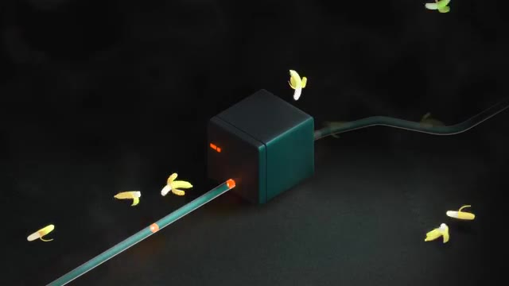
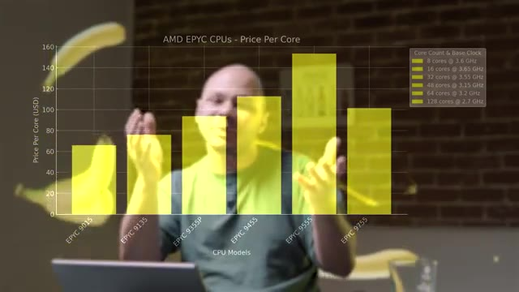
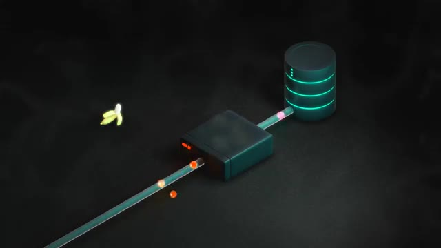
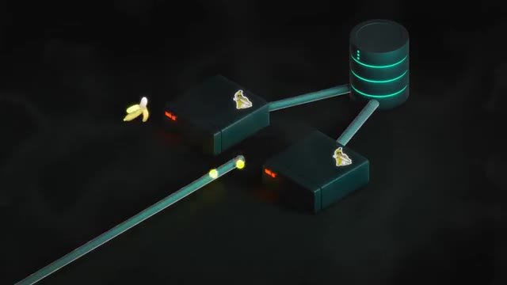
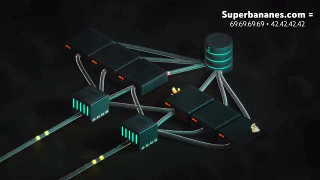
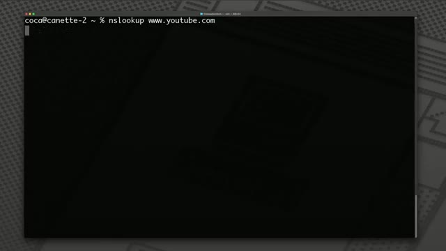
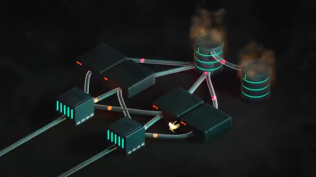
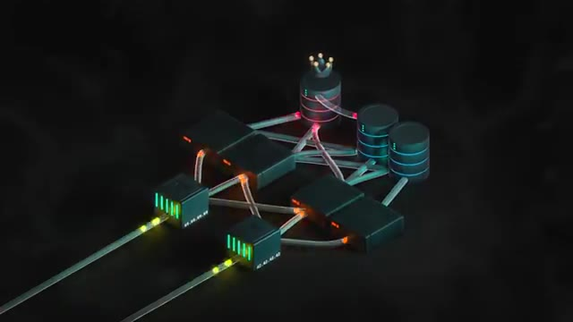
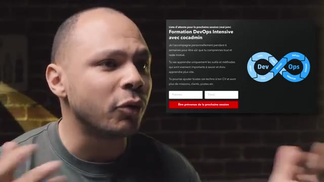

# 🎬 Comment faire une infra prête pour la prod

> **Chaîne** : [cocadmin](https://www.youtube.com/@cocadmin)  
> **Lien YouTube** : [https://www.youtube.com/watch?v=SXv9JCCUqXQ](https://www.youtube.com/watch?v=SXv9JCCUqXQ)  
> **Date de publication** : 20250126  
> **Durée** : 00:11:54  
> **Identifiant vidéo** : `SXv9JCCUqXQ`  
> **Transcription & Analyse** : `whisper-v3-large-turbo+gemini-3.5-flash-lite`  

---

## 📌 Synthèse Exécutive & Outils

### 💡 Résumé

Cette vidéo aborde l'évolution critique d'une infrastructure informatique, depuis le poste de travail d'un développeur jusqu'à une architecture hautement disponible, résiliente et prête pour la production. En prenant l'exemple fil rouge d'une entreprise de vente de bananes en ligne confrontée à une croissance fulgurante (du trafic local au buzz viral sur les réseaux sociaux), la transcription met en lumière les limites opérationnelles des configurations naïves et la nécessité d'introduire des patterns d'architecture robustes.

L'exposé démontre méthodiquement le passage d'une application monolithe locale à un environnement distribué. Face à l'explosion de la charge (traffic scaling), elle analyse l'impasse du **scaling vertical** (coût non-linéaire et limites physiques des composants matériels) au profit du **scaling horizontal**. L'architecture évolue ainsi par étapes logiques : séparation physique des serveurs d'application et de base de données, introduction d'un **répartiteur de charge (load balancer)** pour distribuer le trafic applicatif via divers algorithmes (Round Robin, affinité de session, temps de réponse), puis résolution du goulot d'étranglement central par l'usage du **DNS** pour gérer une flotte de load balancers redondants.

Pour un ingénieur DevOps, Cloud ou Systèmes, cette démonstration illustre la transition fondamentale entre des architectures *stateless* (facilement scalables horizontalement) et *stateful* (dont la gestion de l'état et de la réplication complexifie la scalabilité de la base de données). C'est un rappel pédagogique indispensable sur la conception d'infrastructures résilientes, la mitigation des points de défaillance uniques (*Single Points of Failure* ou SPOF) et l'anticipation de la croissance à l'échelle industrielle.

---

### 🛠️ Outils, Modèles & Logiciels Présentés

* **Serveur physique (Bare Metal) :** Ordinateur optimisé et rackable dans un data center, doté d'un processeur, de RAM et de disques dur, conçu pour fonctionner en continu sans interruption.
* **Base de données (Database) :** Système de stockage centralisé (stateful) chargé d'indexer et de persister les stocks, les commandes et les données utilisateurs.
* **Serveur applicatif (Application Server) :** Instance exécutant le code métier de l'application (stateless), traitant les requêtes et communiquant avec la base de données.
* **Équilibreur de charge (Load Balancer) :** Composant réseau frontal chargé de distribuer les flux de requêtes entrantes sur un pool de serveurs applicatifs arrière pour optimiser les performances et la tolérance aux pannes.
* **DNS (Domain Name System) :** Système de résolution de noms de domaine configuré pour retourner dynamiquement plusieurs adresses IP, permettant de répartir le trafic frontal vers plusieurs load balancers et d'éliminer les SPOF réseau.

---

### 🔑 Points Clés & Enseignements Stratégiques

1. **Éviter le piège du laptop de développement en production :** Un site hébergé sur le poste personnel d'un développeur dépend directement de sa mise sous tension et de sa connectivité, ce qui représente un risque de disponibilité inacceptable (SPOF critique).
2. **Identifier les limites du scaling vertical :** Augmenter la puissance d'une unique machine (CPU, RAM) possède une limite physique absolue et subit une inflation des coûts non-linéaire (un processeur deux fois plus puissant coûte nettement plus du double).
3. **Séparer l'application et la base de données :** Isoler le serveur applicatif du serveur de données sur des machines distinctes évite la contention des ressources matérielles (CPU/RAM) et prolonge la durée de vie de l'infrastructure avant saturation.
4. **Préférer le scaling horizontal pour l'élasticité :** Distribuer la charge applicative sur une flotte de machines (ajout de serveurs à l'infini selon le budget) garantit une scalabilité bien supérieure au scaling vertical.
5. **Architecturer les serveurs applicatifs en mode *Stateless* :** S'assurer que les serveurs d'application ne conservent aucun état local permet de les redémarrer, de les supprimer ou de les multiplier à volonter sans impacter l'expérience utilisateur, fluidifiant ainsi le scaling horizontal.
6. **Mutualiser intelligemment avec le Load Balancing :** Utiliser un équilibreur de charge pour centraliser l'entrée des requêtes et les distribuer sur les backends allège considérablement la charge de traitement frontal, un load balancer consommant jusqu'à 100 fois moins de ressources qu'un serveur applicatif.
7. **Maîtriser les algorithmes de répartition de trafic :** Configurer le load balancer selon les besoins métiers (Round Robin pour une rotation simple, prise en compte du temps de réponse pour l'équilibrage dynamique, ou sticky sessions pour préserver le contexte utilisateur).
8. **Éliminer le SPOF du Load Balancer via le DNS :** Un unique load balancer constitue un point de défaillance critique ; l'utilisation d'enregistrements DNS multiples permet de rediriger les utilisateurs vers plusieurs load balancers redondants.
9. **Anticiper la complexité des composants *Stateful* :** Contrairement aux serveurs applicatifs *stateless*, la base de données conserve un état (données) et ne peut pas être dupliquée aveuglément sans stratégie de réplication et de synchronisation rigoureuse.
10. **Planifier la production dès la conception :** Une architecture résiliente ne s'improvise pas lors d'un pic de trafic viral ; la redondance, l'élimination des SPOF et la scalabilité horizontale doivent être intégrées dès les premières phases du cycle de vie du projet.

---

## ⏱️ Chronologie & Transcription Complète Audio & Visuelle (Mot pour Mot)

### ⏱️ `[00:00:00 - 00:00:20]` | Segment #01

**🔊 Audio (Transcription Intégrale Mot pour Mot en Français) :**
> Que font toute la journée les fameux 6 admins ? Est-ce que c'est une arnaque ? Est-ce qu'ils jouent à League of Legends en secret toute la journée ? On ne sait pas. Alors on va voir comment faire une infrastructure d'entreprise de A à Z. Donc imaginons que j'ai une entreprise qui vend des bananes. Donc voilà, je vais au marché, je vends des bananes. C'est pour ça le thème aujourd'hui. Et ça marche bien, je vends mes bananes. Mais je me dis, on est dans le troisième millénaire.

**👁️ Analyse Visuelle d'Écran (gemini-3.5-flash-lite) :**
**Interface & Outils** : Jeu vidéo (League of Legends) sur écran PC et unité centrale gaming avec éclairage RGB.

**Contenu textuel & Code** : Affichage d'une session de jeu en cours (interface utilisateur de MOBA avec statistiques de personnages et carte).

**Action / Démonstration** : Illustration visuelle humoristique de la question sur l'activité réelle des administrateurs système (jouer à des jeux vidéo en cachette).

*📸 00:00:05 — Un écran d'ordinateur affichant une partie du jeu vidéo League of Legends avec une tour PC gaming RGB à côté.*

---

### ⏱️ `[00:00:20 - 00:00:53]` | Segment #02

**🔊 Audio (Transcription Intégrale Mot pour Mot en Français) :**
> On va aller un petit peu plus vers la technologie. On va vendre nos bananes en ligne. Et donc pour ça, je récupère un petit développeur qui me fait ça nickel. un petit site web pour que les gens puissent voir et acheter les bananes en direct. Et voilà c'est fini. Fin du game voilà. En fait pourquoi on a besoin de 6 admins ? C'est fini ! Et c'est pas tout à fait fini parce que là ça marche sur l'ordi du dev mais s'il ferme son laptop bah c'est fini. Personne peut accéder au site. Donc évidemment on va me falloir un serveur. Un serveur c'est comme une tour d'ordi normale mais un petit peu plus fin pour pouvoir les empiler dans les data centers mais sinon à part ça c'est un ordi normal avec un

**👁️ Analyse Visuelle d'Écran (gemini-3.5-flash-lite) :**
**Interface & Outils** : Navigateur web / barre de recherche système.

**Contenu textuel & Code** : Texte de recherche 'lesmeilleuresbananes' et suggestions associées.

**Action / Démonstration** : Illustration visuelle d'une recherche sur un site de vente de bananes en ligne.

*📸 00:00:28 — Barre de recherche simulant une requête web pour 'lesmeilleuresbananes' avec suggestions de recherche et de Siri.*

---

### ⏱️ `[00:00:53 - 00:01:26]` | Segment #03

**🔊 Audio (Transcription Intégrale Mot pour Mot en Français) :**
> processeur, de la ram, un disque dur et qui est fait exprès pour être allumé tout le temps. Comme ça je vais pouvoir mettre mon site web dessus et tout le monde pourrait accéder tout le temps. Et pour une petite anecdote, Elon Musk quand il a fait sa première entreprise Zip2, c'était un espèce de Google Maps au tout début d'Internet et comme il n'avait pas d'argent, il codait la nuit parce qu'il n'y avait personne qui venait sur son site et la journée pendant qu'il dormait, son ordi ça devenait le serveur. Donc en moi c'est possible d'avoir un serveur sur son ordi, mais bon on comprend bien que c'est pas le plus adapté. Donc là hop mon site web on le prend de mon laptop, on le met sur le serveur et voilà c'est fini, fin du game encore. Et bah dans la La plupart des cas, oui, c'est fin du game, c'est bon, t'as mis ça sur ton serveur, ça marche, tranquille.

**👁️ Analyse Visuelle d'Écran (gemini-3.5-flash-lite) :**
**Interface & Outils** : Aucun outil, terminal ou console technique n'est affiché à l'écran.

**Contenu textuel & Code** : Aucun code, commande ou architecture visible (plans purement narratifs).

**Action / Démonstration** : Explication narrative et historique sur l'hébergement web et les débuts d'Internet.

---

### ⏱️ `[00:01:27 - 00:01:47]` | Segment #04

**🔊 Audio (Transcription Intégrale Mot pour Mot en Français) :**
> Y'a plus vraiment grand chose à faire. Le problème commence à arriver quand on commence à avoir ce qu'on appelle de la charge. C'est quand plein d'utilisateurs commencent à aller sur mon site en même temps. Donc là, mes bananes, elles sont tellement bonnes, elles sont bio, elles sont faites avec amour, elles sont délicieuses. Donc les gens avec le bouche à oreille vont de plus en plus sur mon site. Et même si au départ, ça marche nickel, au bout d'un moment, je vois que mon site, il ralentit quand il y a beaucoup de trafic dessus.

**👁️ Analyse Visuelle d'Écran (gemini-3.5-flash-lite) :**
**Interface & Outils** : Aucune interface technique, terminal ou outil DevOps visible.

**Contenu textuel & Code** : Aucun code, commande, architecture ou métrique affiché.

**Action / Démonstration** : Explication métaphorique de la charge système en utilisant l'analogie de bananes bio et délicieuses.

---

### ⏱️ `[00:01:47 - 00:02:06]` | Segment #05

**🔊 Audio (Transcription Intégrale Mot pour Mot en Français) :**
> Donc ce qu'il nous faut, c'est plus de patates, plus de puissance. Et il y a deux façons de faire ça. La première façon, c'est juste d'avoir un serveur plus balèze. Un serveur avec plus de cores, plus de gigahertz, plus de RAM. Et dans la plupart des cas, je vais pouvoir servir plus d'utilisateurs en même temps parce que mon serveur, il est plus costaud. Il y a deux problèmes avec cette solution. C'est que premièrement, ça ne va pas à l'infini.

**👁️ Analyse Visuelle d'Écran (gemini-3.5-flash-lite) :**
**Interface & Outils** : Animation 3D explicative.

**Contenu textuel & Code** : Représentation visuelle d'un flux de traitement ou d'une infrastructure serveur.

**Action / Démonstration** : Illustration visuelle du concept de traitement des requêtes par un serveur plus puissant.

*📸 00:01:56 — Animation 3D symbolisant un serveur ou un composant informatique traitant un flux de données (représenté métaphoriquement par des éléments graphiques).*

---

### ⏱️ `[00:02:06 - 00:02:25]` | Segment #06

**🔊 Audio (Transcription Intégrale Mot pour Mot en Français) :**
> C'est-à-dire qu'une fois que j'ai le plus gros CPU possible et que j'ai rempli tous les slots de RAM, je ne peux pas en mettre plus. Donc ça veut dire que si vraiment j'ai beaucoup, beaucoup de gens qui vont sur mon site, au bout d'un moment, je ne pourrai juste plus accepter de nouvelles personnes. Mon site va redevenir lent. Deuxième plus gros problème, c'est que quand on rajoute un meilleur CPU, plus de RAM, etc., généralement, le prix n'est pas linéaire.

**👁️ Analyse Visuelle d'Écran (gemini-3.5-flash-lite) :**
**Interface & Outils** : AUCUNE

**Contenu textuel & Code** : AUCUN

**Action / Démonstration** : Explication théorique des limites de la mise à l'échelle verticale (scale-up) matérielle.

---

### ⏱️ `[00:02:25 - 00:02:51]` | Segment #07

**🔊 Audio (Transcription Intégrale Mot pour Mot en Français) :**
> Par exemple, si je prends un processeur 8 coeurs qui va coûter 200 euros, et bien un processeur 16 coeurs, il ne va pas coûter 400 euros. Il va coûter peut-être 500, 800 euros. Donc beaucoup plus que deux fois plus. Donc plus je vais avoir du matos performant dans mon ordi, et plus ça va me coûter de plus en plus cher. Donc une première chose qu'on pourrait faire, c'est que quand on regarde ce qui se passe sur la machine, on se rend compte qu'en fait qu'on a notre application, ce qui a codé notre développeur, et on a aussi une base de données pour pouvoir avoir la liste des stocks, avoir les listes de commandes, la liste des utilisateurs, etc.

**👁️ Analyse Visuelle d'Écran (gemini-3.5-flash-lite) :**
**Interface & Outils** : Graphique de visualisation de données (bar chart) intégré en surimpression vidéo.

**Contenu textuel & Code** : Modèles de CPU AMD EPYC (EPYC 9015, 9135, 9355P, 9455, 9555, 9755) et métriques de coût par cœur (Price Per Core USD) avec légende indiquant le nombre de cœurs et la fréquence d'horloge de base.

**Action / Démonstration** : Explication et illustration visuelle de la relation non linéaire entre la performance des processeurs (nombre de cœurs) et leur coût par cœur.

*📸 00:02:31 — Graphique en barres superposé montrant le prix par cœur de différents modèles de processeurs AMD EPYC (AMD EPYC CPUs - Price Per Core) avec le présentateur en arrière-plan.*

---

### ⏱️ `[00:02:51 - 00:03:09]` | Segment #08

**🔊 Audio (Transcription Intégrale Mot pour Mot en Français) :**
> Donc ça, c'est un des premiers trucs qui arrivent et qui va ralentir mon site parce que mon application et ma base de données se battent pour les mêmes ressources de la machine. Donc pour éviter ça, tout simplement, on peut avoir deux serveurs. Un serveur qui va être juste pour l'application et un serveur qui va être juste pour la base de données. Comme ça, les deux, ils ont le max de ressources possibles et ça va nous permettre de pouvoir servir un plus grand nombre d'utilisateurs.

**👁️ Analyse Visuelle d'Écran (gemini-3.5-flash-lite) :**
**Interface & Outils** : Aucune interface technique, console ou outil DevOps visible.

**Contenu textuel & Code** : Aucun code, commande ou métrique technique affiché.

**Action / Démonstration** : Explication théorique de l'optimisation des performances par la séparation des serveurs d'application et de base de données.

---

### ⏱️ `[00:03:09 - 00:03:28]` | Segment #09

**🔊 Audio (Transcription Intégrale Mot pour Mot en Français) :**
> Maintenant qu'on a nos deux serveurs balèzes, imaginons qu'on a encore plus de demandes. Parce que forcément, il y a de plus en plus de gens qui écoutent à mes bananes, qui trouvent qu'elles sont délicieuses, qui en parlent à tous leurs amis. Et donc, j'ai encore plus de charges sur mon infrastructure. Et donc, on s'y t'est encore lent. Ce qu'on vient de faire, ça s'appelle du scaling vertical, c'est-à-dire prendre une machine de plus en plus balèze. Mais d'une autre façon, c'est le scaling horizontal.

**👁️ Analyse Visuelle d'Écran (gemini-3.5-flash-lite) :**
**Interface & Outils** : AUCUNE

**Contenu textuel & Code** : AUCUNE

**Action / Démonstration** : Explication orale de l'augmentation de la charge sur l'infrastructure.

---

### ⏱️ `[00:03:28 - 00:03:47]` | Segment #10

**🔊 Audio (Transcription Intégrale Mot pour Mot en Français) :**
> C'est-à-dire, au lieu d'acheter une machine plus puissante, on va acheter d'autres machines qu'on va mettre ensemble pour que chacune des machines puisse servir un petit nombre d'utilisateurs. Et donc, si on se rend compte que, par exemple, notre application, c'est notre goulot d'étranglement, c'est-à-dire que c'est ça qui ralentit, parce que la base de données, c'est quelque chose qui est codé en bas niveau, qui est vraiment super super optimisé, alors qu'on appelle l'application, il y a des chances que ce soit ça mon goulot d'étranglement.

**👁️ Analyse Visuelle d'Écran (gemini-3.5-flash-lite) :**
**Interface & Outils** : Animation 3D explicative d'architecture système (flux réseau et stockage).

**Contenu textuel & Code** : Représentation visuelle d'un pipeline de données avec un nœud applicatif intermédiaire et une base de données cible.

**Action / Démonstration** : Explication du goulet d'étranglement applicatif dans une architecture distribuée.

*📸 00:03:38 — Schéma animé 3D représentant un flux de requêtes traversant un serveur d'application et accédant à une base de données.*

---

### ⏱️ `[00:03:47 - 00:04:07]` | Segment #11

**🔊 Audio (Transcription Intégrale Mot pour Mot en Français) :**
> Donc l'idéal, ça serait de prendre cette application, et au lieu de l'avoir sur un gros serveur, de la distribuer sur plein de serveurs. Comme ça, je règle le problème une fois pour toutes. Si j'ai plus de personnes qui viennent sur mon site, je peux juste ajouter plus de serveurs à l'infini, du moins en tant que ma carte de crédit, elle passe. Ce qui n'est pas le cas avec le scaling vertical parce que même si je suis le plus riche du monde au bout d'un moment je ne peux pas acheter une machine plus grosse.

**👁️ Analyse Visuelle d'Écran (gemini-3.5-flash-lite) :**
**Interface & Outils** : Aucune interface technique ou console affichée.

**Contenu textuel & Code** : Aucun code, commande ou architecture visible.

**Action / Démonstration** : Explication orale du concept de scalabilité horizontale et de l'élasticité cloud dépendante des coûts.

---

### ⏱️ `[00:04:07 - 00:04:25]` | Segment #12

**🔊 Audio (Transcription Intégrale Mot pour Mot en Français) :**
> Mais ça ça crée un petit problème parce que maintenant que j'ai plein de machines pour mon application comment est-ce que je fais pour que mes utilisateurs soient répartis sur toutes mes machines ? Je ne peux pas leur dire toi tu vas sur Banan Server 1, toi tu vas sur Banan Server 2, toi tu vas sur Banan Server 3.com ça ça ne fait pas de sens. Je veux avoir un seul site, superbanan.com et que automatiquement ça redirige les requêtes vers les différents serveurs.

**👁️ Analyse Visuelle d'Écran (gemini-3.5-flash-lite) :**
**Interface & Outils** : Animation 3D d'architecture système / réseau.

**Contenu textuel & Code** : Représentation visuelle de serveurs (nodes) et d'une base de données centralisée interconnectés.

**Action / Démonstration** : Illustration du problème de répartition de charge et de la distribution du trafic réseau entre plusieurs instances de serveurs.

*📸 00:04:16 — Schéma d'architecture 3D montrant plusieurs serveurs connectés à une base de données avec des flux de données lumineux.*

---

### ⏱️ `[00:04:25 - 00:04:46]` | Segment #13

**🔊 Audio (Transcription Intégrale Mot pour Mot en Français) :**
> Et donc pour faire ça je vais avoir besoin d'un autre serveur qui s'appelle un load balancer ou en français un équilibre de charge. Et c'est ce serveur-là qui va rediriger les requêtes parmi tous les serveurs d'application que j'ai derrière. Et comme il ne fait rien de spécial avec les requêtes, il ne regarde même pas ce qu'il y a dedans, il n'a rien besoin de faire, il peut recevoir 10 fois, 100 fois le nombre de requêtes qui va être distribuée derrière. C'est-à-dire que potentiellement, je pourrais avoir 50 serveurs applicatifs et juste un autre balancer.

**👁️ Analyse Visuelle d'Écran (gemini-3.5-flash-lite) :**
**Interface & Outils** : Aucune interface technique, terminal ou diagramme affiché

**Contenu textuel & Code** : Aucun contenu technique textuel ou de ligne de commande

**Action / Démonstration** : Explication orale du concept de load balancer et de sa fonction de répartition des requêtes réseau

---

### ⏱️ `[00:04:46 - 00:05:06]` | Segment #14

**🔊 Audio (Transcription Intégrale Mot pour Mot en Français) :**
> Ça serait largement assez pour pouvoir recevoir les requêtes et toutes les rediriger. Parce que les serveurs applicatifs, eux, quand ils recevrent les requêtes, il faut qu'ils regardent ce qu'il y a dedans, il faut qu'il y ait des sites qu'il faut faire, est-ce que c'est quelqu'un qui est en train de se loguer, est-ce que c'est quelqu'un qui place une commande, il faut qu'il se connecte à la base de données, ils ont plein de choses à faire. Alors que le load balancer, lui, il n'a rien, il regarde la requête, il l'envoie à gauche, il l'envoie à droite. En termes d'utilisation de ressources, ça consomme 100 fois moins que ce que les serveurs applicatifs doivent faire.

**👁️ Analyse Visuelle d'Écran (gemini-3.5-flash-lite) :**
**Interface & Outils** : AUCUNE

**Contenu textuel & Code** : AUCUN

**Action / Démonstration** : Explication orale sur le fonctionnement des serveurs applicatifs et le traitement des requêtes.

---

### ⏱️ `[00:05:06 - 00:05:29]` | Segment #15

**🔊 Audio (Transcription Intégrale Mot pour Mot en Français) :**
> Et ce load balancer, il peut avoir plusieurs manières de distribuer les requêtes. Il peut faire soit dans l'ordre, c'est-à-dire que la première requête va aller sur le serveur 1, la deuxième sur le serveur 2, et puis tourner comme ça. Cet algorithme-là s'appelle Round Robin, ça veut dire qu'il tourne en rond 1, 2, 3, 4, 5, 6, et ensuite il recommence 1, 2, 3, 4, 5, 6. Il y a d'autres types d'algorithmes. Par exemple, le load balancer, il peut mesurer le temps de réponse de chacun des serveurs. Et s'il y a un serveur qui répond un petit peu plus lentement que les autres, il va lui envoyer moins de requêtes qu'aux autres pour pouvoir équilibrer justement la charge.

**👁️ Analyse Visuelle d'Écran (gemini-3.5-flash-lite) :**
**Interface & Outils** : AUCUNE

**Contenu textuel & Code** : AUCUNE

**Action / Démonstration** : Explication théorique de l'algorithme de répartition de charge Round Robin.

---

### ⏱️ `[00:05:30 - 00:05:49]` | Segment #16

**🔊 Audio (Transcription Intégrale Mot pour Mot en Français) :**
> Il peut également faire en sorte que quand une personne se connaît sur mon site, cette personne soit toujours envoyée vers le même serveur. Et ça, ça peut éviter les problèmes de cession parce que si quelqu'un crée un compte et se connecte sur un des serveurs, si sa requête suivante, elle arrive sur un autre serveur sur lequel il n'est pas encore connecté, et bah du coup, ça peut poser des problèmes. Donc si on l'envoie toujours sur le même, on n'aura pas ce type de problème-là, et le load balancer peut être assez intelligent pour distribuer les requêtes comme ça.

**👁️ Analyse Visuelle d'Écran (gemini-3.5-flash-lite) :**
**Interface & Outils** : Aucun outil, terminal ou interface graphique visible.

**Contenu textuel & Code** : Aucun code, commande ou diagramme d'architecture présent à l'écran.

**Action / Démonstration** : Explication orale de concepts DevOps et de gestion de sessions réseau par le créateur.

---

### ⏱️ `[00:05:49 - 00:06:10]` | Segment #17

**🔊 Audio (Transcription Intégrale Mot pour Mot en Français) :**
> Maintenant, imaginons que mes bananes sont tellement délicieuses que carrément, je suis passé à la télé, je suis devenu viral sur TikTok partout, et donc il y a encore plus de personnes qui viennent sur mon site. On peut se dire, bah mon load balancer, il va commencer à lui-même recevoir autre requête, donc comment est-ce que je peux faire ? Et en plus, mon load balancer, c'est devenu ce qu'on appelle un single point of failure, un élément central qui, si ça tombe, il n'y a plus rien qui marche, même si j'ai 50 serveurs derrière.

**👁️ Analyse Visuelle d'Écran (gemini-3.5-flash-lite) :**
**Interface & Outils** : Animation 3D illustrant l'architecture réseau et la répartition de charge.

**Contenu textuel & Code** : Flux de requêtes (points lumineux) arrivant sur un répartiteur de charge en surchauffe, puis acheminés via des câbles vers un pool de serveurs.

**Action / Démonstration** : Explication visuelle de la surcharge d'un load balancer suite à un trafic viral et de la nécessité de répartir les requêtes.

*📸 00:06:05 — Schéma animé d'un load balancer saturé par le trafic réseau et distribuant les requêtes vers plusieurs serveurs back-end.*

---

### ⏱️ `[00:06:10 - 00:06:33]` | Segment #18

**🔊 Audio (Transcription Intégrale Mot pour Mot en Français) :**
> Donc on veut au moins le redonder, en avoir au moins deux ou trois, et aussi être capable de scaler, c'est-à-dire si on a vraiment beaucoup plus de requêtes, on pourrait en rajouter 4, 5, 6. Et donc pour faire ça, on peut utiliser le DNS. Quand quelqu'un fait une requête DNS pour aller sur bananeserver.com, je peux configurer mon nom de domaine pour répondre plusieurs adresses IP. Et comme ça, c'est le navigateur de l'utilisateur, quand il va recevoir cette liste d'adresses IP, il va choisir une des adresses au hasard, et va se connaître dessus.

**👁️ Analyse Visuelle d'Écran (gemini-3.5-flash-lite) :**
**Interface & Outils** : Animation 3D illustrant l'infrastructure réseau et les requêtes DNS.

**Contenu textuel & Code** : Superbananes.com résolu vers les adresses IP 69.69.69.69 et 42.42.42.42 avec des serveurs redondants connectés à une base de données.

**Action / Démonstration** : Explication de la redondance et de la scalabilité d'une application web à l'aide de plusieurs serveurs configurés derrière un nom de domaine.

*📸 00:06:27 — Schéma animé 3D d'une architecture réseau montrant la résolution d'un nom de domaine vers plusieurs adresses IP (redondance et répartition de charge DNS).*

---

### ⏱️ `[00:06:33 - 00:06:54]` | Segment #19

**🔊 Audio (Transcription Intégrale Mot pour Mot en Français) :**
> Et ça va dire que ça va distribuer les gens sur mes différents load balancers qui eux-mêmes vont aller distribuer les requêtes sur les différents serveurs applicatifs derrière. Et donc de cette manière-là, je peux scaler plus ou moins à l'infini. D'ailleurs, par exemple, si on fait une requête DNS pour youtube.com, on se rend compte qu'il y a plein d'adresses IP qui sont retournées et qu'en plus de ça, si on refait les requêtes de temps en temps, ces adresses IP, elles changent. Donc ça permet de pouvoir distribuer les requêtes sur autant de serveurs qu'on a besoin.

**👁️ Analyse Visuelle d'Écran (gemini-3.5-flash-lite) :**
**Interface & Outils** : Terminal Linux (bash/zsh)

**Contenu textuel & Code** : Commande saisie : `nslookup www.youtube.com`

**Action / Démonstration** : Exécution d'une requête de résolution DNS pour illustrer la répartition de charge (load balancing) globale d'un grand service web.

*📸 00:06:44 — Capture d'un terminal Linux affichant une commande réseau nslookup pour interroger les serveurs DNS de YouTube.*

---

### ⏱️ `[00:06:55 - 00:07:29]` | Segment #20

**🔊 Audio (Transcription Intégrale Mot pour Mot en Français) :**
> Donc maintenant, c'est bon. On peut respirer. On a notre infra. C'est scalable. on peut rajouter des savoirs à l'infini. Sauf qu'on a oublié quelque chose, c'est qu'au final, derrière, ma base de données, c'est elle qui maintenant est devenue un single point of failure. Et même si c'est super optimisé, etc., au bout d'un moment, quand t'as 100 serveurs qui la bombarde H24, elle va commencer à souffrir un petit peu. Donc on pourrait se dire, les bases de données, on va faire pareil que pour l'application, on va juste rajouter plus de serveurs. Sauf que malheureusement, c'est pas si simple que ça parce que les bases de données, elles sont stateful. Ça veut dire qu'elles ont un état, elles ont des données. Bah oui, par définition. Et contrairement aux applications qui elles sont stateless, c'est-à-dire qu'elles n'ont pas d'état, c'est-à-dire que je peux redémarrer un serveur applicatif,

**👁️ Analyse Visuelle d'Écran (gemini-3.5-flash-lite) :**
**Interface & Outils** : AUCUNE

**Contenu textuel & Code** : AUCUNE

**Action / Démonstration** : Explication orale et théorique sur les limites d'une architecture centralisée et la gestion d'une base de données à grande échelle.

---

### ⏱️ `[00:07:30 - 00:07:54]` | Segment #21

**🔊 Audio (Transcription Intégrale Mot pour Mot en Français) :**
> ça ne va rien changer, et qu'une requête arrive sur le serveur 5 ou arrive sur le serveur 3, ça ne va rien changer, le 5 et le 3, ils n'ont pas besoin de communiquer entre eux, c'est pour ça qu'on peut l'escaler à l'infini, que j'en ai 5 ou j'en ai 50, ça ne me changerait. Alors que pour une base de données, il faut que les informations soient synchronisées. Si je veux ma liste des commandes, je ne veux pas avoir la moitié de mes commandes, je veux avoir la totalité. Donc ça veut dire que si je crée une commande et que ça arrive sur un serveur de base de données, Et bien ce serveur-là, il faut que ça se synchronise avec tous les autres serveurs de base de données pour pouvoir ajouter cette commande.

**👁️ Analyse Visuelle d'Écran (gemini-3.5-flash-lite) :**
**Interface & Outils** : AUCUNE

**Contenu textuel & Code** : AUCUN

**Action / Démonstration** : Explication théorique sur l'indépendance des serveurs stateless et la mise à l'échelle horizontale.

---

### ⏱️ `[00:07:54 - 00:08:14]` | Segment #22

**🔊 Audio (Transcription Intégrale Mot pour Mot en Français) :**
> Ce qui fait que si j'ai trois serveurs, et bien au final ma requête a généré trois requêtes et donc au final ça ne sert à rien d'avoir plus de serveurs. Les trois serveurs vont avoir la même charge. Si on faisait juste ça, le fait d'avoir cinq serveurs de base de données, ça me permet très d'accueillir exactement le même nombre que d'avoir un seul serveur de base de données. Donc ça n'a pas un très gros intérêt. Le seul avantage c'est que maintenant j'ai de la haute disponibilité et si j'en ai un qui tombe, j'en ai d'autres.

**👁️ Analyse Visuelle d'Écran (gemini-3.5-flash-lite) :**
**Interface & Outils** : Aucune interface technique affichée.

**Contenu textuel & Code** : Aucun contenu technique, de code ou d'architecture visible.

**Action / Démonstration** : Explication verbale de concepts liés à la mise à l'échelle des serveurs de base de données.

---

### ⏱️ `[00:08:14 - 00:08:33]` | Segment #23

**🔊 Audio (Transcription Intégrale Mot pour Mot en Français) :**
> mais ça ne me permet pas de régler mon problème de charge du fait que j'ai plein de gens qui veulent acheter mes bananes. Donc pour régler ce problème, une technique qui existe, ça s'appelle faire du sharding. Un shard, c'est un morceau en anglais. Et ça consiste à découper nos données. Par exemple, imaginons que j'ai 1000 utilisateurs, je pourrais prendre 500 utilisateurs et les mettre sur une base de données, et les 500 autres utilisateurs les mettre sur une autre base de données.

**👁️ Analyse Visuelle d'Écran (gemini-3.5-flash-lite) :**
**Interface & Outils** : AUCUNE

**Contenu textuel & Code** : AUCUNE

**Action / Démonstration** : Explication théorique du concept de sharding pour la gestion de la charge des bases de données.

---

### ⏱️ `[00:08:33 - 00:08:54]` | Segment #24

**🔊 Audio (Transcription Intégrale Mot pour Mot en Français) :**
> De cette manière, les deux sont indépendants, ils n'ont pas besoin de communiquer, et donc je peux gérer deux fois plus de personnes. Donc si je rajoute 10 serveurs de base de données, qui ont chacun un cinquième du nombre d'utilisateurs, et bien je vais pouvoir accueillir 10 fois plus de personnes. Et donc je peux maintenant scaler autant que je veux, autant que j'ai de nouveaux utilisateurs. Donc cette technique, elle est très facile à mettre en place et c'est même parfois fait automatiquement par la plupart des serveurs de bases de données de type NoSQL.

**👁️ Analyse Visuelle d'Écran (gemini-3.5-flash-lite) :**
**Interface & Outils** : AUCUNE

**Contenu textuel & Code** : AUCUNE

**Action / Démonstration** : Explication théorique sur le scaling horizontal des serveurs de base de données.

---

### ⏱️ `[00:08:54 - 00:09:14]` | Segment #25

**🔊 Audio (Transcription Intégrale Mot pour Mot en Français) :**
> Donc il y en a plein, par exemple MongoDB, Redis, Elasticsearch, CoachBase et il y en a plein d'autres. Mais c'est beaucoup plus compliqué à faire quand on a des serveurs de type SQL, comme par exemple avec Postgre, SQL Server, MySQL, Oracle, etc. Parce que par définition, les bases de données SQL pour Structured Query Language, elles sont structurées. C'est-à-dire que les différentes données ont des relations entre elles.

**👁️ Analyse Visuelle d'Écran (gemini-3.5-flash-lite) :**
**Interface & Outils** : Graphique de présentation vidéo avec logo de base de données.

**Contenu textuel & Code** : Texte "Serveurs SQL" et logo PostgreSQL.

**Action / Démonstration** : Explication et introduction des concepts liés aux serveurs de bases de données SQL.

*📸 00:09:04 — Écran graphique affichant les termes "Serveurs SQL" et le logo de PostgreSQL.*

---

### ⏱️ `[00:09:14 - 00:09:40]` | Segment #26

**🔊 Audio (Transcription Intégrale Mot pour Mot en Français) :**
> Par exemple, une commande est reliée à un utilisateur. Un produit est relié à une commande. Et donc le fait qu'on ait ces liens entre les différentes données font que si je mets une partie des utilisateurs dans ce serveur et une partie des commandes dans cet autre serveur, et bien là, je vais commencer à avoir plein de communications entre les différents serveurs qui vont faire que je ne vais pas pouvoir scaler très facilement. Parce qu'on revient à un problème que j'expliquais avant où une requête d'un utilisateur peut commencer à générer 10 requêtes sur 5 serveurs différents. Du coup, c'est beaucoup moins performant et c'est beaucoup plus difficile de scaler.

**👁️ Analyse Visuelle d'Écran (gemini-3.5-flash-lite) :**
**Interface & Outils** : Animation 3D illustrant une architecture distribuée et des flux réseau.

**Contenu textuel & Code** : Nœuds de serveurs et bases de données reliés par des tuyaux représentant les communications réseau et les requêtes.

**Action / Démonstration** : Explication de la complexité et de la surcharge des communications réseau entre serveurs distribués lors du découplage de données.

*📸 00:09:27 — Schéma animé 3D représentant une architecture de serveurs interconnectés et de bases de données en réseau avec des flux de données.*

---

### ⏱️ `[00:09:40 - 00:10:13]` | Segment #27

**🔊 Audio (Transcription Intégrale Mot pour Mot en Français) :**
> À la place, on peut utiliser une autre technique. Parce que si on regarde bien, dans la plupart des applications, 90 voire même peut-être 95% des requêtes, c'est des requêtes en lecture. Et le reste, peut-être seulement 5% ou 3%, c'est des requêtes en écriture. Parce que si je prends mon site par exemple, la plupart des gens vont regarder le catalogue, regarder leur liste de commandes, regarder la liste des utilisateurs, des choses comme ça. Et donc tout ça, c'est des requêtes qui sont en lecture. Je fais juste récupérer des données de ma base de données. Et des requêtes qui sont en écriture, c'est-à-dire créer une nouvelle commande, ajouter un nouveau produit, créer un nouvel utilisateur, et bien ça c'est 5% voire même juste 1% du temps. C'est à dire que je

**👁️ Analyse Visuelle d'Écran (gemini-3.5-flash-lite) :**
**Interface & Outils** : Graphique textuel intégré en post-production.

**Contenu textuel & Code** : Texte affichant « MOYENNE DES REQUÊTES » et « ~95% LECTURE ».

**Action / Démonstration** : Illustration visuelle du ratio de requêtes en lecture par rapport aux requêtes en écriture dans une application web.

*📸 00:09:49 — Graphique textuel illustrant la proportion des requêtes en lecture (environ 95%).*

---

### ⏱️ `[00:10:13 - 00:10:37]` | Segment #28

**🔊 Audio (Transcription Intégrale Mot pour Mot en Français) :**
> peux potentiellement avoir 10 fois, 50 fois, 100 fois plus de requêtes en lecture que de requêtes en écriture. Donc ce que je pourrais faire c'est d'avoir un serveur de base de données principal qu'on appelle parfois master et ce serveur là ça va être le seul qui va recevoir les requêtes en écriture. Donc il va recevoir peut-être 5% du trafic. Et en suite je peux rajouter plein d'autres serveurs secondaires qui vont être des serveurs en lecture seul. Et donc mon application à chaque fois qu'elle a besoin de faire une lecture elle va aller sur au hasard un de mes serveurs en lecture.

**👁️ Analyse Visuelle d'Écran (gemini-3.5-flash-lite) :**
**Interface & Outils** : Animation 3D d'architecture réseau et de bases de données

**Contenu textuel & Code** : Représentation visuelle d'un serveur de base de données principal (master avec une icône de couronne) et de serveurs de réplication, interconnectés par des flux de données.

**Action / Démonstration** : Explication de l'architecture de réplication de base de données avec un nœud maître gérant les écritures et des nœuds secondaires pour la lecture.

*📸 00:10:25 — Diagramme d'architecture 3D illustrant un système de base de données réparti avec un serveur principal (master) et des serveurs secondaires.*

---

### ⏱️ `[00:10:37 - 00:11:04]` | Segment #29

**🔊 Audio (Transcription Intégrale Mot pour Mot en Français) :**
> Les serveurs en lecture, ils ont pas besoin de communiquer entre eux parce que tu fais juste récupérer des données. Donc tu récupères du serveur 1 ou du serveur 12, ça change rien. Par contre, quand l'application a besoin de faire une écriture, donc quand quelqu'un crée une commande, quand on ajoute un nouvel utilisateur, quand on ajoute un nouveau produit, et donc là, ces requêtes-là qui sont très rares, elles vont aller directement sur le master. Et c'est ce qui fait que je vais pouvoir gérer de plus en plus d'utilisateurs parce que le serveur principal, il synchronise ses données avec tous les serveurs secondaires et je peux ajouter presque autant de serveurs secondaires que j'ai besoin en fonction du nombre d'utilisateurs qui viennent sur mon site.

**👁️ Analyse Visuelle d'Écran (gemini-3.5-flash-lite) :**
**Interface & Outils** : Aucune interface ou console affichée.

**Contenu textuel & Code** : Aucun contenu technique, code ou architecture affiché à l'écran.

**Action / Démonstration** : Explication orale de concepts d'architecture système (opérations en lecture vs écriture sur des serveurs).

---

### ⏱️ `[00:11:04 - 00:11:30]` | Segment #30

**🔊 Audio (Transcription Intégrale Mot pour Mot en Français) :**
> Et donc ça y est, on a enfin fini le game. on a notre balancer qu'on peut scaler presque à l'infini. On a ensuite nos serveurs applicatifs qu'on peut scaler aussi presque à l'infini. Et ensuite, on a nos bases de données qu'on peut scaler presque à l'infini tant qu'on n'a pas trop d'écriture. Mais pour ça, il nous reste encore le scaling vertical, il nous reste aussi le sharding et d'autres techniques. Donc, je peux avoir autant de consommateurs de bananes que je veux sur mon site web tant que j'ai l'argent pour pouvoir payer ma facture.

**👁️ Analyse Visuelle d'Écran (gemini-3.5-flash-lite) :**
**Interface & Outils** : Aucune

**Contenu textuel & Code** : Aucun

**Action / Démonstration** : Explication orale et conceptuelle concernant le scaling horizontal (load balancers, serveurs applicatifs, bases de données en lecture) et l'introduction du concept de scaling vertical.

---

### ⏱️ `[00:11:30 - 00:11:50]` | Segment #31

**🔊 Audio (Transcription Intégrale Mot pour Mot en Français) :**
> Si tu veux apprendre avec moi ces notions de système design, de DevOps, etc., tous les quelques mois, je fais une formation privée avec un petit groupe de personnes qui sont vraiment motivées. Donc si ça t'intéresse, je te laisse le lien pour t'inscrire pour être au courant la prochaine fois que je fais ça. Et en attendant, dites-moi les sujets sur lesquels vous voudrez aller un petit peu plus en profondeur. Est-ce que vous voulez qu'on parle de microservices ? Est-ce que vous voulez qu'on parle plus de bases de données ? Est-ce que vous voulez qu'on parle plus de réseaux, de cloud ?

**👁️ Analyse Visuelle d'Écran (gemini-3.5-flash-lite) :**
**Interface & Outils** : Page web de capture de leads / formulaire d'inscription pour la formation DevOps.

**Contenu textuel & Code** : Texte de présentation de la formation DevOps intensive de 6 semaines avec champs de saisie (Prénom, Email) et bouton d'inscription, accompagné du diagramme du cycle DevOps.

**Action / Démonstration** : Présentation de la formation privée DevOps et incrustation visuelle de la page d'inscription pour inciter les spectateurs à rejoindre la liste d'attente.

*📸 00:11:40 — Capture de la landing page de la formation DevOps Intensive affichée en incrustation à côté du créateur, incluant le logo infini DevOps.*

---

### ⏱️ `[00:11:50 - 00:11:53]` | Segment #32

**🔊 Audio (Transcription Intégrale Mot pour Mot en Français) :**
> Ou même plus de système design comme on vient d'en parler aujourd'hui. Et comme ça, on en parlera dans une prochaine vidéo.

**👁️ Analyse Visuelle d'Écran (gemini-3.5-flash-lite) :**
**Interface & Outils** : AUCUNE

**Contenu textuel & Code** : AUCUN

**Action / Démonstration** : Explication orale de concepts DevOps / system design sans support visuel technique.

---

