# 🎬 Le minimum de réseau à savoir pour un Dev

> **Chaîne** : [cocadmin](https://www.youtube.com/@cocadmin)  
> **Lien YouTube** : [https://www.youtube.com/watch?v=mdxKBz5QUTo](https://www.youtube.com/watch?v=mdxKBz5QUTo)  
> **Date de publication** : 20250603  
> **Durée** : 00:38:15  
> **Identifiant vidéo** : `mdxKBz5QUTo`  
> **Transcription & Analyse** : `whisper-v3-large-turbo+gemini-3.5-flash-lite`  

---

## 📌 Synthèse Exécutive & Outils

### 💡 Résumé
Dans cette vidéo intitulée **Le minimum de réseau à savoir pour un Dev**, cocadmin propose une immersion approfondie dans les problématiques concrètes d'infrastructure, de systèmes et d'ingénierie logicielle.

### 🛠️ Outils, Modèles & Logiciels Présentés
- **Linux & Outils Systèmes** : Administration système, automatisation et surveillance.
- **Conteneurisation & Cloud** : Déploiement et gestion d'environnements résilients.

### 🔑 Points Clés & Enseignements Stratégiques
- Maîtriser les fondamentaux réseau et système pour diagnostiquer efficacement les pannes.
- Privilégier les architectures simples et observables en environnement de production.

---

## ⏱️ Chronologie & Transcription Complète Audio & Visuelle (Mot pour Mot)

### ⏱️ `[00:00:00 - 00:00:21]` | Segment #01

**🔊 Audio (Transcription Intégrale Mot pour Mot en Français) :**
> J'ai remarqué que les devs manquent souvent des concepts de base qui les font stagner. J'ai que le réseau parfois c'est un petit peu obscur, mais si tu connais juste ces cinq concepts, tu pourras level up. Il y a plein de plages différentes avec une explication compliquée pour savoir exactement comment ça marche, mais celle qu'on utilise 95% du temps et qui sont importantes à savoir en tant que développeur, c'est ces quatre là. La première c'est le slash 32, c'est une plage d'adresse IP qui commence et finit à la même adresse.

**👁️ Analyse Visuelle d'Écran (gemini-3.5-flash-lite) :**
**Interface & Outils** : Logiciel de présentation (pour les slides), potentiellement un outil de diagrammes d'architecture réseau (pour les écrans latéraux).

**Contenu textuel & Code** : Diagrammes d'architecture réseau conceptuels, définitions de plages IP publiques, notation CIDR (Classless Inter-Domain Routing), exemples de plages d'adresses IP privées (10.0.0.0/x) et calcul du nombre d'hôtes.

**Action / Démonstration** : Explication des concepts fondamentaux de l'adressage IP et des blocs CIDR pour la compréhension et la configuration des réseaux.

*📸 00:00:05 — Setup multi-écrans affichant des diagrammes d'architecture réseau ou des explications de concepts techniques. Le moniteur de gauche présente des blocs de diagrammes, tandis que celui de droite affiche une grille de slides, potentiellement des schémas de flux réseau ou des concepts d'infrastructure.*

*📸 00:00:15 — Slide de présentation détaillant l'adressage IP, mettant en évidence les IP publiques et les plages réseaux définies par les blocs CIDR. Des exemples concrets de notations CIDR (/32, /24, /16, /8) sont fournis avec les plages d'adresses IP correspondantes et le calcul du nombre d'IPs par bloc.*

---

### ⏱️ `[00:00:21 - 00:00:45]` | Segment #02

**🔊 Audio (Transcription Intégrale Mot pour Mot en Français) :**
> C'est à dire que là, 1 2 3 4 slash 32, c'est la plage qui commence à 1 2 3 4 et qui finit à 1 2 3 4. Donc elle contient juste une seule adresse. Donc quand on parle d'une adresse, en général on n'écrit pas slash 32 derrière, mais parfois dans certains systèmes, certains formulaires, certains outils de cloud, on a besoin de spécifier slash 32 pour dire que c'est juste une seule adresse. Maintenant, si on utilise slash 24, ça veut dire toutes les adresses IP qui commencent par 10.0.0.quelque chose.

**👁️ Analyse Visuelle d'Écran (gemini-3.5-flash-lite) :**
**Interface & Outils** : Logiciel de présentation ou tableau blanc numérique affichant une slide technique.

**Contenu textuel & Code** : Exemples de notation CIDR (1.2.3.4/32, 10.0.0.0/24, 10.0.0.0/16, 10.0.0.0/8) avec les plages d'adresses IP et le nombre total d'IP pour chaque bloc.

**Action / Démonstration** : Explication et illustration des plages d'adresses IP et du concept de Classless Inter-Domain Routing (CIDR) en détaillant l'impact du masque de sous-réseau sur le nombre d'adresses contenues.

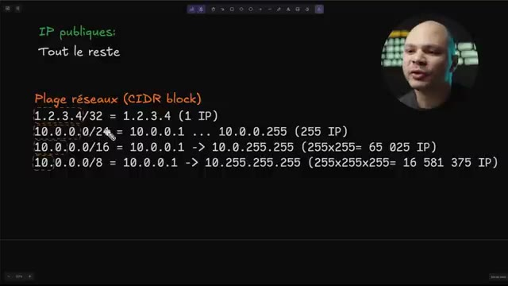
*📸 00:00:39 — L'image affiche une slide de présentation expliquant les concepts de "Plage réseaux (CIDR block)" avec des exemples concrets pour différentes masques de sous-réseau, notamment /32, /24, /16 et /8, et le nombre d'adresses IP correspondantes.*

---

### ⏱️ `[00:00:45 - 00:01:05]` | Segment #03

**🔊 Audio (Transcription Intégrale Mot pour Mot en Français) :**
> Donc ça veut dire l'adresse IP 10.001, 10.002, 03, 04, etc. jusqu'à 10.0.0.255. Et donc toutes ces adresses IP-là, elles sont contenues dans la notation 10.0.0.0.24. Ensuite pour les plages en slash 16, c'est la même chose, sauf que c'est juste les deux premiers chiffres ici.

**👁️ Analyse Visuelle d'Écran (gemini-3.5-flash-lite) :**
**Interface & Outils** : Présentation ou face-caméra sans interface informatique partagée.

**Contenu textuel & Code** : Explications orales des concepts, architectures et retours d'expérience.

**Action / Démonstration** : Démonstration pédagogique et mise en perspective technique.

---

### ⏱️ `[00:01:05 - 00:01:23]` | Segment #04

**🔊 Audio (Transcription Intégrale Mot pour Mot en Français) :**
> Donc c'est 10.0.n'importe quoi.n'importe quoi. Et donc ça veut dire toutes les adresses IP qui commencent par 10.0.0.1 jusqu'à 10.0.255.255. Donc ça contient même les adresses IP qui sont là-dedans. Et ensuite on est les slash 8, où là c'est juste tout ce qui commence par 10, c'est compris dans la plage.

**👁️ Analyse Visuelle d'Écran (gemini-3.5-flash-lite) :**
**Interface & Outils** : Présentation ou face-caméra sans interface informatique partagée.

**Contenu textuel & Code** : Explications orales des concepts, architectures et retours d'expérience.

**Action / Démonstration** : Démonstration pédagogique et mise en perspective technique.

---

### ⏱️ `[00:01:24 - 00:01:42]` | Segment #05

**🔊 Audio (Transcription Intégrale Mot pour Mot en Français) :**
> Et donc à partir de 10.0.0.1 jusqu'à 10.255.255.255. Et donc ça, c'est assez rare qu'on l'utilise parce que ça contient 16 millions d'adresses IP. Donc c'est rare qu'on veut faire un groupe avec autant d'adresses. En général, ça en tant que développeur, on peut en avoir besoin quand on va devoir aller configurer des firewalls, configurer des security group sur le cloud, des choses comme ça.

**👁️ Analyse Visuelle d'Écran (gemini-3.5-flash-lite) :**
**Interface & Outils** : Un terminal ou un éditeur de texte/code affichant des informations techniques.

**Contenu textuel & Code** : Du texte illisible mais structuré, pouvant représenter des plages d'adresses IP, des configurations réseau, ou des extraits de code liés à l'administration système. La structure suggère des adresses IP et des masques de sous-réseau.

**Action / Démonstration** : Le contenu flou en arrière-plan sert de support visuel au discours sur les plages d'adresses IP (comme la classe A 10.0.0.0/8), leur taille (16 millions d'adresses), et leur utilisation potentielle pour la configuration de firewalls ou la sécurité.

*📸 00:01:33 — Le créateur de contenu est filmé en plan rapproché avec un écran flou en arrière-plan. L'écran affiche du texte blanc ou jaune sur fond sombre, évoquant une console ou un éditeur de code avec des informations techniques.*

---

### ⏱️ `[00:01:43 - 00:02:07]` | Segment #06

**🔊 Audio (Transcription Intégrale Mot pour Mot en Français) :**
> Et si on ne sait pas à quoi correspond cette notation, ça peut nous freiner. Une autre chose qui est importante à savoir aussi, c'est faire la différence entre les IP publiques et les IP privées. Une IP privée, c'est quelque chose qui va fonctionner juste dans notre réseau local. Donc tout ce qui est branché directement dans notre ordinateur. Donc évidemment, si je suis en Wi-Fi, c'est considéré comme étant branché directement. Imaginons que j'ai ma box chez moi et que dessus, j'ai branché mon téléphone, mon ordinateur et ma tablette.

**👁️ Analyse Visuelle d'Écran (gemini-3.5-flash-lite) :**
**Interface & Outils** : Support visuel de présentation / Overlay graphique.

**Contenu textuel & Code** : Listes des plages d'adresses IP privées (192.168.0.0/16, 10.0.0.0/8, 172.16.0.0/12) et d'adresses spéciales (ex: 127.0.0.0/8) en notation CIDR, sous les titres "IP Privées" et "Spéciales", illustrant des concepts de routage et de réseau local.

**Action / Démonstration** : Explication et illustration visuelle des différentes catégories d'adresses IP, notamment les adresses privées utilisées dans un réseau local, en lien avec le discours sur la différence entre IP publiques et privées.

*📸 00:01:49 — Le créateur est visible au premier plan, tandis qu'une slide technique en arrière-plan affiche des listes de plages d'adresses IP.*

---

### ⏱️ `[00:02:07 - 00:02:25]` | Segment #07

**🔊 Audio (Transcription Intégrale Mot pour Mot en Français) :**
> Les trois sont sur le même réseau privé et donc ils ont une adresse IP privée. Et cette adresse IP privée, elle ne peut pas être accessible depuis l'extérieur. C'est-à-dire que quelqu'un qui est sur Internet ne pourra jamais utiliser cette adresse IP pour pouvoir communiquer avec moi. Et même probablement que les adresses IP que j'ai dans mon réseau local chez moi, dans mon réseau privé, ça peut potentiellement être les mêmes que tu as chez toi dans ton propre réseau privé.

**👁️ Analyse Visuelle d'Écran (gemini-3.5-flash-lite) :**
**Interface & Outils** : Écrans d'affichage présentant du texte explicatif.

**Contenu textuel & Code** : Plages d'adresses IP privées (10.0.0.0/8, 172.16.0.0/12, 192.168.0.0/16) et spéciales (localhost, Auto Private IP Addressing 169.254.0.0/16, CGNAT 100.64.0.0/10) avec leurs descriptions.

**Action / Démonstration** : Explication théorique des catégories d'adresses IP utilisées dans les réseaux privés et leur distinction avec les adresses publiques.

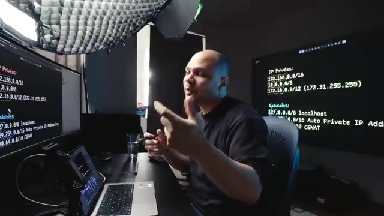
*📸 00:02:16 — Un expert DevOps/SysAdmin explique le concept des adresses IP privées et spéciales, avec des plages d'IP réseau clairement affichées sur plusieurs moniteurs en arrière-plan.*

---

### ⏱️ `[00:02:26 - 00:02:44]` | Segment #08

**🔊 Audio (Transcription Intégrale Mot pour Mot en Français) :**
> Et ça ne dérange pas parce que c'est deux réseaux qui sont complètement séparés. Et donc il y a trois plages d'adresses IP privées à reconnaître. C'est celle qui commence par 192.168. Donc c'est un slash 16, ça veut dire que les deux chiffres derrière ça peut être n'importe lequel. Ça c'est ce qui est la plupart du temps utilisé par les box internet. C'est très probablement l'adresse IP qu'a ton ordinateur ou ton téléphone en ce moment même.

**👁️ Analyse Visuelle d'Écran (gemini-3.5-flash-lite) :**
**Interface & Outils** : Support de présentation / Tableau blanc numérique

**Contenu textuel & Code** : Adresses IP Privées :
- 192.168.0.0/16
- 10.0.0.0/8
- 172.16.0.0/12 (172.31.255.255)

Adresses Spéciales :
- 127.0.0.0/8 localhost
- 169.254.0.0/16 Auto Private IP Addressing (APIPA)
- 100.64.0.0/10 CGNAT

**Action / Démonstration** : Explication théorique et identification des classes d'adresses IP réservées pour les réseaux locaux (LAN) et les usages spécifiques (boucle locale, auto-configuration, partage d'IP opérateur).

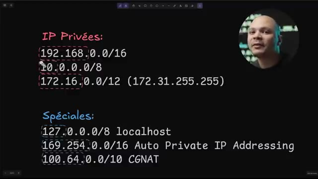
*📸 00:02:30 — Support visuel de présentation réseau détaillant les plages d'adresses IP privées (RFC 1918) et les adresses spéciales (localhost, APIPA, CGNAT) avec leur notation CIDR.*

---

### ⏱️ `[00:02:44 - 00:03:03]` | Segment #09

**🔊 Audio (Transcription Intégrale Mot pour Mot en Français) :**
> Mais c'est l'adresse IP qui est privée. De la même manière, on va avoir les 10.0.0.0. Donc ça, c'est un slash 8. Ça veut dire que c'est n'importe quelle adresse qui commence par 10. Et ça, souvent, ça va être dans les réseaux d'entreprise que tu vas avoir ça. Et ensuite, tu vas aussi avoir les 172.16.0.0 slash 12. Donc slash 12, ce n'est pas tout à fait ce qui commence par ça.

**👁️ Analyse Visuelle d'Écran (gemini-3.5-flash-lite) :**
**Interface & Outils** : Tableau blanc numérique / outil de présentation avec incrustation vidéo du présentateur.

**Contenu textuel & Code** : Plages affichées : 192.168.0.0/16, 10.0.0.0/8, 172.16.0.0/12 (IP privées) ainsi que 127.0.0.0/8, 169.254.0.0/16 et 100.64.0.0/10 (Spéciales).

**Action / Démonstration** : Explication et surlignage des blocs CIDR des réseaux privés et de leurs usages typiques en entreprise.

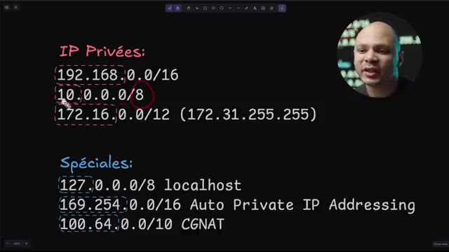
*📸 00:02:49 — Schéma explicatif illustrant les plages d'adresses IP privées (RFC 1918) et les plages spéciales (localhost, APIPA, CGNAT) avec annotations visuelles.*

---

### ⏱️ `[00:03:03 - 00:03:24]` | Segment #10

**🔊 Audio (Transcription Intégrale Mot pour Mot en Français) :**
> C'est-à-dire que ça va être ce qui commence à 16 et qui s'arrête à 31 pour le deuxième chiffre ici. Donc voilà, je vous avais dit qu'il y avait des classes qui n'étaient pas forcément 8, 16 ou 32. Mais la plupart du temps, on va utiliser un 24, parfois 32 quand c'est une adresse IP. Donc si vous connaissez ces deux-là, c'est correct. Maintenant, il y a aussi des adresses IP qui sont spéciales, qui ne sont pas super importantes à retenir à part la première.

**👁️ Analyse Visuelle d'Écran (gemini-3.5-flash-lite) :**
**Interface & Outils** : AUCUNE

**Contenu textuel & Code** : AUCUN

**Action / Démonstration** : Explication orale théorique sur les classes d'adresses IP et les masques de sous-réseau.

---

### ⏱️ `[00:03:24 - 00:03:46]` | Segment #11

**🔊 Audio (Transcription Intégrale Mot pour Mot en Français) :**
> Et ça va être tout ce qui commence par 127. Donc en général, on utilise 127.0.0.1. Sûrement que vous êtes familier avec ça, c'est une IP localhost. C'est une adresse IP qui est interne à votre propre machine. Donc c'est-à-dire que toutes les machines, que ce soit un téléphone, un ordi, un serveur, il a une adresse IP qui est 127.0.0.1. Et quand la machine communique avec cette adresse IP là, c'est utilisé pour que deux processus puissent communiquer l'un entre les autres.

**👁️ Analyse Visuelle d'Écran (gemini-3.5-flash-lite) :**
**Interface & Outils** : Diaporama de présentation / outil de capture d'écran de code

**Contenu textuel & Code** : - Plage d'adresses IP 127.0.0.0/8, étiquetée "localhost".
- Plage d'adresses IP 169.254.0.0/16, étiquetée "Auto Private IP".
- Plage d'adresses IP 100.64.0.0/10, étiquetée "CGNAT".
- Mention partielle des "IP publiques".

**Action / Démonstration** : Explication et visualisation des plages d'adresses IP spéciales, notamment l'adresse 127.0.0.1 associée à "localhost" et son rôle interne.

*📸 00:03:30 — Afficheur de diaporama présentant des plages d'adresses IP spéciales, notamment 127.0.0.0/8 (localhost), 169.254.0.0/16 (Auto Private IP) et 100.64.0.0/10 (CGNAT), avec le créateur en incrustation.*

---

### ⏱️ `[00:03:46 - 00:04:08]` | Segment #12

**🔊 Audio (Transcription Intégrale Mot pour Mot en Français) :**
> Donc imagine que tu as une machine ici, et tu as l'adresse ici qui est 127.0.0.1, tu peux avoir un processus ici et un autre processus qui vont utiliser cette adresse IP pour pouvoir communiquer l'un avec l'autre, mais à l'intérieur même de la machine. Donc encore une fois, je ne peux pas accéder à ton localhost depuis ma machine, c'est que dans la même machine. Et comme techniquement c'est une plage d'adresse IP, en fait c'est n'importe quelle adresse.

**👁️ Analyse Visuelle d'Écran (gemini-3.5-flash-lite) :**
**Interface & Outils** : Tableau blanc numérique / outil d'annotation d'écran

**Contenu textuel & Code** : Schéma d'une machine (boîte rouge) avec deux processus internes, texte à l'écran mentionnant "localhost", "Auto Private IP" (169.254.0.0/16) et "CGNAT" (100.64.0.0/10).

**Action / Démonstration** : Explication du concept d'adresse de loopback (localhost / 127.0.0.1) et de la communication réseau isolée à l'intérieur d'une même machine.

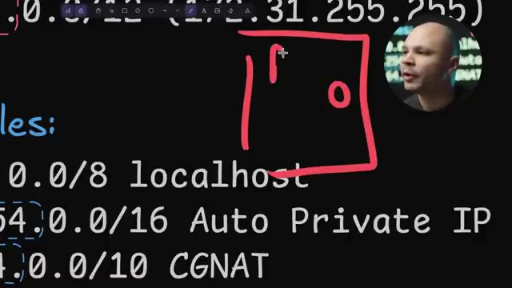
*📸 00:03:52 — Schéma explicatif dessiné sur tableau blanc illustrant une machine hôte contenant deux processus distincts qui communiquent localement via l'adresse de loopback localhost (127.0.0.1).*

---

### ⏱️ `[00:04:08 - 00:04:32]` | Segment #13

**🔊 Audio (Transcription Intégrale Mot pour Mot en Français) :**
> On n'est pas obligé d'utiliser 127.0.1.0.1, On peut utiliser 127.1.2.3 et ça va marcher pareil. Ensuite, on a les 169.254.16. Ça, c'est bien de le reconnaître. Ça, c'est un adresse IP que ton ordinateur va automatiquement s'attribuer si jamais il n'y a personne sur le réseau qui lui attribue une adresse IP. Donc normalement, tu as ton ordi ici ou ton serveur ou ton n'importe quoi et tu as ta box ici ou ton routeur.

**👁️ Analyse Visuelle d'Écran (gemini-3.5-flash-lite) :**
**Interface & Outils** : Logiciel de présentation ou tableau blanc numérique affichant du texte pré-écrit.

**Contenu textuel & Code** : Plages d'adresses IP spéciales et leur usage : 127.0.0.0/8 (localhost), 169.254.0.0/16 (Auto Private IP ou APIPA), 100.64.0.0/10 (CGNAT).

**Action / Démonstration** : Explication et démonstration visuelle des différents types d'adresses IP spéciales, en particulier l'APIPA que la machine s'attribue automatiquement.

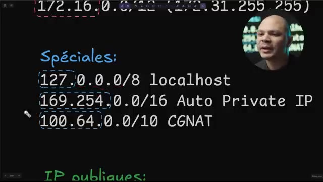
*📸 00:04:14 — L'écran affiche une liste d'adresses IP spéciales (localhost, Auto Private IP, CGNAT) avec leurs plages et masques de sous-réseau, le présentateur étant visible en surimpression.*

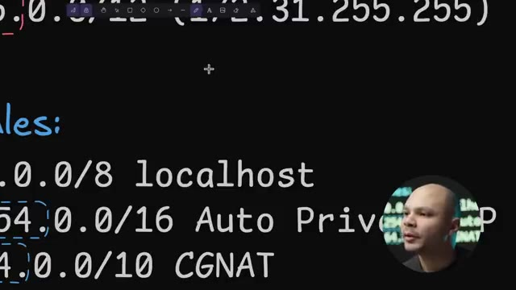
*📸 00:04:26 — L'écran présente les plages d'adresses IP spéciales, avec un focus sur la ligne 169.254.0.0/16 (Auto Private IP) et le curseur positionné dessus, le présentateur étant partiellement visible en bas à droite.*

---

### ⏱️ `[00:04:33 - 00:05:05]` | Segment #14

**🔊 Audio (Transcription Intégrale Mot pour Mot en Français) :**
> Et quand ils sont connectés, ton ordinateur va dire est-ce qu'il y a quelqu'un sur le réseau qui peut me donner une adresse IP ? Parce qu'il ne va pas prendre une adresse IP au hasard et puis après, il faut que la merde d'avoir des dupliqués et potentiellement piquer l'adresse de quelqu'un, quelque chose comme ça. Donc, c'est ton routeur ici qui va après lui donner, il va dire, ok, toi, ton adresse IP, ça va être 192. Mais s'il n'y a personne sur le réseau, si par exemple ton câble Ethernet, il est débranché ou que ton routeur, il déconne ou quelque chose comme ça, pour pouvoir quand même démarrer la carte réseau, ton ordinateur, il va automatiquement choisir une adresse IP et il va la choisir dans ce range-là qui est dédié à ça.

**👁️ Analyse Visuelle d'Écran (gemini-3.5-flash-lite) :**
**Interface & Outils** : Affichage stylisé de texte technique, rappelant un terminal ou une présentation éducative sur les concepts réseau.

**Contenu textuel & Code** : Le contenu visible inclut les mentions "Special addresses:", les préfixes IP "127.0.0.1", "169.254.", "100.64.", ainsi que les termes "Loopback", "Auto Private" et "NAT".

**Action / Démonstration** : Le présentateur explique l'importance de l'attribution correcte des adresses IP par le routeur pour éviter les conflits et les doublons, le contenu de l'écran illustrant les adresses IP réservées et les concepts sous-jacents à cette explication (Loopback, APIPA, CGN/NAT).

*📸 00:04:57 — L'image présente l'intervenant devant un écran affichant des informations techniques sur des plages d'adresses IP spéciales, incluant la boucle locale (127.0.0.1), l'adresse IP de configuration automatique (APIPA 169.254.x.x) et la plage pour le Carrier-Grade NAT (CGN 100.64.x.x).*

---

### ⏱️ `[00:05:05 - 00:05:24]` | Segment #15

**🔊 Audio (Transcription Intégrale Mot pour Mot en Français) :**
> Comme ça, ton ordinateur, il est sûr de ne pas piquer une adresse IP qui existe déjà. Donc, en gros, ce qu'il faut retenir, c'est que si ton ordi ou ton serveur a l'adresse IP 169.254, c'est probablement qu'il n'a pas accès à Internet et qu'il n'a pas accès au réseau. Et donc, probablement qu'il y a un problème et que ce n'est pas juste son adresse IP normale. Ensuite, le dernier plage un peu spécial, c'est le 100.64.

**👁️ Analyse Visuelle d'Écran (gemini-3.5-flash-lite) :**
**Interface & Outils** : Écrans de visualisation technique personnalisés affichant des données réseau; possiblement un ordinateur portable pour l'interaction ou le contrôle.

**Contenu textuel & Code** : Liste des adresses IP spéciales (Spéciales): 127.0.0.0/8 localhost, 169.254.0.0/16 Auto Private IP (APIPA), 100.64.0.0/10 CGNAT.

**Action / Démonstration** : Explication et illustration visuelle des plages d'adresses IP spéciales, en particulier la signification de l'adresse 169.254.x.x comme indicateur d'un problème de connectivité réseau ou Internet.

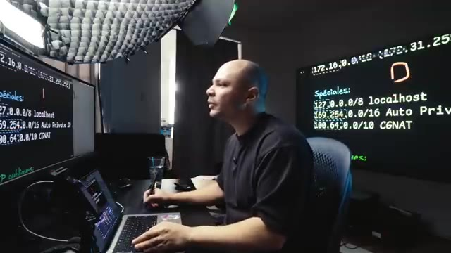
*📸 00:05:10 — Le créateur est assis à son bureau, devant un ordinateur portable, avec deux écrans géants affichant des informations techniques sur les plages d'adresses IP spéciales, notamment la plage 169.254.0.0/16.*

*📸 00:05:15 — Gros plan sur le créateur, avec un grand écran en arrière-plan qui affiche de manière lisible les plages d'adresses IP spéciales, dont "169.254.0.0/16 Auto Private IP".*

---

### ⏱️ `[00:05:25 - 00:05:43]` | Segment #16

**🔊 Audio (Transcription Intégrale Mot pour Mot en Français) :**
> Et ça, c'est utilisé pour le CG NAT, pour le Carrier Grade NAT. Et tu n'as pas vraiment besoin de savoir ça. Et ça, c'est des adresses IP que tu vas avoir si par exemple, tu fais du tethering avec ton téléphone et que tu utilises un réseau mobile, tu vas avoir cette adresse IP-là. Ça peut potentiellement être utilisé aussi si tu passes par un VPN.

**👁️ Analyse Visuelle d'Écran (gemini-3.5-flash-lite) :**
**Interface & Outils** : Écran de présentation ou tableau de bord avec texte technique.

**Contenu textuel & Code** : Plages d'adresses IP (127.0.0.1/8 localhost, 10.0.0.0/8 Auto Private, 100.64.0.0/10 CGNAT) et la définition "CGNAT = Carrier Grade NAT".

**Action / Démonstration** : Explication et visualisation des plages d'adresses IP utilisées notamment pour le CGNAT, le tethering mobile et les VPN.

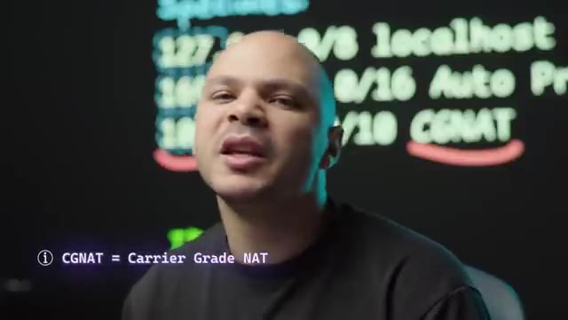
*📸 00:05:29 — Le créateur présente des plages d'adresses IP critiques, notamment la boucle locale (127.0.0.1/8), une plage privée (10.0.0.0/8), et la plage spécifique au Carrier Grade NAT (100.64.0.0/10), avec une définition explicite du CGNAT affichée à l'écran.*

---

### ⏱️ `[00:05:44 - 00:06:07]` | Segment #17

**🔊 Audio (Transcription Intégrale Mot pour Mot en Français) :**
> Ça, c'est pour la petite histoire, mais ce qu'il faut retenir, c'est que toutes ces adresses-là et ces adresses-là, c'est des adresses IP privées qui ne peuvent pas être atteintes par Internet. Et les IP qui peuvent être atteintes par Internet, c'est n'importe quelle autre adresse IP. Donc, si vous avez une adresse IP, c'est 167.6.19.4, ça, c'est une adresse IP publique qui est accessible par Internet.

**👁️ Analyse Visuelle d'Écran (gemini-3.5-flash-lite) :**
**Interface & Outils** : Outil de présentation numérique de type tableau blanc interactif.

**Contenu textuel & Code** : Plages d'adresses IP privées (RFC 1918), adresses IP spéciales (localhost), adresses IP publiques, plage d'adresses CGN et concept de notation CIDR.

**Action / Démonstration** : Explication et illustration des différentes catégories d'adresses IP et de leur portée (privée vs. publique, accessible vs. non-accessible depuis Internet).

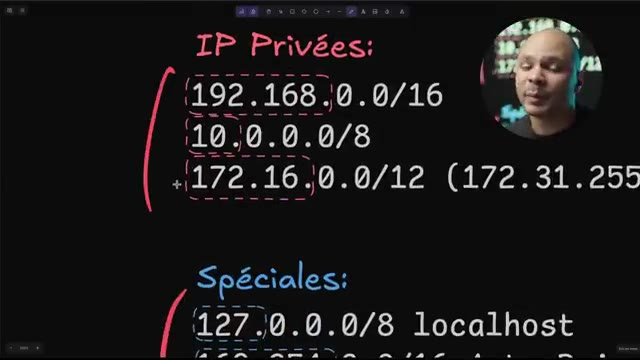
*📸 00:05:50 — Affiche une liste de plages d'adresses IP privées classiques (192.168.0.0/16, 10.0.0.0/8, 172.16.0.0/12) et spéciales (127.0.0.0/8 localhost) en notation CIDR sur un tableau blanc numérique.*

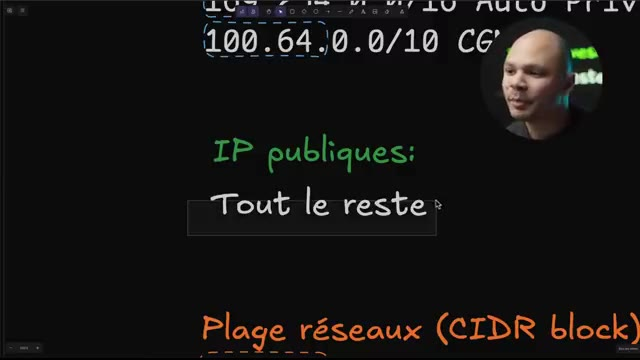
*📸 00:05:55 — Présente la définition générique des adresses IP publiques ("Tout le reste") et mentionne une plage d'adresses IP de Carrier-Grade NAT (CGN) 100.64.0.0/10, avec un focus sur les "Plage réseaux (CIDR block)".*

---

### ⏱️ `[00:06:07 - 00:06:28]` | Segment #18

**🔊 Audio (Transcription Intégrale Mot pour Mot en Français) :**
> Et donc, si tu as accès à Internet, tu as accès potentiellement à cette adresse IP, si jamais elle veut bien te répondre. Alors qu'une adresse IP privée, ça ne va jamais fonctionner. Ça, c'est important à comprendre. Quand on commence à avoir une application qui est un petit peu distribuée et qui a différents éléments à notre application, notre application va être dans un réseau privé. Donc, elle pourra communiquer avec d'autres machines par ce réseau privé. Mais il faut être capable de comprendre la différence entre les adresses publiques et privées.

**👁️ Analyse Visuelle d'Écran (gemini-3.5-flash-lite) :**
**Interface & Outils** : Aucune interface logicielle, console ou terminal visible. Le tableau en arrière-plan est un support visuel statique non interactif, avec des annotations manuscrites.

**Contenu textuel & Code** : Le tableau présente du texte manuscrit tel que "IP publique" en vert et un fragment d'adresse IP ("167.6!") en rouge. Ce ne sont ni du code, ni un diagramme d'architecture réseau structuré, ni des métriques.

**Action / Démonstration** : Le créateur explique verbalement un concept technique (distinction entre adresses IP publiques et privées) sans manipulation directe d'outils, de code ou d'interfaces.

---

### ⏱️ `[00:06:28 - 00:06:57]` | Segment #19

**🔊 Audio (Transcription Intégrale Mot pour Mot en Français) :**
> Ensuite, pour le DNS. Comment ça marche un serveur DNS ? Qu'est-ce que c'est d'abord ? C'est simplement un serveur auprès duquel on va pouvoir demander, lui poser une question, lui dire à ce nom de domaine-là, à quelle adresse IP elle correspond. Parce que communiquer par Internet, c'est un peu comme communiquer par la poste. Si jamais je veux envoyer une lettre à mon pote Charlie, si je donne ma lettre au facteur et que je lui dis « envoie-la à Charlie », il va me regarder bizarre, parce qu'il n'a aucune idée de c'est où c'est Charlie. Alors que si je lui dis « envoie ça à Charlie à 1, 2, 3 rue des Bananes », et bien là, le facteur va pouvoir trouver où c'est. Et bien là, c'est exactement la même chose.

**👁️ Analyse Visuelle d'Écran (gemini-3.5-flash-lite) :**
**Interface & Outils** : Présentation ou face-caméra sans interface informatique partagée.

**Contenu textuel & Code** : Explications orales des concepts, architectures et retours d'expérience.

**Action / Démonstration** : Démonstration pédagogique et mise en perspective technique.

---

### ⏱️ `[00:06:57 - 00:07:16]` | Segment #20

**🔊 Audio (Transcription Intégrale Mot pour Mot en Français) :**
> Si je veux aller sur serveur.com ou sur cocanine.com ou sur google.com, notre annetteur n'a aucune idée d'où envoyer le paquet pour que ça arrive à la bonne destination. Donc les noms de domaine, c'est vraiment juste pour nous, les humains, pouvoir facilement se souvenir de Google.com ou Coca-Demine.com plutôt que de devoir se souvenir de 12.64.19.6.

**👁️ Analyse Visuelle d'Écran (gemini-3.5-flash-lite) :**
**Interface & Outils** : Présentation ou face-caméra sans interface informatique partagée.

**Contenu textuel & Code** : Explications orales des concepts, architectures et retours d'expérience.

**Action / Démonstration** : Démonstration pédagogique et mise en perspective technique.

---

### ⏱️ `[00:07:16 - 00:07:36]` | Segment #21

**🔊 Audio (Transcription Intégrale Mot pour Mot en Français) :**
> Ça serait un peu chiant. Et donc pour ça, on a nos serveurs DNS ici. Donc comme on contacte nos serveurs DNS et qu'on a déjà leur adresse IP, je vais lui poser la question, c'est quoi l'adresse IP de serveurs.com ? Et il va me répondre, il va me dire, serveurs.com, c'est l'adresse 1.2.3.4. C'est un exemple. Et ensuite seulement, je vais pouvoir aller me connecter sur 1.2.3.4 pour aller faire ma requête sur serveur.com.

**👁️ Analyse Visuelle d'Écran (gemini-3.5-flash-lite) :**
**Interface & Outils** : Outil de tableau blanc numérique ou de dessin vectoriel pour la création de diagrammes explicatifs.

**Contenu textuel & Code** : Schéma d'architecture réseau simplifié décrivant la séquence d'une requête DNS : Client -> Serveur DNS (requête "server.com ?") -> Serveur DNS (réponse "server.com = 1.2.3.4") -> Client -> Serveur cible (connexion à "1.2.3.4"). Le sujet "DNS" est également inscrit en haut à droite.

**Action / Démonstration** : Explication visuelle et pédagogique du rôle et du fonctionnement d'un serveur DNS pour traduire les noms de domaine en adresses IP avant l'établissement d'une connexion réseau.

*📸 00:07:21 — Diagramme simple illustrant le processus de résolution DNS (Domain Name System), montrant un client interrogeant un Serveur DNS pour obtenir l'adresse IP d'un domaine spécifique ("server.com"), puis utilisant cette IP ("1.2.3.4") pour contacter directement le serveur hébergeant le site.*

---

### ⏱️ `[00:07:36 - 00:07:56]` | Segment #22

**🔊 Audio (Transcription Intégrale Mot pour Mot en Français) :**
> Techniquement, ce qui va se passer sur le capot, c'est qu'on va demander à notre routeur ou à notre box, c'est quoi serveur.com ? Notre routeur, soit il a déjà fait une requête DNS pour serveur.com avant et donc il connaît déjà la réponse, il la gardait en cache, donc il peut nous répondre directement. Donc ça permet d'éviter d'aller refaire tout le temps les mêmes requêtes DNS, soit il ne sait pas. Et dans ce cas-là, il va aller demander au serveur DNS qui gère la zone .com.

**👁️ Analyse Visuelle d'Écran (gemini-3.5-flash-lite) :**
**Interface & Outils** : Présentation ou face-caméra sans interface informatique partagée.

**Contenu textuel & Code** : Explications orales des concepts, architectures et retours d'expérience.

**Action / Démonstration** : Démonstration pédagogique et mise en perspective technique.

---

### ⏱️ `[00:07:57 - 00:08:20]` | Segment #23

**🔊 Audio (Transcription Intégrale Mot pour Mot en Français) :**
> Il va lui dire, ok, donne-moi c'est quoi serveur.com. Lui, serveur.com, il ne sait pas c'est quoi l'adresse IP de serveur.com. Par contre, il sait que la zone autoritative pour serveur.com, c'est ce serveur DNS là ici. Et donc, il va lui répondre l'adresse IP du serveur DNS ici. Et ensuite, on va refaire une requête DNS au serveur DNS qui gère la zone serveur.com et qui va pouvoir nous répondre quelle est l'adresse IP du serveur qu'on a besoin.

**👁️ Analyse Visuelle d'Écran (gemini-3.5-flash-lite) :**
**Interface & Outils** : Tableau blanc numérique ou outil de présentation illustrant un schéma réseau/système.

**Contenu textuel & Code** : Architecture de résolution DNS, requête pour "server.com", réponse avec l'adresse IP "1.2.3.4", représentation des serveurs DNS et des zones (.com).

**Action / Démonstration** : Explication du cheminement d'une requête DNS pour obtenir l'adresse IP d'un domaine, du point de vue d'un client et des différents niveaux de serveurs DNS interrogés.

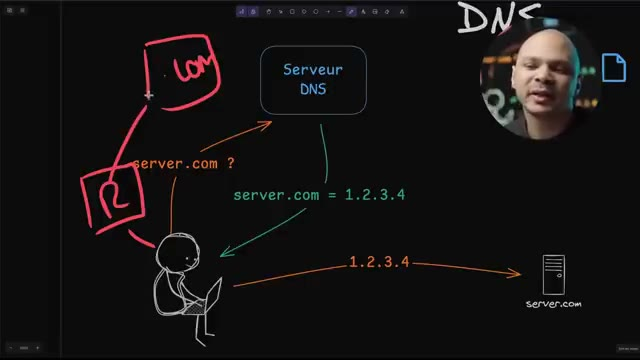
*📸 00:08:02 — Diagramme schématique expliquant le processus de résolution DNS itérative, détaillant les échanges entre un client, un résolveur DNS, et les serveurs DNS pour les zones racine, TLD (.com) et autoritative pour "server.com".*

---

### ⏱️ `[00:08:20 - 00:08:39]` | Segment #24

**🔊 Audio (Transcription Intégrale Mot pour Mot en Français) :**
> Mais globalement, tout ça, c'est sous le capot. Si je demande juste à mon DNS, c'est où serveur.com, je reçois la réponse. Maintenant, ce qu'il faut savoir, c'est qu'il y a différents types d'enregistrements DNS. comment je configure mon serveur DNS, les plus communs qu'on va utiliser, c'est les enregistrements de type A. Et un enregistrement de type A, c'est ce que je viens exactement de vous montrer.

**👁️ Analyse Visuelle d'Écran (gemini-3.5-flash-lite) :**
**Interface & Outils** : Logiciel de présentation (type tableau blanc numérique ou slide editor).

**Contenu textuel & Code** : Définitions et exemples d'utilisation des enregistrements DNS : A, CNAME, AAAA, MX, TXT.

**Action / Démonstration** : Explication visuelle et technique des différents types d'enregistrements DNS utilisés pour la configuration d'un serveur DNS, détaillant leur fonction (mapping nom-IP, alias, IPv6, serveurs de mail, vérifications de sécurité).

*📸 00:08:34 — Un écran de présentation listant et expliquant les principaux types d'enregistrements DNS : A (nom=IP), CNAME (nom=nom), AAAA (nom=IPv6), MX (nom=IP, pour serveur mail), et TXT (texte pour DKIM/DMARC/SPF, SSL challenge). Une icône de serveur et "server.com" sont également visibles.*

---

### ⏱️ `[00:08:39 - 00:08:59]` | Segment #25

**🔊 Audio (Transcription Intégrale Mot pour Mot en Français) :**
> C'est quoi serveur.com ? Serveur.com égale 1.2.3.4. En tout cas, c'est très simple. Ensuite, on a les C-Names. Et donc, les C-Names, c'est un peu comme un alias. Ça veut dire qu'un nom de domaine, en fait, il va pointer vers un autre nom de domaine qui lui-même potentiellement va pointer soit vers une adresse IP parce que lui-même, c'est un enregistrement de type A, soit c'est un autre enregistrement de type C-Name.

**👁️ Analyse Visuelle d'Écran (gemini-3.5-flash-lite) :**
**Interface & Outils** : Présentation ou face-caméra sans interface informatique partagée.

**Contenu textuel & Code** : Explications orales des concepts, architectures et retours d'expérience.

**Action / Démonstration** : Démonstration pédagogique et mise en perspective technique.

---

### ⏱️ `[00:08:59 - 00:09:18]` | Segment #26

**🔊 Audio (Transcription Intégrale Mot pour Mot en Français) :**
> Et donc du coup, on va sauter comme ça jusqu'à ce qu'on tombe sur un enregistrement de type A. Donc là, si je veux aller sur www.youtube.com, je fais la requête DNS. La requête, elle va me dire www.youtube.com, c'est un CNAME qui pointe vers simplement juste YouTube.com. Et donc maintenant, il faut que je refasse une requête DNS qui dise OK, mais c'est quoi YouTube.com ?

**👁️ Analyse Visuelle d'Écran (gemini-3.5-flash-lite) :**
**Interface & Outils** : Présentation ou face-caméra sans interface informatique partagée.

**Contenu textuel & Code** : Explications orales des concepts, architectures et retours d'expérience.

**Action / Démonstration** : Démonstration pédagogique et mise en perspective technique.

---

### ⏱️ `[00:09:18 - 00:09:40]` | Segment #27

**🔊 Audio (Transcription Intégrale Mot pour Mot en Français) :**
> Et ensuite, le cerveau va pouvoir me dire OK, YouTube.com, c'est 142.250.69.78. Et ensuite seulement, je vais pouvoir utiliser cette résipé pour pouvoir enfin aller sur YouTube.com. Il y a d'autres types d'enregistrements DNS qu'on utilise un petit peu moins souvent, mais bon, tant qu'à vouloir level up, autant les connaître. Et les enregistrements de type AAAA, et ça, c'est la même chose que les enregistrements de type A, sauf que c'est pour les adresses IP V6.

**👁️ Analyse Visuelle d'Écran (gemini-3.5-flash-lite) :**
**Interface & Outils** : Présentation ou face-caméra sans interface informatique partagée.

**Contenu textuel & Code** : Explications orales des concepts, architectures et retours d'expérience.

**Action / Démonstration** : Démonstration pédagogique et mise en perspective technique.

---

### ⏱️ `[00:09:40 - 00:09:58]` | Segment #28

**🔊 Audio (Transcription Intégrale Mot pour Mot en Français) :**
> Donc là, un enregistrement de type A, il va nous donner une adresse IP, une adresse IP V4, ce qui est toujours le plus utilisé dans ce moment. Et si on veut donner une adresse IP V6 à mon nom de domaine, il faut que j'utilise un enregistrement de type AAAA. Ensuite, on a les enregistrements de type MX. Ça, c'est pour les emails, parce que ça, c'est pour contacter notre serveur.

**👁️ Analyse Visuelle d'Écran (gemini-3.5-flash-lite) :**
**Interface & Outils** : Présentation ou face-caméra sans interface informatique partagée.

**Contenu textuel & Code** : Explications orales des concepts, architectures et retours d'expérience.

**Action / Démonstration** : Démonstration pédagogique et mise en perspective technique.

---

### ⏱️ `[00:09:58 - 00:10:18]` | Segment #29

**🔊 Audio (Transcription Intégrale Mot pour Mot en Français) :**
> Si par exemple, j'utilise un serveur web ou quelque chose comme ça. Mais si j'utilise un serveur de mail, il faut que j'utilise un enregistrement de type MX. Si j'aurai un email à thomas.cocadmin.com, il y a un enregistrement de type MX pour cocadmin.com qui va renvoyer ses requêtes vers le bon serveur de mail. Parce que ce n'est pas forcément le même serveur qui gère les requêtes web et qui va gérer les requêtes pour l'email, par exemple.

**👁️ Analyse Visuelle d'Écran (gemini-3.5-flash-lite) :**
**Interface & Outils** : Écrans de présentation ou de notes affichant du texte structuré, potentiellement un IDE ou un éditeur de texte en mode présentation, et un ordinateur portable.

**Contenu textuel & Code** : Définitions des enregistrements DNS : A (nom = IP), CNAME (nom = nom), AAAA (nom = IPv6), MX (nom = IP (serveur mail)), TXT (texte (dkim/dmark/spf, ssl challenge)).

**Action / Démonstration** : Explication pédagogique des différents types d'enregistrements DNS et de leur rôle, notamment l'enregistrement MX pour la configuration des serveurs de messagerie.

*📸 00:10:08 — Gros plan sur le présentateur, avec en arrière-plan un écran affichant des définitions de types d'enregistrements DNS (A, CNAME, AAAA, MX, TXT).*

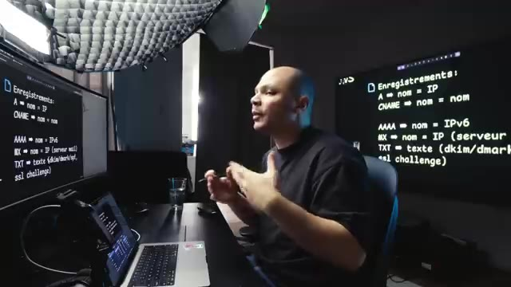
*📸 00:10:13 — Plan large du présentateur assis à un bureau, avec deux moniteurs affichant clairement des définitions d'enregistrements DNS (A, CNAME, AAAA, MX, TXT), incluant la fonction du serveur de mail pour les enregistrements MX.*

---

### ⏱️ `[00:10:18 - 00:10:36]` | Segment #30

**🔊 Audio (Transcription Intégrale Mot pour Mot en Français) :**
> Et ensuite, on a les enregistrements de type TXT. Donc là, TXT, c'est vraiment un fourre-tout. Il y a plein de choses différentes qui peuvent l'utiliser. Par exemple, DKIM, DMARC, SPF, c'est des choses qu'on utilise pour l'email, pour être sûr que ce n'est pas du spam, que ça vient bien du domaine qu'on prétend être. Ça peut être aussi utilisé pour les SSL challenge.

**👁️ Analyse Visuelle d'Écran (gemini-3.5-flash-lite) :**
**Interface & Outils** : Diaporama explicatif DNS

**Contenu textuel & Code** : - A ➜ nom = IP
- CNAME ➜ nom = nom
- AAAA ➜ nom = IPv6
- MX ➜ nom = IP (serveur mail)
- TXT ➜ texte (dkim/dmarc/spf, ssl challenge)
- Icône représentant un serveur (server.com)

**Action / Démonstration** : Explication théorique et technique de la polyvalence des enregistrements DNS de type TXT, notamment leur usage pour la sécurité des emails (DKIM, DMARC, SPF) et les processus de certification (challenge SSL).

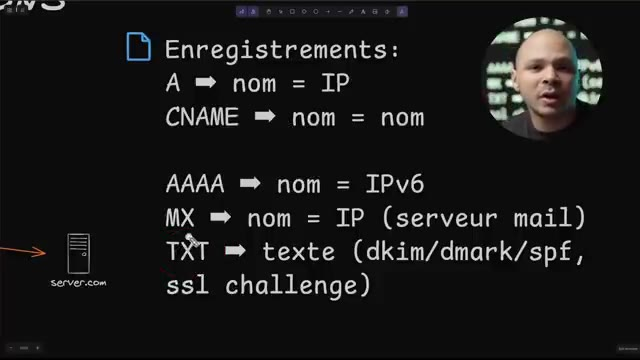
*📸 00:10:22 — Support visuel détaillant les différents types d'enregistrements DNS (A, CNAME, AAAA, MX, TXT) et leurs rôles respectifs.*

---

### ⏱️ `[00:10:36 - 00:10:55]` | Segment #31

**🔊 Audio (Transcription Intégrale Mot pour Mot en Français) :**
> Parfois, quand on fait une demande de certificat SSL ou TLS, pour prouver qu'on a bien le domaine, on va ajouter un enregistrement de type TXT. L'autorité de certification va nous donner une chaîne de caractère aléatoire. Elle va nous dire, si tu es bien, cocaademy.com, prouve-le-moi et ajoute un enregistrement de type TXT qui contient exactement cette valeur pour le domaine kokanmi.com.

**👁️ Analyse Visuelle d'Écran (gemini-3.5-flash-lite) :**
**Interface & Outils** : Support visuel textuel d'arrière-plan sur les types d'enregistrements DNS.

**Contenu textuel & Code** : Mentions textuelles :
- AAAA -> IPv6
- MX -> (serveur mail)
- TXT -> dkim/dmarc/spf / ssl challenge

**Action / Démonstration** : Explication du mécanisme de validation de propriété de domaine (SSL Challenge) via l'ajout d'un enregistrement DNS de type TXT requis par l'autorité de certification.

*📸 00:10:46 — Présentateur devant un support visuel en arrière-plan listant les types d'enregistrements DNS (AAAA, MX, TXT) et leurs cas d'usage associés.*

---

### ⏱️ `[00:10:55 - 00:11:23]` | Segment #32

**🔊 Audio (Transcription Intégrale Mot pour Mot en Français) :**
> Et comme il n'y a que le propriétaire du domaine kokanmi.com qui peut faire ça, quand je le fais, ça prouve que je suis propriétaire. Et donc l'autorité de certification est sûre que je suis bien qui je prétends être et me donner le certificat. Si on a des problèmes avec ça et qu'on ne sait pas trop qu'est-ce qui se passe, où arrive ma requête, on peut utiliser l'outil qui s'appelle NSLookup. Et quand je tape NSLookup avec le nom de domaine que je veux regarder, ça va me répondre que pour le domaine google.com, l'adresse IP qu'il faut contacter, c'est celle-là, 142.955, etc.

**👁️ Analyse Visuelle d'Écran (gemini-3.5-flash-lite) :**
**Interface & Outils** : Présentation ou face-caméra sans interface informatique partagée.

**Contenu textuel & Code** : Explications orales des concepts, architectures et retours d'expérience.

**Action / Démonstration** : Démonstration pédagogique et mise en perspective technique.

---

### ⏱️ `[00:11:23 - 00:11:45]` | Segment #33

**🔊 Audio (Transcription Intégrale Mot pour Mot en Français) :**
> Et là, les IP qu'on voit ici, c'est les IP de mon serveur DNS à moi, à qui j'envoie mes requêtes DNS. Mais donc, mon serveur DNS à moi, il va envoyer ça à un autre serveur DNS, qui va envoyer ça à un autre serveur DNS, etc., jusqu'à ce que ça arrive dans le serveur DNS qui gère la zone Google.com, qui va lui pouvoir me répondre. Donc, tout ça, encore une fois, c'est fait sous le capot. Moi, j'ai juste une requête DNS qui part, et après, ça se débrouille, ça fait ce qu'il y a à faire.

**👁️ Analyse Visuelle d'Écran (gemini-3.5-flash-lite) :**
**Interface & Outils** : Présentation ou face-caméra sans interface informatique partagée.

**Contenu textuel & Code** : Explications orales des concepts, architectures et retours d'expérience.

**Action / Démonstration** : Démonstration pédagogique et mise en perspective technique.

---

### ⏱️ `[00:11:45 - 00:12:07]` | Segment #34

**🔊 Audio (Transcription Intégrale Mot pour Mot en Français) :**
> Donc, ça, c'est pour un enregistrement de type A, et pour un enregistrement de type CNAME, donc CNAME pour Canonical Name, c'est la même chose. Là, c'est à qui j'ai envoyé ma requête et ensuite, j'ai reçu une réponse qui me dit, OK, pour aller sur l.cocanium.com, c'est la même adresse IP que cname.tinyurl.com et l'adresse IP de cname.tinyurl.com, c'est celle-là.

**👁️ Analyse Visuelle d'Écran (gemini-3.5-flash-lite) :**
**Interface & Outils** : Terminal Linux (ou émulation visuelle de terminal pour une présentation).

**Contenu textuel & Code** : Commande `nslookup l.cocadmin.com`, adresse du serveur DNS (100.100.100.100#53), réponse non-autoritaire indiquant `l.cocadmin.com` comme "canonical name" de `cname.tinyurl.com` et l'adresse IP associée (64.62.243.85).

**Action / Démonstration** : Explication visuelle du fonctionnement des enregistrements DNS de type CNAME, illustrant la chaîne de résolution d'un nom de domaine vers une adresse IP via un nom canonique intermédiaire.

*📸 00:11:51 — L'écran présente une interface de terminal affichant la résolution DNS d'un enregistrement CNAME, démontrant comment un domaine (`l.cocadmin.com`) est résolu en un nom canonique (`cname.tinyurl.com`) puis en une adresse IP (`64.62.243.85`) via la commande `nslookup`. Une définition textuelle "CNAME = Canonical Name" est également visible.*

---

### ⏱️ `[00:12:07 - 00:12:40]` | Segment #35

**🔊 Audio (Transcription Intégrale Mot pour Mot en Français) :**
> Donc, en gros, la chaîne a été résolue automatiquement pour moi. Et donc ça, en gros, c'est le domaine que j'utilise quand je mets des liens dans la description, des choses comme ça, pour pouvoir savoir combien de personnes ont cliqué dessus. Et le service que j'utilise, c'est TinyURL. Et donc, c'est comme ça que je peux utiliser ce service-là, mais en ayant quand même mon propre nom de domaine. Et le DNS, ce n'est pas très compliqué, mais il faut comprendre comment ça fonctionne parce qu'encore une fois, quand on commence à avoir une infrastructure qui se complique un petit peu, si on a plusieurs serveurs, potentiellement, on a plusieurs noms de domaine ou des sous-domaines qui n'arrivent pas forcément directement sur le serveur qui gère notre application ou notre API.

**👁️ Analyse Visuelle d'Écran (gemini-3.5-flash-lite) :**
**Interface & Outils** : Présentation ou face-caméra sans interface informatique partagée.

**Contenu textuel & Code** : Explications orales des concepts, architectures et retours d'expérience.

**Action / Démonstration** : Démonstration pédagogique et mise en perspective technique.

---

### ⏱️ `[00:12:41 - 00:13:02]` | Segment #36

**🔊 Audio (Transcription Intégrale Mot pour Mot en Français) :**
> Il y a parfois des intermédiaires, des choses comme ça. Et donc, il faut comprendre comment le DNS fonctionne. sinon on risque d'être perdu. Ensuite, ce qui peut aider en tant que développeur à savoir comment débugger une application, pourquoi est-ce qu'on a deux applications qui n'arrivent pas à communiquer les unes avec les autres ou des choses comme ça, c'est de comprendre comment fonctionne le protocole TCP pour Transmission Control Protocol. Et en fait, quand je dis TCP, c'est surtout en fait le Layer 4.

**👁️ Analyse Visuelle d'Écran (gemini-3.5-flash-lite) :**
**Interface & Outils** : Aucune interface technique pertinente affichée.

**Contenu textuel & Code** : Aucun code, commande ou architecture visible. Seul un acronyme technique "TCP" est incrusté.

**Action / Démonstration** : Aucune manipulation ou configuration technique n'est montrée. L'action principale est la présentation orale du créateur.

---

### ⏱️ `[00:13:03 - 00:13:25]` | Segment #37

**🔊 Audio (Transcription Intégrale Mot pour Mot en Français) :**
> Donc ça, c'est le fameux graphique qu'on voit à l'école et que personne ne comprend rien et puis on ne se souvient plus aussitôt qu'on l'a appris. La version simplifiée, c'est qu'il y a différents niveaux dans une couche réseau. Il y a différents protocoles qui sont utilisés pour régler différents problèmes pour qu'un paquet parte d'un endroit et arrive à un autre endroit. Et le protocole TCP IP implémente ces 7 couches en seulement 4 couches.

**👁️ Analyse Visuelle d'Écran (gemini-3.5-flash-lite) :**
**Interface & Outils** : 

**Contenu textuel & Code** : 

**Action / Démonstration** : 

---

### ⏱️ `[00:13:25 - 00:13:46]` | Segment #38

**🔊 Audio (Transcription Intégrale Mot pour Mot en Français) :**
> C'est pour ça que ça devient plus compliqué. Et le protocole TCP, de la couche TCP IP, c'est un protocole de niveau 4 qui sert pour le transport. C'est un type de protocole qui est un niveau en dessous des protocoles de plus haut niveau, des protocoles applicatifs comme HTTP, SSH, TNS, des choses comme ça. Donc tous ces protocoles applicatifs ici, c'est une application, un programme qui va les utiliser.

**👁️ Analyse Visuelle d'Écran (gemini-3.5-flash-lite) :**
**Interface & Outils** : Tableau blanc numérique / Outil de schéma interactif (type tldraw ou Excalidraw)

**Contenu textuel & Code** : - Lv. 5-7 : Application -> HTTP, SSH, DNS...
- Lv. 4 : Transport -> TCP, UDP
- Lv. 3 : Network -> IP, ARP, ICMP
- Lv. 1-2 : Interface -> Ethernet, fibre

**Action / Démonstration** : Explication conceptuelle du positionnement du protocole TCP (couche de transport de niveau 4) par rapport aux protocoles applicatifs de plus haut niveau (HTTP, SSH, DNS).

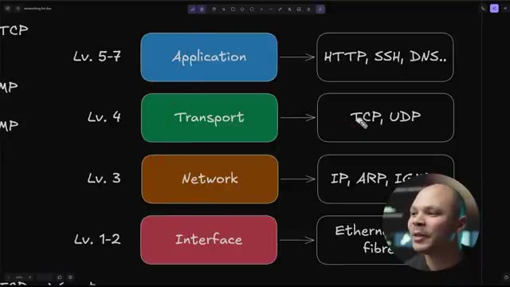
*📸 00:13:30 — Schéma d'architecture représentant les couches du modèle TCP/IP avec la correspondance des protocoles par niveau (Application, Transport, Réseau, Interface physique).*

---

### ⏱️ `[00:13:46 - 00:14:09]` | Segment #39

**🔊 Audio (Transcription Intégrale Mot pour Mot en Français) :**
> Alors que tout ce qui est la couche transport ici, c'est plus la couche réseau de notre système d'exploitation qui va gérer ça. Et donc, on a nos deux protocoles. On a TCP qui est le plus fiable et qui est le plus utilisé. Donc, c'est ce qu'on utilise encore une fois pour HTTP, pour aller sur Internet, SSH pour se connecter à une machine, à un serveur Linux, FTP pour pouvoir transférer des fichiers, ou POP, IMAP pour pouvoir envoyer des emails, tout ce que ça.

**👁️ Analyse Visuelle d'Écran (gemini-3.5-flash-lite) :**
**Interface & Outils** : Présentation ou face-caméra sans interface informatique partagée.

**Contenu textuel & Code** : Explications orales des concepts, architectures et retours d'expérience.

**Action / Démonstration** : Démonstration pédagogique et mise en perspective technique.

---

### ⏱️ `[00:14:09 - 00:14:28]` | Segment #40

**🔊 Audio (Transcription Intégrale Mot pour Mot en Français) :**
> La plupart des protocoles qu'on a en tête, ils utilisent le protocole TCP. parce que c'est un protocole qui est plus fiable. Tous les protocoles où on a besoin de fiabilité, par exemple, si on transfère des fichiers ou des choses comme ça, on va être sûr que quand on récupère le fichier, c'est exactement au bit près, exactement le fichier qui a été envoyé. On ne voit pas qu'il y ait des informations qui aient changé dedans.

**👁️ Analyse Visuelle d'Écran (gemini-3.5-flash-lite) :**
**Interface & Outils** : Aucune interface technique pertinente (terminal, console cloud, code) n'est affichée. L'arrière-plan présente une interface de divertissement grand public.

**Contenu textuel & Code** : Aucun contenu technique (commandes, code, architecture réseau, métriques) n'est visible sur les images.

**Action / Démonstration** : Aucune manipulation, configuration ou explication technique n'est démontrée visuellement. Le créateur est uniquement en train de parler.

---

### ⏱️ `[00:14:28 - 00:14:47]` | Segment #41

**🔊 Audio (Transcription Intégrale Mot pour Mot en Français) :**
> Ensuite, on a le protocole UDP qui, lui, va plus être optimisé pour la rapidité, pour la latence. Donc, par exemple, quand on fait de la voie sur IP, on veut que ça arrive le plus rapidement possible. Et s'il y a un paquet qui manque ou deux paquets qui ne sont pas arrivés exactement dans le même ordre, on ne le verra presque pas. Donc c'est moins important que le paquet arrive rapidement parce que s'il n'arrive pas rapidement, ça devient difficile de communiquer.

**👁️ Analyse Visuelle d'Écran (gemini-3.5-flash-lite) :**
**Interface & Outils** : Logiciel de présentation (slides).

**Contenu textuel & Code** : Comparaison des protocoles TCP et UDP, exemples d'usages (HTTP, SSH, FTP pour TCP ; VOIP, jeux, DNS pour UDP), et la plage de ports UDP.

**Action / Démonstration** : Explication pédagogique des différences et des cas d'utilisation optimaux pour les protocoles réseau TCP et UDP.

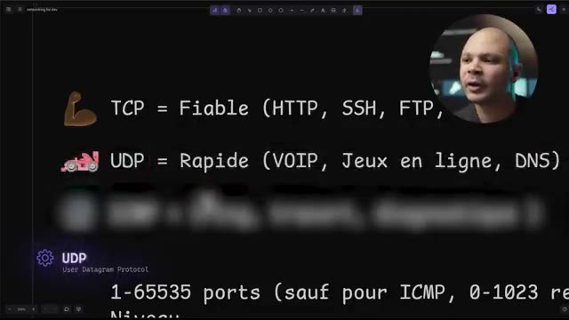
*📸 00:14:33 — Diapositive présentant une comparaison concise entre les protocoles TCP (Fiable : HTTP, SSH, FTP) et UDP (Rapide : VOIP, Jeux en ligne, DNS), avec des informations détaillées sur les ports UDP (1-65535).*

*📸 00:14:42 — Capture du créateur devant une diapositive affichant les attributs clés des protocoles TCP et UDP, leurs applications principales et la gestion des numéros de ports pour UDP.*

---

### ⏱️ `[00:14:47 - 00:15:07]` | Segment #42

**🔊 Audio (Transcription Intégrale Mot pour Mot en Français) :**
> La même chose pour les jeux en ligne. Par exemple, je joue à Counter-Strike et j'envoie ma position 50 fois par seconde. S'il y en a un qui manque dans le tas, ça ne va pas faire une grosse différence. Par contre, je veux que les 49 votes arrivent vraiment rapidement. C'est utilisé aussi pour le DNS. Et pour le DNS, ce n'est pas tant une question de latence. C'est plus que les requêtes DNS sont très courtes. On veut juste récupérer une adresse IP. Les requêtes DNS contiennent très peu de données.

**👁️ Analyse Visuelle d'Écran (gemini-3.5-flash-lite) :**
**Interface & Outils** : Présentation ou face-caméra sans interface informatique partagée.

**Contenu textuel & Code** : Explications orales des concepts, architectures et retours d'expérience.

**Action / Démonstration** : Démonstration pédagogique et mise en perspective technique.

---

### ⏱️ `[00:15:07 - 00:15:30]` | Segment #43

**🔊 Audio (Transcription Intégrale Mot pour Mot en Français) :**
> C'est-à-dire que je veux aller sur cocanume.com et ensuite, ça me répond 1.2.3.4. Et donc si on a beaucoup d'overhead, c'est-à-dire qu'on a beaucoup d'informations supplémentaires pour pouvoir dire alors ça c'était dans tel ordre, etc. Ça peut me faire perdre pas mal de performance pour mon serveur DNS et puis rallonger le temps de la requête. Avec l'illustration ici, on comprend un peu mieux. Quand on est dans TCP, il y a plein de données qui sont rajoutées.

**👁️ Analyse Visuelle d'Écran (gemini-3.5-flash-lite) :**
**Interface & Outils** : Outil de présentation ou de tableau blanc numérique pour diagrammes (ex: Miro, Excalidraw).

**Contenu textuel & Code** : Schémas conceptuels des segments TCP et des datagrammes UDP, mettant en évidence un en-tête TCP significativement plus grand que celui d'UDP.

**Action / Démonstration** : Explication de l'impact de l'overhead (informations supplémentaires dans l'en-tête) sur la performance des requêtes, en se basant sur la comparaison visuelle des en-têtes TCP et UDP.

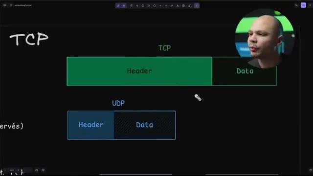
*📸 00:15:25 — Diagramme comparatif des structures de paquets TCP et UDP, illustrant visuellement la taille respective de leurs en-têtes (Header) et de leurs sections de données (Data).*

---

### ⏱️ `[00:15:31 - 00:15:49]` | Segment #44

**🔊 Audio (Transcription Intégrale Mot pour Mot en Français) :**
> Plein. On parle vraiment d'un point de vue d'un paquet. Donc là, les headers TCP, ils font entre 20 et 60 bytes, il me semble. Et le reste, ça va être des données. Et dans l'exemple d'une requête DNS, les données, elles sont très petites. C'est juste quel est l'artip de kokamium.com et la réponse, c'est juste 1.2.3.4.

**👁️ Analyse Visuelle d'Écran (gemini-3.5-flash-lite) :**
**Interface & Outils** : Infographie/Diagramme de présentation (fond d'écran ou projection).

**Contenu textuel & Code** : Schéma d'un paquet réseau segmenté en différentes parties ("TCP" pour l'en-tête TCP, "Data" pour les données). La barre verte symbolise la taille relative des données.

**Action / Démonstration** : Visualisation et explication de la composition d'un paquet réseau, insistant sur la place des en-têtes TCP et des données, notamment dans le cadre d'une requête DNS où la partie "Data" est minime.

*📸 00:15:44 — Le créateur parle face caméra avec en arrière-plan une représentation graphique conceptuelle de la structure d'un paquet réseau. On distingue clairement les éléments "TCP" et "Data", ce dernier étant mis en évidence par une barre verte, illustrant la séparation entre les en-têtes et les données utiles.*

---

### ⏱️ `[00:15:49 - 00:16:15]` | Segment #45

**🔊 Audio (Transcription Intégrale Mot pour Mot en Français) :**
> Donc la donnée est très petite. Donc j'ai intérêt à utiliser un protocole où le header va être beaucoup plus petit. Comme ça, je vais pouvoir transférer beaucoup plus de données, répondre à beaucoup plus de personnes en même temps. Et puis si jamais il y en a un sur 10 000 qui y foire, je le refais, ce n'est pas si grave. Donc dans le cas d'un transfert de fichiers, si mes datas font 1500 bytes, Ça ne me change rien de rajouter 20 bytes avant ici pour s'assurer que c'est exactement les bonnes données qui sont dans mon paquet.

**👁️ Analyse Visuelle d'Écran (gemini-3.5-flash-lite) :**
**Interface & Outils** : Présentation ou face-caméra sans interface informatique partagée.

**Contenu textuel & Code** : Explications orales des concepts, architectures et retours d'expérience.

**Action / Démonstration** : Démonstration pédagogique et mise en perspective technique.

---

### ⏱️ `[00:16:15 - 00:16:35]` | Segment #46

**🔊 Audio (Transcription Intégrale Mot pour Mot en Français) :**
> Parce que dans le cas, dans l'envoi d'un fichier, s'il y a juste un byte qui change, ça peut potentiellement changer complètement le sens du fichier. Il va être complètement corrompu. Donc j'ai besoin d'un protocole qui m'assure que tous les paquets que je vais recevoir, ils sont 100% exacts. Ensuite, on a un dernier protocole qu'on utilise aussi plus pour le diagnostic, qui est l'ICMP. Et donc l'ICMP, c'est le protocole du ping. Et donc pourquoi est-ce que c'est important de savoir ça ?

**👁️ Analyse Visuelle d'Écran (gemini-3.5-flash-lite) :**
**Interface & Outils** : Présentation ou face-caméra sans interface informatique partagée.

**Contenu textuel & Code** : Explications orales des concepts, architectures et retours d'expérience.

**Action / Démonstration** : Démonstration pédagogique et mise en perspective technique.

---

### ⏱️ `[00:16:35 - 00:16:56]` | Segment #47

**🔊 Audio (Transcription Intégrale Mot pour Mot en Français) :**
> C'est que quand on essaye de débugger quelque chose et qu'on essaie d'accéder à un serveur, ce n'est pas parce que je peux pinguer une machine que forcément je peux accéder en HTTP. C'est trois protocoles qui sont à des niveaux complètement différents. Donc quand on veut essayer de débugger quelque chose au niveau HTTP, il faut utiliser un client HTTP. Quand on veut débugger quelque chose au niveau TCP, on peut utiliser des outils comme Telnet et l'ICMP, ça permet de tester juste ces couches-là.

**👁️ Analyse Visuelle d'Écran (gemini-3.5-flash-lite) :**
**Interface & Outils** : Présentation ou face-caméra sans interface informatique partagée.

**Contenu textuel & Code** : Explications orales des concepts, architectures et retours d'expérience.

**Action / Démonstration** : Démonstration pédagogique et mise en perspective technique.

---

### ⏱️ `[00:16:56 - 00:17:20]` | Segment #48

**🔊 Audio (Transcription Intégrale Mot pour Mot en Français) :**
> Et donc pour ces deux protocoles, TCP et UDP, on a des ports, c'est les fameux ports, qui vont de 1 jusqu'à 65 535. En général, les 1000 premiers sont réservés. Dans le sens où, sur une machine Linux par exemple, il faut être en route pour pouvoir utiliser ces ports-là. Donc tous les ports qu'on connaît, comme 80 pour le HTTP, 22 pour SSH, 21 pour FTP, 53 pour le DNS, etc.

**👁️ Analyse Visuelle d'Écran (gemini-3.5-flash-lite) :**
**Interface & Outils** : Présentation ou face-caméra sans interface informatique partagée.

**Contenu textuel & Code** : Explications orales des concepts, architectures et retours d'expérience.

**Action / Démonstration** : Démonstration pédagogique et mise en perspective technique.

---

### ⏱️ `[00:17:21 - 00:17:44]` | Segment #49

**🔊 Audio (Transcription Intégrale Mot pour Mot en Français) :**
> Tous ces ports-là, on ne peut pas les utiliser. Ensuite, tout ce qui est au-dessus de 1024, n'importe quelle application peut les utiliser. Donc c'est important de savoir ça, parce qu'encore une fois, quand on va devoir configurer différents serveurs pour qu'ils puissent communiquer les uns avec les autres, par exemple un backend avec une API, un frontend avec un backend, un load balancer avec des frontend, etc., on va devoir ouvrir le bon port sur le bon protocole, sur le bon groupe de machines.

**👁️ Analyse Visuelle d'Écran (gemini-3.5-flash-lite) :**
**Interface & Outils** : Présentation ou face-caméra sans interface informatique partagée.

**Contenu textuel & Code** : Explications orales des concepts, architectures et retours d'expérience.

**Action / Démonstration** : Démonstration pédagogique et mise en perspective technique.

---

### ⏱️ `[00:17:44 - 00:18:03]` | Segment #50

**🔊 Audio (Transcription Intégrale Mot pour Mot en Français) :**
> Donc on a besoin de comprendre les différences entre ces différents protocoles quand il y a quelque chose qui ne va pas pour pouvoir faire des tests, faire des diagnostics et débugger, troubleshooter la bonne chose. Donc les outils qu'on peut utiliser pour pouvoir débugger, par exemple, Telnet, c'est un client TCP. C'est-à-dire qu'on va pouvoir se connecter sur un port et ensuite faire ce qu'on veut.

**👁️ Analyse Visuelle d'Écran (gemini-3.5-flash-lite) :**
**Interface & Outils** : Présentation ou face-caméra sans interface informatique partagée.

**Contenu textuel & Code** : Explications orales des concepts, architectures et retours d'expérience.

**Action / Démonstration** : Démonstration pédagogique et mise en perspective technique.

---

### ⏱️ `[00:18:03 - 00:18:26]` | Segment #51

**🔊 Audio (Transcription Intégrale Mot pour Mot en Français) :**
> Parce qu'une fois qu'on a établi une connexion avec une autre machine sur un port, il faut utiliser un protocole applicatif pour pouvoir faire quelque chose. Envoyer des emails, faire des requêtes web, se connecter en SSH, transférer des fichiers, etc. Et donc Telnet, ça nous permet d'utiliser n'importe quel protocole qu'on veut parce qu'on peut le faire à la main. La plupart des protocoles de base, comme HTTP, l'email, etc., c'est des protocoles qui sont en mode texte.

**👁️ Analyse Visuelle d'Écran (gemini-3.5-flash-lite) :**
**Interface & Outils** : Présentation ou face-caméra sans interface informatique partagée.

**Contenu textuel & Code** : Explications orales des concepts, architectures et retours d'expérience.

**Action / Démonstration** : Démonstration pédagogique et mise en perspective technique.

---

### ⏱️ `[00:18:26 - 00:18:50]` | Segment #52

**🔊 Audio (Transcription Intégrale Mot pour Mot en Français) :**
> Donc c'est un peu comme des lignes de commandes qu'on peut envoyer à travers le réseau pour pouvoir avoir le résultat. Donc par exemple, si je me connecte en mode telnet sur le port 80, je vais me connecter sur un serveur web, un serveur HTTP. Si j'utilise manuellement le protocole HTTP en mode texte, je vais pouvoir récupérer ma page web. Je vous montrerai juste après. Si je veux tester la communication entre deux serveurs, encore une fois, la communication au niveau 2, niveau 3, le niveau network ne marchera pas si le niveau interface ne marche pas.

**👁️ Analyse Visuelle d'Écran (gemini-3.5-flash-lite) :**
**Interface & Outils** : Présentation ou face-caméra sans interface informatique partagée.

**Contenu textuel & Code** : Explications orales des concepts, architectures et retours d'expérience.

**Action / Démonstration** : Démonstration pédagogique et mise en perspective technique.

---

### ⏱️ `[00:18:50 - 00:19:10]` | Segment #53

**🔊 Audio (Transcription Intégrale Mot pour Mot en Français) :**
> C'est-à-dire que techniquement, si mon câble Ethernet est débranché, mes protocoles ici ne vont jamais marcher. Mais si mon câble Ethernet est branché et que je vais tester que ça fonctionne bien, je peux utiliser ping pour pouvoir tester que le lien entre les deux machines est possible. Ça ne veut pas dire que je peux communiquer en TCP, ça ne veut pas dire que je peux communiquer en HTTP, mais au moins le lien physique et réseau entre les deux machines fonctionne.

**👁️ Analyse Visuelle d'Écran (gemini-3.5-flash-lite) :**
**Interface & Outils** : Présentation ou face-caméra sans interface informatique partagée.

**Contenu textuel & Code** : Explications orales des concepts, architectures et retours d'expérience.

**Action / Démonstration** : Démonstration pédagogique et mise en perspective technique.

---

### ⏱️ `[00:19:10 - 00:19:33]` | Segment #54

**🔊 Audio (Transcription Intégrale Mot pour Mot en Français) :**
> Pour ça, on peut utiliser ping, mais encore une fois, c'est une erreur que je vois souvent, mais ping et curl, ce n'est pas du tout au même niveau. L'un peut marcher, mais pas l'autre. Et donc si on veut mesurer par où est passé mon paquet pour arriver jusqu'à ma destination, je peux utiliser trace route. Donc là, quand je fais mon trace route vers Google.com, ça veut dire que c'est passé par cette machine-là, cette machine-là, cette machine-là, etc., jusqu'à arriver vers la machine finale de Google.

**👁️ Analyse Visuelle d'Écran (gemini-3.5-flash-lite) :**
**Interface & Outils** : Présentation ou face-caméra sans interface informatique partagée.

**Contenu textuel & Code** : Explications orales des concepts, architectures et retours d'expérience.

**Action / Démonstration** : Démonstration pédagogique et mise en perspective technique.

---

### ⏱️ `[00:19:33 - 00:19:54]` | Segment #55

**🔊 Audio (Transcription Intégrale Mot pour Mot en Français) :**
> Donc évidemment, pour pouvoir arriver là, j'ai dû faire une requête DNS en premier pour pouvoir transformer mon nom de domaine en adresse IP. Et si vous êtes observateur ici, cette adresse IP, vous devrez reconnaître que c'est une adresse IP de type CGNAT. Donc c'est une adresse IP privée. Donc ça, c'est sur mon réseau privé. Et ça, pareil ici, 192.68, c'est encore sur mon réseau privé.

**👁️ Analyse Visuelle d'Écran (gemini-3.5-flash-lite) :**
**Interface & Outils** : Présentation ou face-caméra sans interface informatique partagée.

**Contenu textuel & Code** : Explications orales des concepts, architectures et retours d'expérience.

**Action / Démonstration** : Démonstration pédagogique et mise en perspective technique.

---

### ⏱️ `[00:19:54 - 00:20:16]` | Segment #56

**🔊 Audio (Transcription Intégrale Mot pour Mot en Français) :**
> Et ici seulement, on commence à avoir des adresses IP publiques. Là, j'ai effacé l'adresse IP pour que ce soit plus court, mais ce nom de domaine-là correspond à un adresse IP publique. Donc, c'est pas mal aussi de savoir à quel moment mon paquet sort de mon réseau privé. Un autre petit outil que j'utilise tout le temps pour pouvoir savoir ce qui se passe sur une machine, c'est Netstat. Ça, c'est un outil qui permet d'expliquer la plupart des lignes de commande. Si jamais vous voyez une commande quelque part et que vous savez pas à quoi elle sert, vous pouvez utiliser ça.

**👁️ Analyse Visuelle d'Écran (gemini-3.5-flash-lite) :**
**Interface & Outils** : Présentation ou face-caméra sans interface informatique partagée.

**Contenu textuel & Code** : Explications orales des concepts, architectures et retours d'expérience.

**Action / Démonstration** : Démonstration pédagogique et mise en perspective technique.

---

### ⏱️ `[00:20:16 - 00:20:35]` | Segment #57

**🔊 Audio (Transcription Intégrale Mot pour Mot en Français) :**
> Et donc, Netstat-T. Donc là, il ne sait pas, bizarrement, mais c'est pour lui dire de m'afficher les connexions TCP seulement, parce que je peux choisir les connexions TCP, UDP ou même ICMP. P, c'est pour pouvoir lui dire affiche-moi le programme qui est en train de faire cette communication. Parce que si ça me dit juste il y a une connexion sur port 62, ça ne m'avance pas trop.

**👁️ Analyse Visuelle d'Écran (gemini-3.5-flash-lite) :**
**Interface & Outils** : Présentation ou face-caméra sans interface informatique partagée.

**Contenu textuel & Code** : Explications orales des concepts, architectures et retours d'expérience.

**Action / Démonstration** : Démonstration pédagogique et mise en perspective technique.

---

### ⏱️ `[00:20:35 - 00:20:54]` | Segment #58

**🔊 Audio (Transcription Intégrale Mot pour Mot en Français) :**
> J'aimerais savoir quel programme utilise ça. N, c'est pour lui demander d'afficher les adresses IP. Parce que si on ne met pas N, il va essayer de faire une résolution inverse. Et donc à partir des adresses IP, devinez c'est quoi le nom de domaine. Parfois, ça peut prendre du temps. Donc là, ça lui dit juste affiche-moi les adresses IP. N'essaie de pas de faire un truc bizarre. Et L, c'est pour afficher seulement les connexions qui sont en mode écoute et qui attendent que quelqu'un se connecte.

**👁️ Analyse Visuelle d'Écran (gemini-3.5-flash-lite) :**
**Interface & Outils** : Présentation ou face-caméra sans interface informatique partagée.

**Contenu textuel & Code** : Explications orales des concepts, architectures et retours d'expérience.

**Action / Démonstration** : Démonstration pédagogique et mise en perspective technique.

---

### ⏱️ `[00:20:54 - 00:21:14]` | Segment #59

**🔊 Audio (Transcription Intégrale Mot pour Mot en Français) :**
> Donc ça, ça veut dire que ça va afficher tous les serveurs qui sont en main marché. Si il y a un serveur SSH par exemple, je vais voir une connexion qui écoute sur le port 22. Si j'ai un serveur web, je vais voir une connexion qui écoute sur le port 80 ou le port 443. Donc ça permet de savoir qui écoute sur quel port. Si j'ai un port qui est déjà utilisé par exemple, avec cette commande, je vais pouvoir trouver c'est quel programme qu'il utilise.

**👁️ Analyse Visuelle d'Écran (gemini-3.5-flash-lite) :**
**Interface & Outils** : Présentation ou face-caméra sans interface informatique partagée.

**Contenu textuel & Code** : Explications orales des concepts, architectures et retours d'expérience.

**Action / Démonstration** : Démonstration pédagogique et mise en perspective technique.

---

### ⏱️ `[00:21:14 - 00:21:33]` | Segment #60

**🔊 Audio (Transcription Intégrale Mot pour Mot en Français) :**
> Au passage, si vous voulez vous amuser avec Telnet, vous pouvez vous connecter sur cette adresse IP qui est ouverte depuis... Ça doit faire au moins 15-20 ans que ça existe. Et qui est en fait Star Wars en ligne de commande par le réseau via Telnet. Ensuite, HTTP. C'est intéressant de savoir comment fonctionne le protocole HTTP parce qu'en tant que développeur, c'est quasi sûr que tu vas l'utiliser.

**👁️ Analyse Visuelle d'Écran (gemini-3.5-flash-lite) :**
**Interface & Outils** : Présentation ou face-caméra sans interface informatique partagée.

**Contenu textuel & Code** : Explications orales des concepts, architectures et retours d'expérience.

**Action / Démonstration** : Démonstration pédagogique et mise en perspective technique.

---

### ⏱️ `[00:21:34 - 00:22:04]` | Segment #61

**🔊 Audio (Transcription Intégrale Mot pour Mot en Français) :**
> Que tu fasses une API ou que tu fasses un serveur web, ça utilise le protocole HTTP. Donc, comment est-ce que ça fonctionne vraiment sous le capot, une requête HTTP ? On peut le savoir, on peut le faire nous-mêmes pour pouvoir comprendre comment ça marche. Si je tape Telnet, encore une fois un client TCP, et que je me connecte sur www.google.com, sur le port 80, donc pour pouvoir se connecter sur www.google.com, il faut que ma résolution DNS fonctionne sur mon ordi, donc je vais faire une requête DNS, recevoir la réponse, et me connecter sur l'adresse IP en question.

**👁️ Analyse Visuelle d'Écran (gemini-3.5-flash-lite) :**
**Interface & Outils** : Présentation ou face-caméra sans interface informatique partagée.

**Contenu textuel & Code** : Explications orales des concepts, architectures et retours d'expérience.

**Action / Démonstration** : Démonstration pédagogique et mise en perspective technique.

---

### ⏱️ `[00:22:04 - 00:22:25]` | Segment #62

**🔊 Audio (Transcription Intégrale Mot pour Mot en Français) :**
> Donc là que je fais entrer, ça me dit, ok, la résolution DNS déjà a marché, donc je sais que le DNS fonctionne, et ça s'est connecté sur 142.950.69.36, qui est l'adresse IP de Google.com depuis chez moi. Là, la connexion est établie. Maintenant, pour pouvoir récupérer la page web de Google.com, il faut que je parle le langage HTTP, le protocole HTTP. Et le protocole HTTP, il s'attend à avoir un verbe.

**👁️ Analyse Visuelle d'Écran (gemini-3.5-flash-lite) :**
**Interface & Outils** : Présentation ou face-caméra sans interface informatique partagée.

**Contenu textuel & Code** : Explications orales des concepts, architectures et retours d'expérience.

**Action / Démonstration** : Démonstration pédagogique et mise en perspective technique.

---

### ⏱️ `[00:22:25 - 00:22:47]` | Segment #63

**🔊 Audio (Transcription Intégrale Mot pour Mot en Français) :**
> Donc, par exemple, get. Il peut y avoir différents verbes. Ça peut être get, post, delete, put, des choses comme ça. Le get, c'est juste pour pouvoir récupérer quelque chose. Ensuite, la ressource qu'on veut récupérer. Donc, si je veux la racine de Google.com, la ressource, ça va être slash. Techniquement, le serveur web de l'autre côté, donc le serveur web de Google.com, il va probablement être configuré pour que la ressource slash, donc la racine, correspond à index.html.

**👁️ Analyse Visuelle d'Écran (gemini-3.5-flash-lite) :**
**Interface & Outils** : Présentation ou face-caméra sans interface informatique partagée.

**Contenu textuel & Code** : Explications orales des concepts, architectures et retours d'expérience.

**Action / Démonstration** : Démonstration pédagogique et mise en perspective technique.

---

### ⏱️ `[00:22:47 - 00:23:08]` | Segment #64

**🔊 Audio (Transcription Intégrale Mot pour Mot en Français) :**
> Donc, je pourrais aussi demander index.html. Mais probablement que si je ne le demande pas, le serveur web va me répondre ce fichier-là parce qu'il ne va pas me lister ce qu'il y a dans le répertoire root. Il va me donner l'index. Ensuite, la version du protocole que je suis en train de parler pour que le serveur, s'il supporte plusieurs versions, sache laquelle utiliser. Ce qu'on utilise le plus bas du temps, c'est http.1.1.

**👁️ Analyse Visuelle d'Écran (gemini-3.5-flash-lite) :**
**Interface & Outils** : Présentation ou face-caméra sans interface informatique partagée.

**Contenu textuel & Code** : Explications orales des concepts, architectures et retours d'expérience.

**Action / Démonstration** : Démonstration pédagogique et mise en perspective technique.

---

### ⏱️ `[00:23:08 - 00:23:29]` | Segment #65

**🔊 Audio (Transcription Intégrale Mot pour Mot en Français) :**
> Maintenant, il y a http.2, http.3 même. Mais si on veut le faire à la main, on utilise 1.1. Et ensuite, ce qui est important, quel est l'autre ou quel est le site web que je veux récupérer ? Donc là, ici, je mets host de point google.com. Mais là, on peut se dire, c'est bizarre, tu as déjà dit que tu voulais google.com ici, donc pourquoi tu dois lui répéter que tu veux google.com ? Parce qu'en fait, quand je me suis connecté ici, je me suis connecté à l'adresse IP.

**👁️ Analyse Visuelle d'Écran (gemini-3.5-flash-lite) :**
**Interface & Outils** : Présentation ou face-caméra sans interface informatique partagée.

**Contenu textuel & Code** : Explications orales des concepts, architectures et retours d'expérience.

**Action / Démonstration** : Démonstration pédagogique et mise en perspective technique.

---

### ⏱️ `[00:23:29 - 00:23:48]` | Segment #66

**🔊 Audio (Transcription Intégrale Mot pour Mot en Français) :**
> Et donc, le paquet que je veux envoyer, à aucun moment, le serveur de Google, il sait que je veux google.com. Il pourrait assumer que je veux google.com si c'est vraiment le seul site web qui sert, mais la plupart du temps on va avoir des serveurs qui gèrent plusieurs sites web et donc on a besoin de préciser quel site web on veut pour que le serveur web il puisse aller chercher les bons fichiers et me les donner.

**👁️ Analyse Visuelle d'Écran (gemini-3.5-flash-lite) :**
**Interface & Outils** : Présentation ou face-caméra sans interface informatique partagée.

**Contenu textuel & Code** : Explications orales des concepts, architectures et retours d'expérience.

**Action / Démonstration** : Démonstration pédagogique et mise en perspective technique.

---

### ⏱️ `[00:23:49 - 00:24:08]` | Segment #67

**🔊 Audio (Transcription Intégrale Mot pour Mot en Français) :**
> Donc c'est pour ça que là je dois dire que je veux google.com. Donc là je fais entrer deux fois parce que c'est le protocole comme ça et donc là je viens de récupérer la page web. Donc là je vois que ça se finit par bodys html qui est la page web de google.com. Ce qui est intéressant aussi c'est que si je scrolle ici je vois qu'avant de récupérer la page web je vois les headers.

**👁️ Analyse Visuelle d'Écran (gemini-3.5-flash-lite) :**
**Interface & Outils** : Présentation ou face-caméra sans interface informatique partagée.

**Contenu textuel & Code** : Explications orales des concepts, architectures et retours d'expérience.

**Action / Démonstration** : Démonstration pédagogique et mise en perspective technique.

---

### ⏱️ `[00:24:09 - 00:24:27]` | Segment #68

**🔊 Audio (Transcription Intégrale Mot pour Mot en Français) :**
> Donc les headers, ça va être des informations supplémentaires qui sont transférées en HTTP. Et c'est là où souvent on va avoir les cookies, on va avoir les différents paramètres de sécurité, des choses comme ça. Et c'est là aussi où on a le code de réponse. Donc là, il me répond que, ok, je continue, je parle bien en HTTP 1.1. Et le code d'erreur de cette page, c'est le code 200.

**👁️ Analyse Visuelle d'Écran (gemini-3.5-flash-lite) :**
**Interface & Outils** : Présentation ou face-caméra sans interface informatique partagée.

**Contenu textuel & Code** : Explications orales des concepts, architectures et retours d'expérience.

**Action / Démonstration** : Démonstration pédagogique et mise en perspective technique.

---

### ⏱️ `[00:24:27 - 00:24:49]` | Segment #69

**🔊 Audio (Transcription Intégrale Mot pour Mot en Français) :**
> Et le code 200, ça correspond à, il n'y a pas d'erreur. Maintenant, si je refais la même chose, et que ici je fais get slash, mais que ici je mets hostgoogle.com, et que je ne mets pas le www, la réponse est différente, même si je me suis connecté au même serveur. Parce que le host que j'ai donné ici, il est différent. C'est celui sans le www. Et donc là, ce que ça me répond, le code d'erreur que ça me répond, c'est un code 301.

**👁️ Analyse Visuelle d'Écran (gemini-3.5-flash-lite) :**
**Interface & Outils** : Présentation ou face-caméra sans interface informatique partagée.

**Contenu textuel & Code** : Explications orales des concepts, architectures et retours d'expérience.

**Action / Démonstration** : Démonstration pédagogique et mise en perspective technique.

---

### ⏱️ `[00:24:49 - 00:25:08]` | Segment #70

**🔊 Audio (Transcription Intégrale Mot pour Mot en Français) :**
> En fait, c'est une redirection. Et donc là, ça me dit que ce que tu cherches, google.com, en fait, ce n'est pas ici. Il faut que tu refasses une nouvelle requête vers http2.com. www.google.com. Et il me donne quand même une réponse à un body ici pour que je puisse voir visuellement dans mon navigateur qu'est-ce qui s'est passé parce que mon code d'erreur, il n'est pas affiché dans mon navigateur.

**👁️ Analyse Visuelle d'Écran (gemini-3.5-flash-lite) :**
**Interface & Outils** : Présentation ou face-caméra sans interface informatique partagée.

**Contenu textuel & Code** : Explications orales des concepts, architectures et retours d'expérience.

**Action / Démonstration** : Démonstration pédagogique et mise en perspective technique.

---

### ⏱️ `[00:25:09 - 00:25:29]` | Segment #71

**🔊 Audio (Transcription Intégrale Mot pour Mot en Français) :**
> Et donc là, ça me dit qu'il faut bouger sur www.com. Et il met même un lien pour m'afficher vraiment si j'ai un navigateur claqué. En théorie, mon navigateur, quand il reçoit un code 301, il va automatiquement aller faire la requête ici vers www.google.com. Et c'est important de savoir ça parce qu'il y a différents types de redirection. Ça, ça n'a rien à voir avec un CNAME qu'on a en DNS par exemple.

**👁️ Analyse Visuelle d'Écran (gemini-3.5-flash-lite) :**
**Interface & Outils** : Présentation ou face-caméra sans interface informatique partagée.

**Contenu textuel & Code** : Explications orales des concepts, architectures et retours d'expérience.

**Action / Démonstration** : Démonstration pédagogique et mise en perspective technique.

---

### ⏱️ `[00:25:29 - 00:25:56]` | Segment #72

**🔊 Audio (Transcription Intégrale Mot pour Mot en Français) :**
> Ou effectivement, peut-être que l'enregistrement DNS pour google.com et un CNAME qui pointe vers www.google.com. Mais c'est différent d'avoir une redirection HTTP, ce qui est une redirection qui est faite par le serveur. En particulier, si vous faites des applications web, c'est important de comprendre la différence entre les deux. Entre un CNAME qui est une redirection DNS, qui va juste répondre l'adresse IP d'un autre nom de domaine, et une redirection HTTP qui va renvoyer un code 301 qui va demander au navigateur de refaire une requête HTTP.

**👁️ Analyse Visuelle d'Écran (gemini-3.5-flash-lite) :**
**Interface & Outils** : Présentation ou face-caméra sans interface informatique partagée.

**Contenu textuel & Code** : Explications orales des concepts, architectures et retours d'expérience.

**Action / Démonstration** : Démonstration pédagogique et mise en perspective technique.

---

### ⏱️ `[00:25:56 - 00:26:15]` | Segment #73

**🔊 Audio (Transcription Intégrale Mot pour Mot en Français) :**
> C'est à deux niveaux de protocole différents. Évidemment, ça c'est avec Telnet. Pour vous montrer vraiment sous le capot comment ça fonctionne, content que l'HTTP, mais il y a un moyen plus simple. Si on essaye de débugger qu'il se passe avec du HTTP, on peut utiliser un client HTTP comme curl ou wget. Et donc, je vais venir ici faire curl. Ça va faire la même chose. Donc, curl, c'est un client HTTP.

**👁️ Analyse Visuelle d'Écran (gemini-3.5-flash-lite) :**
**Interface & Outils** : Présentation ou face-caméra sans interface informatique partagée.

**Contenu textuel & Code** : Explications orales des concepts, architectures et retours d'expérience.

**Action / Démonstration** : Démonstration pédagogique et mise en perspective technique.

---

### ⏱️ `[00:26:15 - 00:26:34]` | Segment #74

**🔊 Audio (Transcription Intégrale Mot pour Mot en Français) :**
> Il va se connecter, il va faire la requête DNS, il va se connecter à Google.com. Et ensuite, on met "-v", ici, pour verbose, pour pouvoir nous afficher les headers et les codes d'erreur, etc. Et si je fais curl Google.com sans le www, là, il me dit tout le détail que Google a été résolu, la résolution DNS en cette adresse IP. Ensuite, il s'est connecté à cette adresse IP.

**👁️ Analyse Visuelle d'Écran (gemini-3.5-flash-lite) :**
**Interface & Outils** : Terminal Linux, application de présentation ou notes techniques.

**Contenu textuel & Code** : Commande `curl www.google.com -v`. Explications textuelles des concepts HTTP (client TCP, verbes HTTP, port 80, en-têtes, HTTPS/TLS/SSL).

**Action / Démonstration** : Explication et démonstration de l'utilisation de la commande `curl` avec l'option verbose (`-v`) pour analyser les requêtes HTTP/HTTPS et leurs en-têtes.

*📸 00:26:20 — Un terminal Linux affiche la commande `curl www.google.com -v` en cours d'exécution. En arrière-plan, des notes techniques expliquent les bases du protocole HTTP, y compris le rôle du client TCP, les verbes HTTP (GET, POST, DELETE), l'importance du hostname, le port 80, l'affichage des en-têtes via l'option verbose (`-v`), et une introduction à HTTPS (HTTP over TLS/SSL). Le créateur est visible en surimpression dans le coin supérieur droit.*

---

### ⏱️ `[00:26:34 - 00:26:54]` | Segment #75

**🔊 Audio (Transcription Intégrale Mot pour Mot en Français) :**
> Il a fait cette requête que la même chose que ce que je fais en telnet, sauf que là, ça l'a fait pour moi vu que ça inclut HTTP. Host, Google.com, etc. Et donc là, j'ai reçu le code 301 avec la réponse ici. Ici, à l'inverse, ici, je viens faire www. Et bien là, je reçois ma réponse et je peux aller regarder mon header si je veux. Et j'ai bien reçu le code d'erreur 200.

**👁️ Analyse Visuelle d'Écran (gemini-3.5-flash-lite) :**
**Interface & Outils** : Présentation ou face-caméra sans interface informatique partagée.

**Contenu textuel & Code** : Explications orales des concepts, architectures et retours d'expérience.

**Action / Démonstration** : Démonstration pédagogique et mise en perspective technique.

---

### ⏱️ `[00:26:54 - 00:27:15]` | Segment #76

**🔊 Audio (Transcription Intégrale Mot pour Mot en Français) :**
> Donc, Körn permet de faire des requêtes HTTP beaucoup plus facilement, tout en lien à ces détails avec le mode verbose pour pouvoir comprendre qu'il y a quelque chose qui ne va pas avec un serveur web. Et aussi, on voit que là, Curl a automatiquement utilisé le nom de domaine en tant que hôte. Quand il s'est connecté, il a dit host www.google.com. Il a assumé que c'était la même chose. Mais avec Antoine & Intellect, on peut faire différent si on veut pour pouvoir débuguer des choses.

**👁️ Analyse Visuelle d'Écran (gemini-3.5-flash-lite) :**
**Interface & Outils** : Présentation ou face-caméra sans interface informatique partagée.

**Contenu textuel & Code** : Explications orales des concepts, architectures et retours d'expérience.

**Action / Démonstration** : Démonstration pédagogique et mise en perspective technique.

---

### ⏱️ `[00:27:16 - 00:27:36]` | Segment #77

**🔊 Audio (Transcription Intégrale Mot pour Mot en Français) :**
> Et c'est important de savoir ça, parce que ça arrive très souvent qu'on ait des serveurs avec plusieurs sites web dessus ou qu'on ait des load balancers, comme on va voir juste après, qui ont des règles qui redirigent les requêtes vers différents serveurs en fonction du nom de domaine qui a été demandé. et le nom de domaine est demandé dans le champ host. Il n'est pas demandé au niveau de la requête DNS. Le server web ne reçoit jamais cette requête DNS.

**👁️ Analyse Visuelle d'Écran (gemini-3.5-flash-lite) :**
**Interface & Outils** : N/A

**Contenu textuel & Code** : N/A

**Action / Démonstration** : N/A

---

### ⏱️ `[00:27:36 - 00:27:59]` | Segment #78

**🔊 Audio (Transcription Intégrale Mot pour Mot en Français) :**
> Il ne sait pas de quel site on parle. Ensuite, le HTTPS. Il peut être intéressant de comprendre comment ça fonctionne. Quand on parle de SSL, c'est l'algorithme de chiffrement, l'ancienne version. Quand on parlait de HTTPS avant, on parlait de HTTP over SSL. La nouvelle version, c'est TLS. Si quelqu'un dit SSL, techniquement, c'est faux parce que maintenant, on va utiliser TLS, mais c'est juste qu'on a gardé l'habitude de parler de certificat SSL par exemple.

**👁️ Analyse Visuelle d'Écran (gemini-3.5-flash-lite) :**
**Interface & Outils** : Présentation ou face-caméra sans interface informatique partagée.

**Contenu textuel & Code** : Explications orales des concepts, architectures et retours d'expérience.

**Action / Démonstration** : Démonstration pédagogique et mise en perspective technique.

---

### ⏱️ `[00:28:00 - 00:28:20]` | Segment #79

**🔊 Audio (Transcription Intégrale Mot pour Mot en Français) :**
> Et donc, ce qui se passe quand on va sur un serveur web, il peut y avoir quelqu'un qui est au milieu et qui écoute ce qui se passe. Donc, parce que mon paquet, il passe dans ma box, ma box, ça va chez mon FAI, mon FAI, ça passe dans un réseau, qui va dans un autre réseau, dans un autre réseau, comme on a vu avec Traceroute. Après, être passé par 10 000 machines sur Internet arrive sur la machine avec laquelle je veux communiquer.

**👁️ Analyse Visuelle d'Écran (gemini-3.5-flash-lite) :**
**Interface & Outils** : Application de tableau blanc numérique ou outil de dessin vectoriel (potentiellement intégré via OBS ou similaire).

**Contenu textuel & Code** : Diagramme d'architecture réseau simplifié expliquant le fonctionnement de HTTPS, incluant les notions de client, serveur web, certificat et protocole TLS/SSL.

**Action / Démonstration** : Explication visuelle et didactique du mécanisme de sécurisation des communications web (HTTPS) entre un client et un serveur, en contrastant potentiellement avec les risques d'interception évoqués dans le discours ("quelqu'un qui est au milieu et qui écoute").

*📸 00:28:15 — Un diagramme explicatif illustrant le protocole HTTPS (HTTP over TLS/SSL), montrant un client (représenté par un personnage avec un laptop) communiquant via une flèche "HTTPS" avec un "Server Web" qui possède une clé et un "Cert" (certificat). Le présentateur est incrusté en bas à droite de l'écran.*

---

### ⏱️ `[00:28:20 - 00:28:40]` | Segment #80

**🔊 Audio (Transcription Intégrale Mot pour Mot en Français) :**
> Donc, ça veut dire que ce chemin ici, il n'est pas sécurisé. C'est-à-dire qu'il y a plein d'opportunités pour plein de personnes différentes pour pouvoir écouter le trafic réseau. Et si je me connecte sur un site web, je me connecte sur ma banque par exemple et que je donne mon login et mon mot de passe, il y a plein de personnes qui peuvent le voir. Donc c'est pour ça que maintenant la plupart des navigateurs utilisent le protocole HTTPS.

**👁️ Analyse Visuelle d'Écran (gemini-3.5-flash-lite) :**
**Interface & Outils** : Présentation ou face-caméra sans interface informatique partagée.

**Contenu textuel & Code** : Explications orales des concepts, architectures et retours d'expérience.

**Action / Démonstration** : Démonstration pédagogique et mise en perspective technique.

---

### ⏱️ `[00:28:40 - 00:29:05]` | Segment #81

**🔊 Audio (Transcription Intégrale Mot pour Mot en Français) :**
> Et donc c'est le même protocole HTTP dont on vient de parler, c'est juste qu'on l'encapsule dans une couche qu'on va chiffrer pour que même si quelqu'un arrive à intercepter le trafic, il soit illisible, il ne puisse pas comprendre ce qu'on a envoyé. Et donc pour que le serveur web et que moi je puisse quand même déchiffrer les communications, il faut qu'il y ait un échange de clés. Il faut que moi j'envoie ma clé au serveur web et il faut que le serveur web lui il m'envoie ma clé. Et donc pour ça on utilise des certificats. Certificat SSL, certificat TLS. Le certificat permet deux choses.

**👁️ Analyse Visuelle d'Écran (gemini-3.5-flash-lite) :**
**Interface & Outils** : Tableau blanc numérique interactif (de type Excalidraw).

**Contenu textuel & Code** : Diagramme conceptuel présentant un poste client, un flux d'échange sécurisé labellisé "HTTPS", un serveur web ("Server Web") avec son certificat SSL associé ("Cert"), et le titre principal "HTTPS (HTTP over TLS/SSL)".

**Action / Démonstration** : Explication du mécanisme de chiffrement et d'encapsulation du protocole HTTP dans une couche TLS/SSL afin d'empêcher l'interception et la lecture de données en clair par un tiers.

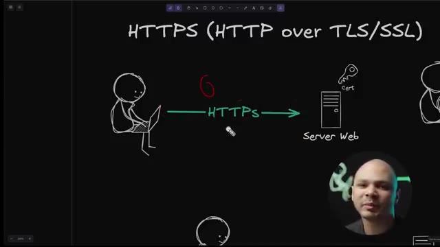
*📸 00:28:46 — Schéma explicatif du protocole HTTPS (HTTP over TLS/SSL) illustrant le chiffrement des échanges entre un client et un serveur web.*

---

### ⏱️ `[00:29:05 - 00:29:27]` | Segment #82

**🔊 Audio (Transcription Intégrale Mot pour Mot en Français) :**
> Il permet de chiffrer donc si le trafic est chiffré, personne d'autre que moi et le serveur peut le lire. Il permet d'authentifier parce que quelqu'un pourrait mettre un faux serveur web ici, chiffrer la connexion, envoyer les requêtes. Mais comme c'est un faux serveur web, il pourrait déchiffrer toutes les requêtes que je lui envoie et donc récupérer mon login, mon mot de passe et toutes nos informations. Et donc même si je communique de manière chiffré avec mon serveur, il faut que je sois sûr que je parle bien au serveur que je veux.

**👁️ Analyse Visuelle d'Écran (gemini-3.5-flash-lite) :**
**Interface & Outils** : Présentation ou face-caméra sans interface informatique partagée.

**Contenu textuel & Code** : Explications orales des concepts, architectures et retours d'expérience.

**Action / Démonstration** : Démonstration pédagogique et mise en perspective technique.

---

### ⏱️ `[00:29:27 - 00:29:45]` | Segment #83

**🔊 Audio (Transcription Intégrale Mot pour Mot en Français) :**
> Et donc ce certificat ici, il est émis par une autorité de certification qui va s'assurer que ce serveur web est bien le propriétaire de son nom de domaine et lui donner ce certificat. Et donc comme ça, je suis sûr que quand je récupère le certificat de mon serveur web, en tant que client qui me connecte au serveur web, je suis sûr de communiquer avec la bonne personne.

**👁️ Analyse Visuelle d'Écran (gemini-3.5-flash-lite) :**
**Interface & Outils** : Présentation ou face-caméra sans interface informatique partagée.

**Contenu textuel & Code** : Explications orales des concepts, architectures et retours d'expérience.

**Action / Démonstration** : Démonstration pédagogique et mise en perspective technique.

---

### ⏱️ `[00:29:45 - 00:30:07]` | Segment #84

**🔊 Audio (Transcription Intégrale Mot pour Mot en Français) :**
> Quand je vois le petit cadenas ou la petite clé, est-ce que je vais sur Google.com ? Je suis sûr que je suis bien sur les serveurs de Google.com parce qu'il n'y a que Google qui a ce certificat. Ça, c'est le cas tout simple. Mais il peut y avoir le cas ici où on utilise un load balancer. On va voir juste après comment ça marche, à quoi ça sert. Un load balancer, il va prendre notre requête ici et il va les envoyer ensuite vers nos différents serveurs web.

**👁️ Analyse Visuelle d'Écran (gemini-3.5-flash-lite) :**
**Interface & Outils** : Présentation ou face-caméra sans interface informatique partagée.

**Contenu textuel & Code** : Explications orales des concepts, architectures et retours d'expérience.

**Action / Démonstration** : Démonstration pédagogique et mise en perspective technique.

---

### ⏱️ `[00:30:07 - 00:30:26]` | Segment #85

**🔊 Audio (Transcription Intégrale Mot pour Mot en Français) :**
> Ça nous permet d'avoir plusieurs serveurs web pour avoir de la haute disponibilité, pour pouvoir accueillir plus de charges, plus d'utilisateurs. Ce qu'on fait assez souvent, c'est qu'on va faire du SSL offloading ou TLS offloading. Ça veut dire que c'est notre load balancer ici qui va gérer la communication en HTTPS. Donc, c'est lui qui va avoir le certificat.

**👁️ Analyse Visuelle d'Écran (gemini-3.5-flash-lite) :**
**Interface & Outils** : Présentation ou face-caméra sans interface informatique partagée.

**Contenu textuel & Code** : Explications orales des concepts, architectures et retours d'expérience.

**Action / Démonstration** : Démonstration pédagogique et mise en perspective technique.

---

### ⏱️ `[00:30:27 - 00:30:47]` | Segment #86

**🔊 Audio (Transcription Intégrale Mot pour Mot en Français) :**
> Et nos serveurs ici, eux, ils vont communiquer en HTTP. Parce qu'en fait, ici, quand on est ici, on reste dans le réseau privé. Donc, notre load balancer et nos serveurs web, ils communiquent dans un réseau privé qui n'est pas accessible depuis l'Internet. Donc, il n'y a pas de raison de s'ensouffier et de chiffrer le trafic, même si maintenant, ça commence à se faire de plus en plus, de chiffrer le trafic interne, donc le trafic des réseaux internes.

**👁️ Analyse Visuelle d'Écran (gemini-3.5-flash-lite) :**
**Interface & Outils** : Présentation ou face-caméra sans interface informatique partagée.

**Contenu textuel & Code** : Explications orales des concepts, architectures et retours d'expérience.

**Action / Démonstration** : Démonstration pédagogique et mise en perspective technique.

---

### ⏱️ `[00:30:47 - 00:31:06]` | Segment #87

**🔊 Audio (Transcription Intégrale Mot pour Mot en Français) :**
> Mais si on n'est pas à ce point-là par un autre niveau de la sécurité, ça permet de sauver pas mal d'argent de ne pas chiffrer en interne les communications parce que quand on ne chiffre pas, on a besoin d'utiliser moins de ressources, moins de CPU et donc on peut servir plus de requêtes avec moins de serveurs. Et donc ça coûte moins cher. Par contre, il faut être au courant que notre serveur web ici, il ne va pas servir du trafic en HTTPS.

**👁️ Analyse Visuelle d'Écran (gemini-3.5-flash-lite) :**
**Interface & Outils** : Présentation ou face-caméra sans interface informatique partagée.

**Contenu textuel & Code** : Explications orales des concepts, architectures et retours d'expérience.

**Action / Démonstration** : Démonstration pédagogique et mise en perspective technique.

---

### ⏱️ `[00:31:07 - 00:31:31]` | Segment #88

**🔊 Audio (Transcription Intégrale Mot pour Mot en Français) :**
> Il va servir du trafic en HTTP. Et c'est notre load balancer ici qui va servir le HTTP. Et en tant que développeur, c'est important de savoir ça et comprendre aussi que dans ce cas-là, le DNS, il pointera vers notre load balancer et pas vers nos serveurs web qui, eux, ont des adresses privées que de toute manière, notre utilisateur ne pourrait jamais accéder. Et on a un autre cas ici, où chacun de nos serveurs a le certificat, mais du coup, c'est un petit peu plus cher à gérer parce qu'on doit avoir notre certificat qui traîne à plein d'endroits différents.

**👁️ Analyse Visuelle d'Écran (gemini-3.5-flash-lite) :**
**Interface & Outils** : Présentation ou face-caméra sans interface informatique partagée.

**Contenu textuel & Code** : Explications orales des concepts, architectures et retours d'expérience.

**Action / Démonstration** : Démonstration pédagogique et mise en perspective technique.

---

### ⏱️ `[00:31:31 - 00:31:54]` | Segment #89

**🔊 Audio (Transcription Intégrale Mot pour Mot en Français) :**
> Et là, notre old balancer, le ici, ce n'est plus lui qui va gérer le trafic, il va juste rediriger les requêtes à droite ou à gauche. Mais c'est un peu plus rare qu'on fasse ça parce que là, le old balancer, il ne peut pas voir les requêtes. Donc, il ne peut pas être intelligent. Il ne peut pas dire, ok, cette requête, je l'envoie à lui, mais cette requête, je l'envoie à cet autre groupe de serveurs. Mais dans ce système-là, il faut être au courant que notre serveur web va avoir un certificat et que notre certificat soit valide pour le nombre de domaines qui pointent vers ce serveur et ce serveur.

**👁️ Analyse Visuelle d'Écran (gemini-3.5-flash-lite) :**
**Interface & Outils** : Présentation ou face-caméra sans interface informatique partagée.

**Contenu textuel & Code** : Explications orales des concepts, architectures et retours d'expérience.

**Action / Démonstration** : Démonstration pédagogique et mise en perspective technique.

---

### ⏱️ `[00:31:54 - 00:32:14]` | Segment #90

**🔊 Audio (Transcription Intégrale Mot pour Mot en Français) :**
> Donc en particulier si on est un développeur web, c'est intéressant de savoir ça, même si on fait des API en back-end aussi. Une chose aussi que je vois être un petit peu floue pour les développeurs, c'est qu'est-ce qu'un load balancer ? Même si c'est un concept de réseau d'amélioration de son système, c'est important de savoir parce que notre load balancer et nos applications ou nos API vont interagir avec. Et parfois, ça a un impact sur comment est-ce qu'il faut coder notre application.

**👁️ Analyse Visuelle d'Écran (gemini-3.5-flash-lite) :**
**Interface & Outils** : Présentation ou face-caméra sans interface informatique partagée.

**Contenu textuel & Code** : Explications orales des concepts, architectures et retours d'expérience.

**Action / Démonstration** : Démonstration pédagogique et mise en perspective technique.

---

### ⏱️ `[00:32:14 - 00:32:33]` | Segment #91

**🔊 Audio (Transcription Intégrale Mot pour Mot en Français) :**
> Donc c'est important à savoir. Donc là, j'ai mis load balancer. Parfois, on appelle ça aussi un reverse proxy. Et si vous êtes dans un endroit où on veut vraiment parler super en français, parfois, on appelle ça serveur mandataire. Et donc, l'exemple bateau, c'est ça. C'est que notre utilisateur ici, quand il veut aller sur notre site, notre nom de domaine, il ne va pas répondre vers nos serveurs directement.

**👁️ Analyse Visuelle d'Écran (gemini-3.5-flash-lite) :**
**Interface & Outils** : Présentation ou face-caméra sans interface informatique partagée.

**Contenu textuel & Code** : Explications orales des concepts, architectures et retours d'expérience.

**Action / Démonstration** : Démonstration pédagogique et mise en perspective technique.

---

### ⏱️ `[00:32:33 - 00:32:52]` | Segment #92

**🔊 Audio (Transcription Intégrale Mot pour Mot en Français) :**
> Nos serveurs, ils vont être dans un réseau privé qu'on ne peut jamais être accédé depuis l'extérieur. On va juste avoir un load balancer ici qui va être la seule machine à être capable d'être accédé depuis l'extérieur. Il est un peu entre les deux, si on veut. Il a à la fois une carte réseau qui va vers l'extérieur et à la fois une carte réseau qui va à l'intérieur. Et donc, nos noms de domaine pointent vers notre load balancer. Notre utilisateur envoie notre requête HTTP à notre load balancer.

**👁️ Analyse Visuelle d'Écran (gemini-3.5-flash-lite) :**
**Interface & Outils** : Présentation ou face-caméra sans interface informatique partagée.

**Contenu textuel & Code** : Explications orales des concepts, architectures et retours d'expérience.

**Action / Démonstration** : Démonstration pédagogique et mise en perspective technique.

---

### ⏱️ `[00:32:53 - 00:33:16]` | Segment #93

**🔊 Audio (Transcription Intégrale Mot pour Mot en Français) :**
> Et notre load balancer, lui, il va pouvoir choisir sur quel serveur ou quel groupe de serveurs il va envoyer notre requête. Et donc, il y a deux types de load balancer. Tu as les load balancers qu'on appelle parfois les load balancers de niveau 4 ou parfois des NLB. Et tu as les load balancers qu'on appelle de Layer 7, qu'on appelle aussi sur les plateformes de cloud des ALB, applicatives load balancer, ou parfois des smart load balancers qui sont un petit peu plus intelligents que ceux-là.

**👁️ Analyse Visuelle d'Écran (gemini-3.5-flash-lite) :**
**Interface & Outils** : Tableau blanc numérique ou logiciel de présentation de diagrammes et de notes structurées.

**Contenu textuel & Code** : Comparaison entre "Layer 4, NLB" (reçoit les paquets, performant, simple) et "Layer 7 / Applicatif (ALB) / Smart LB" (reçoit les requêtes HTTP, gère les règles, plus lent, peut gérer le TLS offload, plus pratique). Diagrammes illustrant des flux avec "fanta.co", "Header TCP", "GET Host".

**Action / Démonstration** : Explication et visualisation des différences fondamentales entre les load balancers de niveau 4 et de niveau 7, soulignant leurs fonctions, performances et capacités de gestion de requêtes/paquets.

*📸 00:32:59 — Le créateur s'exprime devant un écran affichant des notes techniques et un diagramme de flux relatifs aux types de load balancers, notamment les couches 4 et 7.*

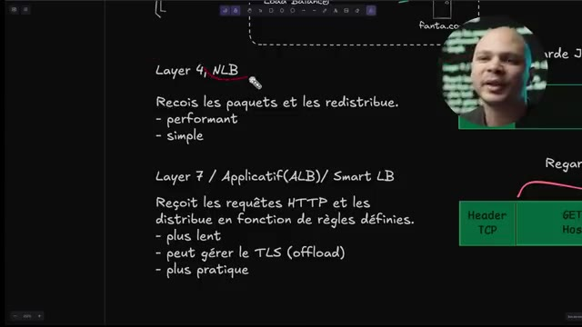
*📸 00:33:04 — Vue détaillée d'un tableau blanc numérique présentant les caractéristiques comparatives des load balancers de niveau 4 (NLB) et de niveau 7 (ALB/Smart LB), avec des diagrammes explicatifs de flux de données (requêtes HTTP, headers TCP).*

---

### ⏱️ `[00:33:16 - 00:33:36]` | Segment #94

**🔊 Audio (Transcription Intégrale Mot pour Mot en Français) :**
> Et à quoi ça correspond ces levels ? Level 4, level 7, ça correspond au fameux graphique qu'on avait ici où le niveau, niveau 7, c'est le niveau applicatif, alors que niveau 4, c'est le niveau transport. Donc ça veut dire qu'un load balancer de niveau 4, il va juste interagir avec les informations qu'on a à ce niveau-là, au niveau TCP. Donc dans le header TCP, il y a l'adresse IP de source, l'adresse IP de destination, le port, des choses comme ça.

**👁️ Analyse Visuelle d'Écran (gemini-3.5-flash-lite) :**
**Interface & Outils** : Présentation ou face-caméra sans interface informatique partagée.

**Contenu textuel & Code** : Explications orales des concepts, architectures et retours d'expérience.

**Action / Démonstration** : Démonstration pédagogique et mise en perspective technique.

---

### ⏱️ `[00:33:37 - 00:33:57]` | Segment #95

**🔊 Audio (Transcription Intégrale Mot pour Mot en Français) :**
> Tout le reste, c'est de la data. Et le load balancer de niveau 7, lui, il va agir avec les données qu'il y a dans cette partie applicative ici, Donc ce qu'il y a dans la partie data ici, des paquets. Dans la partie data, on va voir notre requête ici. Donc ça va être c'est quoi le verbe de la requête HTTP, c'est quoi la ressource à laquelle on va accéder, c'est quoi le protocole et c'est quoi le hôte, quelle machine on veut accéder.

**👁️ Analyse Visuelle d'Écran (gemini-3.5-flash-lite) :**
**Interface & Outils** : Présentation ou face-caméra sans interface informatique partagée.

**Contenu textuel & Code** : Explications orales des concepts, architectures et retours d'expérience.

**Action / Démonstration** : Démonstration pédagogique et mise en perspective technique.

---

### ⏱️ `[00:33:57 - 00:34:16]` | Segment #96

**🔊 Audio (Transcription Intégrale Mot pour Mot en Français) :**
> Donc tout ça, c'est des choses qu'un load balancer de niveau 4 ne voit pas, mais qu'un load balancer de niveau 7 peut voir et donc peut se comporter différemment en fonction de certaines règles. Donc l'autre load balancer de niveau 4, l'avantage, c'est qu'il va être très performant parce que justement, il n'a qu'un tout petit bout de chaque paquet à devoir inspecter pour pouvoir transférer à un serveur ou à un autre.

**👁️ Analyse Visuelle d'Écran (gemini-3.5-flash-lite) :**
**Interface & Outils** : Présentation ou face-caméra sans interface informatique partagée.

**Contenu textuel & Code** : Explications orales des concepts, architectures et retours d'expérience.

**Action / Démonstration** : Démonstration pédagogique et mise en perspective technique.

---

### ⏱️ `[00:34:16 - 00:34:36]` | Segment #97

**🔊 Audio (Transcription Intégrale Mot pour Mot en Français) :**
> Donc là, imaginons ici qu'on a 1500 bytes. Il a juste à regarder les 20 premiers pour pouvoir dire OK, je l'envoie à gauche ou à droite. Donc, ça prend pas beaucoup de temps. Donc, c'est très, très performant. Et c'est très simple aussi parce qu'il reçoit la requête et ensuite, il les redirige vers un groupe de serveurs prédéfinis. Mais la plupart du temps, on veut un load balancer un petit peu plus intelligent. Donc, c'est là où on va utiliser les load balancers de niveau 7.

**👁️ Analyse Visuelle d'Écran (gemini-3.5-flash-lite) :**
**Interface & Outils** : Présentation ou face-caméra sans interface informatique partagée.

**Contenu textuel & Code** : Explications orales des concepts, architectures et retours d'expérience.

**Action / Démonstration** : Démonstration pédagogique et mise en perspective technique.

---

### ⏱️ `[00:34:36 - 00:34:58]` | Segment #98

**🔊 Audio (Transcription Intégrale Mot pour Mot en Français) :**
> Eux, ils vont aller regarder ce qu'il y a dans la requête. Donc, comme on a vu là, le verbe, la ressource et surtout l'autre. Et donc comme ça, on peut lui dire si tu reçois une requête d'une personne qui veut aller sur Fanta.com, tu vas l'envoyer vers le serveur qui gère Fanta.com. Par contre, si tu reçois une requête où le host à l'intérieur, c'est Coca-Cola.com, tu vas l'envoyer vers le serveur Coca-Cola.com.

**👁️ Analyse Visuelle d'Écran (gemini-3.5-flash-lite) :**
**Interface & Outils** : Présentation ou face-caméra sans interface informatique partagée.

**Contenu textuel & Code** : Explications orales des concepts, architectures et retours d'expérience.

**Action / Démonstration** : Démonstration pédagogique et mise en perspective technique.

---

### ⏱️ `[00:34:58 - 00:35:17]` | Segment #99

**🔊 Audio (Transcription Intégrale Mot pour Mot en Français) :**
> Donc il va pouvoir comme ça trier les requêtes et l'envoyer sur différents groupes de serveurs en fonction de règles prédéfinies qu'on peut choisir. Donc c'est ça qu'on dit qu'il est smart, qu'il est applicatif, qu'il est de niveau 7. Donc l'avantage, c'est que lui, il peut gérer le SSL parce qu'il comprend ce qu'il y a là-dedans. Donc, il peut prendre toute la donnée et la chiffrer, rajouter un certificat, etc.

**👁️ Analyse Visuelle d'Écran (gemini-3.5-flash-lite) :**
**Interface & Outils** : Présentation ou face-caméra sans interface informatique partagée.

**Contenu textuel & Code** : Explications orales des concepts, architectures et retours d'expérience.

**Action / Démonstration** : Démonstration pédagogique et mise en perspective technique.

---

### ⏱️ `[00:35:17 - 00:35:39]` | Segment #100

**🔊 Audio (Transcription Intégrale Mot pour Mot en Français) :**
> C'est plus pratique aussi parce qu'on peut mettre des règles un petit peu plus intelligentes pour pouvoir diriger au bon endroit. Par contre, c'est un petit peu plus lent. Plus lent comparé à un load balancer de niveau 4 parce que forcément, il y a un petit peu plus de travail, un petit peu plus de CPU à utiliser pour pouvoir gérer chacune des requêtes. Maintenant, quand on dit plus lent, un load balancer de niveau 7, c'est quand même 100 fois plus rapide qu'un serveur web à répondre.

**👁️ Analyse Visuelle d'Écran (gemini-3.5-flash-lite) :**
**Interface & Outils** : Présentation ou face-caméra sans interface informatique partagée.

**Contenu textuel & Code** : Explications orales des concepts, architectures et retours d'expérience.

**Action / Démonstration** : Démonstration pédagogique et mise en perspective technique.

---

### ⏱️ `[00:35:39 - 00:36:00]` | Segment #101

**🔊 Audio (Transcription Intégrale Mot pour Mot en Français) :**
> parce que notre serveur web ici, il doit faire des calculs, il doit générer la page, il doit interagir avec une base de données, il doit peut-être aller parler avec un serveur de cache, etc. pour pouvoir construire la réponse avant de répondre à l'utilisateur. Alors que le load balancer, lui, il a juste à dire, ok, ça c'est pour qui ? C'est pour Fanta ou Coca, bon, je l'envoie. C'est quand même 10 fois, 20 fois, 100 fois plus rapide que de générer vraiment la réponse.

**👁️ Analyse Visuelle d'Écran (gemini-3.5-flash-lite) :**
**Interface & Outils** : Présentation ou face-caméra sans interface informatique partagée.

**Contenu textuel & Code** : Explications orales des concepts, architectures et retours d'expérience.

**Action / Démonstration** : Démonstration pédagogique et mise en perspective technique.

---

### ⏱️ `[00:36:00 - 00:36:22]` | Segment #102

**🔊 Audio (Transcription Intégrale Mot pour Mot en Français) :**
> C'est pour ça qu'on peut avoir un load balancer et d'avoir 10, 20 serveurs derrière sans problème. Donc maintenant qu'on a compris ces différents concepts, Quand on a un problème avec le DNS, les outils qu'on peut utiliser pour débuguer, ça va être NSLOOKUP ou DIG. DIG, c'est la même chose que NSLOOKUP, c'est juste un autre outil avec une autre syntaxe. Quand on a un problème au niveau TCP, il y a plein d'outils qu'on peut utiliser, comme Netstat, comme on a vu ici avant.

**👁️ Analyse Visuelle d'Écran (gemini-3.5-flash-lite) :**
**Interface & Outils** : Présentation ou face-caméra sans interface informatique partagée.

**Contenu textuel & Code** : Explications orales des concepts, architectures et retours d'expérience.

**Action / Démonstration** : Démonstration pédagogique et mise en perspective technique.

---

### ⏱️ `[00:36:22 - 00:36:47]` | Segment #103

**🔊 Audio (Transcription Intégrale Mot pour Mot en Français) :**
> On a SS qui est un outil très similaire, mais juste une syntaxe différente. Moi, j'aime bien, je préfère Netstat. Ping qui va être plus pour s'assurer que deux machines peuvent communiquer entre elles, donc plus au niveau du réseau. Et ensuite, on va avoir tous les autres outils ICMP comme Traceroute. Traceroute, TracerT et TracerPraf, c'est la même chose. C'est juste que je crois que TracerT est sur Windows, TracerPaf est sur Linux seulement et Traceroute est sur Mac et Linux.

**👁️ Analyse Visuelle d'Écran (gemini-3.5-flash-lite) :**
**Interface & Outils** : Présentation ou face-caméra sans interface informatique partagée.

**Contenu textuel & Code** : Explications orales des concepts, architectures et retours d'expérience.

**Action / Démonstration** : Démonstration pédagogique et mise en perspective technique.

---

### ⏱️ `[00:36:47 - 00:37:10]` | Segment #104

**🔊 Audio (Transcription Intégrale Mot pour Mot en Français) :**
> Ensuite, on a Telnet. Les exemples que j'ai montrés dans Telnet, c'est des exemples HTTP, mais avec Telnet, on peut se connecter à un serveur mail aussi si on veut. Il suffit après de parler avec le protocole mail. Si on se connecte sur un serveur POP, on peut faire la même chose ici. Si on se connecte sur un serveur FTP, FTP, c'est un protocole en mode texte. On peut aussi taper des commandes FTP. Telnet permet de débugger plein de protocoles différents, vu que Telnet, c'est un client TCP.

**👁️ Analyse Visuelle d'Écran (gemini-3.5-flash-lite) :**
**Interface & Outils** : Présentation ou face-caméra sans interface informatique partagée.

**Contenu textuel & Code** : Explications orales des concepts, architectures et retours d'expérience.

**Action / Démonstration** : Démonstration pédagogique et mise en perspective technique.

---

### ⏱️ `[00:37:10 - 00:37:32]` | Segment #105

**🔊 Audio (Transcription Intégrale Mot pour Mot en Français) :**
> C'est à dire qu'ensuite, le protocole applicatif derrière, c'est au-dessus. C'est à la charge de l'utilisateur. On a Netcat, qui est parfois utilisé aussi, qui est la même chose que Telnet. Et un outil aussi qui peut être intéressant, qui est TCP Dump, qui permet d'enregistrer tout le trafic réseau qui passe et de mettre des filtres pour dire, je veux regarder juste tel port ou juste telle carte réseau, des choses comme ça.

**👁️ Analyse Visuelle d'Écran (gemini-3.5-flash-lite) :**
**Interface & Outils** : Présentation ou face-caméra sans interface informatique partagée.

**Contenu textuel & Code** : Explications orales des concepts, architectures et retours d'expérience.

**Action / Démonstration** : Démonstration pédagogique et mise en perspective technique.

---

### ⏱️ `[00:37:32 - 00:37:55]` | Segment #106

**🔊 Audio (Transcription Intégrale Mot pour Mot en Français) :**
> pour pouvoir aussi débugger, savoir ce qui s'est passé. Si quelque chose bug, je peux voir exactement ce qu'il y a dans le paquet pour pouvoir comprendre ce qui s'est passé. Ça, c'est quand même un petit peu plus avancé en tant que développeur. C'est assez rare que tu auras besoin de TCP d'hub. Du moins, je te plains si jamais tu as besoin. Mais c'est bien de savoir que ça existe. Et quand on a besoin de débugger quelque chose au niveau de HTTP, et bien là, on va plus utiliser curl ou wget.

**👁️ Analyse Visuelle d'Écran (gemini-3.5-flash-lite) :**
**Interface & Outils** : Présentation ou face-caméra sans interface informatique partagée.

**Contenu textuel & Code** : Explications orales des concepts, architectures et retours d'expérience.

**Action / Démonstration** : Démonstration pédagogique et mise en perspective technique.

---

### ⏱️ `[00:37:56 - 00:38:13]` | Segment #107

**🔊 Audio (Transcription Intégrale Mot pour Mot en Français) :**
> Ou si vraiment on veut faire un truc bizarre, on peut toujours utiliser telnet si on en a envie. mais la plupart du temps, curl, ça suffit déjà largement. Donc, c'est les 5 concepts de réseau ultra importants à comprendre en tant que dev pour pouvoir level up. Et pour pouvoir aller encore plus loin dans ta carrière, c'est intéressant de connaître les concepts de système design. Donc, pour ça, je te laisse aller voir cette vidéo.

**👁️ Analyse Visuelle d'Écran (gemini-3.5-flash-lite) :**
**Interface & Outils** : Présentation ou face-caméra sans interface informatique partagée.

**Contenu textuel & Code** : Explications orales des concepts, architectures et retours d'expérience.

**Action / Démonstration** : Démonstration pédagogique et mise en perspective technique.

---

