# 🎬 Comment passer de 2 semaines à 2min pour déployer en prod

> **Chaîne** : [cocadmin](https://www.youtube.com/@cocadmin)  
> **Lien YouTube** : [https://www.youtube.com/watch?v=KTaLHOMydoM](https://www.youtube.com/watch?v=KTaLHOMydoM)  
> **Date de publication** : 20250802  
> **Durée** : 00:14:40  
> **Identifiant vidéo** : `KTaLHOMydoM`  
> **Transcription & Analyse** : `whisper-v3-large-turbo+gemini-3.5-flash-lite`  

---

## 📌 Synthèse Exécutive & Outils

### 💡 Résumé
Dans cette vidéo intitulée **Comment passer de 2 semaines à 2min pour déployer en prod**, cocadmin propose une immersion approfondie dans les problématiques concrètes d'infrastructure, de systèmes et d'ingénierie logicielle.

### 🛠️ Outils, Modèles & Logiciels Présentés
- **Linux & Outils Systèmes** : Administration système, automatisation et surveillance.
- **Conteneurisation & Cloud** : Déploiement et gestion d'environnements résilients.

### 🔑 Points Clés & Enseignements Stratégiques
- Maîtriser les fondamentaux réseau et système pour diagnostiquer efficacement les pannes.
- Privilégier les architectures simples et observables en environnement de production.

---

## ⏱️ Chronologie & Transcription Complète Audio & Visuelle (Mot pour Mot)

### ⏱️ `[00:00:00 - 00:00:29]` | Segment #01

**🔊 Audio (Transcription Intégrale Mot pour Mot en Français) :**
> Comme maintenant je suis à plein temps sur YouTube, il y a plein de petites technos qui popent et que je connais pas. Et donc parfois je me sens un petit peu dépassé. Mais justement la semaine dernière je reçois un DM sur Discord d'un de mes amis qui a un SaaS. Et il avait un gros problème avec son SaaS. Comme il y a beaucoup de concurrence, il faut qu'il livre des nouvelles fonctionnalités tout le temps le plus rapidement possible. Mais malgré le fait qu'il a plusieurs développeurs qui travaillent d'arrache-pied pour améliorer son site, la moindre petite modification, même si c'est juste rajouter une virgule sur la page d'accueil du site web, ça prenait plusieurs semaines pour mettre en production.

**👁️ Analyse Visuelle d'Écran (gemini-3.5-flash-lite) :**
**Interface & Outils** : Discord (Client de messagerie)

**Contenu textuel & Code** : Interface utilisateur Discord en thème sombre, affichant le profil factice d'un contact ("Un super pote" / `unsuperpote`) et le texte de bienvenue de la messagerie privée.

**Action / Démonstration** : Présentation du canal de communication par lequel le créateur a été contacté (DM Discord) pour résoudre une problématique technique liée à un produit SaaS.

*📸 00:00:07 — Interface de l'application de messagerie collaborative Discord montrant l'ouverture d'un canal de discussion privé avec le contact "Un super pote" (@unsuperpote).*

---

### ⏱️ `[00:00:29 - 00:00:51]` | Segment #02

**🔊 Audio (Transcription Intégrale Mot pour Mot en Français) :**
> Et le problème venait du fait qu'ils avaient juste deux environnements, un de production et un autre environnement de dev pour les développeurs. Et comme ils avaient qu'un seul environnement de développement, ils pouvaient tester juste une fonctionnalité ou juste un seul fixe à la fois. Et tant qu'ils n'avaient pas fini cette fonctionnalité, ils ne pouvaient pas déployer une nouvelle fonctionnalité en production. Et moi quand je vois ça, je sais que c'est un problème classique qui peut être résolu avec des méthodes et des outils DevOps.

**👁️ Analyse Visuelle d'Écran (gemini-3.5-flash-lite) :**
**Interface & Outils** : Discord (interface mobile)

**Contenu textuel & Code** : Message textuel décrivant un problème opérationnel : obligation de réaliser un déploiement majeur global toutes les 2 à 4 semaines pour la moindre modification, mettant en évidence le besoin de découpler les déploiements de fonctionnalités individuelles.

**Action / Démonstration** : Audit et analyse d'un problème d'architecture de déploiement (absence d'environnements de staging dynamiques ou de fonctionnalités de "Feature Branches/Preview Environments").

*📸 00:00:34 — Capture d'écran d'une application mobile affichant une discussion Discord décrivant un problème de pipeline CI/CD et de fréquence de déploiement monolithique (bloqué à un cycle de 2 à 4 semaines).*

---

### ⏱️ `[00:00:51 - 00:01:13]` | Segment #03

**🔊 Audio (Transcription Intégrale Mot pour Mot en Français) :**
> Et c'est justement ma spécialité. Et moi même si d'habitude je ne fais pas vraiment de mission de freelance, je trouvais que c'était l'occasion de mettre en place et tester des nouvelles technos que j'avais encore jamais utilisées. Et donc pour pouvoir régler ce problème, ce qu'il faut c'est avoir des environnements de dev à la demande, des environnements de dev éphémères. C'est-à-dire qu'à chaque fois qu'un nouveau développeur va faire une nouvelle fonctionnalité dans une nouvelle branche sur Git, et bien on va automatiquement popper un nouvel environnement qui contient toutes les modifications que le développeur vient de faire.

**👁️ Analyse Visuelle d'Écran (gemini-3.5-flash-lite) :**
**Interface & Outils** : GitHub Actions

**Contenu textuel & Code** : Workflows CI/CD listés à l'écran :
- `Build Docker Images`
- `Create dev environnement` (sélectionné par le curseur)
- `Delete dev environnement`
- `Deploy DEV Infrastructure`
- `Provision and Deploy to EC2 DEV`
- `Provision and Deploy to EC2 PROD`

**Action / Démonstration** : Présentation de la solution technique pour automatiser la création et la destruction d'environnements de développement éphémères ("à la demande") à l'aide de pipelines CI/CD et de scripts de provisionnement d'infrastructure (Iac/Docker/AWS EC2).

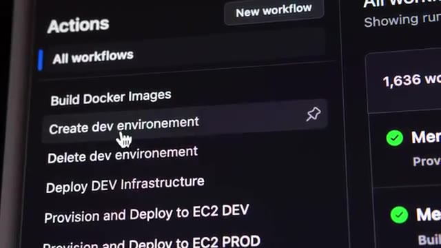
*📸 00:01:02 — Interface GitHub Actions montrant une liste de workflows de CI/CD pour la création, la suppression et le déploiement d'environnements de dev et de prod sur AWS EC2.*

---

### ⏱️ `[00:01:13 - 00:01:35]` | Segment #04

**🔊 Audio (Transcription Intégrale Mot pour Mot en Français) :**
> Et donc comme ça, chaque développeur a son ou ses environnements en fonction des différentes fonctionnalités qu'il est en train de développer, et on n'a plus de goulot d'étranglement ou il y a un environnement qui bloque un autre ou quelque chose comme ça. Ça fait qu'on peut aller beaucoup beaucoup plus vite parce qu'on peut tester directement une modification et directement la mettre en preuve après, une fois qu'elle a été bien testée. Potentiellement, on pourrait passer de 2-3 semaines pour mettre un changement en production à peut-être 20-30 minutes.

**👁️ Analyse Visuelle d'Écran (gemini-3.5-flash-lite) :**
**Interface & Outils** : Console web de gestion d'environnements (possiblement Argo CD ou une plateforme similaire de Preview Environments / Ephemeral Environments Kubernetes).

**Contenu textuel & Code** : Liste de projets et d'applications configurés sous le projet "default" :
- `lilienv2-faceswap-comfyui`
- `onboarding`
- `qdrant-scroll-without-count`
- `split-thumbnail-creator`
- `upgrade-user-without-customer-id`

**Action / Démonstration** : Présentation et illustration de la mise en place d'environnements de test dédiés (preview environments) par fonctionnalité/branche git, permettant aux développeurs de tester de manière isolée et parallèle sans bloquer les autres.

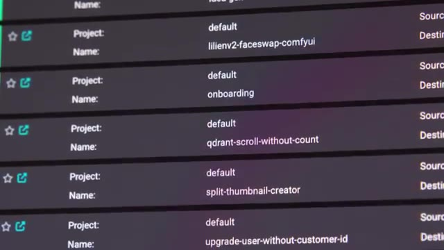
*📸 00:01:18 — Interface d'un outil de déploiement continu ou de gestion d'environnements éphémères affichant plusieurs instances d'applications isolées par fonctionnalité (ex: split-thumbnail-creator, onboarding, qdrant-scroll-without-count).*

---

### ⏱️ `[00:01:35 - 00:01:56]` | Segment #05

**🔊 Audio (Transcription Intégrale Mot pour Mot en Français) :**
> Donc du point de vue de son business, ce serait quelque chose qui aurait quand même énormément de valeur. Et les techniques que j'avais en tête pour pouvoir mettre en place ce projet, ça va être Kubernetes. Même si c'est une petite entreprise, un petit SaaS, ça parait un peu overkill. Comme on n'a pas besoin de haute disponibilité ou de choses comme ça, on peut simplement avoir Kubernetes sur un seul nœud. C'est des environnements de développement. Et comme il est sur AWS, l'avantage, c'est qu'on ne va pas avoir à payer une machine séparée pour chacun des environnements qu'on va avoir besoin.

**👁️ Analyse Visuelle d'Écran (gemini-3.5-flash-lite) :**
**Interface & Outils** : Aucune interface technique pertinente affichée (uniquement un écran de contrôle de périphériques/éclairage flou en arrière-plan).

**Contenu textuel & Code** : Aucun code, commande ou diagramme d'architecture visible.

**Action / Démonstration** : Présentation orale et conceptuelle sur le choix technologique de Kubernetes et la gestion de la haute disponibilité pour un petit SaaS.

---

### ⏱️ `[00:01:56 - 00:02:16]` | Segment #06

**🔊 Audio (Transcription Intégrale Mot pour Mot en Français) :**
> on pourra avoir plein d'environnement, mais dans une seule machine, et donc on ne paye qu'une seule fois. C'est probablement un petit peu overkill, on aurait pu aller simplement avec Docker Swarm ou même Docker Compose, mais comme son application est déjà conteneurisée, autant passer directement sur Kubernetes, comme ça, ça le future-proof un petit peu. Et la deuxième techno que je voulais mettre en place, c'est utiliser du GitOps avec Argo CD.

**👁️ Analyse Visuelle d'Écran (gemini-3.5-flash-lite) :**
**Interface & Outils** : Docker Compose

**Contenu textuel & Code** : Logo et identité visuelle de l'outil d'orchestration Docker Compose.

**Action / Démonstration** : Présentation théorique des alternatives de conteneurisation et d'orchestration (Docker Compose, Swarm, Kubernetes) adaptées à un déploiement mono-machine multi-environnement.

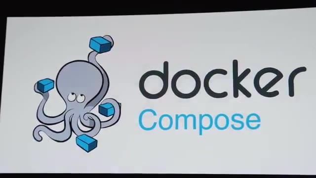
*📸 00:02:06 — Affichage du logo officiel de Docker Compose avec sa mascotte (la pieuvre manipulant des conteneurs).*

---

### ⏱️ `[00:02:16 - 00:02:38]` | Segment #07

**🔊 Audio (Transcription Intégrale Mot pour Mot en Français) :**
> Et donc on aurait d'un côté GitHub Action, que je n'avais pas trop trop utilisé, qui allait s'occuper du côté CI pour Continuous Integration, donc faire tous les tests sur le code et construire les images Docker qu'on va ensuite déployer. Et ensuite pour la partie CD ou Continuous Deployment, on va utiliser Argo. Et Argo va aller continuellement regarder sur le repo s'il y a des changements qui ont été faits et directement les déployer dans notre mini cluster Kubernetes.

**👁️ Analyse Visuelle d'Écran (gemini-3.5-flash-lite) :**
**Interface & Outils** : GitHub Actions, ArgoCD (console web GitOps)

**Contenu textuel & Code** : Pipeline YAML de CI (`matrix-build-deploy.yml` avec étapes Build, Test, Publish) et métadonnées de déploiement CD (statut Auto Sync activé, auteur du commit, détails du merge Git #563).

**Action / Démonstration** : Explication de la répartition de l'architecture CI/CD avec l'utilisation combinée de GitHub Actions pour la construction/tests de code et d'ArgoCD pour le déploiement continu automatisé.

*📸 00:02:21 — Visualisation d'un workflow GitHub Actions nommé `matrix-build-deploy.yml` exécutant des étapes de build et de test de matrice multiplateforme (Linux, macOS, Windows) déclenchées par un push.*

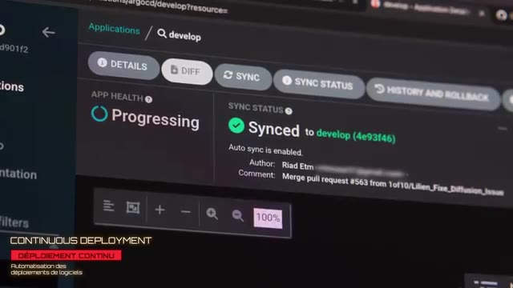
*📸 00:02:32 — Console web ArgoCD affichant l'état de synchronisation ("Synced") et de santé de l'application ("Progressing") sur la branche "develop" suite à un merge de pull request.*

---

### ⏱️ `[00:02:38 - 00:02:59]` | Segment #08

**🔊 Audio (Transcription Intégrale Mot pour Mot en Français) :**
> Donc on va avoir un pipeline dans GitHub Action qui va être un petit peu plus simple. Et pour le deployment, on va avoir Argo qui va avoir une petite interface qui va être simple à utiliser pour tous les développeurs. Et on n'a pas besoin de gérer tous nos différents environnements dans notre GitHub Action, ce qui peut être un petit peu compliqué quand on commence à avoir plusieurs environnements. Et du côté du CD, on va avoir Argo CD qui va nous donner une belle petite interface que les développeurs vont pouvoir utiliser.

**👁️ Analyse Visuelle d'Écran (gemini-3.5-flash-lite) :**
**Interface & Outils** : Aucune (uniquement des plans de présentation face-caméra).

**Contenu textuel & Code** : Aucun (les écrans en arrière-plan sont flous et non exploitables techniquement).

**Action / Démonstration** : Explication théorique de l'utilisation conjointe de GitHub Actions pour l'intégration continue (CI) et d'Argo CD pour simplifier le déploiement continu (CD) multi-environnement.

---

### ⏱️ `[00:02:59 - 00:03:18]` | Segment #09

**🔊 Audio (Transcription Intégrale Mot pour Mot en Français) :**
> Et donc comme ça, il n'a pas besoin forcément d'avoir à apprendre ou comprendre Kubernetes ou Argo ou quoi que ce soit. Ils ont juste à venir dans l'interface et à cliquer pour démarrer leurs environnements. Donc j'accepte et je me mets sur le projet. Et la première étape qu'on doit faire, c'est mettre en place la bulle des images dans GitHub Action. Donc ces applications, elles sont déjà containerisées. Ils utilisent des conteneurs en local.

**👁️ Analyse Visuelle d'Écran (gemini-3.5-flash-lite) :**
**Interface & Outils** : GitHub Actions (interface web de CI/CD).

**Contenu textuel & Code** : Workflows de CI/CD ("Build Docker Images", "Create dev environnement", "Delete dev environnement", "Deploy DEV Infrastructure", "Provision and Deploy to EC2 DEV") et statut d'exécution d'un job de compilation/construction ("build").

**Action / Démonstration** : Explication et mise en place de la première étape d'automatisation consistant à builder les images de conteneurs de manière automatisée via les workflows GitHub Actions.

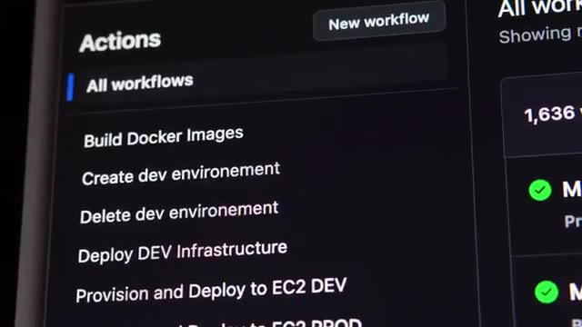
*📸 00:03:04 — Interface GitHub Actions listant les différents workflows disponibles pour le projet, notamment la création d'environnements de développement, le déploiement d'infrastructure DEV et le build d'images Docker.*

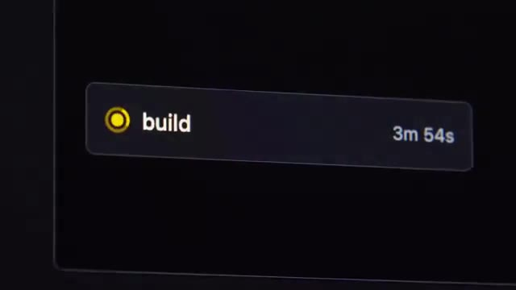
*📸 00:03:14 — Visualisation d'une étape de build ("build") en cours d'exécution au sein d'un pipeline de CI/CD (GitHub Actions), affichant un temps d'exécution de 3 minutes et 54 secondes.*

---

### ⏱️ `[00:03:18 - 00:03:37]` | Segment #10

**🔊 Audio (Transcription Intégrale Mot pour Mot en Français) :**
> et je voulais aussi utiliser une des nouvelles fonctionnalités qu'il y a dans GitHub maintenant qui est le fait d'avoir un registri privé. Donc c'est un endroit où on peut pousser nos images Docker et on peut les récupérer après sur nos serveurs quand on en a besoin. Et donc comme ça, on n'est pas obligé d'utiliser un service externe comme peut-être Docker Hub ou quelque chose comme ça. Donc pour ça, je commence à fouiller un petit peu dans GitHub Action.

**👁️ Analyse Visuelle d'Écran (gemini-3.5-flash-lite) :**
**Interface & Outils** : Navigateur web affichant la documentation GitHub Packages.

**Contenu textuel & Code** : Documentation sur le "Container registry" de GitHub, mentionnant le stockage et la gestion d'images Docker et OCI.

**Action / Démonstration** : Présentation ou référence visuelle à la documentation officielle de GitHub expliquant l'utilisation de leur registre de conteneurs privé.

*📸 00:03:28 — Gros plan sur un écran d'ordinateur affichant la documentation officielle de GitHub concernant son registre de packages. Le titre visible est "Working with the Container registry", et le texte mentionne la possibilité de stocker et gérer des images Docker et OCI.*

---

### ⏱️ `[00:03:37 - 00:03:56]` | Segment #11

**🔊 Audio (Transcription Intégrale Mot pour Mot en Français) :**
> J'ai presque aucune expérience. Donc je commence à regarder un petit peu dans les templates, les actions qu'ils ont par défaut parce que je me dis que builder des containers Docker, c'est quelque chose qui est assez commun. Et rapidement, je tombe sur des templates pour pouvoir faire ça. Donc c'est assez simple. Même si je suis toujours un peu plus fan de GitLab CI, le fait que je puisse copier-coller des templates déjà faits dans GitHub Action, c'est quand même un plus.

**👁️ Analyse Visuelle d'Écran (gemini-3.5-flash-lite) :**
**Interface & Outils** : GitHub (visualiseur de code web)

**Contenu textuel & Code** : Fichier YAML de configuration CI/CD de GitHub Actions (`.github/workflows/create-dev-env.yml`) contenant :
- Déclaration des variables de sortie (`branch_full`, `slug`)
- Étape de récupération du code (`Checkout code` via `actions/checkout@v3`) avec paramètres d'entrée (`ref: ${{ github.event.inputs.branch_name }}`)
- Étape d'initialisation des variables de branche (`Set branch and slug`)

**Action / Démonstration** : Analyse et compréhension de la syntaxe d'un template d'automatisation GitHub Actions existant pour la création d'un environnement de développement et le build d'images Docker.

*📸 00:03:47 — Capture d'écran de l'interface GitHub affichant le code source d'un workflow YAML (`create-dev-env.yml`) pour GitHub Actions, montrant l'utilisation de `actions/checkout@v3` et la gestion des variables d'environnement.*

---

### ⏱️ `[00:03:57 - 00:04:17]` | Segment #12

**🔊 Audio (Transcription Intégrale Mot pour Mot en Français) :**
> Donc ça, c'est assez rapide, ça fonctionne direct, donc je suis content. Et je continue avec l'étape suivante qui va être de mettre en place Kubernetes et Argo CD. Kubernetes, j'utilise K3S qui est ma distribution légère favorite, qui est très très simple à installer, c'est vraiment juste une seule ligne de commande. Et pour Argo CD, je ne l'avais jamais installé non plus, mais c'est aussi juste une ligne de commande. Parce que l'avantage, c'est que Argo CD se déploie dans Kubernetes.

**👁️ Analyse Visuelle d'Écran (gemini-3.5-flash-lite) :**
**Interface & Outils** : Éditeur de code (potentiellement VS Code) ou terminal Linux affiché sur moniteurs multiples et un ordinateur portable.

**Contenu textuel & Code** : Code source ou fichiers de configuration (potentiellement YAML pour Kubernetes/K3S), et/ou commandes shell d'installation/gestion système. Le logo K3S est présent en surimpression dans l'image 2.

**Action / Démonstration** : Configuration et installation de K3S (distribution légère de Kubernetes), impliquant la manipulation de lignes de commande et de fichiers de configuration.

*📸 00:04:02 — Vue aérienne d'un utilisateur travaillant sur deux moniteurs et un ordinateur portable affichant du code source ou des sorties de terminal, dans un environnement de développement ou de configuration système.*

*📸 00:04:07 — Vue aérienne similaire à l'image 1, montrant l'utilisateur devant ses écrans techniques, avec le logo K3S superposé en haut à gauche, contextualisant visuellement la distribution Kubernetes mentionnée.*

---

### ⏱️ `[00:04:17 - 00:04:38]` | Segment #13

**🔊 Audio (Transcription Intégrale Mot pour Mot en Français) :**
> Donc pareil, c'est juste une seule ligne de commande et ça se lance directement. J'ai juste un petit problème avec Argo, c'est qu'il tout a l'air de s'être lancé, mais je n'arrive pas à accéder à l'UI. J'ai une espèce d'erreur SSL. Donc, premier réflexe, c'est que je commence à prendre les erreurs, les mettre dans ChatGPT ou dans Cloud pour pouvoir savoir d'où est-ce que ça vient, parce que ça n'a pas l'air d'être un truc trop trop compliqué.

**👁️ Analyse Visuelle d'Écran (gemini-3.5-flash-lite) :**
**Interface & Outils** : Interface de chatbot IA (potentiellement ChatGPT ou Claude).

**Contenu textuel & Code** : Question concernant un problème de boucle de redirection TLS infinie entre ArgoCD et un load balancer AWS, et des options pour la configuration TLS ou la désactivation de TLS dans ArgoCD.

**Action / Démonstration** : Recherche et débogage d'une erreur SSL/TLS liée à l'accès à l'interface utilisateur d'ArgoCD, en utilisant une intelligence artificielle pour obtenir des pistes de résolution.

*📸 00:04:33 — Capture d'écran d'une interface de chatbot IA (type ChatGPT ou Claude), affichant une question technique sur une boucle de redirection TLS infinie avec ArgoCD et un load balancer AWS, ainsi que les options de résolution, notamment la désactivation du TLS dans ArgoCD.*

---

### ⏱️ `[00:04:38 - 00:04:57]` | Segment #14

**🔊 Audio (Transcription Intégrale Mot pour Mot en Français) :**
> Et donc, je commence à passer un petit peu de temps à essayer de débugger pourquoi est-ce que je n'arrive pas à accéder à l'UI. Et final, après avoir perdu un petit peu de temps, Je vais simplement lire la doc d'Argo CD, ce que j'aurais dû faire dès le départ. Et c'est expliqué dès le départ que Argo CD, il utilise son propre certificat SSL. Et donc, il faut rajouter un petit argument pour pouvoir le désactiver. Parce que moi, dans mon cas, c'est mon load balancer qui va gérer le HTTPS.

**👁️ Analyse Visuelle d'Écran (gemini-3.5-flash-lite) :**
**Interface & Outils** : Documentation technique en ligne (probablement via un navigateur web).

**Contenu textuel & Code** : Documentation expliquant que les endpoints d'Argo CD utilisent par défaut des certificats TLS auto-signés et la procédure pour configurer des certificats personnalisés ou via un gestionnaire comme cert-manager.

**Action / Démonstration** : Lecture de la documentation officielle d'Argo CD pour comprendre la gestion des certificats SSL/TLS et débloquer l'accès à l'interface utilisateur (UI) après un problème de connexion.

*📸 00:04:52 — Gros plan sur un écran d'ordinateur affichant une section de la documentation technique d'Argo CD, mettant en évidence le texte sur l'utilisation par défaut de certificats SSL auto-signés ("automatically generated, self-signed certificate") et les options de configuration TLS pour `argocd-server`.*

---

### ⏱️ `[00:04:57 - 00:05:26]` | Segment #15

**🔊 Audio (Transcription Intégrale Mot pour Mot en Français) :**
> Donc, j'ai pas besoin de le gérer directement dans Argo CD. Vous allez voir que c'est un petit peu un thème dans cette histoire. Parce que c'est la première fois où je me dis, bon, d'un côté, les LLM, c'est bien. Ça fait aller plus vite, etc. D'un autre côté, parfois, ça peut juste faire perdre du temps. parce qu'on perd les vraies bonnes habitudes qui sont simplement commencer par lire la doc de ce qu'on veut utiliser. Le souci avec les IS, c'est que soit t'es dans un IDE genre curseur, donc c'est pas idéal si t'as besoin de faire des commandes dans ton terminal pour débuguer, soit c'est une application dans un terminal comme dans Cloud Code, mais tu peux pas trop modifier ce que ça te propose, c'est un peu juste t'acceptes ou pas.

**👁️ Analyse Visuelle d'Écran (gemini-3.5-flash-lite) :**
**Interface & Outils** : Écran d'ordinateur (potentiellement un terminal Linux ou un éditeur de code).

**Contenu textuel & Code** : Lignes de texte s'apparentant à du code ou des commandes dans un environnement de développement ou d'administration système (détails illisibles en raison du flou).

**Action / Démonstration** : Le créateur explique un concept DevOps lié à la gestion des applications ("pas besoin de le gérer directement dans Argo CD") et l'impact des LLM sur les "bonnes habitudes", l'arrière-plan technique servant d'environnement de travail contextuel.

*📸 00:05:19 — Le créateur est en gros plan face-caméra, tandis qu'un écran en arrière-plan (flou) affiche ce qui ressemble à des lignes de code ou des commandes dans une interface de terminal ou d'éditeur de texte sur fond sombre.*

---

### ⏱️ `[00:05:26 - 00:05:45]` | Segment #16

**🔊 Audio (Transcription Intégrale Mot pour Mot en Français) :**
> Est-ce que l'idéal, ce serait pas un petit peu un mix entre les deux et c'est exactement ce qu'on propose, Warp ? Ils appellent ça un ADE pour Agent Tick Development Environment. Est-ce que tu peux utiliser plusieurs agents en même temps pour pouvoir coder ou débuguer ? Warp est top 5 sur SWBench et sur TerminalBench où l'agent doit interagir avec un terminal, il est numéro 1 devant Cloud Code, Gemini et codex de OpenArea. Et surtout, tu n'es pas bloqué avec un seul modèle.

**👁️ Analyse Visuelle d'Écran (gemini-3.5-flash-lite) :**
**Interface & Outils** : SWE-bench web interface, Tableau de bord de performance d'agents (type TerminalBench).

**Contenu textuel & Code** : Classement d'agents d'IA sur des benchmarks de résolution de problèmes de génie logiciel (SWE-bench) et de performance en environnement de terminal (TerminalBench-like). Métriques clés : "% Resolved", pourcentages de réussite.

**Action / Démonstration** : Analyse visuelle des performances comparatives de l'agent Warp face à d'autres solutions d'IA sur des plateformes de benchmark techniques, illustrant sa position de leader ou de top performeur.

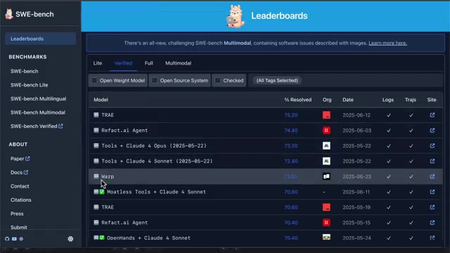
*📸 00:05:35 — Interface web du benchmark SWE-bench affichant un classement ("Leaderboards") d'agents d'IA, avec des métriques de "% Resolved" pour diverses implémentations, dont "Warp".*

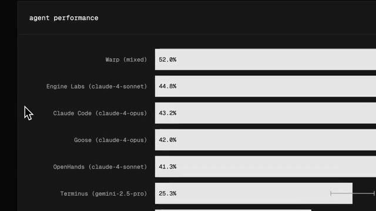
*📸 00:05:40 — Tableau de bord graphique illustrant les performances comparatives d'agents ("agent performance"), avec "Warp (mixed)" en tête, suivi d'autres agents basés sur des modèles Claude ou Gemini, affichant des pourcentages de réussite.*

---

### ⏱️ `[00:05:45 - 00:06:07]` | Segment #17

**🔊 Audio (Transcription Intégrale Mot pour Mot en Français) :**
> Tu peux utiliser le meilleur du moment. Par exemple, tu peux utiliser O3 pour la planification et puis Cloud pour un parti code. Dans mon cas, j'avais un bug casse-tête avec des migrations SQL et impossible de corriger même avec d'autres rires. Et avec Warp, il a lancé les migrations, il a lu les erreurs, enchaîné les commandes et requêtes SQL dans le terminal pour pouvoir débugger parce qu'il a tout le contexte de mon application et des outils en ligne de commande, et pas juste le code.

**👁️ Analyse Visuelle d'Écran (gemini-3.5-flash-lite) :**
**Interface & Outils** : Image 1: Interface utilisateur graphique de configuration d'un agent IA. Image 3: Terminal intégré (probablement VS Code) exécutant des commandes shell et SQL.

**Contenu textuel & Code** : Image 1: Options de modèles d'IA (o3 sélectionné pour la planification), gestion des permissions d'agent. Image 3: Commandes Flask-Migrate (`flask db upgrade`, `flask db stamp`, `flask db revision`), requêtes SQL Lite (`PRAGMA foreign_key_list`, `schema`), messages d'erreur de migration SQL relatifs aux contraintes de clés étrangères et tables manquantes.

**Action / Démonstration** : Image 1: Paramétrage d'un agent IA pour définir ses capacités et son comportement, notamment le choix du modèle de planification. Image 3: Débuggage interactif et correction d'un bug de migration SQL via une série de commandes d'inspection de base de données, d'analyse d'erreurs et d'application de correctifs.

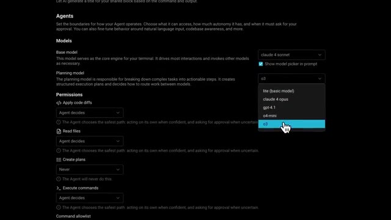
*📸 00:05:51 — Interface de configuration sombre pour un agent IA, affichant les options de sélection de modèles (ex: Claude 4, GPT 4.1, o3) et de permissions pour l'agent (application de diffs de code, lecture de fichiers, création de plans, exécution de commandes).*

*📸 00:06:01 — Capture d'écran d'un terminal (ressemblant à VS Code) affichant une séquence de commandes `flask db upgrade`, des requêtes `sqlite3` pour inspecter les schémas de base de données et les clés étrangères, des erreurs de migration SQL (problèmes de clés étrangères vers des tables inexistantes), et des commandes correctives comme `flask db stamp` et `flask db revision`.*

---

### ⏱️ `[00:06:07 - 00:06:40]` | Segment #18

**🔊 Audio (Transcription Intégrale Mot pour Mot en Français) :**
> Et bien, il a réglé le problème que j'avais depuis des mois en moins d'une minute. Perso, moi, j'avais commencé à l'utiliser avant même qu'ils sponsoraient cette vidéo. Donc, je te conseille de l'essayer. Ils ont une version gratuite. Et avec le code COCA, tu as le premier mois de la version pro à juste 1 euro. Je te mets le lien dans la description. Ensuite, j'ai mon Kubernetes qui marche. J'ai mon Argo CD qui marche. Donc, maintenant que ça, ça fonctionne, il faut que je convertisse le fichier Docker Compose qui est déjà dans le repo de l'application que les développeurs, ils utilisent pour pouvoir développer en local 50 lignes, je vais le mettre dans ChatGPT et boum je vais avoir ma conversion en manifeste qui marche

**👁️ Analyse Visuelle d'Écran (gemini-3.5-flash-lite) :**
**Interface & Outils** : Interface utilisateur graphique (GUI) d'un logiciel ou service web, probablement un tableau de bord de gestion ou de monitoring.

**Contenu textuel & Code** : Disposition matricielle de tuiles ou de widgets colorés, suggérant des fonctionnalités modulaires ou des indicateurs divers. Le texte et les icônes spécifiques sont illisibles.

**Action / Démonstration** : Présentation visuelle implicite d'un outil ou service technique vanté par le créateur, dont l'interface est affichée en arrière-plan comme support visuel à son discours promotionnel et de recommandation.

*📸 00:06:23 — Le créateur s'exprimant face-caméra. Derrière lui, un écran affiche une interface graphique de type tableau de bord ou console de gestion avec une multitude de tuiles ou modules colorés agencés en grille sur fond sombre.*

*📸 00:06:31 — Le créateur s'exprimant face-caméra. Derrière lui, un écran affiche une interface graphique de type tableau de bord ou console de gestion, identique ou très similaire à l'image précédente, avec des tuiles ou modules colorés en grille.*

---

### ⏱️ `[00:06:40 - 00:07:13]` | Segment #19

**🔊 Audio (Transcription Intégrale Mot pour Mot en Français) :**
> dans Kubernetes Direct. Et effectivement j'ai direct mon nouveau manifeste qui contient exactement tous les différentes services, applications, bases de données, tout ça dans un beau fichier. Et donc je me dis bah nickel je viens de gagner une heure ou deux. Je mets ça dans mon repo, j'ajoute mon repo dans ArcoCD pour lui dire de déployer ce manifeste et ça a l'air de marcher nickel. Ça me crée tout ce ce qu'il y a besoin, les bases de données, les volumes, les déploiements, les pods etc. Je me dis ça y est je suis un crack. Maintenant grâce à l'IA je peux être un DevOps dix fois plus efficace. Sauf qu'il y a deux pods dans l'infrastructure qui ne démarrent juste pas. Et c'est les

**👁️ Analyse Visuelle d'Écran (gemini-3.5-flash-lite) :**
**Interface & Outils** : 

**Contenu textuel & Code** : 

**Action / Démonstration** : 

---

### ⏱️ `[00:07:13 - 00:07:48]` | Segment #20

**🔊 Audio (Transcription Intégrale Mot pour Mot en Français) :**
> deux images de cœur qui sont construites dans GitLab. Donc je fouille un petit peu, j'ai débug, j'essaie de demander un peu de l'aide à l'IA, essayer de voir qu'est ce qui se passe. Et de ce que je comprends, le cluster communities il n'arrive pas à récupérer les images depuis le registre github donc à la base j'avais créé un token d'autorisation dans github qui donne accès aux clusters et je l'avais mis en place dans le cluster mais je sais pas il y a quelque chose qui fonctionne pas il arrive quand même pas à récupérer les images donc c'est de fouiller fouiller débuguer débuguer et quand c'est comme ça je sais que ça sert à rien de s'acharner il faut juste partir et faire autre chose un petit peu ou revenir le lendemain et généralement la

**👁️ Analyse Visuelle d'Écran (gemini-3.5-flash-lite) :**
**Interface & Outils** : Écran d'ordinateur, potentiellement un IDE, une console GitLab, ou une interface cloud. Ordinateur portable.

**Contenu textuel & Code** : Interface graphique avec du texte, des menus et des panneaux, dont le détail exact est illisible mais dont la nature est technique (potentiellement code, logs, ou configuration de pipeline/Kubernetes).

**Action / Démonstration** : Débuggage ou configuration active sur un système informatique, en lien avec les problèmes de récupération d'images Docker depuis le registre GitLab vers le cluster Kubernetes mentionnés dans le contexte.

*📸 00:07:22 — Vue d'ensemble d'un expert DevOps travaillant sur son poste de travail, avec l'écran principal affichant une interface d'application web ou d'IDE, et un ordinateur portable ouvert sur le côté. L'écran principal contient des éléments de code, de configuration ou de logs, suggérant une session de débogage ou de développement.*

---

### ⏱️ `[00:07:48 - 00:08:09]` | Segment #21

**🔊 Audio (Transcription Intégrale Mot pour Mot en Français) :**
> solution un petit peu plus évident et donc je veux me coucher effectivement le lendemain quand quand je commence à regarder ce problème avec un esprit un peu plus frais, je me rends compte que tout simplement, le manifeste que l'IA m'a pondu, il était presque parfait, mais il était configuré pour que les images ne soient jamais récupérées du repo. Je ne sais pas quelle raison, je ne sais pas qu'est-ce qui a poussé à écrire ça.

**👁️ Analyse Visuelle d'Écran (gemini-3.5-flash-lite) :**
**Interface & Outils** : AUCUN

**Contenu textuel & Code** : AUCUN

**Action / Démonstration** : AUCUN

---

### ⏱️ `[00:08:09 - 00:08:29]` | Segment #22

**🔊 Audio (Transcription Intégrale Mot pour Mot en Français) :**
> Donc moi, j'étais persuadé que c'était un problème d'autorisation, que mon cluster n'arrivait pas à récupérer les images, mais c'est juste que le manifeste lui disait de jamais récupérer les images de l'extérieur. Ce qui ne fait aucun sens, évidemment. Donc encore une fois, j'ai gagné une heure grâce à l'IA, mais j'ai perdu une heure à cause de l'IA. Donc, maintenant, je commence à me méfier un petit peu plus. Mais j'ai un petit problème avec les bases de données.

**👁️ Analyse Visuelle d'Écran (gemini-3.5-flash-lite) :**
**Interface & Outils** : Aucune interface technique pertinente de type DevOps/SysAdmin n'est visible.

**Contenu textuel & Code** : Aucun contenu technique (code, commandes, architectures, métriques) n'est affiché.

**Action / Démonstration** : Aucune manipulation, configuration, test ou explication technique n'est visible à l'écran.

---

### ⏱️ `[00:08:29 - 00:08:51]` | Segment #23

**🔊 Audio (Transcription Intégrale Mot pour Mot en Français) :**
> C'est que les bases de données, je peux en démarrer une facilement en utilisant un conteneur MySQL. Mais ce que je voudrais, c'est lancer dessus toutes les migrations. Donc, c'est-à-dire qu'il y a une liste de fichiers SQL à exécuter sur les bases de données au lancement pour pouvoir créer toutes les tables. Je peux peut-être ajouter des données de démo, de tests, etc. Pour faire ça, j'utilise Customize, qui est un outil qui permet justement de customiser un petit peu nos manifestes Kubernetes.

**👁️ Analyse Visuelle d'Écran (gemini-3.5-flash-lite) :**
**Interface & Outils** : Aucune interface technique (terminal Linux, console Docker/Kubernetes, interface cloud, etc.) n'est visible dans les captures d'écran fournies.

**Contenu textuel & Code** : Aucun code source, commande, architecture ou métrique technique n'est affiché visuellement dans les images.

**Action / Démonstration** : Aucune manipulation, configuration, test ou explication technique n'est démontrée à l'écran dans ces plans.

---

### ⏱️ `[00:08:52 - 00:09:11]` | Segment #24

**🔊 Audio (Transcription Intégrale Mot pour Mot en Français) :**
> Il y a une fonctionnalité qui est assez cool, qui permet de lui donner un dossier, et de prendre le contenu de tous ces fichiers qui sont dans le dossier, et de les convertir en ConfigMap, qui est un type de ressource dans Kubernetes. Ce qui fait qu'ensuite, je peux passer ces ConfigMap à mon conteneur, et donc remettre tous ces fichiers dans le conteneur de base de données, pour qu'ils puissent automatiquement exécuter tous ces fichiers au premier démarrage.

**👁️ Analyse Visuelle d'Écran (gemini-3.5-flash-lite) :**
**Interface & Outils** : Éditeur de texte ou IDE affichant un fichier de configuration YAML.

**Contenu textuel & Code** : Code YAML d'une ConfigMap Kubernetes (`apiVersion: v1`, `kind: ConfigMap`, `metadata.name: geoip-config`) et utilisation d'une fonction de templating pour incorporer des données binaires de fichiers (`.Files.Get`).

**Action / Démonstration** : Visualisation d'un exemple de ConfigMap Kubernetes, illustrant comment des fichiers (comme "GeoIP.dat") peuvent être encapsulés pour être ensuite mis à disposition de conteneurs.

*📸 00:09:01 — Manifeste YAML définissant une ressource Kubernetes de type ConfigMap nommée "geoip-config", incluant les champs `apiVersion: v1`, `kind: ConfigMap`, `metadata` et `binaryData`. Un overlay "CONFIGMAP RESSOURCE KUBERNETES" est présent.*

*📸 00:09:06 — Gros plan sur la définition YAML de la ConfigMap, se concentrant sur la section `binaryData` où le fichier "GeoIP.dat" est inclus dynamiquement via un template (`{{ .Files.Get "GeoIP.dat" }}`).*

---

### ⏱️ `[00:09:11 - 00:09:33]` | Segment #25

**🔊 Audio (Transcription Intégrale Mot pour Mot en Français) :**
> Donc ça, c'est nickel. Le deuxième petit problème, c'est que je veux que chaque environnement ait le même nom que sa branche dans GitHub. Je ne peux pas hardcoder un seul nom d'environnement, parce que sinon, j'aurais juste un environnement. Le but, c'est d'en avoir autant qu'on veut. Et en fait, avec Customize, tu peux pas vraiment faire ça. Ils sont vraiment contre le fait d'utiliser du templating, d'utiliser des variables. Donc dans mon manifeste, je peux jamais préciser quelle version de l'image je veux.

**👁️ Analyse Visuelle d'Écran (gemini-3.5-flash-lite) :**
**Interface & Outils** : AUCUN

**Contenu textuel & Code** : AUCUN

**Action / Démonstration** : AUCUNE manipulation, configuration, test ou explication technique n'est visible à l'écran, le créateur est en phase d'explication orale uniquement, sans support visuel technique pertinent.

---

### ⏱️ `[00:09:33 - 00:09:54]` | Segment #26

**🔊 Audio (Transcription Intégrale Mot pour Mot en Français) :**
> Je suis obligé de l'art-coder, que ça soit une seule image, pour toutes les branches différentes du repo. Donc ça me va pas. Et donc je vois qu'il y a un autre outil qui est similaire, qui s'appelle Helm, sur lequel j'avais pas trop d'expérience non plus, mais que justement, c'était l'occasion, qui lui permet de faire tout ce qu'on veut, de faire du templating, de mettre des variables, etc. Donc je repasse tout mon manifeste au format Customize vers le format Helm.

**👁️ Analyse Visuelle d'Écran (gemini-3.5-flash-lite) :**
**Interface & Outils** : Incrustation textuelle (lower-third) de type infographique.

**Contenu textuel & Code** : Identification de l'outil Helm, sa catégorie (DevOps), et sa fonction principale (gestion et déploiement de manifestes).

**Action / Démonstration** : Introduction et clarification visuelle du concept de Helm, un outil majeur pour l'automatisation du déploiement d'applications dans des environnements conteneurisés comme Kubernetes, en contraste avec une approche d'hard-codage.

*📸 00:09:44 — Le créateur de contenu s'exprime face caméra, accompagné d'une incrustation graphique en bas de l'écran identifiant clairement "HELM" comme un "OUTIL DEVOS" (DevOps) pour la "gestion et déploiement" de "manifestes".*

---

### ⏱️ `[00:09:55 - 00:10:14]` | Segment #27

**🔊 Audio (Transcription Intégrale Mot pour Mot en Français) :**
> Et là je peux ajouter mes variables. Et donc ça règle mon problème. Le nom d'image qui va être utilisé au démarrage de l'environnement, ça va être une variable qui correspond au nom de la branche. Et donc ça va être différent pour chacune des branches. C'est nickel sauf que dans Helm, on ne peut pas récupérer des fichiers qui sont en dehors du dossier où on a les manifestes pour Helm. Chose que je pouvais faire avec Customize.

**👁️ Analyse Visuelle d'Écran (gemini-3.5-flash-lite) :**
**Interface & Outils** : Aucune interface technique pertinente n'est visible dans les captures d'écran.

**Contenu textuel & Code** : Aucun contenu technique (commandes, code, architectures, métriques) n'est affiché.

**Action / Démonstration** : Aucune manipulation, configuration, test ou explication technique n'est visuellement illustrée par un support graphique dans les captures.

---

### ⏱️ `[00:10:14 - 00:10:36]` | Segment #28

**🔊 Audio (Transcription Intégrale Mot pour Mot en Français) :**
> Et donc là je suis dans une situation où j'ai besoin de Helm pour pouvoir utiliser des variables. mais j'ai besoin de Customize pour pouvoir aller récupérer des fichiers et pouvoir les injecter dans mes conteneurs. Donc là, je suis en train de me demander est-ce qu'il faut que je retourne dans Customize ? Je veux aussi qu'il y ait potentiellement une façon d'utiliser Customize mais avec des templates Helm. Mais ça a l'air d'un peu foireux. C'est l'autre, c'est important d'avoir des gens à qui se référer parce que ça, c'est pas quelque chose qui va être dans la doc.

**👁️ Analyse Visuelle d'Écran (gemini-3.5-flash-lite) :**
**Interface & Outils** : Aucune interface technique pertinente (terminal, console cloud, IDE) n'est affichée en tant que support principal du discours. L'arrière-plan présente une interface graphique de système d'exploitation ancien.

**Contenu textuel & Code** : Aucun contenu technique (code, commandes, architectures, métriques) lié au sujet DevOps sur Helm/Kustomize n'est visible.

**Action / Démonstration** : Aucune manipulation, configuration ou explication technique n'est réalisée visuellement sur des outils ou interfaces pertinentes pour le sujet abordé.

---

### ⏱️ `[00:10:36 - 00:10:58]` | Segment #29

**🔊 Audio (Transcription Intégrale Mot pour Mot en Français) :**
> C'est juste une bonne pratique que je connais pas parce que j'ai pas assez d'expérience. Et après coup, je pense que probablement la bonne pratique, ça aurait été de séparer mon repo qui contient mes manifestes, etc. Et ensuite ça aurait pointé vers le repo où il y a mon application. Et là probablement que ça aurait pu fonctionner avec Helm directement. Et même avec Customize parce que j'aurais pu avoir un fichier qui décrit tous les environnements que j'ai besoin.

**👁️ Analyse Visuelle d'Écran (gemini-3.5-flash-lite) :**
**Interface & Outils** : Aucun outil, terminal, logiciel ou console technique n'est affiché dans les captures fournies. Les arrière-plans des deux images montrent des éléments graphiques décoratifs ou de design (ex: "hello" stylisé, icônes) non pertinents pour une analyse DevOps/SysAdmin.

**Contenu textuel & Code** : Aucun code source, commande, architecture réseau ou métrique technique n'est visible. Les images sont des plans fixes du créateur parlant face caméra.

**Action / Démonstration** : Aucune manipulation, configuration, test ou explication technique n'est visuellement illustrée. Le contenu des images se limite à la présentation orale du créateur. Pour le discours sur la séparation des dépôts Git et l'utilisation de Helm, on aurait pu s'attendre à la visualisation d'une structure de dépôt, de fichiers Helm charts ou de commandes `git` et `helm`.

---

### ⏱️ `[00:10:58 - 00:11:24]` | Segment #30

**🔊 Audio (Transcription Intégrale Mot pour Mot en Français) :**
> Et probablement que ça aurait réglé mon problème. Mais sur le moment ce que je finis par faire c'est de rester sur Helm. Parce que j'aurais toujours besoin de mon histoire de variable. Et au lieu d'aller récupérer les fichiers, les mettre dans une config map et remettre la config map en fichier etc. Ce que je fais c'est que je crée deux nouveaux conteneurs pour les bases de données. Où les fichiers sont déjà hard codés dedans. C'est pas la solution ultime parce que ça rajoute une étape, mais c'est une étape qui prend juste 3 secondes dans le pipeline de CSID et ça règle mon problème, donc je pars avec cette solution.

**👁️ Analyse Visuelle d'Écran (gemini-3.5-flash-lite) :**
**Interface & Outils** : Interface graphique de pipeline CI/CD (Intégration Continue / Déploiement Continu).

**Contenu textuel & Code** : Liste d'étapes de pipeline : "Build and push Docker image", "Build and push Frontend container", "Build and push app-db container", "Build and push logs-db container", "Post Build and push logs-db container".

**Action / Démonstration** : Affichage des étapes automatisées de construction et de publication d'images Docker pour différents composants d'une application (frontend, bases de données d'application et de logs) dans un contexte de CI/CD.

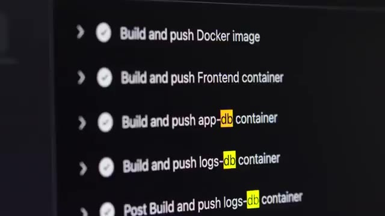
*📸 00:11:11 — Gros plan sur une interface de pipeline CI/CD affichant les étapes de build et de push de diverses images Docker (frontend, app-db, logs-db).*

---

### ⏱️ `[00:11:24 - 00:11:45]` | Segment #31

**🔊 Audio (Transcription Intégrale Mot pour Mot en Français) :**
> Donc là maintenant, j'ai mes deux pods qui sont bien téléchargés, j'ai mon front-end qui se lance, je peux accéder à mon application, c'est nickel. Mais le back-end, bien qu'il se lance, bien qu'il arrive à accéder aux bases de données, bien qu'il arrive à récupérer l'image du registre de Docker, bien qu'il démarre et que dans ses logs il y a l'air d'avoir aucun problème, il n'a quand même pas l'air de fonctionner.

**👁️ Analyse Visuelle d'Écran (gemini-3.5-flash-lite) :**
**Interface & Outils** : 

**Contenu textuel & Code** : 

**Action / Démonstration** : 

---

### ⏱️ `[00:11:45 - 00:12:14]` | Segment #32

**🔊 Audio (Transcription Intégrale Mot pour Mot en Français) :**
> N'importe quelle requête que je fais au backend, ça me donne la même erreur not found. Je commence à fouiller un petit peu, essayer de débugger, mais comme je vous ai dit, tout a l'air correct. Dans les logs tout est clean, le pod il est démarré, les collections aux bases de données sont correctes, les bases de données sont bien, etc. Et donc j'arrive pas à trouver de ça. Je fouille pendant un petit bout de temps et là pareil, l'instinct me dit que ce genre de problème là, C'est le genre de problème que soit je continue à fouiller pendant trois jours et que peut-être que je finis par trouver la solution.

**👁️ Analyse Visuelle d'Écran (gemini-3.5-flash-lite) :**
**Interface & Outils** : AUCUNE

**Contenu textuel & Code** : AUCUNE

**Action / Démonstration** : AUCUNE

---

### ⏱️ `[00:12:14 - 00:12:33]` | Segment #33

**🔊 Audio (Transcription Intégrale Mot pour Mot en Français) :**
> Soit je demande à un des développeurs et je suis quasi sûr qu'il va savoir instantanément quel est le problème. Et donc c'est ce que je fais. Je prends contact avec un des développeurs de l'application et on regarde ensemble d'où vient le problème. Et il m'explique directement que toutes les requêtes sont gérées par le front-end. Et c'est le front-end ensuite qui renvoie les requêtes vers le back-end. Et au moment où il fait ça, il change un petit peu l'URL.

**👁️ Analyse Visuelle d'Écran (gemini-3.5-flash-lite) :**
**Interface & Outils** : Diagramme d'architecture d'application (schéma explicatif).

**Contenu textuel & Code** : Composants d'architecture logicielle : utilisateur, FrontEnd, Backend, et deux bases de données. Flux de requêtes unidirectionnel (FrontEnd vers Backend vers Database), potentiellement pour expliquer un goulot d'étranglement ou une mauvaise gestion des requêtes.

**Action / Démonstration** : Explication visuelle de l'architecture applicative et du parcours des requêtes, illustrant la manière dont les requêtes sont gérées et le rôle du Front-end, en lien avec le problème évoqué dans le discours.

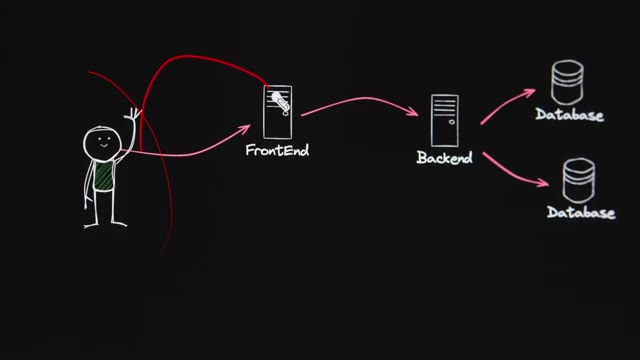
*📸 00:12:28 — Diagramme schématique d'architecture d'application montrant un utilisateur interagissant avec un FrontEnd, qui à son tour communique avec un Backend et deux instances de base de données. Des flèches rouges mettent en évidence le chemin de la requête.*

---

### ⏱️ `[00:12:33 - 00:12:53]` | Segment #34

**🔊 Audio (Transcription Intégrale Mot pour Mot en Français) :**
> Il y a un morceau de l'URL qui est enlevé avant d'être envoyé à l'API. Donc moi, comme je contactais l'API directement via Ingress, l'URL était incorrect. Donc ce problème se règle très rapidement. J'ai enlevé le Ingress qui allait taper vers le backend. Et donc toutes les requêtes de la application passent par le frontend et le frontend les envoie au backend quand il y a besoin. Et direct, tout se met à marcher.

**👁️ Analyse Visuelle d'Écran (gemini-3.5-flash-lite) :**
**Interface & Outils** : Aucune interface technique pertinente (terminal, console cloud, éditeur de code, etc.) n'est affichée. L'écran en arrière-plan présente un contenu graphique ou textuel sans rapport avec des outils techniques.

**Contenu textuel & Code** : Aucun contenu technique (commandes, code, architectures, métriques) n'est visible. Le texte "Font the Crazy Ones" et le numéro "14" sur l'écran en arrière-plan sont liés au design/typographie.

**Action / Démonstration** : Aucune manipulation, configuration, test ou explication technique n'est démontrée visuellement. Le créateur est en train de s'exprimer oralement.

---

### ⏱️ `[00:12:53 - 00:13:25]` | Segment #35

**🔊 Audio (Transcription Intégrale Mot pour Mot en Français) :**
> Ça c'est pareil, c'est un truc avec lequel j'avais beaucoup de mal dans le passé. C'est que je voulais toujours trouver par moi-même les problèmes. Je sais que parfois ça m'est arrivé de passer des deux jours, trois jours sur un problème. que je savais définitivement que le mec à côté de moi il avait la réponse directe. Donc même si ça m'a aidé à être bon en troubleshooting, du point de vue business d'une entreprise c'est pas mieux de passer trois jours alors que tu pourrais passer 18. Et c'est encore plus le cas dans une mission freelance parce que là c'est toi directement qui perds les dents, qui perds l'argent entre les guillemets. Donc ça c'est un des points sur lesquels je me suis un petit peu amélioré depuis.

**👁️ Analyse Visuelle d'Écran (gemini-3.5-flash-lite) :**
**Interface & Outils** : AUCUNE

**Contenu textuel & Code** : AUCUNE

**Action / Démonstration** : AUCUNE

---

### ⏱️ `[00:13:25 - 00:13:57]` | Segment #36

**🔊 Audio (Transcription Intégrale Mot pour Mot en Français) :**
> Et maintenant tout fonctionne. On a d'un côté GitHub qui va prendre l'application, qui va faire tous les tests qu'il y a besoin qui va ensuite construire des conteneurs des conteneurs pour les applications des conteneurs pour les bases de données avec toutes les tables déjà créées des données pour pouvoir commencer à tester l'application un conteneur pour le front-end un conteneur pour le back-end et qui va ensuite mettre toutes ces images sur le registri GitHub et ensuite de l'autre côté on a Arpo qui va aller continuellement surveiller le repo GitHub pour voir quand il y a des nouvelles modifications et dès qu'il y a un changement et bien il va créer ou modifier les

**👁️ Analyse Visuelle d'Écran (gemini-3.5-flash-lite) :**
**Interface & Outils** : Console de CI/CD (potentiellement GitHub Actions ou un terminal) affichant les logs d'une exécution Docker.

**Contenu textuel & Code** : Logs de build Dockerfile pour un conteneur "Frontend", utilisation des images de base `node:18-alpine` et `nginx:alpine`, références SHA256 des couches Docker.

**Action / Démonstration** : Construction (build) et publication (push) automatisées d'une image Docker pour le frontend de l'application, intégrant les étapes de création de conteneurs mentionnées dans le discours.

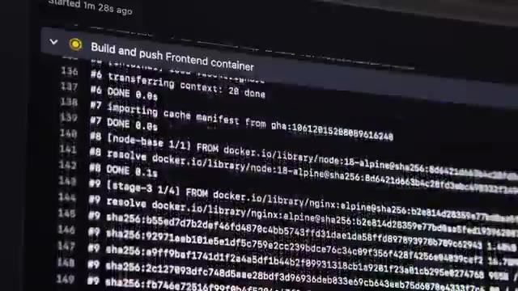
*📸 00:13:33 — Journal de console affichant les étapes détaillées de la construction et du push d'un conteneur Docker pour une application frontend, incluant l'importation de bases Node.js et Nginx Alpine.*

---

### ⏱️ `[00:13:57 - 00:14:28]` | Segment #37

**🔊 Audio (Transcription Intégrale Mot pour Mot en Français) :**
> environnements sur notre petit cluster Kubernetes et en plus on va automatiquement donner un nom de domaine qui correspond au nom de la branche comme ça on peut très facilement accéder à tous les environnements qu'on a besoin indépendamment les uns des autres. Donc on peut déployer autant environnement que ce qu'on a besoin. Et donc je fais une petite documentation encore une fois je fais appel à l'IA et ça va gérer à 4 heures en faisant de ce que j'ai besoin donc pour cette fois ci ça m'a vraiment fait bien du temps et donc maintenant mon client est passé d'un cycle de développement qui pouvait durer plusieurs semaines à maintenant sur une petite politique va faire, on peut la déployer directement en juste quelques minutes.

**👁️ Analyse Visuelle d'Écran (gemini-3.5-flash-lite) :**
**Interface & Outils** : Navigateur web, interface de gestion de code source (type GitHub ou GitLab), potentiellement un aperçu de workflow CI/CD.

**Contenu textuel & Code** : Détails d'un workflow de déploiement GitOps avec ArgoCD pour une application spécifique, mentionnant l'intégration de builds (frontend, bases de données) et l'installation de Kubernetes/ArgoCD.

**Action / Démonstration** : Documentation et suivi d'un processus de déploiement et de configuration d'environnements d'application sur Kubernetes via ArgoCD, en ligne avec la création d'environnements dédiés par branche.

*📸 00:14:12 — Capture d'écran d'une interface web, probablement GitHub ou une plateforme similaire, affichant un "Merge pull request" et un workflow lié à un déploiement ArgoCD pour une application "1of10". Un commentaire détaillé explique les étapes techniques : rédaction d'un README pour ArgoCD, ajout du build du frontend et de deux bases de données, installation d'un cluster Kubernetes mono-nœud et déploiement d'ArgoCD dessus.*

---

### ⏱️ `[00:14:28 - 00:14:39]` | Segment #38

**🔊 Audio (Transcription Intégrale Mot pour Mot en Français) :**
> Et donc dans le DevOps, il y a énormément d'outils et des nouveaux qui pop tout le temps et parfois c'est difficile de se garder à jour et de savoir quel outil sert à quoi. Mais en fait, il y a seulement 6 catégories d'outils à connaître et j'explique tout en détail dans cette vidéo.

**👁️ Analyse Visuelle d'Écran (gemini-3.5-flash-lite) :**
**Interface & Outils** : Aucune interface technique identifiable.

**Contenu textuel & Code** : Aucun contenu technique (code, commandes, architecture, métriques) visible.

**Action / Démonstration** : Aucune manipulation, configuration, test ou explication technique n'est montrée à l'écran par le biais d'outils ou d'interfaces.

---

