# 🎬 7 méthodes de crevard que j'utilise pour arrêter de payer des abonnements

> **Chaîne** : [cocadmin](https://www.youtube.com/@cocadmin)  
> **Lien YouTube** : [https://www.youtube.com/watch?v=QR_zSiRbdtI](https://www.youtube.com/watch?v=QR_zSiRbdtI)  
> **Date de publication** : 20250828  
> **Durée** : 00:14:26  
> **Identifiant vidéo** : `QR_zSiRbdtI`  
> **Transcription & Analyse** : `whisper-v3-large-turbo+gemini-3.5-flash-lite`  

---

## 📌 Synthèse Exécutive & Outils

### 💡 Résumé

La prolifération des abonnements SaaS (Software as a Service) engendre aujourd'hui une inflation invisible mais massive des coûts opérationnels pour les créateurs de contenu, formateurs et ingénieurs. Face à cette "fatigue de l'abonnement", l'approche présentée propose une stratégie de rationalisation financière agressive basée sur trois piliers : la négociation automatisée (exploitation des boucles de rétention lors des processus d'annulation), la consolidation applicative (suppression des doublons en exploitant pleinement les suites d'entreprise existantes comme Google Workspace), et la migration vers des modèles de tarification alternatifs (licences perpétuelles, alternatives *open source* ou clones à bas coût).

Sur le plan technique, l'optimisation va au-delà du simple choix de logiciels en introduisant des changements d'architectures profonds. Pour les besoins de conception 3D ou de montage vidéo, la transition s'effectue de solutions propriétaires sur abonnements (Adobe, Spline) vers des standards industriels haut de gamme gratuits ou à paiement unique (Unreal Engine, DaVinci Resolve), valorisant l'investissement en temps de montée en compétences face aux coûts récurrents. Côté intelligence artificielle, l'arbitrage financier s'organise autour d'un modèle hybride combinant un abonnement d'usage quotidien et l'exploitation des APIs de modèles concurrents payés au jeton (*pay-per-token*), éliminant ainsi les forfaits mensuels fixes redondants.

Enfin, pour les micro-services fonctionnels simples mais surévalués (comme le tracking d'URL), la démarche pousse à la réingénierie logicielle. En concevant son propre micro-service et en le déployant sur une architecture cloud serverless (telle qu'AWS Lambda), l'ingénieur DevOps bascule d'une tarification forfaitaire injustifiée vers un coût marginal à la requête, proche de zéro. Cette démarche globale redéfinit l'efficacité opérationnelle en alignant strictement la dépense financière sur la consommation réelle des ressources.

### 🛠️ Outils, Modèles & Logiciels Présentés

* **Zoom** : Solution de visioconférence professionnelle ($23 à $46/mois) optimisée temporairement par des techniques de rétention tarifaire, puis intégralement remplacée par des outils collaboratifs inclus dans l'infrastructure existante.
* **Google Workspace (Meet / Gemini Pro)** : Suite bureautique cloud globale dont les fonctionnalités natives (Google Meet pour la vidéo et Gemini Pro pour l'IA) sont exploitées pour éliminer les abonnements tiers redondants.
* **Loom** : Outil d'enregistrement vidéo de l'écran et de la webcam ($15/mois) remplacé par une alternative plus compétitive et performante.
* **Nito Record & Nito Cal** : Clones applicatifs agressifs ultra-économiques ($2.50/mois en facturation annuelle) conçus spécifiquement pour disrupter les monopoles de Loom et Calendly avec une parité de fonctionnalités.
* **Calendly** : Planificateur de rendez-vous historique dont le coût mensuel est éliminé au profit de la version gratuite hautement généreuse de Nito Cal.
* **Adobe Premiere Pro** : Logiciel de montage vidéo standard de l'industrie, jugé instable et onéreux, dont le coût est d'abord réduit via le tunnel d'annulation avant une migration définitive.
* **DaVinci Resolve** : Alternative d'édition vidéo et d'étalonnage haut de gamme, proposant une version gratuite extrêmement robuste et une version Studio sous forme de licence perpétuelle unique avec mises à jour à vie.
* **Spline** : Solution d'animation 3D web sur navigateur ($12/mois) abandonnée au profit d'un environnement de rendu local plus puissant et gratuit.
* **Unreal Engine** : Moteur 3D de premier plan pour le jeu vidéo et le cinéma, entièrement gratuit d'utilisation tant que le projet ne dépasse pas le million de dollars de chiffre d'affaires.
* **ChatGPT Plus** : Interface de modèle de langage d'OpenAI conservée comme outil principal d'interaction quotidienne en raison de la qualité de son UI.
* **Claude (Anthropic)** : Modèle d'IA de premier ordre pour le développement logiciel, rationalisé en fermant l'abonnement grand public au profit d'un accès direct via l'API.
* **Claude API** : Interface de programmation d'Anthropic permettant de consommer la puissance du modèle de code strictement à l'usage (facturation au token), réduisant les coûts pour les besoins sporadiques.
* **TinyURL** : Raccourcisseur de liens et traqueur de clics ($13/mois) à l'interface obsolète, ciblé pour être remplacé par un développement serverless sur mesure.
* **AWS Lambda** : Service de calcul serverless idéalement conçu pour héberger des micro-services personnalisés à la requête, permettant de tendre vers une facturation de quelques centimes par mois.

### 🔑 Points Clés & Enseignements Stratégiques

1. **Exploitation systématique du "Churn Bluff"** : Les éditeurs SaaS intègrent des mécanismes automatisés de réduction (souvent de 15% à 25%) dans leur parcours de résiliation pour retenir l'utilisateur. Déclencher ce tunnel sans finaliser l'annulation est un moyen immédiat d'abaisser son coût d'acquisition.
2. **Gestion de l'intermittence via la mise en pause** : Pour les activités saisonnières ou par cycles (comme les sessions de formation DevOps), privilégier la mise en pause des abonnements plutôt que le maintien d'une facturation passive hors des périodes d'utilisation active.
3. **Audit rigoureux des chevauchements de fonctionnalités** : L'accumulation d'outils spécifiques crée souvent des doublons coûteux. Une suite déjà payée (comme Google Workspace) intègre des outils (Meet) capables de remplacer nativement des abonnements dédiés (Zoom) sans perte d'efficacité.
4. **Adoption stratégique des clones "Fast Follower"** : Des suites d'outils émergentes fondent leur modèle économique sur la réplication exacte des leaders du marché à des tarifs de 5 à 10 fois inférieurs (ex. Nito face à Loom ou Calendly). Cette parité fonctionnelle à bas coût doit être privilégiée.
5. **Valorisation de l'engagement annuel calculé** : Pour les outils validés à long terme, le passage d'une facturation mensuelle à un engagement annuel permet de réaliser d'importantes économies d'échelle, parfois cumulables avec des tarifs de lancement d'alternatives disruptives.
6. **Rupture avec le modèle de la rente par la licence perpétuelle** : Privilégier des outils comme DaVinci Resolve qui proposent un modèle d'achat unique (*one-time payment*) avec mises à jour gratuites à vie, brisant ainsi la dépendance financière des abonnements mensuels imposés par des acteurs comme Adobe.
7. **Arbitrage "Temps de montée en compétences" vs "Coût de licence"** : Le passage à des outils industriels de pointe gratuits mais complexes (ex. Unreal Engine à la place de Spline) demande un investissement initial en temps d'apprentissage. Cet investissement est hautement rentable car il élimine à vie les coûts de licence tout en augmentant la qualité finale des livrables.
8. **FinOps IA par l'hybridation "UI vs API"** : Cumuler plusieurs abonnements d'IA grand public à $20/mois est une inefficacité financière majeure. La bonne pratique consiste à conserver un seul outil avec interface graphique (ex. ChatGPT) et à consommer les modèles concurrents (ex. Claude) via leur API payée au token réel d'utilisation.
9. **Consolidation IA via les fonctionnalités incluses** : L'intégration progressive de modèles de pointe (Gemini Pro) directement dans les abonnements cloud professionnels existants (Google Workspace) offre une opportunité de centralisation pour supprimer totalement les abonnements IA tiers à terme.
10. **Développement de micro-services Serverless personnalisés** : Pour des fonctionnalités basiques mais facturées de manière disproportionnée par les SaaS (comme le tracking d'URL), le développement d'un outil interne léger hébergé en serverless (AWS Lambda) permet de passer d'un forfait fixe à une facturation à la micro-requête, réduisant le coût à néant.
11. **Maîtrise des contraintes architecturales cloud (Cold Start)** : Lors de la transition d'un SaaS vers une architecture serverless maison, l'ingénieur doit impérativement anticiper des problématiques de production telles que le *cold start* (latence au premier appel d'une fonction Lambda dormante), afin de garantir une expérience utilisateur fluide sur les redirections de requêtes.

---

## ⏱️ Chronologie & Transcription Complète Audio & Visuelle (Mot pour Mot)

### ⏱️ `[00:00:00 - 00:00:20]` | Segment #01

**🔊 Audio (Transcription Intégrale Mot pour Mot en Français) :**
> Ça c'est le total de tout ce que j'ai dépensé en abonnement en 2024 pour ma chaîne. Et même si c'est des services que j'utilise et dont j'ai besoin, je trouve que c'est vraiment trop à dépenser tous les mois. Parce que maintenant tout est à un abonnement et même des outils très très simples peuvent te faire hacker tous les mois. Mais ça s'arrête maintenant parce que je vais utiliser toutes mes techniques de crevards pour pouvoir économiser un maximum de thunes. Et à commencer par Zoom qui est un outil que j'utilise pour donner ma formation en live sur le DevOps.

**👁️ Analyse Visuelle d'Écran (gemini-3.5-flash-lite) :**
**Interface & Outils** : Page web d'abonnement / tarification du service SaaS Adobe Creative Cloud.

**Contenu textuel & Code** : Tarification de l'offre "Creative Cloud Pro" à 69,99 $/mois (avec engagement annuel) incluant Premiere Pro et les fonctionnalités d'IA générative Firefly.

**Action / Démonstration** : Illustration et dénonciation du coût élevé des abonnements mensuels imposés par les éditeurs de logiciels pour la production de contenu.

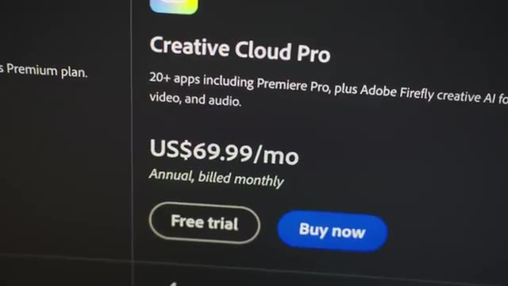
*📸 00:00:10 — Capture d'écran de l'interface web d'une page de tarification SaaS (Adobe Creative Cloud Pro) affichant un tarif de 69,99 USD par mois.*

---

### ⏱️ `[00:00:21 - 00:00:44]` | Segment #02

**🔊 Audio (Transcription Intégrale Mot pour Mot en Français) :**
> Et Zoom c'est 23 dollars par mois. Sauf que moi j'ai besoin de deux utilisateurs parce que j'ai un assistant qui m'aide dans la formation. et donc ça me revient tous les mois à 46 dollars. Donc ça fait 550 balles par mois juste pour pouvoir faire des appels à vidéo. Et ça, cette astuce, elle marche dans plein plein plein d'outils, plein de services, plein de SaaS. On va tout simplement commencer à faire une annulation. Et comme par magie, la plupart du temps, on va se faire proposer une petite promotion pile à ce moment-là pour pas qu'on annule.

**👁️ Analyse Visuelle d'Écran (gemini-3.5-flash-lite) :**
**Interface & Outils** : Console de gestion de compte SaaS Zoom (Billing / Subscription Management).

**Contenu textuel & Code** : Boîte de dialogue détaillant les restrictions suite à un déclassement de compte (limite de réunion de 40 minutes, perte d'accès à l'assistant IA, suppression de 10 Go d'espace de stockage cloud).

**Action / Démonstration** : Tentative de résiliation ou d'annulation d'un abonnement payant Zoom Workplace Pro pour réduire les coûts de fonctionnement.

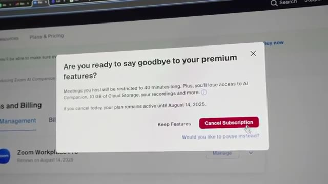
*📸 00:00:39 — Interface d'administration et de facturation Zoom affichant une fenêtre modale de confirmation de résiliation d'abonnement ("Are you ready to say goodbye to your premium features?") avec l'option "Cancel Subscription".*

---

### ⏱️ `[00:00:45 - 00:01:05]` | Segment #03

**🔊 Audio (Transcription Intégrale Mot pour Mot en Français) :**
> Et dans le cas de Zoom, on peut facilement économiser 15-20% comme ça, juste en faisant semblant d'annuler. Donc c'est de l'argent gratuit. Donc déjà, ça montre un petit peu à quel point ces outils sont un petit peu vicieux parce qu'ils te chargent un petit peu plus et puis au pire, ils chargent un peu moins. Quelque part, ils nous prennent un petit peu pour des pigeons. Ensuite, une autre chose que je peux mettre en place, c'est que dans mon cas, je fais mes formations tous les quelques mois et donc je n'ai pas besoin de Zoom tout le temps, tout le temps.

**👁️ Analyse Visuelle d'Écran (gemini-3.5-flash-lite) :**
**Interface & Outils** : Aucune

**Contenu textuel & Code** : Aucun

**Action / Démonstration** : Présentation orale face caméra concernant les stratégies de négociation et de résiliation d'abonnements pour économiser sur des outils comme Zoom.

---

### ⏱️ `[00:01:05 - 00:01:27]` | Segment #04

**🔊 Audio (Transcription Intégrale Mot pour Mot en Français) :**
> Et donc ça m'embête un peu de payer tous les mois et ça, c'est quelque chose qu'on peut retrouver dans plein de SaaS aussi, c'est qu'on peut mettre ses abonnements en pause et donc économiser encore un petit peu d'argent. Et une troisième petite astuce, ça serait de regarder dans les autres services qu'on a parce que j'ai réalisé que je paye pour Google Workspace, que j'utilise pour mes emails. Et dedans, il y a Google Meet qui est inclus, qui contient exactement toutes les fonctionnalités que j'utilise déjà dans Zoom. Donc en fait, quelque part, à force de payer tellement d'abonnements, je me retrouve à payer des services en double.

**👁️ Analyse Visuelle d'Écran (gemini-3.5-flash-lite) :**
**Interface & Outils** : Portails de gestion d'abonnements SaaS et page de tarification Google Workspace

**Contenu textuel & Code** : Formules tarifaires Google Workspace (Starter, Standard, Plus), capacités de stockage Cloud (30 Go, 2 To, 5 To), fonctionnalités collaboratives et options de gestion d'abonnement

**Action / Démonstration** : Optimisation financière des coûts SaaS (FinOps) via la mise en pause d'abonnements et l'analyse comparative des plans de services de productivité Cloud

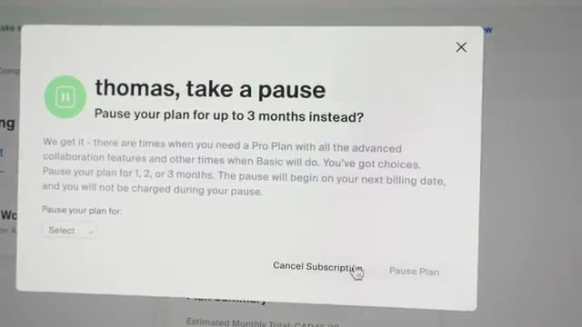
*📸 00:01:10 — Fenêtre de dialogue d'un service SaaS proposant une mise en pause temporaire de l'abonnement (jusqu'à 3 mois) lors d'une tentative de résiliation.*

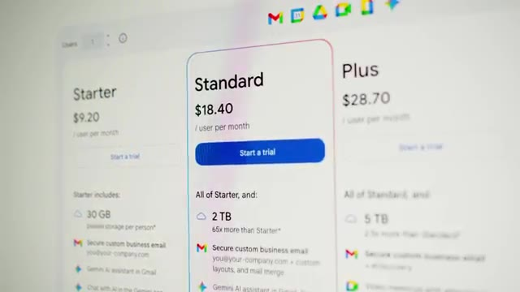
*📸 00:01:16 — Page des tarifs de Google Workspace comparant les formules Starter (9,20 $), Standard (18,40 $) et Plus (28,70 $) par utilisateur et par mois.*

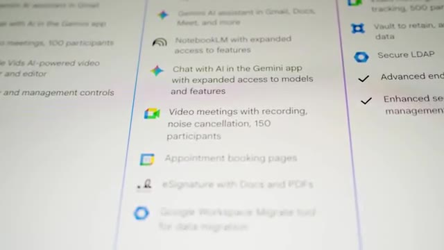
*📸 00:01:22 — Zoom sur la liste des fonctionnalités du forfait Google Workspace Standard, incluant l'assistant Gemini AI, l'outil d'enregistrement Meet et les options de conformité.*

---

### ⏱️ `[00:01:28 - 00:01:47]` | Segment #05

**🔊 Audio (Transcription Intégrale Mot pour Mot en Français) :**
> Donc en fait, très probablement que je vais arrêter complètement de payer Zoom et puis juste utiliser Google Meet parce que ça fait tout ce que j'ai besoin. Un autre outil que j'utilise pour pouvoir répondre en vidéo à des questions qu'on me pose toujours dans ma formation, c'est Loom. C'est un outil que j'aime bien. Je peux enregistrer mon écran, ma tête en même temps et puis l'envoyer facilement à quelqu'un. Mais c'est déjà 15 balles par mois.

**👁️ Analyse Visuelle d'Écran (gemini-3.5-flash-lite) :**
**Interface & Outils** : Loom (lecteur vidéo web), outil de diagramme/tableau blanc virtuel (intégré dans la vidéo Loom)

**Contenu textuel & Code** : Schéma d'architecture conceptuel : profils "Dev" (développeurs), profil "DevOps/SRE", logo et fichier "Terraform", et icônes de serveurs ("Server") cibles

**Action / Démonstration** : Explication pédagogique et enregistrement d'écran (via Loom) pour vulgariser la différence entre le provisionnement d'infrastructure (Terraform) et l'orchestration de conteneurs (Kubernetes)

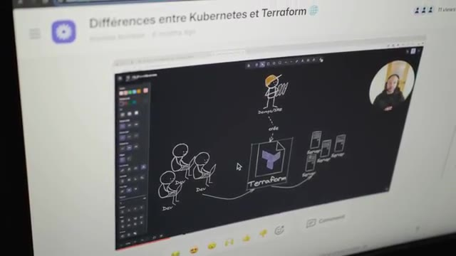
*📸 00:01:42 — Interface de l'outil de messagerie vidéo Loom montrant une présentation explicative intitulée "Différences entre Kubernetes et Terraform" avec un schéma illustrant le rôle d'un DevOps/SRE créant du code Terraform pour déployer des serveurs*

---

### ⏱️ `[00:01:47 - 00:02:19]` | Segment #06

**🔊 Audio (Transcription Intégrale Mot pour Mot en Français) :**
> Ça, c'est en plus en annuel. Donc quelque part une astuce ça pourrait être pour les outils qu'on est certain d'utiliser sur le long De les payer directement annuellement comme ça on peut économiser un petit peu Mais ce qui est encore mieux ce serait de trouver des alternatives moins chères Et dans mon cas j'ai trouvé Nitto Record qui a exactement les mêmes fonctionnalités que dans Loom Y compris les fonctionnalités AI que j'avais essayé d'utiliser un petit peu mais qui honnêtement ne marchent pas super bien Alors que dans Nitto Record ça marche correctement et c'est beaucoup moins cher parce que là le pricing on est sur 5$ Et en plus de ça comme on a dit tout à l'heure si on paye annuellement le prix est de 30$ par an ce qui nous revient à 2,50 par mois.

**👁️ Analyse Visuelle d'Écran (gemini-3.5-flash-lite) :**
**Interface & Outils** : Navigateur web (site de tarification SaaS NeetoRecord)

**Contenu textuel & Code** : Grille tarifaire et fonctionnalités de NeetoRecord : plan gratuit incluant jusqu'à 200 vidéos/mois (15 min max/vidéo, équipe illimitée) et plan payant à 5$/mois (ou 30$/an).

**Action / Démonstration** : Présentation et évaluation d'une alternative économique aux outils d'enregistrement d'écran traditionnels dans le but de réduire l'OPEX (dépenses de fonctionnement) lié aux abonnements logiciels.

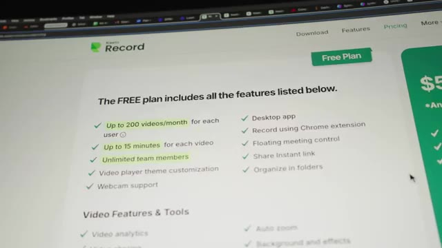
*📸 00:02:03 — Capture d'écran du site web de l'outil NeetoRecord détaillant les fonctionnalités de son offre gratuite ("Free Plan").*

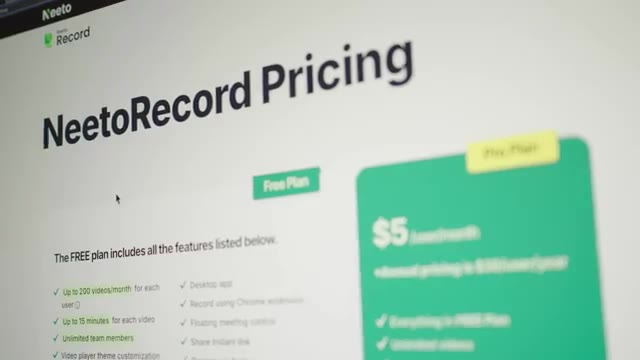
*📸 00:02:11 — Vue de la grille tarifaire de NeetoRecord mettant en avant l'offre gratuite et l'offre payante abordable à 5$ par mois.*

---

### ⏱️ `[00:02:19 - 00:02:39]` | Segment #07

**🔊 Audio (Transcription Intégrale Mot pour Mot en Français) :**
> Donc c'est presque une réduction de 8 à 10 fois en fonction de si on payait par mois ou pas, en passant sur Nito Record. Et ce que j'ai trouvé amusant, c'est qu'en fait, ils ont plein d'outils différents, et c'est toujours la même stratégie, où ils expliquent qu'en gros, nous, on n'est pas très très fort pour trouver des nouvelles fonctionnalités, etc. Donc ce qu'on va faire, c'est juste copier les autres, et puis on va juste faire un prix moins cher.

**👁️ Analyse Visuelle d'Écran (gemini-3.5-flash-lite) :**
**Interface & Outils** : Navigateur web affichant une documentation ou un article de blog technique.

**Contenu textuel & Code** : Titres et texte surligné : "Competing on price" et le début de "Race to the bottom", expliquant la stratégie de développement de l'outil (optimisation des coûts plutôt que création de nouvelles fonctionnalités innovantes).

**Action / Démonstration** : Explication et analyse de la stratégie de l'éditeur (Nito Record) consistant à cloner des solutions existantes pour proposer des tarifs 8 à 10 fois inférieurs.

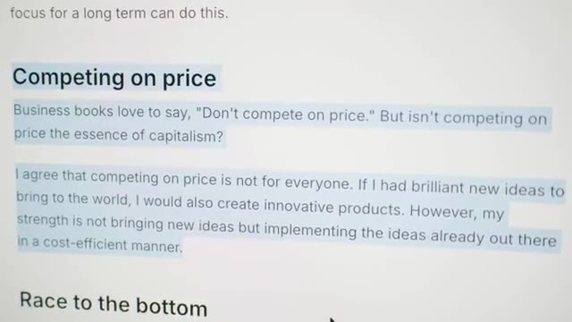
*📸 00:02:34 — Capture d'écran d'un manifeste ou article de blog de l'éditeur détaillant sa philosophie de positionnement tarifaire ("Competing on price") et son approche axée sur la réimplémentation économique de fonctionnalités existantes.*

---

### ⏱️ `[00:02:39 - 00:03:00]` | Segment #08

**🔊 Audio (Transcription Intégrale Mot pour Mot en Français) :**
> J'utilisais aussi Calendly, qui me coûte à peu près 10-12 balles par mois, et donc je vais probablement switcher sur Nito Cal, qui est exactement la même chose que Calendly. et c'est encore pire parce qu'en fait il y a tellement de fonctionnalités dans leur version gratuite que tu n'as presque même pas de raison de prendre la version payante. Mais pour le coup si c'est juste 2,50 par mois ça me fait plaisir plutôt que de payer plus cher un autre outil qui n'a pas changé depuis les 10 dernières années.

**👁️ Analyse Visuelle d'Écran (gemini-3.5-flash-lite) :**
**Interface & Outils** : Navigateur web affichant le site officiel de NeetoCal.

**Contenu textuel & Code** : Tarifs et fonctionnalités comparatives entre la version gratuite ("Free Plan" incluant la majorité des options) et payante ("Pro Plan" à 5$/utilisateur/mois).

**Action / Démonstration** : Analyse et comparaison des coûts d'outils SaaS de planification de rendez-vous en alternative à Calendly.

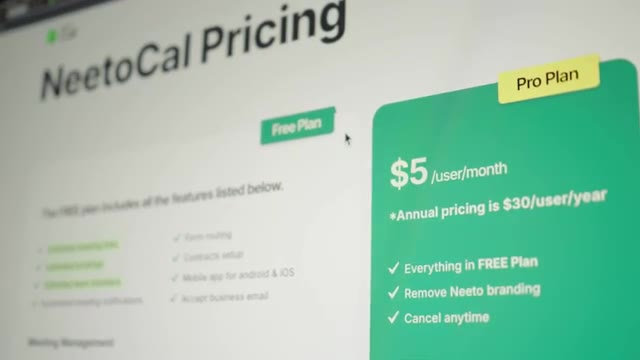
*📸 00:02:50 — Interface web présentant la tarification de NeetoCal (plans Free et Pro à 5$/mois).*

---

### ⏱️ `[00:03:00 - 00:03:21]` | Segment #09

**🔊 Audio (Transcription Intégrale Mot pour Mot en Français) :**
> Un autre outil que j'adore détester c'est Première Pro parce que c'est un logiciel que j'ai beaucoup utilisé pour faire du montage que je fais un petit moment maintenant que j'ai quelqu'un qui m'aide là-dessus et donc du coup j'en ai moins besoin mais j'en ai quand même besoin un peu. C'est un problème aussi qui est récurrent avec les sas c'est que je me retrouve à payer tous les mois pour un outil que j'utilise pas souvent ou du moins pas tous les mois et qui en plus de ça est souvent frustrant à utiliser, plein de crash, plein de bugs.

**👁️ Analyse Visuelle d'Écran (gemini-3.5-flash-lite) :**
**Interface & Outils** : Portail web Adobe de gestion des abonnements SaaS (Software as a Service).

**Contenu textuel & Code** : Formules de tarification de licence Cloud :
- Option mensuelle : 44,99 CAD/mois sans engagement.
- Option annuelle payée mensuellement : 29,99 CAD/mois avec engagement.
- Option annuelle prépayée : 347,88 CAD/an.

**Action / Démonstration** : Illustration et critique du modèle de facturation récurrent imposé par les plateformes SaaS pour des logiciels de création (Premiere Pro / Creative Cloud), même pour un usage ponctuel ou occasionnel.

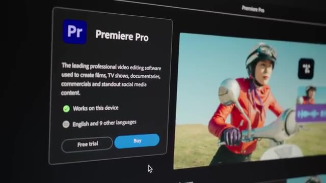
*📸 00:03:05 — Interface de présentation et de téléchargement de l'application Adobe Premiere Pro avec options d'achat et d'essai gratuit.*

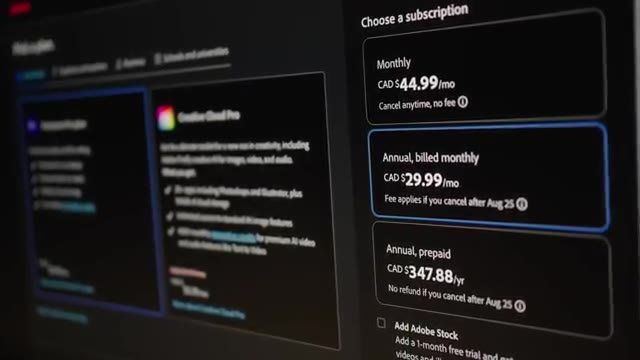
*📸 00:03:16 — Interface de sélection des formules d'abonnement SaaS d'Adobe Creative Cloud présentant différentes options de tarification (mensuelle et annuelle en CAD).*

---

### ⏱️ `[00:03:22 - 00:03:43]` | Segment #10

**🔊 Audio (Transcription Intégrale Mot pour Mot en Français) :**
> Donc ça fait vraiment chier de donner de l'argent à Adobe pour ça. Donc au passage, l'astuce d'annulation fonctionne aussi pour Adobe. Donc pareil, vous pouvez économiser facilement à 20 à 25% là-dessus. Mais encore mieux, c'est des alternatives qui ne sont pas moins chères, qui sont gratuits. Et donc dans ce cas-là, je suis passé sur DaVinci Resolve qui a une version qui est gratuite, qui est déjà très très bien. Ils ont une version qui est payante, mais qui est payante en une seule fois et qui prend toutes les mises à jour futures.

**👁️ Analyse Visuelle d'Écran (gemini-3.5-flash-lite) :**
**Interface & Outils** : Navigateur web affichant la page de présentation de DaVinci Resolve 20.

**Contenu textuel & Code** : Texte descriptif de DaVinci Resolve 20 mettant en avant ses fonctionnalités d'édition professionnelle, d'étalonnage colorimétrique, d'effets visuels et de post-production audio.

**Action / Démonstration** : Présentation d'une alternative gratuite et performante à la suite Adobe Premiere Pro pour le montage et la post-production vidéo.

*📸 00:03:37 — Capture d'écran du site web officiel de Blackmagic Design présentant le logiciel de montage vidéo et de post-production DaVinci Resolve 20.*

---

### ⏱️ `[00:03:43 - 00:04:06]` | Segment #11

**🔊 Audio (Transcription Intégrale Mot pour Mot en Français) :**
> Donc c'est quand même super. Ça fait des années et des années qu'ils font d'assez bonnes mises à jour, au point que maintenant, beaucoup considèrent que DaVinci est mieux que Premiere Pro en termes de stabilité, en termes de color, en termes de 3D, en termes... Il y a plein de fonctionnalités qu'on peut faire dans DaVinci, qu'on ne peut juste pas faire dans Premiere Pro dans un outil qui est gratuit ou alors qui est un paiement une fois. Dans le même esprit, il y a un outil que j'avais commencé à utiliser qui s'appelle Spline et qui, contrairement à Adobe, honnêtement, c'est un outil que j'aimais bien utiliser.

**👁️ Analyse Visuelle d'Écran (gemini-3.5-flash-lite) :**
**Interface & Outils** : Aucune

**Contenu textuel & Code** : Aucun

**Action / Démonstration** : Aucune action technique n'est réalisée. Le créateur s'exprime face caméra au sujet de la stabilité et des fonctionnalités de DaVinci Resolve comparé à Adobe Premiere Pro.

---

### ⏱️ `[00:04:06 - 00:04:27]` | Segment #12

**🔊 Audio (Transcription Intégrale Mot pour Mot en Français) :**
> Il permet de faire des animations en 3D comme j'ai fait sur certaines vidéos de ma chaîne et qui est assez facile à en prendre en main, qui est directement dans le navigateur, etc. où on peut aussi facilement l'exporter pour faire du web et tout. Donc c'est vraiment un outil qui est super cool. Là au contraire ça ne me dérangeait pas de payer. Surtout que ce n'était pas très très cher. C'était 12 balles par mois. Mais je sais que des animations je n'en fais pas forcément tous les mois non plus. Et encore une fois la même astuce c'est que parfois il y a des outils qui sont mieux et gratuits.

**👁️ Analyse Visuelle d'Écran (gemini-3.5-flash-lite) :**
**Interface & Outils** : Aucune

**Contenu textuel & Code** : Aucun

**Action / Démonstration** : Aucune

---

### ⏱️ `[00:04:27 - 00:04:46]` | Segment #13

**🔊 Audio (Transcription Intégrale Mot pour Mot en Français) :**
> Et donc l'exemple ici c'est que je suis passé sur Unreal Engine. Qui est utilisé dans les jeux vidéo qui ont les meilleurs graphiques. Et même utilisé dans le cinéma les effets spéciaux etc. Donc c'est vraiment le top du top en termes de logiciel 3D. Et c'est un logiciel qui est gratuit. Le seul moment où on doit payer, c'est quand on a un projet qui dépasse les 1 million de revenus. Donc, ce n'est pas encore mon cas. Sinon, je ne serais pas là à économiser des 20 balles à droite à gauche.

**👁️ Analyse Visuelle d'Écran (gemini-3.5-flash-lite) :**
**Interface & Outils** : Navigateur web (site officiel d'Unreal Engine / Epic Games)

**Contenu textuel & Code** : Conditions de licence d'Unreal Engine, mentionnant la gratuité pour les développeurs de jeux, indépendants et écoles en dessous d'un million de dollars USD de revenus.

**Action / Démonstration** : Présentation du modèle de licence et d'accessibilité gratuite du moteur de jeu et de rendu 3D Unreal Engine.

*📸 00:04:32 — Page d'accueil du site officiel d'Unreal Engine présentant le logiciel de création 3D temps réel.*

*📸 00:04:42 — Section "Licensing" du site d'Unreal Engine détaillant la gratuité du moteur en dessous d'un million de dollars de chiffre d'affaires.*

---

### ⏱️ `[00:04:47 - 00:05:08]` | Segment #14

**🔊 Audio (Transcription Intégrale Mot pour Mot en Français) :**
> Donc, évidemment, c'est un outil qui est un peu plus complexe, qui m'a pris pas mal de temps pour pouvoir prendre mes repères, m'habituer et faire ce que je voulais dessus. Mais je trouve que c'est un investissement en temps qui vaut le coup. Parce qu'à partir du maintenant, à chaque fois que je vais avoir besoin d'animation 3D, je vais pouvoir réutiliser Unreal Engine et je vais avoir des meilleurs résultats. Et ça ne va rien me coûter. Les autres types d'outils qu'on commence à être de plus en plus à utiliser, c'est les IA, donc ChatGPT, CloudCode, Gemini, etc.

**👁️ Analyse Visuelle d'Écran (gemini-3.5-flash-lite) :**
**Interface & Outils** : Aucune

**Contenu textuel & Code** : Aucun

**Action / Démonstration** : Aucune

---

### ⏱️ `[00:05:09 - 00:05:27]` | Segment #15

**🔊 Audio (Transcription Intégrale Mot pour Mot en Français) :**
> Et moi, j'utilise principalement ChatGPT. J'aime bien leur app, j'aime bien l'interface, les fonctionnalités qu'ils ont. Mais j'aime bien Cloud pour pouvoir coder. Je trouve que Cloud, pour le code ou pour tout ce qui a besoin d'un petit peu d'imagination est un petit peu mieux que les modèles de ChatGPT. Et donc, pendant un moment, je payais les deux. Ce qui est un peu embêtant de devoir payer plusieurs fois pour le même service.

**👁️ Analyse Visuelle d'Écran (gemini-3.5-flash-lite) :**
**Interface & Outils** : Navigateur web (site officiel d'Anthropic / Claude).

**Contenu textuel & Code** : Commande d'installation Node.js : `npm install -g @anthropic-ai/claude-code` (nécessite Node.js 18+).

**Action / Démonstration** : Présentation des capacités de l'agent IA Claude (Anthropic) pour le développement et l'analyse de bases de code volumineuses directement depuis le terminal de commande.

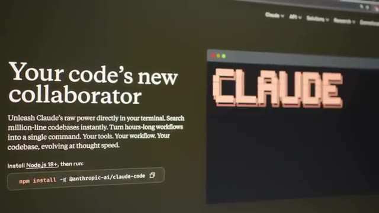
*📸 00:05:18 — Page web d'Anthropic introduisant l'outil CLI "Claude Code" avec les instructions d'installation pour le terminal via le gestionnaire de paquets npm.*

---

### ⏱️ `[00:05:27 - 00:05:46]` | Segment #16

**🔊 Audio (Transcription Intégrale Mot pour Mot en Français) :**
> Là, pour le coup, j'ai décidé d'accepter de payer ChatGPT parce que c'est celui que j'utilise le plus. et simplement pour Claude de passer sur l'API. Donc au lieu de payer 18 ou 20 balles, parce qu'évidemment c'est 17, mais en fait si tu payes tous les mois, c'est 20 balles. J'ai décidé de passer juste par l'API. Ce qui fait que quand j'en ai pas besoin, je paye pas. Et le jour où j'en ai besoin, je vais payer juste au token.

**👁️ Analyse Visuelle d'Écran (gemini-3.5-flash-lite) :**
**Interface & Outils** : Navigateur web, portails de tarification d'OpenAI et d'Anthropic (API).

**Contenu textuel & Code** : Tarifs d'abonnements ChatGPT (Plus à $20/mois) et métriques de facturation à l'usage pour les modèles d'Anthropic (Claude Sonnet 4 à $3/MTok d'input et $15/MTok d'output, avec prompt caching).

**Action / Démonstration** : Analyse comparative des coûts entre un abonnement grand public mensuel fixe (SaaS) et l'intégration directe de modèles de langage (LLM) via l'API développeur facturée à l'usage pour optimiser les dépenses d'infrastructure d'IA.

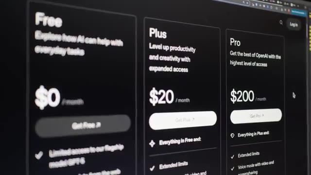
*📸 00:05:31 — Interface web affichant la grille tarifaire des abonnements ChatGPT d'OpenAI (plans Free à $0, Plus à $20 et Pro à $200 par mois).*

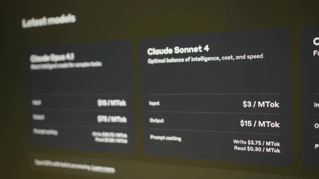
*📸 00:05:36 — Interface web détaillant la tarification de l'API d'Anthropic pour les modèles d'IA (Claude Opus et Claude Sonnet) avec les coûts par million de tokens (MTok).*

---

### ⏱️ `[00:05:46 - 00:06:06]` | Segment #17

**🔊 Audio (Transcription Intégrale Mot pour Mot en Français) :**
> Et au final, ça me revient beaucoup moins cher que de payer plusieurs fois 20 balles pour chacun des services. J'ai réalisé aussi que dans l'abonnement Google Workspace que j'utilise pour mes emails et pour mon stockage de fichiers, et bien en fait j'ai Gemini Pro qui est inclus dedans. Donc quelque part, si je switchais à Gemini, qui est honnêtement un très très bon modèle. En génération de vidéo aussi avec VO3, ils sont beaucoup meilleurs que ChatGPT.

**👁️ Analyse Visuelle d'Écran (gemini-3.5-flash-lite) :**
**Interface & Outils** : Page web de tarification et fonctionnalités Google Workspace

**Contenu textuel & Code** : Offres d'abonnement cloud Google Workspace montrant l'espace de stockage (30 GB, 2 TB, 5 TB), l'intégration de Gemini AI Assistant (Gmail, Docs, Meet), NotebookLM et les fonctions de sécurité associées.

**Action / Démonstration** : Comparaison des abonnements de stockage et services cloud pour démontrer l'inclusion de Gemini Pro dans son offre Workspace existante.

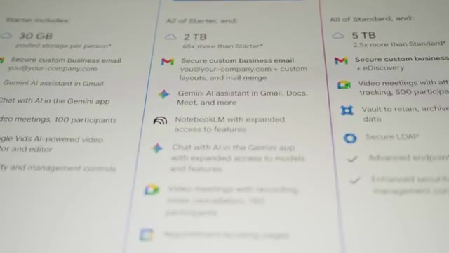
*📸 00:05:56 — Tableau comparatif des forfaits Google Workspace détaillant les espaces de stockage (30 Go, 2 To, 5 To) et l'intégration des fonctionnalités d'IA avec Gemini et NotebookLM.*

---

### ⏱️ `[00:06:06 - 00:06:27]` | Segment #18

**🔊 Audio (Transcription Intégrale Mot pour Mot en Français) :**
> En code, ils ne sont pas forcément autant au top que Cloud, mais ils ont une énorme contexte window, ce qui fait que dans certains cas, ils peuvent être un petit peu meilleurs. Et donc ce qui risque d'arriver, c'est que je vais petit à petit switcher vers Gemini. Et si ça me plaît, je vais juste annuler mon ChatGPT, annuler mon Cloud et puis rester dessus. Ce qui me fera encore une fois un outil de moins à devoir payer tous les mois. Et donc dans le cas de Cloud Code maintenant, j'utilise soit la version gratuite, soit l'API.

**👁️ Analyse Visuelle d'Écran (gemini-3.5-flash-lite) :**
**Interface & Outils** : Aucune

**Contenu textuel & Code** : Aucun

**Action / Démonstration** : Analyse comparative orale des performances de codage et de la taille de la fenêtre de contexte ("context window") entre les modèles d'IA Claude, ChatGPT et Gemini, expliquant la transition progressive de son flux de travail vers Gemini.

---

### ⏱️ `[00:06:27 - 00:06:49]` | Segment #19

**🔊 Audio (Transcription Intégrale Mot pour Mot en Français) :**
> Dans ce cas-là, je pense que la leçon va revenir, c'est que parfois la version gratuite suffit. Et très souvent, il y a des outils où on peut payer vraiment à l'utilisation. Ce qui est le cas dans les services d'IA, mais aussi dans tous les services cloud. Et donc, ça permet d'économiser pas mal d'argent si on a une utilisation qui est assez faible. Autre astuce un petit peu plus hardcore cette fois, j'utilise un outil qui s'appelle TinyURL, qui est l'outil moins cher que j'ai trouvé pour pouvoir traquer les URL.

**👁️ Analyse Visuelle d'Écran (gemini-3.5-flash-lite) :**
**Interface & Outils** : Aucune (visage de l'intervenant uniquement)

**Contenu textuel & Code** : Aucun (discussion orale sans support technique visuel)

**Action / Démonstration** : Explication orale sur l'avantage économique des modèles de tarification à l'usage ("pay-as-you-go") dans le cloud et les services d'IA comparés aux abonnements fixes pour les faibles volumes d'utilisation.

---

### ⏱️ `[00:06:49 - 00:07:09]` | Segment #20

**🔊 Audio (Transcription Intégrale Mot pour Mot en Français) :**
> Quand je mets un lien dans la description pour une sponsor, pour une formation, quelque chose comme ça, j'aime bien savoir combien de personnes ont cliqué pour savoir si c'était efficace ou pas. Et TinyURL, 13 balles par mois, juste pour compter le nombre de clics, c'est un petit peu chiant. C'est à la fois pas assez cher où je me dirais « Oh, bah, je vais prendre le temps de coder mon truc à moi-même. » D'un autre côté, c'est aussi un outil que je n'utilise pas forcément tout le temps, tous les mois, etc.

**👁️ Analyse Visuelle d'Écran (gemini-3.5-flash-lite) :**
**Interface & Outils** : Console web SaaS TinyURL (dashboard d'analyse et page de souscription/pricing).

**Contenu textuel & Code** : - Liens raccourcis configurés : `l.cocadmin.com/formation-devops`, `l.cocadmin.com/aws-free`, `l.cocadmin.com/e2600`, `l.cocadmin.com/peperelab`.
- Graphique "Traffic Over Time" distinguant les clics uniques, non-uniques et bots.
- Grille tarifaire TinyURL : Offre "Free" à 0,00 $/mois, offre "Pro" à 12,99 $/mois.

**Action / Démonstration** : Présentation des statistiques de clics sur les liens de parrainage/formation et critique du rapport coût/bénéfice de l'abonnement "Pro" de TinyURL pour une simple fonctionnalité de redirection et de comptage de clics.

*📸 00:06:54 — Interface d'administration de TinyURL présentant le tableau de bord analytique avec les métriques de clics ("Likely Human Clicks: 32", "Unique Clicks: 31"), le graphique temporel du trafic et la liste des liens raccourcis personnalisés sous le sous-domaine l.cocadmin.com.*

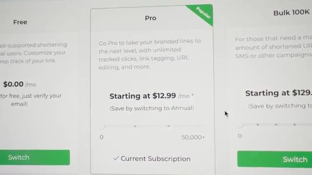
*📸 00:06:59 — Page de tarification de TinyURL mettant en avant le forfait "Pro" actif ("Current Subscription") à partir de 12,99 $ par mois pour le suivi et la gestion des liens raccourcis.*

---

### ⏱️ `[00:07:10 - 00:07:35]` | Segment #21

**🔊 Audio (Transcription Intégrale Mot pour Mot en Français) :**
> Et parfois, on peut se dire « Bon, si je paye un SaaS, ça permet aux développeurs de continuer à rajouter des nouvelles fonctionnalités, etc. » Mais là, dans le cas de TinyURL, mon gars, le mec n'a jamais rien à rajouter depuis des années et des années. Même l'interface, tu vois qu'il l'a fait en 2004 et il n'a pas mis à jour depuis. sauf que maintenant avec les IA le coût du logiciel en termes de temps de développement etc a considérablement diminué et donc je me suis dit un soir pourquoi est-ce que je ne recoderais pas un outil qui va me permettre de faire ça comme ça je vais arrêter de payer pour celui-là.

**👁️ Analyse Visuelle d'Écran (gemini-3.5-flash-lite) :**
**Interface & Outils** : Navigateur web affichant la console d'administration et de suivi analytique de TinyURL.

**Contenu textuel & Code** : Liens raccourcis configurés (tels que l.cocadmin.com/formation-devops, l.cocadmin.com/aws-free) et statistiques de requêtes associées (clics uniques, répartition temporelle du trafic).

**Action / Démonstration** : Présentation et critique de l'interface utilisateur de TinyURL pour illustrer le manque de nouveautés et de mises à jour ergonomiques de cette solution SaaS au fil des années.

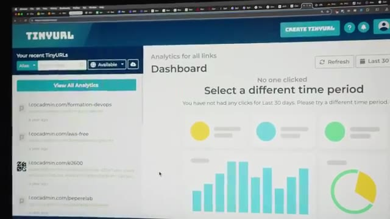
*📸 00:07:16 — Interface utilisateur du tableau de bord d'analyse de TinyURL, affichant des indicateurs de performance à vide pour des liens personnalisés associés au domaine l.cocadmin.com.*

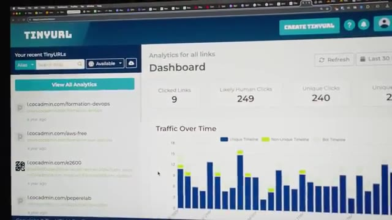
*📸 00:07:22 — Tableau de bord d'analyse de TinyURL montrant des graphiques de trafic ("Traffic Over Time") et des métriques actives de clics (liens cliqués, clics humains probables, clics uniques).*

---

### ⏱️ `[00:07:35 - 00:07:54]` | Segment #22

**🔊 Audio (Transcription Intégrale Mot pour Mot en Français) :**
> J'ai recodé mon propre raccourcisseur de lien. On peut se dire c'est quoi l'avantage parce que maintenant tu dois payer un serveur pour ça mais c'est une idée que j'avais en tête depuis un petit moment c'est d'utiliser du serverless. Donc à la base je pensais utiliser AWS Lambda qui est un service où on paye juste à la requête et comme je ne reçois pas tant de trafic sur mes requêtes peut-être quelques milliers par mois maximum et moi je paierais vraiment quelques centimes par mois.

**👁️ Analyse Visuelle d'Écran (gemini-3.5-flash-lite) :**
**Interface & Outils** : Console Web / Page produit Amazon Web Services (AWS)

**Contenu textuel & Code** : Titre principal "AWS Lambda" associé à une description du service FaaS (Function-as-a-Service) et un bouton d'appel à l'action pour démarrer ("Get started...").

**Action / Démonstration** : Explication du concept d'architecture serverless et justification du choix initial d'AWS Lambda pour exécuter le code du raccourcisseur de lien à la demande sans gérer de serveurs.

*📸 00:07:45 — Vue rapprochée de la page de présentation du service AWS Lambda sur la plateforme Amazon Web Services, mettant en avant le nom du service "AWS Lambda".*

---

### ⏱️ `[00:07:54 - 00:08:14]` | Segment #23

**🔊 Audio (Transcription Intégrale Mot pour Mot en Français) :**
> Mais un des soucis qu'il y a sur Lambda, c'est le problème de call start. C'est-à-dire que si personne clique sur un lien pendant assez longtemps, ce qui peut arriver, et bien la première personne qui va cliquer dessus, ça va mettre du temps avant que la fonction s'exécute et puis redirige la personne vers le bon site, ce qui est un petit peu chiant. Ça ne me donne pas une très très bonne expérience. Idéalement, on voudrait que ça redirige instantanément vers le lien.

**👁️ Analyse Visuelle d'Écran (gemini-3.5-flash-lite) :**
**Interface & Outils** : Navigateur web affichant le blog officiel AWS (AWS Compute Blog)

**Contenu textuel & Code** : Article explicatif sur le phénomène de "cold start" (démarrage à froid) lors de l'invocation d'une fonction AWS Lambda après une période d'inactivité.

**Action / Démonstration** : Illustration visuelle pour appuyer l'explication théorique du problème de latence réseau rencontré lors de la première requête sur une architecture serverless.

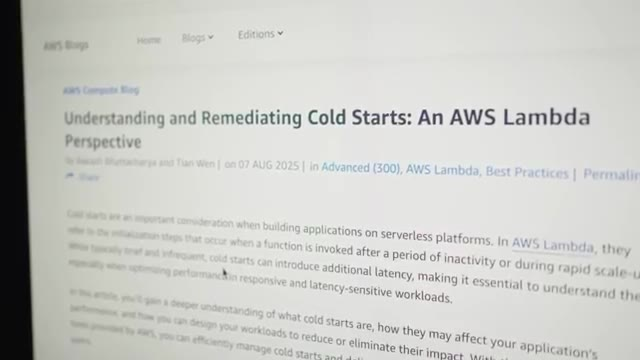
*📸 00:07:59 — Article du blog AWS Compute intitulé "Understanding and Remediating Cold Starts: An AWS Lambda Perspective" traitant du fonctionnement et de l'optimisation des démarrages à froid des fonctions AWS Lambda.*

---

### ⏱️ `[00:08:14 - 00:08:33]` | Segment #24

**🔊 Audio (Transcription Intégrale Mot pour Mot en Français) :**
> Donc à la place, j'ai utilisé les workers de Cloudflare qui sont exactement la même chose, sauf que dans les workers, il n'y a pas ce problème de call start. c'est toujours hot, c'est-à-dire qu'ils gardent toujours ta fonction au chaud dans la RAM. Et donc même si personne clique sur ton lien pendant trois semaines, quand quelqu'un arrive, boum, c'est très très rapide. Et donc j'ai vu dans mes stats mes temps d'exécution, c'est de l'ordre de 3 à 4 millisecondes.

**👁️ Analyse Visuelle d'Écran (gemini-3.5-flash-lite) :**
**Interface & Outils** : Navigateur web affichant le portail produit et le blog technique de Cloudflare.

**Contenu textuel & Code** : Diagramme de flux d'une requête HTTP/TLS entre le navigateur, l'edge Cloudflare, le runtime des Workers et le stockage (Edge Storage). Texte explicatif détaillant le chargement du Worker en 5 millisecondes déclenché dès la réception du paquet "ClientHello" lors de la négociation TLS.

**Action / Démonstration** : Explication technique de l'élimination du "cold start" (démarrage à froid) chez Cloudflare, démontrant que l'initialisation de la fonction serverless est anticipée de manière transparente pendant l'établissement de la connexion sécurisée afin d'obtenir un temps d'accès instantané.

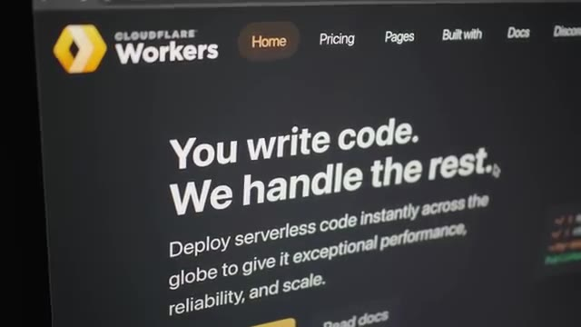
*📸 00:08:19 — Page d'accueil de Cloudflare Workers présentant le concept de déploiement de code serverless mondial sans contrainte d'infrastructure.*

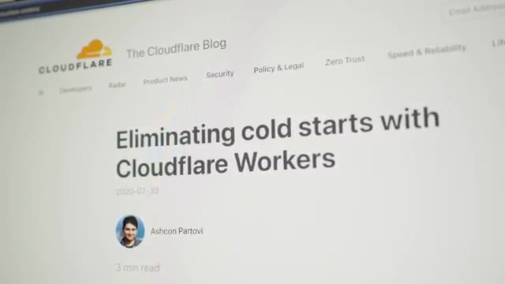
*📸 00:08:24 — Article de blog officiel de Cloudflare intitulé "Eliminating cold starts with Cloudflare Workers", introduisant la suppression des démarrages à froid.*

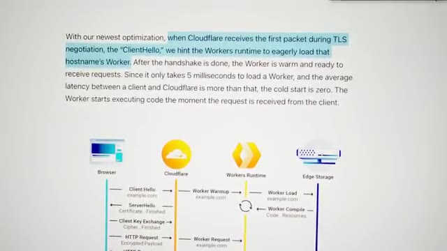
*📸 00:08:29 — Diagramme de séquence et explication technique du mécanisme de pré-chargement (warmup) des Workers de Cloudflare initié dès la négociation TLS (ClientHello).*

---

### ⏱️ `[00:08:34 - 00:09:03]` | Segment #25

**🔊 Audio (Transcription Intégrale Mot pour Mot en Français) :**
> Donc ça n'ajoute aucun temps perceptible par l'utilisateur quand il clique dessus pour pouvoir comptabiliser son clic. Et en termes de coût, leur partie gratuite est tellement large que je risque de jamais payer. On a le droit à 100 000 requêtes par jour et on peut utiliser jusqu'à 10 000 secondes de CPU par invocation. Moi dans mon cas c'est entre 1 et 4 donc j'ai encore un peu de la marge. Et si jamais vraiment je deviens, je fais des milliards de vues et que ça clique à fond, dans la version payante, qui coûte 5 balles par mois, j'ai droit à 10 millions de requêtes incluses, et ensuite je paye 30 centimes par million de requêtes supplémentaires.

**👁️ Analyse Visuelle d'Écran (gemini-3.5-flash-lite) :**
**Interface & Outils** : Aucune

**Contenu textuel & Code** : Aucun

**Action / Démonstration** : Explication théorique de la tarification gratuite d'un service cloud (limite de 100 000 requêtes par jour et 10 000 secondes de CPU par invocation).

---

### ⏱️ `[00:09:03 - 00:09:21]` | Segment #26

**🔊 Audio (Transcription Intégrale Mot pour Mot en Français) :**
> Pour stocker les données, parce qu'il faut que je stocke le nombre de clics, j'utilise D1, qui est une base de données serverless aussi, qu'on peut appeler via une API REST, donc c'est vraiment parfait pour du serverless comme des workers. Et bien c'est pareil, c'est gratuit pour 5 millions de lectures par jour, et 100 000 écritures par jour. Donc pareil, je ne vais très probablement jamais avoir à payer ça.

**👁️ Analyse Visuelle d'Écran (gemini-3.5-flash-lite) :**
**Interface & Outils** : Documentation tarifaire de Cloudflare D1

**Contenu textuel & Code** : - Métriques d'utilisation affichées pour l'offre "Workers Free" :
  * Lectures de lignes (Rows read) : 5 millions par jour
  * Écritures de lignes (Rows written) : 100 000 par jour
  * Stockage (Storage) : 5 Go au total
- Tarifs pour l'offre "Workers Paid" (ex: 25 milliards de lectures incluses, puis 0,001 $ par million).

**Action / Démonstration** : Explication technique et comparaison des quotas gratuits de la base de données SQL serverless Cloudflare D1 pour justifier sa pertinence économique dans une architecture serverless (Workers).

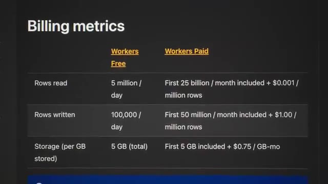
*📸 00:09:17 — Tableau des métriques de facturation (Billing metrics) comparant les offres gratuite (Workers Free) et payante (Workers Paid) pour la base de données Cloudflare D1.*

---

### ⏱️ `[00:09:21 - 00:09:44]` | Segment #27

**🔊 Audio (Transcription Intégrale Mot pour Mot en Français) :**
> Si jamais je dois payer, on est sur 1$ par million de requêtes après les 50 premières millions de requêtes gratuites. Donc ça, je trouve que c'est une bonne situation des services de cloud où souvent on se dit que le cloud, c'est pour que des grosses entreprises, des gros projets, etc. Mais parfois, au contraire, sur des petits projets, ça peut être très utile parce que là, j'ai de la haute disponibilité. J'ai un service qui est renondé dans le monde entier, qui est gratuit et qui est ultra performant et qui ne coûte rien du tout.

**👁️ Analyse Visuelle d'Écran (gemini-3.5-flash-lite) :**
**Interface & Outils** : Présentation ou face-caméra sans interface informatique partagée.

**Contenu textuel & Code** : Explications orales des concepts, architectures et retours d'expérience.

**Action / Démonstration** : Démonstration pédagogique et mise en perspective technique.

---

### ⏱️ `[00:09:44 - 00:10:08]` | Segment #28

**🔊 Audio (Transcription Intégrale Mot pour Mot en Français) :**
> Donc les une ou deux soirées que j'ai dû investir à recoder ça, honnêtement, je trouve que ça vaut le coup parce que, premièrement, c'était amusant. Deuxièmement, ce n'est pas comme si c'était du temps que j'aurais pu rentabiliser parce que j'ai fait ça à la place de jouer à Starcraft le soir. Donc, ce n'est pas vraiment l'argent perdu pour moi. Dans le même style, il y a un outil que j'utilise pour mes formations aussi, pour pouvoir héberger tous les contenus, etc., qui s'appelle Podia, que j'aime bien, qui n'est pas trop trop cher, qui, contrairement à pas mal d'autres outils, rajoute continuellement des nouvelles fonctionnalités.

**👁️ Analyse Visuelle d'Écran (gemini-3.5-flash-lite) :**
**Interface & Outils** : Aucune interface d'administration système, de cloud ou de développement.

**Contenu textuel & Code** : Menu de jeu vidéo (StarCraft II) et site vitrine de service SaaS tiers (Podia).

**Action / Démonstration** : Aucune manipulation technique, configuration système ou développement n'est réalisé dans ces captures.

---

### ⏱️ `[00:10:09 - 00:10:31]` | Segment #29

**🔊 Audio (Transcription Intégrale Mot pour Mot en Français) :**
> Donc, je les aime bien. Donc, pour ça, je n'ai pas trop envie de changer parce que ça me convient à peu près. Et à part recoder tout de zéro, il n'y a pas vraiment d'alternative moins chère qui offre le même nombre de fonctionnalités. J'ai même passé la gestion de mes emails chez Podia. Avant, j'étais chez MailChimp qui est vraiment le pire exemple des SaaS qui font rien et qui charge un prix abusé. Je pense que chez MailChimp, je commençais à payer des 120, 130 dollars tous les mois alors que je n'envoyais jamais d'email.

**👁️ Analyse Visuelle d'Écran (gemini-3.5-flash-lite) :**
**Interface & Outils** : Navigateur web, interface de tarification SaaS de MailChimp.

**Contenu textuel & Code** : Paliers de facturation basés sur le nombre de contacts (sélection de 2 500 contacts visible à l'écran) pour un volume de 6 000 emails mensuels, tarif de départ estimé à 27,73 CAD/mois après un essai gratuit de 14 jours.

**Action / Démonstration** : Analyse comparative et critique du modèle de tarification de MailChimp, expliquant la migration de la gestion des emails vers une alternative plus avantageuse (Podia).

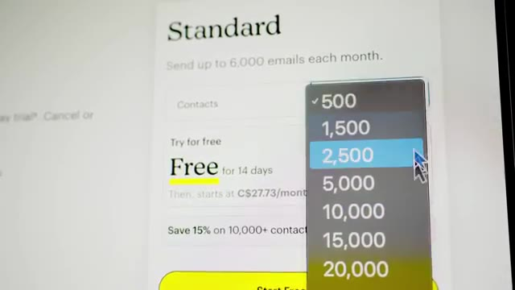
*📸 00:10:25 — Interface d'estimation tarifaire de la plateforme d'emailing MailChimp, illustrant la sélection du nombre de contacts (menu déroulant de 500 à 20 000 contacts) pour le forfait "Standard".*

---

### ⏱️ `[00:10:31 - 00:10:51]` | Segment #30

**🔊 Audio (Transcription Intégrale Mot pour Mot en Français) :**
> Donc, ça me coûtait vraiment trop cher. Donc là, chez Podia, donc là pour ma liste, c'est à peu près à 10 000. Je suis à 50 par mois, ce qui est raisonnable. mais dans mon cas où j'envoie vraiment pas beaucoup d'emails, comme je t'ai dit, ma formation, je l'ai fait quelques fois par an, donc j'envoie vraiment quelques emails par an. En plus de ça, ma liste est proche des 10 000, donc dès que je veux passer à 10 000 abonnés sur ma liste email, boum, ça va me booster à 86 par mois.

**👁️ Analyse Visuelle d'Écran (gemini-3.5-flash-lite) :**
**Interface & Outils** : Interface web de la plateforme SaaS Podia (section tarification Podia Email)

**Contenu textuel & Code** : Liste des fonctionnalités incluses ("Email automations", "Analytics and sales metrics") et menu déroulant d'estimation tarifaire basé sur le nombre d'abonnés ("Your subscribers" avec des paliers allant de "Less than 100" à "Up to 5,000" et plus).

**Action / Démonstration** : Analyse comparative des coûts d'exploitation et d'hébergement d'une liste de diffusion de 10 000 abonnés pour optimiser les dépenses de sa plateforme de formation en ligne.

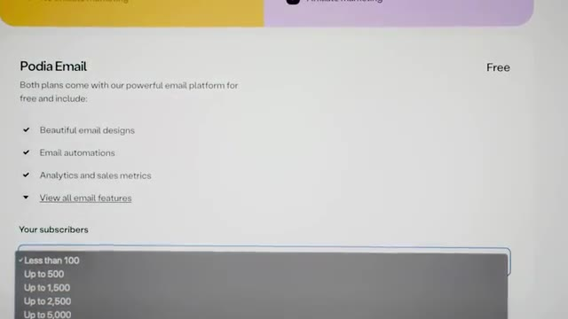
*📸 00:10:36 — Page des tarifs de la plateforme SaaS Podia Email affichant les fonctionnalités (automatisations, statistiques d'envoi) et un sélecteur déroulant pour le nombre d'abonnés afin de configurer l'offre tarifaire.*

---

### ⏱️ `[00:10:52 - 00:11:11]` | Segment #31

**🔊 Audio (Transcription Intégrale Mot pour Mot en Français) :**
> Donc ça commence à être un peu embêtant. Donc ce que je n'ai pas encore fait, mais ce que je regarde à faire, c'est de passer sur un outil qui est self-hosted. Donc il y en a plusieurs, comme par exemple Sandy, que j'ai commencé à regarder, mais qui utilise AWS SES, et qui est dans le même style que les workers Cloudflare. c'est un service où on paye à l'utilisation. Et pour le coup, ici, on paye 10 centimes par 1000 emails.

**👁️ Analyse Visuelle d'Écran (gemini-3.5-flash-lite) :**
**Interface & Outils** : Navigateur web affichant la page d'accueil de Mautic (mautic.org).

**Contenu textuel & Code** : Slogan "Grow your organization with Mautic, The World's Largest Open Source Marketing Automation Product" avec des boutons d'appel à l'action "Get started today" et "Explore features".

**Action / Démonstration** : Présentation et exploration visuelle d'alternatives d'outils d'emailing et de marketing automation self-hosted.

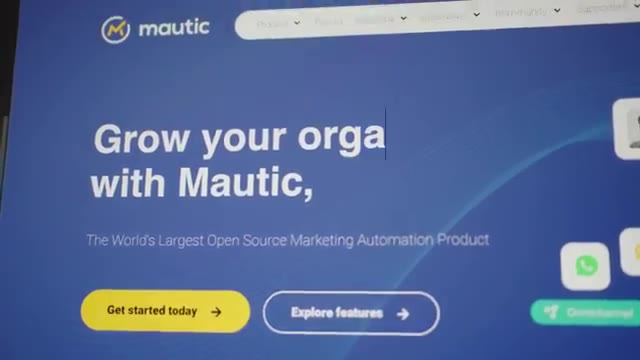
*📸 00:11:02 — Capture d'écran de la page d'accueil du site officiel de Mautic, un outil open-source d'automatisation marketing.*

---

### ⏱️ `[00:11:12 - 00:11:32]` | Segment #32

**🔊 Audio (Transcription Intégrale Mot pour Mot en Français) :**
> Donc dans mon cas, qui est une liste de 10 000 personnes, à chaque fois que je vais envoyer un email, ça me coûterait 1 dollar. Au lieu de 50 dollars par mois. Je n'envoie pas 50 emails par mois. Donc clairement, ça serait largement moins cher, même si ma liste grossirait. Comme c'est un petit peu sensible, j'ai quand même envie que mes emails arrivent à destination. Je vais faire ça progressivement. Ça, ça me permet juste d'avoir l'interface, de pouvoir écrire mes emails, de pouvoir voir combien de personnes nous les ont ouverts, etc.

**👁️ Analyse Visuelle d'Écran (gemini-3.5-flash-lite) :**
**Interface & Outils** : Aucune

**Contenu textuel & Code** : Aucun

**Action / Démonstration** : Analyse comparative orale par le créateur entre le coût d'envoi d'emails basé sur la consommation réelle (via des services cloud comme AWS SES à 1$ pour 10 000 emails) et un abonnement classique de type SaaS à 50$ par mois.

---

### ⏱️ `[00:11:32 - 00:12:00]` | Segment #33

**🔊 Audio (Transcription Intégrale Mot pour Mot en Français) :**
> Et donc ce qui m'assure que les emails que je vais envoyer ne vont pas arriver en spam, etc. Et un des derniers outils qui me coûte pas mal, c'est justement Google Workspace que j'utilise pour mes emails, mais que j'utilise aussi pour stocker mes vidéos quand je veux envoyer à mon monteur, etc. C'est surtout le stockage qui fait que ça me fait payer pas mal d'argent. Et donc la petite astuce que j'utilise jusqu'à présent, parce que j'utilise plus que 5 terabytes, j'ai pris cet abonnement-là qui me donne 5 teras, mais ce stockage, il est partagé à travers tous les utilisateurs.

**👁️ Analyse Visuelle d'Écran (gemini-3.5-flash-lite) :**
**Interface & Outils** : Navigateur web affichant la grille tarifaire officielle de Google Workspace.

**Contenu textuel & Code** : Détail des abonnements Google Workspace :
- Business Starter : 9,20 $ / utilisateur / mois (30 Go)
- Business Standard : 18,40 $ / utilisateur / mois (2 To)
- Business Plus : 28,70 $ / utilisateur / mois (5 To)

**Action / Démonstration** : Évaluation du coût de la solution Google Workspace pour la gestion des emails professionnels et l'hébergement de fichiers vidéos volumineux.

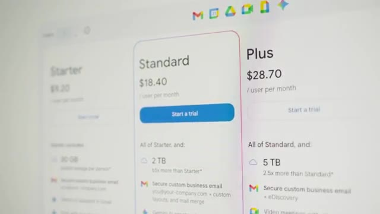
*📸 00:11:39 — Interface des tarifs de Google Workspace détaillant les offres Starter, Standard (avec 2 To de stockage) et Plus (avec 5 To de stockage).*

---

### ⏱️ `[00:12:00 - 00:12:19]` | Segment #34

**🔊 Audio (Transcription Intégrale Mot pour Mot en Français) :**
> Donc si je voulais 10 teras, je pourrais payer un deuxième utilisateur, et le premier utilisateur, qui est moi-même, pourrait utiliser les 10 terres. Mais, payer 60 balles tous les mois pour pouvoir stocker des vidéos, c'est un peu trop. Donc, la petite filouterie, c'est qu'on peut créer un utilisateur et ensuite on peut l'archiver, qui est une fonction que les entreprises peuvent utiliser quand quelqu'un quitte l'entreprise.

**👁️ Analyse Visuelle d'Écran (gemini-3.5-flash-lite) :**
**Interface & Outils** : Console d'administration Google Workspace (gestion des utilisateurs)

**Contenu textuel & Code** : Liste des utilisateurs ("Richard Do", "thomas bomboh"), indicateur de sélection "1 user selected" et boutons d'action rapide.

**Action / Démonstration** : Sélection d'un utilisateur nouvellement créé en vue de l'archiver pour contourner les limitations de stockage et réduire les coûts d'abonnement mensuels.

*📸 00:12:14 — Interface d'administration d'un service cloud (type Google Workspace) affichant la liste des utilisateurs avec un utilisateur nommé "Richard Do" sélectionné (case cochée).*

---

### ⏱️ `[00:12:19 - 00:12:40]` | Segment #35

**🔊 Audio (Transcription Intégrale Mot pour Mot en Français) :**
> On archive son compte, il ne peut plus rien faire, il ne peut plus envoyer d'email, il ne peut plus regarder ses emails, etc. Mais par contre, son espace de toquage est quand même gardé parce qu'on garde quand même les anciens fichiers que cette personne avait utilisés. Ce que quand on fait ça, un utilisateur archivé compte pour 5 terres. Ce qui fait que j'ai mon compte que je paye 30 balles et j'ai un autre utilisateur archivé qui coûte que 7 dollars qui me permet de doubler mon stockage.

**👁️ Analyse Visuelle d'Écran (gemini-3.5-flash-lite) :**
**Interface & Outils** : Aucune interface technique exploitable.

**Contenu textuel & Code** : Aucun code, commande ou diagramme visible.

**Action / Démonstration** : Explication orale de la politique d'archivage d'un compte utilisateur, de la désactivation de ses accès (envoi et réception d'e-mails) et de la conservation de son espace de stockage historique de 5 To.

---

### ⏱️ `[00:12:41 - 00:13:05]` | Segment #36

**🔊 Audio (Transcription Intégrale Mot pour Mot en Français) :**
> Donc je me retrouve avec 10 Tera de stockage que je peux utiliser dans mon utilisateur principal. Et si j'ai besoin de rajouter un autre 5 Tera, je pourrais juste repayer 7 balles, 7 balles. Donc ça, c'est ma petite technique de filouterie, mais c'est quand même un certain prix. Même si maintenant, en faisant la vidéo, je viens de réaliser que si j'utilise Google Meet à la place de Zoom et que j'utilise Gemini à la place de ChatGPT, et bah ça me fait économiser pas mal d'argent et ça rentabilise quand même pas mal ces 28 dollars là.

**👁️ Analyse Visuelle d'Écran (gemini-3.5-flash-lite) :**
**Interface & Outils** : Aucune interface technique affichée (plan face-caméra exclusif)

**Contenu textuel & Code** : Aucun contenu technique visible

**Action / Démonstration** : Explication orale de l'astuce pour obtenir 10 To de stockage et du coût associé (7 euros par tranche de 5 To additionnels)

---

### ⏱️ `[00:13:05 - 00:13:38]` | Segment #37

**🔊 Audio (Transcription Intégrale Mot pour Mot en Français) :**
> Mais quelque chose que j'ai envie de faire depuis pas mal de temps, c'est simplement d'héberger moi-même mes propres fichiers en faisant un NAS. Donc j'ai commencé à utiliser un Raspberry Pi, à brancher des disques durs externes, pour essayer de faire un NAS, etc. Mais c'était un petit peu foireux et le Raspberry Pi, il manque quand même un petit peu de patate, on va pas se mentir. Mais comme par hasard, c'est à ce moment-là que j'ai reçu cette Zima Blade qui est à peu près la même taille qu'un Raspberry Pi, sauf que c'est un processeur x86 donc intel qui a beaucoup plus de puissance que le raspberry pi et qui a même un port pc express pour pouvoir rajouter des choses par exemple une carte 10 gigas qui peut être intéressante pour un nas ou alors un adaptateur m2 pour pouvoir rajouter un ssd

**👁️ Analyse Visuelle d'Écran (gemini-3.5-flash-lite) :**
**Interface & Outils** : Matériel homelab physique (ordinateur monocarte / SBC, stockage flash SanDisk, câblage SATA/Ethernet, châssis NAS multi-baies).

**Contenu textuel & Code** : Architecture matérielle d'un NAS DIY (Do It Yourself) compact à faible consommation électrique destiné à l'auto-hébergement de fichiers.

**Action / Démonstration** : Présentation des composants et démonstration de l'intégration matérielle d'une solution de stockage réseau (NAS) personnelle à base de cartes SBC.

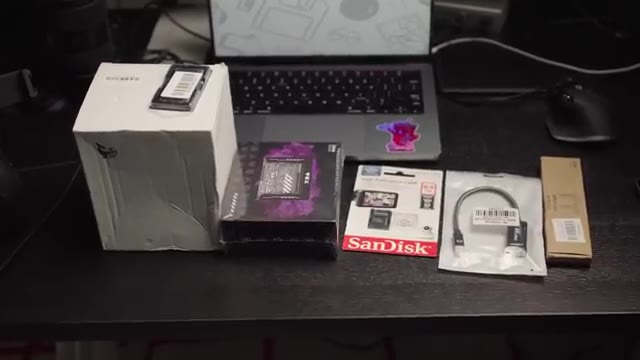
*📸 00:13:22 — Vue d'ensemble des composants matériels déballés pour la création d'un NAS DIY (boîtier SBC Radxa, carte microSD SanDisk High Endurance, adaptateurs et câbles) sur un bureau.*

*📸 00:13:30 — Gros plan sur le boîtier NAS compact assemblé, montrant les connexions réseau et le câblage d'un système de stockage multi-disques basé sur un ordinateur monocarte (SBC).*

---

### ⏱️ `[00:13:38 - 00:14:11]` | Segment #38

**🔊 Audio (Transcription Intégrale Mot pour Mot en Français) :**
> il m'envoie ici le nas kit qui est exactement ce que j'ai besoin pour faire un nas est ce qu'il rend vraiment pratique pour un nas c'est d'avoir cette petite baie ici on peut rentrer des disques en plus d'un câble spécial qui permet non seulement de communiquer avec les disques en sata mais de les alimenter directement. Donc c'est-à-dire que je n'ai pas besoin de câbles supplémentaires. Donc j'utilise ZimaOS, qui est un OS qui est parmi les meilleures OS pour les NAS maintenant. Et dans mon cas, ce qui est assez cool, c'est Nextcloud, qui est vraiment un remplacement à Google Drive, sauf que c'est Selfosted. C'est-à-dire que c'est chez moi, sur mes propres disques, sur mon propre matos. Comme j'ai une bonne connexion chez moi, ça permet très facilement de partager des vidéos avec des monteurs, etc.

**👁️ Analyse Visuelle d'Écran (gemini-3.5-flash-lite) :**
**Interface & Outils** : Matériel Homelab (kit NAS physique), Interface Web Nextcloud.

**Contenu textuel & Code** : Disques durs SATA 2.5", câblage d'alimentation et données, arborescence de fichiers Nextcloud (`All files > youtube > 45-ovh > b-cam`).

**Action / Démonstration** : Présentation physique d'une baie d'extension de stockage avec son câblage d'alimentation directe, puis aperçu de l'interface d'administration de fichiers Nextcloud pour le stockage réseau.

*📸 00:13:46 — Vue rapprochée d'un kit NAS DIY compact (homelab) assemblé, montrant une baie métallique accueillant des disques durs reliés par un câble combiné de données SATA et d'alimentation électrique.*

*📸 00:14:03 — Interface web de la solution de stockage cloud open-source Nextcloud, montrant l'arborescence de fichiers et de dossiers d'un serveur personnel.*

---

### ⏱️ `[00:14:11 - 00:14:26]` | Segment #39

**🔊 Audio (Transcription Intégrale Mot pour Mot en Français) :**
> Toutes ces petites astuces, ces petites crevardises bout à bout, ça nous mène quand même à une économie annuelle de 2774 dollars. Tout ça pour soit exactement le même service, soit un service équivalents, soit des services qui sont mieux. Donc même si ça m'a pris un petit peu de temps, je trouve que ça valait quand même le coup.

**👁️ Analyse Visuelle d'Écran (gemini-3.5-flash-lite) :**
**Interface & Outils** : Aucune interface technique n'est affichée dans cette séquence.

**Contenu textuel & Code** : Aucun code, terminal, métrique système ou architecture cloud n'est visible.

**Action / Démonstration** : Le créateur résume de manière globale et face-caméra les bénéfices financiers obtenus grâce aux optimisations d'infrastructure et d'hébergement présentées précédemment.

---

