# 🎬 Des millions d'apps javascript infectées mais bizarement presque aucune victimes 🤔

> **Chaîne** : [cocadmin](https://www.youtube.com/@cocadmin)  
> **Lien YouTube** : [https://www.youtube.com/watch?v=xRmxnWNR9Sk](https://www.youtube.com/watch?v=xRmxnWNR9Sk)  
> **Date de publication** : 20250915  
> **Durée** : 00:13:10  
> **Identifiant vidéo** : `xRmxnWNR9Sk`  
> **Transcription & Analyse** : `whisper-v3-large-turbo+gemini-3.5-flash-lite`  

---

## 📌 Synthèse Exécutive & Outils

### 💡 Résumé

Une des plus importantes attaques par chaîne d'approvisionnement (*supply chain attack*) de l'écosystème JavaScript a frappé le gestionnaire de paquets NPM, compromettant des packages ultra-populaires cumulant plus de 2 milliards de téléchargements hebdomadaires. Maintenus par le développeur connu sous le pseudonyme de Kix (Josh), des modules fondamentaux tels que `chalk`, `debug`, ou encore `strip-ansi` ont vu leur code source détourné à la suite d'une campagne de phishing ciblée. En usurpant l'identité visuelle et textuelle de NPM via un domaine frauduleux subtil (`npmjs.help`), les attaquants ont piégé le mainteneur pour récolter ses identifiants et son authentification multifacteur (MFA).

Une fois les accès compromis, les scripts de build et de publication ont été corrompus par l'injection d'un code malveillant lourdement obfusqué. Ce malware ciblait spécifiquement les environnements d'exécution front-end interactifs pour intercepter et modifier à la volée les requêtes réseaux (`fetch`, `XMLHttpRequest`) ou les API du plugin Metamask (`window.ethereum`). Son objectif chirurgical : détourner les transactions en cryptomonnaies (Bitcoin, Ethereum, etc.) en remplaçant dynamiquement les adresses des portefeuilles cibles par celles de l'attaquant, tout en générant de fausses adresses visuellement similaires pour tromper la vigilance des utilisateurs finaux.

Malgré l'ampleur industrielle de la diffusion — des dizaines de millions d'applications et de sites web potentiellement infectés en l'espace de quelques heures —, le bilan financier est resté infime (environ 900 dollars dérobés). Cette asymétrie s'explique par un concours de circonstances strict requis pour activer la charge utile : l'application infectée devait être compilée et déployée durant la courte fenêtre de vulnérabilité, exécutée dans un navigateur client, et intégrer des fonctionnalités de transfert de crypto-actifs au moment précis de la visite d'un utilisateur malchanceux. Cet incident rappelle de manière critique aux ingénieurs DevOps et SysAdmins la fragilité systémique des dépendances NPM et la nécessité absolue de verrouiller la chaîne logistique logicielle par l'automatisation et l'audit continu.

---

### 🛠️ Outils, Modèles & Logiciels Présentés

* **NPM (Node Package Manager)** : Le registre officiel et gestionnaire de paquets de référence pour l'écosystème JavaScript et Node.js, au cœur de la vulnérabilité de la chaîne d'approvisionnement exploitée.
* **Chalk** : Package utilitaire NPM extrêmement populaire (>300 millions de téléchargements hebdomadaires) servant à coloriser les sorties textuelles dans la console.
* **Debug** : Bibliothèque standard de journalisation JavaScript (>300 millions de téléchargements hebdomadaires) massivement réutilisée à travers plus de 55 000 packages dépendants.
* **Metamask** : Extension de navigateur populaire agissant comme un portefeuille Ethereum et injectant l'objet global `window.ethereum` dans les pages web.
* **SBOM (Software Bill of Materials / via `npm sbom`)** : Standard et commande d'inventaire logiciel permettant de cartographier de manière exhaustive l'ensemble des composants, dépendances et versions imbriquées composant une application.

---

### 🔑 Points Clés & Enseignements Stratégiques

1. **La menace de la supply chain logicielle** : Nos applications modernes reposent sur un arbre de dépendances profond et modulaire où un seul package de bas niveau compromis (comme `debug`) contamine par ricochet des dizaines de milliers de projets en aval.
2. **L'efficacité redoutable du phishing d'identité** : Les attaquants n'exploitent plus uniquement des failles logicielles zero-day, mais ciblent directement l'humain (les mainteneurs de paquets) à l'aide d'eaux-de-vie techniques sophistiquées imitant à la perfection les communications de services tiers.
3. **Le piège des domaines homoglyphes** : L'utilisation d'un domaine frauduleux enregistré légitimement (`npmjs.help` vs `npmjs.com`) permet de contourner les filtres anti-spam traditionnels et de berner des développeurs pourtant avertis.
4. **La fragilité du MFA mal implémenté** : Recevoir une notification demandant de « mettre à jour son multifacteur » est une incohérence de sécurité critique, le MFA n'ayant pas de date d'expiration périodique nécessitant une ré-authentification sur un lien externe.
5. **Techniques d'obfuscation de code** : L'injection de charges malveillantes passe systématiquement par du code JavaScript obfusqué et étalé pour échapper à une revue de code visuelle superficielle lors d'un déploiement rapide.
6. **Malware contextuel et furtif** : Le script malveillant analysé vérifie la présence d'environnements spécifiques (comme l'objet `window.ethereum`) pour s'activer uniquement dans le navigateur de l'utilisateur final et rester invisible dans les backends Node.js.
7. **Détournement dynamique des flux financiers** : Plutôt que de détruire les données ou de miner de la crypto de manière inefficace, le malware réécrit les fonctions natives (`fetch`, `XHR`) pour falsifier les adresses de destination des portefeuilles cryptographiques au niveau réseau.
8. **Algorithme de similarité d'adresses** : Le malware utilise une logique avancée pour sélectionner, parmi une liste de portefeuilles attaquants, celui dont les premiers et derniers caractères ressemblent le plus à l'adresse originale afin d'éviter les doutes de la victime.
9. **Le facteur temps comme bouclier partiel** : La correction ultra-rapide par le mainteneur et le support NPM a réduit la fenêtre d'exposition à quelques heures, limitant drastiquement le nombre de victimes malgré des milliards de téléchargements théoriques.
10. **L'écart entre exposition et impact réel** : Une attaque d'envergure globale ne se traduit pas nécessairement par des dégâts massifs si les conditions d'exécution de la charge utile (interaction client + features crypto + timing de déploiement) ne sont pas simultanément réunies.
11. **Nécessité absolue d'outils de traçabilité** : L'intégration d'un inventaire rigoureux des composants via des SBOM (Software Bill of Materials) devient une obligation pour les équipes DevOps afin de auditer instantanément le code tiers exécuté en production.
12. **Surveillance automatisée des registres** : Mettre en place des pipelines CI/CD capables de détecter des divergences suspectes entre le code source versionné sur GitHub et le code réellement publié sur le registre NPM permet de stopper net les attaques automatisées.

---

## ⏱️ Chronologie & Transcription Complète Audio & Visuelle (Mot pour Mot)

### ⏱️ `[00:00:00 - 00:00:25]` | Segment #01

**🔊 Audio (Transcription Intégrale Mot pour Mot en Français) :**
> Hier, il y a eu une des plus grosses attaques sur le repository NPM qui a touché des packages qui ont des milliards de téléchargements chaque semaine qui hébergent les dépendances que toutes les applications de JavaScript utilisent. Donc il y a potentiellement des millions de sites web qui ont été infectés par ce malware et pourtant il y a eu très très peu de victimes et donc on va voir pourquoi. Donc tout commence avec Josh qui est connu sur le nom de Kix et c'est le maintainer, c'est lui qui s'occupe de tous ces packages là qu'on a sur Node.js et ces packages, ils sont quand même beaucoup utilisés.

**👁️ Analyse Visuelle d'Écran (gemini-3.5-flash-lite) :**
**Interface & Outils** : Navigateur web affichant un article d'analyse de sécurité (Observations / Supply-Chain Attack).

**Contenu textuel & Code** : Texte technique décrivant l'attaque de la chaîne d'approvisionnement NPM, mentionnant le compromis du compte du développeur qix et les packages touchés (chalk, strip-ansi, color-convert).

**Action / Démonstration** : Présentation et analyse d'un rapport de cyber-sécurité concernant une attaque majeure sur le repository NPM.

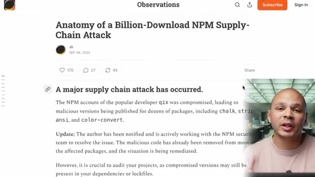
*📸 00:00:06 — Article de blog technique intitulé "Anatomy of a Billion-Download NPM Supply-Chain Attack" détaillant la compromission du compte du développeur qix.*

---

### ⏱️ `[00:00:25 - 00:00:44]` | Segment #02

**🔊 Audio (Transcription Intégrale Mot pour Mot en Français) :**
> Parce que si on regarde juste certains de ces packages, Il y a par exemple Chalk qui est à 300 millions de téléchargements par semaine, Strip on Sea, 260 millions, 193 millions, on a Debug aussi qui est à plus de 300 millions. Et donc si on fait le total juste pour cet utilisateur-là, c'est déjà plus de 2 milliards de téléchargements par semaine. Si on fait un petit calcul rapide, ça fait quand même 12 millions de téléchargements par heure.

**👁️ Analyse Visuelle d'Écran (gemini-3.5-flash-lite) :**
**Interface & Outils** : Navigateur web / page de documentation ou article technique.

**Contenu textuel & Code** : Liste de packages JavaScript avec le nombre de téléchargements hebdomadaires (ex: chalk à ~300 millions).

**Action / Démonstration** : Présentation des statistiques d'utilisation des packages pour illustrer leur criticité et l'impact d'une faille potentielle.

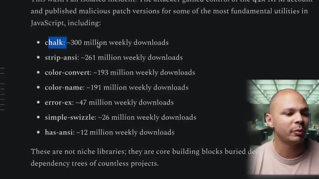
*📸 00:00:30 — Capture d'écran montrant une page web listant des packages npm avec leurs statistiques de téléchargement hebdomadaires (chalk, strip-ansi, color-convert, etc.).*

---

### ⏱️ `[00:00:44 - 00:01:05]` | Segment #03

**🔊 Audio (Transcription Intégrale Mot pour Mot en Français) :**
> Donc même si le malware a été supprimé très très rapidement, c'est quand même potentiellement des dizaines de millions d'applications qui vont être infectées. Mais il n'y a pas que Kix qui a été attaqué. Il y a pas mal d'autres utilisateurs qui ont reçu la même attaque, dont DuckDB, qui sont des packages pour utiliser une bâche de données, où il y a tous leurs packages aussi qui ont été infectés par ce mail malware. Donc à prendre Debug comme exemple pour regarder ce malware, c'est un des plus gros packages.

**👁️ Analyse Visuelle d'Écran (gemini-3.5-flash-lite) :**
**Interface & Outils** : Navigateur web affichant une interface GitHub (onglet Security / Advisory GHSA-w62p-hx95-gf2c).

**Contenu textuel & Code** : Tableau listant les packages NPM compromis (@duckdb/duckdb-wasm, @duckdb/node-api, @duckdb/node-bindings, duckdb) avec leurs versions affectées, versions corrigées et niveau de sévérité (High).

**Action / Démonstration** : Présentation et explication d'un bulletin d'alerte de sécurité détaillant les versions de packages NPM compromises par du code malveillant.

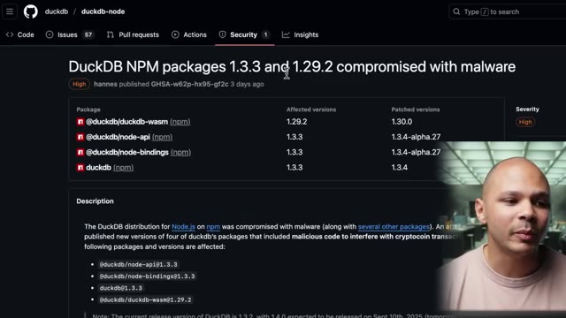
*📸 00:00:54 — Alerte de sécurité GitHub sur le dépôt duckdb/duckdb-node concernant la compromission de packages NPM par un malware.*

---

### ⏱️ `[00:01:05 - 00:01:25]` | Segment #04

**🔊 Audio (Transcription Intégrale Mot pour Mot en Français) :**
> Une partie du problème qui cause ce type d'attaque, qu'on appelle des attaques de supply chain, en français ce serait des attaques de chaînes d'approvisionnement, en fait nos logiciels ont besoin d'autres petits morceaux de logiciels pour fonctionner, en particulier dans JavaScript, parce que c'est un langage qui est très très modulaire. Donc au lieu de tout recoder, l'avantage c'est qu'on peut prendre plein de petits morceaux de code à droite à gauche qui vont tous fonctionner dans mon application.

**👁️ Analyse Visuelle d'Écran (gemini-3.5-flash-lite) :**
**Interface & Outils** : Aucune interface visible

**Contenu textuel & Code** : Aucun code, terminal ou architecture visible

**Action / Démonstration** : Explication théorique sur la modularité de JavaScript et les risques de la supply chain logicielle

---

### ⏱️ `[00:01:26 - 00:01:45]` | Segment #05

**🔊 Audio (Transcription Intégrale Mot pour Mot en Français) :**
> Le gros inconvénient, c'est que ça fait que ce type d'attaque-là est possible parce que, par exemple, on voit ce package-là debug qui sert simplement à ce que notre application puisse écrire des lignes de log de debug avec un petit peu de couleur pour pouvoir les filtrer, etc. Non seulement toutes les applications qui utilisent directement ce package, elles ont été infectées, mais on voit aussi qu'il y a 55 000 dépendants.

**👁️ Analyse Visuelle d'Écran (gemini-3.5-flash-lite) :**
**Interface & Outils** : Navigateur web (Registre npm) et émulateur de terminal Bash macOS.

**Contenu textuel & Code** : Commande d'installation `npm i debug`, statistiques de téléchargements (378M+ par semaine), et sortie de terminal avec des logs colorés (`worker:a doing lots of uninteresting work`).

**Action / Démonstration** : Présentation du package npm 'debug' et démonstration de son utilisation pour afficher des logs colorés dans un terminal.

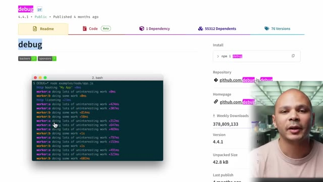
*📸 00:01:30 — Page du registre npm pour le package 'debug' avec un terminal superposé affichant des logs colorés de Node.js.*

---

### ⏱️ `[00:01:45 - 00:02:07]` | Segment #06

**🔊 Audio (Transcription Intégrale Mot pour Mot en Français) :**
> Donc, c'est-à-dire qu'il y a 55 000 autres packages sur NPM qui dépendent de debug. Parmi ces 55 000 packages qui dépendent de debug, il y a encore probablement des millions de packages qui dépendent des packages qui eux-mêmes dépendent de debug. Et ça qui aggrave le problème, c'est qu'on peut utiliser un package qui lui a besoin même d'un package, qui lui va utiliser un autre package, qui ce package là va utiliser debug.

**👁️ Analyse Visuelle d'Écran (gemini-3.5-flash-lite) :**
**Interface & Outils** : Aucune interface ou console active affichée.

**Contenu textuel & Code** : Aucun code, commande ou métrique technique visible.

**Action / Démonstration** : Explication orale du concept de dépendances en cascade dans l'écosystème NPM.

---

### ⏱️ `[00:02:07 - 00:02:30]` | Segment #07

**🔊 Audio (Transcription Intégrale Mot pour Mot en Français) :**
> Donc ça devient très difficile de savoir qu'est-ce qui tourne vraiment dans l'application. Et quand il y a des packages qui sont infectés, très rapidement ça peut infecter comme on voit là des milliards d'applications d'un coup. Donc évidemment, dès que Josh a été mis au courant, il a très rapidement réglé le problème, il a contacté NPM, ils ont enlevé les versions infectées. Mais comme on a vu, juste une heure ou deux avec des versions infectées, ça fait déjà des dizaines de millions de téléchargements potentiels.

**👁️ Analyse Visuelle d'Écran (gemini-3.5-flash-lite) :**
**Interface & Outils** : Interface web GitHub (système de gestion des issues et de suivi des bugs).

**Contenu textuel & Code** : Issue GitHub intitulée "(RESOLVED) Version 4.4.2 published to npm is compromised #1005" avec des commentaires de la communauté et des liens vers d'autres packages compromis (chalk, etc.).

**Action / Démonstration** : Présentation et analyse d'une alerte de sécurité concernant un package open-source npm compromis et potentiellement malveillant (crypto-stealer).

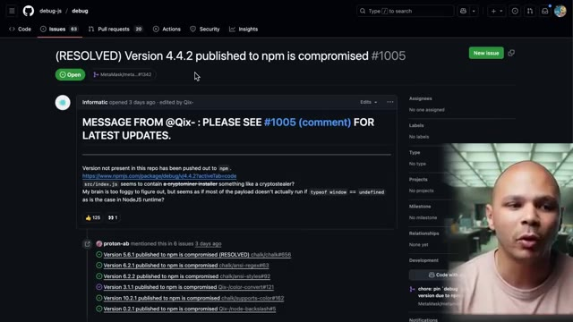
*📸 00:02:18 — Capture d'écran d'une issue GitHub (projet debug-js/debug) signalant qu'une version compromise (4.4.2) a été publiée sur npm.*

---

### ⏱️ `[00:02:30 - 00:02:48]` | Segment #08

**🔊 Audio (Transcription Intégrale Mot pour Mot en Français) :**
> Et donc Josh, il nous explique qu'il a été victime d'une attaque de phishing. Donc tout simplement, il a reçu un email qui ressemble à ça, qui ressemble en tout point à ce qu'il pourrait recevoir d'un email de NPM. Donc là, il a un email support.npm, le petit logo qui lui dit « Ah, il faut que tu mettes à jour ton authentification de facteur. » avec un lien qui mène vers le site.

**👁️ Analyse Visuelle d'Écran (gemini-3.5-flash-lite) :**
**Interface & Outils** : Client de messagerie électronique affichant un e-mail avec un logo NPM stylisé et un lien de mise à jour 2FA.

**Contenu textuel & Code** : Texte d'un e-mail de phishing alertant sur l'expiration des identifiants 2FA et incitant à cliquer sur un lien de mise à jour (« Update 2FA Now »).

**Action / Démonstration** : Analyse et présentation d'un exemple concret d'e-mail de phishing ciblant les développeurs et usurpant la plateforme NPM.

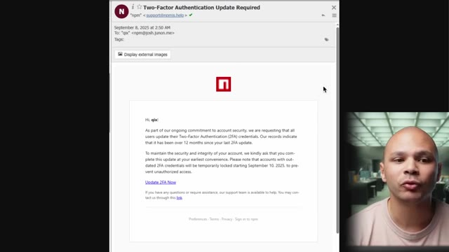
*📸 00:02:34 — Capture d'écran montrant un faux e-mail de phishing usurpant l'identité de NPM, demandant une mise à jour de l'authentification à deux facteurs (2FA).*

---

### ⏱️ `[00:02:48 - 00:03:07]` | Segment #09

**🔊 Audio (Transcription Intégrale Mot pour Mot en Français) :**
> Le problème, c'est que l'adresse email ici, c'est npmjs.help, alors que le vrai domaine, c'est npmjs.com. Sauf que ça passe crème quand même. C'est npmjs.help, ça paraît legit. Et comme c'est un vrai domaine que l'attaqueur a vraiment acheté, a vraiment confirmé, ce n'est pas un email qui est passé en spam. Donc, c'est vraiment passé.

**👁️ Analyse Visuelle d'Écran (gemini-3.5-flash-lite) :**
**Interface & Outils** : Client de messagerie affichant le contenu d'un e-mail de phishing 2FA.

**Contenu textuel & Code** : E-mail intitulé "Two-Factor Authentication Update Required" provenant de "support@npmjs.help" destiné à un utilisateur, avec un lien "Update 2FA Now".

**Action / Démonstration** : Analyse d'un e-mail de phishing ciblant les développeurs npm, mettant en évidence l'utilisation d'un domaine frauduleux mais authentifié (npmjs.help) pour contourner les filtres anti-spam.

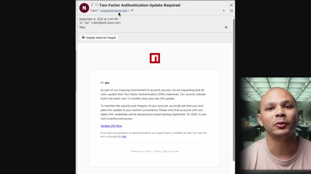
*📸 00:02:53 — Capture d'écran montrant un faux e-mail de phishing usurpant npmjs, avec l'adresse d'expéditeur frauduleuse support@npmjs.help.*

---

### ⏱️ `[00:03:07 - 00:03:27]` | Segment #10

**🔊 Audio (Transcription Intégrale Mot pour Mot en Français) :**
> La première chose qu'aurait pu potentiellement tilter un petit peu, c'est que mettre à jour son multifacteur, ça n'existe pas vraiment. Une fois qu'on a son multifacteur, il n'y a pas de « tous les ans, il faut le mettre à jour ». Mais ça paraît quand même legit parce qu'on reçoit tellement d'emails comme ça, un petit peu automatisés, qu'il faut mettre à jour ci, il y a des attaques qui arrivent tout le temps, parfois il faut changer ses mots de passe, etc. Donc ça paraît comme quelque chose qu'il faudrait faire.

**👁️ Analyse Visuelle d'Écran (gemini-3.5-flash-lite) :**
**Interface & Outils** : Aucune

**Contenu textuel & Code** : Aucun

**Action / Démonstration** : Explication et sensibilisation orale sur les mécanismes d'ingénierie sociale, plus précisément sur l'illégitimité des demandes de mise à jour de l'authentification multifacteur (MFA) souvent utilisées dans les campagnes de phishing.

---

### ⏱️ `[00:03:28 - 00:04:04]` | Segment #11

**🔊 Audio (Transcription Intégrale Mot pour Mot en Français) :**
> Sachant que là aussi, on parle d'un développeur qui n'est pas forcément quelqu'un qui est un expert extrême en sécurité. Et donc, quand il clique sur ce lien, il arrive sur un site qui ressemble exactement comme le site de NPMGS où il doit mettre son login, son mot de passe et son code d'authentification. Ce qui fait que l'attaqueur récupère toutes ces informations. instantanément il va se connecter sur le vrai site npmjs et il va aller modifier tous les packages qui appartiennent à Josh et il va aller chercher directement le fichier index.js et il va rajouter une petite ligne et déployer une nouvelle version du package et donc cette petite ligne elle ressemble à ça là on voit const o x 1 1 1 c'est bizarre sauf qu'en fait cette ligne là quand

**👁️ Analyse Visuelle d'Écran (gemini-3.5-flash-lite) :**
**Interface & Outils** : Aucune (les écrans d'ordinateur présents en arrière-plan font partie du décor et sont totalement flous).

**Contenu textuel & Code** : Aucun (pas de code, pas de terminal de commande ni d'interface technique visible).

**Action / Démonstration** : Explication orale et face-caméra par le créateur de la vidéo concernant une attaque d'ingénierie sociale (hameçonnage/phishing) visant à usurper les identifiants de connexion et jetons MFA d'un développeur via un faux site miroir de registre de paquets (type npm).

---

### ⏱️ `[00:04:04 - 00:04:43]` | Segment #12

**🔊 Audio (Transcription Intégrale Mot pour Mot en Français) :**
> on scroll on voit que la ligne elle scroll pendant un petit moment et donc si on met cette ligne là qu'on la déplie, on se retrouve avec ça. Qui ressemble à rien évidemment, c'est illisible, parce que c'est du code qui est obfusqué, qui est fait exprès pour qu'on puisse pas vraiment du premier coup d'oeil voir qu'est ce qui se passe. Sauf que ce code là contient le code qui permet de l'exécuter donc quelque part il faut que ça le désobfusque. Donc on peut quand même, si on inspecte un petit peu, on peut savoir qu'est ce qui s'est passé. Si on le désobfusque, ce qui n'est pas très difficile à faire, on se retrouve avec ce code là. Mais on commence à voir qu'on a des check Ethereum, on a des windows.Ethereum etc. On commence à voir que c'est bizarre. Déjà du

**👁️ Analyse Visuelle d'Écran (gemini-3.5-flash-lite) :**
**Interface & Outils** : Éditeur de code ou IDE affichant du code obfusqué.

**Contenu textuel & Code** : Code JavaScript hautement obfusqué avec un tableau de chaînes de caractères chiffrées/encodées et des fonctions de désobfuscation complexes.

**Action / Démonstration** : Analyse et explication de code source obfusqué pour en démontrer l'illisibilité et la complexité au premier coup d'œil.

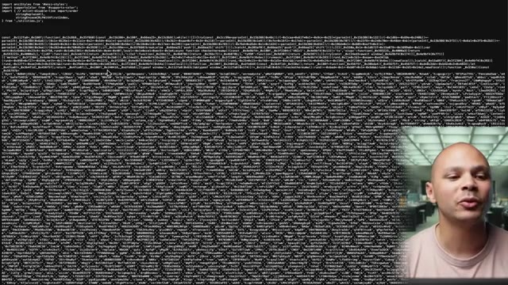
*📸 00:04:14 — Affichage d'un extrait de code source extrêmement long et obfusqué en JavaScript, avec le créateur en incrustation vidéo en bas à droite.*

---

### ⏱️ `[00:04:43 - 00:05:18]` | Segment #13

**🔊 Audio (Transcription Intégrale Mot pour Mot en Français) :**
> code opusqué c'était déjà ultra bizarre mais là maintenant on commence à comprendre qu'est ce qui se passe. Ça a un rapport avec les cryptos, peut-être que ça va miner de la crypto ou peut-être que ça va essayer de nous voler nos Ethereum ou nos bitcoins. Donc il y a des chercheurs en cybersécurité qui ont inspecté un petit peu ce malware pour savoir comment est ce qu'il fonctionne. La première chose qu'il fait c'est qu'il regarde si windows.Ethereum existe. Donc là le package il a été mis dans notre application et notre application peut être que c'est une application backend donc si notre application elle est dans le backend, Windows ça n'existe pas. Donc déjà ça permet de vérifier si on tourne dans un navigateur ou pas et Windows.Ethereum c'est ce qui est utilisé par Metamask.

**👁️ Analyse Visuelle d'Écran (gemini-3.5-flash-lite) :**
**Interface & Outils** : Schéma technique / diagramme logique au format ASCII Art.

**Contenu textuel & Code** : - Étape initiale : "Code Execution Starts"
- Condition de détection : "Checks if window.ethereum (e.g., MetaMask) exists"
- Branche d'exécution positive : appel de la fonction `checkethereumw()` pour interroger les comptes disponibles ("Requests wallet accounts").
- Branche d'exécution alternative : appel direct de la fonction `newdlocal()`.

**Action / Démonstration** : Analyse du mécanisme d'attaque d'un malware Web3 qui tente de détecter la présence d'extensions de portefeuilles crypto afin de compromettre les clés d'accès ou de siphonner les actifs numériques (Ethereum/Bitcoin).

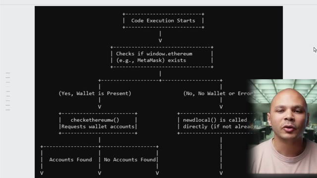
*📸 00:05:00 — Diagramme de flux logique en art ASCII détaillant les étapes d'exécution d'un malware ciblant l'API Web3 'window.ethereum' pour détecter et intercepter les portefeuilles de cryptomonnaies (MetaMask).*

---

### ⏱️ `[00:05:18 - 00:05:36]` | Segment #14

**🔊 Audio (Transcription Intégrale Mot pour Mot en Français) :**
> C'est un plugin Chrome qui permet de faire des transactions Ethereum etc. Si ça trouve que Metamask est installé dans le navigateur et bien ça va regarder s'il y a des comptes, s'il y a des wallets qui sont dans Metamask. Si c'est le cas, ça va renair ici le runmask, la fonction run mask, et ce qu'elle va faire ici c'est qu'elle va écraser les fonctions request et send de Metamask.

**👁️ Analyse Visuelle d'Écran (gemini-3.5-flash-lite) :**
**Interface & Outils** : Présentation graphique textuelle (diagramme d'architecture et documentation de code).

**Contenu textuel & Code** : Logique conditionnelle vérifiant la présence de window.ethereum, checkethereumw(), runmask() pour le détournement de transaction (Transaction Hijacking), et le vecteur d'attaque par "Passive Address Swapping".

**Action / Démonstration** : Explication de l'analyse comportementale d'un plugin malveillant ciblant les portefeuilles cryptographiques et modifiant les transactions d'une manière transparente pour l'utilisateur.

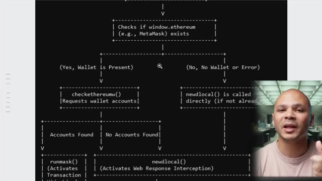
*📸 00:05:22 — Diagramme ASCII représentant l'organigramme de vérification et d'interception du portefeuille MetaMask (window.ethereum).*

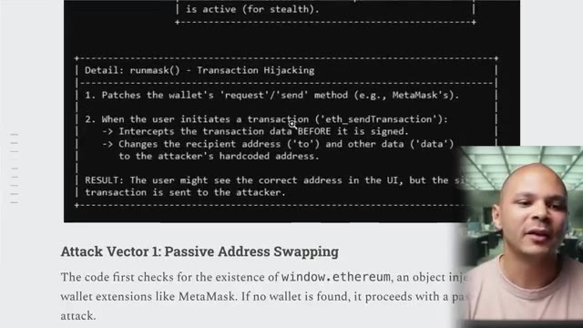
*📸 00:05:32 — Documentation textuelle décrivant le fonctionnement détaillé de la fonction runmask() et l'attaque par substitution d'adresse.*

---

### ⏱️ `[00:05:36 - 00:06:00]` | Segment #15

**🔊 Audio (Transcription Intégrale Mot pour Mot en Français) :**
> C'est à dire que si en nous en tant qu'utilisateur on va sur un site qui est infecté par ce malware, ça va écraser les fonctions envoyer et recevoir de notre Metamask pour pouvoir modifier l'adresse du destinataire. Ce qui fait que si on envoie des cryptos avec Metamask, et bien ça va changer l'adresse de destination pour l'envoyer à l'attaqueur. Donc c'est lui qui va recevoir les cryptos à la place. Si jamais il n'y a pas Metamask, et que pas malchance le site qui a été infecté permet à l'utilisateur de gérer des cryptos d'une manière ou d'une autre.

**👁️ Analyse Visuelle d'Écran (gemini-3.5-flash-lite) :**
**Interface & Outils** : Aucune

**Contenu textuel & Code** : Aucun

**Action / Démonstration** : Explication orale du fonctionnement d'un malware ciblant les extensions de portefeuille de crypto-monnaie (MetaMask).

---

### ⏱️ `[00:06:00 - 00:06:19]` | Segment #16

**🔊 Audio (Transcription Intégrale Mot pour Mot en Français) :**
> Ça va écraser les fonctions fetch et xmlhtp request. Ces deux fonctions, elles permettent au navigateur de faire des requêtes vers l'internet. En écrasant ces deux fonctions, ça va faire que le navigateur, à chaque fois qu'il va envoyer une requête vers internet, il va regarder s'il y a des champs qui correspondent à un wallet bitcoin, ou un wallet Ethereum, ou un wallet de crypto.

**👁️ Analyse Visuelle d'Écran (gemini-3.5-flash-lite) :**
**Interface & Outils** : Présentation ou face-caméra sans interface informatique partagée.

**Contenu textuel & Code** : Explications orales des concepts, architectures et retours d'expérience.

**Action / Démonstration** : Démonstration pédagogique et mise en perspective technique.

---

### ⏱️ `[00:06:20 - 00:06:42]` | Segment #17

**🔊 Audio (Transcription Intégrale Mot pour Mot en Français) :**
> Et si c'est le cas, ça va modifier le champ destinataire, encore une fois, pour que l'attaqueur reçoive l'argent au lieu du destinataire. Ce qui est très très vicieux parce que dans l'interface du site web, on va même pas voir que ça a envoyé quelqu'un d'autre parce que c'est juste au niveau de l'appel réseau que la modification va être faite. Ce qui fait que c'est encore plus vicieux c'est que si on regarde dans le code ici il n'y a pas un seul wallet de destination il y en a plein et il y en a plein pour différentes cryptos.

**👁️ Analyse Visuelle d'Écran (gemini-3.5-flash-lite) :**
**Interface & Outils** : Éditeur de code (type IDE/éditeur de texte sur fond sombre).

**Contenu textuel & Code** : Lignes de code contenant des listes de chaînes de caractères entre guillemets simples (potentiellement des adresses de portefeuilles ou des hachages cryptographiques).

**Action / Démonstration** : Présentation d'un script ou de données textuelles lors de l'explication d'une vulnérabilité liée à la manipulation de données.

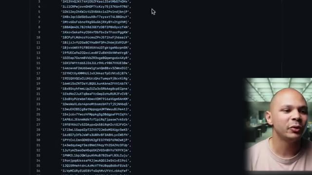
*📸 00:06:36 — Affichage d'un éditeur de code avec une liste de chaînes de caractères alphanumériques et de clés ou adresses potentielles.*

---

### ⏱️ `[00:06:42 - 00:07:02]` | Segment #18

**🔊 Audio (Transcription Intégrale Mot pour Mot en Français) :**
> Là ici c'est du bitcoin, là je sais pas BC ça doit être du bitcoin cash ou quelque chose comme ça OX la cellule du Ethereum etc etc. Et ce que ça fait c'est que ça va utiliser un algorithme pour pouvoir comparer l'adresse de destination originale et pouvoir choisir un des wallets ici qui correspond à la crypto qu'on va utiliser et qui match le plus avec l'adresse originale pour que ça ressemble le plus.

**👁️ Analyse Visuelle d'Écran (gemini-3.5-flash-lite) :**
**Interface & Outils** : Aucune interface ou console technique affichée.

**Contenu textuel & Code** : Aucun code, commande ou métrique visible.

**Action / Démonstration** : Explication orale et gestuelle du fonctionnement d'un algorithme de sélection de wallets de cryptomonnaies.

---

### ⏱️ `[00:07:02 - 00:07:21]` | Segment #19

**🔊 Audio (Transcription Intégrale Mot pour Mot en Français) :**
> Et donc, si on vérifie que j'ai de fait, on regarde juste les 2-3 derniers caractères, il y a une chance que ça match avec certains des wallets qui sont là-dedans. Donc, c'est vraiment le top du vice. Donc, qui s'est fait carotte ? Qui a été affecté dans l'histoire ? Eh bien, en fait, pas tant de monde. Parce que comme les transactions en crypto sont publiques, on peut voir les transactions qui ont été faites.

**👁️ Analyse Visuelle d'Écran (gemini-3.5-flash-lite) :**
**Interface & Outils** : Présentation ou face-caméra sans interface informatique partagée.

**Contenu textuel & Code** : Explications orales des concepts, architectures et retours d'expérience.

**Action / Démonstration** : Démonstration pédagogique et mise en perspective technique.

---

### ⏱️ `[00:07:21 - 00:07:45]` | Segment #20

**🔊 Audio (Transcription Intégrale Mot pour Mot en Français) :**
> Il se trouve qu'il a récupéré 441 dollars en Ethereum et un petit peu plus de 480 dollars en chiccoin à la con, on sait pas trop ce que c'est. Potentiellement qu'en Ethereum pur, il y aurait juste une personne ici qui serait fait carotte, qui serait fait carotte 400 balles. Donc c'est dommage pour cette personne, mais pour une attaque de cette ampleur qui a affecté des dizaines de millions de sites, ça paraît vraiment un miracle que ça soit pas plus que ça.

**👁️ Analyse Visuelle d'Écran (gemini-3.5-flash-lite) :**
**Interface & Outils** : Explorateur de blockchain (type Etherscan)

**Contenu textuel & Code** : Solde ETH de 0,100011001 ETH (valeur de 441,91$), avoirs en tokens de 486,47$ (8 token contracts), et liste des transactions récentes avec hash, méthode et horodatage.

**Action / Démonstration** : Analyse et affichage des fonds subtilisés sur l'adresse d'un acteur malveillant lié à une attaque sur le gestionnaire de paquets NPM.

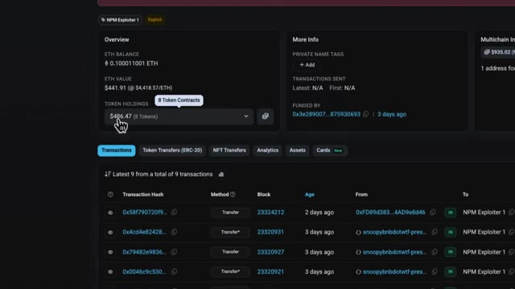
*📸 00:07:27 — Interface d'un explorateur de blockchain affichant le solde d'une adresse identifiée comme 'NPM Exploiter 1', avec le détail des avoirs en Ethereum et en tokens ainsi que l'historique des transactions récentes.*

---

### ⏱️ `[00:07:45 - 00:08:16]` | Segment #21

**🔊 Audio (Transcription Intégrale Mot pour Mot en Français) :**
> Donc ce qui fait à mon avis que ça a pas affecté tant de personnes que ça, c'est que ça a affecté plein plein plein de sites, mais il faut que ce soit un site qui ait des services de crypto, on peut envoyer et recevoir des cryptos, et il faut que ce site-là ait eu pile poil un déploiement dans cette tranche-là pendant les 2-3 heures où la version infectée des dépendances était disponible. Ou alors qu'il y a un site qui ait eu cette version infectée et qui ait été déployé pareil dans ces 2-3 heures-là et que quelqu'un qui n'a vraiment pas de chance ait été sur un site infecté et ait utilisé Metamask à ce moment-là précis.

**👁️ Analyse Visuelle d'Écran (gemini-3.5-flash-lite) :**
**Interface & Outils** : Aucune interface active ou exploitable.

**Contenu textuel & Code** : Aucun code, commande ou architecture visible.

**Action / Démonstration** : Explication verbale du contexte d'un incident de déploiement par le créateur.

---

### ⏱️ `[00:08:16 - 00:08:37]` | Segment #22

**🔊 Audio (Transcription Intégrale Mot pour Mot en Français) :**
> Ça ne veut pas forcément dire qu'il y a des millions de sites qui sont allés en prod avec cette version infectée. Il faut qu'il y ait quand même un bon concours de circonstances pour que quelqu'un se fasse carotte ses cryptos. Donc on se dit vraiment, l'attaqueur quelque part il est un peu con parce qu'il aurait fait n'importe quoi d'autre comme type d'attaque. Il aurait gagné largement plus que 500$. Il aurait juste miné des cryptos dans le navigateur ou il aurait essayé de récupérer des informations de je sais pas trop quoi.

**👁️ Analyse Visuelle d'Écran (gemini-3.5-flash-lite) :**
**Interface & Outils** : Aucun outil, terminal ou interface pertinente affiché.

**Contenu textuel & Code** : Aucun code, commande ou architecture visible.

**Action / Démonstration** : Explication orale de l'intervenant concernant un scénario d'attaque informatique et la probabilité d'exploitation.

---

### ⏱️ `[00:08:38 - 00:08:56]` | Segment #23

**🔊 Audio (Transcription Intégrale Mot pour Mot en Français) :**
> Ça aurait été mille fois plus rentable que ça. Donc en fait quelque part c'est vraiment malo pour lui. Donc au final tout a été résolu très très rapidement en quelques heures. Le package qui a été uploadé sur NPM n'est pas le même que le code qu'on trouve sur GitHub. Donc c'est quelque chose qui est quand même cramé assez rapidement. Et c'est même quelque chose qu'on peut facilement automatiser pour voir quand ça arrive.

**👁️ Analyse Visuelle d'Écran (gemini-3.5-flash-lite) :**
**Interface & Outils** : AUCUNE

**Contenu textuel & Code** : AUCUN

**Action / Démonstration** : Explication orale du créateur concernant un incident de sécurité sur des packages NPM.

---

### ⏱️ `[00:08:56 - 00:09:15]` | Segment #24

**🔊 Audio (Transcription Intégrale Mot pour Mot en Français) :**
> Donc c'est pour ça que ça a été vu et corrigé assez rapidement. Et donc comment est-ce qu'on peut faire pour éviter que ça arrive ? Donc ça dépend pour qui. Pour les développeurs qui utilisent JavaScript, ils peuvent déjà utiliser une commande qui s'appelle NPM SBOM. SBOM pour Software Bills of Materials. La Bills of Materials, c'est quand on a un produit, tous les composants du produit, combien est-ce qu'ils coûtent ?

**👁️ Analyse Visuelle d'Écran (gemini-3.5-flash-lite) :**
**Interface & Outils** : Présentation ou face-caméra sans interface informatique partagée.

**Contenu textuel & Code** : Explications orales des concepts, architectures et retours d'expérience.

**Action / Démonstration** : Démonstration pédagogique et mise en perspective technique.

---

### ⏱️ `[00:09:15 - 00:09:38]` | Segment #25

**🔊 Audio (Transcription Intégrale Mot pour Mot en Français) :**
> Là, dans le Software Bills of Materials, c'est pour pouvoir nous dire, dans notre logiciel, qu'est-ce qu'il y a dedans ? Quelles sont les dépendances de dépendance, de sous-dépendance qu'il y a, quelle est la totalité du code qui tourne dans mon application ? Parce que ce n'est pas évident à voir, vu qu'on a des sous-dépendances de sous-dépendance de sous-dépendance. Et avec cette liste-là, on peut déjà commencer à optimiser un petit peu, se dire, ok, bon, il y a peut-être des choses que je n'ai pas forcément besoin, peut-être d'essayer de limiter un petit peu ces dépendances.

**👁️ Analyse Visuelle d'Écran (gemini-3.5-flash-lite) :**
**Interface & Outils** : AUCUNE

**Contenu textuel & Code** : AUCUNE

**Action / Démonstration** : Explication orale et pédagogique sur l'importance du SBOM et de la gestion des sous-dépendances en développement logiciel.

---

### ⏱️ `[00:09:38 - 00:10:06]` | Segment #26

**🔊 Audio (Transcription Intégrale Mot pour Mot en Français) :**
> Et deuxièmement, ensuite, on peut faire un audit sur toutes nos dépendances pour pouvoir s'assurer que, ok, toutes ces versions-là, on les a auditées, on sait qu'il n'y a pas trop de trucs bizarres dedans, donc on peut l'utiliser. Une fois qu'on sait ça, on peut utiliser les overrides dans notre package.json pour pouvoir figer les versions des dépendances qu'on a auditées, qu'on sait qu'elles sont bien. On peut aussi décider de tout le temps figer les dépendances dans nos repos, mais souvent dans les versions mineures, on a des corrections de sécurité, des choses comme ça.

**👁️ Analyse Visuelle d'Écran (gemini-3.5-flash-lite) :**
**Interface & Outils** : Documentation technique web (navigateur) / Documentation officielle npm.

**Contenu textuel & Code** : Blocs de code JSON illustrant l'utilisation de la propriété "overrides" dans le package.json pour forcer des versions spécifiques de paquets (ex: "foo": "1.0.0").

**Action / Démonstration** : Explication de l'utilisation des overrides dans npm pour figer et contrôler les versions des dépendances imbriquées.

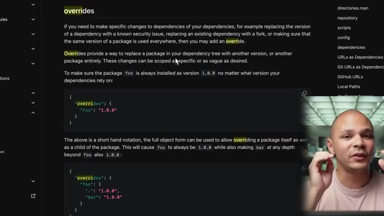
*📸 00:09:52 — Documentation officielle affichant la section "overrides" de npm avec des exemples de configuration JSON pour fixer les versions de dépendances.*

---

### ⏱️ `[00:10:06 - 00:10:28]` | Segment #27

**🔊 Audio (Transcription Intégrale Mot pour Mot en Français) :**
> Donc oui, figer ça peut aider, mais d'un autre côté, ça peut nous desservir parce qu'on peut potentiellement louper des patches de sécurité sur nos milliards de dépendances. Donc on voit que c'est un problème qui n'est pas facile à régler, en particulier dans NPM. Donc c'est un type d'attaque qui peut évidemment exister dans d'autres langages, mais dans Node.js en particulier, c'est tellement modulaire.

**👁️ Analyse Visuelle d'Écran (gemini-3.5-flash-lite) :**
**Interface & Outils** : Présentation ou face-caméra sans interface informatique partagée.

**Contenu textuel & Code** : Explications orales des concepts, architectures et retours d'expérience.

**Action / Démonstration** : Démonstration pédagogique et mise en perspective technique.

---

### ⏱️ `[00:10:29 - 00:10:48]` | Segment #28

**🔊 Audio (Transcription Intégrale Mot pour Mot en Français) :**
> C'est un langage qui inclut très très peu de choses par défaut, ce qui fait que pour faire la moindre chose, on est tout le temps tenté ou obligé de récupérer des dépendances. Et donc ça aggrave le problème parce que ces dépendances-là aussi ont le même problème et donc récupère plein d'autres dépendances. Et donc, ça devient très difficile de savoir qu'est-ce qui tourne vraiment dans notre application. Donc, c'est moins un problème dans les autres langages parce qu'il y a plus de choses qui sont intégrées par défaut.

**👁️ Analyse Visuelle d'Écran (gemini-3.5-flash-lite) :**
**Interface & Outils** : Présentation ou face-caméra sans interface informatique partagée.

**Contenu textuel & Code** : Explications orales des concepts, architectures et retours d'expérience.

**Action / Démonstration** : Démonstration pédagogique et mise en perspective technique.

---

### ⏱️ `[00:10:48 - 00:11:09]` | Segment #29

**🔊 Audio (Transcription Intégrale Mot pour Mot en Français) :**
> Et donc, on a moins besoin d'apporter de choses. Et dans ce qu'on apporte, il y a moins de choses aussi qui sont importées. Et donc, ça contient un petit peu le blast radius, comme on dit. Le rayon d'explosion. Donc, potentiellement, le vrai fixe, ça serait de ne pas utiliser le package registre, ce qui n'est pas vraiment faisable en ODS. Ou potentiellement, de changer de langage si vraiment c'est quelque chose qui est critique pour nous.

**👁️ Analyse Visuelle d'Écran (gemini-3.5-flash-lite) :**
**Interface & Outils** : Présentation ou face-caméra sans interface informatique partagée.

**Contenu textuel & Code** : Explications orales des concepts, architectures et retours d'expérience.

**Action / Démonstration** : Démonstration pédagogique et mise en perspective technique.

---

### ⏱️ `[00:11:09 - 00:11:33]` | Segment #30

**🔊 Audio (Transcription Intégrale Mot pour Mot en Français) :**
> Ensuite, pour les utilisateurs de crypto, parce que c'est eux qui prennent cher à chaque fois, utiliser un hardware wallet, donc ça va être un appareil physique sur lequel on va voir la transaction. Donc en gros, la clé de chiffrement, elle va être dans l'appareil, donc elle ne va jamais être sur ton ordinateur. Donc même si ton ordinateur se fait hacker, ton navigateur se fait hacker, etc., la clé n'est pas dedans. Et en plus de ça, dans le hardware wallet, tu vois, quand tu fais une transaction, c'est le wallet qui va signer la transaction.

**👁️ Analyse Visuelle d'Écran (gemini-3.5-flash-lite) :**
**Interface & Outils** : Navigateur web (Google Images)

**Contenu textuel & Code** : Résultats de recherche d'images montrant différents types de portefeuilles matériels (Ledger, Trezor, etc.)

**Action / Démonstration** : Illustration visuelle du concept de "hardware wallet" via une recherche d'exemples de portefeuilles physiques pour appuyer l'explication sur la sécurité des clés de chiffrement.

*📸 00:11:15 — Navigateurs web affichant une recherche d'images Google sur le terme "hardware wallet" avec incrustation du présentateur.*

---

### ⏱️ `[00:11:33 - 00:12:00]` | Segment #31

**🔊 Audio (Transcription Intégrale Mot pour Mot en Français) :**
> Et donc si elle a été altérée, ton ordinateur est complètement vérolé, etc., et l'adresse de destination a été changée, tu la verras sur l'écran de ton appareil. Et donc si tu vérifies bien, tu pourras voir quelque chose qui ne va pas et donc annuler la transaction. Maintenant pour les maintainers, une chose qui aurait pu éviter ça, ça serait d'utiliser un PASKey. Donc un PASKey, c'est une clé que tu vas installer sur un appareil, soit sur un téléphone ou si tu as un laptop, souvent il y a une puce qui est dédiée à ça, qui peut stocker une clé qui va te permettre de te connecter sur tous ces sites-là.

**👁️ Analyse Visuelle d'Écran (gemini-3.5-flash-lite) :**
**Interface & Outils** : Navigateur web affichant la page de documentation de npm.

**Contenu textuel & Code** : Texte explicatif sur le 2FA (Something you know, have, are), les clés de sécurité (YubiKey, Touch ID) et les applications TOTP.

**Action / Démonstration** : Explication des bonnes pratiques de sécurité pour les mainteneurs de packages afin d'éviter les compromissions de comptes.

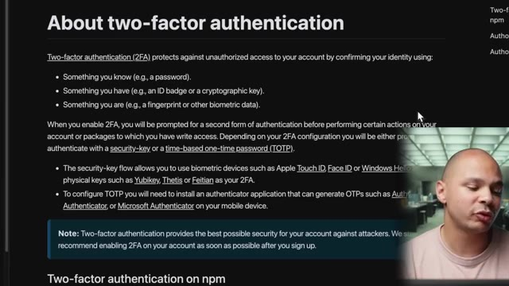
*📸 00:11:53 — Documentation officielle de npm concernant l'authentification à deux facteurs (2FA) pour sécuriser les comptes et les packages.*

---

### ⏱️ `[00:12:00 - 00:12:19]` | Segment #32

**🔊 Audio (Transcription Intégrale Mot pour Mot en Français) :**
> Ou alors tu peux utiliser une YubiKey ou des choses comme ça. Et ça, ça permet d'éviter le phishing. C'est-à-dire que même si tu cliques sur un lien bizarre, même si tu donnes ton login, tu donnes ton mot de passe, tu donnes ton multifakeur d'authentification, comme l'attaqueur n'a pas l'objet physique qui peut être sous forme de clé, sous forme d'un laptop, sous forme de ce que tu veux, il ne peut quand même pas se connecter à ton compte. Donc ça évite toutes ces attaques de phishing-là.

**👁️ Analyse Visuelle d'Écran (gemini-3.5-flash-lite) :**
**Interface & Outils** : Aucun outil, terminal ou logiciel visible.

**Contenu textuel & Code** : Aucun contenu technique (commandes, code, architectures).

**Action / Démonstration** : Explication orale sur l'utilisation des clés de sécurité matérielles (YubiKey) pour contrer le phishing.

---

### ⏱️ `[00:12:19 - 00:12:44]` | Segment #33

**🔊 Audio (Transcription Intégrale Mot pour Mot en Français) :**
> Une autre chose qui peut être utile aussi, c'est d'utiliser des provenance statements. C'est quelque chose qu'on peut rajouter dans le CI-CD de notre code, donc dans notre intégration continue, déploiement continu. Ou là, par exemple, on peut avec GitHub Action signer le processus de build de notre package avant l'upload sur NPM. Ce qui fait que sur NPM, on va pouvoir vérifier par une signature que ce qu'il y a dans NPM, c'est exactement ce qui vient du code qui était dans GitHub.

**👁️ Analyse Visuelle d'Écran (gemini-3.5-flash-lite) :**
**Interface & Outils** : Navigateur web affichant la documentation npmjs.com sur la sécurité et la provenance des packages.

**Contenu textuel & Code** : Extraits de configuration YAML et commandes CLI : `permissions: id-token: write`, `runs-on: ubuntu-latest`, et `npm publish --provenance`.

**Action / Démonstration** : Présentation et explication de la configuration requise dans GitHub Actions pour ajouter des déclarations de provenance lors de la publication de packages NPM.

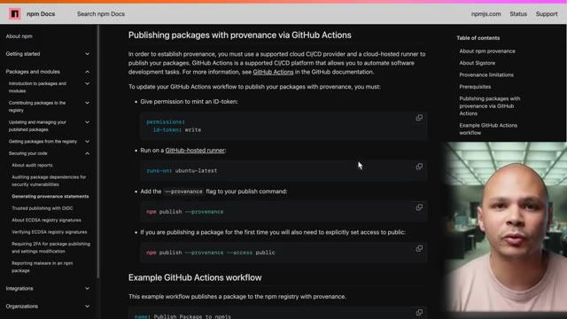
*📸 00:12:25 — Documentation officielle NPM affichant le guide pour publier des packages avec des déclarations de provenance via GitHub Actions.*

---

### ⏱️ `[00:12:44 - 00:13:05]` | Segment #34

**🔊 Audio (Transcription Intégrale Mot pour Mot en Français) :**
> Et donc, ça évite ces attaques de supply chain comme on a vu aujourd'hui. Ou du moins, ça évite une partie parce que comme on a vu, il y a aussi des attaques de supply chain qui permettent d'attaquer directement le repo, donc le repo GitHub. Et donc, à partir de ce moment-là, bon, ça aide un petit peu moins. Cette histoire me fait penser à une autre attaque de supply chain et qui était cette fois carrément sur le kernel Linux et qui était 10 fois plus élaborée qui aurait pu être encore 10 fois plus pire.

**👁️ Analyse Visuelle d'Écran (gemini-3.5-flash-lite) :**
**Interface & Outils** : Aucune

**Contenu textuel & Code** : Aucun

**Action / Démonstration** : Explication orale sur les attaques de supply chain et les compromissions de dépôts GitHub.

---

### ⏱️ `[00:13:05 - 00:13:07]` | Segment #35

**🔊 Audio (Transcription Intégrale Mot pour Mot en Français) :**
> Pour comprendre comment cette faille a eu lieu, tu peux aller voir cette vidéo.

**👁️ Analyse Visuelle d'Écran (gemini-3.5-flash-lite) :**
**Interface & Outils** : Aucune interface technique affichée.

**Contenu textuel & Code** : Aucun code, commande ou métrique visible.

**Action / Démonstration** : Explication orale de la faille de sécurité sans support technique visuel.

---

