# 🎬 Je fais un selfie chez OVHcloud comme si c’était chez ma daronne

> **Chaîne** : [cocadmin](https://www.youtube.com/@cocadmin)  
> **Lien YouTube** : [https://www.youtube.com/watch?v=g-xEUgG3yUo](https://www.youtube.com/watch?v=g-xEUgG3yUo)  
> **Date de publication** : 20250920  
> **Durée** : 00:17:48  
> **Identifiant vidéo** : `g-xEUgG3yUo`  
> **Transcription & Analyse** : `whisper-v3-large-turbo+gemini-3.5-flash-lite`  

---

## 📌 Synthèse Exécutive & Outils

### 💡 Résumé

Cette transcription de la chaîne Cocadmin plonge au cœur du méga-datacenter OVHcloud de Beauharnois (Canada) pour décortiquer l'infrastructure hardware et la stratégie d'ingénierie système derrière le déploiement massif de serveurs haute densité. Le problème critique auquel s'attaque OVHcloud est l'optimisation extrême des coûts au mètre carré, de l'efficacité énergétique et de la dissipation thermique face à l'explosion des besoins en calcul intensif (IA, GPU) et en stockage. Pour y répondre, l'entreprise s'affranchit du matériel standard en concevant sa propre métallurgie, ses racks sur-mesure et ses cartes mères ou *risers* propriétaires.

La solution technique repose sur une architecture matérielle hybride et modulaire : des châssis ultra-denses accueillant des serveurs semi-format (jusqu'à 96 unités par rack), un système de refroidissement liquide direct (*watercooling*) gérant 80 % de la charge thermique des processeurs (CPU/GPU), et un couplage malin avec un radiateur à air pour les 20 % restants. Cette conception thermique innovante élimine le besoin de climatiser les salles ou conteneurs. Côté réseau et alimentation, la redondance est poussée à son paroxysme avec trois switches aux rôles distincts (public, routage virtuel inter-datacenter et IPMI out-of-band), capables de basculer dynamiquement en cas de panne, ainsi que des blocs d'alimentation partagés et des cartes de sécurité anti-humidité.

Pour un ingénieur DevOps, Système ou SRE, cet aperçu opérationnel démontre l'importance d'une co-conception étroite entre le logiciel et le métal nu (*bare-metal*). La gestion de la topologie réseau, l'automatisation du provisionnement distant via l'IPMI et la maîtrise de la densité rackable redéfinissent les standards de la haute disponibilité et du dimensionnement d'infrastructure à grande échelle. L'impact est direct : des performances de calcul maximisées, une réduction drastique du PUE (Power Usage Effectiveness) et une résilience matérielle accrue grâce à des tests de pression rigoureux et une redondance multi-niveaux.

---

### 🛠️ Outils, Modèles & Logiciels Présentés

* **AMD EPYC (16 cœurs)** : Processeur haute performance embarqué dans les serveurs denses, offrant un équilibre optimal entre puissance de calcul, gestion de la mémoire (1 To de RAM) et efficacité énergétique.
* **NVIDIA RTX 2000 (Génération Ada / équivalent RTX 4060)** : GPU professionnels customisés et montés en grappe (jusqu'à 8 par serveur 2U) pour des charges de travail intensives en IA et calcul parallèle.
* **Switches Réseau (Public, Virtuel, IPMI)** : Équipements de commutation redondants gérant respectivement l'accès Internet, l'interconnexion globale de sous-réseaux virtuels et l'administration *out-of-band* (reboot, maintenance).
* **Cartes mères et *Risers* PCI Express sur-mesure** : Composants propriétaires conçus par OVHcloud pour déporter et connecter proprement de multiples cartes graphiques via des câbles mini-SAS.
* **Système de Watercooling & Échangeurs d'eau** : Circuit fermé de plomberie interne aux racks, couplé à un échangeur thermique externe exploitant l'air ambiant pour refroidir l'ensemble sans climatisation active.
* **Capteurs anti-humidité** : Cartes électroniques de sécurité embarquées dans les châssis pour couper instantanément l'alimentation en cas de fuite du liquide de refroidissement.

---

### 🔑 Points Clés & Enseignements Stratégiques

* **Densification verticale et horizontale** : Trouver l'équilibre entre la hauteur des racks et leur profondeur est crucial pour maximiser le ratio coût/mètre carré tout en maintenant une accessibilité viable pour la maintenance physique.
* **Dissipation thermique hybride (Liquide / Air)** : Cibler 80 % de la chaleur des processeurs directement par *watercooling* permet de rejeter un air à température ambiante, supprimant le goulet d'étranglement énergétique des clims de datacenter traditionnelles.
* **Redondance réseau multi-rôles** : Dissocier le trafic public, le routage virtuel inter-datacenters et l'IPMI garantit qu'une défaillance sur une interface n'isole jamais complètement l'infrastructure de son plan de contrôle.
* **Haute disponibilité des plans de données** : Le mécanisme de bascule automatique entre le switch public et le switch virtuel assure un *failover* réseau instantané en cas de coupure de la liaison Internet principale.
* **Administration *Out-of-Band* (IPMI)** : L'utilisation d'un réseau de management dédié est impérative pour diagnostiquer, débloquer (*freezes*) et rebooter à distance des serveurs inaccessibles via le réseau de production.
* **Isolation et sécurité des alimentations** : Centraliser et partager des blocs d'alimentation de 1200W à 2500W directement au niveau du rack simplifie le câblage et tolère la charge de calcul massive des GPU.
* **Mitigation des risques liés aux fluides** : L'intégration de capteurs d'humidité avec coupure automatique du courant est une mesure de sécurité indispensable lors de l'industrialisation du refroidissement liquide en milieu informatique.
* **Erreur critique à éviter** : Négliger les tests de pression hydraulique et de contrainte thermique en phase d'assemblage initial expose l'infrastructure à des pannes en cascade catastrophiques une fois les serveurs en production.
* **Routage virtuel inter-sites** : Configurer des sous-réseaux étirés (*stretched networks*) permet d'abstraire la distance géographique (ex: Montréal - Paris), facilitant la migration et la haute disponibilité applicative multi-régions.
* **Gestion des composants non standard** : Le recours à des *risers* PCI Express déportés et des modifications de waterblocks (impliquant la perte de garantie constructeur grand public) nécessite un partenariat métallurgique et une supply chain étroitement intégrés.
* **Contrôle qualité rigoureux post-assemblage** : Soumettre l'intégralité des racks à une double batterie de tests (en usine puis dans l'allée du datacenter) valide l'intégrité de la plomberie et du réseau avant l'injection de charge.
* **Maintenance prédictive et préventive** : Assurer des tournées de maintenance régulières pour le déploiement et le remplacement des ventilateurs de brassage d'air garantit la pérennité du taux de disponibilité global du parc *bare-metal*.

---

## ⏱️ Chronologie & Transcription Complète Audio & Visuelle (Mot pour Mot)

### ⏱️ `[00:00:00 - 00:00:19]` | Segment #01

**🔊 Audio (Transcription Intégrale Mot pour Mot en Français) :**
> Aujourd'hui on est à OVH Cloud dans le data center de Beauharnau au Canada, un des plus gros data center d'Amérique du Nord. Et on va tout voir de leur nouvelle génération de serveurs, de l'installation au watercooling, à l'alimentation électrique, au réseau, à la destruction des serveurs, ici dans leur super gros mega data center à Montréal. Toutes les pièces, donc tout ce qui va être assemblé dans les serveurs, elles vont rentrer par cette boîte ici.

**👁️ Analyse Visuelle d'Écran (gemini-3.5-flash-lite) :**
**Interface & Outils** : AUCUNE

**Contenu textuel & Code** : AUCUNE

**Action / Démonstration** : Présentation d'introduction du datacenter OVH Cloud de Beauharnois par le créateur.

---

### ⏱️ `[00:00:19 - 00:00:53]` | Segment #02

**🔊 Audio (Transcription Intégrale Mot pour Mot en Français) :**
> Ensuite elles vont être rangées dans toutes les différentes étagères pour être stockées, ou alors dans cette étagère un petit peu robotique pour pouvoir optimiser au maximum l'espace. Donc du coup OVH ils ont un partenaire qui leur fait toute la métallurgie, donc qui fait tous les racks dans lesquels on va pouvoir mettre les serveurs. Et donc, ils arrivent tout nus comme ça. Et ensuite, en fonction des besoins qu'il va y avoir en ce moment, s'il y a besoin de gros serveurs, de petits serveurs, eh bien on va venir mettre les petites ailettes ici qui vont permettre d'héberger soit des serveurs de une unité, soit de deux unités ou plus en fonction si on a besoin d'un gros serveur ou d'un tout petit mini serveur. Une fois qu'on a fini l'assemblage physique du rack, il va ressembler à ça où on a

**👁️ Analyse Visuelle d'Écran (gemini-3.5-flash-lite) :**
**Interface & Outils** : Équipement matériel et racks de datacenter physiques.

**Contenu textuel & Code** : Manipulation de matériel serveur et racks métalliques industriels.

**Action / Démonstration** : Présentation du processus de stockage et de la structure physique des racks de serveurs chez le partenaire d'OVH.

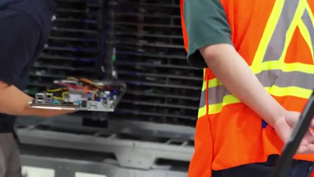
*📸 00:00:45 — Vue rapprochée d'un technicien manipulant un composant de serveur ou une carte mère devant un rack de stockage de datacenter.*

---

### ⏱️ `[00:00:53 - 00:01:27]` | Segment #03

**🔊 Audio (Transcription Intégrale Mot pour Mot en Français) :**
> le réseau, l'électricité et toute la plomberie pour le refroidissement à l'eau. Ça, c'est la configuration la plus dense possible, on peut mettre 96 serveurs parce que c'est des serveurs qui font la moitié d'une unité. Donc ça c'est une unité, une unité, une unité, une unité. C'est l'espace normal pour mettre un serveur sauf que comme on voit ici, il y a une petite séparation, ce qui fait qu'en fait dans une seule unité normale, on peut mettre jusqu'à deux serveurs. Du coup, c'est des petits serveurs qui ressemblent à ça, qui prennent la moitié de la place, qui sont beaucoup plus petits, ce qui fait qu'on peut avoir un rack beaucoup plus dense, beaucoup plus de serveurs au même endroit en utilisant moins de place. Une fois que l'assemblage ici est fait, il y a toute une partie de tests évidemment pour vérifier que la plomberie résiste

**👁️ Analyse Visuelle d'Écran (gemini-3.5-flash-lite) :**
**Interface & Outils** : Matériel physique (serveurs rackables, carte mère propriétaire demi-U).

**Contenu textuel & Code** : Architecture matérielle serveur : socket CPU AMD EPYC, emplacements mémoire DDR5, connecteurs d'alimentation et câblage interne.

**Action / Démonstration** : Présentation physique et détaillée d'un serveur haute densité au format demi-unité (0.5U) et de ses composants internes.

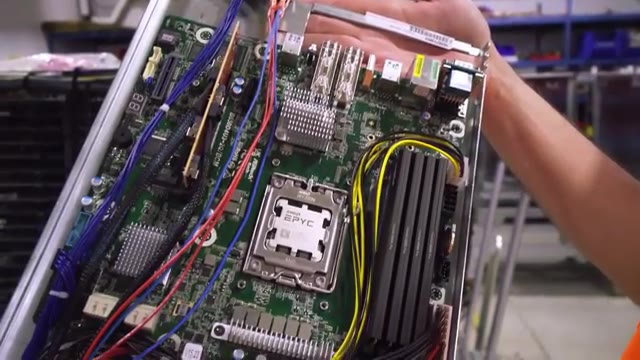
*📸 00:01:19 — Gros plan sur une carte mère de serveur au format compact (half-U) équipée d'un processeur AMD EPYC, de mémoire RAM et de connectique réseau.*

---

### ⏱️ `[00:01:27 - 00:01:58]` | Segment #04

**🔊 Audio (Transcription Intégrale Mot pour Mot en Français) :**
> bien la pression, que tout est bien branché, etc. On va passer à une partie où on va hacker tous les serveurs, mettre les 96 serveurs dedans. Pour la partie réseau, on a trois switches en haut et les trois switches ont une fonction un petit peu différente. On va avoir un switch qui va permettre la connectivité à Internet pour pouvoir accéder à mon serveur. On va avoir un deuxième switch qui va être un petit peu virtuel et qui va permettre de configurer le réseau un peu comme on veut, ce qui fait que si on a un serveur à Montréal et un autre serveur à Paris, on peut configurer le réseau pour faire comme si les deux étaient exactement dans le même sous-réseau alors qu'ils sont à l'autre bout du monde.

**👁️ Analyse Visuelle d'Écran (gemini-3.5-flash-lite) :**
**Interface & Outils** : Matériel réseau physique (panneau de brassage, câblage structuré, switchs).

**Contenu textuel & Code** : Connectique réseau dense avec câbles à paires torsadées et étiquettes de repérage.

**Action / Démonstration** : Explication de l'architecture réseau et du rôle des différents switchs pour la connectivité des 96 serveurs.

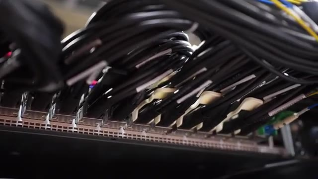
*📸 00:01:50 — Gros plan technique sur le panneau de brassage et les câbles réseaux connectés aux switchs supérieurs.*

---

### ⏱️ `[00:01:58 - 00:02:18]` | Segment #05

**🔊 Audio (Transcription Intégrale Mot pour Mot en Français) :**
> Donc, c'est quand même assez pratique. Et le troisième switch, c'est l'IPMI. Donc, c'est pour pouvoir se connecter au serveur en cas de problème, si jamais il répond plus, s'il est freeze, s'il faut rebooter le serveur. Et bien, ce switch-là permet de faire toutes ces opérations de maintenance sur le serveur. Et ce qui est intéressant aussi, c'est que le switch pour l'accès au public et le switch virtuel, et bien, ils peuvent échanger.

**👁️ Analyse Visuelle d'Écran (gemini-3.5-flash-lite) :**
**Interface & Outils** : Matériel réseau physique (panneau de brassage, câbles RJ45/fibre, switch).

**Contenu textuel & Code** : Connectique réseau et câblage structuré dans un rack de serveurs.

**Action / Démonstration** : Présentation matérielle du switch réseau et de la connectivité IPMI pour la maintenance à distance.

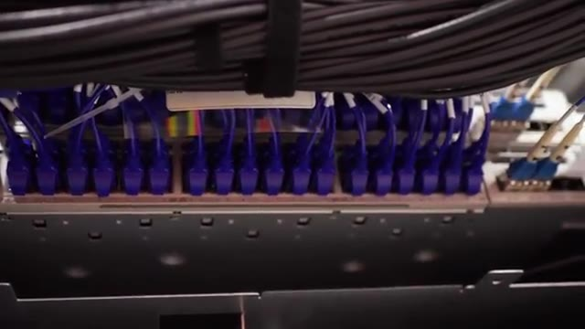
*📸 00:02:03 — Gros plan sur le panneau de brassage et le câblage réseau d'un rack de serveurs, illustrant l'infrastructure de connectivité.*

---

### ⏱️ `[00:02:18 - 00:02:54]` | Segment #06

**🔊 Audio (Transcription Intégrale Mot pour Mot en Français) :**
> Ça veut dire que si jamais le switch qui donne accès à Internet tombe en panne, et bien, le switch virtuel peut prendre le relais et donner une connectivité Internet à tous les autres switches. Ensuite en parlant de redondance, chaque switch va avoir 2 x 25 gigues en connectivité en SFP. Le switch ici va donner en général 10 gigas de connectivité vers internet, mais si jamais on a des demandes spéciales, on peut potentiellement avoir jusqu'à 2 x 25 gigues en connectivité locale. Et le troisième câble ici, ça va être notre IPMI pour pouvoir accéder à notre machine à distance en cas de problème. Ensuite pour la partie alimentation, les serveurs, on voit qu'ils n'ont pas l'alimentation directement ici. Ils ont juste la connexion ici,

**👁️ Analyse Visuelle d'Écran (gemini-3.5-flash-lite) :**
**Interface & Outils** : AUCUNE

**Contenu textuel & Code** : AUCUNE

**Action / Démonstration** : Explication orale de la redondance réseau et de la connectivité SFP entre switches.

---

### ⏱️ `[00:02:54 - 00:03:15]` | Segment #07

**🔊 Audio (Transcription Intégrale Mot pour Mot en Français) :**
> je m'imagine que c'est une connexion ATX. Et ils vont se connecter directement au fond du rack et c'est dans le rack qu'il y a déjà les alimentations qui sont déjà préinstallées. Donc là pour la partie alimentation électrique, on voit on a toutes les alimes qui sont derrière pour pouvoir alimenter tous les serveurs. Là comme ça va être que des machines qui sont un peu plus entrée de gamme, on va avoir une alimentation qui peut alimenter jusqu'à quatre machines différentes. Donc c'est des alimentations de 1200 watts donc elles ont largement la puissance pour pouvoir faire ça.

**👁️ Analyse Visuelle d'Écran (gemini-3.5-flash-lite) :**
**Interface & Outils** : Matériel physique, infrastructure de datacenter / rack serveur modulaire.

**Contenu textuel & Code** : Connectique d'alimentation interne et structure modulaire des serveurs en rack.
[DESC_IMAGE_1] Explication de l'architecture d'alimentation électrique centralisée et de la connexion ATX au fond du rack.

**Action / Démonstration** : Démonstration pédagogique et mise en perspective technique.

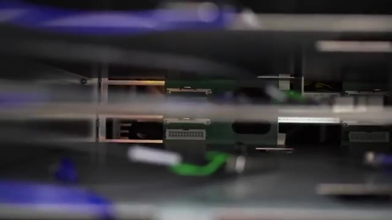
*📸 00:02:59 — Gros plan horizontal montrant l'intérieur d'un rack de serveurs et les connecteurs d'alimentation préinstallés au fond.*

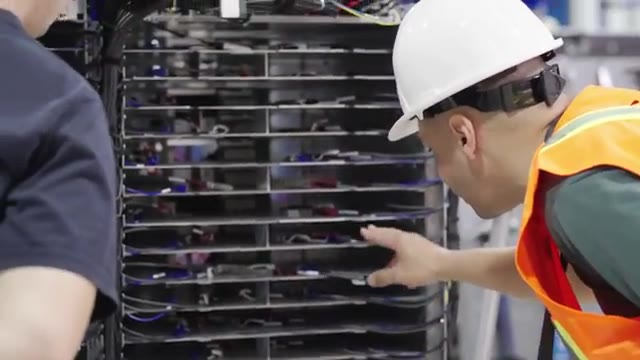
*📸 00:03:10 — Gros plan sur le technicien en gilet de sécurité et casque pointant les baies et tiroirs serveurs du rack.*

---

### ⏱️ `[00:03:15 - 00:03:40]` | Segment #08

**🔊 Audio (Transcription Intégrale Mot pour Mot en Français) :**
> Et ensuite on va avoir la partie refroidissement. Donc c'est ça toute la plomberie qu'on voit ici. On va avoir de l'eau fraîche qui va rentrer dans le rack et qui va aller, par tous ces petits tuyaux, aller refroidir individuellement tous les 96 serveurs qui sont dans le rack. Et l'eau, elle refroidit à peu près 80% de la chaleur que fournit le CPU. Et un 20% qui reste, qui est produit par le CPU, mais aussi les autres composants, la carte réseau, la RAM, les disques durs, etc., qui va être refroidi par air.

**👁️ Analyse Visuelle d'Écran (gemini-3.5-flash-lite) :**
**Interface & Outils** : Matériel physique de datacenter (rack de serveurs haute densité, système de refroidissement liquide par tuyauterie).

**Contenu textuel & Code** : Architecture matérielle d'un rack contenant 96 serveurs équipés de watercooling.

**Action / Démonstration** : Explication et démonstration du système de refroidissement liquide (plomberie et tuyaux d'eau fraîche) pour dissiper la chaleur des serveurs.

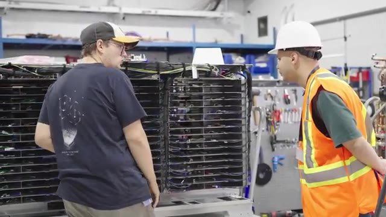
*📸 00:03:34 — Vue d'ensemble d'un rack ouvert montrant la disposition empilée de 96 serveurs haute densité.*

---

### ⏱️ `[00:03:40 - 00:04:02]` | Segment #09

**🔊 Audio (Transcription Intégrale Mot pour Mot en Français) :**
> Donc c'est pour ça qu'on va aussi avoir de l'eau qui va circuler dans ce gros, gros radiateur ici. Et on va avoir tous ces ventilateurs qui vont prendre l'air chaud qui est généré par le reste des composants. et le faire passer à travers cette eau froide ici. Et ça, c'est une des grosses innovations d'OVH qui font qu'ils n'ont pas forcément besoin de climatiser les bâtiments, de climatiser les conteneurs qu'on va voir juste après dans lesquels ils mettent les serveurs, parce que l'air qui ressort des racks est à température normale.

**👁️ Analyse Visuelle d'Écran (gemini-3.5-flash-lite) :**
**Interface & Outils** : Matériel hardware datacenter / système de refroidissement liquide OVH

**Contenu textuel & Code** : Racks de serveurs, échangeur thermique, tuyauterie de refroidissement liquide, ventilateurs

**Action / Démonstration** : Explication technique du système de refroidissement par eau (watercooling) et ventilation des serveurs OVH

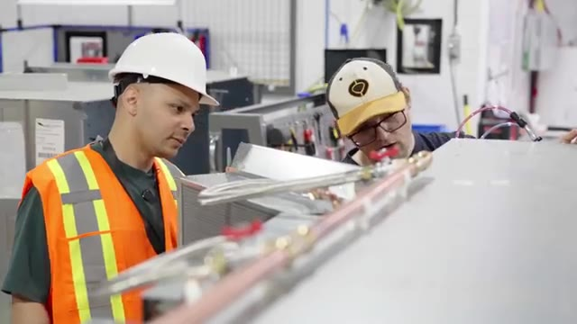
*📸 00:03:45 — Vue rapprochée de techniciens inspectant un système de refroidissement liquide (watercooling) pour serveurs OVH.*

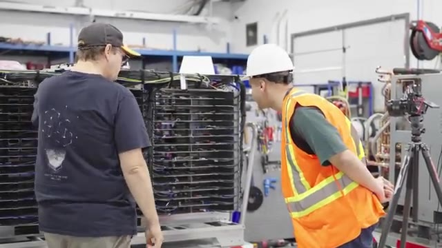
*📸 00:03:51 — Vue d'un rack de serveurs haute densité avec un technicien en équipement de sécurité.*

---

### ⏱️ `[00:04:02 - 00:04:24]` | Segment #10

**🔊 Audio (Transcription Intégrale Mot pour Mot en Français) :**
> Donc il n'y a pas besoin de refroidissement supplémentaire, il n'y a pas besoin de rajouter de climatisation, etc. Donc là, on va préparer un GPU, un RTX 2000, qui correspond à peu près à une 40-60 en GPU classique, sauf que là, ce n'est pas pour faire du gaming, c'est plus pour des utilisations plus professionnelles, comme de l'IA ou des autres utilisations qui ont besoin de GPU. Sauf que comme on va faire du refroidissement en liquide, à OVH, ils vont les customiser pour pouvoir les faire entrer dans leur serveur.

**👁️ Analyse Visuelle d'Écran (gemini-3.5-flash-lite) :**
**Interface & Outils** : Atelier technique avec plan de travail, boîtes de rangement de composants et écran de contrôle en arrière-plan.

**Contenu textuel & Code** : Manipulation physique d'une carte graphique professionnelle (GPU RTX 2000).

**Action / Démonstration** : Présentation matérielle et explication des usages professionnels (IA) d'un GPU RTX 2000.

---

### ⏱️ `[00:04:24 - 00:04:44]` | Segment #11

**🔊 Audio (Transcription Intégrale Mot pour Mot en Français) :**
> Premièrement, on va le démonter. On va enlever les petites vis de derrière. On va perdre la garantie, évidemment. On va venir ensuite enlever le radiateur pour pouvoir après faire l'installation d'un waterblock. OK, une moyenne goutte. Comme ça ? Parfait. Ça a l'air bien appliqué.

**👁️ Analyse Visuelle d'Écran (gemini-3.5-flash-lite) :**
**Interface & Outils** : Atelier technique avec établi, bacs de rangement de composants et écran de contrôle.

**Contenu textuel & Code** : Manipulation physique de matériel informatique, application de pâte thermique sur un circuit imprimé (PCB).

**Action / Démonstration** : Application précise de pâte thermique sur un processeur ou une puce électronique avant l'installation d'un waterblock.

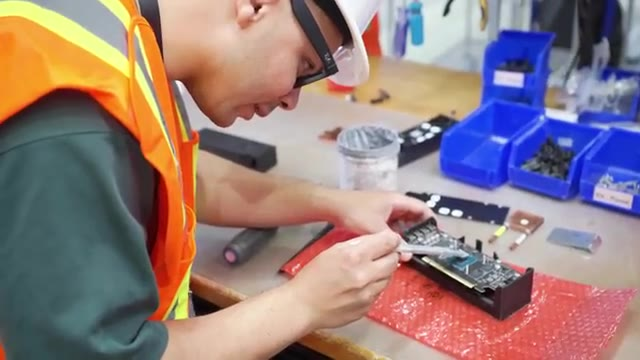
*📸 00:04:39 — Gros plan sur l'application minutieuse de pâte thermique sur un composant électronique (PCB) avec une spatule.*

---

### ⏱️ `[00:04:45 - 00:05:05]` | Segment #12

**🔊 Audio (Transcription Intégrale Mot pour Mot en Français) :**
> C'est bon, je suis embauché ? Oui ! C'est un petit oui. Si on regarde comme il faut, c'est vraiment ici pour mettre sur les chipsets. On va remettre encore de la pâte thermique. OK. Cette fois-ci, une grosse goutte, j'imagine? Oui. Après, il y a une bonne... T'en as beaucoup, là. Ouais. Mais moi, je suis comme ça, je suis généreux.

**👁️ Analyse Visuelle d'Écran (gemini-3.5-flash-lite) :**
**Interface & Outils** : Écran de contrôle/suivi d'atelier et poste de travail physique.

**Contenu textuel & Code** : Composants matériels, cartes électroniques (PCB), pots de pâte thermique, outillage de précision et bacs de quincaillerie.

**Action / Démonstration** : Application manuelle de pâte thermique sur des composants matériels et contrôle visuel de l'assemblage.

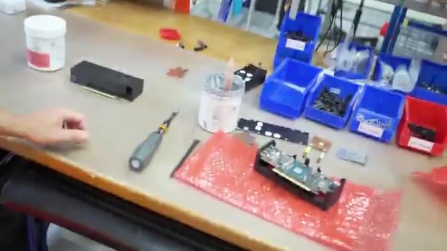
*📸 00:04:50 — Plan de travail d'atelier montrant du matériel informatique en cours d'assemblage (PCB, composants, outils).*

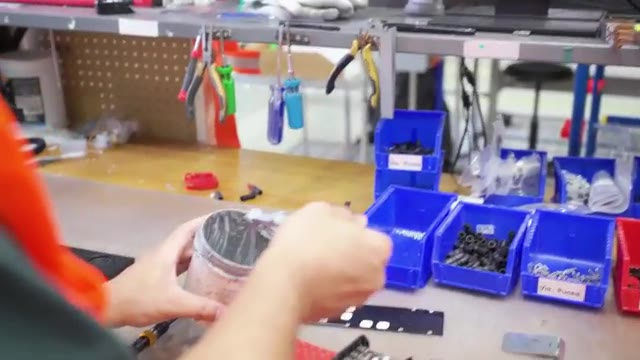
*📸 00:05:00 — Gros plan sur la manipulation de pâte thermique sur un poste de travail d'assemblage matériel.*

---

### ⏱️ `[00:05:05 - 00:05:25]` | Segment #13

**🔊 Audio (Transcription Intégrale Mot pour Mot en Français) :**
> Il n'y a pas de problème. Ça déborde, on va nettoyer. Yep. On vient remettre le backplane. Donc là, ici, on a une grosse, grosse machine. Les GPU qu'on a vus tout à l'heure.

**👁️ Analyse Visuelle d'Écran (gemini-3.5-flash-lite) :**
**Interface & Outils** : Matériel informatique, outillage de précision et composants électroniques (GPU / cartes d'accélération).

**Contenu textuel & Code** : Manipulation physique de matériel, application de pâte thermique et assemblage de backplane/dissipateur thermique.

**Action / Démonstration** : Maintenance matérielle, nettoyage et réassemblage d'un composant de serveur haute performance.

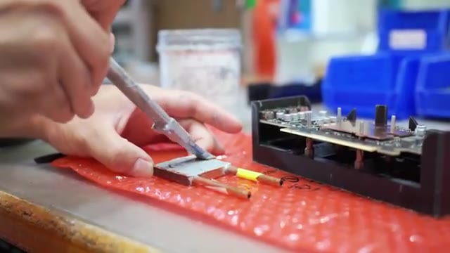
*📸 00:05:10 — Application de pâte thermique sur un composant ou un radiateur de carte d'accélération matérielle.*

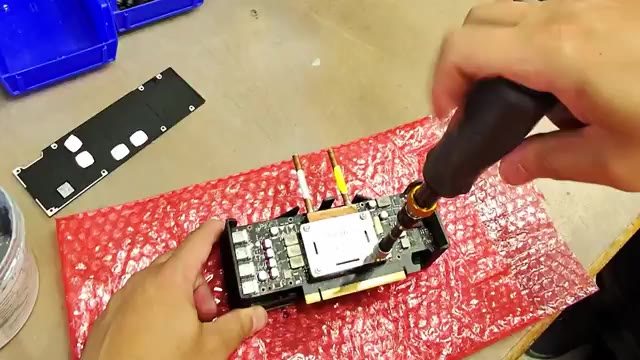
*📸 00:05:15 — Assemblage et vissage du système de refroidissement (backplane/dissipateur) sur une carte d'extension matérielle ou un composant GPU.*

---

### ⏱️ `[00:05:25 - 00:05:43]` | Segment #14

**🔊 Audio (Transcription Intégrale Mot pour Mot en Français) :**
> Ici, on va retrouver 1, 2, 3, 4, 5, 6, 7, 8 fois des RTX 2000 qui vont être tout ça dans un serveur seulement 2U. Et à l'intérieur, dans la machine ici, on va avoir un Epic 16 coeurs avec 1TB de RAM, donc quand même assez costaud aussi, et 2TB de disque dur, prodondé, c'est juste pour avoir l'OS.

**👁️ Analyse Visuelle d'Écran (gemini-3.5-flash-lite) :**
**Interface & Outils** : Matériel serveur rackable 2U, composants internes (CPU EPYC, RAM, cartes graphiques RTX 2000, watercooling).

**Contenu textuel & Code** : Architecture matérielle haute densité : serveur 2U, processeur EPYC 16 cœurs, 1 To de RAM, stockage NVMe M.2 et 8 GPU RTX 2000 intégrés.

**Action / Démonstration** : Présentation physique et démontage du châssis serveur 2U pour exposer la disposition interne des composants haute performance.

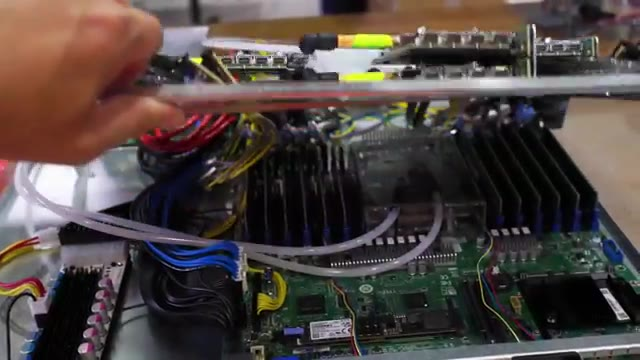
*📸 00:05:34 — Gros plan technique sur l'intérieur d'un serveur 2U haute densité montrant le watercooling, les barrettes de RAM et la carte mezzanine contenant les cartes graphiques RTX 2000.*

---

### ⏱️ `[00:05:43 - 00:06:03]` | Segment #15

**🔊 Audio (Transcription Intégrale Mot pour Mot en Français) :**
> J'imagine que si on utilise autant de GPU, on va utiliser comme un NAS ou un SAS ou un stockage qui est déporté, qui ne va pas être directement dans le serveur. Et donc, on va faire notre petite installation ici. Évidemment, il a déjà été un petit peu fait pour moi. On va faire notre petit ajout de GPU ici. On va venir faire ça ici. Tac.

**👁️ Analyse Visuelle d'Écran (gemini-3.5-flash-lite) :**
**Interface & Outils** : Aucune interface logicielle ou console visible (plans vidéo face-caméra/atelier).

**Contenu textuel & Code** : Aucun code, commande, architecture ou métrique affiché à l'écran.

**Action / Démonstration** : Explication orale sur l'infrastructure de stockage déportée (NAS/SAS) et manipulation physique générique de matériel informatique.

---

### ⏱️ `[00:06:04 - 00:06:31]` | Segment #16

**🔊 Audio (Transcription Intégrale Mot pour Mot en Français) :**
> Et là, on a toutes les ports PCI Express qui sont tous déportés, qui viennent ici se reconnecter derrière dans la carte mère. Et donc, un GPU, ça consomme déjà beaucoup d'énergie. Mais là, quand on en a huit dans le même serveur, ça consomme encore plus. Donc, on a notre alimentation ici, 2500 watts d'alimentation qui va alimenter premièrement notre serveur, mais qui va aussi alimenter directement les risers PCI Express qui vont te permettre d'alimenter après derrière les GPU.

**👁️ Analyse Visuelle d'Écran (gemini-3.5-flash-lite) :**
**Interface & Outils** : Matériel physique (serveur haute densité, blocs d'alimentation, câblage interne).

**Contenu textuel & Code** : Composants matériels de serveurs IA (ports PCIe déportés, alimentation haute capacité, watercooling).

**Action / Démonstration** : Explication technique sur l'alimentation électrique et le routage des ports PCIe pour les GPU dans un serveur haute densité.

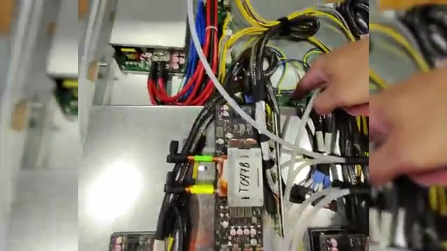
*📸 00:06:11 — Gros plan sur le câblage interne d'un serveur haute performance, montrant les connexions PCIe déportées et l'alimentation haute puissance.*

---

### ⏱️ `[00:06:31 - 00:06:56]` | Segment #17

**🔊 Audio (Transcription Intégrale Mot pour Mot en Français) :**
> Et ces risers PCI Express qu'on voit ici, c'est aussi des cartes custom faites directement par OVH. Et ensuite, les risers vont être branchés en mini-sass vers la carte mère. Pour la carte mère, elle va voir ça comme un périphérique PCI Express et donc elle va voir la carte graphique comme si elle était branchée en PCI Express alors qu'on l'a déportée via un câble. On a aussi une carte ici qui permet de vérifier qu'on n'a pas d'humidité dans le châssis et pour pouvoir venir couper l'alimentation en cas de problème.

**👁️ Analyse Visuelle d'Écran (gemini-3.5-flash-lite) :**
**Interface & Outils** : Matériel informatique serveur, carte mère, connectique interne.

**Contenu textuel & Code** : Composants matériels de serveur OVH (carte mère, SSD NVMe, connecteurs internes).

**Action / Démonstration** : Présentation matérielle des composants internes d'un serveur personnalisé OVH.

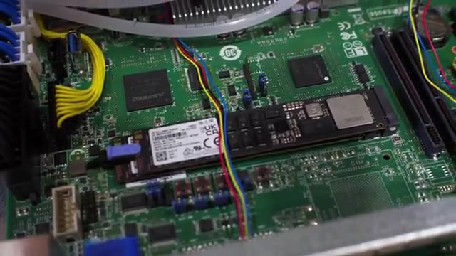
*📸 00:06:43 — Gros plan sur la carte mère d'un serveur montrant les composants, connecteurs et SSD M.2.*

---

### ⏱️ `[00:06:56 - 00:07:17]` | Segment #18

**🔊 Audio (Transcription Intégrale Mot pour Mot en Français) :**
> Une fois qu'on a fini d'installer tous les serveurs dans le rack qui ont été montés, qui ont été testés, on va prendre le rack et on va venir les installer ici. C'est quand même assez grand et c'est quand même assez dense. Il y a quatre allées dans ce data center. Ici, c'est l'allée dernière génération et on va installer jusqu'à 30 000 serveurs dans cette année-là. Et donc, pour l'instant, ils utilisent à peu près la moitié de l'espace, donc ils ont encore de l'espace pour l'expansion.

**👁️ Analyse Visuelle d'Écran (gemini-3.5-flash-lite) :**
**Interface & Outils** : Matériel physique de centre de données (racks de serveurs, câblage réseau, équipements d'alimentation).

**Contenu textuel & Code** : Infrastructure physique de serveurs haute densité installés dans des baies de datacenter.

**Action / Démonstration** : Visite guidée et présentation de l'agencement matériel d'un centre de données moderne.

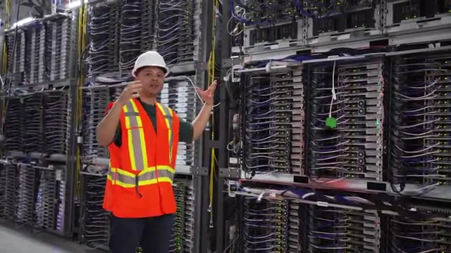
*📸 00:07:01 — Vue d'un technicien dans un data center dense montrant les baies de serveurs haute densité.*

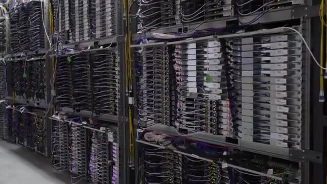
*📸 00:07:06 — Gros plan sur l'infrastructure matérielle : rangées de serveurs montés en rack avec câblage structuré.*

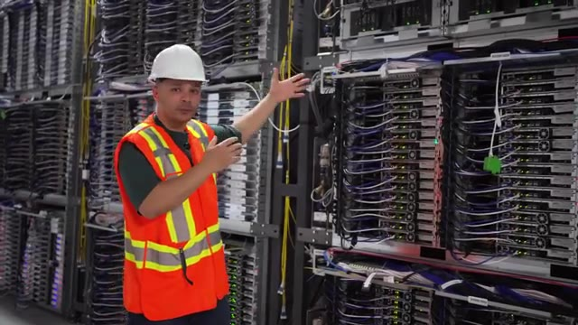
*📸 00:07:12 — Vue panoramique des allées du data center mettant en avant l'installation des serveurs.*

---

### ⏱️ `[00:07:17 - 00:07:43]` | Segment #19

**🔊 Audio (Transcription Intégrale Mot pour Mot en Français) :**
> Mais ils essayent aussi de s'étendre en hauteur. On voit que les serveurs vont beaucoup plus haut que dans un data center normal. Dans un data center classique, le rack irait peut-être jusqu'ici, quelque chose comme ça, alors que là, on a quand même beaucoup de serveurs en plus. Et il prévoit d'aller encore plus haut. Et en fait, il y a toute une balance entre rajouter des serveurs en hauteur ou rajouter des serveurs dans la salle, parce que le plus on va avoir de serveurs au même endroit, le plus on va avoir une bonne densité, on va avoir un meilleur prix du serveur au mètre carré, entre guillemets.

**👁️ Analyse Visuelle d'Écran (gemini-3.5-flash-lite) :**
**Interface & Outils** : Datacenter physique, racks de serveurs haute densité, chemins de câbles aériens, câblage réseau et alimentation.

**Contenu textuel & Code** : Infrastructure matérielle de serveurs empilés verticalement, câbles optiques et cuivres, gestion thermique et électrique.

**Action / Démonstration** : Présentation physique et explication technique de l'architecture verticale des serveurs du datacenter.

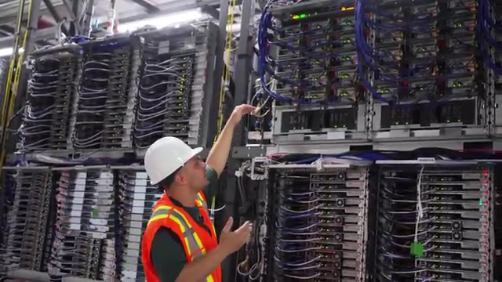
*📸 00:07:24 — Un technicien en équipement de protection (casque et gilet haute visibilité) présente la hauteur importante des racks de serveurs dans un datacenter haute densité.*

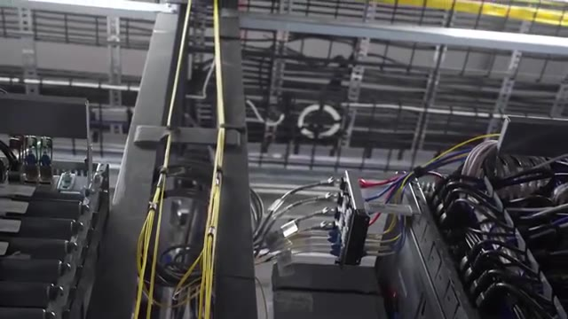
*📸 00:07:30 — Vue rapprochée du cheminement des câbles de brassage et de la connectique aérienne au sommet des baies de serveurs.*

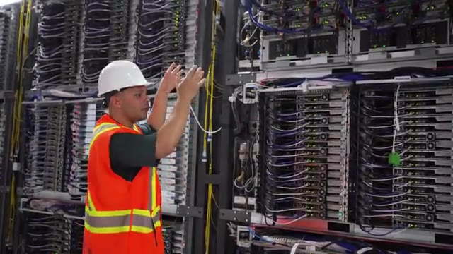
*📸 00:07:36 — Le technicien poursuit son explication en montrant la structure verticale étendue des racks de serveurs haute performance.*

---

### ⏱️ `[00:07:43 - 00:08:04]` | Segment #20

**🔊 Audio (Transcription Intégrale Mot pour Mot en Français) :**
> On va aussi avoir besoin de moins d'infrastructures, d'équipements réseau, d'équipements de refroidissement, etc., parce que tout est au même endroit. Maintenant, le fait de rajouter des serveurs en hauteur, c'est plus difficile à installer, c'est plus difficile à maintenir. Au bout d'un moment, on a besoin de quipements qui sont peut-être plus chers. Donc ça fait qu'il y a cette difficile balance à trouver entre densifier en hauteur et densifier en profondeur.

**👁️ Analyse Visuelle d'Écran (gemini-3.5-flash-lite) :**
**Interface & Outils** : Datacenter physique, racks de serveurs haute densité, chemins de câbles optiques et cuivre.

**Contenu textuel & Code** : Racks de serveurs empilés verticalement, câblage structuré, blocs d'alimentation et ventilateurs de serveurs visibles.

**Action / Démonstration** : Explication technique sur l'optimisation de l'infrastructure et la complexité de maintenance des serveurs installés en hauteur.

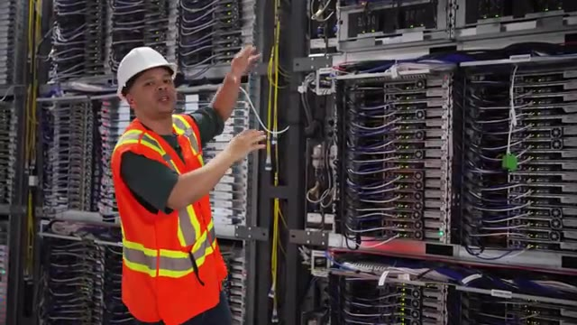
*📸 00:07:48 — Un technicien en EPI (casque et gilet haute visibilité) présente une haute allée de serveurs rackables à haute densité de câblage.*

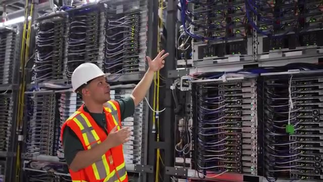
*📸 00:07:53 — Le technicien pointe du doigt les hauteurs des racks de serveurs pour illustrer la difficulté de maintenance des équipements en hauteur.*

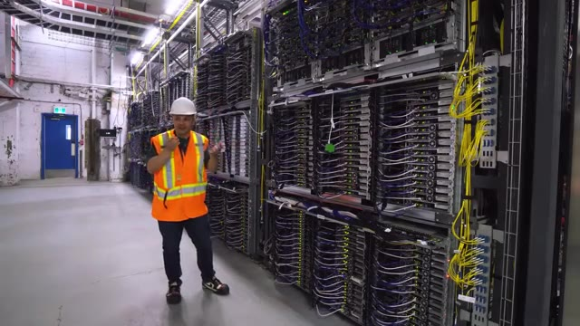
*📸 00:07:59 — Vue plus large de l'allée du datacenter montrant l'infrastructure des racks serveurs et les chemins de câbles aériens.*

---

### ⏱️ `[00:08:04 - 00:08:27]` | Segment #21

**🔊 Audio (Transcription Intégrale Mot pour Mot en Français) :**
> Une fois qu'on arrive et qu'on a installé nos serveurs ici, on a une double redondance en termes d'électricité et en termes de réseau. Donc du coup, on a deux câbles réseaux qui verissent deux réseaux différents pour être sûr que ça marche plus grand. Pareil pour l'électricité. Comme ici, on est dans l'année de dernière génération, c'est quand même assez rare qu'il y ait des problèmes parce que les serveurs comme on a vu avant sont déjà testés au niveau de la pression de l'eau, de la température, des composants, etc. dans la partie fabrication.

**👁️ Analyse Visuelle d'Écran (gemini-3.5-flash-lite) :**
**Interface & Outils** : Datacenter physique, baies de serveurs rackables, gestion de câblage cuivre et fibre optique.

**Contenu textuel & Code** : Racks de serveurs haute densité avec voyants d'état et câblage structuré double réseau.

**Action / Démonstration** : Explication de l'architecture de redondance électrique et réseau (double câblage) dans une infrastructure moderne de datacenter.

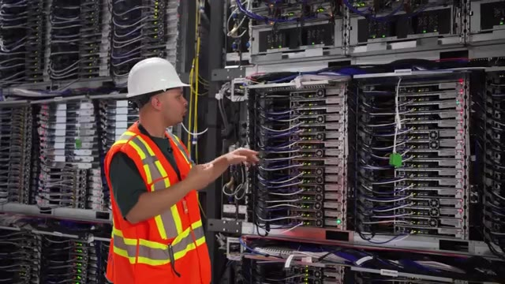
*📸 00:08:10 — Vue rapprochée d'un technicien dans un datacenter expliquant l'architecture des racks de serveurs et le câblage réseau redondant.*

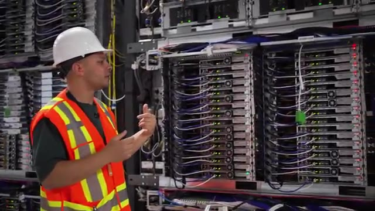
*📸 00:08:15 — Gros plan sur le technicien désignant les baies de serveurs haute densité et les connexions réseau dans le datacenter.*

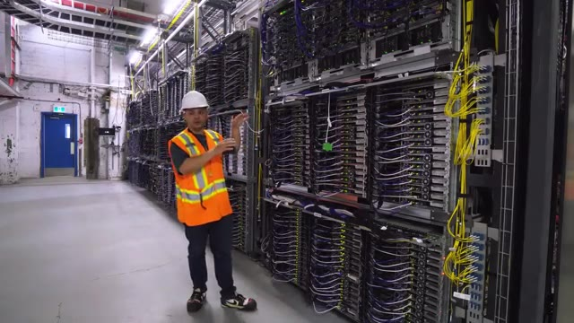
*📸 00:08:21 — Vue large de l'allée du datacenter montrant de multiples baies de serveurs, les chemins de câbles aériens et la gestion des fibres optiques (jaunes) et câbles réseaux.*

---

### ⏱️ `[00:08:27 - 00:08:49]` | Segment #22

**🔊 Audio (Transcription Intégrale Mot pour Mot en Français) :**
> Mais ils sont retestés ici une deuxième fois, une fois que l'installation est finie. Et avec le fait qu'ils font une maintenance régulière pour s'assurer que les ventilateurs sont réployés, ça fait qu'il y a assez peu de problèmes sur les serveurs qui ont utilisé. Et donc ici on est de l'autre côté des serveurs. Il y a beaucoup de vent qui passe par ici parce que c'est là où on a les ventilateurs qui vont aspirer l'air ambiant, le faire passer à travers ces radiateurs ici qui sont pleins d'eau fraîche.

**👁️ Analyse Visuelle d'Écran (gemini-3.5-flash-lite) :**
**Interface & Outils** : Matériel de centre de données, racks de serveurs, échangeurs thermiques industriels et tuyauterie de refroidissement.

**Contenu textuel & Code** : Infrastructure de serveurs haute densité et systèmes de ventilation/refroidissement de datacenter.

**Action / Démonstration** : Explication technique des procédures de test des serveurs et de la maintenance du système de refroidissement et des ventilateurs.

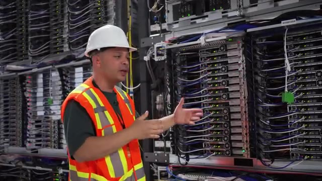
*📸 00:08:32 — Présentateur dans un centre de données montrant des racks de serveurs densément peuplés avec un câblage réseau structuré.*

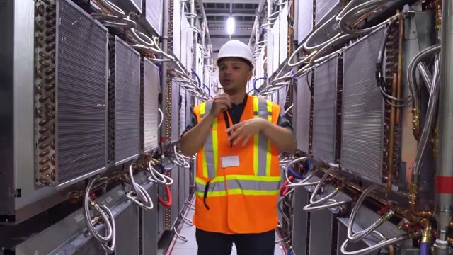
*📸 00:08:38 — Vue de l'arrière des racks de serveurs avec des échangeurs de chaleur et des canalisations de refroidissement industriel.*

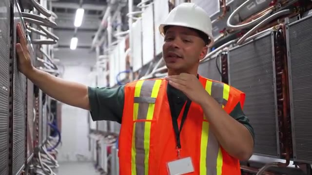
*📸 00:08:43 — Gros plan sur le système de ventilation et de refroidissement à l'arrière des serveurs, illustrant l'infrastructure thermique.*

---

### ⏱️ `[00:08:49 - 00:09:22]` | Segment #23

**🔊 Audio (Transcription Intégrale Mot pour Mot en Français) :**
> et qui vont ensuite passer dans le serveur pour refroidir passivement tous les composants qui sont autres que le CPU et le GPU, qui eux sont refroidis avec du watercooling. Et donc on a tout le circuit d'eau qui vient rafraîchir les serveurs ici, et on a aussi le circuit d'eau qui vient rafraîchir le circuit de watercooling pour les processeurs et le GPU directement à l'intérieur du serveur, comme on a vu tout à l'heure. Et donc tous les serveurs qu'on voit ici, ils sont alimentés en eau fraîche par un seul échangeur d'eau, qui va prendre l'eau et la refroidir avec un autre circuit d'eau, Et cet autre circuit d'eau, lui, est refroidi, mais cette fois à l'extérieur du bâtiment avec l'air ambiant.

**👁️ Analyse Visuelle d'Écran (gemini-3.5-flash-lite) :**
**Interface & Outils** : Équipements industriels de refroidissement (tuyauteries, vannes, échangeurs thermiques).

**Contenu textuel & Code** : Infrastructure physique de refroidissement par eau (watercooling et circuits passifs) d'un datacenter.

**Action / Démonstration** : Explication technique de l'architecture du système de refroidissement liquide des serveurs.

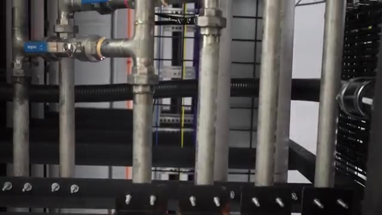
*📸 00:08:57 — Gros plan sur les tuyauteries métalliques et vannes du système de refroidissement liquide du datacenter.*

---

### ⏱️ `[00:09:22 - 00:09:41]` | Segment #24

**🔊 Audio (Transcription Intégrale Mot pour Mot en Français) :**
> Et donc l'unité de refroidissement, elle peut refroidir jusqu'à 4 allées à la fois. Et donc on va retrouver ces systèmes de refroidissement-là à chaque fois toutes les 3 ou 4 allées. Et là où il y a un gros gain en termes d'efficacité énergétique, c'est que dans un data-sauter traditionnel, on va utiliser de la climatisation pour refroidir l'air de toute la pièce. Et ensuite, l'air de toute la pièce vient refroidir les serveurs.

**👁️ Analyse Visuelle d'Écran (gemini-3.5-flash-lite) :**
**Interface & Outils** : Équipements physiques de refroidissement de datacenter (échangeurs de chaleur, radiateurs industriels, tuyauteries en cuivre et flexibles de distribution de fluide caloporteur).

**Contenu textuel & Code** : Systèmes de climatisation et de refroidissement liquide industriels conçus pour optimiser l'efficacité énergétique globale (PUE) des salles de serveurs.

**Action / Démonstration** : Explication technique sur site du fonctionnement des unités de refroidissement de datacenter et de leur disposition toutes les 3 ou 4 allées de serveurs.

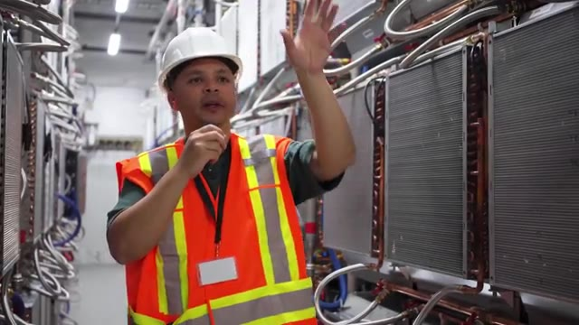
*📸 00:09:27 — Vue rapprochée sur les échangeurs thermiques (radiateurs industriels et serpentins de cuivre) installés dans l'allée technique d'un datacenter.*

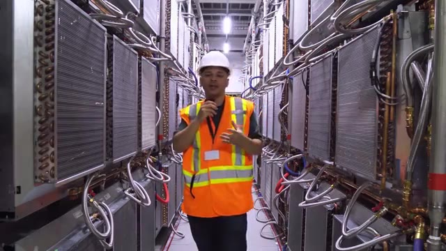
*📸 00:09:32 — Vue d'ensemble de l'allée technique montrant la double rangée de modules de refroidissement industriels (In-Row Cooling) avec leurs flexibles d'alimentation en eau.*

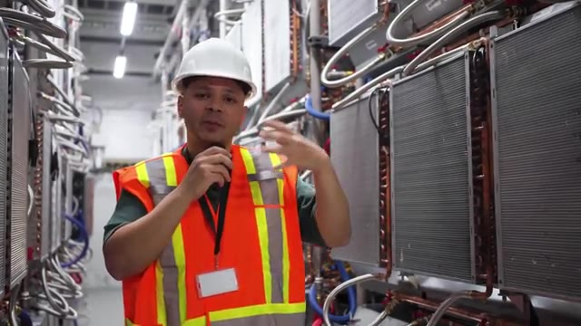
*📸 00:09:36 — Gros plan sur la structure d'un bloc de refroidissement à ailettes en aluminium destiné à dissiper la chaleur générée par les serveurs.*

---

### ⏱️ `[00:09:41 - 00:10:06]` | Segment #25

**🔊 Audio (Transcription Intégrale Mot pour Mot en Français) :**
> Alors que là, ce qui se passe, c'est qu'on fait tourner les machines un petit peu plus chaud que d'habitude, mais toujours largement dans les températures acceptables. on injecte l'eau fraîche pour pouvoir refroidir notre composant. Donc l'eau qui ressort est un petit peu plus chaude, donc elle a peu près à 35 degrés. Et cette eau-là, elle peut ensuite être refroidie avec l'air ambiant de l'extérieur. Et comme à l'extérieur, il fait plus frais que cette température-là, on peut refroidir les serveurs seulement en déplaçant de l'eau et sans avoir un compresseur, une climatisation ou des choses qui sont beaucoup plus énergivores.

**👁️ Analyse Visuelle d'Écran (gemini-3.5-flash-lite) :**
**Interface & Outils** : Caméra thermique avec échelle de température (-15,0°C à 150,0°C).

**Contenu textuel & Code** : Thermographie infrarouge illustrant la dissipation thermique des composants serveurs et des canalisations.

**Action / Démonstration** : Explication technique sur l'injection d'eau fraîche, le refroidissement des composants et la gestion thermique à environ 35°C.

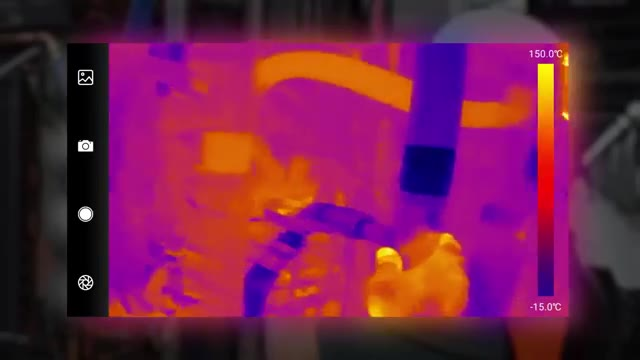
*📸 00:09:47 — Vue en caméra thermique montrant les gradients de température sur les équipements de refroidissement des serveurs.*

---

### ⏱️ `[00:10:06 - 00:10:29]` | Segment #26

**🔊 Audio (Transcription Intégrale Mot pour Mot en Français) :**
> Donc ici, on est dans la salle des batteries. Et donc on va avoir toute l'énergie électrique qui va d'abord arriver dans une salle avec des UPS, qui va nettoyer le courant, faire en sorte qu'il soit bien stable, qu'il n'y a pas de trop d'interférences, juste comme ça. Et ensuite, ça va passer ici dans des batteries qui vont servir en cas de problème électrique pour pouvoir alimenter tous les serveurs le temps qu'il y a un générateur thermique qui se met en route pour pouvoir alimenter tous les serveurs.

**👁️ Analyse Visuelle d'Écran (gemini-3.5-flash-lite) :**
**Interface & Outils** : AUCUNE

**Contenu textuel & Code** : AUCUNE

**Action / Démonstration** : Explication orale de l'infrastructure électrique et des batteries de secours du datacenter.

---

### ⏱️ `[00:10:29 - 00:10:50]` | Segment #27

**🔊 Audio (Transcription Intégrale Mot pour Mot en Français) :**
> Et donc, elles ne sont pas vraiment utilisées en temps normal. Mais par contre, comme le CEM est doublé pour avoir de la haute disponibilité, ça a deux avantages. Le premier, c'est que si on a un problème sur une des alimentations électriques, il y a l'autre qui peut prendre le relais et continuer d'alimenter le data center. Et le deuxième avantage aussi, c'est pour la maintenance. parce que parfois on a besoin de mettre à jour des équipements, de faire de la maintenance sur des équipements, et donc on a besoin de les éteindre.

**👁️ Analyse Visuelle d'Écran (gemini-3.5-flash-lite) :**
**Interface & Outils** : AUCUNE

**Contenu textuel & Code** : AUCUNE

**Action / Démonstration** : Explication orale de la haute disponibilité et de la redondance des alimentations électriques (onduleurs/batteries) dans un datacenter.

---

### ⏱️ `[00:10:50 - 00:11:12]` | Segment #28

**🔊 Audio (Transcription Intégrale Mot pour Mot en Français) :**
> Sauf que les serveurs, on ne veut jamais que les éteindre, on veut que les serveurs continuent à tourner H24. Et donc le fait d'avoir ces deux alimentations électriques-là redondées, on peut en éteindre une quand on a besoin de faire de la maintenance dessus, et c'est l'autre qui va prendre le relais. Et ensuite, une fois qu'on a fini la maintenance, on vient réouvrir le courant dessus et faire la maintenance sur l'autre partie. Comme ça, on peut mettre à jour et maintenir notre installation électrique sans interrompre les serveurs qui tournent dans tout le reste du data center.

**👁️ Analyse Visuelle d'Écran (gemini-3.5-flash-lite) :**
**Interface & Outils** : AUCUNE

**Contenu textuel & Code** : AUCUN

**Action / Démonstration** : Explication orale de la redondance électrique et de la continuité de service des serveurs en datacenter.

---

### ⏱️ `[00:11:12 - 00:11:36]` | Segment #29

**🔊 Audio (Transcription Intégrale Mot pour Mot en Français) :**
> Et donc ici ce qui est intéressant c'est qu'on est à Beauharnais près de Montréal au Québec et c'est un endroit très très intéressant pour avoir un datacenter pour plusieurs raisons. Premièrement le climat est assez favorable la plupart du temps de l'année pour des serveurs parce qu'il se fait assez froid et comme l'eau du watercolim est refroidie avec l'air ambiant, ça nous arrange. Deuxièmement c'est très bien connecté avec toute l'Amérique du Nord et avec l'Europe parce qu'il y a des câbles qui passent directement avec l'Europe et on est aussi proche de l'exchange de New York où il y a encore plus de connexions qui vont un peu partout dans le monde.

**👁️ Analyse Visuelle d'Écran (gemini-3.5-flash-lite) :**
**Interface & Outils** : Navigateur web affichant des cartes géographiques et des cartes de câbles sous-marins (Submarine Cable Map).

**Contenu textuel & Code** : Cartographie de la région de Beauharnois et routes de câbles de fibre optique transatlantiques et terrestres.

**Action / Démonstration** : Explication géographique et infrastructurelle des avantages de l'emplacement du datacenter (proximité de l'eau pour le refroidissement et connectivité réseau).

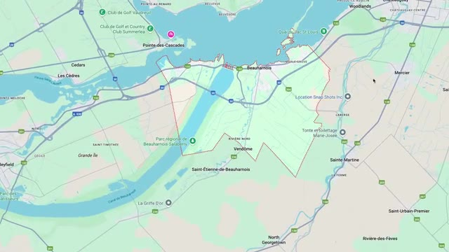
*📸 00:11:18 — Carte géographique centrée sur Beauharnois au Québec, montrant l'emplacement du datacenter près du fleuve et des voies navigables.*

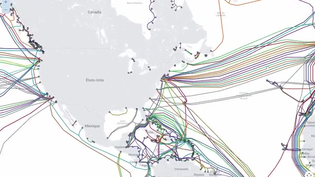
*📸 00:11:30 — Carte mondiale des câbles sous-marins et des réseaux de télécommunications interconnectant l'Amérique du Nord.*

---

### ⏱️ `[00:11:36 - 00:12:01]` | Segment #30

**🔊 Audio (Transcription Intégrale Mot pour Mot en Français) :**
> Donc en termes de latence, de débit de réseau pour un datacenter c'est très bien positionné. Et troisièmement, le data center est vraiment juste à côté d'un barrage hydroélectrique, ce qui donne plusieurs avantages. Donc premièrement, c'est de l'énergie renouvelable, ça veut dire que tous les serveurs qu'on voit dans ce data center-là sont tous alimentés par de l'énergie verte, l'énergie hydroélectrique. Deuxièmement, cette proximité, elle permet d'avoir une puissance beaucoup plus élevée que ce qu'on pourrait avoir ailleurs où on n'a pas forcément accès à de l'énergie proche.

**👁️ Analyse Visuelle d'Écran (gemini-3.5-flash-lite) :**
**Interface & Outils** : Aucune interface logicielle ou terminal affiché.

**Contenu textuel & Code** : Infrastructure physique de production énergétique (barrage hydroélectrique) alimentant le datacenter.

**Action / Démonstration** : Explication de l'alimentation en énergie renouvelable des serveurs grâce à la proximité immédiate d'un barrage hydroélectrique.

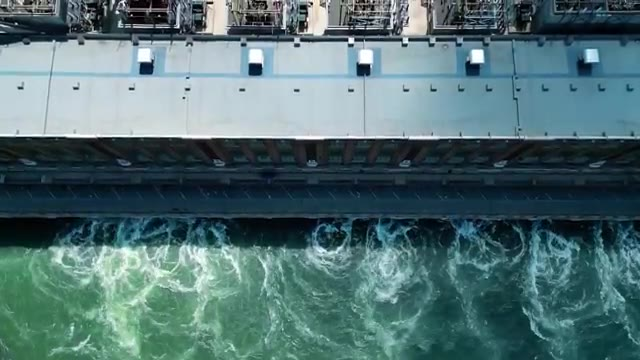
*📸 00:11:49 — Vue aérienne par drone d'une centrale hydroélectrique adjacente au datacenter, illustrant la source d'énergie renouvelable.*

---

### ⏱️ `[00:12:01 - 00:12:20]` | Segment #31

**🔊 Audio (Transcription Intégrale Mot pour Mot en Français) :**
> Et troisièmement, ça permet aussi d'avoir une meilleure disponibilité parce que comme on est vraiment juste à côté du barrage, il y a très peu de chances d'avoir des problèmes parce que, si tu veux, le câble est très très court. Donc il ne va pas y avoir plein d'endroits intermédiaires où un problème peut arriver. Donc une fois que notre serveur a été racké, il a été branché, etc., les clients l'utilisent, ils les commandent, tout ça pendant à peu près 9 ans, 10 ans.

**👁️ Analyse Visuelle d'Écran (gemini-3.5-flash-lite) :**
**Interface & Outils** : AUCUNE

**Contenu textuel & Code** : AUCUN

**Action / Démonstration** : Explication orale sur la fiabilité et la haute disponibilité liée à la proximité de l'infrastructure avec la source d'énergie (le barrage).

---

### ⏱️ `[00:12:20 - 00:12:42]` | Segment #32

**🔊 Audio (Transcription Intégrale Mot pour Mot en Français) :**
> Et après cette période-là, tous les serveurs d'Amérique du Nord, qui sont aux Etats-Unis ou qui sont au Canada, ils vont venir ici à Boarnois pour être recyclés. Donc il y a plusieurs chemins possibles qu'un vieux serveur peut avoir. Premièrement, ils vont arriver, et ensuite il y a un technicien qui va nettoyer tous les composants et les vérifier un par un pour voir lesquels fonctionnent, lesquels fonctionnent plus et lesquels fonctionnent mais ne sont pas forcément aux normes que OVH a besoin pour ces nouveaux serveurs.

**👁️ Analyse Visuelle d'Écran (gemini-3.5-flash-lite) :**
**Interface & Outils** : Établi de technicien, écran de contrôle, bacs de tri de composants et outils de diagnostic

**Contenu textuel & Code** : Composants matériels informatiques en cours de tri (cartes mères, barrettes de RAM, câblerie)

**Action / Démonstration** : Explication du processus de nettoyage, de vérification et de tri des composants matériels des serveurs reçus

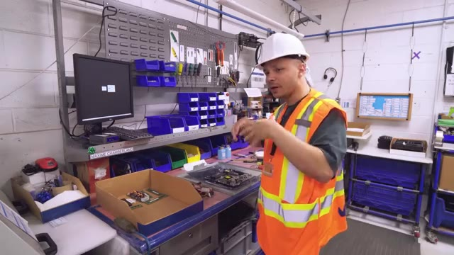
*📸 00:12:26 — Atelier de maintenance et de recyclage de serveurs avec un technicien en ÉPI et un poste de travail équipé*

---

### ⏱️ `[00:12:42 - 00:13:03]` | Segment #33

**🔊 Audio (Transcription Intégrale Mot pour Mot en Français) :**
> Et ensuite, chacun de ces composants, donc ça peut être des cartes mères, ça peut être des CPU, ça peut être des barrettes de RAM, ça peut être des câbles, et des composants qui sont juste trop vieux, qu'on ne peut pas réutiliser, donc on va juste les recycler. Mais si c'est des composants qu'on peut réutiliser sur des serveurs d'entrée de gamme, ça permet de prolonger la durée de vie du matériel, de proposer des solutions qui sont un petit peu moins chères, plus abordables pour un autre type de clientèle.

**👁️ Analyse Visuelle d'Écran (gemini-3.5-flash-lite) :**
**Interface & Outils** : AUCUNE

**Contenu textuel & Code** : AUCUNE

**Action / Démonstration** : Explication orale du processus de tri, de recyclage et de réutilisation des composants matériels informatiques (cartes mères, RAM, CPU).

---

### ⏱️ `[00:13:04 - 00:13:22]` | Segment #34

**🔊 Audio (Transcription Intégrale Mot pour Mot en Français) :**
> Donc c'est gagnant pour tout le monde. Pour ce qui est des composants qui sont réutilisables, on va les tester avant de les réutiliser pour être sûr qu'ils fonctionnent bien. Et donc, on a tous des systèmes vraiment maison de chez OVH pour pouvoir s'assurer que tout fonctionne bien. Donc premièrement, pour les disques durs, là ici on voit qu'on a des SSD en SATA. Ici on a des disques durs 2 Tera, comme vous voulez savoir.

**👁️ Analyse Visuelle d'Écran (gemini-3.5-flash-lite) :**
**Interface & Outils** : Infrastructures de datacenters physiques, baies de serveurs racks, matériel de test d'OVH.

**Contenu textuel & Code** : Racks de serveurs, câblage réseau, étiquettes de zone (ZONE PCC).

**Action / Démonstration** : Explication du processus de test et de réutilisation des composants matériels (disques durs, serveurs) dans les installations d'OVH.

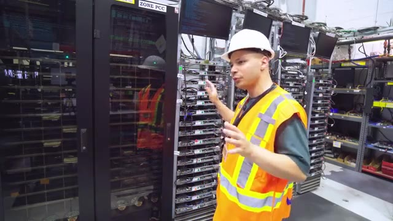
*📸 00:13:13 — Le présentateur présente une baie de serveurs rackables dans un datacenter OVH, montrant le matériel de test et les racks.*

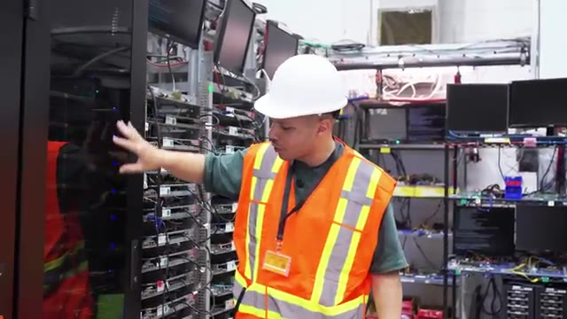
*📸 00:13:18 — Le présentateur désigne une baie de serveurs informatique avec un étiquetage 'ZONE PCC' visible sur le rack.*

---

### ⏱️ `[00:13:23 - 00:13:44]` | Segment #35

**🔊 Audio (Transcription Intégrale Mot pour Mot en Français) :**
> Et donc, ils sont mis dans des systèmes ici qui vont avoir des scripts qui vont tourner, qui vont automatiquement effacer les disques durs pour pouvoir être ensuite réutilisés. Et s'ils sont réutilisés à l'interne chez OVH dans des serveurs, parce qu'ils fonctionnent assez bien et qu'ils ont assez de performance pour pouvoir être réutilisés dans des nouveaux serveurs, ils vont être effacés trois fois d'affilée pour être sûrs qu'il n'y a aucune chance qu'ils puissent récupérer des données.

**👁️ Analyse Visuelle d'Écran (gemini-3.5-flash-lite) :**
**Interface & Outils** : Écrans de contrôle et terminaux embarqués sur racks de serveurs.

**Contenu textuel & Code** : Lignes de codes et interfaces de monitoring système affichées sur les écrans en hauteur.

**Action / Démonstration** : Présentation physique de l'infrastructure de recyclage et de test des disques durs en datacenter.

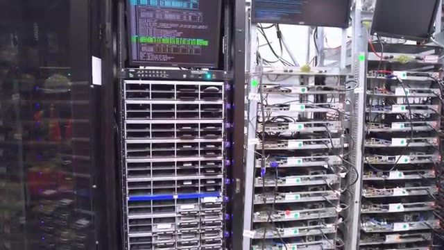
*📸 00:13:28 — Baies de serveurs et racks matériels dans un datacenter, affichant des écrans de monitoring et du matériel de stockage.*

---

### ⏱️ `[00:13:44 - 00:14:10]` | Segment #36

**🔊 Audio (Transcription Intégrale Mot pour Mot en Français) :**
> Si par contre, ils fonctionnent, mais par exemple, ils sont un peu trop vieux, si c'est des disques de juste 1 Tera ou 500 Giga, qu'on ne peut pas réutiliser dans des nouveaux serveurs parce que ce n'est juste pas assez performant, mais qu'ils fonctionnent quand même bien et qu'il y avait d'autres gens qui pourraient en bénéficier, ces disques-là sont revendus à des brokers qui vont ensuite les revendre ou les réutiliser. Et dans ce cas-là, quand ça sort d'OVH, là elles sont effacées 7 fois pour être sûr que vraiment là, c'est garanti que jamais de la vie il y a un seul octet qui va sortir de ces disques durs.

**👁️ Analyse Visuelle d'Écran (gemini-3.5-flash-lite) :**
**Interface & Outils** : AUCUNE

**Contenu textuel & Code** : AUCUNE

**Action / Démonstration** : Explication orale sur le réemploi de disques durs de plus faible capacité dans un contexte de gestion de datacenter.

---

### ⏱️ `[00:14:10 - 00:14:31]` | Segment #37

**🔊 Audio (Transcription Intégrale Mot pour Mot en Français) :**
> Et donc tout ça c'est automatisé dans cette Béla, comme ça on peut mettre tous les disques durs et les effacer tous en même temps. Et ici on a la même chose mais pour les barrettes de RAM. Donc les barrettes de RAM on n'a pas besoin de les effacer évidemment, mais on a besoin de s'assurer qu'elles fonctionnent. Et pour ça pareil on a besoin d'une machine qui va écrire dessus un certain nombre de fois, lire dessus un certain nombre de fois pour s'assurer que tout l'espace mémoire de la barrette fonctionne correctement, fonctionne à la bonne vitesse.

**👁️ Analyse Visuelle d'Écran (gemini-3.5-flash-lite) :**
**Interface & Outils** : Aucune interface ou console affichée.

**Contenu textuel & Code** : Aucun code, commande ou métrique visible.

**Action / Démonstration** : Explication orale sur le matériel de test de disques durs et de barrettes de RAM.

---

### ⏱️ `[00:14:31 - 00:15:04]` | Segment #38

**🔊 Audio (Transcription Intégrale Mot pour Mot en Français) :**
> et la même manière si la barrette est réutilisable on va la retrouver dans des serveurs qui vont être remis ensuite dans le data center si jamais c'est peut-être un peu trop vieux par exemple c'est de la DDR3 qui est plus vraiment utilisé dans les gammes OVH et bien là pareil ça va être revendu à des brokers qui eux pourront potentiellement les réutiliser et pareil tous ces châssis ici sont tout fait custom par OVH et on voit même ici qu'on a le water cooling parce que c'est les cartes meilleures d'OVH avec le water block custom d'OVH donc tout est fait custom donc si les disques qui remarchent s'ils ne sont pas super performants ils sont revendus Si par contre ils marchent bien et qu'ils sont assez performants, on les réutilise. Si par contre

**👁️ Analyse Visuelle d'Écran (gemini-3.5-flash-lite) :**
**Interface & Outils** : Baies de serveurs de datacenter, racks d'infrastructure matérielle.

**Contenu textuel & Code** : Racks de serveurs montés en rack avec câblage réseau et matériel informatique visible en arrière-plan.

**Action / Démonstration** : Explication technique sur la réutilisation des composants matériels (serveurs et barrettes mémoire) dans le data center ou leur revente à des brokers.

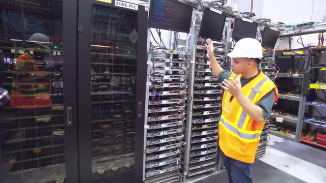
*📸 00:14:48 — Présentateur dans un datacenter devant des baies de serveurs et des racks informatiques, illustrant le cycle de vie du matériel.*

---

### ⏱️ `[00:15:04 - 00:15:38]` | Segment #39

**🔊 Audio (Transcription Intégrale Mot pour Mot en Français) :**
> ils marchent plus du tout ou que le client a décidé qu'on ne veut pas réutiliser ces disques dans aucun cas possible, ils vont être détruits, détruits physiquement. Non seulement ils vont être effacés cette fois dans les machines qu'on a vu là-bas, mais ensuite ils vont être broyés dans cette machine ici. Et donc le disque qui rentre ici, il est déchiqueté, broyé, explosé et il finit par ressembler à ça, de la poudre de SSD et de disque dur. Donc là on est dans la salle

**👁️ Analyse Visuelle d'Écran (gemini-3.5-flash-lite) :**
**Interface & Outils** : Machine physique de broyage / destruction de disques durs (hard drive shredder).

**Contenu textuel & Code** : Dispositif industriel de destruction de supports de stockage (disques durs HDD/SSD).

**Action / Démonstration** : Démonstration du processus de broyage physique des disques durs pour garantir une destruction définitive et sécurisée des données.

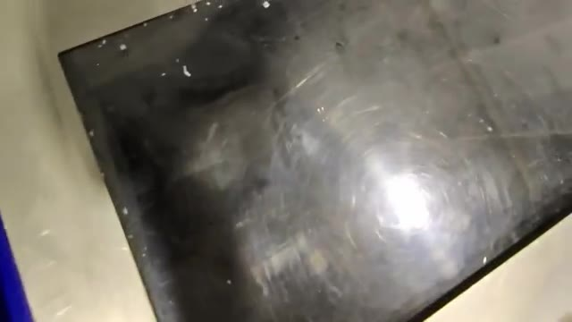
*📸 00:15:21 — Gros plan sur le mécanisme ou la zone de réception d'une machine de broyage physique de disques durs.*

---

### ⏱️ `[00:15:38 - 00:15:59]` | Segment #40

**🔊 Audio (Transcription Intégrale Mot pour Mot en Français) :**
> de contrôle où on va gérer tous les incidents qu'il peut y avoir. Donc il y a deux types d'intervention qu'il peut faire. Le premier type d'intervention ça va être des choses qui sont préventives comme par exemple répondre à des demandes clients, faire des nettoyages préventifs des machines, des choses comme ça. Et le deuxième type d'intervention ça va être plus en réaction à des problèmes qui peuvent arriver. Ça peut être des problèmes matériels ou ça peut aussi être des demandes des clients qui ont un problème avec leur machine qui n'est pas forcément matérielle.

**👁️ Analyse Visuelle d'Écran (gemini-3.5-flash-lite) :**
**Interface & Outils** : Écrans muraux de type salle de contrôle (Monitoring / NOC).

**Contenu textuel & Code** : Tableaux de bord et métriques de supervision affichés sur les écrans muraux d'une salle de contrôle (NOC).

**Action / Démonstration** : Explication orale des processus d'intervention préventive et corrective dans une salle de contrôle.

---

### ⏱️ `[00:15:59 - 00:16:19]` | Segment #41

**🔊 Audio (Transcription Intégrale Mot pour Mot en Français) :**
> Si par exemple quelqu'un configure mal sa machine et perd l'accès parce qu'il a mal configuré un firewall ou parce qu'il a cassé son système d'exploitation, ce n'est pas un problème qui qui est physique, mais il peut quand même contacter le support pour pouvoir aller manuellement redémarrer la machine s'il y a besoin ou la démarrer en mode secours pour pouvoir essayer de récupérer ses données, remettre le système d'exploitation en état de fonctionner.

**👁️ Analyse Visuelle d'Écran (gemini-3.5-flash-lite) :**
**Interface & Outils** : Écrans de contrôle muraux et affichages de supervision (inutilisables ou trop lointains pour être analysés techniquement).

**Contenu textuel & Code** : Aucun contenu technique (commandes, code ou métriques) n'est lisible sur ces plans.

**Action / Démonstration** : Explication orale de concepts d'administration système (erreurs de configuration réseau, pare-feu, mode secours).

---

### ⏱️ `[00:16:19 - 00:16:43]` | Segment #42

**🔊 Audio (Transcription Intégrale Mot pour Mot en Français) :**
> Donc ici, on a pas mal de dashboards pour pouvoir surveiller tout ce qui se passe dans le data center, dans tous les différents endroits dans le data center. On surveille les températures, on surveille la météo, on surveille le nombre de machines qui sont en cours d'installation ou qu'on a besoin d'installer, et on surveille évidemment les machines qui ont un problème en ce moment. Là, on voit par exemple qu'en ce moment, Dans le data center, on a une machine qui a un problème et apparemment, c'est un problème de carte mère qui bug.

**👁️ Analyse Visuelle d'Écran (gemini-3.5-flash-lite) :**
**Interface & Outils** : Tableaux de bord de supervision (NOC), écrans muraux multiples, interface de monitoring des déploiements matériels.

**Contenu textuel & Code** : Métriques de suivi des installations de serveurs, compteurs chiffrés d'état du parc de machines du data center.

**Action / Démonstration** : Explication et présentation des outils de supervision et des tableaux de bord de surveillance du data center.

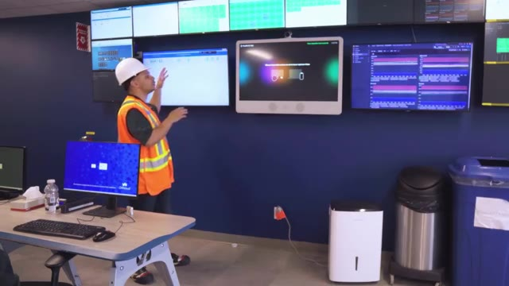
*📸 00:16:25 — Vue d'ensemble du mur de moniteurs (NOC) dans le data center avec un technicien en équipement de sécurité expliquant les tableaux de bord de supervision.*

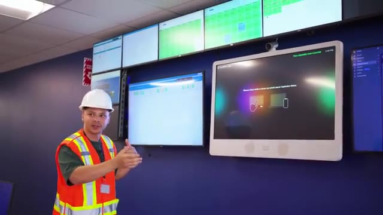
*📸 00:16:31 — Gros plan sur la salle de contrôle montrant plusieurs écrans affichant des métriques d'infrastructure et d'état des machines.*

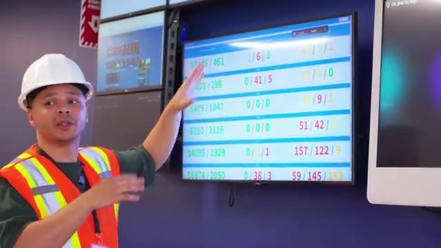
*📸 00:16:37 — Zoom sur l'écran central de monitoring affichant des tableaux de bord chiffrés avec des compteurs de machines et d'alertes en temps réel.*

---

### ⏱️ `[00:16:43 - 00:17:18]` | Segment #43

**🔊 Audio (Transcription Intégrale Mot pour Mot en Français) :**
> Donc, quand on détecte ce problème, les techniciens ici, ils vont pouvoir diagnostiquer, essayer de voir à distance qu'est-ce qui se passe. S'ils peuvent régler le problème à distance, ils vont le faire. Sinon, on va devoir aller physiquement sur la machine pour pouvoir changer le matériel si jamais il y a besoin. Et le chiffre au milieu, en rouge, qu'on voit, c'est le nombre d'interventions planifiées qui restent à faire. Donc, comme je l'ai dit, ça peut être des clients qui demandent à changer le disque dur ou qui demandent à ce qu'on a manuellement rebooter leurs machines ou des choses comme ça. On a aussi la météo qu'on surveille parce que avec le refroidissement liquide cette eau elle est refroidie avec l'air ambiant et donc du coup la météo affecte la température de l'eau qu'on va utiliser pour refroidir les serveurs. Donc c'est

**👁️ Analyse Visuelle d'Écran (gemini-3.5-flash-lite) :**
**Interface & Outils** : Tableaux de bord de supervision / monitoring affichés sur des écrans muraux de type NOC (Network Operations Center).

**Contenu textuel & Code** : Lignes de métriques et de statuts comportant des compteurs chiffrés avec des indicateurs colorés (vert, rouge, bleu).

**Action / Démonstration** : Explication du processus de détection et de diagnostic à distance des anomalies par les équipes techniques.

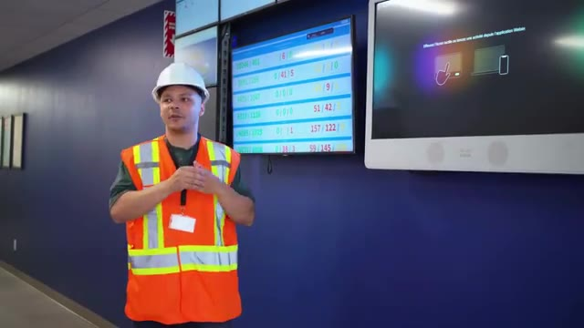
*📸 00:17:09 — Le présentateur explique le fonctionnement des tableaux de bord de supervision affichés sur les écrans muraux, détaillant les codes couleur des métriques d'incidents (vert, rouge).*

---

### ⏱️ `[00:17:18 - 00:17:47]` | Segment #44

**🔊 Audio (Transcription Intégrale Mot pour Mot en Français) :**
> pour ça qu'on essaie de surveiller la température. Tant que la température est assez stable ça va, mais c'est plus quand il y a des grosses variations dans la journée ou si par exemple il y a des prévisions d'orage qui pourraient potentiellement affecter l'alimentation électrique du coup on garde un oeil là dessus pour pouvoir s'assurer que tout va bien. Merci OVH pour m'avoir laissé balader dans leur data center. Et au passage ils viennent de lancer une toute nouvelle gamme de VPS avec un super bon rapport performance prix. Je pense ça va t'intéresser donc je te mets le lien en bas. Donc maintenant que tu connais mieux le côté matériel, pour savoir comment mettre en place une infrastructure solide avec ses serveurs, il faut que tu ailles voir cette vidéo.

**👁️ Analyse Visuelle d'Écran (gemini-3.5-flash-lite) :**
**Interface & Outils** : Présentation ou face-caméra sans interface informatique partagée.

**Contenu textuel & Code** : Explications orales des concepts, architectures et retours d'expérience.

**Action / Démonstration** : Démonstration pédagogique et mise en perspective technique.

---

