# 🎬 Recalé de mon entretien à cause de cette question de Linux

> **Chaîne** : [cocadmin](https://www.youtube.com/@cocadmin)  
> **Lien YouTube** : [https://www.youtube.com/watch?v=3RUuv9Y4Uww](https://www.youtube.com/watch?v=3RUuv9Y4Uww)  
> **Date de publication** : 20251004  
> **Durée** : 00:22:16  
> **Identifiant vidéo** : `3RUuv9Y4Uww`  
> **Transcription & Analyse** : `whisper-v3-large-turbo+gemini-3.5-flash-lite`  

---

## 📌 Synthèse Exécutive & Outils

### 💡 Résumé

Cette vidéo aborde une question technique redoutable souvent posée lors des entretiens pour des postes d'administrateur système Linux : l'explication détaillée de la structure et du rôle des différents répertoires du système de fichiers. L'intervenant partage son expérience personnelle d'un échec en entretien pour illustrer l'importance de maîtriser ces fondamentaux au-delà d'une simple utilisation quotidienne, transformant cette anecdote en une session de mentorat technique de haut niveau.

La démonstration se concentre d'abord sur le système de fichiers virtuel `/proc`, explorant en profondeur son architecture basée sur les processus (`PID`), l'inspection des variables d'environnement (`environ`), et l'analyse des descripteurs de fichiers (`fd`) pour le debugging avancé. Elle démystifie ensuite l'héritage historique de Linux en expliquant la complexité des répertoires binaires et des bibliothèques (`/bin`, `/sbin`, `/lib`, `/lib64`), leur fusion avec l'arborescence `/usr` (redéfini de *User* vers *Unix System Resources* via des liens symboliques), pour enfin clarifier le rôle moderne du répertoire `/home` et de la gestion des utilisateurs.

Pour un ingénieur DevOps, Cloud ou un administrateur système, la maîtrise de ces concepts est cruciale pour le dépannage de production (troubleshooting), l'audit de sécurité des applications et la compréhension fine du comportement du noyau Linux. Savoir naviguer dans `/proc` sans outils de haut niveau permet d'intervenir sur des systèmes gravement dégradés, tandis que comprendre la hiérarchie des exécutables et des bibliothèques évite des erreurs de configuration critiques lors du déploiement de conteneurs ou de serveurs nus (*bare-metal*).

### 🛠️ Outils, Modèles & Logiciels Présentés

* **`/proc` (Virtual Filesystem)** : Système de fichiers virtuel géré par le noyau Linux, exposé en mémoire vive pour fournir des informations en temps réel sur les processus et l'état du matériel.
* **`ps`** : Utilitaire standard de rapport des processus actifs sous Linux, s'appuyant directement sur les données du répertoire `/proc`.
* **`which`** : Commande permettant de localiser le chemin absolu d'un fichier exécutable correspondant à une commande donnée dans le `PATH`.
* **`Nginx`** : Serveur web haute performance utilisé ici comme cas d'étude pour l'analyse des processus et de l'arborescence PID.
* **`VS Code / Code-Server`** : Environnement de développement et son démon, utilisé pour démontrer l'inspection des descripteurs de fichiers ouverts et de la mémoire.
* **`/bin` & `/sbin`** : Répertoires historiques de binaires essentiels (système et administration), aujourd'hui convertis en liens symboliques vers `/usr/bin` et `/usr/sbin`.
* **`/usr` (Unix System Resources)** : Arborescence principale contenant les programmes, bibliothèques et ressources partagées du système.
* **`/home`** : Répertoire racine abritant les dossiers personnels des utilisateurs interactifs de la machine et leurs fichiers de configuration (`.bashrc`, clés SSH).

### 🔑 Points Clés & Enseignements Stratégiques

* **La nature virtuelle de `/proc`** : Les fichiers et dossiers chiffrés observés dans `/slash/proc` n'occupent aucun espace disque réel ; ils sont générés dynamiquement à la volée par le noyau Linux pour refléter l'état instantané du système.
* **Distinction sémantique de `proc`** : Le nom `/proc` désigne principalement les **processus** (`processes`) en cours d'exécution et non le processeur (`CPU`), bien qu'il contienne des fichiers d'introspection matérielle comme `cpuinfo`.
* **Introspection par PID** : Chaque processus actif possède un répertoire dédié nommé d'après son identifiant (`PID`), permettant d'inspecter unitairement son comportement via des commandes textuelles simples (`cat`).
* **Analyse de la ligne de commande (`cmdline`)** : Le fichier `cmdline` au sein d'un répertoire PID expose la commande exacte ainsi que les arguments et drapeaux (flags) passés au démarrage (ex. : mode *daemon*), facilitant l'audit de configuration.
* **Sécurité des variables d'environnement (`environ`)** : Les variables d'environnement ne constituent en aucun cas un moyen de stockage sécurisé ; tout processus ou administrateur disposant des droits de lecture peut inspecter en clair les secrets, tokens ou clés API passés de cette manière via `/proc/[pid]/environ`.
* **Diagnostic des fuites et bugs via les descripteurs de fichiers (`fd`)** : Le sous-dossier `fd` liste l'ensemble des descripteurs de fichiers ouverts par un processus (sockets, pipes, fichiers de logs, bibliothèques partagées), outil suprême de debugging pour une application sans logs explicites.
* **La fusion historique de `/bin` et `/sbin`** : Sur les distributions Linux modernes, `/bin` et `/sbin` ne sont que des liens symboliques pointant respectivement vers `/usr/bin` et `/usr/sbin`, une évolution rendue nécessaire par la saturation des anciennes partitions.
* **Évolution sémantique de `/usr`** : Originellement réservé aux répertoires personnels des utilisateurs (*User*), `/usr` a basculé vers la définition *Unix System Resources* face à l'explosion de la taille des logiciels, cédant la place à `/home` pour les données utilisateurs.
* **Ségrégation des architectures processeur (`lib64`)** : L'apparition des processeurs 64 bits a nécessité la création de répertoires dédiés (`lib64`) pour éviter les conflits de liaisons dynamiques avec les bibliothèques 32 bits héritées.
* **Rôle critique des fichiers de configuration utilisateur** : Les fichiers cachés du répertoire home comme `.bashrc` ou `.profile` permettent d'exécuter des scripts d'initialisation à la connexion, tandis que le dossier `.ssh/` gère l'authentification cryptographique par clés publiques et privées (`authorized_keys`).
* **Gestion des comptes système vs interactifs** : Seuls les utilisateurs réels (humains) se voient attribuer par défaut un répertoire personnel sous `/home`, les comptes de service (ex. : `www-data`) en étant généralement privés pour des raisons de sécurité et de propreté architecturale.
* **Bonne pratique de troubleshooting production** : En cas de défaillance critique d'un démon ou d'impossibilité d'exécuter les outils de monitoring standards (`ps`, `top`), la navigation directe dans l'arborescence `/proc` garantit une capacité de diagnostic de dernier recours (*fail-safe*).

---

## ⏱️ Chronologie & Transcription Complète Audio & Visuelle (Mot pour Mot)

### ⏱️ `[00:00:00 - 00:00:19]` | Segment #01

**🔊 Audio (Transcription Intégrale Mot pour Mot en Français) :**
> À l'époque où je cherchais mon tout premier job d'administrateur système, j'ai eu une entrevue technique, et une des questions c'était d'expliquer à quoi servent les différents répertoires dans Linux. Et même si j'avais déjà pas mal d'expérience avec Linux, pour la plupart je ne savais pas exactement comment répondre, et évidemment j'ai été recalé. Pour éviter que ça t'arrive un jour, on va commencer avec le répertoire proc. Donc si on se met dans slash proc, on va voir qu'il y a plein de chiffres.

**👁️ Analyse Visuelle d'Écran (gemini-3.5-flash-lite) :**
**Interface & Outils** : AUCUNE

**Contenu textuel & Code** : AUCUN

**Action / Démonstration** : Introduction narrative de la vidéo sur l'expérience d'entretien technique du créateur.

---

### ⏱️ `[00:00:20 - 00:00:38]` | Segment #02

**🔊 Audio (Transcription Intégrale Mot pour Mot en Français) :**
> En fait tous ces répertoires et ces fichiers qui sont dans proc, ils ne sont pas vraiment vrais. C'est ce qu'on appelle un système de fichier virtuel. Et donc quand on demande au kernel de nous lisser ce qu'il y a dans ce répertoire, il nous répond des choses qui n'existent pas vraiment sur notre disque dur, mais qui correspondent à des processus, c'est ça que veut dire proc, qui tournent actuellement sur notre machine. Donc en fait, c'est pas proc pour processeur, c'est plus proc pour processus.

**👁️ Analyse Visuelle d'Écran (gemini-3.5-flash-lite) :**
**Interface & Outils** : Aucune interface visible.

**Contenu textuel & Code** : Aucun contenu technique, de code ou de terminal visible.

**Action / Démonstration** : Explication orale par le présentateur sur le fonctionnement du système de fichiers virtuel /proc sous Linux.

---

### ⏱️ `[00:00:38 - 00:00:59]` | Segment #03

**🔊 Audio (Transcription Intégrale Mot pour Mot en Français) :**
> Et d'ailleurs, dans l'interview, j'avais dit que ce répertoire donnait des informations sur les processeurs, ce qui est un petit peu vrai, parce que comme on voit ici, il y a un fichier qui s'appelle CPU info, qui donne effectivement des informations sur le processeur, la fréquence, l'ombre de cache, etc. Mais principalement, ça donne des infos sur les processus. Donc on peut utiliser la commande ps pour avoir la liste des processus qui tournent sur notre machine. Et donc on voit ici qu'ils ont des PID pour processus ID.

**👁️ Analyse Visuelle d'Écran (gemini-3.5-flash-lite) :**
**Interface & Outils** : Terminal Linux (Bash) avec affichage de l'arborescence et des commandes système.

**Contenu textuel & Code** : Commandes `cd /proc`, `ls`, `cat cpuinfo` et `ps aux` avec détails sur les CPU Intel Xeon E5-2698 v3 et les processus PID.

**Action / Démonstration** : Navigation dans le système de fichiers virtuel /proc pour illustrer les informations matérielles et les processus du système d'exploitation.

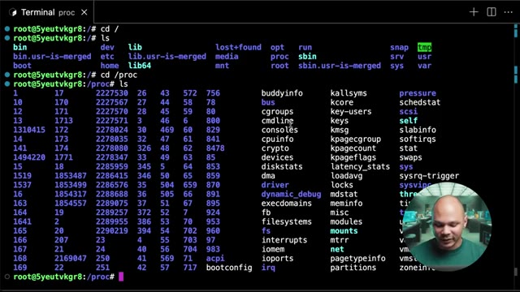
*📸 00:00:43 — Exploration du répertoire /proc sous Linux listant les fichiers et processus virtuels du système.*

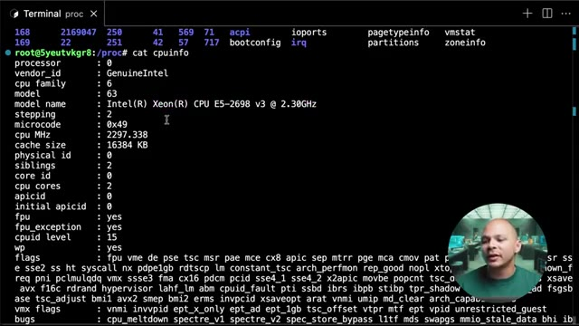
*📸 00:00:48 — Affichage du contenu du fichier /proc/cpuinfo révélant les caractéristiques techniques du processeur Intel Xeon.*

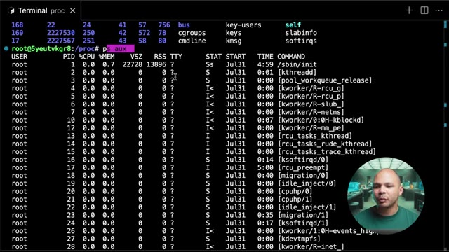
*📸 00:00:54 — Exécution de la commande ps aux affichant la liste des processus actifs du système Linux.*

---

### ⏱️ `[00:00:59 - 00:01:20]` | Segment #04

**🔊 Audio (Transcription Intégrale Mot pour Mot en Français) :**
> Et tous ces chiffres qu'on voit ici qui vont de 1 jusqu'à un gros chiffre, et bien c'est des chiffres qui permettent d'identifier chacun des processus. Et donc on voit par exemple ici que j'ai Nginx qui tourne, qui est un serveur web, et il tourne avec le processus 222 7567. Et donc si je regarde ici dans mon répertoire, et bien j'ai un répertoire qui correspond à 222 7567. Et donc si je vais dedans, et bien là je vais avoir tout un tas d'informations liées à ce processus.

**👁️ Analyse Visuelle d'Écran (gemini-3.5-flash-lite) :**
**Interface & Outils** : Terminal Linux (CLI)

**Contenu textuel & Code** : Commandes 'ps aux' et 'ls' exécutées dans le répertoire /proc, affichant les identifiants de processus (PID) comme celui de Nginx (2227567).

**Action / Démonstration** : Explication de la correspondance entre les PID des processus Linux et les répertoires virtuels du même nom présents dans le système de fichiers /proc.

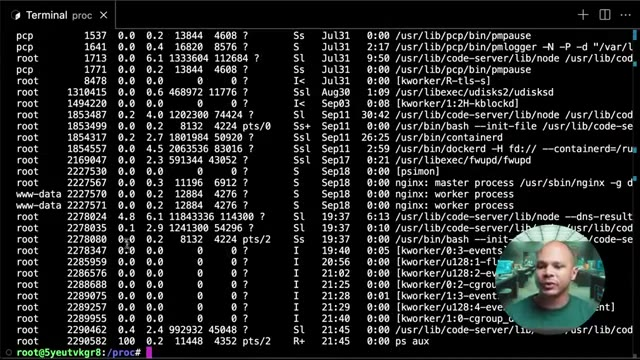
*📸 00:01:04 — Terminal Linux affichant la sortie d'une commande de type 'ps aux' listant les processus actifs du système avec leurs PID, dont Nginx.*

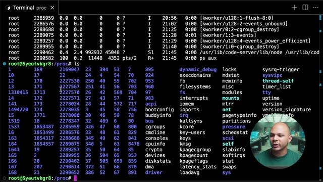
*📸 00:01:15 — Terminal Linux affichant le contenu du répertoire /proc via la commande 'ls', révélant les dossiers numériques correspondant aux PID des processus ainsi que les fichiers virtuels du noyau.*

---

### ⏱️ `[00:01:20 - 00:01:39]` | Segment #05

**🔊 Audio (Transcription Intégrale Mot pour Mot en Français) :**
> Donc c'est dans ce répertoire que la commande PS, le programme PS, vient chercher pour pouvoir avoir ces informations. Par exemple, si on fait cat status, là on a des informations de base comme c'est quoi son nom, son ID, etc. Si on regarde stat M, on peut voir par exemple les informations de mémoire, combien de mémoire ce processus est en train d'utiliser, combien il a réservé, etc.

**👁️ Analyse Visuelle d'Écran (gemini-3.5-flash-lite) :**
**Interface & Outils** : Terminal Linux

**Contenu textuel & Code** : Commande 'cat status' exécutée dans /proc/2227567, affichant les métadonnées du processus nginx (Name: nginx, State: S, Pid: 2227567, VmSize, etc.)

**Action / Démonstration** : Explication du contenu du répertoire /proc et lecture des informations d'état d'un processus via 'cat status'.

![Terminal Linux affichant le contenu du répertoire /proc/[PID] et l'exécution de la commande 'cat status' pour un processus nginx.](../screenshots/3RUuv9Y4Uww/3RUuv9Y4Uww_000130_seg5.jpg)
*📸 00:01:30 — Terminal Linux affichant le contenu du répertoire /proc/[PID] et l'exécution de la commande 'cat status' pour un processus nginx.*

---

### ⏱️ `[00:01:39 - 00:01:58]` | Segment #06

**🔊 Audio (Transcription Intégrale Mot pour Mot en Français) :**
> C'est un peu plus détaillé dans le man ici pour savoir exactement quel chiffre correspond à quoi. On peut voir aussi comment la commande a été appelée par exemple avec CMDLine. Donc là ici on voit que Nginx a été démarré. depuis usr slash bin nginx, mais on voit aussi les arguments qui ont été donnés, tiré g, daemon un, etc. Ce qui veut dire qu'il est démarré en arrière-plan. Mais aussi, il y a pas mal de choses qu'on ne peut pas voir avec PS ni avec d'autres outils.

**👁️ Analyse Visuelle d'Écran (gemini-3.5-flash-lite) :**
**Interface & Outils** : Présentation ou face-caméra sans interface informatique partagée.

**Contenu textuel & Code** : Explications orales des concepts, architectures et retours d'expérience.

**Action / Démonstration** : Démonstration pédagogique et mise en perspective technique.

---

### ⏱️ `[00:01:58 - 00:02:20]` | Segment #07

**🔊 Audio (Transcription Intégrale Mot pour Mot en Français) :**
> Si on regarde un autre processus, ps-hoax-creep-code, j'ai un processus ici qui s'appelle code-server, blablabla, qui tourne avec l'ID 702. Donc si je vais dans 702, je retrouve exactement la même chose, pour pouvoir voir les informations de mémoire, combien ça consommait de CPU et plein d'autres choses. Ce qui peut servir de temps en temps pour pouvoir débugger, c'est de voir les variables d'environnement qui ont été passées à ce processus.

**👁️ Analyse Visuelle d'Écran (gemini-3.5-flash-lite) :**
**Interface & Outils** : Terminal Linux interactif (CLI)

**Contenu textuel & Code** : Commandes 'ps aux | grep code' et 'ls' exécutées dans l'arborescence du système de fichiers virtuel /proc du noyau Linux.

**Action / Démonstration** : Recherche et inspection d'un processus spécifique (code-server PID 702) via le système de fichiers /proc pour analyser ses informations d'exécution.

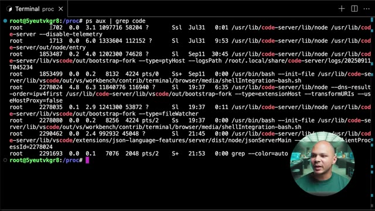
*📸 00:02:04 — Terminal Linux affichant la liste des processus en cours filtrés via la commande ps aux | grep code, montrant le processus code-server avec le PID 702.*

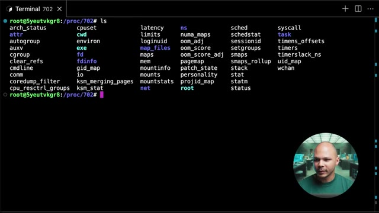
*📸 00:02:09 — Terminal Linux affichant le contenu du répertoire virtuel /proc/702 pour inspecter en détail l'état et les métriques du processus code-server.*

---

### ⏱️ `[00:02:20 - 00:02:39]` | Segment #08

**🔊 Audio (Transcription Intégrale Mot pour Mot en Français) :**
> Donc si on a lancé un programme, par exemple, une application web ou quelque chose comme ça, on lui a passé les variables d'environnement. Et sur notre machine, on veut essayer de débuguer pour voir qu'est-ce que la machine a vraiment reçu. Et bien, on peut voir ici avec le fichier environ. Et donc là, on voit toutes les variables d'environnement qui ont été passées à mon processus. Donc ça, c'est quelque chose à garder en tête parce que souvent, on se dit passer les variables d'environnement à mon processus, c'est une bonne pratique.

**👁️ Analyse Visuelle d'Écran (gemini-3.5-flash-lite) :**
**Interface & Outils** : Terminal Linux (bash/shell) sous VS Code ou environnement similaire.

**Contenu textuel & Code** : Commandes 'ls' dans le dossier /proc/702 listant les descripteurs de processus et 'cat environ' affichant les variables d'environnement brutes (USER, HOME, PATH, etc.).

**Action / Démonstration** : Inspection du répertoire procédural (/proc) pour déboguer et vérifier les variables d'environnement transmises à un processus en cours d'exécution.

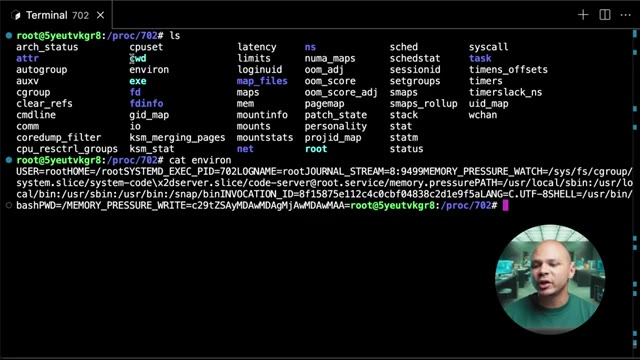
*📸 00:02:30 — Terminal Linux affichant le contenu du répertoire /proc/702 et la lecture du fichier environ pour inspecter les variables d'environnement d'un processus.*

---

### ⏱️ `[00:02:39 - 00:03:01]` | Segment #09

**🔊 Audio (Transcription Intégrale Mot pour Mot en Français) :**
> Je peux passer des clés, je peux passer des tokens, des secrets, des choses comme ça parce que les variables d'environnement sont sécurisés. mais en fait, il n'y a rien de particulièrement sécurisé aux variables d'environnement. C'est juste une façon pratique de passer des informations à un programme sans avoir à complètement recompiler le programme. Et si jamais on a besoin de voir quelles sont les variables qui ont été passées, ça, c'est une bonne manière. Quelque chose qui est utile aussi, quand on fait un debug un peu plus poussé, c'est de voir quels fichiers sont ouverts par ce processus.

**👁️ Analyse Visuelle d'Écran (gemini-3.5-flash-lite) :**
**Interface & Outils** : AUCUNE

**Contenu textuel & Code** : AUCUNE

**Action / Démonstration** : Explication théorique sur la sécurité relative des variables d'environnement.

---

### ⏱️ `[00:03:02 - 00:03:20]` | Segment #10

**🔊 Audio (Transcription Intégrale Mot pour Mot en Français) :**
> Imagine que tu as un processus, que tu as récupéré je ne sais pas trop où, et tu veux essayer de comprendre qu'est-ce qu'il fait, parce qu'il n'y a pas vraiment de log, il bug, mais tu ne sais pas vraiment pourquoi. Tu peux voir dans le dossier FD, qui correspond au file descriptor, c'est-à-dire les fichiers qui ont été ouverts par ce processus. Et donc là, si on voit ici, tous ces chiffres-là, c'est des fichiers qui correspondent à des fichiers qui sont ouverts par ce processus.

**👁️ Analyse Visuelle d'Écran (gemini-3.5-flash-lite) :**
**Interface & Outils** : Terminal Linux interactif avec incrustation vidéo du présentateur dans le coin inférieur droit.

**Contenu textuel & Code** : Commandes 'ls', 'cat environ' et 'cd fd' exécutées dans le répertoire virtuel du système de fichiers /proc/702.

**Action / Démonstration** : Exploration du système de fichiers /proc pour analyser l'état d'un processus et ses descripteurs de fichiers (fd) afin de diagnostiquer un problème.

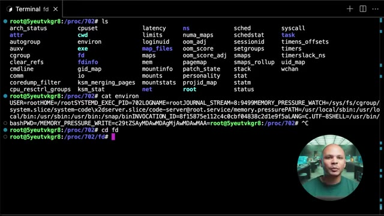
*📸 00:03:11 — Terminal Linux affichant le contenu du répertoire /proc/702 pour inspecter un processus et navigation vers le dossier des descripteurs de fichiers (fd).*

---

### ⏱️ `[00:03:21 - 00:03:45]` | Segment #11

**🔊 Audio (Transcription Intégrale Mot pour Mot en Français) :**
> Donc là, c'est VS Code. Si par exemple, j'ouvre un fichier dans mon répertoire, je vais avoir un ID qui va correspondre à ce fichier-là. Si par exemple VS Code a besoin de librairie pour pouvoir fonctionner, pareil, chaque librairie correspond à un fichier et chaque fichier va avoir son file descripteur ici. Donc je vais pouvoir savoir quel fichier a été ouvert par mon processus, ce qui peut parfois être assez utile. Donc là, par exemple, si je vais dans 0, si je fais LSLA, Et je vois que 0, c'est dev nul.

**👁️ Analyse Visuelle d'Écran (gemini-3.5-flash-lite) :**
**Interface & Outils** : Présentation ou face-caméra sans interface informatique partagée.

**Contenu textuel & Code** : Explications orales des concepts, architectures et retours d'expérience.

**Action / Démonstration** : Démonstration pédagogique et mise en perspective technique.

---

### ⏱️ `[00:03:45 - 00:04:03]` | Segment #12

**🔊 Audio (Transcription Intégrale Mot pour Mot en Français) :**
> Ici, on a des sockets, des pipes. Et ici, on voit, par exemple, on a des fichiers. Des fichiers de log. Parce que mon processus a ouvert ces fichiers de log pour pouvoir écrire dedans. Donc, il y a pas mal de choses super intéressantes à voir dans le slashprog. Je vous invite à fouiller un petit peu plus. Un autre truc qui est un petit peu bizarre dans les répertoires, si on voit qu'on a répertoire ici, slash bin, on a un autre répertoire qui s'appelle bin.usr ismerge.

**👁️ Analyse Visuelle d'Écran (gemini-3.5-flash-lite) :**
**Interface & Outils** : Terminal Linux interactif.

**Contenu textuel & Code** : Commandes `ls -al /proc/702/fd` et `ls`, affichant respectivement la liste des file descriptors d'un processus et l'arborescence racine Linux.

**Action / Démonstration** : Exploration du système de fichiers virtuel `/proc` pour inspecter les ressources système et les descripteurs de fichiers ouverts par un processus.

*📸 00:03:49 — Affichage du contenu du dossier de descripteurs de fichiers `/proc/702/fd` via la commande `ls -al`, révélant des sockets, des pipes et des fichiers de log ouverts.*

*📸 00:03:59 — Affichage de la racine du système de fichiers `/` via la commande `ls`, montrant les répertoires standards de Linux (bin, etc, proc, sys, etc.).*

---

### ⏱️ `[00:04:03 - 00:04:23]` | Segment #13

**🔊 Audio (Transcription Intégrale Mot pour Mot en Français) :**
> OK, c'est bizarre. On voit qu'on a aussi un sbin. Et encore plus bizarre, si on va dans usr, eh bien, on voit que dans usr, on a aussi un bin et un usr sbin. Donc c'est quoi ce bordel ? Pourquoi est-ce qu'il y a des bin sbin, usr sbin ? Qu'est-ce qui se passe ? En fait, à la base, usr, c'était le répertoire utilisateur. C'est un peu l'équivalent du home qu'on a aujourd'hui.

**👁️ Analyse Visuelle d'Écran (gemini-3.5-flash-lite) :**
**Interface & Outils** : Aucune interface ou terminal affiché.

**Contenu textuel & Code** : Aucun contenu technique textuel ou graphique visible.

**Action / Démonstration** : Explication orale par le présentateur sur l'historique et la structure des répertoires Linux (/bin, /sbin, /usr/bin, /usr/sbin).

---

### ⏱️ `[00:04:23 - 00:04:42]` | Segment #14

**🔊 Audio (Transcription Intégrale Mot pour Mot en Français) :**
> Mais au tout début, on n'avait pas encore home. Donc tout ce qui était les fichiers des utilisateurs, les personnes qui utilisaient la machine, ils veulent sauvegarder les fichiers sur lesquels ils sont en train de travailler. Ils allaient les mettre dans usr, usr pour user. Ensuite, dans slash bin, on avait tous les binaires, donc tous les programmes qu'on a besoin pour faire fonctionner notre machine. Donc par exemple, quand je fais ls, ls c'est un binaire.

**👁️ Analyse Visuelle d'Écran (gemini-3.5-flash-lite) :**
**Interface & Outils** : Aucun terminal, interface cloud ou outil DevOps affiché.

**Contenu textuel & Code** : Aucun code, commande ou architecture visible.

**Action / Démonstration** : Explication théorique de l'historique du répertoire /usr et des binaires sous Unix/Linux.

---

### ⏱️ `[00:04:42 - 00:05:04]` | Segment #15

**🔊 Audio (Transcription Intégrale Mot pour Mot en Français) :**
> C'est un programme qui demande au kernel d'aller regarder dans le disque dur et de me donner la liste des fichiers qui sont dans le répertoire où je suis actuellement. Si je veux savoir où est ce binaire ls, il y a une commande qui s'appelle which. Et si on lui demande où est ls, ça me dit qu'en fait ls est dans slash usr slash bin slash ls. On peut même faire which which pour savoir où est la commande which en elle-même et elle est dans usr bin which.

**👁️ Analyse Visuelle d'Écran (gemini-3.5-flash-lite) :**
**Interface & Outils** : Terminal Linux interactif avec affichage de l'arborescence racine et de l'utilisateur root.

**Contenu textuel & Code** : Commandes exécutées : ls (listant les dossiers bin, etc, usr, var, etc.), cd usr/, puis de nouveau ls (listant bin, games, include, lib, local, sbin, share, src).

**Action / Démonstration** : Exploration de l'arborescence du système de fichiers Linux pour illustrer l'emplacement des répertoires système et des exécutables.

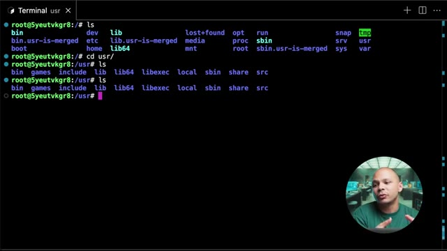
*📸 00:04:48 — Terminal Linux affichant la racine du système de fichiers et la navigation dans le répertoire /usr avec la commande ls.*

---

### ⏱️ `[00:05:05 - 00:05:28]` | Segment #16

**🔊 Audio (Transcription Intégrale Mot pour Mot en Français) :**
> Donc à la base, tous ces processus-là, ils étaient dans slash bin, donc tous les processus que les utilisateurs allaient avoir besoin. Et dans Sbin, c'était juste les processus que les administrateurs de la machine allaient avoir besoin. Comme par exemple, gérer les IP tables, passer en mode sudo, des choses comme ça. Par exemple, si on fait which IP table, hop, bon, IP table, on voit que c'est dans Sbin. Si je fais la commande IP, qui permet de voir la configuration réseau de ma machine, pareil, c'est dans Sbin.

**👁️ Analyse Visuelle d'Écran (gemini-3.5-flash-lite) :**
**Interface & Outils** : Terminal Linux

**Contenu textuel & Code** : Commandes exécutées : ls, cd usr/, which ls, which which, which sudo, which iptables (retournant /usr/sbin/iptables).

**Action / Démonstration** : Explication et démonstration de la localisation des fichiers binaires utilisateur et administrateur (/bin vs /sbin) à l'aide de la commande which.

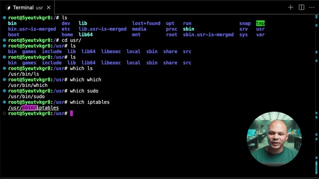
*📸 00:05:22 — Terminal Linux affichant l'arborescence racine (/), le contenu du répertoire /usr et l'utilisation de la commande 'which' pour localiser des binaires comme ls, which, sudo et iptables.*

---

### ⏱️ `[00:05:28 - 00:05:53]` | Segment #17

**🔊 Audio (Transcription Intégrale Mot pour Mot en Français) :**
> Sauf que là, on voit que c'est dans usr slash Sbin, pas dans Sbin. En fait, si on revient à la racine de mon système de fichiers, si je fais ls-la pour pouvoir avoir plus d'informations sur chacun des fichiers, on voit qu'en fait bin, c'est un lien symbolique vers usr bin. Et que sbin, c'est un lien symbolique vers usr sbin. À la base, au tout début de Linux, au tout début de Unix même, parce que Linux est basé sur Unix, c'est là-bas où on mettait nos programmes, dans slash bin et slash sbin.

**👁️ Analyse Visuelle d'Écran (gemini-3.5-flash-lite) :**
**Interface & Outils** : Terminal Linux interactif (fenêtre de terminal standard).

**Contenu textuel & Code** : Commande `ls -la` exécutée à la racine (`/`), affichant la structure des dossiers et les liens symboliques (`bin -> usr/bin`, `sbin -> usr/sbin`).

**Action / Démonstration** : Le présentateur liste le contenu de la racine du système de fichiers pour démontrer que les répertoires binaires et sbinaires sont des liens symboliques vers `/usr`.

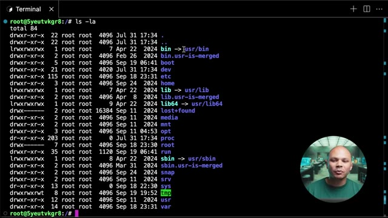
*📸 00:05:40 — Terminal Linux affichant le résultat de la commande 'ls -la' à la racine du système, montrant les liens symboliques 'bin' et 'sbin' vers '/usr/bin' et '/usr/sbin'.*

---

### ⏱️ `[00:05:53 - 00:06:14]` | Segment #18

**🔊 Audio (Transcription Intégrale Mot pour Mot en Français) :**
> Mais petit à petit, on a commencé à mettre tellement de choses là-bas qu'il n'y avait pas assez d'espace sur la partition pour pouvoir tout garder. Et donc les gens ont commencé à mettre leur programme supplémentaire dans slash usr, parce que c'était le répertoire home, donc c'était sur une partition différente pour pouvoir avoir leurs propres fichiers. Et donc ils ont commencé à les mettre dans slash usr bin, slash usr sbin pour pouvoir avoir plus de programmes que ce qu'il y avait déjà de base.

**👁️ Analyse Visuelle d'Écran (gemini-3.5-flash-lite) :**
**Interface & Outils** : Présentation ou face-caméra sans interface informatique partagée.

**Contenu textuel & Code** : Explications orales des concepts, architectures et retours d'expérience.

**Action / Démonstration** : Démonstration pédagogique et mise en perspective technique.

---

### ⏱️ `[00:06:14 - 00:06:43]` | Segment #19

**🔊 Audio (Transcription Intégrale Mot pour Mot en Français) :**
> Et donc on s'est retrouvés comme ça avec 4 répertoires différents pour mettre nos programmes. Et donc dans les distributions récentes, ils ont un petit peu nettoyé ça entre guillemets. Et donc slash bin et slash sbin sont en fait des liens qui vont vers usr. Et donc c'est dans usr bin et usr sbin qu'on a vraiment les exécutables. D'un côté pour les utilisateurs et de l'autre côté pour les administrateurs. Il s'est passé exactement la même chose pour slash lib qui contient les librairies, donc tous les paquets, les modules que nos programmes ont besoin d'utiliser parce que les programmes peuvent partager certains modules pour éviter d'avoir à recoder tout le temps la même chose.

**👁️ Analyse Visuelle d'Écran (gemini-3.5-flash-lite) :**
**Interface & Outils** : Terminal Linux interactif avec affichage de la caméra du présentateur en incrustation (PiP).

**Contenu textuel & Code** : Commande `ls -la` exécutée à la racine (`/`), révélant que `bin -> usr/bin`, `lib -> usr/lib`, `lib64 -> usr/lib64` et `sbin -> usr/sbin` sont des liens symboliques.

**Action / Démonstration** : Explication de la structure des répertoires standard Linux et de la fusion récente des dossiers binaires vers /usr.

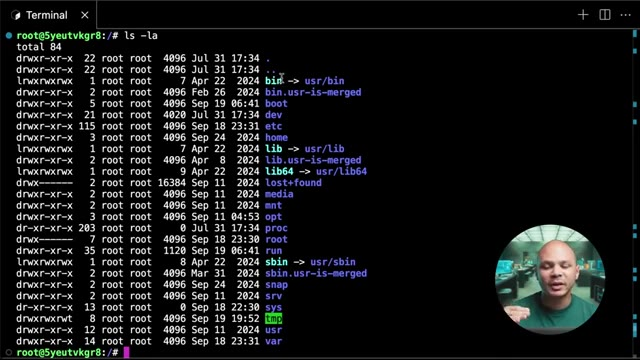
*📸 00:06:21 — Affichage du contenu de la racine du système de fichiers Linux montrant les liens symboliques de fusion vers /usr.*

---

### ⏱️ `[00:06:43 - 00:07:07]` | Segment #20

**🔊 Audio (Transcription Intégrale Mot pour Mot en Français) :**
> Donc petit à petit se sont retrouvés dans usr slash lib et donc on a un lien symbolique ici. Pareil pour lib64, ça c'est juste quand les processeurs 64 bits sont arrivés. Pour ne pas mélanger les librairies 32 bits avec les librairies 64 bits, on a créé un deuxième dossier et donc lui aussi se retrouve dans slash usr slash lib64. Et donc USR qui était à la base le répertoire Home se retrouve maintenant avec des programmes, avec des modules, avec des librairies, donc avec un peu pas mal de bordel.

**👁️ Analyse Visuelle d'Écran (gemini-3.5-flash-lite) :**
**Interface & Outils** : Présentation ou face-caméra sans interface informatique partagée.

**Contenu textuel & Code** : Explications orales des concepts, architectures et retours d'expérience.

**Action / Démonstration** : Démonstration pédagogique et mise en perspective technique.

---

### ⏱️ `[00:07:07 - 00:07:25]` | Segment #21

**🔊 Audio (Transcription Intégrale Mot pour Mot en Français) :**
> Et donc c'est pour cette raison qu'au bout d'un moment on s'est dit bon bah là USR ça ne correspond plus vraiment à un répertoire personnel pour les utilisateurs. Donc à partir de maintenant on va faire semblant et on va dire que c'est plus USR pour User, c'est USR pour Unix System Resources. Et on va maintenant créer un nouveau dossier qui s'appelle Slash Home qui lui va contenir les répertoires et les fichiers des utilisateurs.

**👁️ Analyse Visuelle d'Écran (gemini-3.5-flash-lite) :**
**Interface & Outils** : Présentation ou face-caméra sans interface informatique partagée.

**Contenu textuel & Code** : Explications orales des concepts, architectures et retours d'expérience.

**Action / Démonstration** : Démonstration pédagogique et mise en perspective technique.

---

### ⏱️ `[00:07:25 - 00:07:46]` | Segment #22

**🔊 Audio (Transcription Intégrale Mot pour Mot en Français) :**
> Et donc si on va dans « Slash Home », on va retrouver un répertoire pour chacun des utilisateurs qui est créé sur la machine. Donc là par exemple, j'ai un seul utilisateur, c'est l'utilisateur qui s'appelle Ubuntu, et donc dans Ubuntu, j'ai les répertoires personnels. Donc là ici, je ne vois rien, mais techniquement si je fais « LSLA », j'ai quand même un « Bash Logout », « Bash RC », « Profile », etc. Les plus intéressants, c'est « Bash RC » et « Profile » aussi techniquement.

**👁️ Analyse Visuelle d'Écran (gemini-3.5-flash-lite) :**
**Interface & Outils** : Terminal Linux distant (SSH/shell) avec vignette incrustée du présentateur en bas à droite

**Contenu textuel & Code** : Commandes 'cd /home/' et 'ls' exécutées en tant que root, affichant le répertoire 'ubuntu'

**Action / Démonstration** : Navigation dans le répertoire home pour lister les dossiers personnels des utilisateurs présents sur la machine

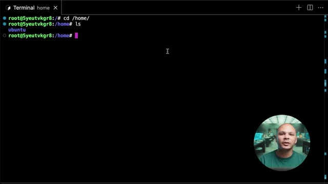
*📸 00:07:30 — Un terminal Linux affichant le contenu du répertoire /home/ avec la présence du dossier utilisateur 'ubuntu'*

---

### ⏱️ `[00:07:46 - 00:08:08]` | Segment #23

**🔊 Audio (Transcription Intégrale Mot pour Mot en Français) :**
> C'est deux fichiers dans lesquels on peut mettre des petits morceaux de script pour pouvoir configurer ce qui va se passer au moment où on va se loguer sur la machine. J'ai oublié c'est quoi la petite différence entre les deux, mais je crois qu'il y en a un qui se charge avant l'autre ou quelque chose comme ça. Mais globalement, il sert à faire la même chose. Et on retrouve aussi SSH. Donc, c'est là où on va retrouver, par exemple, les clés SSH qui nous permettent de nous connecter à d'autres machines. Ou même, dans Authorize Key, d'accepter les clés SSH d'autres utilisateurs pour qu'ils puissent se connecter en tant que cet utilisateur-là sur cette machine.

**👁️ Analyse Visuelle d'Écran (gemini-3.5-flash-lite) :**
**Interface & Outils** : Présentation ou face-caméra sans interface informatique partagée.

**Contenu textuel & Code** : Explications orales des concepts, architectures et retours d'expérience.

**Action / Démonstration** : Démonstration pédagogique et mise en perspective technique.

---

### ⏱️ `[00:08:08 - 00:08:30]` | Segment #24

**🔊 Audio (Transcription Intégrale Mot pour Mot en Français) :**
> Donc, j'ai dit tous les utilisateurs, mais il y a une petite exception. Premièrement, ce n'est pas tous les utilisateurs. Là, on voit ici qu'il y a pas mal d'utilisateurs sur la machine. mais il n'y a que l'utilisateur Ubuntu qui a son répertoire Home. Donc c'est que si je crée un utilisateur vraiment qui va être utilisé par une vraie personne que je vais avoir un répertoire Home. Et sinon je peux avoir des utilisateurs comme par exemple ici WWData qui est l'utilisateur qui est utilisé par le processus Nginx pour pouvoir servir les fichiers qu'il a besoin, etc.

**👁️ Analyse Visuelle d'Écran (gemini-3.5-flash-lite) :**
**Interface & Outils** : Terminal Linux (Ubuntu) avec affichage du fichier de configuration des utilisateurs (/etc/passwd).

**Contenu textuel & Code** : Lignes de configuration du fichier /etc/passwd affichant les UID, GID, répertoires home et shells des différents comptes système et utilisateurs.

**Action / Démonstration** : Explication et analyse par l'expert de la structure des comptes utilisateurs sous Linux, en montrant la différence entre les comptes de services (nologin) et le compte réel 'ubuntu' doté d'un répertoire personnel (/home/ubuntu).

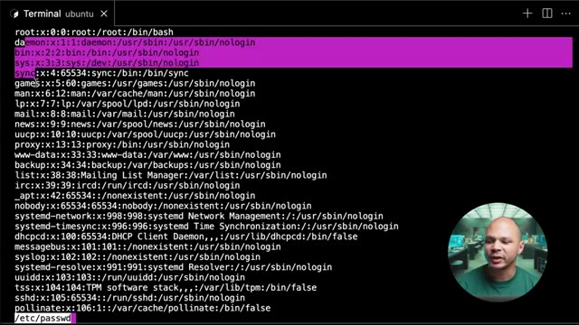
*📸 00:08:14 — Affichage du contenu du fichier /etc/passwd dans un terminal Linux montrant la liste des utilisateurs système (root, daemon, bin, etc.) avec leurs shells configurés à /usr/sbin/nologin.*

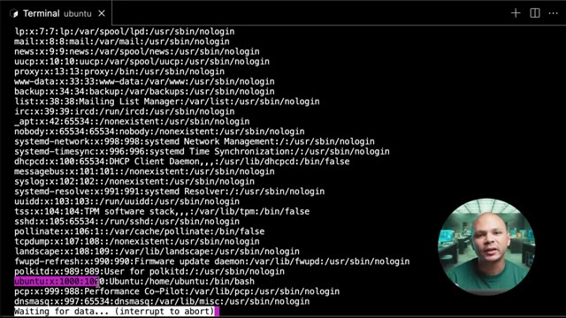
*📸 00:08:19 — Continuation de la liste du fichier /etc/passwd dans le terminal Linux, mettant en évidence la ligne de l'utilisateur standard 'ubuntu' avec son répertoire personnel /home/ubuntu et son shell /bin/bash.*

---

### ⏱️ `[00:08:31 - 00:08:50]` | Segment #25

**🔊 Audio (Transcription Intégrale Mot pour Mot en Français) :**
> Et l'autre exception, c'est pour l'utilisateur root, l'utilisateur super admin. Donc on n'a pas de slash home slash root, on a directement slash root. Donc à la racine de mon système de fichiers. Pourquoi est-ce qu'on a fait ça ? Ça paraît un peu compliqué, bizarre. c'est parce que très souvent, notre répertoire home, on va le monter dans un disque différent de mon répertoire slash qui va contenir tous les fichiers de mon système.

**👁️ Analyse Visuelle d'Écran (gemini-3.5-flash-lite) :**
**Interface & Outils** : Terminal Linux interactif.

**Contenu textuel & Code** : Commandes exécutées : `ls -la .ssh/`, `cat .ssh/authorized_keys`, `less /etc/passwd`, `cd /root/`.

**Action / Démonstration** : Navigation vers le répertoire personnel de l'utilisateur root (`/root/`) suite à l'affichage des informations utilisateur.

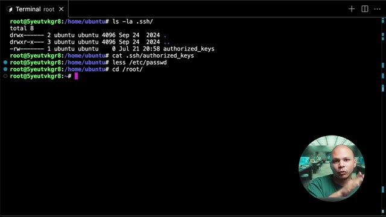
*📸 00:08:35 — Terminal Linux affichant des commandes de navigation et de vérification du répertoire root.*

---

### ⏱️ `[00:08:50 - 00:09:10]` | Segment #26

**🔊 Audio (Transcription Intégrale Mot pour Mot en Français) :**
> Comme ça, c'est une bonne pratique. On peut séparer les fichiers de mon système avec les fichiers personnels. Et donc, c'est plus facile pour pouvoir backuper. On peut backuper juste un seul système de fichiers et récupérer tous les répertoires et fichiers des utilisateurs sans backuper le système d'exploitation. Sauf que si jamais on a un problème avec la machine, et donc que le disque qui contient notre répertoire home, il est inaccessible pour une raison ou pour une autre.

**👁️ Analyse Visuelle d'Écran (gemini-3.5-flash-lite) :**
**Interface & Outils** : AUCUNE

**Contenu textuel & Code** : AUCUNE

**Action / Démonstration** : Explication théorique sur les bonnes pratiques de séparation des fichiers système et personnels pour la stratégie de sauvegarde.

---

### ⏱️ `[00:09:10 - 00:09:28]` | Segment #27

**🔊 Audio (Transcription Intégrale Mot pour Mot en Français) :**
> le disque de DM ne marche pas, il est sur le réseau, le réseau e-bug, il peut y avoir plein de raisons pour lesquelles on n'a pas accès. Pour pouvoir accéder à la machine, il faut que l'utilisateur root soit sur le même système des fichiers que le système d'exploitation. Comme ça, dans tous les cas, l'utilisateur root pourra toujours se connecter, il aura ses fichiers, etc. Donc c'est pour ça que c'est séparé. Ensuite, on a quelques autres répertoires qui n'ont rien de trop spécial.

**👁️ Analyse Visuelle d'Écran (gemini-3.5-flash-lite) :**
**Interface & Outils** : Présentation ou face-caméra sans interface informatique partagée.

**Contenu textuel & Code** : Explications orales des concepts, architectures et retours d'expérience.

**Action / Démonstration** : Démonstration pédagogique et mise en perspective technique.

---

### ⏱️ `[00:09:28 - 00:09:49]` | Segment #28

**🔊 Audio (Transcription Intégrale Mot pour Mot en Français) :**
> Si je vais par exemple dans slash opt, c'est opt pour optionnel. Et à la base, c'est un répertoire qui a été utilisé pour stocker tous les fichiers, fonctionnalités, etc., qui était optionnel. Donc maintenant, il y a encore quelques petits programmes qui vont s'installer là-bas par défaut, mais c'est de moins en moins utilisé. On a aussi TMP. TMP pour Temporary. Donc c'est tous les fichiers répertoires qu'on a besoin de manipuler, mais juste de manière temporaire.

**👁️ Analyse Visuelle d'Écran (gemini-3.5-flash-lite) :**
**Interface & Outils** : Terminal Linux (fenêtre sombre avec police monospaced)

**Contenu textuel & Code** : Commandes 'ls', 'ls /opt/', 'ls /tmp' et affichage des fichiers temporaires, sockets IPC de VS Code et dossiers systemd.

**Action / Démonstration** : Exploration des répertoires optionnels (/opt) et temporaires (/tmp) du système de fichiers Linux.

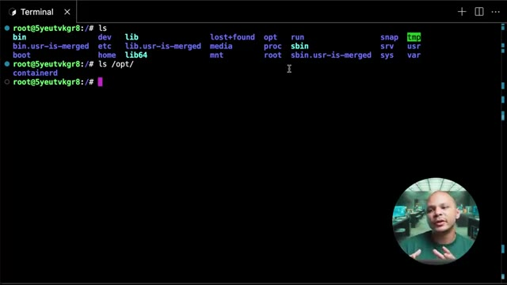
*📸 00:09:34 — Terminal Linux affichant le contenu de la racine (ls) et le contenu du répertoire /opt/ montrant containerd.*

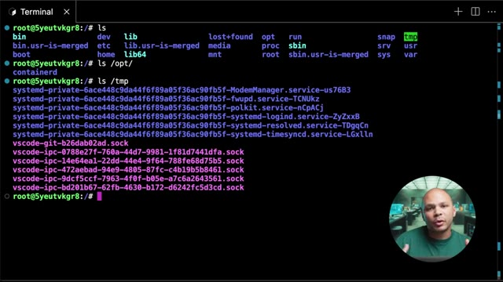
*📸 00:09:44 — Terminal Linux affichant le contenu du répertoire /tmp/ avec divers sockets et dossiers systemd-private.*

---

### ⏱️ `[00:09:49 - 00:10:10]` | Segment #29

**🔊 Audio (Transcription Intégrale Mot pour Mot en Français) :**
> Et sur la plupart des systèmes, ce répertoire-là, il est complètement effacé au redémarrage de la machine. Ça dépend de ta distribution, etc. Parfois c'est effacé au redémarrage, parfois pas. Mais en gros, il ne faut pas s'attendre à ce que les fichiers qui soient là-dedans restent très très longtemps. Donc souvent, les programmes vont stocker des fichiers et des répertoires là-dedans pour pouvoir fonctionner. et puis si jamais ils rebootent et ils perdent ces fichiers-là, c'est pas trop trop grave, ils en ont juste besoin pendant qu'ils fonctionnent.

**👁️ Analyse Visuelle d'Écran (gemini-3.5-flash-lite) :**
**Interface & Outils** : AUCUNE

**Contenu textuel & Code** : AUCUNE

**Action / Démonstration** : Explication orale du comportement des répertoires temporaires sous Linux au redémarrage de la machine.

---

### ⏱️ `[00:10:10 - 00:10:33]` | Segment #30

**🔊 Audio (Transcription Intégrale Mot pour Mot en Français) :**
> Un autre répertoire qui est un petit peu plus intéressant, c'est le répertoire Sys. Sys pour système. Et donc de la même manière que Slash Proc, Slash Sys, c'est un système de fichiers virtuel. Donc c'est toujours des fichiers qui n'existent pas vraiment sur le disque dur. Si jamais je débranche le disque dur de ma machine et que je le branche dans une autre et que je regarde ce qu'il y a dedans, il n'y a pas Slash Sys dedans. C'est vraiment le kernel, le système d'exploitation, qui fait semblant qu'il y a des fichiers qui s'appellent comme ça pour qu'on puisse interagir avec lui.

**👁️ Analyse Visuelle d'Écran (gemini-3.5-flash-lite) :**
**Interface & Outils** : Terminal Linux (ligne de commande).

**Contenu textuel & Code** : Commandes `ls`, `cd sys/`, et affichage des sous-dossiers de `/sys` (block, bus, class, dev, devices, firmware, fs, hypervisor, kernel, module, power).

**Action / Démonstration** : Exploration du système de fichiers virtuel `/sys` sous Linux pour illustrer sa structure et son rôle dans la gestion du système.

*📸 00:10:16 — Terminal Linux affichant le contenu du répertoire racine (`ls`), puis la navigation et l'énumération du système de fichiers virtuel `/sys` (`cd sys/`, `ls`).*

---

### ⏱️ `[00:10:33 - 00:10:56]` | Segment #31

**🔊 Audio (Transcription Intégrale Mot pour Mot en Français) :**
> Parce que comme sur des serveurs Linux, on n'a souvent pas d'interface graphique, il n'y a rien sur lequel on peut cliquer pour pouvoir modifier les paramètres de nos systèmes. Et donc c'est pour ça que dans Linux, tout est un fichier, même ce qui n'est pas vraiment des fichiers comme les paramètres du système. Ils sont quand même représentés sous forme de fichiers. Donc il y a énormément de choses dedans, mais quelques exemples que je peux donner, c'est par exemple si on veut voir la fréquence de notre CPU, on peut utiliser 4 qui est juste une commande pour afficher le contenu d'un fichier.

**👁️ Analyse Visuelle d'Écran (gemini-3.5-flash-lite) :**
**Interface & Outils** : Terminal de ligne de commande (shell) sous macOS/Linux avec l'invite de commande utilisateur (`thomas@sprite:~ $`).

**Contenu textuel & Code** : Invite de commande bash active, aucun script ni sortie de commande affichée pour l'instant.

**Action / Démonstration** : Explication théorique sur la gestion des serveurs Linux sans interface graphique, préparation de l'utilisation du terminal pour illustrer les concepts.

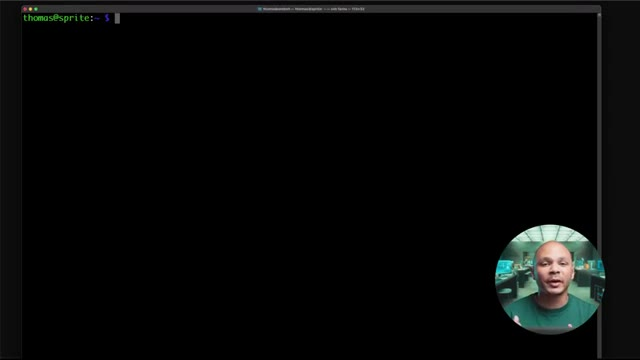
*📸 00:10:50 — Écran montrant un terminal de commande vide avec le présentateur en incrustation (picture-in-picture) dans le coin inférieur droit.*

---

### ⏱️ `[00:10:56 - 00:11:16]` | Segment #32

**🔊 Audio (Transcription Intégrale Mot pour Mot en Français) :**
> Et donc si on va dans SysDevice, Système, CPU, blablabla, on peut avoir la fréquence de mon CPU. Donc là on voit qu'on est à 600 000 Hz, donc 600 MHz parce que c'est un Raspberry Pi. Un autre exemple, par exemple sur mon Raspberry Pi, physiquement, il y a des LEDs qui clignotent pour indiquer s'il est allumé, s'il y a de l'activité, des choses comme ça. Et bien ces LEDs, on peut interagir avec directement via SlashSys.

**👁️ Analyse Visuelle d'Écran (gemini-3.5-flash-lite) :**
**Interface & Outils** : Aucune

**Contenu textuel & Code** : Aucun

**Action / Démonstration** : Explication orale de concepts matériels (fréquence CPU d'un Raspberry Pi, LEDs d'activité physique).

---

### ⏱️ `[00:11:16 - 00:11:37]` | Segment #33

**🔊 Audio (Transcription Intégrale Mot pour Mot en Français) :**
> Donc avec la commande ECHO, c'est juste la commande pour afficher quelque chose. On va afficher 0 et ici on va utiliser le chevron qui va prendre le résultat de la commande qui est à gauche. donc ça va juste être la chaîne de caractère 0, et qui va l'écrire dans un fichier. Et donc, elle va l'écrire dans ce fichier-là. Et donc, c'est à travers ce fichier qu'on peut ajuster la luminosité de ma LED Power sur mon Raspberry Pi.

**👁️ Analyse Visuelle d'Écran (gemini-3.5-flash-lite) :**
**Interface & Outils** : Terminal Linux distant (SSH) sur macOS.

**Contenu textuel & Code** : `cat /sys/devices/system/cpu/cpu0/cpufreq/scaling_cur_freq` (résultat 600000) et `echo 0 > /sys/class/leds/PWR/brightness`.

**Action / Démonstration** : Explication de la redirection de flux (`>`) pour écrire la valeur 0 dans le fichier de contrôle de la LED d'alimentation système (`/sys/class/leds/PWR/brightness`).

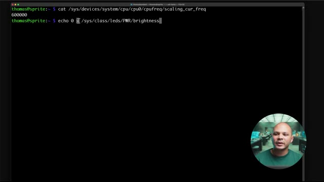
*📸 00:11:21 — Terminal Linux affichant une commande pour modifier la luminosité d'une LED système via sysfs.*

---

### ⏱️ `[00:11:37 - 00:11:58]` | Segment #34

**🔊 Audio (Transcription Intégrale Mot pour Mot en Français) :**
> Et donc là, si j'écho 0 dedans, ça va l'éteindre, mettre sa luminosité au minimum. Évidemment, il faut être sudo pour pouvoir le faire. Donc, si je fais sudo !, ça c'est une commande qui permet de refaire la même commande que je viens de faire juste avant, mais avec sudo en plus. Mais pour le coup, ça ne marche quand même pas, parce que ça va faire sudo juste pour la partie écho. Donc ça va écho en tant que root, mais ensuite l'écriture se fait en tant que l'utilisateur normal.

**👁️ Analyse Visuelle d'Écran (gemini-3.5-flash-lite) :**
**Interface & Outils** : Terminal Bash sous Linux

**Contenu textuel & Code** : Commande `echo 0 > /sys/class/leds/PWR/brightness` retournant l'erreur `-bash: /sys/class/leds/PWR/brightness: Permission denied`.

**Action / Démonstration** : Tentative d'écriture directe dans un fichier du noyau sysfs sans privilèges administrateur (root), entraînant un échec de type "Permission denied".

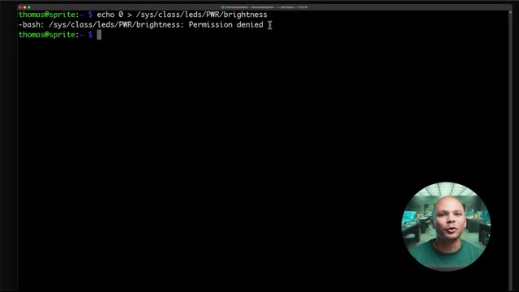
*📸 00:11:42 — Terminal Linux affichant une erreur de permission refusée lors de la tentative de modification de la luminosité d'une LED système.*

---

### ⏱️ `[00:11:59 - 00:12:22]` | Segment #35

**🔊 Audio (Transcription Intégrale Mot pour Mot en Français) :**
> Donc en fait, il faut vraiment que je fasse sudo sous, donc sous pour switch user, passer à l'utilisateur root. Et là, je peux vraiment écho 0 dans ma LED et ma LED c'est 1. A l'inverse, si je veux rallumer ma LED, je fais écho 1, j'écris dans ce même fichier et ça va me rallumer ma LED à pleine patate. Ensuite, si je vais dans slash boot, c'est comme son nom l'indique, le répertoire qui garde tout ce qu'on a besoin pour pouvoir booter.

**👁️ Analyse Visuelle d'Écran (gemini-3.5-flash-lite) :**
**Interface & Outils** : Présentation ou face-caméra sans interface informatique partagée.

**Contenu textuel & Code** : Explications orales des concepts, architectures et retours d'expérience.

**Action / Démonstration** : Démonstration pédagogique et mise en perspective technique.

---

### ⏱️ `[00:12:22 - 00:12:42]` | Segment #36

**🔊 Audio (Transcription Intégrale Mot pour Mot en Français) :**
> et donc on a besoin de deux choses pour pouvoir booter. Un kernel, ça c'est le noyeu de notre système d'exploitation et un bootloader. Ça c'est ce qui va permettre depuis notre BIOS de pouvoir charger notre kernel qui va pouvoir lui charger tous les programmes de notre OS. Donc ce qu'on voit ici là, VM-6.80111 générique, ça c'est une version du kernel. Ensuite on a un autre ici, 0.83, c'est une autre version du kernel.

**👁️ Analyse Visuelle d'Écran (gemini-3.5-flash-lite) :**
**Interface & Outils** : Terminal Linux interactif.

**Contenu textuel & Code** : Commandes 'ls' et 'cd /boot' affichant les images du noyau Linux (vmlinuz-6.8.0-71-generic, vmlinuz-6.8.0-83-generic), les fichiers System.map, config et initrd.img.

**Action / Démonstration** : Explication de la structure de démarrage d'un système Linux et visualisation des fichiers du noyau dans le répertoire /boot.

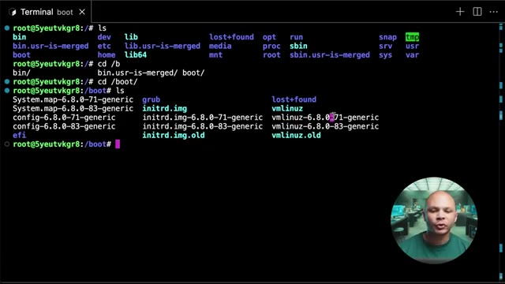
*📸 00:12:37 — Terminal Linux affichant le contenu du répertoire /boot avec les versions du noyau vmlinuz (6.8.0-71 et 6.8.0-83), les fichiers initrd et la configuration GRUB.*

---

### ⏱️ `[00:12:42 - 00:13:00]` | Segment #37

**🔊 Audio (Transcription Intégrale Mot pour Mot en Français) :**
> Je pourrais configurer ma machine pour qu'elle boot sur l'une ou l'autre version. Et en général on peut garder plusieurs versions au cas où quand on fait une mise à jour, s'il y a un problème, sa nouvelle version elle ne marche pas avec ma machine ou quelque chose comme ça, et bien je peux facilement revenir à mon ancienne version. Pareil ici avec Initerdé qui va être mon bootloader. Le bootloader c'est ce qui va être démarré à partir de mon bio 1001er. Pourquoi est-ce qu'on ne démarre pas directement mon kernel ?

**👁️ Analyse Visuelle d'Écran (gemini-3.5-flash-lite) :**
**Interface & Outils** : Terminal Linux (bash / shell root)

**Contenu textuel & Code** : Commandes 'ls', 'cd /boot', listage des fichiers du noyau Linux (vmlinuz-6.8.0-71-generic, vmlinuz-6.8.0-83-generic, initrd.img, initrd.img.old)

**Action / Démonstration** : Exploration du répertoire /boot pour montrer la présence de plusieurs versions de noyaux Linux installées simultanément sur le système afin de permettre un retour en arrière (fallback) en cas de problème de mise à jour.

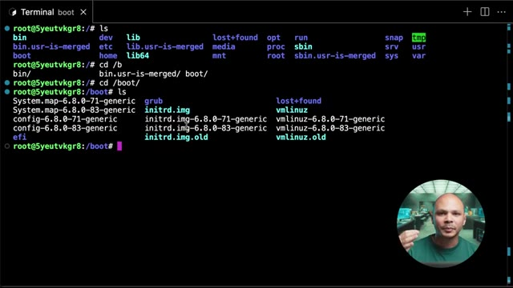
*📸 00:12:56 — Terminal Linux affichant le contenu du dossier /boot avec les versions multiples du noyau (6.8.0-71 et 6.8.0-83), les fichiers initrd et vmlinuz correspondants.*

---

### ⏱️ `[00:13:00 - 00:13:34]` | Segment #38

**🔊 Audio (Transcription Intégrale Mot pour Mot en Français) :**
> Parce qu'il y a pas mal de drivers, des choses comme ça, qui pourraient être utiles pour pouvoir démarrer. Si par exemple mon disque dur est un peu spécial, il y a besoin d'un driver un peu spécial, le driver pour pouvoir interagir, parler avec ce disque, il va être dans le bootloader. Pareil si par exemple je boot sur le réseau, il me faut un driver pour que ma carte réseau, puis ensuite ma carte réseau il faut qu'elle communique avec le network etc. Autre exemple, même si j'ai un disque simple en SATA qui n'a pas besoin de driver particulier, mais que ma partition est chiffrée ou alors que j'utilise LVM pour pouvoir faire du RAID logiciel, tout ça c'est des choses qui vont être gérées par mon bootloader qui va me permettre de pouvoir accéder à mes disques durs, à mes partitions et ensuite mon kernel va pouvoir booter et il aura

**👁️ Analyse Visuelle d'Écran (gemini-3.5-flash-lite) :**
**Interface & Outils** : Aucune interface ou console affichée.

**Contenu textuel & Code** : Aucun code, commande ou schéma technique.

**Action / Démonstration** : Explication théorique sur l'utilisation des drivers dans le processus de démarrage et le bootloader.

---

### ⏱️ `[00:13:34 - 00:14:06]` | Segment #39

**🔊 Audio (Transcription Intégrale Mot pour Mot en Français) :**
> accès à son réseau, à mes partitions, etc. Et on séparer les deux parce qu'on veut que le kernel il reste modulaire, comme ça le kernel il reste le plus léger possible, il n'a pas un milliard de drivers pour les 1 milliard de cartes réseaux et de disques durs et de façon de chiffrer ces disques différents. Il reste le plus petit possible et dans mon bootloader, c'est là où je vais pouvoir mettre ce que j'ai besoin pour ma machine en particulier. Il ne reste plus que quelques fichiers. Média et MNT, c'est des répertoires qui sont là juste si on a besoin de monter des disques ou des clés USB ou même à l'ancienne des CD-ROM, voire même des disquettes. Tous ces médias externes, par défaut, ils allaient être montés dans ces répertoires-là. Donc,

**👁️ Analyse Visuelle d'Écran (gemini-3.5-flash-lite) :**
**Interface & Outils** : AUCUNE

**Contenu textuel & Code** : AUCUNE

**Action / Démonstration** : Explication théorique sur la modularité du noyau Linux et la gestion des pilotes.

---

### ⏱️ `[00:14:06 - 00:14:42]` | Segment #40

**🔊 Audio (Transcription Intégrale Mot pour Mot en Français) :**
> c'est en allant dans slash média que je pouvais accéder à mon CD-ROM ou à ma clé USB. C'est un petit peu moins utilisé maintenant. Pareil pour MNT, si je mange par exemple un disque dur externe, des choses comme ça, souvent par défaut, il va aller se monter dans « slash mnt », même si au final, je pourrais les monter là où je veux, souvent par défaut, c'est là où ils atterrissent. Et donc, si je fais « slash mnt » et « slash media », évidemment, il n'y a rien dedans parce que j'ai rien de spécial de monter ici. Un plus intéressant, si je vais dans « slash var », « var » pour « variables », eh bien, on a pas mal de choses ici. En fait, dans « variables », c'est tout ce qui va être variable, tout ce qui va changer. Donc par exemple, si on installait un serveur web, www, c'est là où on va retrouver par défaut les fichiers de mon site web. Donc, c'est des fichiers

**👁️ Analyse Visuelle d'Écran (gemini-3.5-flash-lite) :**
**Interface & Outils** : Terminal de commande Linux (session shell en tant que root)

**Contenu textuel & Code** : Commande `ls` exécutée à la racine `/` affichant l'arborescence standard d'un système Linux (FHS) : `bin`, `boot`, `dev`, `etc`, `home`, `lib`, `lib64`, `media`, `mnt`, `opt`, `proc`, `root`, `run`, `sbin`, `srv`, `sys`, `tmp`, `usr`, `var`.

**Action / Démonstration** : Présentation théorique et visuelle de la structure des dossiers sous Linux, avec un focus sur les points de montage historiques `/media` (pour les clés USB, CD-ROM) et `/mnt` (pour le montage temporaire de périphériques de stockage comme les disques durs externes).

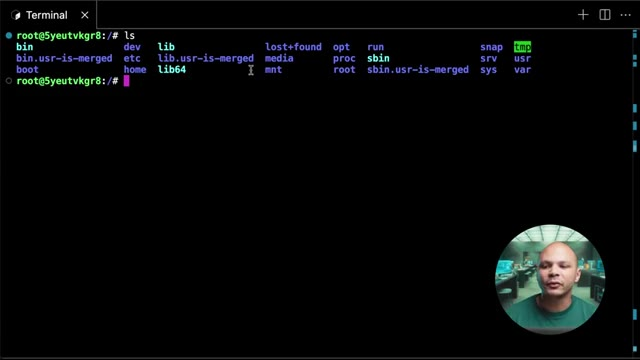
*📸 00:14:15 — Terminal Linux affichant le contenu du répertoire racine (/) après l'exécution d'une commande ls, mettant en évidence les répertoires standards dont media et mnt.*

---

### ⏱️ `[00:14:42 - 00:15:17]` | Segment #41

**🔊 Audio (Transcription Intégrale Mot pour Mot en Français) :**
> de code, ces fichiers-là peuvent changer et donc ils se retrouvent dans slash var. Pareil pour var log. Les logs, c'est ce qu'utilise tout le système et les programmes pour pouvoir écrire qu'est-ce qui se passe. À chaque fois qu'il y a une action qui se passe, on rajoute une ligne de log pour pouvoir savoir ce qui s'est passé. Par exemple, si un utilisateur se connecte en SSH, on va rajouter une ligne de log pour dire « untel s'est connecté à telle heure depuis telle adresse IP », etc. Ou si j'ai un serveur web, à chaque fois que quelqu'un va aller sur mon site, on va rajouter une ligne de log pour dire « telle adresse IP est venue à telle heure à demander telle page et tel résultat est apparu. Donc pareil, c'est quelque chose qui change énormément. Spool, c'est tout ce qui est des files d'attente un petit peu. Donc ça peut être utilisé souvent par exemple si on a un serveur de

**👁️ Analyse Visuelle d'Écran (gemini-3.5-flash-lite) :**
**Interface & Outils** : AUCUNE

**Contenu textuel & Code** : AUCUNE

**Action / Démonstration** : Explication orale de concepts d'administration système concernant le dossier `/var` et les logs sous Linux sans démonstration visuelle directe sur écran.

---

### ⏱️ `[00:15:17 - 00:15:43]` | Segment #42

**🔊 Audio (Transcription Intégrale Mot pour Mot en Français) :**
> mail et bah la liste des mails qui sont en attente pour être envoyés par exemple, ils vont se retrouver là-bas. Aussi si on a un vieux serveur d'impression sur Linux et bah si on a pas mal de documents qui sont en attente d'impression, ils vont se retrouver dans une file d'attente aussi souvent dans VAR, Spool. C'est de moins en moins utilisé. Et aussi si on a lib. On peut se dire mais attends, c'est bizarre déjà t'as des slash lib, ensuite t'as des slash lib64, ensuite t'as des slash usr, slash lib, on a encore un slash lib ici. Et oui, on a encore un shp ici, mais le lib est dans var.

**👁️ Analyse Visuelle d'Écran (gemini-3.5-flash-lite) :**
**Interface & Outils** : Terminal Linux

**Contenu textuel & Code** : Commandes `ls` et `ls spool/` exécutées dans le répertoire `/var`

**Action / Démonstration** : Exploration du dossier `/var` pour montrer l'emplacement des files d'attente (spool, mail) sous Linux.

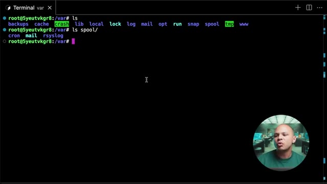
*📸 00:15:30 — Terminal Linux affichant le contenu du dossier /var et /var/spool avec les sous-dossiers cron, mail et rsyslog.*

---

### ⏱️ `[00:15:43 - 00:16:16]` | Segment #43

**🔊 Audio (Transcription Intégrale Mot pour Mot en Français) :**
> Donc ça veut dire que ça va être les fichiers qui vont être utilisés par les librairies et qui sont variables, donc qui vont changer. Si par exemple j'ai Docker d'installer sur la machine, et bien je vais avoir slash var slash lib slash docker. Et donc si je vais dans Docker, et bien je peux voir les informations que mon démon Docker est en train d'utiliser pour faire fonctionner mes conteneurs. Donc si je fais par exemple ici docker ps, ce qui va me lister mes conteneurs, j'ai pas de conteneurs qui tournent actuellement. Si je lance un conteneur, par exemple Docker run pour l'ancien conteneur, D pour qu'il parte en arrière-plan, Busybox parce que c'est une image petite qui sert à faire rien de spécial, et on va lui dire ne fait rien de spécial, dort pendant 1000 secondes.

**👁️ Analyse Visuelle d'Écran (gemini-3.5-flash-lite) :**
**Interface & Outils** : Terminal Linux (bash/sh)

**Contenu textuel & Code** : Commandes `ls`, `cd lib/`, `ls` montrant les répertoires système dont `docker`, `containerd`, `apt`, `systemd`.

**Action / Démonstration** : Exploration de l'arborescence du système de fichiers Linux pour illustrer l'emplacement des données variables des bibliothèques (`/var/lib`), en particulier le répertoire de travail du démon Docker.

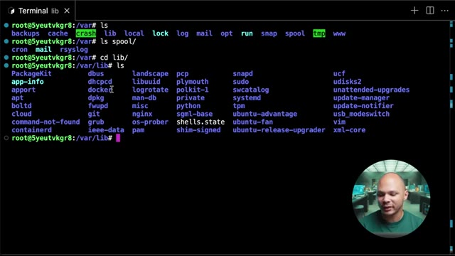
*📸 00:15:51 — Un terminal Linux affichant l'exploration du répertoire /var et de ses sous-dossiers, notamment /var/lib contenant le dossier docker.*

---

### ⏱️ `[00:16:16 - 00:16:49]` | Segment #44

**🔊 Audio (Transcription Intégrale Mot pour Mot en Français) :**
> Ça m'a démarré un conteneur en arrière-plan qui a cet ID là, 04C blablabla. Donc si je fais docker ps, là j'interagis avec mon démon Docker, mon serveur Docker si tu veux sur ma machine pour lui dire donne moi la liste des conteneurs qui tournent actuellement. Et il me dit t'as un conteneur qui s'appelle 04C blablabla qui tourne Busybox etc. Bon très bien, mais mon démon Docker lui-même, et bah il stocke ces informations dans slash var slash lib. Donc si je fais ls ici et que je fais par exemple dans containers et bah je retrouve ici 0 4c blablabla qui est le conteneur qui tourne actuellement. Je vois même un autre conteneur qui en fait si je fais docker ps a qui en fait

**👁️ Analyse Visuelle d'Écran (gemini-3.5-flash-lite) :**
**Interface & Outils** : Présentation ou face-caméra sans interface informatique partagée.

**Contenu textuel & Code** : Explications orales des concepts, architectures et retours d'expérience.

**Action / Démonstration** : Démonstration pédagogique et mise en perspective technique.

---

### ⏱️ `[00:16:49 - 00:17:23]` | Segment #45

**🔊 Audio (Transcription Intégrale Mot pour Mot en Français) :**
> un autre conteneur qui tourne mais qui est exit donc qui est quitté depuis 23 heures. Mais là ici je l'ai vu ici parce que c'est là que mon démon docker, mon serveur docker stocke ces informations. Et je peux même avoir les informations sur le conteneur en lui-même si je fais dans le répertoire et bien là je vois j'ai sa configuration, j'ai son hostname, j'ai le fichier host qui est dans slash etc slash host qui permet d'avoir une résolution en DNS entre mes différents conteneurs, le resolve.conf etc etc. Si j'avais monté des volumes dans mon conteneur et bien j'aurais même accès directement dans mount ici. Donc c'est pas un répertoire dans lequel on va aller fréquemment mais si jamais on a besoin de débugger quelque chose, essayer de comprendre

**👁️ Analyse Visuelle d'Écran (gemini-3.5-flash-lite) :**
**Interface & Outils** : AUCUNE

**Contenu textuel & Code** : AUCUNE

**Action / Démonstration** : Explication orale du fonctionnement interne du démon Docker et du stockage des métadonnées de conteneurs.

---

### ⏱️ `[00:17:23 - 00:17:45]` | Segment #46

**🔊 Audio (Transcription Intégrale Mot pour Mot en Français) :**
> mieux comment fonctionne quelque chose, ça peut être intéressant à aller fouiller dans slash var Ensuite il nous reste slash dev qui est aussi un reporter très intéressant. C'est encore une fois un système de fichiers virtuels donc un faux système de fichiers. Ce n'est pas vraiment des vrais fichiers qui sont sur notre disque dur. Mais ça va nous permettre d'interagir avec des devices, donc des périphériques qui sont connectés à ma machine.

**👁️ Analyse Visuelle d'Écran (gemini-3.5-flash-lite) :**
**Interface & Outils** : Terminal Linux interactif (CLI)

**Contenu textuel & Code** : Commandes 'ls' et 'cd /dev/', affichage des répertoires systèmes racine et des fichiers de périphériques virtuels (tty, null, loop, sda, etc.)

**Action / Démonstration** : Exploration de l'arborescence Linux et présentation du répertoire /dev (système de fichiers virtuel des périphériques).

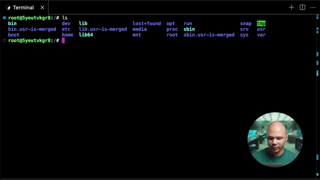
*📸 00:17:29 — Terminal Linux affichant le contenu du répertoire racine '/' avec la commande 'ls'.*

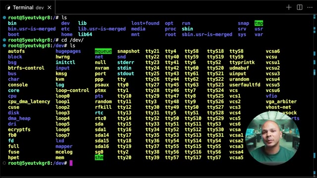
*📸 00:17:34 — Navigation dans le dossier /dev et affichage des fichiers de périphériques virtuels du système Linux avec 'ls'.*

---

### ⏱️ `[00:17:45 - 00:18:09]` | Segment #47

**🔊 Audio (Transcription Intégrale Mot pour Mot en Français) :**
> Donc ça peut être des périphériques physiques comme une carte son, un disque dur. Donc là par exemple quand je vois slash dev slash sda et bah c'est le fichier qui représente mon disque dur. Donc si je veux formater mon disque par exemple je vais utiliser ce chemin là pour pouvoir dire mon programme de formater ce disque là. Et ça peut même être des périphériques virtuelles. Donc c'est-à-dire des choses qui n'existent pas vraiment. Comme par exemple, random ici ou urandom, qui sont des périphériques, mais qui sont en fait une manière de demander au kernel de nous donner des données aléatoires.

**👁️ Analyse Visuelle d'Écran (gemini-3.5-flash-lite) :**
**Interface & Outils** : Présentation ou face-caméra sans interface informatique partagée.

**Contenu textuel & Code** : Explications orales des concepts, architectures et retours d'expérience.

**Action / Démonstration** : Démonstration pédagogique et mise en perspective technique.

---

### ⏱️ `[00:18:09 - 00:18:30]` | Segment #48

**🔊 Audio (Transcription Intégrale Mot pour Mot en Français) :**
> La différence entre les deux, c'est que slash dev slash random, c'est des données qui sont vraiment random, qui sont vraiment aléatoires. C'est souvent utilisé dans la cryptographie par exemple, où on a besoin de pouvoir générer quelque chose à partir d'un élément qui est très très imprévisible. Et donc pour ça, le kernel va utiliser des informations comme par exemple la température de ton disque dur, la vitesse à laquelle ton ventilateur est en train de tourner à ce moment précis, etc.

**👁️ Analyse Visuelle d'Écran (gemini-3.5-flash-lite) :**
**Interface & Outils** : AUCUNE

**Contenu textuel & Code** : AUCUN

**Action / Démonstration** : Explication orale par le présentateur sur le fonctionnement du générateur de nombres aléatoires sous Linux (/dev/random).

---

### ⏱️ `[00:18:30 - 00:18:49]` | Segment #49

**🔊 Audio (Transcription Intégrale Mot pour Mot en Français) :**
> Il va combiner comme ça plein de valeurs un petit peu physiques de la machine pour essayer d'avoir quelque chose de le plus aléatoire possible. Mais ça, ça peut être assez lent, parce que pour pouvoir récupérer assez d'informations assez aléatoires, ça prend du temps. Ça s'appelle l'entropie dans la machine. Quand on n'a plus d'entropie, on ne peut plus générer de nouveaux chiffres aléatoires. Et donc c'est pour ça qu'on a Urandome, qui est en fait un espèce de fake random.

**👁️ Analyse Visuelle d'Écran (gemini-3.5-flash-lite) :**
**Interface & Outils** : Aucun terminal, code ou interface logicielle visible.

**Contenu textuel & Code** : Aucun contenu technique, ligne de commande ou métrique affichée.

**Action / Démonstration** : Explication orale du concept d'entropie dans la machine et de la collecte de valeurs physiques pour la génération de nombres aléatoires.

---

### ⏱️ `[00:18:49 - 00:19:08]` | Segment #50

**🔊 Audio (Transcription Intégrale Mot pour Mot en Français) :**
> On va utiliser plus un algorithme qui va générer un chiffre qui va être aléatoire. On appelle ça pseudo-aléatoire, parce que ça va avoir l'air d'être aléatoire, Mais techniquement, si vraiment on connaît tous les aspects du kernel et l'heure exacte à laquelle on a commencé à générer, etc., on pourrait possiblement deviner les nombres aléatoires qui ont été générés avec uRandom. Mais l'avantage, c'est que ça va beaucoup plus vite.

**👁️ Analyse Visuelle d'Écran (gemini-3.5-flash-lite) :**
**Interface & Outils** : AUCUNE

**Contenu textuel & Code** : AUCUNE

**Action / Démonstration** : Explication orale de concepts théoriques sur le pseudo-aléatoire et le noyau Linux.

---

### ⏱️ `[00:19:09 - 00:19:30]` | Segment #51

**🔊 Audio (Transcription Intégrale Mot pour Mot en Français) :**
> Si par exemple, je fais catrandom et que je vais l'envoyer dans un fichier que je vais mettre dans cet htmp parce que je n'en ai pas besoin pour toujours. Donc si je fais ça, ça va écrire des choses aléatoires dans mon fichier jusqu'à l'infini, jusqu'à du moins qu'il n'y ait plus d'entropie, que mon système soit plus capable de générer de l'aléatoire, du vrai aléatoire. Et donc si je regarde ici dans mon fichier, random1, ça me dit qu'il est binaire.

**👁️ Analyse Visuelle d'Écran (gemini-3.5-flash-lite) :**
**Interface & Outils** : Terminal Linux distant (SSH/shell web) avec incrustation vidéo du présentateur.

**Contenu textuel & Code** : `root@5yeutvkgr8:/dev# cat random > /t`

**Action / Démonstration** : Le présentateur tape une commande pour rediriger le contenu du générateur aléatoire vers un fichier, illustrant l'épuisement de l'entropie système.

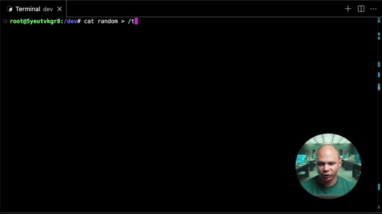
*📸 00:19:14 — Terminal Linux affichant la saisie de la commande de redirection du flux aléatoire.*

---

### ⏱️ `[00:19:31 - 00:20:04]` | Segment #52

**🔊 Audio (Transcription Intégrale Mot pour Mot en Français) :**
> Donc si je l'affiche, ça va afficher n'importe quoi. Je vais prendre le risque de l'afficher et ça m'affiche effectivement n'importe quoi. Donc si je quitte, si maintenant je fais la même chose ici, mais que j'utilise uRandom, et j'appelle ça random2, et bien là ça m'écrit des choses complètement random. Je vais annuler aussi parce que ça va aller à l'infini. et si je fais lsla tmp et ben je vais voir que mon fichier random 2 pour le coup random 1 il a quand même bien rempli donc j'ai laissé tourner random 1 un peu plus longtemps random 2 normalement va pas mal plus vite mais comme je dois avoir pas mal d'entropies disponibles parce que j'ai jamais lancé la commande

**👁️ Analyse Visuelle d'Écran (gemini-3.5-flash-lite) :**
**Interface & Outils** : Terminal Linux (bash/sh)

**Contenu textuel & Code** : cat urandom > /tmp/random2, ls -la /tmp, affichage des tailles des fichiers random1 (~2Go) et random2 (~628Mo)

**Action / Démonstration** : Génération de fichiers de données aléatoires à partir de /dev/urandom et vérification de leur taille avec la commande ls -la.

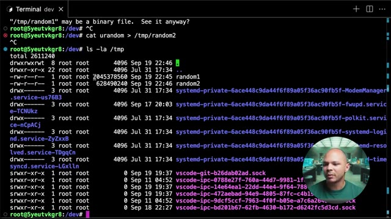
*📸 00:19:56 — Terminal Linux affichant le contenu du dossier /tmp avec les fichiers random1 et random2 de grande taille générés à partir des périphériques aléatoires du noyau.*

---

### ⏱️ `[00:20:04 - 00:20:39]` | Segment #53

**🔊 Audio (Transcription Intégrale Mot pour Mot en Français) :**
> avant et ben ça s'est quand même rempli un peu plus vite que random 2 mais si je le laisse tourner plus longtemps au bout d'un moment j'aurai plus d'entropies sur la machine avec ma machine n'a plus de source externe sur laquelle elle peut se baser pour pouvoir générer des choses qui sont vraiment aléatoires et ben Urandom va commencer à être beaucoup plus rapide. Parfois, c'est une machine qui est très puissante, qui a beaucoup de CPU, beaucoup de corps, très fort, etc. Ça peut être difficile de la stresser au maximum. Et 4 Urandom, ça y va. Donc là, ici, ce qu'on peut faire, c'est qu'on peut afficher le fichier Urandom et on va l'envoyer dans « slash dev slash null », qui est un autre fichier aussi,

**👁️ Analyse Visuelle d'Écran (gemini-3.5-flash-lite) :**
**Interface & Outils** : Terminal Linux interactif (shell root).

**Contenu textuel & Code** : Commande `root@5yeutvkgr8:/dev# cat urandom > /` affichée dans le terminal.

**Action / Démonstration** : Explication et manipulation de la source d'entropie système (/dev/urandom) via le terminal.

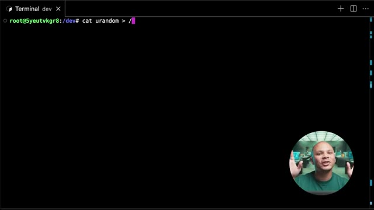
*📸 00:20:30 — Terminal Linux affichant une ligne de commande en cours de saisie manipulant le fichier d'entropie urandom, avec la webcam du présentateur incrustée en bas à droite.*

---

### ⏱️ `[00:20:39 - 00:21:14]` | Segment #54

**🔊 Audio (Transcription Intégrale Mot pour Mot en Français) :**
> qui n'est pas vraiment affiché. En fait, ça va aspirer tout ce qu'on va lui envoyer pour l'envoyer nulle part. Comme ça, ça va me permettre de pouvoir générer des nombres alliatoires le plus rapidement possible sans être limité par la vitesse d'écriture de mon disque dur. Et on va rajouter ici un N dans la fin, ce qui va mettre le processus 4 en arrière-plan. Donc là, c'est à dire que je récupère la main sur ma machine, mais c'est quand même en train de tabasser. Et donc, si je regarde mon utilisation de disque ici, je peux utiliser PS ou TOP pour voir l'utilisation de mon CPU, mais BITOP c'est un peu plus stylé. On voit ici que mon CPU est à 50-55% en utilisation parce que, en fait, j'ai mon C1 ici qui est à 7% et j'ai mon C2, mon deuxième core qui est lui à 100%. Donc,

**👁️ Analyse Visuelle d'Écran (gemini-3.5-flash-lite) :**
**Interface & Outils** : Terminal Linux, outil de monitoring système 'btop'.

**Contenu textuel & Code** : Commande 'cat urandom > /dev/null &', affichage du PID 2299931, graphiques de charge CPU et tableau des processus.

**Action / Démonstration** : Explication et exécution d'une commande pour générer des flux aléatoires en redirigeant /dev/urandom vers /dev/null en arrière-plan, puis observation de l'impact sur le processeur via btop.

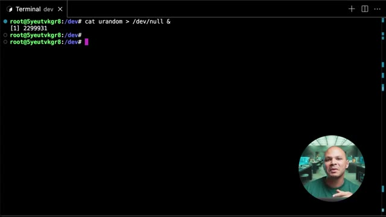
*📸 00:20:56 — Terminal Linux affichant l'exécution de la commande 'cat urandom > /dev/null &' en arrière-plan.*

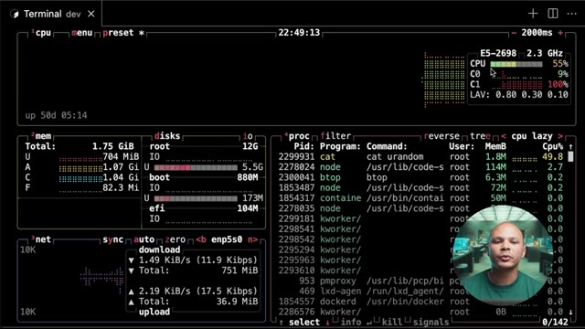
*📸 00:21:05 — Interface de l'outil de monitoring 'btop' affichant l'utilisation CPU, mémoire, disques et la liste des processus en cours.*

---

### ⏱️ `[00:21:14 - 00:21:34]` | Segment #55

**🔊 Audio (Transcription Intégrale Mot pour Mot en Français) :**
> Donc en fait, contrairement à ce que j'ai dit juste avant, ça va permettre de tabasser un des corps de notre machine, mais je pourrais en lancer autant que je veux si je veux tabasser 32 corps. Je le lance 32 fois et je vais avoir 100% d'utilisation. Si je veux l'arrêter, il y a deux manières. Soit je fais PS, AUX et que je filtre pour pouvoir récupérer juste les programmes qui s'appellent 4. Je peux ensuite kill le programme 2299931.

**👁️ Analyse Visuelle d'Écran (gemini-3.5-flash-lite) :**
**Interface & Outils** : Terminal Linux interactif (shell bash).

**Contenu textuel & Code** : Commandes exécutées : `cat urandom > /dev/null &` (avec PID 2299931), affichage de l'autocomplétion pour les commandes commençant par `bt`, et lancement de `btop`.

**Action / Démonstration** : Démonstration du lancement d'une tâche de charge CPU en arrière-plan pour saturer un cœur, suivie de la préparation du lancement de l'outil de surveillance `btop`.

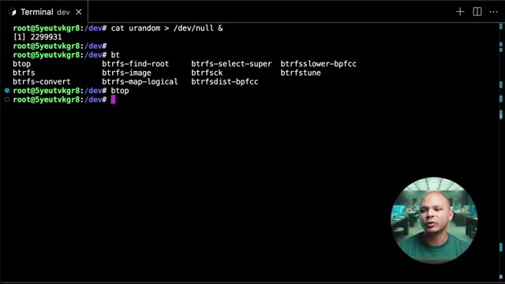
*📸 00:21:24 — Terminal Linux affichant l'exécution en arrière-plan d'une commande de stress CPU et la saisie de l'outil de monitoring btop.*

---

### ⏱️ `[00:21:34 - 00:21:55]` | Segment #56

**🔊 Audio (Transcription Intégrale Mot pour Mot en Français) :**
> Ou autre chose que je peux faire aussi, c'est utiliser la commande FG, qui va me permettre de remettre en premier plan la commande que j'ai mise en arrière-plan plus tôt. Et à partir d'ici, je peux faire CTRL-C. ça va plus simple, pas besoin de faire une commande bizarre avant. Au passage, la machine que je suis en train d'utiliser en ce moment dans mon navigateur, c'est une machine virtuelle qui est hébergée dans ma plateforme ici, que j'utilise et que je fournis à mes étudiants pour mes petites formations sur le DevOps.

**👁️ Analyse Visuelle d'Écran (gemini-3.5-flash-lite) :**
**Interface & Outils** : Interface web personnalisée (dashboard cocadmin.xyz)

**Contenu textuel & Code** : Tableau répertoriant 5 serveurs (ex: r39dwxbx6y "Semaine 0 - exo Nginx", IP 10.141.17.247, 1Go RAM, 1 vCPU, 60 jours, démarrée) avec boutons "Accéder" et "Supprimer", ainsi qu'un menu déroulant et un bouton "Créer Serveur".

**Action / Démonstration** : Présentation ou consultation du tableau de bord de gestion des serveurs de la plateforme pédagogique.

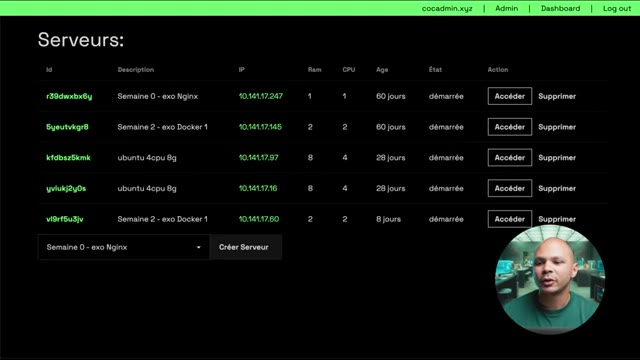
*📸 00:21:49 — Tableau de bord d'administration listant des serveurs virtuels avec leurs caractéristiques (ID, description, IP, RAM, CPU, âge, état, actions) et une vue miniature du présentateur en bas à droite.*

---

### ⏱️ `[00:21:55 - 00:22:15]` | Segment #57

**🔊 Audio (Transcription Intégrale Mot pour Mot en Français) :**
> Donc ça sera beaucoup plus facile de pratiquer sans avoir à trouver une machine sur le cloud. Est-ce que je vais payer ? Est-ce que j'ai assez de RAM sans machine ? Et donc, si par exemple, tu es freelance et que tu veux ajouter la corde DevOps à ton art pour pouvoir avoir plus de missions ou pour avoir un meilleur TGM, quelques fois par an, je fais une formation de six semaines en petits groupes pour pouvoir apprendre les 6 aspects les plus importants du DevOps. Donc si c'est quelque chose qui t'intéresse, je te mets le lien en description.

**👁️ Analyse Visuelle d'Écran (gemini-3.5-flash-lite) :**
**Interface & Outils** : Présentation (slides), IDE ou éditeur de texte, et écran d'ordinateur portable.

**Contenu textuel & Code** : Texte de présentation : « Philosophie DevOps », « Pourquoi on apprend ça ? », « Quel est le problème que règle le DevOps ? ».

**Action / Démonstration** : Explication de la philosophie DevOps et des problématiques abordées.

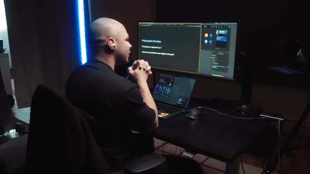
*📸 00:22:10 — Vue de profil du poste de travail avec affichage d'une présentation sur la « Philosophie DevOps » (Pourquoi on apprend ça ? Quel est le problème que règle le DevOps ?).*

---

