# 🎬 La réponse à la question la plus posée en entretien

> **Chaîne** : [cocadmin](https://www.youtube.com/@cocadmin)  
> **Lien YouTube** : [https://www.youtube.com/watch?v=lL3ElCmq6jc](https://www.youtube.com/watch?v=lL3ElCmq6jc)  
> **Date de publication** : 20251021  
> **Durée** : 00:28:18  
> **Identifiant vidéo** : `lL3ElCmq6jc`  
> **Transcription & Analyse** : `whisper-v3-large-turbo+gemini-3.5-flash-lite`  

---

## 📌 Synthèse Exécutive & Outils

### 💡 Résumé

La question classique d'entretien « Que se passe-t-il lorsque l'on tape une URL dans un navigateur ? » constitue un cas d'école fondamental pour tout ingénieur DevOps, SRE ou administrateur système. Elle permet d'évaluer la compréhension globale des couches logicielles et réseau, depuis l'initialisation de la requête utilisateur jusqu'à l'affichage de la page web. Ce parcours met en lumière la complexité inhérente à l'architecture d'Internet et la nécessité de maîtriser chaque composant traversé pour garantir performance, sécurité et haute disponibilité.

La résolution de cette interrogation implique une traversée séquentielle et méthodique des différentes couches du modèle OSI. Le processus commence par la résolution DNS (Domain Name System), un mécanisme récursif et hiérarchique optimisé par de multiples niveaux de mise en cache (navigateur, système d'exploitation, routeur local, fournisseur d'accès). Viennent ensuite la sécurisation du transport avec la vérification HSTS, l'établissement d'une connexion fiable via le protocole TCP (via le *handshake* SYN/SYN-ACK/ACK), et enfin le chiffrement des données applicatives par le protocole TLS (Transport Layer Security) dans ses versions modernes comme TLS 1.3.

Pour un ingénieur Systèmes ou un Développeur, la maîtrise de ce chemin critique a un impact opérationnel direct. Elle permet de diagnostiquer rapidement des pannes complexes (erreurs de résolution DNS, expirations de TTL, échecs de négociation TLS, ou latences TCP), d'optimiser les performances web en configurant correctement les caches et les en-têtes de sécurité, et d'assurer une transition fluide vers des architectures modernes et sécurisées par défaut.

---

### 🛠️ Outils, Modèles & Logiciels Présentés

*   **Navigateur Web (Firefox, Google Chrome)** : Point d'entrée utilisateur gérant l'interprétation des interfaces, l'initiation des requêtes, la gestion des caches locaux et l'application des politiques de sécurité (HSTS).
*   **DNS (Domain Name System)** : Système de nommage hiérarchique et distribué permettant de traduire des noms de domaine textuels en adresses IP exploitables par les machines.
*   **Box Internet / Routeur Local** : Équipement réseau du domicile servant de première passerelle de routage et de cache DNS intermédiaire.
*   **FAI (Fournisseur d'Accès à Internet)** : Opérateur réseau dont les serveurs DNS récursifs initient la recherche globale auprès des serveurs de noms racine et de zone (ex: `.com`).
*   **HSTS (HTTP Strict Transport Security) Preload List** : Liste intégrée et codée en dur dans les navigateurs garantissant que certains sites web ne soient contactés qu'en HTTPS pour contrer les attaques de type *Man-in-the-Middle*.
*   **TCP (Transmission Control Protocol)** : Protocole de transport orienté connexion garantissant la livraison fiable, ordonnée et sans perte des paquets de données sur le réseau.
*   **TLS (Transport Layer Security)** : Protocole cryptographique (successeur de SSL) assurant la confidentialité, l'intégrité et l'authentification des échanges de données sur les réseaux non sécurisés.
*   **CDN (Content Delivery Network) (ex: Cloudflare)** : Réseau de diffusion de contenu distribué géographiquement optimisant la mise à disposition des ressources web et l'écoulement massif du trafic.

---

### 🔑 Points Clés & Enseignements Stratégiques

*   **Hiérarchie de mise en cache DNS** : Le système vérifie séquentiellement le cache du navigateur, du système d'exploitation (machine hôte), de la box internet et enfin du FAI avant d'interroger Internet, réduisant ainsi drastiquement la latence.
*   **Gestion du TTL (Time to Live)** : La durée de vie des enregistrements DNS dictée par le TTL explique pourquoi une modification d'adresse IP ne se propage pas instantanément à l'échelle mondiale, les caches intermédiaires devant expirer.
*   **Résolution DNS récursive** : En cas de cache vide, le processus progresse méthodiquement du résolveur local vers les serveurs racine, puis vers les serveurs de tôle de premier niveau (ex: `.com`), et enfin vers le serveur autoritatif du domaine.
*   **Sécurisation par HSTS** : Le mécanisme HSTS (via en-tête HTTP ou liste préchargée) force l'utilisation exclusive du HTTPS pour éliminer le risque d'interception de requêtes initiales en clair (HTTP).
*   **Fiabilité du protocole TCP** : TCP assure l'intégrité des flux de données en réordonnant les paquets arrivés dans le désordre et en gérant le renvoi automatique des segments perdus sur le réseau.
*   **Le *Handshake* TCP en trois étapes** : L'établissement de la connexion TCP repose sur l'échange de paquets synchronisés (`SYN`, `SYN-ACK`, `ACK`), permettant aux deux parties de se mettre d'accord sur les numéros de séquence et d'ouvrir le canal de communication.
*   **Chiffrement avec TLS** : Indispensable pour la confidentialité, TLS chiffre l'ensemble des données applicatives échangées pour empêcher l'espionnage (mots de passe, numéros de cartes bancaires) sur des réseaux publics ou non fiables.
*   **Abus de langage historique (SSL vs TLS)** : Bien que le protocole standardisé et sécurisé actuel soit le TLS (avec TLS 1.3 comme standard dominant à plus de 70 %), le terme historique « SSL » reste couramment employé par abus de langage dans l'industrie.
*   **Négociation TLS (TLS *Handshake*)** : Les messages initiaux (`Client Hello` et `Server Hello`) permettent au client et au serveur de négocier la version du protocole, les algorithmes de chiffrement et d'établir les clés de session sécurisées.
*   **Piège critique en production (Propagation DNS)** : Ne jamais sous-estimer le délai de propagation lors d'une migration d'infrastructure ou d'un changement d'enregistrement DNS critique en raison de la persistance des caches chez les FAI tiers.
*   **Bonne pratique de conception web** : Configurer systématiquement l'ensemble de ses serveurs web pour rediriger tout trafic HTTP entrant vers du HTTPS et implémenter l'en-tête `Strict-Transport-Security`.
*   **Visibilité DevOps globale** : Maîtriser ce parcours complet permet à un ingénieur d'isoler rapidement un incident de production, qu'il provienne d'une mauvaise configuration DNS, d'un certificat TLS expiré, ou d'une saturation de la couche de transport TCP.

---

## ⏱️ Chronologie & Transcription Complète Audio & Visuelle (Mot pour Mot)

### ⏱️ `[00:00:00 - 00:00:33]` | Segment #01

**🔊 Audio (Transcription Intégrale Mot pour Mot en Français) :**
> Une des questions classiques qu'on peut avoir en entretien, c'est comment marche Internet ? Qu'est-ce qui se passe quand on a un navigateur et qu'on veut aller sur Internet ? Ce qui est cool avec cette question, c'est qu'on peut aller aussi profondément que ce qu'on veut dans toutes les couches du logiciel. Je vais essayer de faire la réponse la plus complète possible, comme ça tu pourras impressionner en entretien. Donc à partir du tout départ, on a notre utilisateur, il veut aller sur Internet avec son navigateur par exemple Firefox ou Google Chrome. Qu'est-ce qui se passe à partir du moment où j'appuie sur Entrée ? Première chose, imaginons qu'on veut aller sur le site cocanling.com, il y a mon navigateur, il faut qu'il sache sur quel serveur aller se connecter pour aller

**👁️ Analyse Visuelle d'Écran (gemini-3.5-flash-lite) :**
**Interface & Outils** : Aucun outil, terminal ou console n'est affiché à l'écran

**Contenu textuel & Code** : Aucun contenu technique, code ou architecture n'est visible

**Action / Démonstration** : Présentation orale et introduction du sujet sur le fonctionnement d'Internet

---

### ⏱️ `[00:00:33 - 00:01:06]` | Segment #02

**🔊 Audio (Transcription Intégrale Mot pour Mot en Français) :**
> récupérer la page cocanling.com. Et donc pour ça, il a besoin de son adresse IP. Et pour savoir cette adresse IP, il faut demander à notre TNS. Ça, c'est la réponse à mon global, mais c'est un petit peu plus profond que ça. Parce que ce qu'il va faire en premier notre navigateur, c'est qu'il va aller chercher dans son cache parce qu'il a peut-être déjà été sur ce site-là et donc peut-être qu'il n'a pas besoin d'aller sur le réseau, demander à on ne sait pas trop qui pour récupérer l'adresse, et peut-être qu'il a déjà son cache. Maintenant, il y a un deuxième layer de cache, c'est que peut-être que le host, notre machine, mon laptop, mon MacBook sur lequel je suis en train d'aller, peut-être qu'il y a une autre application qui a essayé d'aller sur tokenim.com et donc mon

**👁️ Analyse Visuelle d'Écran (gemini-3.5-flash-lite) :**
**Interface & Outils** : Schéma explicatif dessiné (style tableau blanc) illustrant les étapes de résolution DNS.

**Contenu textuel & Code** : Représentation schématique d'un utilisateur consultant le cache du navigateur, le fichier Host et les serveurs DNS pour résoudre le domaine cocadmin.com.

**Action / Démonstration** : Explication de l'ordre de priorité des recherches DNS (cache, fichier hosts, puis serveur DNS).

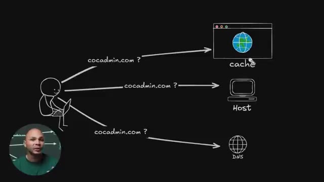
*📸 00:00:49 — Schéma explicatif montrant le processus de résolution DNS avec un utilisateur cherchant à joindre cocadmin.com via le cache, le fichier hosts et un serveur DNS.*

---

### ⏱️ `[00:01:06 - 00:01:29]` | Segment #03

**🔊 Audio (Transcription Intégrale Mot pour Mot en Français) :**
> système d'exploitation va garder les requêtes DNS en cache pour pouvoir accélérer et aller plus vite sur Internet. Ensuite il y a un troisième endroit où ça pourrait être en cache, c'est au moment où je vais demander à mon serveur DNS, donc ça va être par exemple ma box chez moi, ma box Internet. Ma box par défaut elle va aller faire une requête DNS à mon fournisseur d'accès Internet et le DNS de mon fournisseur d'accès à Internet, lui aussi, il va garder en cache toutes les requêtes qu'il va recevoir pendant un certain temps.

**👁️ Analyse Visuelle d'Écran (gemini-3.5-flash-lite) :**
**Interface & Outils** : Schéma visuel animé / illustration pédagogique sur fond noir.

**Contenu textuel & Code** : Représentation schématique d'un utilisateur effectuant une requête DNS 'cocadmin.com ?' vers trois entités distinctes : cache, Host, et DNS.

**Action / Démonstration** : Explication pédagogique des différents niveaux de mise en cache des requêtes DNS (navigateur, OS, serveur DNS/box).

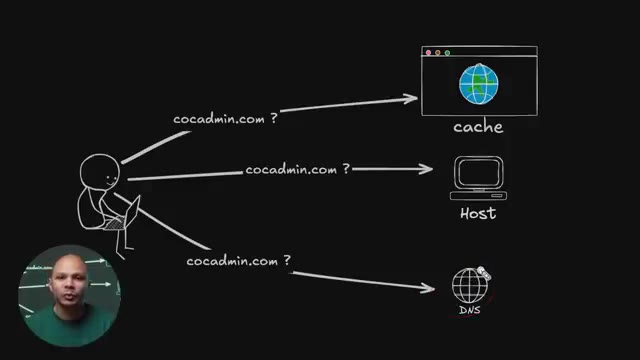
*📸 00:01:18 — Schéma explicatif illustrant les différents niveaux de cache DNS (navigateur/cache, système d'exploitation/Host, et serveur DNS/box) lors d'une requête pour cocadmin.com.*

---

### ⏱️ `[00:01:29 - 00:01:53]` | Segment #04

**🔊 Audio (Transcription Intégrale Mot pour Mot en Français) :**
> Ce qui fait que si quelqu'un d'autre que moi a déjà été sur covenmim.com il n'y a pas très longtemps, le DNS va pouvoir répondre à l'adresse IP beaucoup plus rapidement que d'aller le rechercher sur Internet. C'est pour ça souvent que quand on deal avec le DNS, on dit souvent qu'il faut attendre 24 heures, etc. Ce n'est pas vraiment qu'il faut attendre 24 heures, c'est qu'en fait, il y a tellement d'endroits où les résolutions DNS sont gardées en cache quelque part, chez toi, dans ton navigateur, dans ton ordi, dans ta box, dans ton FAI, etc.

**👁️ Analyse Visuelle d'Écran (gemini-3.5-flash-lite) :**
**Interface & Outils** : Schéma explicatif animé / illustration graphique sur fond noir avec vignette incrustée du présentateur.

**Contenu textuel & Code** : Schéma montrant un client effectuant une requête pour "cocadmin.com ?" vers trois destinations : "cache", "Host" et "DNS".

**Action / Démonstration** : Explication du fonctionnement du cache DNS et de la résolution de noms de domaine pour optimiser les temps de réponse.

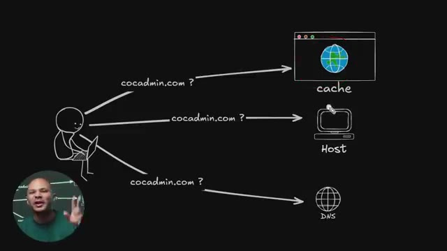
*📸 00:01:41 — Schéma explicatif sur fond noir illustrant les requêtes DNS d'un utilisateur vers le cache, un hôte et les serveurs DNS.*

---

### ⏱️ `[00:01:53 - 00:02:11]` | Segment #05

**🔊 Audio (Transcription Intégrale Mot pour Mot en Français) :**
> Du coup, si tu fais un changement de DNS, ça peut prendre du temps avant que tous les caches de tous ces endroits-là expirent et que ton utilisateur puisse enfin avoir la nouvelle réponse de ton serveur DNS. Et normalement, en théorie, c'est pas forcément toujours respecté à la lettre, mais la durée que ça va rester en cache s'appelle le TTL pour Time to Live.

**👁️ Analyse Visuelle d'Écran (gemini-3.5-flash-lite) :**
**Interface & Outils** : Aucune interface technique ou console active, uniquement un fond graphique illustratif.

**Contenu textuel & Code** : Schéma abstrait illustrant des requêtes DNS (cocadmin.com) vers différents composants (cache, host).

**Action / Démonstration** : Explication théorique par le créateur sur la propagation des changements DNS et la notion de cache et de TTL.

---

### ⏱️ `[00:02:11 - 00:02:30]` | Segment #06

**🔊 Audio (Transcription Intégrale Mot pour Mot en Français) :**
> Maintenant, si nulle part, la résolution DNS pour cocaidmin.com, elle existe dans le cache nulle part, comment est-ce qu'on fait pour vraiment avoir la première fois la réponse ? Donc mon utilisateur ici, ou du moins son navigateur, ta box, elle va aller faire une requête TNS à ton FAI par défaut. Tu peux le changer si tu veux, mais par défaut, c'est ton fonctionnal d'accès à Internet. Et donc ton FAI ici, lui, il n'en sait rien.

**👁️ Analyse Visuelle d'Écran (gemini-3.5-flash-lite) :**
**Interface & Outils** : Schéma/diagramme réseau animé sur tableau virtuel.

**Contenu textuel & Code** : Représentation graphique d'un client, de requêtes DNS successives et d'une adresse IP de retour (12.34.56.7).

**Action / Démonstration** : Explication de la transmission d'une requête DNS initiale depuis le poste utilisateur vers les serveurs DNS de résolution.

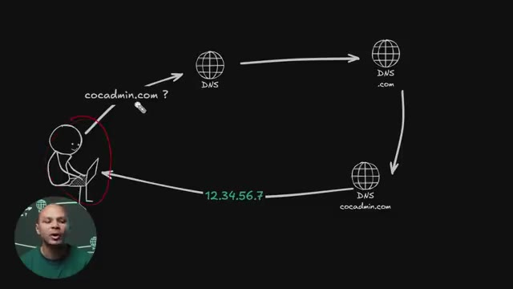
*📸 00:02:21 — Schéma explicatif animé d'une résolution DNS montrant un utilisateur envoyant une requête pour cocaadmin.com vers un serveur DNS, avec retour d'adresse IP.*

---

### ⏱️ `[00:02:30 - 00:02:54]` | Segment #07

**🔊 Audio (Transcription Intégrale Mot pour Mot en Français) :**
> Il ne sait pas c'est quoi Coca-Num.com. C'est pas lui qui gère ce serveur. Donc ce qu'il va faire, c'est dire, ok, je ne sais pas qui gère Coca-Num.com, par contre, je sais qui gère .com. Parce qu'il y a un serveur, ou du moins il y a une liste de serveurs qui est connue à l'avance, qui gère tous les domaines .com. De la même manière, il y a une liste de serveurs qui gère les .fr, il y en a qui gère les .or, etc. Donc il va aller demander ce serveur-là, il va lui dire, ok, serveur qui gère la zone .com, est-ce que tu peux me dire quelle est l'adresse IP pour cocanmin.com ?

**👁️ Analyse Visuelle d'Écran (gemini-3.5-flash-lite) :**
**Interface & Outils** : Schéma explicatif animé sur fond noir.

**Contenu textuel & Code** : Représentation graphique de la résolution DNS : client, requêtes vers les serveurs DNS TLD (.com) et autoritaire (cocadmin.com), retour de l'adresse IP (12.34.56.7).

**Action / Démonstration** : Explication de la chaîne de résolution DNS et de la recherche du serveur gérant l'extension .com lorsqu'on ne connaît pas le serveur du domaine spécifique.

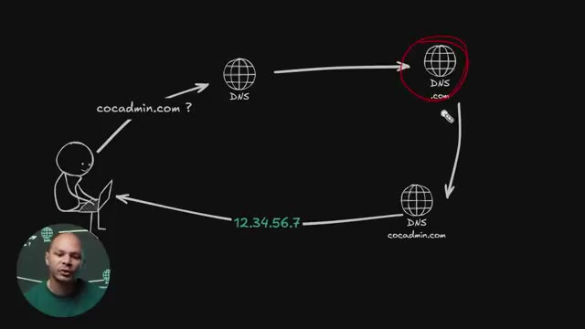
*📸 00:02:48 — Schéma animé illustrant le processus de résolution DNS (du client vers le serveur DNS racine/TLD .com puis vers le serveur DNS autoritaire cocadmin.com).*

---

### ⏱️ `[00:02:54 - 00:03:15]` | Segment #08

**🔊 Audio (Transcription Intégrale Mot pour Mot en Français) :**
> Le serveur DNS.com lui, il dit, bah je sais pas, c'est pas moi qui gère cocanmin.com, moi je gère juste les domaines .com. Par contre, ce que je sais, je sais qui gère la zone cocanmin.com. Et donc mon serveur DNS peut refaire la requête vers le serveur DNS qui gère la zone cocanmin.com. Et là, le serveur qui gère la zone kokamine.com, lui, il sait c'est quoi l'adresse IP de kokamine.com, là j'ai mis 1, 2, 3, 4, 5, 6, 7.

**👁️ Analyse Visuelle d'Écran (gemini-3.5-flash-lite) :**
**Interface & Outils** : Schéma explicatif animé (style dessin sur tableau noir).

**Contenu textuel & Code** : Diagramme représentant le parcours d'une requête DNS : Client -> Serveur DNS récursif -> Serveur DNS .com -> Serveur DNS cocadmin.com -> Retour de l'adresse IP 12.34.56.7 vers le client.

**Action / Démonstration** : Explication pas à pas du mécanisme de résolution de noms de domaine et de la redirection entre les différents serveurs DNS de la hiérarchie.

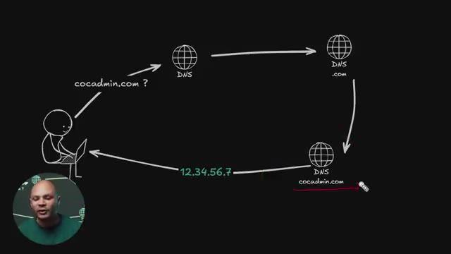
*📸 00:03:10 — Schéma animé en plein écran illustrant le flux complet d'une requête DNS, incluant l'interrogation du serveur racine, du TLD .com, du serveur DNS autoritatif pour cocadmin.com renvoyant l'adresse IP finale (12.34.56.7).*

---

### ⏱️ `[00:03:15 - 00:03:41]` | Segment #09

**🔊 Audio (Transcription Intégrale Mot pour Mot en Français) :**
> Et enfin, on reçoit la réponse. Et ça, cette boucle-là, s'appelle une résolution récursive du DNS parce qu'en fait, on refait la requête une première fois à notre DNS, qui lui il sait pas, ensuite une deuxième fois à DNS de .com, qui lui il sait pas, ensuite une troisième fois au kokamine, qui lui, finalement, il sait. Et si on avait par exemple www.kokamine.com, ça aurait été possible que ce serveur-là ici, il ne sache pas c'est quoi l'adresse IP pour www.kokamine.com et qui renvoie vers un autre serveur DNS qui lui va gérer la zone www.

**👁️ Analyse Visuelle d'Écran (gemini-3.5-flash-lite) :**
**Interface & Outils** : Présentation ou face-caméra sans interface informatique partagée.

**Contenu textuel & Code** : Explications orales des concepts, architectures et retours d'expérience.

**Action / Démonstration** : Démonstration pédagogique et mise en perspective technique.

---

### ⏱️ `[00:03:41 - 00:04:06]` | Segment #10

**🔊 Audio (Transcription Intégrale Mot pour Mot en Français) :**
> Et donc on peut avoir autant de résolutions récursives comme ça jusqu'à arriver à l'adresse IP de la machine exacte qu'on a besoin. Ensuite, on peut maintenant se connecter sur le serveur, vu qu'on a l'adresse IP, pour pouvoir aller récupérer la page qu'on veut. Mais avant, notre navigateur va faire une petite vérification. Il va aller regarder dans une liste qui s'appelle la HSTS Preload List, qui est en fait tout simplement une liste de tous les sites Internet dans lesquels il faut absolument se connecter en HTTPS.

**👁️ Analyse Visuelle d'Écran (gemini-3.5-flash-lite) :**
**Interface & Outils** : Présentation graphique animée illustrant la structure de données et les listes de sécurité du navigateur.

**Contenu textuel & Code** : Mention de la "HSTS preload list" avec des exemples de domaines et du code brut de configuration ou de liste.

**Action / Démonstration** : Explication de la vérification de sécurité effectuée par le navigateur avant la connexion au serveur (HSTS).

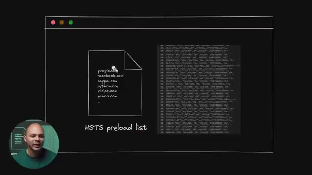
*📸 00:04:00 — Schéma explicatif montrant une liste de préchargement HSTS (HSTS preload list) avec des exemples de noms de domaine (google.com, facebook.com, paypal.com, etc.) et un bloc de code associé.*

---

### ⏱️ `[00:04:06 - 00:04:27]` | Segment #11

**🔊 Audio (Transcription Intégrale Mot pour Mot en Français) :**
> Parce que sans ça, notre navigateur, bon maintenant la plupart des navigateurs vont essayer par défaut de se connecter en HTTPS, mais il n'y a rien qui empêche, imaginons qu'il y a un hacker qui ait intercepté ma connexion, il pourrait potentiellement transformer ma requête et au lieu qu'elle soit en HTTPS, comme mon navigateur a fait la demande, il peut la transformer pour qu'elle soit juste en HTTP et donc recevoir la réponse du serveur en HTTP et donc en HTTP tout est en clair et donc intercepter tout le trafic.

**👁️ Analyse Visuelle d'Écran (gemini-3.5-flash-lite) :**
**Interface & Outils** : Aucun outil, terminal ou console technique n'est affiché.

**Contenu textuel & Code** : Aucun code, commande ou architecture visible.

**Action / Démonstration** : Explication orale du fonctionnement de HTTPS et des risques d'interception par un attaquant (MITM).

---

### ⏱️ `[00:04:28 - 00:04:46]` | Segment #12

**🔊 Audio (Transcription Intégrale Mot pour Mot en Français) :**
> Pendant un moment c'était quand même un gros problème parce que la plupart des sites web marchaient à la fois en HTTP et en HTTPS. Maintenant, c'est plus trop un problème parce que les plupart des sites internet vont refuser de servir du contenu en HTTP. Ils vont rediriger vers du HTTPS automatiquement. En plus de ça, ton navigateur en lui-même, il ne va pas aller sur un site en HTTP. Il va dire que ce n'est pas sécurisé, il y a quelque chose qui ne va pas.

**👁️ Analyse Visuelle d'Écran (gemini-3.5-flash-lite) :**
**Interface & Outils** : Schéma didactique représentant une fenêtre de navigateur, un fichier de configuration et un éditeur de code ou visualiseur JSON.

**Contenu textuel & Code** : Noms de domaines (google.com, facebook.com, paypal.com, python.org, stripe.com, yahoo.com) et mention explicite de la « HSTS preload list ».
[N/A] Explication pédagogique du fonctionnement de la liste de préchargement HSTS intégrée aux navigateurs web pour forcer le HTTPS.

**Action / Démonstration** : Démonstration pédagogique et mise en perspective technique.

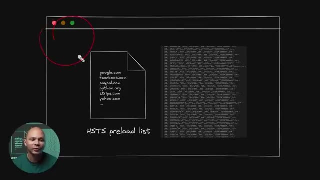
*📸 00:04:42 — Vue graphique illustrant la liste de préchargement HSTS (HSTS preload list) avec des exemples de domaines comme google.com, facebook.com et un fichier JSON ou de configuration listant les règles HTTPS strictes intégrées aux navigateurs.*

---

### ⏱️ `[00:04:46 - 00:05:11]` | Segment #13

**🔊 Audio (Transcription Intégrale Mot pour Mot en Français) :**
> Donc, c'est moins un problème. Mais pour régler ce problème-là à l'époque, il y a une liste qui est hardcoted dans ton navigateur qui dit « Ces sites-là, absolument, absolument, il faut y aller en HTTPS. Jamais de la vie, j'irai en HTTP. » Maintenant, en pratique, même si ton site n'est pas dans cette liste-là, À partir du moment où on va une première fois sur ce site, on peut quand même utiliser le HSTS. C'est un header qu'on va rajouter dans notre réponse de notre site qui va dire la prochaine fois que tu es vers sur mon site, tu vas tout le temps tout le temps y aller en HTTPS.

**👁️ Analyse Visuelle d'Écran (gemini-3.5-flash-lite) :**
**Interface & Outils** : Schéma graphique animé illustrant la liste HSTS Preload (HSTS preload list).

**Contenu textuel & Code** : Représentation d'un fichier avec des noms de domaines (google.com, facebook.com, paypal.com, python.org, stripe.com, yahoo.com) et un bloc de code JSON représentant la base de données HSTS.

**Action / Démonstration** : Explication du mécanisme de préchargement HSTS (HTTP Strict Transport Security preload list) intégré dans les navigateurs web pour forcer l'utilisation du protocole HTTPS sur des sites majeurs.

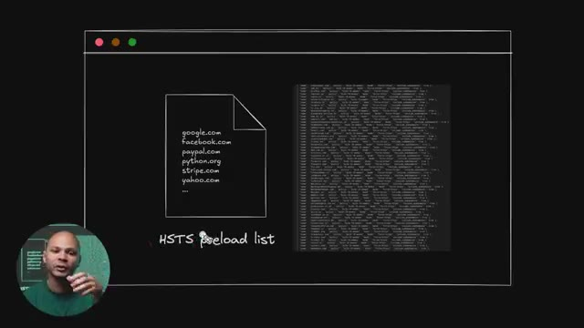
*📸 00:05:05 — Animation schématique illustrant la liste HSTS Preload avec des exemples de domaines et un fichier JSON brut contenant la liste intégrée des sites sécurisés.*

---

### ⏱️ `[00:05:11 - 00:05:30]` | Segment #14

**🔊 Audio (Transcription Intégrale Mot pour Mot en Français) :**
> Et donc même si ce n'est pas dans la liste hard codé, le navigateur va quand même s'assurer que ce soit toujours en HTTPS. Donc maintenant le navigateur, il sait comment se connecter à notre serveur. Il va se connecter dessus avec le protocole TCP. Dans la plupart des cas, on verra plus tard que ce n'est pas tout le temps le cas. Et le protocole TCP, c'est un protocole qui permet d'échanger des données sur le réseau.

**👁️ Analyse Visuelle d'Écran (gemini-3.5-flash-lite) :**
**Interface & Outils** : Schéma didactique animé / illustration visuelle sur fond noir.

**Contenu textuel & Code** : Représentation schématique d'une communication réseau : un client sur ordinateur portable échangeant des messages (« wesh ? », « wesh ! bien ? », « bien ! ») avec un serveur distant, illustrant le principe de la poignée de main TCP (TCP 3-way handshake).

**Action / Démonstration** : Explication schématique et visuelle du fonctionnement de la connexion TCP entre un client (navigateur) et un serveur.

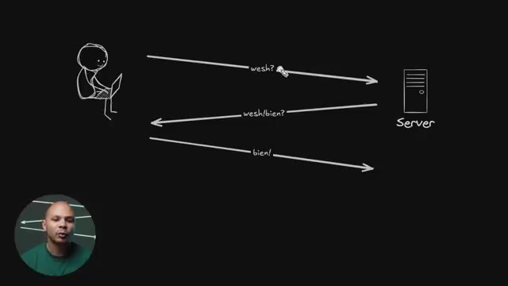
*📸 00:05:20 — Schéma explicatif dessiné à la main illustrant un échange réseau en trois étapes (handshake TCP) entre un client et un serveur.*

---

### ⏱️ `[00:05:30 - 00:05:48]` | Segment #15

**🔊 Audio (Transcription Intégrale Mot pour Mot en Français) :**
> C'est un protocole qui est assez solide, dans le sens où on va vraiment s'assurer que les paquets, ils arrivent bien à destination. S'ils n'arrivent pas bien à destination, on va les renvoyer. Si jamais ils ne sont pas arrivés dans le bon ordre, parce qu'il y a des paquets qui sont partis dans le réseau quelque part, et au final, ils sont arrivés dans le désordre, ça va les remettre dans le bon ordre, etc.

**👁️ Analyse Visuelle d'Écran (gemini-3.5-flash-lite) :**
**Interface & Outils** : Tableau blanc ou numérique d'explication réseau en arrière-plan.

**Contenu textuel & Code** : Schéma simplifié représentant la transmission de paquets entre un client et un serveur.

**Action / Démonstration** : Explication théorique du fonctionnement des protocoles de transport réseau et du cheminement des paquets.

---

### ⏱️ `[00:05:49 - 00:06:08]` | Segment #16

**🔊 Audio (Transcription Intégrale Mot pour Mot en Français) :**
> Donc, c'est un protocole qui est quand même assez solide, mais qui est un petit peu verbeux, on va dire. Et donc on a ici ce qu'on appelle le TCP. T-C-P. Handshake. Handshake. Je l'ai simplifié ici. Notre navigateur ici, il va envoyer un premier paquet au serveur, à l'adresse IP qu'il a récupéré via le DNS.

**👁️ Analyse Visuelle d'Écran (gemini-3.5-flash-lite) :**
**Interface & Outils** : Schéma de type tableau blanc / dessin vectoriel sur fond noir illustrant le réseau.

**Contenu textuel & Code** : Représentation graphique du processus en trois étapes (analogie humoristique : "wesh?", "wesh!/bien?", "bien!") modélisant le SYN, SYN-ACK et ACK.

**Action / Démonstration** : Explication pédagogique du protocole TCP et de son établissement de connexion à travers un diagramme simplifié.

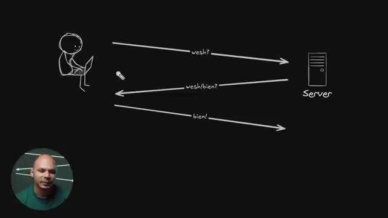
*📸 00:05:54 — Schéma explicatif simplifié du mécanisme de négociation TCP (TCP Handshake) en trois étapes entre un client et un serveur.*

---

### ⏱️ `[00:06:08 - 00:06:41]` | Segment #17

**🔊 Audio (Transcription Intégrale Mot pour Mot en Français) :**
> Il va lui dire wesh, parce qu'il sait pas s'il y a quelqu'un à s'adresse IP. Le serveur, lui, il reçoit ce paquet là, il va dire ok wesh, bien toi. Le navigateur il reçoit ça, il va lui dire ouais bien, tout va bien. Et à partir de ce moment là, on peut dire que le Handshake a été complété, le serrage de main et à partir de ce moment là on peut avoir les données qui circulent librement entre le client et le serveur et donc on va pouvoir récupérer notre poche. En fait ils se disent pas Wesh bien mais c'est assez similaire. Le nom du type de paquet c'est pas Wesh c'est SYN pour synchronisation. Le nom du paquet pour la réponse c'est SYNHACK, hack pour hack knowledge, ça veut

**👁️ Analyse Visuelle d'Écran (gemini-3.5-flash-lite) :**
**Interface & Outils** : Aucun outil technique ou interface logicielle affichée.

**Contenu textuel & Code** : Aucun code, commande ou métrique visible.

**Action / Démonstration** : Explication théorique du mécanisme de négociation (Handshake) TCP entre un client (navigateur) et un serveur.

---

### ⏱️ `[00:06:41 - 00:07:08]` | Segment #18

**🔊 Audio (Transcription Intégrale Mot pour Mot en Français) :**
> dire je reconnais avoir bien reçu ton paquet donc maintenant je veux une réponse pour être sûr et donc le navigateur envoie un hack et à partir de ce moment là le client et le serveur ils sont synchronisés. Synchronisés au niveau TCP, c'est-à-dire que comme on a dit, on veut que les paquets arrivent dans le bonheur, etc. Donc les paquets vont avoir un ID, comme un numéro de série. Donc pour pouvoir savoir quel numéro de série va avoir le paquet que je reçois, il faut pouvoir se synchroniser comme ça. Et une fois qu'on a fait cette synchronisation-là, à partir de ce moment-là, on peut avoir les datas qui partent dans un sens ou dans l'autre.

**👁️ Analyse Visuelle d'Écran (gemini-3.5-flash-lite) :**
**Interface & Outils** : Diagramme d'architecture réseau dessiné à la main.

**Contenu textuel & Code** : Séquence de poignée de main TCP (TCP 3-way handshake) : SYN, SYN/ACK, ACK, suivis des paquets de données (DATA).

**Action / Démonstration** : Explication de la synchronisation TCP et du rôle des paquets ACK pour confirmer la réception et synchroniser le client et le serveur.

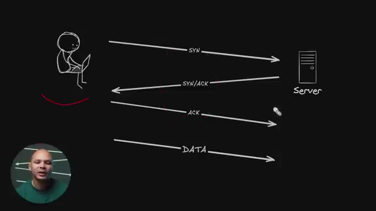
*📸 00:06:48 — Schéma représentant la séquence de connexion TCP entre un client (ordinateur portable) et un serveur, illustrant les étapes SYN, SYN-ACK, ACK et DATA.*

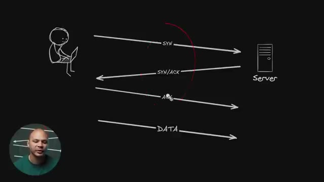
*📸 00:07:01 — Schéma du protocole TCP mettant en surbrillance l'étape ACK lors de l'établissement de la connexion entre le client et le serveur.*

---

### ⏱️ `[00:07:08 - 00:07:37]` | Segment #19

**🔊 Audio (Transcription Intégrale Mot pour Mot en Français) :**
> Donc ça c'est pour la partie TCP. Maintenant pour pouvoir récupérer nos datas, donc à partir d'ici, là on est dans la partie data. Le handshake on l'a fait un petit peu en haut ici. Et là ici on va avoir un nouveau handshake, mais cette fois-ci un niveau plus bas, un petit peu plus applicatif parce que ça va être le HandCheck TLS. TLS pour Transport Layer Security. C'est ce qui va permettre de pouvoir chiffrer notre connexion parce qu'avant ça, si on utilisait juste HTTP directement, on peut le faire, c'est ce qu'on faisait pendant très longtemps. Ça fonctionne, on va pouvoir récupérer notre page web, etc. Mais tout va être en clair.

**👁️ Analyse Visuelle d'Écran (gemini-3.5-flash-lite) :**
**Interface & Outils** : Aucun outil technique, terminal ou interface logicielle n'est affiché.

**Contenu textuel & Code** : Schéma dessiné en arrière-plan représentant des flux de communication réseau avec la mention "ClientHello" et "Server".

**Action / Démonstration** : Explication orale du concept de handshake TLS et de la sécurisation des échanges de données.

---

### ⏱️ `[00:07:37 - 00:08:13]` | Segment #20

**🔊 Audio (Transcription Intégrale Mot pour Mot en Français) :**
> Donc n'importe qui qui va espionner sur le réseau, sur le Wi-Fi ou quelque part, il peut voir tout ce que je fais. Donc si je me log sur un site internet, je peux voir le login, je peux voir le mot de page, je peux voir ton numéro de carte de crédit, je peux voir les messages que tu postes, je peux tout voir. C'est un petit peu chiant. Donc c'est pour ça que ce qu'on fait, c'est qu'avant de faire ça, on chiffre avec TLS. Donc avant on appelait ça SSL et maintenant on appelle ça TLS. Mais comme on a dit SSL pendant assez longtemps, par abus de langage, parfois on continue à dire SSL. Donc si vous entendez quelqu'un dire SSL, en fait le pronom du protocole c'est TLS, mais personne ne va vous reprendre si vous dites SSL au lieu TLS. Donc le protocole TLS, il a lui

**👁️ Analyse Visuelle d'Écran (gemini-3.5-flash-lite) :**
**Interface & Outils** : Schéma explicatif animé/dessiné représentant les flux réseau en clair.

**Contenu textuel & Code** : Diagramme illustrant les requêtes et réponses HTTP en clair sur le réseau (ClientHello, ServerHello, HTTP get ..., <html>...).

**Action / Démonstration** : Explication visuelle du fonctionnement d'une communication réseau non sécurisée (HTTP) et des risques d'interception de données.

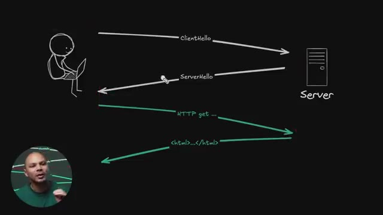
*📸 00:07:55 — Schéma d'architecture réseau illustrant les échanges non chiffrés (ClientHello, ServerHello, HTTP GET, <html>) entre un client et un serveur.*

---

### ⏱️ `[00:08:13 - 00:08:42]` | Segment #21

**🔊 Audio (Transcription Intégrale Mot pour Mot en Français) :**
> aussi un handshake qui permet de sécuriser la connexion, de la chiffrer pour que même si quelqu'un interçoit le trafic, il ne peut pas lire ce qu'il y a dedans. Donc il y a différentes versions de TLS. La version la plus utilisée et la plus récente, c'est TLS 1.3. Et donc le handshake, il ressemble un petit peu à ça. Ici, c'est la version simplifiée. En fait, tu as le client qui va envoyer un client Hello, un paquet client Hello qui va avoir certaines informations dedans. Le serveur, il va retourner une réponse qui s'appelle serveur Hello qui va avoir plusieurs autres informations.

**👁️ Analyse Visuelle d'Écran (gemini-3.5-flash-lite) :**
**Interface & Outils** : Schéma explicatif animé / tableau blanc numérique.

**Contenu textuel & Code** : Éléments graphiques montrant le flux réseau : "ClientHello", "ServerHello", "HTTP get...", et le code source HTML renvoyé.

**Action / Démonstration** : Explication du mécanisme de négociation (handshake) TLS et du chiffrement des échanges entre le client et le serveur.

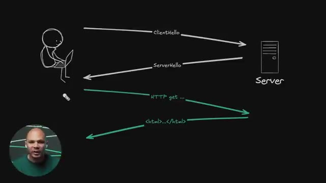
*📸 00:08:20 — Schéma simplifié illustrant le déroulement d'un handshake TLS entre un client et un serveur, suivi des requêtes HTTP chiffrées.*

---

### ⏱️ `[00:08:42 - 00:09:01]` | Segment #22

**🔊 Audio (Transcription Intégrale Mot pour Mot en Français) :**
> et à partir de ce moment-là, on va être chiffré et on va être sécurisé. Donc, dans le fameux client Hello, qu'est-ce qu'il va y avoir ? Il va y avoir la version. Quelle version de TLS on est en train d'utiliser ? Est-ce que c'est 1.2, 1.3 ? Dans les stats que j'ai vus, 70% du trafic maintenant est en TLS 1.3. Donc, c'est quand même la majorité.

**👁️ Analyse Visuelle d'Écran (gemini-3.5-flash-lite) :**
**Interface & Outils** : Tableau blanc / écran de présentation avec schéma d'architecture réseau dessiné.

**Contenu textuel & Code** : Diagramme illustrant le contenu du message Client Hello (version, SNI, chiffrements, clé publique, nonce) et l'échange avec le serveur.

**Action / Démonstration** : Explication théorique de la structure et du contenu du paquet Client Hello lors de l'établissement d'une connexion TLS sécurisée.

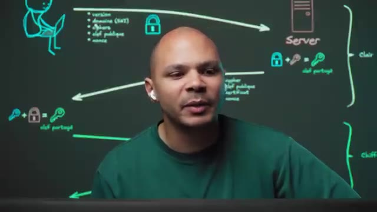
*📸 00:08:56 — Schéma explicatif au tableau montrant le fonctionnement du protocole TLS et la négociation des clés entre un client et un serveur.*

---

### ⏱️ `[00:09:01 - 00:09:30]` | Segment #23

**🔊 Audio (Transcription Intégrale Mot pour Mot en Français) :**
> Donc là, on est sur un site de Cloudflare qui est un CDN qui reçoit beaucoup de trafic. Donc, c'est quand même représentatif de ce qui se passe sur le web. On a 65% de TLS 1.3. et 3% de 1.2, donc 1.3 est la majorité. Et on a 31% de QUIC, on verra c'est quoi QUIC juste après. Et on voit aussi ici que HTTP 1, 9%, HTTP 2, on verra juste après aussi c'est quoi la différence, 59%, donc HTTP 2 est majoritaire, et TLS 1.3 est majoritaire.

**👁️ Analyse Visuelle d'Écran (gemini-3.5-flash-lite) :**
**Interface & Outils** : Interface web Cloudflare Radar (Adoption & Usage - Worldwide).

**Contenu textuel & Code** : Graphiques de répartition : HTTP/1.x (9.4%), HTTP/2 (59.8%), HTTP/3 (30.8%) et TLS 1.2 (3.4%), TLS 1.3 (65.3%), QUIC (31.4%).

**Action / Démonstration** : Analyse des statistiques globales de trafic réseau pour comparer l'utilisation des versions de TLS et des protocoles HTTP.

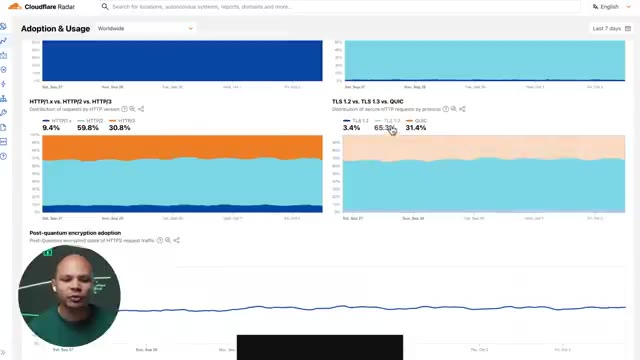
*📸 00:09:08 — Tableau de bord Cloudflare Radar affichant les statistiques mondiales d'adoption et d'usage des protocoles HTTP et des versions TLS.*

---

### ⏱️ `[00:09:30 - 00:09:48]` | Segment #24

**🔊 Audio (Transcription Intégrale Mot pour Mot en Français) :**
> Et ici, 30% de HTTP 3. De ce que j'ai vu aussi, cette répartition, elle change en fonction de là où on voit, parce que si par exemple c'est sur une API, on est beaucoup plus souvent HTTP 1, bizarrement, que si on est sur un site web avec lequel on interagit. Donc en 1.3, on va donner la version de TLS qu'on est en train d'utiliser.

**👁️ Analyse Visuelle d'Écran (gemini-3.5-flash-lite) :**
**Interface & Outils** : Présentation ou face-caméra sans interface informatique partagée.

**Contenu textuel & Code** : Explications orales des concepts, architectures et retours d'expérience.

**Action / Démonstration** : Démonstration pédagogique et mise en perspective technique.

---

### ⏱️ `[00:09:48 - 00:10:09]` | Segment #25

**🔊 Audio (Transcription Intégrale Mot pour Mot en Français) :**
> Potentiellement le domaine du site qu'on veut récupérer. Parce que là, on n'a pas encore fait la requête HTTP. Et on se connecte juste avec une adresse IP 1.2.3.4. Donc en fait, le serveur, quand il reçoit la requête, imaginons que le serveur a plusieurs sites web qu'il est en train d'héberger. Comment il sait que l'utilisateur de base voulait cocanmin.com et pas apple.com ? En imaginant que les deux sites de Apple et de cocanmin sont sur le serveur.

**👁️ Analyse Visuelle d'Écran (gemini-3.5-flash-lite) :**
**Interface & Outils** : Tableau blanc numérique / outil de dessin (Excalidraw ou équivalent)

**Contenu textuel & Code** : Diagramme réseau illustrant le handshake TLS en clair (version, domaine SNI, ciphers, clé publique, nonce) menant au calcul d'une clé partagée, suivi des échanges HTTP chiffrés.

**Action / Démonstration** : Explication du fonctionnement du protocole TLS et du rôle de l'extension SNI (Server Name Indication) pour identifier le site web demandé lors d'une connexion sur un serveur hébergeant plusieurs domaines.

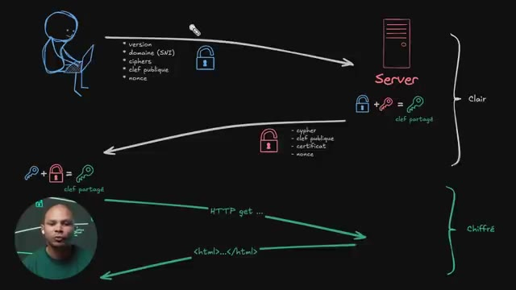
*📸 00:09:54 — Schéma explicatif illustrant le processus d'établissement d'une connexion TLS (avec mention du domaine/SNI) avant le transfert de données HTTP chiffrées entre un client et un serveur.*

---

### ⏱️ `[00:10:09 - 00:10:33]` | Segment #26

**🔊 Audio (Transcription Intégrale Mot pour Mot en Français) :**
> En tout cas, c'est quelque chose qui arrive souvent dans qu'un serveur héberge plusieurs sites web. Et donc là, avec SCENIP, j'ai mis SCENIP entre parenthèses parce que c'est une extension au protocole TLS. Donc, ce n'est pas obligatoire, mais c'est quand même bien de l'avoir. Ensuite, Cypher, c'est les protocoles, les algorithmes plutôt de chiffrement. Donc, est-ce que ça va être RSA ? Est-ce que ça va être DSA ? Etc. Dans TLS 1.2, il y avait, je ne sais plus, je crois, 27 algorithmes différents de chiffrement.

**👁️ Analyse Visuelle d'Écran (gemini-3.5-flash-lite) :**
**Interface & Outils** : Présentation ou face-caméra sans interface informatique partagée.

**Contenu textuel & Code** : Explications orales des concepts, architectures et retours d'expérience.

**Action / Démonstration** : Démonstration pédagogique et mise en perspective technique.

---

### ⏱️ `[00:10:33 - 00:11:08]` | Segment #27

**🔊 Audio (Transcription Intégrale Mot pour Mot en Français) :**
> Là, ils ont réduit dans 1.3. Il n'y en a plus que quelques-uns qui sont vraiment robustes. Donc ça limite les failles potentielles parce que le plus on supporte d'algos différents, le plus on a de chances que dedans il y a un algo qui a une faille, etc. Ensuite il va envoyer sa clé publique. Donc ça c'est une clé publique qui va être générée par le navigateur du client et qui va être éphémère. C'est-à-dire que ça va être juste pour cette session-là. Et le nonce ici, c'est un numéro au hasard. Ça va nous servir du point de vue cryptographique parce que si on n'avait pas de données aléatoires dans ce qu'on va envoyer, potentiellement un attaqueur peut-être qu'il pourrait replay des paquets parce que même si

**👁️ Analyse Visuelle d'Écran (gemini-3.5-flash-lite) :**
**Interface & Outils** : Schéma interactif / tableau explicatif dessiné sur fond noir illustrant le protocole TLS.

**Contenu textuel & Code** : Diagramme réseau montrant le client, le serveur, les paramètres de chiffrement (version, SNI, ciphers, clé publique, nonce), la phase en clair et la phase chiffrée (HTTP get, HTML).

**Action / Démonstration** : Explication détaillée du déroulement d'une négociation TLS (handshake) et de l'établissement d'une connexion sécurisée.

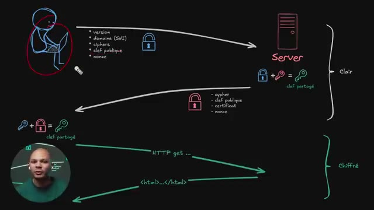
*📸 00:10:51 — Schéma détaillé du protocole TLS illustrant le mécanisme de handshake, l'échange de clés publiques, le calcul de la clé partagée et la phase de transmission de données chiffrées entre un client et un serveur.*

---

### ⏱️ `[00:11:08 - 00:11:43]` | Segment #28

**🔊 Audio (Transcription Intégrale Mot pour Mot en Français) :**
> l'attaqueur ne sait pas ce qu'il y a dans les paquets, s'il sait que les paquets sont toujours les mêmes, eh bien potentiellement qu'il peut faire quelque chose de bizarre. Donc là, si on a des chiffres aléatoires, on sait que c'est d'être. Ensuite, cette clé publique ici, je l'ai symbolisée par un cadenas parce que pour expliquer vite fait, le chiffrement asymétrique, c'est qu'on a une clé publique et une clé privée. La clé privée, c'est le symbole d'une clé ici, c'est ce qu'on garde tout le temps chez soi, sur son ordi et qu'on ne va jamais partager. Donc le serveur a une clé privée, il ne va jamais la partager. Le client a une clé privée, il ne va jamais la partager. Par contre, cette clé privée est liée à une clé publique qu'on peut envoyer.

**👁️ Analyse Visuelle d'Écran (gemini-3.5-flash-lite) :**
**Interface & Outils** : Aucune interface logicielle ou console active.

**Contenu textuel & Code** : Schéma illustratif tracé sur un fond sombre (non pertinent selon les critères stricts).

**Action / Démonstration** : Explication orale de concepts de chiffrement et de sécurité réseau.

---

### ⏱️ `[00:11:43 - 00:12:16]` | Segment #29

**🔊 Audio (Transcription Intégrale Mot pour Mot en Français) :**
> Et cette clé publique, elle permet de chiffrer. Elle permet juste de chiffrer, mais pas de déchiffrer. C'est-à-dire qu'elle prend un message. Le message, c'est A, B, C et la clé publique, elle permet de transformer en un message n'importe quoi. Ça va être « XV34 ». C'est le 4 le plus bizarre que tu as vu. Et du coup, on ne sait pas ce que ça veut dire. Et le seul moyen de repasser de XV34 à ABC, c'est d'avoir la clé privée qui est seulement ici. Donc ça permet d'envoyer la clé publique. Même si la clé publique est interceptée et un attaqueur la voit, il ne peut rien faire avec, il ne peut pas déchiffrer le trafic. Et donc le serveur, lui, il a la clé publique, il peut

**👁️ Analyse Visuelle d'Écran (gemini-3.5-flash-lite) :**
**Interface & Outils** : Tableau blanc numérique / diagramme vectoriel avec incrustation vidéo du présentateur.

**Contenu textuel & Code** : Représentation schématique d'un client (ordinateur) et d'un serveur, avec des flux étiquetés (version, domaine SNI, ciphers, clé publique, nonce, HTTP get, code HTML) et la formule de génération de la clé partagée.

**Action / Démonstration** : Explication visuelle du mécanisme de chiffrement asymétrique et de l'établissement d'une connexion sécurisée TLS entre un client et un serveur.

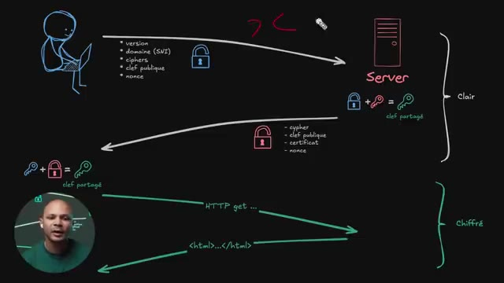
*📸 00:11:52 — Schéma explicatif illustrant le processus de chiffrement asymétrique et la négociation TLS (Client/Serveur) avec échange de clés, incluant la distinction entre flux en clair et flux chiffré.*

---

### ⏱️ `[00:12:16 - 00:12:51]` | Segment #30

**🔊 Audio (Transcription Intégrale Mot pour Mot en Français) :**
> chiffrer un message pour moi et me l'envoyer. Et il n'y a que moi qui pourra le lire. Même si le réseau que j'utilise n'est pas sécurisé et que moi qui pourrais lire le message. Donc j'envoie ma queue publique, le serveur il reçoit ça et ce qu'il peut calculer maintenant c'est avec ma queue publique et sa clé privée il va pouvoir générer une clé qui est partagée. La clé verticelle, c'est une nouvelle clé, une clé qui va être cette fois-ci symétrique qui sert à la fois à déchiffrer et à chiffrer. Et pourquoi cette clé ici elle est symétrique et pas asymétrique ? C'est tout simplement parce que ça coûte beaucoup plus en termes d'utilisation de CPU de chiffrer des données avec des clés asymétriques qu'avec une clé symétrique. Donc en fait on utilise du

**👁️ Analyse Visuelle d'Écran (gemini-3.5-flash-lite) :**
**Interface & Outils** : Tableau noir avec diagramme d'architecture réseau et cryptographique illustratif.

**Contenu textuel & Code** : Représentation schématique d'un client, d'un serveur, de flux de données, de clés cryptographiques et d'algorithmes de chiffrement asymétrique (calcul de clé partagée).

**Action / Démonstration** : Explication théorique et visuelle du mécanisme d'échange de clés publiques/privées pour sécuriser les communications sur un réseau non sécurisé.

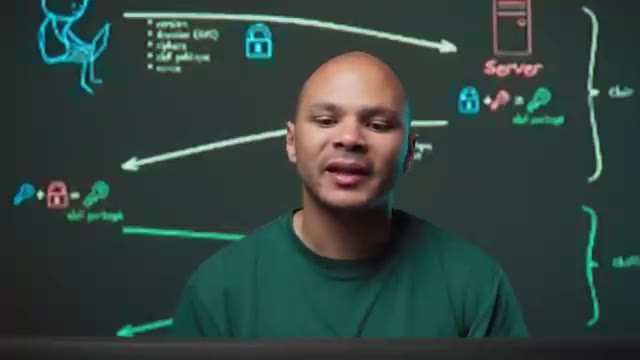
*📸 00:12:42 — Schéma explicatif dessiné sur un tableau noir en arrière-plan illustrant l'échange de clés asymétriques et la génération d'une clé partagée entre un client et un serveur.*

---

### ⏱️ `[00:12:51 - 00:13:25]` | Segment #31

**🔊 Audio (Transcription Intégrale Mot pour Mot en Français) :**
> chiffrement asymétrique ici au départ pour pouvoir générer notre clé symétrique et une fois qu'on a notre clé symétrique et bah on l'utilise tout le temps pour pouvoir chiffrer des données beaucoup plus rapidement, beaucoup plus efficacement sans utiliser beaucoup de CPU. Et ce qu'il va faire, c'est que pour que moi j'ai aussi cette clé partagée, le serveur va m'envoyer lui aussi sa clé publique et mon navigateur ici il va avoir ma clé privée, la clé publique du serveur et un algorithme qui s'appelle le DeFi Hellman Key Exchange et qui permet de calculer exactement la même clé sur le client et sur le serveur sans jamais échanger cette même clé, juste

**👁️ Analyse Visuelle d'Écran (gemini-3.5-flash-lite) :**
**Interface & Outils** : Tableau pédagogique virtuel en arrière-plan illustrant les protocoles de chiffrement

**Contenu textuel & Code** : Schéma d'échange de clés montrant un client, un serveur, des clés publiques et une clé partagée symétrique

**Action / Démonstration** : Explication de la génération d'une clé symétrique partagée via le chiffrement asymétrique pour optimiser les performances CPU

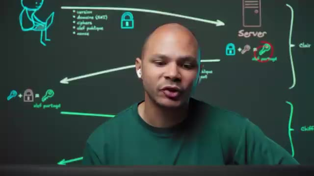
*📸 00:13:08 — Plan face-caméra avec en arrière-plan un diagramme d'architecture réseau illustrant le chiffrement asymétrique et la clé partagée (serveur et client)*

---

### ⏱️ `[00:13:25 - 00:13:44]` | Segment #32

**🔊 Audio (Transcription Intégrale Mot pour Mot en Français) :**
> en échangeant les clés publiques ici. Ce qui fait qu'un attaquant sur le réseau, il peut voir les clés publiques du client et du serveur, mais il ne pourra jamais calculer la clé partagée parce qu'il n'a aucune des clés privées. J'ai mis un repos depuis tout à l'heure, je n'ai même pas calculé. En plus de sa clé publique éphémère, il va aussi envoyer le cipher.

**👁️ Analyse Visuelle d'Écran (gemini-3.5-flash-lite) :**
**Interface & Outils** : Tableau blanc numérique / illustration graphique animée représentant le protocole TLS.

**Contenu textuel & Code** : Diagramme réseau schématisant les étapes client/serveur : version, domaine SNI, ciphers, clé publique, nonce, puis calcul de la clé partagée et requêtes HTTP/HTML chiffrées.

**Action / Démonstration** : Explication visuelle et pédagogique du fonctionnement des échanges cryptographiques et de la dérivation de la clé partagée dans le protocole TLS.

*📸 00:13:30 — Schéma explicatif illustrant le processus d'échange de clés TLS entre un client et un serveur, avec la phase en clair et la phase chiffrée.*

---

### ⏱️ `[00:13:44 - 00:14:06]` | Segment #33

**🔊 Audio (Transcription Intégrale Mot pour Mot en Français) :**
> Donc là, c'est le serveur qui va décider. Les ciphers qu'on avait ici envoyés par le client, c'est juste une liste d'algorithmes avec lesquels le navigateur est compatible. Et donc ciphers ici au pluriel parce qu'en fait on va envoyer la liste des algorithmes de chiffrement avec lesquels notre navigateur est compatible. Comme ça le serveur, il peut en choisir un parmi la liste que je lui envoie ici. Ici on a un cipher, donc un seul, c'est celui que le serveur a choisi parmi la liste qui a été envoyée par le client ici.

**👁️ Analyse Visuelle d'Écran (gemini-3.5-flash-lite) :**
**Interface & Outils** : Tableau blanc numérique / Schéma illustratif dessiné à la main.

**Contenu textuel & Code** : Diagramme réseau montrant l'échange des paramètres de chiffrement (version, domaine/SNI, ciphers, clé publique, nonce) menant à la dérivation d'une clé partagée et au passage en trafic chiffré.

**Action / Démonstration** : Explication de la phase de négociation TLS (handshake) et du rôle du serveur dans le choix de l'algorithme de chiffrement (cipher).

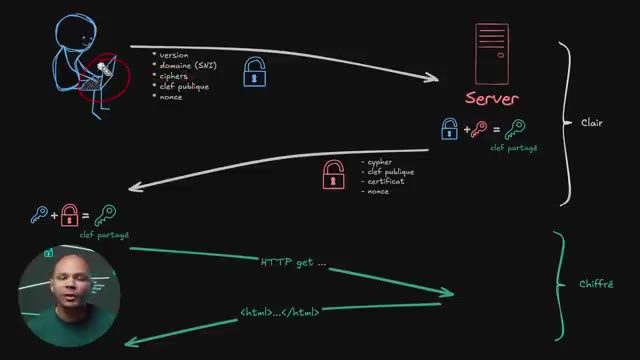
*📸 00:13:49 — Schéma explicatif illustrant le déroulement d'une négociation TLS (ClientHello, ServerHello) entre un client et un serveur.*

---

### ⏱️ `[00:14:06 - 00:14:32]` | Segment #34

**🔊 Audio (Transcription Intégrale Mot pour Mot en Français) :**
> La clé publique, c'est le fameux cadenas. Le certificat, c'est ce qui va prouver que le serveur ici, c'est bien le serveur qui gère le nom de domaine coca-dmin.com. Donc il y a une liste d'autorités de certification qui sont hardcodées dans mon navigateur ici, donc je n'ai même pas besoin d'Internet pour ça, qui ont signé le certificat de cocanmine.com qui est sur le serveur. Ce qui fait que le client ici, il sait que le serveur qui a le certificat pour cocanmine.com, c'est vraiment lui le seul et l'unique qui peut communiquer au nom de cocanmine.com.

**👁️ Analyse Visuelle d'Écran (gemini-3.5-flash-lite) :**
**Interface & Outils** : Présentation ou face-caméra sans interface informatique partagée.

**Contenu textuel & Code** : Explications orales des concepts, architectures et retours d'expérience.

**Action / Démonstration** : Démonstration pédagogique et mise en perspective technique.

---

### ⏱️ `[00:14:32 - 00:14:54]` | Segment #35

**🔊 Audio (Transcription Intégrale Mot pour Mot en Français) :**
> Donc on envoie à la fois le certificat et à la fois la preuve que c'est vraiment son certificat en signant ce certificat. Et on a encore un nounce. Pareil, ce nounce là, c'est pour pouvoir ajouter un peu d'aléatoire. et il me semble aussi que ce Nouns va être utilisé dans la création de la clé partagée ici. Ce qui fait que ça rajoute encore un petit peu d'aléatoire pour être sûr qu'un attaquant ne pourra jamais générer cette clé partagée.

**👁️ Analyse Visuelle d'Écran (gemini-3.5-flash-lite) :**
**Interface & Outils** : Tableau blanc numérique / illustration graphique de réseau en arrière-plan.

**Contenu textuel & Code** : Schéma d'architecture réseau représentant les flux de négociation (handshake) TLS entre un client et un serveur, avec des symboles de cadenas, de clés et des listes de paramètres (version, SNI, ciphers, nonce).

**Action / Démonstration** : Explication technique du protocole de négociation TLS, de la transmission des certificats, de l'utilisation des nonces et de la dérivation de la clé partagée.

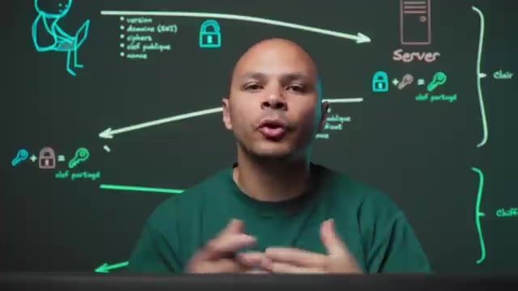
*📸 00:14:49 — Plan face-caméra du présentateur devant un tableau numérique illustrant un diagramme de séquence réseau TLS/SSL (échange de certificats, clés publiques et génération de clés partagées).*

---

### ⏱️ `[00:14:54 - 00:15:14]` | Segment #36

**🔊 Audio (Transcription Intégrale Mot pour Mot en Français) :**
> Et une fois qu'on a cette clé partagée-là, le client peut commencer à envoyer ses requêtes, par exemple un HTTP GET, pour récupérer la page d'accueil de kokamine.com. Et le serveur, lui, peut répondre. Et tout ce qui est en vert ici, c'est chiffré. Alors que tout ce qui est en blanc ici, c'est en clair. Mais c'est pas grave parce que même si un attaquant récupère les clés, il ne peut rien faire avec.

**👁️ Analyse Visuelle d'Écran (gemini-3.5-flash-lite) :**
**Interface & Outils** : Tableau blanc numérique / outil de schématisation (style Excalidraw) avec incrustation vidéo du présentateur.

**Contenu textuel & Code** : Représentation d'un client (ordinateur portable) et d'un serveur, flux initiaux en blanc (non chiffrés, avec cadenas ouvert et paramètres TLS), dérivation de la clé partagée, et flux applicatifs en vert (chiffrés, requête HTTP GET et réponse HTML).

**Action / Démonstration** : Explication du mécanisme d'établissement de la connexion sécurisée TLS et de la distinction entre les données échangées en clair et les données chiffrées.

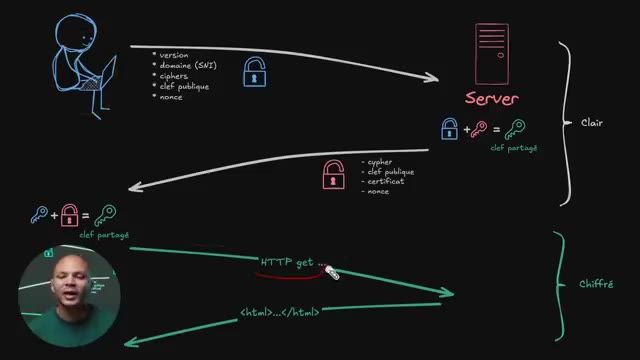
*📸 00:14:59 — Schéma explicatif illustrant le flux de communication sécurisée HTTPS entre un client et un serveur, distinguant la phase de négociation en clair et la phase de transmission chiffrée.*

---

### ⏱️ `[00:15:14 - 00:15:50]` | Segment #37

**🔊 Audio (Transcription Intégrale Mot pour Mot en Français) :**
> Ce qui peut être potentiellement un petit peu embêtant, c'est que le nom de domaine ici est en clair. Donc ça veut dire qu'un attaquant pourrait potentiellement voir sur quel site va l'utilisateur ici. Pour ça, techniquement, il y a une autre version du protocole qui s'appelle ESNI pour Uncrypted SNI. Au moment de faire ma requête DNS pour kokamin.com, je vais non seulement demander l'adresse IP du serveur qui héberge kokamin.com, mais je vais aussi demander un record de type TXT, ce qui fait que je vais pouvoir encrypter le nom de domaine ici, et le serveur, qui a ici la clé privée qui correspond à la clé publique qu'il y avait dans le DNS,

**👁️ Analyse Visuelle d'Écran (gemini-3.5-flash-lite) :**
**Interface & Outils** : Présentation ou face-caméra sans interface informatique partagée.

**Contenu textuel & Code** : Explications orales des concepts, architectures et retours d'expérience.

**Action / Démonstration** : Démonstration pédagogique et mise en perspective technique.

---

### ⏱️ `[00:15:50 - 00:16:12]` | Segment #38

**🔊 Audio (Transcription Intégrale Mot pour Mot en Français) :**
> pourra la déchiffrer. Et donc même si un attaqueur peut voir le client LO qui est en clair, le SNI qui contient le domaine que je voulais aller voir, par exemple le kokamine.com, lui il sera encrypté. Il y a même une version un petit peu plus récente de ce protocole, mais qui est encore très très peu utilisée, qui s'appelle ECH, pour Uncrypted Client LO. Et donc au lieu de chiffrer juste le SNI, ça va chiffrer tout le message client Hello.

**👁️ Analyse Visuelle d'Écran (gemini-3.5-flash-lite) :**
**Interface & Outils** : Tableau blanc numérique / logiciel de mind-mapping et dessin technique.

**Contenu textuel & Code** : Schéma d'architecture réseau montrant le flux TLS avec ECH : client, serveur, champs en clair (version, domaine SNI, ciphers, clé publique, nonce), et le mécanisme de clé partagée.

**Action / Démonstration** : Explication du fonctionnement de l'Encrypted Client Hello (ECH) pour masquer le SNI et renforcer la confidentialité des connexions HTTPS.

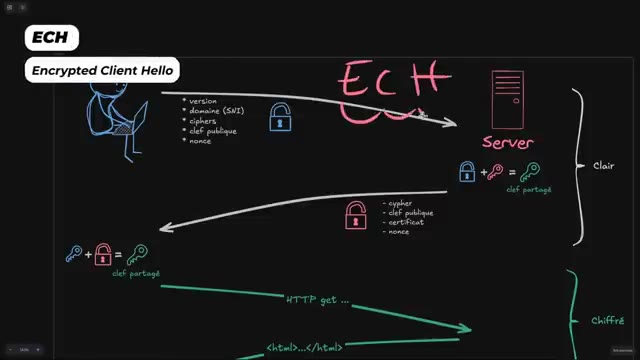
*📸 00:16:07 — Schéma explicatif du protocole ECH (Encrypted Client Hello) illustrant le chiffrement du SNI et des paramètres de négociation TLS entre un client et un serveur.*

---

### ⏱️ `[00:16:12 - 00:16:34]` | Segment #39

**🔊 Audio (Transcription Intégrale Mot pour Mot en Français) :**
> Ce qui fait qu'un attaquant, il ne peut rien voir. Le problème qui reste avec cette technique ici, le SNI ou le ECH, c'est que ma requête DNS que je fais avant même de me connecter à mon serveur, elle est l'enclair. Et si elle est l'enclair, un attaquant pourrait modifier la réponse pour faire croire à l'utilisateur qu'il n'y a pas de clé publique pour pouvoir chiffrer le message Hello. Ou alors même de changer et de mettre sa propre clé pour pouvoir déchiffrer le nom de domaine que l'utilisateur a voulu accéder.

**👁️ Analyse Visuelle d'Écran (gemini-3.5-flash-lite) :**
**Interface & Outils** : Présentation ou face-caméra sans interface informatique partagée.

**Contenu textuel & Code** : Explications orales des concepts, architectures et retours d'expérience.

**Action / Démonstration** : Démonstration pédagogique et mise en perspective technique.

---

### ⏱️ `[00:16:34 - 00:16:56]` | Segment #40

**🔊 Audio (Transcription Intégrale Mot pour Mot en Français) :**
> Et donc pour que ça, ce soit vraiment utile, Il faut aussi chiffrer son DNS et on peut faire ça avec du DNS over HTTPS. Et donc au lieu d'utiliser UDP avec le protocole DNS qui va être en clair, on va utiliser HTTPS, donc il faut qu'on ait un serveur DNS qui soit compatible avec ce protocole-là. Et donc ça va utiliser exactement le même protocole, ce qui fait que mes requêtes DNS vont être chiffrées.

**👁️ Analyse Visuelle d'Écran (gemini-3.5-flash-lite) :**
**Interface & Outils** : Présentation ou face-caméra sans interface informatique partagée.

**Contenu textuel & Code** : Explications orales des concepts, architectures et retours d'expérience.

**Action / Démonstration** : Démonstration pédagogique et mise en perspective technique.

---

### ⏱️ `[00:16:56 - 00:17:15]` | Segment #41

**🔊 Audio (Transcription Intégrale Mot pour Mot en Français) :**
> Je vais pouvoir récupérer la clé publique du serveur, je vais pouvoir chiffrer mon clé en Hello et personne ne pourra voir quel site web j'ai voulu visiter. Ce qui fait que là, on est tranquille. Même si j'intercepte tout le trafic, je ne saurais même pas quel site web l'utilisateur a voulu visiter. Ensuite, une fois qu'on a passé à travers tout le handshake TLS, on est dans le protocole HTTP.

**👁️ Analyse Visuelle d'Écran (gemini-3.5-flash-lite) :**
**Interface & Outils** : Tableau blanc numérique / schéma explicatif illustrant le protocole TLS.

**Contenu textuel & Code** : Diagramme réseau schématisant le client, le serveur, les flux en clair (version, domaine SNI, ciphers, clé publique, nonce) et les flux chiffrés (requêtes HTTP get, code HTML).

**Action / Démonstration** : Explication de l'architecture d'échange de clés et du chiffrement du trafic web lors de l'établissement d'une connexion TLS.

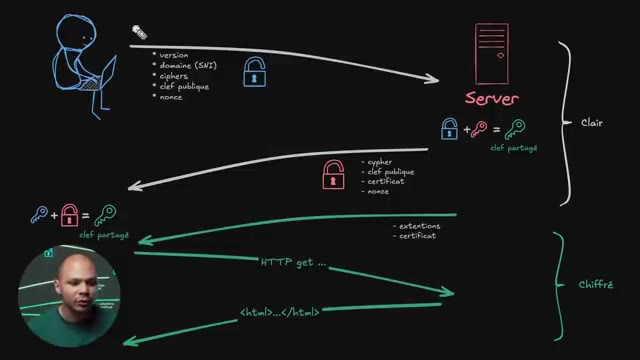
*📸 00:17:10 — Schéma détaillé du handshake TLS illustrant les échanges en clair et chiffrés entre le client et le serveur, avec une incrustation vidéo du présentateur.*

---

### ⏱️ `[00:17:15 - 00:17:34]` | Segment #42

**🔊 Audio (Transcription Intégrale Mot pour Mot en Français) :**
> Et encore une fois, HTTP, c'est pareil, il y a plusieurs versions. Et la version la plus ancienne, c'est HTTP 1.1. Donc HTTP 1.1, ça fonctionne comme ça. C'est vraiment un vieux protocole qui est un protocole texte. Donc, c'est-à-dire qu'on peut encore utiliser ce protocole de manière textuelle avec Telnet, par exemple. Et on peut se connecter avec un serveur web et taper ces commandes-là.

**👁️ Analyse Visuelle d'Écran (gemini-3.5-flash-lite) :**
**Interface & Outils** : Présentation ou face-caméra sans interface informatique partagée.

**Contenu textuel & Code** : Explications orales des concepts, architectures et retours d'expérience.

**Action / Démonstration** : Démonstration pédagogique et mise en perspective technique.

---

### ⏱️ `[00:17:34 - 00:17:57]` | Segment #43

**🔊 Audio (Transcription Intégrale Mot pour Mot en Français) :**
> C'est comme si par exemple on était en PowerShell ou dans la ligne de commande Linux et qu'on tapait des commandes et qu'on recevait une réponse. C'est la même chose, sauf que c'est à travers le réseau. On tape du texte et on reçoit du texte. Et donc le format, c'est le verbe ici, get. Il peut y avoir différents formats. Il peut y avoir get, post, put, delete. Il y en a peut-être d'autres, mais globalement c'est ça. Le plus populaire, c'est get pour récupérer quelque chose. Et puis souvent post pour pouvoir envoyer quelque chose.

**👁️ Analyse Visuelle d'Écran (gemini-3.5-flash-lite) :**
**Interface & Outils** : Aucune interface active (simple illustration animée en arrière-plan).

**Contenu textuel & Code** : Schéma explicatif montrant une requête HTTP GET et une réponse serveur avec des en-têtes (Host, User-Agent, Server, Content-Type).

**Action / Démonstration** : Explication pédagogique du fonctionnement des requêtes et réponses textuelles à travers le réseau sur le modèle client-serveur.

---

### ⏱️ `[00:17:57 - 00:18:18]` | Segment #44

**🔊 Audio (Transcription Intégrale Mot pour Mot en Français) :**
> Par exemple, si je me log sur un site web, je fais une requête de type post parce que je vais envoyer mon nom d'utilisateur et mon passeport. Ensuite, c'est la ressource qu'on veut récupérer. Donc là ici, la plupart du temps, quand on va sur un site, on va récupérer le index.html. Et ensuite, la version du protocole. Donc là, on est en HTTP 1.1. Ensuite, on doit sauter une ligne et on doit mettre les headers.

**👁️ Analyse Visuelle d'Écran (gemini-3.5-flash-lite) :**
**Interface & Outils** : Schéma explicatif animé / tableau blanc numérique.

**Contenu textuel & Code** : Requête HTTP/1.1 (GET /index.html, Host, User-Agent, Accept, Connection) et réponse HTTP/1.1 200 OK avec en-têtes et corps HTML.

**Action / Démonstration** : Explication de la structure d'une requête HTTP GET pour récupérer une ressource (index.html) et de la réponse du serveur.

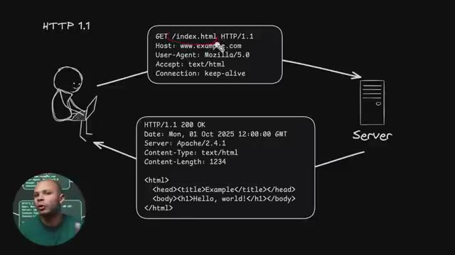
*📸 00:18:08 — Schéma explicatif d'une requête HTTP 1.1 GET et de sa réponse entre un client et un serveur web.*

---

### ⏱️ `[00:18:19 - 00:18:40]` | Segment #45

**🔊 Audio (Transcription Intégrale Mot pour Mot en Français) :**
> Donc là, on va demander quel hôte on veut, quel est le nombre de domaines qu'on veut. Parce qu'encore une fois, on se connaît sur le serveur ici via l'adresse IP. Donc c'est peut-être 12.3, 4. Donc le serveur ici, il peut y avoir plusieurs sites web. Il peut y avoir plein de sites web. D'ailleurs, même, on voyait dans le cas d'un CDN. CDN pour Content Delivery Network, comme Cloudflare par exemple. C'est les serveurs de Cloudflare qui sont devant des millions de sites web.

**👁️ Analyse Visuelle d'Écran (gemini-3.5-flash-lite) :**
**Interface & Outils** : Aucune interface active (simple décor graphique/schéma statique).

**Contenu textuel & Code** : Blocs de texte illustrant une requête HTTP (GET /index.html, Host: www.example.com, User-Agent).

**Action / Démonstration** : Explication théorique du fonctionnement du protocole HTTP et des échanges entre un client et un serveur.

---

### ⏱️ `[00:18:40 - 00:19:14]` | Segment #46

**🔊 Audio (Transcription Intégrale Mot pour Mot en Français) :**
> Donc il faut que le serveur ici, il sache quel site l'utilisateur il veut. Et donc c'est avec ce header ici, host, qu'on va pouvoir lui dire, ok, moi je veux exemple.com ou kokadmin.com ou n'importe quoi. Et après, il va y avoir plein de headers. Voilà, ça va être ton navigateur qui va les rajouter. par exemple le user agent la version de ton navigateur s'il ya chrome y remarqué chrome c'est à firefox safari a marqué firefox safari c'est plus pour des analytiques ce que c'est utilisé puis là d'autres exemples de ce qu'on peut accepter si par exemple c'est du texte ou si c'est zippé pour pouvoir compresser la requête ou la réponse qu'on va recevoir ou si

**👁️ Analyse Visuelle d'Écran (gemini-3.5-flash-lite) :**
**Interface & Outils** : Schéma didactique animé de type tableau blanc (whiteboard) avec incrustation vidéo du présentateur.

**Contenu textuel & Code** : Requête HTTP/1.1 (GET /index.html, Host: www.example.com, User-Agent, Accept, Connection) et réponse HTTP (200 OK avec en-têtes Server, Content-Type, Content-Length et code HTML de base).

**Action / Démonstration** : Explication du rôle de l'en-tête 'Host' et des en-têtes HTTP standard envoyés par le navigateur dans le protocole HTTP/1.1.

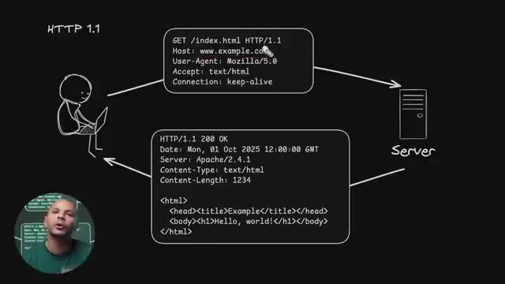
*📸 00:18:48 — Schéma explicatif illustrant une requête HTTP/1.1 émise par un client vers un serveur web, détaillant les en-têtes (Host, User-Agent, Accept, Connection) et la réponse associée.*

---

### ⏱️ `[00:19:14 - 00:19:36]` | Segment #47

**🔊 Audio (Transcription Intégrale Mot pour Mot en Français) :**
> c'est du jason et c'est à se permet au navigateur ça permet au serveur de savoir ce qu'on lui envoie et à l'utilisateur de savoir ce qui récupère donc comment le format et comment l'afficher ce Ce qu'on retrouve aussi potentiellement, mais qu'on n'aurait pas dans une première connexion, ce serait les cookies. Et on aurait ici les cookies qui permettraient, une fois que notre utilisateur est authentifié sur notre serveur, on s'est logué sur un site par exemple, pas avoir à se re-logger à chacune des requêtes qu'on va faire.

**👁️ Analyse Visuelle d'Écran (gemini-3.5-flash-lite) :**
**Interface & Outils** : Schéma didactique animé représentant le flux de communication client-serveur HTTP.

**Contenu textuel & Code** : Requête HTTP/1.1 (GET /index.html, Host, User-Agent, Accept, Connection) et réponse HTTP/1.1 200 OK (Date, Server, Content-Type, Content-Length, code HTML).

**Action / Démonstration** : Explication de la structure des requêtes et réponses HTTP et du rôle des en-têtes dans les échanges web.

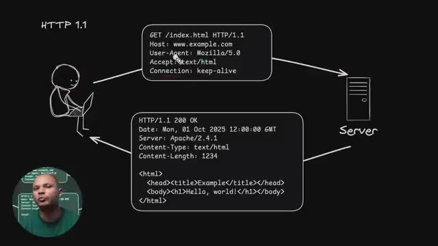
*📸 00:19:25 — Schéma détaillé du protocole HTTP 1.1 illustrant une requête client (GET) vers un serveur et la réponse HTTP correspondante contenant les en-têtes et le corps HTML.*

---

### ⏱️ `[00:19:37 - 00:19:56]` | Segment #48

**🔊 Audio (Transcription Intégrale Mot pour Mot en Français) :**
> On aura juste un cookie qu'on va rajouter ici. Et comme ça, le serveur, il saura qui on est à chaque fois. Et le serveur, il va envoyer une réponse ici. Il va commencer par lui dire HTTP 1.1 pour être sûr qu'on parle bien le même protocole. Ensuite, le code d'erreur de la page. Donc le code qui veut dire tout s'est bien passé, voilà la page et j'ai bien trouvé la page que tu voulais et la voilà.

**👁️ Analyse Visuelle d'Écran (gemini-3.5-flash-lite) :**
**Interface & Outils** : Présentation ou face-caméra sans interface informatique partagée.

**Contenu textuel & Code** : Explications orales des concepts, architectures et retours d'expérience.

**Action / Démonstration** : Démonstration pédagogique et mise en perspective technique.

---

### ⏱️ `[00:19:56 - 00:20:18]` | Segment #49

**🔊 Audio (Transcription Intégrale Mot pour Mot en Français) :**
> C'est le code 200. 200 pour OK. Voilà, c'est là qu'on trouve les fameux codes. Par exemple, 404 si on n'a pas trouvé la ressource qu'on voulait ou 301 si on veut rediriger l'utilisateur vers une autre URL, etc. On va avoir plein d'autres headers ici. On peut potentiellement ici retrouver le cookie qui va devoir être enregistré dans le navigateur, etc. Et ensuite, on va avoir le contenu.

**👁️ Analyse Visuelle d'Écran (gemini-3.5-flash-lite) :**
**Interface & Outils** : Schéma didactique animé ou illustré (style whiteboard/dessin technique) représentant un flux réseau HTTP.

**Contenu textuel & Code** : Requête HTTP GET avec en-têtes (Host, User-Agent, Accept, Connection) et réponse HTTP/1.1 200 OK avec en-têtes (Date, Server, Content-Type, Content-Length) et corps de page HTML.

**Action / Démonstration** : Explication du fonctionnement d'une requête HTTP et de la structure de la réponse du serveur avec le code 200 OK.

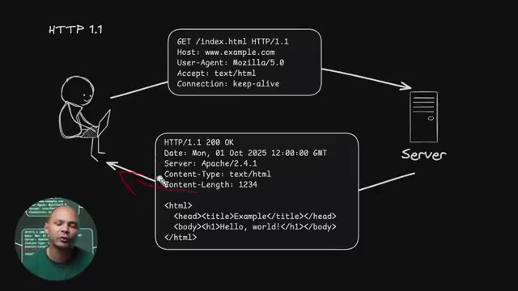
*📸 00:20:12 — Schéma explicatif d'une requête et réponse HTTP 1.1 entre un client (ordinateur) et un serveur, détaillant les en-têtes et le code de statut 200 OK.*

---

### ⏱️ `[00:20:18 - 00:20:39]` | Segment #50

**🔊 Audio (Transcription Intégrale Mot pour Mot en Français) :**
> Donc là, on a récupéré la page index.html. là ça va être le contenu de notre page HTML. Donc là c'est une petite page, tranquille. Donc ça c'est pour HTTP 1.1. Mais comme on voit ici, HTTP 1.1 c'est juste 9.4% du trafic. On voit que la majorité ici c'est HTTP 2, qui est une évolution du protocole. Et donc comment marche HTTP 2 ?

**👁️ Analyse Visuelle d'Écran (gemini-3.5-flash-lite) :**
**Interface & Outils** : Navigateur web affichant Cloudflare Radar (Adoption & Usage).

**Contenu textuel & Code** : Graphiques d'utilisation des versions HTTP (HTTP/1.x, HTTP/2, HTTP/3) et des versions TLS (TLS 1.2, TLS 1.3, QUIC).

**Action / Démonstration** : Analyse des parts de marché du trafic web par protocole HTTP, mettant en avant la domination d'HTTP/2.

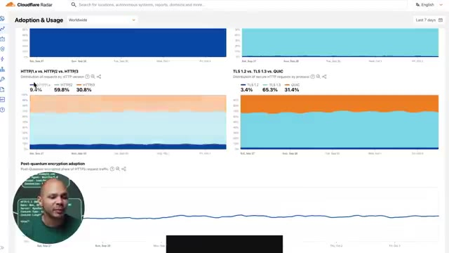
*📸 00:20:28 — Dashboard Cloudflare Radar affichant les statistiques d'adoption des protocoles HTTP/1.x (9.4%), HTTP/2 (59.8%) et HTTP/3 (30.8%).*

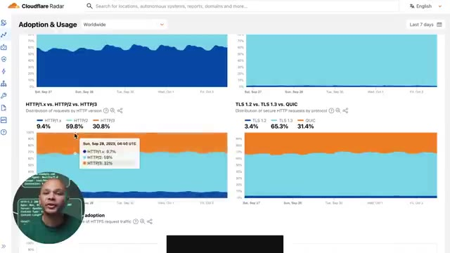
*📸 00:20:33 — Dashboard Cloudflare Radar avec une infobulle interactive sur le graphique de répartition des versions HTTP montrant les parts de trafic.*

---

### ⏱️ `[00:20:39 - 00:20:57]` | Segment #51

**🔊 Audio (Transcription Intégrale Mot pour Mot en Français) :**
> Déjà pour savoir c'est quoi les avantages HTTP 2, il faut comprendre c'est quoi les inconvénients de HTTP 1. Son principal inconvénient, c'est qu'on ne peut récupérer qu'une seule ressource par connexion. Et donc pour pouvoir pallier à ça, ce que les navigateurs font, ils ouvrent plusieurs connexions TCP vers leur serveur. Et donc, ça prend plus de ressources, ça prend un peu plus de temps pour pouvoir se connecter la première fois.

**👁️ Analyse Visuelle d'Écran (gemini-3.5-flash-lite) :**
**Interface & Outils** : Schéma graphique animé (type whiteboard/dessin vectoriel) avec vignette vidéo du présentateur en bas à gauche.

**Contenu textuel & Code** : Représentation schématique d'un client (ordinateur portable) ouvrant des connexions TCP multiples (tunnels) vers un serveur pour transférer des fichiers de ressources (index.html, index.css, favicon.ico, etc.).

**Action / Démonstration** : Explication visuelle de la limitation de HTTP/1.1 (une ressource par connexion) et du contournement par l'ouverture de multiples connexions TCP simultanées.

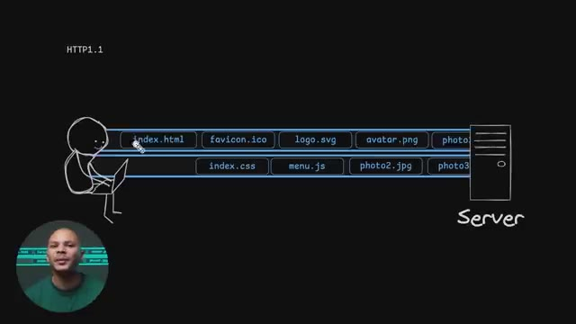
*📸 00:20:43 — Schéma explicatif illustrant le fonctionnement de HTTP/1.1 avec l'ouverture de plusieurs connexions TCP parallèles entre un client et un serveur pour charger différentes ressources.*

---

### ⏱️ `[00:20:58 - 00:21:32]` | Segment #52

**🔊 Audio (Transcription Intégrale Mot pour Mot en Français) :**
> Et en plus de ça, il y a un nombre maximum de connexions simultanées qu'on peut ouvrir. Je crois que c'est 6 ou 7. Donc, ce qui fait qu'on ne pourra jamais télécharger plus que 6 ou 7 éléments en parallèle. Et quand on va sur un site web récent, on a des dizaines, voire des centaines de ressources à charger parce que chaque image, chaque fichier, chaque fichier CSS, chaque fichier CSS, c'est trop dur à dire, un fichier CSS, chaque fichier HTML, JavaScript, SVG, PNG, etc. Il doit être téléchargé pour pouvoir afficher la page et donc c'est des dizaines voire des centaines de ressources à récupérer en même temps. Et si on n'a que six connexions parallèles, on peut télécharger que six par six, ce qui peut pas mal limiter.

**👁️ Analyse Visuelle d'Écran (gemini-3.5-flash-lite) :**
**Interface & Outils** : Aucun outil technique, terminal ou interface logicielle n'est affiché à l'écran.

**Contenu textuel & Code** : Schéma animé illustrant des flux de requêtes HTTP séquentiels entre un client et un serveur (HTTP/1.1).

**Action / Démonstration** : Explication théorique des limitations de connexions simultanées sous le protocole HTTP/1.1.

---

### ⏱️ `[00:21:32 - 00:22:05]` | Segment #53

**🔊 Audio (Transcription Intégrale Mot pour Mot en Français) :**
> Plus de ça, imaginons que j'ai téléchargé ce premier fichier, maintenant je commence le téléchargement de ce deuxième fichier. Imaginons que là, à ce moment-là, j'ai un paquet qui est perdu dans le cyberespace. Le protocole TCP, c'est pas grave, il va s'en rendre compte, il va demander au serveur de réenvoyer ce paquet-là. Sauf que pendant tout ce temps-là où on est en train d'attendre pour savoir qu'est ce que le paquet est arrivé non attend je vais leur demander auquel au paquet arrive et c'est et ben on est là bloqué en train d'attendre et donc tous les fichiers qu'on doit télécharger après ils sont en train d'attendre aussi donc ça ralentit pas mal le déchargement de tous les fichiers et donc ça c'est fini parce que maintenant en http 2 on a

**👁️ Analyse Visuelle d'Écran (gemini-3.5-flash-lite) :**
**Interface & Outils** : Schéma didactique / illustration animée sur fond noir.

**Contenu textuel & Code** : Représentation graphique d'un client, d'un serveur et de flux de requêtes/fichiers (index.html, favicon.ico, etc.) sous HTTP/1.1.

**Action / Démonstration** : Explication visuelle du fonctionnement des protocoles web et du comportement réseau lors de transferts multiples.

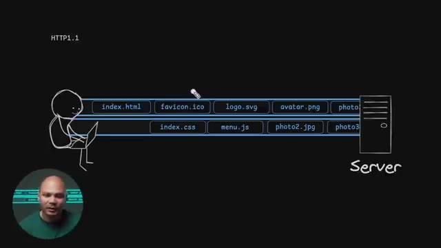
*📸 00:21:40 — Schéma explicatif illustrant des transferts de fichiers entre un client et un serveur sous HTTP/1.1.*

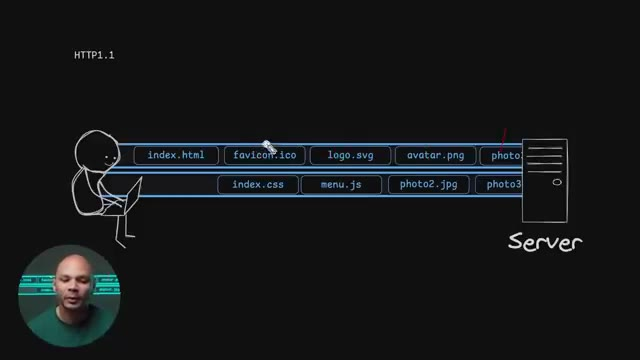
*📸 00:21:57 — Schéma animé montrant le transit de fichiers et illustrant potentiellement la perte d'un paquet ou une latence réseau sur TCP.*

---

### ⏱️ `[00:22:05 - 00:22:42]` | Segment #54

**🔊 Audio (Transcription Intégrale Mot pour Mot en Français) :**
> du multi session c'est à dire qu'avec une seule connexion tcp on peut avoir plusieurs sessions dans la même connexion donc ça veut dire que on peut demander autant de fichiers qu'on veut avec une seule connexion TCP. Donc ça consomme moins de ressources parce qu'on a moins de connexions ouvertes et c'est aussi plus rapide parce qu'on n'est plus limité à juste six fichiers en parallèle. On peut en avoir beaucoup plus, télécharger beaucoup plus de fichiers en parallèle et donc c'est plus efficace. Un autre avantage aussi, c'est la compression des headers parce que maintenant le HTTP 2, c'est plus un protocole textuel. On en voit vraiment du texte HTTP slash 1.1, etc. Si on se souvient, les headers, il y a beaucoup d'informations, beaucoup de texte qui est ici et là

**👁️ Analyse Visuelle d'Écran (gemini-3.5-flash-lite) :**
**Interface & Outils** : Présentation visuelle / Schéma explicatif sur fond noir avec incrustation vidéo du présentateur.

**Contenu textuel & Code** : Schéma d'architecture réseau montrant le protocole HTTP/2 : Multi session (dans la même connexion TCP), header compression, packet loss block tout (1 TCP session) et flux de fichiers (index.html, favicon.ico, logo.svg, avatar.png, photo3.jpg, menu.js, photo2.jpg).

**Action / Démonstration** : Explication et démonstration visuelle du multiplexage de requêtes sous HTTP/2, montrant l'optimisation des flux de données sur une connexion TCP unique.

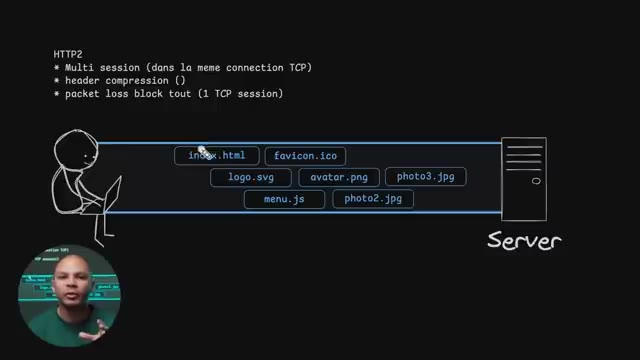
*📸 00:22:32 — Schéma technique détaillé illustrant le multiplexage HTTP/2 (multi-session sur une seule connexion TCP) avec le transfert simultané de plusieurs ressources (index.html, logo.svg, menu.js, etc.) entre un client et un serveur.*

---

### ⏱️ `[00:22:42 - 00:23:01]` | Segment #55

**🔊 Audio (Transcription Intégrale Mot pour Mot en Français) :**
> Là, c'est vraiment un exemple très très light. En vrai, c'est beaucoup plus que ça. Et en plus de ça, c'est les informations ici qui se répètent la plupart du temps. Mon user agent, il ne va jamais changer. Ce que j'accepte ici, ça ne va pas beaucoup changer aussi. Connection Keepalive, mon cookie, tout ça, c'est des trucs qui ne changent pas beaucoup. Mais comme on l'envoie à chacune des requêtes qu'on fait, c'est beaucoup de trafic qui sont envoyés dans le réseau pour pas grand-chose.

**👁️ Analyse Visuelle d'Écran (gemini-3.5-flash-lite) :**
**Interface & Outils** : Aucune interface technique active.

**Contenu textuel & Code** : Schéma statique illustrant une requête HTTP entre un client et un serveur.

**Action / Démonstration** : Explication théorique sur la structure répétitive des en-têtes de requêtes HTTP.

---

### ⏱️ `[00:23:01 - 00:23:27]` | Segment #56

**🔊 Audio (Transcription Intégrale Mot pour Mot en Français) :**
> Donc, le fait d'avoir un protocole qui n'est plus basé sur du texte, mais qui est binaire, on peut compresser. Et donc, par exemple, au lieu d'avoir Mozilla slash 5.0, on pourrait l'envoyer une première fois. la prochaine fois dire que Mozilla slash 5.0 et maintenant ça correspond à l'ID numéro 4. Et donc maintenant à chaque fois que j'envoie l'ID numéro 4 tu sais que je voulais dire Mozilla slash 5.0 et donc j'ai juste à envoyer le chiffre 4 au lieu d'envoyer plein de caractères différents.

**👁️ Analyse Visuelle d'Écran (gemini-3.5-flash-lite) :**
**Interface & Outils** : Schéma de type whiteboard / dessin vectoriel animé.

**Contenu textuel & Code** : Requête HTTP/1.1 textuelle avec en-têtes (GET, Host, User-Agent: Mozilla/5.0, Accept, Connection) et réponse HTTP/1.1 avec en-têtes et corps HTML de base.

**Action / Démonstration** : Explication du fonctionnement textuel et verbeux du protocole HTTP/1.1 avant d'introduire les optimisations binaires.

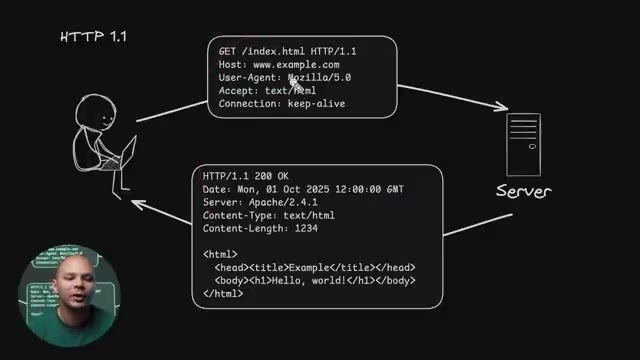
*📸 00:23:07 — Schéma explicatif illustrant un échange de requêtes et réponses HTTP/1.1 textuelles entre un client et un serveur.*

---

### ⏱️ `[00:23:27 - 00:24:04]` | Segment #57

**🔊 Audio (Transcription Intégrale Mot pour Mot en Français) :**
> Encore une fois là Mozilla 5.0 un vrai user agent c'est genre beaucoup plus de caractères que ça. Donc en plus d'être plus rapide ça sauve beaucoup de bandes passantes. Par contre un petit problème qui reste quand même un petit peu embêtant dans HTTP2, c'est qu'on utilise toujours TCP et donc c'est toujours la même session TCP ici. Ce qui fait que le problème qu'on parlait tout à l'heure où imaginons qu'il y a un paquet qui est perdu ici, je ne peux pas recevoir le prochain paquet si le précédent paquet n'est pas arrivé. Et donc je dois renvoyer ce paquet, attendre qu'il arrive, etc. Et donc même si j'ai plusieurs sessions dans ma connexion TCP, c'est toujours une connexion

**👁️ Analyse Visuelle d'Écran (gemini-3.5-flash-lite) :**
**Interface & Outils** : Présentation ou face-caméra sans interface informatique partagée.

**Contenu textuel & Code** : Explications orales des concepts, architectures et retours d'expérience.

**Action / Démonstration** : Démonstration pédagogique et mise en perspective technique.

---

### ⏱️ `[00:24:04 - 00:24:38]` | Segment #58

**🔊 Audio (Transcription Intégrale Mot pour Mot en Français) :**
> TCP et donc une perte de paquets bloque tout le reste. Même si j'ai plusieurs sections, elles sont toutes bloquées par cette perte de paquets. Donc ça fait beaucoup plus mal de perdre des paquets en HTTP2 qu'en HTTP1. Parce que là en HTTP1, comme on avait 6 connexions TCP en parallèle, s'il y en avait une qui bloquait, ça bloquait juste une des sessions. Là si je perds un paquet ici, ça ne bloque pas mon menu.js. Alors que là ici, si je perds un paquet ici, ça bloque mon favicon, mon logo et mon menu.js et tous ceux qui sont après. Donc c'est un peu chiant. Et c'est pour ça qu'on a le HTTP 3. Et le HTTP 3 a une grosse différence avec le HTTP 1 et le

**👁️ Analyse Visuelle d'Écran (gemini-3.5-flash-lite) :**
**Interface & Outils** : Schéma graphique explicatif de type whiteboard / dessin vectoriel sur fond noir.

**Contenu textuel & Code** : Texte explicatif HTTP2 : "Multi session (dans la même connexion TCP)", "header compression", "packet loss block tout (1 TCP session)", et diagramme de flux réseau client-serveur.

**Action / Démonstration** : Explication de l'impact d'une perte de paquets TCP sur le multiplexage des requêtes HTTP2.

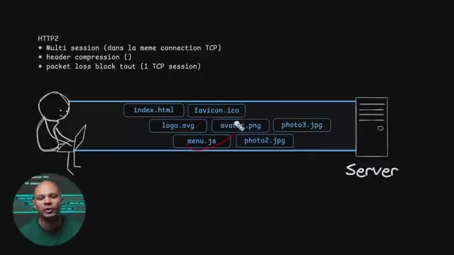
*📸 00:24:30 — Schéma explicatif sur fond noir illustrant le fonctionnement d'HTTP2 avec une seule connexion TCP multiplexée, montrant les différentes requêtes (index.html, logo.svg, menu.js, etc.) transitant en parallèle entre un client et un serveur.*

---

### ⏱️ `[00:24:38 - 00:25:13]` | Segment #59

**🔊 Audio (Transcription Intégrale Mot pour Mot en Français) :**
> HTTP 2, c'est qu'on va plus utiliser TCP. On va utiliser un protocole qui s'appelle QUIC. QUIC comme ça, juste avec un C. Et ce protocole là en fait, c'est simplement de l'UDP. Donc pour revenir sur la différence vite fait, le TCP c'est un protocole qui est très rigide, on envoie les paquets dans le bon ordre, on attend bien de faire un uncheck avant de tout envoyer etc. L'UDP c'est vraiment on s'en bat les couilles on envoie le paquet il arrive il arrive pas on s'en fout c'est pas notre problème et donc c'est beaucoup plus rapide parce qu'on n'a pas besoin de faire des on check des va et vient à chaque fois que c'est mais c'est un petit peu moins fiable donc surtout

**👁️ Analyse Visuelle d'Écran (gemini-3.5-flash-lite) :**
**Interface & Outils** : Présentation vidéo sur fond vert avec infographies schématiques de protocoles réseau.

**Contenu textuel & Code** : Schémas d'échanges de paquets (SYN, SYN/ACK, ACK, ClientHello, ServerHello) illustrant le fonctionnement de TCP et TLS.

**Action / Démonstration** : Explication théorique des différences entre les protocoles TCP et QUIC, en mettant en avant les handshakes réseau.

---

### ⏱️ `[00:25:13 - 00:25:46]` | Segment #60

**🔊 Audio (Transcription Intégrale Mot pour Mot en Français) :**
> utilisé pour des protocoles vraiment en temps réel comme par exemple si je fais une visio si je fais un appel si je perds un paquet sur dix mille ça va pas changer grand chose on va même pas voir différence mais pour une page web on veut pas qu'il ya des trous il ya des caractères qui changent dans la page web. Ou si je télécharge un fichier via HTTP, je ne veux pas qu'il y a des bits qui ne soient pas exactement ceux du fichier original. Donc QUICK, c'est un protocole qui va être par-dessus UDP ou plutôt à l'intérieur d'UDP. Donc la connexion va être en UDP simplement. Et QUICK, ça va être une encapsulation qui va nous permettre de rajouter tous les bénéfices qu'on

**👁️ Analyse Visuelle d'Écran (gemini-3.5-flash-lite) :**
**Interface & Outils** : Aucun

**Contenu textuel & Code** : Aucun

**Action / Démonstration** : Explication théorique sur la gestion de la perte de paquets selon les protocoles réseau.

---

### ⏱️ `[00:25:46 - 00:26:19]` | Segment #61

**🔊 Audio (Transcription Intégrale Mot pour Mot en Français) :**
> avait dans TCP. Donc le fait de pouvoir avoir les paquets dans le bon ordre, le fait de pouvoir renvoyer les paquets si jamais ils sont perdus etc. Et donc on a tous les avantages de TCP où là c'est solide et on a les avantages de l'UDP où on peut commencer à envoyer du trafic directement. Et HTTP3 utilise QUICK comme protocole pour pouvoir communiquer. En plus de ça, le protocole QUICK inclut déjà TLS. Ce qui fait que là quand on était en HTTP 1 ou 2, il y avait le Handshake TCP qu'on avait vu au tout début où on doit faire SYN, SYNHACK, HACK etc. Ensuite on a le Handshake

**👁️ Analyse Visuelle d'Écran (gemini-3.5-flash-lite) :**
**Interface & Outils** : Schéma interactif de type tableau blanc / mindmapping explicatif réseau.

**Contenu textuel & Code** : Diagrammes de séquence comparant les handshakes TCP/TLS (SYN, SYN/ACK, ACK, ClientHello, ServerHello, Requête, HTML) entre HTTP/1.1/2 et HTTP/3 (QUIC).

**Action / Démonstration** : Explication comparative des temps de latence et du nombre d'aller-retours nécessaires pour établir une connexion sécurisée selon la version du protocole HTTP.

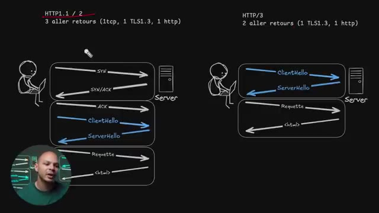
*📸 00:26:11 — Schéma comparatif en mode Picture-in-Picture montrant les flux réseau entre HTTP/1.1 / HTTP/2 (3 aller-retours) et HTTP/3 (2 aller-retours).*

---

### ⏱️ `[00:26:19 - 00:26:52]` | Segment #62

**🔊 Audio (Transcription Intégrale Mot pour Mot en Français) :**
> tls on doit faire le client hello le serveur et l'eau là et ensuite seulement on peut envoyer notre requête http et recevoir notre résultat ici ce qui fait que pour commencer à recevoir la première information du premier fichier de ma page web il fallait que je fasse trois allers-retours entre le client et le serveur et donc imaginons que je sais pas j'ai 200 millisecondes de ping parce que je suis sur une collection pas super bien en 4g ou quelque chose comme ça et ben c'est 200 millisecondes ici, 200 millisecondes ici et 200 millisecondes ici donc 600 millisecondes avant

**👁️ Analyse Visuelle d'Écran (gemini-3.5-flash-lite) :**
**Interface & Outils** : Présentation ou face-caméra sans interface informatique partagée.

**Contenu textuel & Code** : Explications orales des concepts, architectures et retours d'expérience.

**Action / Démonstration** : Démonstration pédagogique et mise en perspective technique.

---

### ⏱️ `[00:26:52 - 00:27:16]` | Segment #63

**🔊 Audio (Transcription Intégrale Mot pour Mot en Français) :**
> même de commencer à télécharger le moindre octet donc ça ralentit pas mal notre connexion alors que là avec le quick on perd pas de temps, on dirait qu'on est quick on envoie direct le client hello, le server hello parce qu'en fait on n'a pas de handshake TCP parce qu'on est en UDP donc on arrive direct avec le handshake TLS. On gagne pas mal de temps ici on passe par exemple si on avait 200 millisecondes de ping, on passerait à 400 millisecondes ici au lieu de 600 ici.

**👁️ Analyse Visuelle d'Écran (gemini-3.5-flash-lite) :**
**Interface & Outils** : Présentation ou face-caméra sans interface informatique partagée.

**Contenu textuel & Code** : Explications orales des concepts, architectures et retours d'expérience.

**Action / Démonstration** : Démonstration pédagogique et mise en perspective technique.

---

### ⏱️ `[00:27:16 - 00:27:51]` | Segment #64

**🔊 Audio (Transcription Intégrale Mot pour Mot en Français) :**
> Donc juste le fait de passer HTTP3, ça fait quand même une pas mal grosse différence pour le même site web. En plus de ça, il y a même une possibilité d'avoir ce qu'on appelle un 0RT, 0 round trip, donc 0 aller-retour pour pouvoir commencer à faire notre première requête. Parce que si on a déjà été sur notre serveur plus tôt, avec TLS 1.3, on peut garder notre clé symétrique, si on se souviens ici notre clé partagée ici on peut la garder de côté ce qui fait que même si je retourne sur un site deux jours plus tard et ben je vais pas refaire tout cet aller retour là pour pouvoir générer une clé partagée cette clé là je les gardais pendant un certain temps ce qui fait que

**👁️ Analyse Visuelle d'Écran (gemini-3.5-flash-lite) :**
**Interface & Outils** : Présentation visuelle et schéma schématique de type tableau blanc / mindmap sur les protocoles HTTP et TLS.

**Contenu textuel & Code** : Diagrammes séquentiels détaillant les échanges de paquets SYN, SYN/ACK, ACK, ClientHello, ServerHello, Requête et réponse HTML pour HTTP/1.1, HTTP/2 et HTTP/3.

**Action / Démonstration** : Explication comparative des performances réseau et de la réduction des temps de latence grâce au passage de HTTP/2 à HTTP/3.

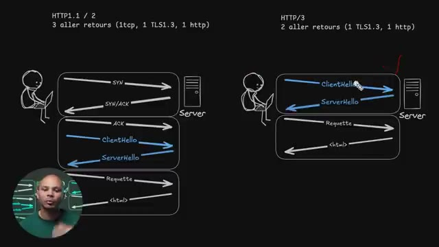
*📸 00:27:33 — Schéma comparatif en mode Picture-in-Picture montrant le nombre d'allers-retours réseau entre HTTP/1.1-HTTP/2 (3 RTT) et HTTP/3 (2 RTT).*

---

### ⏱️ `[00:27:51 - 00:28:16]` | Segment #65

**🔊 Audio (Transcription Intégrale Mot pour Mot en Français) :**
> je peux directement commencé à envoyer ma requête est directement au premier aller retour récupérer mes informations ce qui est encore beaucoup plus rapide parce que du coup on skip cette étape là et donc on est directement au premier round trip à récupérer directement des données donc encore fois on gagne beaucoup de temps pour afficher notre site. Ça c'est un des aspects du réseau qui peut être intéressant à savoir en tant que développeur. Il y a quelques autres aspects du réseau qu'il faut absolument savoir et je passe à travers en détail dans cette vidéo.

**👁️ Analyse Visuelle d'Écran (gemini-3.5-flash-lite) :**
**Interface & Outils** : Présentation visuelle en arrière-plan (schéma d'architecture réseau / flux de paquets).

**Contenu textuel & Code** : Schémas vectoriels au tableau représentant des communications client-serveur, des handshakes (TLS) et des transferts de payloads avec des indicateurs d'aller-retours.

**Action / Démonstration** : Explication technique par le créateur sur l'optimisation des temps de latence et la réduction du nombre de round trips pour accélérer le chargement des sites web.

*📸 00:28:10 — Plan face-caméra du présentateur devant un tableau noir interactif affichant un diagramme d'architecture réseau illustrant les flux de requêtes et les aller-retours (round trips).*

---

