# 🎬 La vraie différence entre une machine virtuelle et un conteneur.

> **Chaîne** : [cocadmin](https://www.youtube.com/@cocadmin)  
> **Lien YouTube** : [https://www.youtube.com/watch?v=aN4PCILrbBg](https://www.youtube.com/watch?v=aN4PCILrbBg)  
> **Date de publication** : 20260109  
> **Durée** : 00:18:17  
> **Identifiant vidéo** : `aN4PCILrbBg`  
> **Transcription & Analyse** : `whisper-v3-large-turbo+gemini-3.5-flash-lite`  

---

## 📌 Synthèse Exécutive & Outils

### 💡 Résumé
Dans cette vidéo intitulée **La vraie différence entre une machine virtuelle et un conteneur.**, cocadmin propose une immersion approfondie dans les problématiques concrètes d'infrastructure, de systèmes et d'ingénierie logicielle.

### 🛠️ Outils, Modèles & Logiciels Présentés
- **Linux & Outils Systèmes** : Administration système, automatisation et surveillance.
- **Conteneurisation & Cloud** : Déploiement et gestion d'environnements résilients.

### 🔑 Points Clés & Enseignements Stratégiques
- Maîtriser les fondamentaux réseau et système pour diagnostiquer efficacement les pannes.
- Privilégier les architectures simples et observables en environnement de production.

---

## ⏱️ Chronologie & Transcription Complète Audio & Visuelle (Mot pour Mot)

### ⏱️ `[00:00:00 - 00:00:21]` | Segment #01

**🔊 Audio (Transcription Intégrale Mot pour Mot en Français) :**
> Il n'y a pas longtemps on va poser la question c'est quoi la différence entre une machine virtuelle et un conteneur ? Comment est-ce que ça marche un peu sous le capot ? Et en fait c'est un petit peu plus compliqué que ça. Parce qu'il y a plusieurs types de machines virtuelles différentes et plusieurs types de conteneurs différents et ça se mélange un petit peu. Donc on a ce qu'on appelle parfois le bare metal, c'est-à-dire vraiment le matos, ton laptop, un serveur, un Raspberry Pi. Et on a les machines virtuelles qui font semblant d'être du matos mais qui ne le sont pas vraiment.

**👁️ Analyse Visuelle d'Écran (gemini-3.5-flash-lite) :**
**Interface & Outils** : Schémas conceptuels et illustrations graphiques d'architecture système (Docker, Bare Metal, VM).

**Contenu textuel & Code** : Concepts d'infrastructure et d'exécution : conteneurs Docker, machines virtuelles (VM) et serveurs physiques (Bare Metal).

**Action / Démonstration** : Introduction et contextualisation de la différence technologique et architecturale entre la virtualisation matérielle et la conteneurisation d'applications.

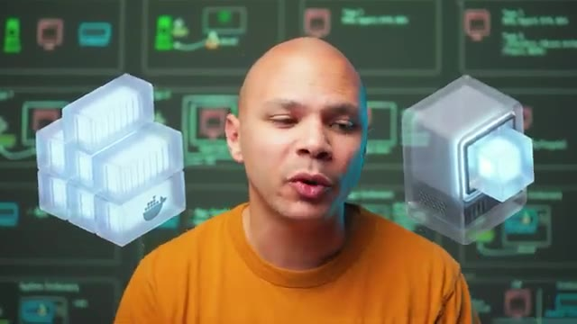
*📸 00:00:05 — Modélisation 3D d'un bloc de conteneurs avec le logo Docker (à gauche) et d'un bloc représentant une machine virtuelle (à droite) pour illustrer la conteneurisation face à la virtualisation classique.*

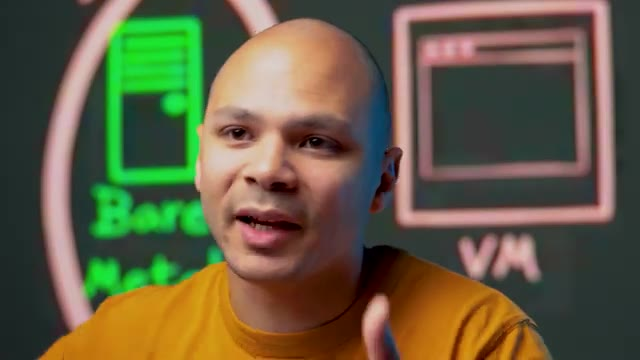
*📸 00:00:15 — Schémas d'architecture illustrant à gauche un serveur physique (« Bare Metal » en vert) et à droite une machine virtuelle (« VM » en rose).*

---

### ⏱️ `[00:00:21 - 00:00:46]` | Segment #02

**🔊 Audio (Transcription Intégrale Mot pour Mot en Français) :**
> Et on a ensuite des conteneurs qui sont complètement différents des machines virtuelles mais qui leur semblent aussi sur certains points. Donc premièrement, le bare metal, c'est simple. On a notre système d'exploitation ici, notre kernel, donc notre noyau. Et notre noyau, lui, il a directement accès au bare metal, il a directement accès aux ressources, à la mémoire, au CPU. Donc s'il veut aller écrire un fichier sur le disque, il a un driver qui lui permet de parler avec le disque d'UE et d'écrire des données à l'intérieur et de les récupérer quand il a besoin.

**👁️ Analyse Visuelle d'Écran (gemini-3.5-flash-lite) :**
**Interface & Outils** : Schéma didactique d'architecture système

**Contenu textuel & Code** : Concepts de "Bare Metal" avec illustrations de composants matériels (processeur, barrette de RAM, boîtier serveur) et du "Kernel" (symbolisé par le pingouin Tux de Linux) pointant directement vers le matériel.

**Action / Démonstration** : Explication théorique du fonctionnement du Bare Metal et de l'interaction directe entre le système d'exploitation hôte et le matériel physique.

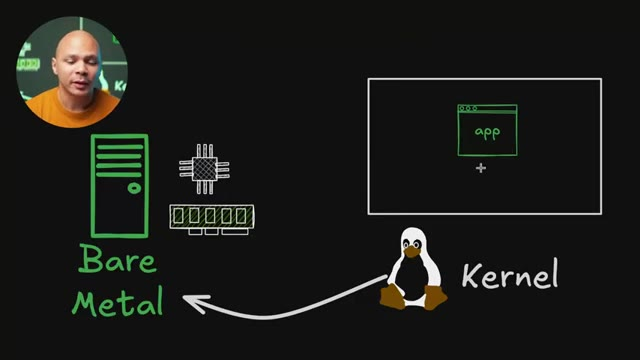
*📸 00:00:27 — Schéma conceptuel d'architecture illustrant l'accès direct d'un noyau (Kernel Linux) aux ressources physiques d'un serveur (CPU, RAM) en mode Bare Metal.*

---

### ⏱️ `[00:00:46 - 00:01:18]` | Segment #03

**🔊 Audio (Transcription Intégrale Mot pour Mot en Français) :**
> Donc notre application, ce qu'on veut faire tourner ici, ça peut être un serverware par exemple, il va parler à notre kernel, à notre système d'exploitation. Et c'est le kernel qui, de la part de notre application, va aller accéder aux ressources, va aller allouer de la mémoire dans la RAM, faire des calculs sur le CPU et aller écrire ou lire des fichiers sur le disque dur. Et donc en gros notre kernel c'est lui qui a le driver, donc c'est un programme aussi, qui permet de discuter avec les différents matériels, donc le disque dur, le CPU, la RAM, etc. La carte réseau, etc. Donc à ce niveau là, notre kernel, lui il a les performances au maximum parce qu'il accède directement au matériel et notre application,

**👁️ Analyse Visuelle d'Écran (gemini-3.5-flash-lite) :**
**Interface & Outils** : Logiciel de dessin et de présentation visuelle (type Excalidraw).

**Contenu textuel & Code** : Diagramme d'architecture système comprenant :
- Une application ("app") dans un conteneur/fenêtre virtuelle.
- Une flèche dirigée vers le "Kernel" représenté par la mascotte Tux.
- Une flèche du Kernel vers l'infrastructure "Bare Metal", illustrée par des icônes de serveur, de processeur (CPU) et de barrette de mémoire vive (RAM).

**Action / Démonstration** : Explication théorique des mécanismes d'appels système (syscalls) par lesquels une application sollicite le noyau de l'OS pour orchestrer l'allocation de mémoire et l'exécution de calculs CPU sur du matériel physique.

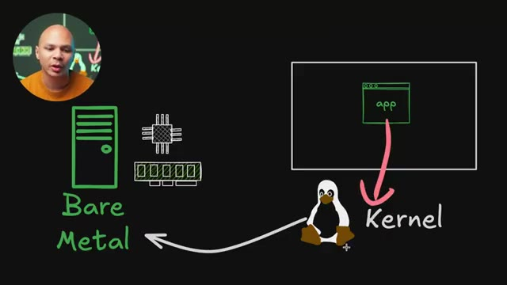
*📸 00:00:54 — Schéma conceptuel d'architecture illustrant le fonctionnement d'une application communiquant avec le noyau Linux (Kernel) pour requérir et utiliser les ressources matérielles physiques (Bare Metal : CPU, RAM, serveur).*

---

### ⏱️ `[00:01:18 - 00:01:41]` | Segment #04

**🔊 Audio (Transcription Intégrale Mot pour Mot en Français) :**
> elle a un petit peu moins de performances technique parce qu'elle doit passer par le kernel, mais le kernel est bien optimisé, il simplifie plein de choses, il abstrait toute la complexité de devoir savoir est-ce qu'on a la permission de voir ce fichier, où est ce fichier physiquement sur le disque dur, est-ce que ce fichier on est accédé il y a pas très longtemps et dans ce cas là elle va peut-être se trouver dans la RAM et donc on va pouvoir accéder plus rapidement. Il y a plein de choses qui font qu'au final notre application même si elle n'a pas accès direct au matériel elle a quand même un accès qui est très performant et jusqu'à là facile à comprendre.

**👁️ Analyse Visuelle d'Écran (gemini-3.5-flash-lite) :**
**Interface & Outils** : Schéma d'architecture système explicatif en arrière-plan (tableau virtuel).

**Contenu textuel & Code** : Diagramme conceptuel présentant les blocs :
- "app" (Espace utilisateur / User space)
- "Kernel" (Noyau Linux / Système d'exploitation)
- "Bare Metal" (Matériel physique : CPU, RAM, Stockage)

**Action / Démonstration** : Explication du rôle d'intermédiaire et d'abstraction du noyau Linux (Kernel) qui, bien qu'introduisant une légère baisse de performance due aux transitions de contexte, simplifie la gestion du matériel (permissions, accès disque, allocation mémoire) pour les applications.

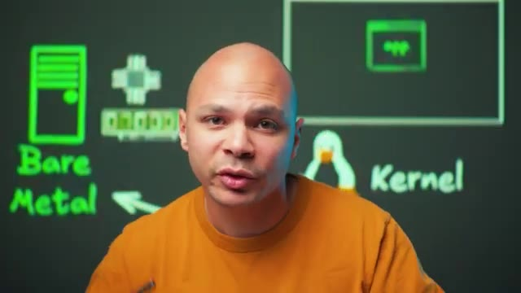
*📸 00:01:29 — Schéma d'architecture système illustrant l'abstraction entre l'application ("app"), le noyau Linux ("Kernel" représenté par Tux) et le matériel physique ("Bare Metal" représenté par un processeur, de la mémoire et un serveur).*

---

### ⏱️ `[00:01:41 - 00:02:15]` | Segment #05

**🔊 Audio (Transcription Intégrale Mot pour Mot en Français) :**
> Maintenant on a les machines virtuelles. Elles vont fonctionner grâce à un hyperviseur, en gros c'est un programme qui va faire semblant que c'est une machine physique et donc comme ça on va pouvoir lancer un nouvel OS qui va croire qu'il est dans une machine physique mais en fait il parle avec l'hyperviseur. Et l'hyperviseur lui ensuite va faire les actions de la part de la machine virtuelle. Mais on a deux types d'hyperviseurs. On a les hyperviseurs de type 1 par exemple ESXi de VMware, Hyper-V de Microsoft, KVM ou même Xen. Et on a ici les hyperviseurs de type 2 et les exemples ce serait VirtualBox, VMware mais Workstation ou Fusion sur Mac ou alors QMU. Donc pourquoi on

**👁️ Analyse Visuelle d'Écran (gemini-3.5-flash-lite) :**
**Interface & Outils** : Tableau blanc numérique / Support de présentation d'architecture système.

**Contenu textuel & Code** : - Classification des hyperviseurs :
  - Type 1 (Bare Metal) : ESX, HyperV, KVM, XEN
  - Type 2 (Hosted) : Virtualbox, VMware Workstation/Fusion, QEMU
- Illustration d'une machine virtuelle (VM)

**Action / Démonstration** : Explication théorique et comparaison des deux grandes familles d'hyperviseurs (Type 1 s'exécutant directement sur le matériel physique vs Type 2 s'exécutant par-dessus un système d'exploitation hôte).

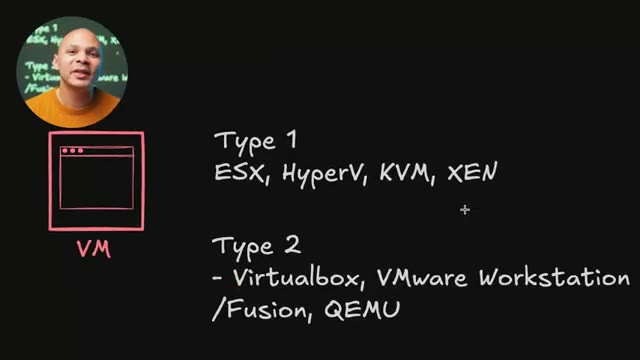
*📸 00:02:06 — Schéma d'architecture de virtualisation listant de manière claire la classification des hyperviseurs de Type 1 (ESX, HyperV, KVM, XEN) et de Type 2 (Virtualbox, VMware Workstation/Fusion, QEMU).*

---

### ⏱️ `[00:02:15 - 00:02:45]` | Segment #06

**🔊 Audio (Transcription Intégrale Mot pour Mot en Français) :**
> c'est parce qu'en fait un hyperviseur de type 1 va tourner directement au même niveau qu'un kernel. Il est comme intégré au kernel, c'est lui le kernel. Et donc l'hyperviseur lui-même a accès aux ressources, il peut allouer la mémoire, il peut parler au CPU, etc. Ce qui fait que notre application, elle est ici, elle parle à l'OS qui est dans la machine virtuelle. L'OS il croit qu'il est sur une machine physique mais en fait il parle à l'hyperviseur. Quand il écrit dans un fichier dans un disque dur, il pense qu'il écrit vraiment dans un vrai disque. En fait c'est l'hyperviseur qui récupère cette requête et qui vient la faire ensuite sur le vrai matos.

**👁️ Analyse Visuelle d'Écran (gemini-3.5-flash-lite) :**
**Interface & Outils** : Présentation ou face-caméra sans interface informatique partagée.

**Contenu textuel & Code** : Explications orales des concepts, architectures et retours d'expérience.

**Action / Démonstration** : Démonstration pédagogique et mise en perspective technique.

---

### ⏱️ `[00:02:45 - 00:03:20]` | Segment #07

**🔊 Audio (Transcription Intégrale Mot pour Mot en Français) :**
> Donc on voit ici qu'on a une petite perte de performance parce qu'on passe de notre application à l'OS dans la machine virtuelle et dans la machine virtuelle à l'hyperviseur et de l'hyperviseur au matériel. Donc on a quelques sauts comme ça et à chaque fois qu'on a un saut évidemment on perd un peu de performance. Les hyperviseurs de type 1 c'est ceux qui sont les plus performants et c'est souvent des OS dédiés. Comme par exemple quand on a ESXi c'est pas vraiment un OS sur lequel on peut se loguer, aller lancer un navigateur par exemple. Mais tout à l'heure j'ai dit que Hyper-V c'était un hyperviseur de type 1 alors que Hyper-V tourne sur Windows Desktop. En fait ce qui se passe quand on active Hyper-V sur Windows, ce qu'il va faire, c'est qu'il va prendre votre OS actuel qui est installé directement sur le hardware et il va créer une machine virtuelle. Et donc comme

**👁️ Analyse Visuelle d'Écran (gemini-3.5-flash-lite) :**
**Interface & Outils** : Présentation ou face-caméra sans interface informatique partagée.

**Contenu textuel & Code** : Explications orales des concepts, architectures et retours d'expérience.

**Action / Démonstration** : Démonstration pédagogique et mise en perspective technique.

---

### ⏱️ `[00:03:20 - 00:03:53]` | Segment #08

**🔊 Audio (Transcription Intégrale Mot pour Mot en Français) :**
> il y a des bonnes performances, on ne se rend pas vraiment compte mais parfois il y a des choses qui vont plus fonctionner, on va plus se rendre compte. Peut-être parfois il y a certains jeux qui ont pu marcher ou certaines applications qui vont plus marcher parce qu'elles s'attendaient à parler à du matos directement. Et là en fait ta machine que tu utilises, même si tu vois l'écran, les applications, ton naviguer et tout, en fait tu es dans une machine virtuelle. Et donc quand tu vas démarrer d'autres machines virtuelles, elles sont au même niveau que ton OS que tu utilises, ton Windows que tu utilises pour faire tourner des applications. Et donc comme elles ne passent pas à travers ton OS, elles ont un accès un peu plus direct au matériel et donc tu as des bonnes performances. Donc dans ces hyper-revisors là, il y a très très peu de pertes de performance,

**👁️ Analyse Visuelle d'Écran (gemini-3.5-flash-lite) :**
**Interface & Outils** : Tableau blanc interactif / Schéma d'architecture système.

**Contenu textuel & Code** : Diagramme d'architecture contenant :
- L'annotation "Type 1"
- Un bloc principal "Hyperviseur" englobant une machine virtuelle ("VM")
- Des icônes de composants matériels physiques (processeur et barrette de mémoire RAM)
- Des vecteurs (flèches) représentant l'intermédiation de l'hyperviseur entre la VM et le matériel physique.

**Action / Démonstration** : Explication technique des mécanismes de virtualisation matérielle, détaillant pourquoi certaines applications ou jeux optimisés pour le "bare-metal" échouent ou perdent en performance lorsqu'ils tentent d'accéder directement au matériel physique sans passer par l'abstraction de l'hyperviseur.

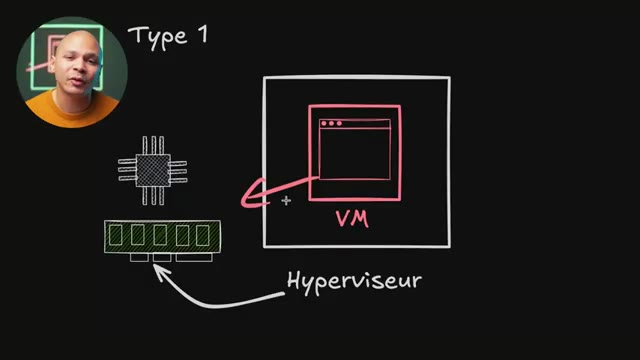
*📸 00:03:28 — Schéma conceptuel d'une architecture de virtualisation de Type 1 (bare-metal) illustrant les interactions et limitations d'accès direct d'une machine virtuelle (VM) aux composants matériels physiques (CPU, RAM).*

---

### ⏱️ `[00:03:53 - 00:04:27]` | Segment #09

**🔊 Audio (Transcription Intégrale Mot pour Mot en Français) :**
> c'est vraiment quelques pourcents. C'est à dire que si je faisais tourner un programme nativement et un programme dans une machine virtuelle et que je faisais un benchmark de CPU, si le benchmark sur le bare metal il fait 100 points, et bah la VM ferait 97 points. Donc c'est vraiment presque pareil. C'est le neuf le plus pourri que tu as jamais vu. Voilà. Là où tu as le plus de pertes de performance potentielle, c'est quand ton programme, il veut accéder par exemple aux disques durs ou il veut accéder à sa carte réseau parce qu'en fait son disque dur et sa carte réseau n'existent pas. Donc c'est des cartes réseau et des disques durs, des périphériques virtuels. Périphériques virtuels, ça veut dire que c'est un programme qui tourne, que l'hyperviseur fait tourner et donc c'est

**👁️ Analyse Visuelle d'Écran (gemini-3.5-flash-lite) :**
**Interface & Outils** : Présentation ou face-caméra sans interface informatique partagée.

**Contenu textuel & Code** : Explications orales des concepts, architectures et retours d'expérience.

**Action / Démonstration** : Démonstration pédagogique et mise en perspective technique.

---

### ⏱️ `[00:04:27 - 00:04:54]` | Segment #10

**🔊 Audio (Transcription Intégrale Mot pour Mot en Français) :**
> du code. Et ce code-là, il ne sera jamais aussi optimisé qu'une vraie puce de carte réseau ou qu'un vrai contrôleur de SSD par exemple. Et donc là par contre, on a beaucoup plus de pertes de performance et ça peut vraiment varier. On peut perdre peut-être juste 5-10%, mais on peut perdre aussi 50-70%. Au passage aussi, en termes de sécurité, c'est extrêmement difficile depuis une application dans une machine virtuelle de sortir et donc d'aller par exemple parler à une autre machine virtuelle ou aller chercher des fichiers qui sont dans l'hyperviseur.

**👁️ Analyse Visuelle d'Écran (gemini-3.5-flash-lite) :**
**Interface & Outils** : Tableau blanc numérique / Schéma d'architecture système

**Contenu textuel & Code** : Diagramme d'architecture contenant les annotations « Type 1 », « VM », « Hyperviseur », ainsi que des illustrations d'un processeur (CPU) et d'une barrette de mémoire (RAM).

**Action / Démonstration** : Analyse et explication de la perte de performance (overhead) induite par la couche de virtualisation de l'hyperviseur par rapport à un accès matériel direct.

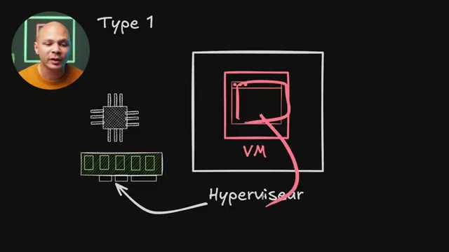
*📸 00:04:47 — Schéma explicatif d'un hyperviseur de Type 1 montrant l'interaction entre une machine virtuelle (VM), la couche hyperviseur et les composants matériels (processeur et RAM).*

---

### ⏱️ `[00:04:54 - 00:05:14]` | Segment #11

**🔊 Audio (Transcription Intégrale Mot pour Mot en Français) :**
> C'est extrêmement difficile parce que ça fait 30 ans qu'on utilise ces technologies et que c'est ultra rare que maintenant il y a des failles dans les hyperviseurs. Et quand ça arrive, c'est vraiment assez grave. Tous les hébergeurs, tous les fournisseurs de cloud utilisent des hyperviseurs et donc si tu as un client qui peut sortir et aller dans la machine de l'autre client, c'est un peu une catastrophe. Mais quand ça arrive, ce qui est très très rare. La plupart du temps, ça vient justement de ces programmes-là parce qu'en fait, on émule du matériel.

**👁️ Analyse Visuelle d'Écran (gemini-3.5-flash-lite) :**
**Interface & Outils** : Tableau blanc numérique de présentation d'architecture système.

**Contenu textuel & Code** : Schéma avec les composants :
- CPU (processeur) et RAM (mémoire physique)
- Bloc d'un hyperviseur de "Type 1" avec une flèche pointant vers le matériel physique
- Bloc interne représentant une machine virtuelle (VM)

**Action / Démonstration** : Explication du fonctionnement des hyperviseurs de Type 1 et de l'isolation des machines virtuelles vis-à-vis du matériel, dans le cadre d'une analyse sur la criticité des failles de sécurité de type "VM Escape" (évasion de machine virtuelle).

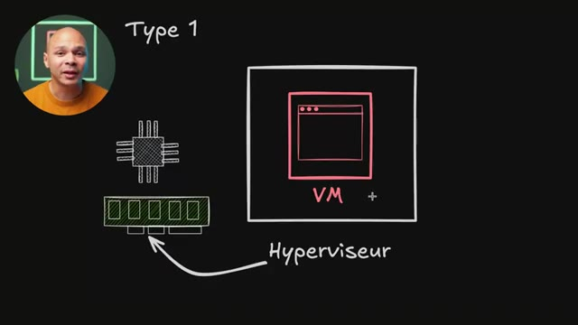
*📸 00:05:09 — Schéma d'architecture d'un hyperviseur de Type 1 (Bare Metal) illustrant l'accès direct du système de virtualisation aux ressources physiques (CPU, RAM) pour exécuter une machine virtuelle (VM).*

---

### ⏱️ `[00:05:15 - 00:05:36]` | Segment #12

**🔊 Audio (Transcription Intégrale Mot pour Mot en Français) :**
> Et donc, depuis l'intérieur, on peut communiquer avec notre matériel, mais on peut le faire d'une manière qui va faire bugger le programme parce que c'est un programme. Et donc, potentiellement, si on arrive à faire bugger ce programme, comme ce programme, il tourne sur l'hyperviseur, et bien potentiellement, on peut accéder à des données qui sont sur l'hyperviseur. Mais comme je te disais, déjà ultra rare, les VM, c'est ce qu'il y a de plus sécurisé pour pouvoir encapsuler une application sans qu'elle puisse jamais parler à une autre application sur la même machine physique.

**👁️ Analyse Visuelle d'Écran (gemini-3.5-flash-lite) :**
**Interface & Outils** : Non applicable

**Contenu textuel & Code** : Non applicable

**Action / Démonstration** : Non applicable

---

### ⏱️ `[00:05:36 - 00:06:08]` | Segment #13

**🔊 Audio (Transcription Intégrale Mot pour Mot en Français) :**
> Maintenant il y a les hyperviseurs de type 2. C'est ce qu'on utilise plus sur nos machines desktop, sur ton ordi, chez toi pour pouvoir faire des tests. Tu vas avoir ton application qui parle à l'OS qui est dans la machine virtuelle. Et l'OS de la machine virtuelle, il parle à son matériel qui est en fait soit des périphériques virtualisées, soit directement à l'hyperviseur. Et l'hyperviseur lui c'est une simple application au niveau de ton OS principal. Et donc il doit parler avec ton OS qui lui ensuite va accéder au matériel. Donc en fait tu as une couche en plus où l'appli parle à son OS et l'OS parle à l'hyperviseur. L'hyperviseur parle à lui-même son OS, et ensuite on arrive dans le matériel.

**👁️ Analyse Visuelle d'Écran (gemini-3.5-flash-lite) :**
**Interface & Outils** : Outil de dessin et d'annotation de diagramme d'architecture.

**Contenu textuel & Code** : - Représentations graphiques du matériel (CPU, RAM) à gauche.
- Flèche pointant de l'OS (Système d'exploitation hôte) vers le matériel physique.
- Blocs d'encapsulation illustrant la hiérarchie : OS hôte -> Hyperviseur (Type 2) -> Machine Virtuelle (VM) -> Application.

**Action / Démonstration** : Explication théorique de la virtualisation de Type 2 (ex: VirtualBox, VMware Workstation) où l'hyperviseur s'exécute comme une application sur un système d'exploitation hôte standard pour gérer les machines virtuelles et leurs périphériques virtualisés.

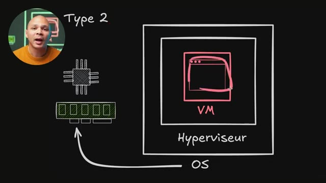
*📸 00:05:44 — Schéma d'architecture conceptuel d'un hyperviseur de Type 2 (hébergé) mettant en évidence l'empilement des couches logicielles au-dessus du matériel physique (CPU/RAM).*

---

### ⏱️ `[00:06:08 - 00:06:27]` | Segment #14

**🔊 Audio (Transcription Intégrale Mot pour Mot en Français) :**
> Donc on a une un petit peu plus grosse paire de performances. Par contre, c'est beaucoup plus facile à installer parce que c'est une simple application. Et comme on est sur une machine desktop où on va démarrer 50 000 machines virtuelles, en général, ça ne pose pas vraiment de problème. Maintenant, comme je l'ai dit tout à l'heure, il y a plusieurs types de machines virtuelles. Donc là jusqu'à présent, je parlais des machines virtuelles classiques où la machine virtuelle, elle a un OS, l'OS démarre les applications, etc.

**👁️ Analyse Visuelle d'Écran (gemini-3.5-flash-lite) :**
**Interface & Outils** : Présentation ou face-caméra sans interface informatique partagée.

**Contenu textuel & Code** : Explications orales des concepts, architectures et retours d'expérience.

**Action / Démonstration** : Démonstration pédagogique et mise en perspective technique.

---

### ⏱️ `[00:06:27 - 00:06:46]` | Segment #15

**🔊 Audio (Transcription Intégrale Mot pour Mot en Français) :**
> Mais il y a un autre type qui s'appelle les micro-VM. Ça, c'est le signe mu pour micro, pour ceux qui ont dormi en cours de physique comme moi. Et dans une micro VM, c'est le même concept qu'une machine virtuelle classique, sauf qu'on enlève tout ce qui n'est absolument pas essentiel pour faire fonctionner juste notre application. Donc ça veut dire que le BIOS, il n'y en a pas. Les drivers pour les périphériques USB, il n'y en a pas.

**👁️ Analyse Visuelle d'Écran (gemini-3.5-flash-lite) :**
**Interface & Outils** : Tableau blanc numérique d'illustration d'architecture système.

**Contenu textuel & Code** : Schéma d'architecture matérielle et logicielle représentant :
- Les ressources physiques : processeur (CPU) et barrette de mémoire vive (RAM).
- Une couche d'abstraction de type Hyperviseur.
- Une bulle applicative isolée symbolisant la micro-VM (notée µM).
- Une liste d'éléments d'un système d'exploitation classique rayés pour indiquer leur absence : BIOS, USB, GPU, SystemD, Windows.

**Action / Démonstration** : Explication conceptuelle du fonctionnement d'une micro-VM (µVM) par rapport à une machine virtuelle traditionnelle, en démontrant visuellement l'élimination de toutes les couches logicielles, pilotes et systèmes d'initialisation non indispensables au strict fonctionnement de l'application cible.

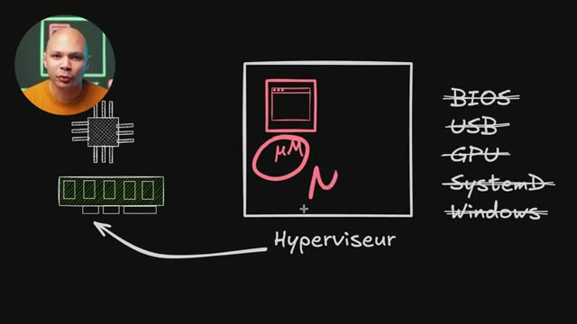
*📸 00:06:32 — Schéma d'architecture d'une micro-VM (notée µM) s'exécutant sur un hyperviseur, illustrant le retrait des composants non essentiels (BIOS, USB, GPU, SystemD, Windows) pour optimiser les ressources matérielles (CPU, RAM).*

---

### ⏱️ `[00:06:46 - 00:07:06]` | Segment #16

**🔊 Audio (Transcription Intégrale Mot pour Mot en Français) :**
> La prise en compte du PCI Express pour avoir des GPU ou des cartes réseau ou d'autres cartes de je ne sais pas quoi, boum, ça on oublie aussi, il n'y en a pas. Et au lieu de booter tout un OS et donc d'avoir un outil comme par exemple SystemD qui va démarrer tous les programmes pour que mon OS fonctionne, il n'y en a pas aussi. On va démarrer juste un seul programme. Ce programme, il aura toutes ses librairies déjà impactées à l'intérieur pour qu'il puisse fonctionner et il n'y aura rien d'autre.

**👁️ Analyse Visuelle d'Écran (gemini-3.5-flash-lite) :**
**Interface & Outils** : Tableau blanc numérique / Schéma d'architecture.

**Contenu textuel & Code** : - Représentations de CPU et de mémoire RAM reliés à un bloc "Hyperviseur" contenant une microVM ("µM").
- Liste de composants et d'OS barrés ou entourés en rouge : BIOS, USB, GPU, SystemD, Windows.

**Action / Démonstration** : Analyse conceptuelle de la réduction de la surface d'émulation dans les technologies de micro-virtualisation (comme AWS Firecracker), démontrant la suppression du support PCI/GPU et des systèmes d'initialisation classiques (SystemD) au profit d'un démarrage direct et minimaliste.

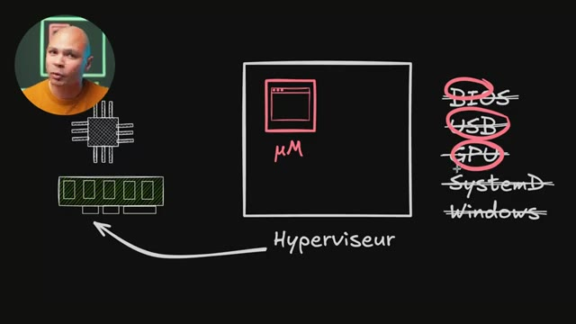
*📸 00:06:51 — Schéma explicatif d'un hyperviseur de microVMs illustrant la suppression des composants matériels et logiciels superflus (BIOS, USB, GPU, SystemD, Windows) pour minimiser l'empreinte et le temps de démarrage.*

---

### ⏱️ `[00:07:06 - 00:07:26]` | Segment #17

**🔊 Audio (Transcription Intégrale Mot pour Mot en Français) :**
> Et le support de Windows aussi, on oublie. C'est des machines virtuelles qui peuvent marcher que sur Linux. Et donc, on a le carnet Linux, minifié au minimum avec on enlève tout ce qui ne sert à rien, et notre application qui impacte directement tout ce qu'elle a besoin pour pouvoir fonctionner. L'avantage de ça, c'est qu'on garde l'isolation qui est très très forte des machines virtuelles. Donc, ça veut dire que notre application qui est là dans ma micro VM, c'est quasi impossible qu'elle puisse sortir pour faire autre chose sur ma machine haute.

**👁️ Analyse Visuelle d'Écran (gemini-3.5-flash-lite) :**
**Interface & Outils** : Tableau blanc numérique d'architecture système avec incrustation vidéo du présentateur.

**Contenu textuel & Code** : - Représentation schématique d'un CPU et d'une barrette de RAM.
- Bloc d'un hyperviseur lié aux ressources matérielles.
- Une microVM (notée "μVM") exécutée par l'hyperviseur.
- Liste de composants et fonctionnalités désactivés ou absents (barrés) : BIOS, USB, GPU, SystemD, Windows.

**Action / Démonstration** : Explication de la structure d'une microVM (de type Firecracker) qui utilise un noyau Linux minimaliste ("minifié au minimum") et s'affranchit des couches classiques d'une machine virtuelle traditionnelle pour ne conserver que l'isolation stricte et l'application.

*📸 00:07:21 — Schéma explicatif d'une architecture de micro-machine virtuelle (microVM ou μVM) s'exécutant sur un hyperviseur, illustrant l'exclusion des composants non essentiels (BIOS, USB, GPU, SystemD, Windows) pour réduire la surface d'attaque et optimiser le démarrage du noyau Linux minifié.*

---

### ⏱️ `[00:07:26 - 00:07:50]` | Segment #18

**🔊 Audio (Transcription Intégrale Mot pour Mot en Français) :**
> Mais on a l'avantage d'être ultra léger, de peser pas beaucoup parce qu'une image de machine virtuelle, ça fait facile 5, 10 gigas, alors qu'une image de micro VM, il n'y a presque rien dedans, ça peut faire juste quelques mégas. Ça démarre aussi très très rapidement parce qu'il n'y a rien à démarrer, il n'y a rien à abouter, il n'y a pas de différents programmes à démarrer dans mon OS, il y a juste un seul programme. Et comme je n'ai pas d'OS à démarrer, je consomme aussi moins de RAM, il n'y a que mon application qui va utiliser de la mémoire vive, et donc c'est aussi mieux optimisé à ce niveau-là.

**👁️ Analyse Visuelle d'Écran (gemini-3.5-flash-lite) :**
**Interface & Outils** : Schéma d'architecture conceptuel et système présenté sur un tableau numérique en arrière-plan.

**Contenu textuel & Code** : Icônes de CPU, de barrette de RAM, boîte englobante de machine virtuelle, mention « µVM » (micro VM), et liste d'éléments épurés ou désactivés : BIOS, USB, GPU, SystemD, Windows.

**Action / Démonstration** : Comparaison technique de la légèreté et de la vitesse de boot des micro VMs par rapport aux machines virtuelles traditionnelles, en expliquant la suppression de l'émulation des périphériques non indispensables.

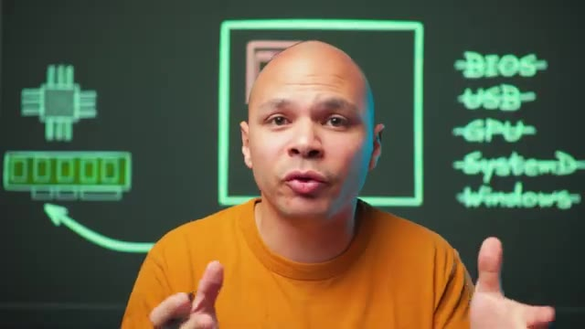
*📸 00:07:32 — Schéma explicatif en arrière-plan détaillant l'absence de composants et d'initialisations lourdes (BIOS, USB, GPU, SystemD, Windows barrés) dans l'architecture d'une micro VM comparée à une VM classique.*

*📸 00:07:38 — Plan resserré mettant en évidence le schéma d'une micro VM (notée µVM) et l'allocation minimale des ressources CPU et RAM.*

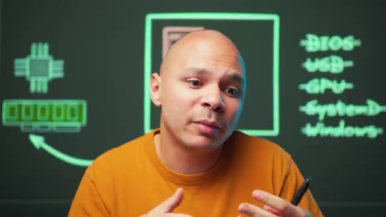
*📸 00:07:44 — Visualisation des optimisations de démarrage d'une micro VM, illustrant la suppression des couches d'émulation matérielle non essentielles (BIOS, USB, GPU) et logicielles (SystemD, Windows).*

---

### ⏱️ `[00:07:50 - 00:08:09]` | Segment #19

**🔊 Audio (Transcription Intégrale Mot pour Mot en Français) :**
> Je ne sais pas s'il y a d'autres fournisseurs de cloud qui utilisent ce concept de micro VM, très probablement. Et donc les outils principaux, l'hyperviseur les plus connus pour pouvoir lancer des micro-VM, c'est Firecracker qui a été développé par AWS. Et donc ils l'utilisent en interne pour Lambda, qui est leur service de serverless, et pour Fargate, qui est leur service de conteneur à ce service.

**👁️ Analyse Visuelle d'Écran (gemini-3.5-flash-lite) :**
**Interface & Outils** : Support de présentation visuelle (type tableau noir numérique) avec incrustation webcam de l'intervenant.

**Contenu textuel & Code** : - Schéma d'une fenêtre système étiquetée « μVM » (Micro-VM).
- Mentions textuelles des technologies clés : « Firecracker (Lambda/Fargate) » et « Katacontainer » (Kata Containers).

**Action / Démonstration** : Présentation et contextualisation des hyperviseurs de micro-VMs, en expliquant le rôle de Firecracker au sein de l'infrastructure AWS (pour Lambda et ECS Fargate) et en introduisant l'alternative Kata Containers.

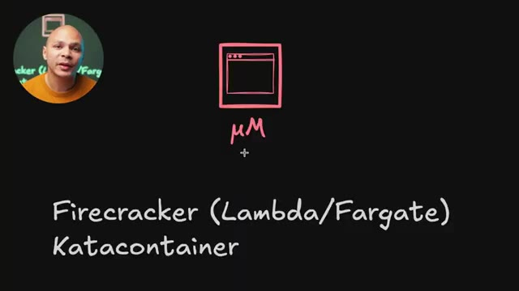
*📸 00:07:55 — Présentation schématique sur tableau blanc virtuel des technologies de micro-machines virtuelles (μVM) associées aux environnements de conteneurs et de serverless.*

---

### ⏱️ `[00:08:09 - 00:08:29]` | Segment #20

**🔊 Audio (Transcription Intégrale Mot pour Mot en Français) :**
> Donc avec Lambda, je peux juste leur donner une fonction, par exemple une fonction en Python qui fait quelque chose. Et eux, ils vont pouvoir démarrer une micro-VM. Dans cette micro-VM, ils ont mon programme en Python. Mon programme en Python, il y a très peu de chances qu'ils puissent sortir de la micro-VM pour faire autre chose, aller potentiellement voler des données à d'autres clients, des choses comme ça. Et c'est très léger parce que j'ai juste mon programme en Python qui tourne dedans.

**👁️ Analyse Visuelle d'Écran (gemini-3.5-flash-lite) :**
**Interface & Outils** : Présentation ou face-caméra sans interface informatique partagée.

**Contenu textuel & Code** : Explications orales des concepts, architectures et retours d'expérience.

**Action / Démonstration** : Démonstration pédagogique et mise en perspective technique.

---

### ⏱️ `[00:08:29 - 00:08:52]` | Segment #21

**🔊 Audio (Transcription Intégrale Mot pour Mot en Français) :**
> Je n'ai pas d'OS, donc ils peuvent le démarrer très très rapidement. Ça ne prend pas beaucoup de temps pour pouvoir les stocker, les télécharger. Et donc, ils peuvent en avoir plein sur la même machine physique et donc mettre plein de clients sur la même machine. Et quand il n'y a plus de place sur la machine, ils peuvent enlever un client qui n'est pas trop trop utilisé et remettre un autre à la place. Et puis, ils remettent l'autre à un client si jamais il y a une requête qui vient d'arriver. Parce que comme c'est très très rapide à démarrer, au moment où ils reçoivent la requête, ils peuvent remettre la fonction directement.

**👁️ Analyse Visuelle d'Écran (gemini-3.5-flash-lite) :**
**Interface & Outils** : Présentation ou face-caméra sans interface informatique partagée.

**Contenu textuel & Code** : Explications orales des concepts, architectures et retours d'expérience.

**Action / Démonstration** : Démonstration pédagogique et mise en perspective technique.

---

### ⏱️ `[00:08:52 - 00:09:13]` | Segment #22

**🔊 Audio (Transcription Intégrale Mot pour Mot en Français) :**
> Et Fargate, c'est leur service de conteneur à service. Donc, on peut leur donner une image d'un conteneur, une image Docker, par exemple, qu'on a créée, et ils vont l'exécuter. Mais comme on va voir juste après, les conteneurs, c'est un petit peu moins sécurisé que les machines virtuelles pour pouvoir sortir dedans. Donc, ce qu'ils font, c'est que ce conteneur, ils le font tourner dans une micro-VM. Et donc, du coup, ils n'ont pas l'avantage de pouvoir utiliser tout l'écosystème des conteneurs, d'utiliser une image Docker, etc.

**👁️ Analyse Visuelle d'Écran (gemini-3.5-flash-lite) :**
**Interface & Outils** : Tableau blanc virtuel de présentation d'architecture logicielle

**Contenu textuel & Code** : - Schémas dessinés d'une machine virtuelle (µVM) et d'un conteneur
- Mentions textuelles : "Firecracker (Lambda/Fargate)" et "Katacontainer"

**Action / Démonstration** : Explication théorique sur la sécurité des conteneurs et l'utilisation de micro-machines virtuelles (µVM) comme Firecracker par AWS (Fargate/Lambda) pour isoler les conteneurs de manière plus sécurisée qu'un cloisonnement standard.

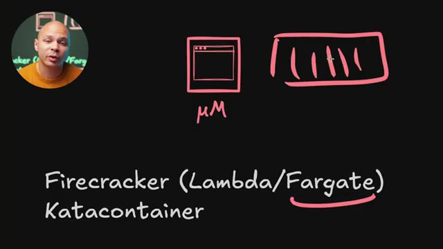
*📸 00:09:03 — Schéma explicatif illustrant une micro-VM (µVM) à côté d'un conteneur traditionnel, associé aux mentions de Firecracker (Lambda/Fargate) et Katacontainer.*

---

### ⏱️ `[00:09:13 - 00:09:36]` | Segment #23

**🔊 Audio (Transcription Intégrale Mot pour Mot en Français) :**
> Que ce soit rapide à démarrer, que ce soit performant, mais que ce soit sécurisé aussi et qu'on puisse jamais sortir et puis aller faire autre chose sur la machine. Et il y a un autre outil aussi qui s'appelle KataContainer, qui est un peu bizarre dans ce sens parce qu'on voit ici Container, donc on se dit, c'est des containers du coup, est-ce que tu nous mens ? Et en fait, c'est un projet qui permet justement, comme dans Fargate, de pouvoir démarrer des conteneurs dans des micro-VM.

**👁️ Analyse Visuelle d'Écran (gemini-3.5-flash-lite) :**
**Interface & Outils** : Présentation ou face-caméra sans interface informatique partagée.

**Contenu textuel & Code** : Explications orales des concepts, architectures et retours d'expérience.

**Action / Démonstration** : Démonstration pédagogique et mise en perspective technique.

---

### ⏱️ `[00:09:36 - 00:09:55]` | Segment #24

**🔊 Audio (Transcription Intégrale Mot pour Mot en Français) :**
> Ensuite, on vient enfin aux conteneurs. Donc, pareil, il y a deux types de conteneurs différents. Il y a ce qu'on appelle les AppContainer, donc les containers pour applications, qui sont les conteneurs les plus populaires, ce programme que tu as déjà entendu parler jusqu'à présent. Et on a aussi les systèmes containers. Ça, c'est un autre type de conteneur qui est un peu moins connu, mais qui a son utilité aussi.

**👁️ Analyse Visuelle d'Écran (gemini-3.5-flash-lite) :**
**Interface & Outils** : Support de présentation visuelle de type tableau noir numérique.

**Contenu textuel & Code** : - Schéma d'un bloc de conteneurisation légendé "Conteneur".
- Liste textuelle comparative distinguant :
  - App Containers
  - System Containers

**Action / Démonstration** : Explication théorique et classification des types de conteneurs pour clarifier la différence entre la conteneurisation orientée application (type Docker) et celle orientée système (type LXC/LXD).

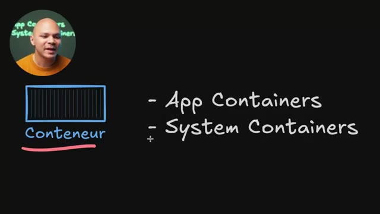
*📸 00:09:51 — Schéma conceptuel sur tableau blanc présentant les deux grandes catégories de conteneurs : "App Containers" (conteneurs d'application) et "System Containers" (conteneurs système).*

---

### ⏱️ `[00:09:56 - 00:10:16]` | Segment #25

**🔊 Audio (Transcription Intégrale Mot pour Mot en Français) :**
> Donc les outils qui nous permettent de lancer des conteneurs s'appellent des runtime. Et le plus populaire, c'est Docker. Quand on pense conteneur, on pense aussi beaucoup à Kubernetes. Mais Kubernetes, ce n'est pas un runtime, c'est un orchestrateur. Et donc Kubernetes peut utiliser un runtime. Donc Kubernetes va utiliser un nouveau programme, un runtime, pour pouvoir arrêter, lancer, déplacer des conteneurs. Et pendant un moment Kubernetes utilisait Docker en tant que runtime.

**👁️ Analyse Visuelle d'Écran (gemini-3.5-flash-lite) :**
**Interface & Outils** : Schéma d'architecture technique incrusté en arrière-plan.

**Contenu textuel & Code** : Liste de technologies de conteneurisation et d'orchestration : "docker", "kubernetes", "containerD", "podman", "CRI-O", "App Containers", avec des représentations graphiques de processeur (CPU) et de barrette de mémoire (RAM).

**Action / Démonstration** : Explication de la distinction fondamentale entre un orchestrateur (Kubernetes) et les runtimes de conteneurs (Docker, containerd, CRI-O), détaillant comment ils exploitent les ressources physiques de la machine.

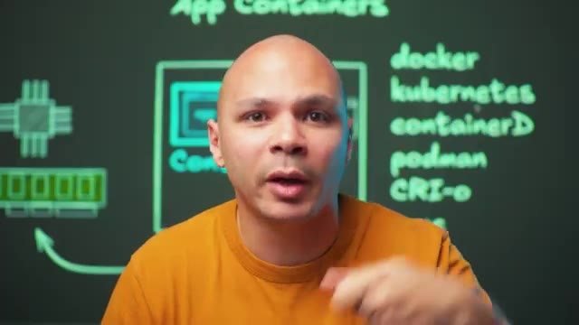
*📸 00:10:11 — Schéma conceptuel en arrière-plan illustrant l'écosystème des conteneurs (Docker, Kubernetes, containerd, Podman, CRI-O) en relation avec les composants matériels (CPU, RAM).*

---

### ⏱️ `[00:10:16 - 00:10:38]` | Segment #26

**🔊 Audio (Transcription Intégrale Mot pour Mot en Français) :**
> Et maintenant en fonction de la distribution Kubernetes que tu utilises, ça va utiliser ContainerD ou Creo ou d'autres runtime. On peut même techniquement utiliser KVM en tant que runtime pour Kubernetes. Et donc au lieu de lancer des containers, ça va lancer des machines virtuelles. Donc ContainerD, c'est je pense le plus populaire des runtime pour pouvoir lancer des containers.

**👁️ Analyse Visuelle d'Écran (gemini-3.5-flash-lite) :**
**Interface & Outils** : Tableau blanc virtuel de présentation d'architecture.

**Contenu textuel & Code** : Schéma "App Containers", "Conteneur", "Kernel", icônes symbolisant le processeur et la mémoire RAM, et liste textuelle : docker, kubernetes, containerD, podman, CRI-o, runc, crun.

**Action / Démonstration** : Analyse comparative et explicative des runtimes de conteneurs (ContainerD, CRI-O, runc) compatibles et utilisables sous Kubernetes.

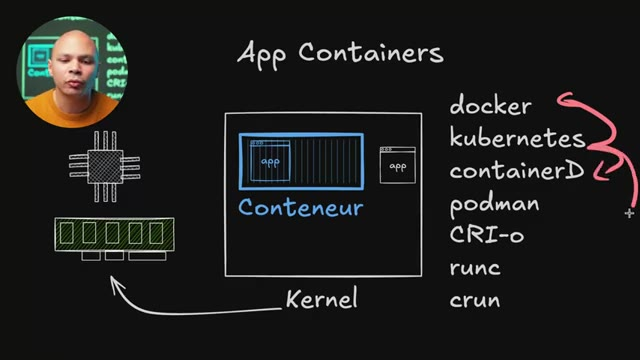
*📸 00:10:22 — Schéma technique illustrant l'architecture d'un conteneur applicatif ("App Containers") lié au Kernel (CPU/RAM) avec une liste ordonnée des runtimes et outils de conteneurisation (docker, kubernetes, containerD, podman, CRI-o, runc, crun).*

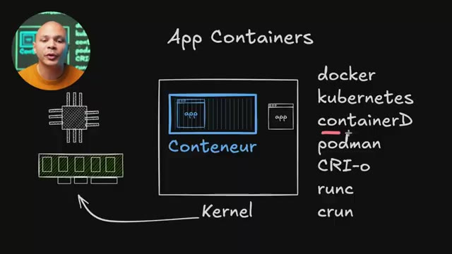
*📸 00:10:32 — Schéma technique identique à l'image #1, affichant un trait de surbrillance rouge sous le composant "containerD" pour marquer l'explication sur ce runtime spécifique.*

---

### ⏱️ `[00:10:38 - 00:10:58]` | Segment #27

**🔊 Audio (Transcription Intégrale Mot pour Mot en Français) :**
> Podman qui est surtout populaire en local, donc sur ton laptop pour pouvoir développer des choses comme ça. Crio, qui est l'équivalent de ContainerD, mais qui a été fait par Red Hat. On a aussi RunC. Techniquement, Crio et ContainerD sont basés sur RunC. C'est un peu plus bas niveau pour pouvoir démarrer les conteneurs.

**👁️ Analyse Visuelle d'Écran (gemini-3.5-flash-lite) :**
**Interface & Outils** : Présentation ou face-caméra sans interface informatique partagée.

**Contenu textuel & Code** : Explications orales des concepts, architectures et retours d'expérience.

**Action / Démonstration** : Démonstration pédagogique et mise en perspective technique.

---

### ⏱️ `[00:10:58 - 00:11:19]` | Segment #28

**🔊 Audio (Transcription Intégrale Mot pour Mot en Français) :**
> Alors que Crio et ContainerD, une fois que le conteneur est démarré, il faut s'occuper de faire en sorte qu'il ait un système de fichiers correct, qu'il ait un réseau qui puisse accéder à l'extérieur, etc. Et on a Cron aussi, qui est un autre runtime, qui est un peu plus léger que RunC pour pouvoir démarrer un peu plus rapidement des conteneurs. J'imagine que c'est un peu plus utile si on est sur de l'embarqué, sur des Raspberry Pi, sur des petites machines, des choses comme ça.

**👁️ Analyse Visuelle d'Écran (gemini-3.5-flash-lite) :**
**Interface & Outils** : Schéma explicatif d'architecture système / Tableau d'illustration pédagogique.

**Contenu textuel & Code** : Mentions textuelles des outils : "App Containers", "docker", "kubernetes", "containerD", "podman", "CRI-O", "runc". Représentations graphiques simplifiées d'un CPU et d'un module de mémoire RAM reliés par des flux d'exécution.

**Action / Démonstration** : Explication technique de la transition entre l'orchestration des conteneurs, la configuration de leur environnement (système de fichiers, réseau extérieur par les runtimes de haut niveau comme ContainerD ou CRI-O) et leur exécution effective par des runtimes de bas niveau légers (comme runc ou crun).

*📸 00:11:14 — Schéma d'architecture des composants et runtimes de conteneurisation mettant en relation les orchestrateurs, moteurs de conteneurs (Docker, Kubernetes, Podman), les runtimes de haut niveau (containerD, CRI-O), de bas niveau (runc) et les ressources matérielles (CPU, RAM).*

---

### ⏱️ `[00:11:19 - 00:11:41]` | Segment #29

**🔊 Audio (Transcription Intégrale Mot pour Mot en Français) :**
> Donc un conteneur, ça utilise un fonctionnement complètement différent d'une machine virtuelle, parce qu'à la base, c'est une fonctionnalité du kernel Linux directement. C'est pour ça que pendant longtemps, c'était quelque chose qui existait seulement sur Linux. Maintenant, techniquement, il y a aussi des conteneurs Windows, mais pas grand monde utilise ça. Et quand on utilise des conteneurs sur Windows en général, c'est des conteneurs Linux, mais qui tournent dans une machine virtuelle, qui est une machine virtuelle Linux, parce que c'est une fonctionnalité du kernel Linux.

**👁️ Analyse Visuelle d'Écran (gemini-3.5-flash-lite) :**
**Interface & Outils** : Schéma architectural (diagramme)

**Contenu textuel & Code** : Architecture des "App Containers" montrant l'application dans un conteneur et son lien direct au "Kernel", avec des composants CPU et RAM. Liste des technologies de conteneurisation : docker, kubernetes, containerD, podman, CRI-o, runc, crun.

**Action / Démonstration** : Explication visuelle et didactique des concepts fondamentaux des conteneurs Linux et de leur écosystème technique.

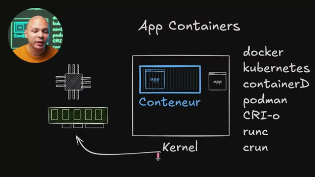
*📸 00:11:24 — Diagramme schématique expliquant le fonctionnement et l'architecture des conteneurs d'application Linux, illustrant leur interaction directe avec le Kernel et listant les principaux outils et runtimes associés.*

---

### ⏱️ `[00:11:41 - 00:12:01]` | Segment #30

**🔊 Audio (Transcription Intégrale Mot pour Mot en Français) :**
> Ça s'appelle d'ailleurs les C-Groups. Et cette fonctionnalité, elle permet simplement que quand on démarre un programme, une application, le kernel va dire, ok, cette application-là, elle va être dans un groupe, un C-Group, et elle pourra rien voir de ce qu'il y a en dehors de ce C-Group. Elle pourra voir aucun des fichiers qu'il y a à l'extérieur, elle pourra voir aucune des autres applications qui sont à l'extérieur. Elle va voir que ce que le kernel va décider qu'elle puisse voir.

**👁️ Analyse Visuelle d'Écran (gemini-3.5-flash-lite) :**
**Interface & Outils** : Schéma explicatif sur tableau blanc virtuel (overlay graphique).

**Contenu textuel & Code** : - Composants matériels représentés : CPU, barrette de mémoire RAM.
- Concepts système Linux : Kernel, cgroup.
- Technologies de conteneurisation listées : docker, kubernetes, containerD, podman, CRI-o, runc, crun.

**Action / Démonstration** : Explication théorique du rôle des cgroups (Control Groups) du noyau Linux pour segmenter, isoler et limiter l'accès aux ressources matérielles et aux fichiers système pour les processus exécutés dans un conteneur.

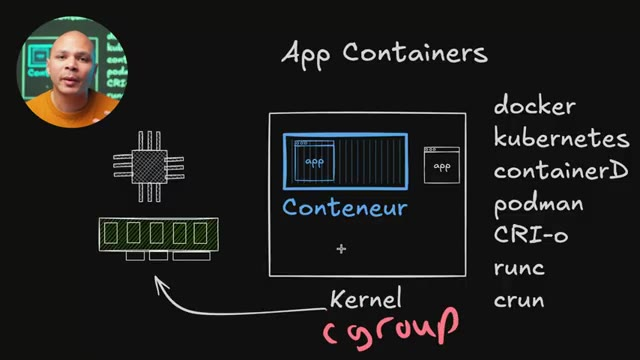
*📸 00:11:46 — Schéma conceptuel d'architecture illustrant le fonctionnement des groupes de contrôle (cgroups) du noyau Linux pour l'isolation et la limitation des ressources physiques (processeur, RAM) allouées aux conteneurs applicatifs.*

---

### ⏱️ `[00:12:01 - 00:12:23]` | Segment #31

**🔊 Audio (Transcription Intégrale Mot pour Mot en Français) :**
> Ce qui fait qu'une application qui est dans un conteneur, elle parle directement avec le kernel de l'autre de la machine. Il n'y a pas d'intermédiaire, elle ne parle pas à un OS qui parle à un OS, qui parle à un hyperviseur, qui parle vraiment à du matériel. Donc en théorie, en termes de performance pure, si je fais un benchmark avec une application qui est dans un containerisé et qu'elle a 100 points et que je fais le même benchmark directement sur mon bar métal, sur mon matos, je vais avoir 100 points aussi.

**👁️ Analyse Visuelle d'Écran (gemini-3.5-flash-lite) :**
**Interface & Outils** : Présentation ou face-caméra sans interface informatique partagée.

**Contenu textuel & Code** : Explications orales des concepts, architectures et retours d'expérience.

**Action / Démonstration** : Démonstration pédagogique et mise en perspective technique.

---

### ⏱️ `[00:12:23 - 00:12:45]` | Segment #32

**🔊 Audio (Transcription Intégrale Mot pour Mot en Français) :**
> Ça va être exactement la même chose parce que dans le cas de mon app ici qui tourne directement dans mon OS, elle parle directement à mon kernel et l'app qui est dans mon container, elle parle aussi directement à mon container. Il n'y a pas d'intermédiaire. Donc en termes de performance, c'est encore mieux que les machines virtuelles. Et donc comme notre application ici, elle parle directement au kernel de la machine haute. Un des désavantages, entre guillemets, c'est que si j'ai plusieurs conteneurs, ils vont tous partager le même kernel, donc la même version du kernel.

**👁️ Analyse Visuelle d'Écran (gemini-3.5-flash-lite) :**
**Interface & Outils** : Tableau noir (ou fond de présentation visuelle simulant un tableau noir)

**Contenu textuel & Code** : Diagramme d'architecture : "App Containers", "Conteneur", "App", "Kernel". Symboles de composants matériels (CPU, RAM). Liste de technologies de conteneurisation : docker, kubernetes, containerD, podman, CRI-o, runc, crun. Flèche indiquant la liaison directe "Conteneur -> Kernel".

**Action / Démonstration** : Explication visuelle et technique de l'architecture des applications conteneurisées et de leur interaction directe avec le kernel pour justifier des avantages en termes de performances.

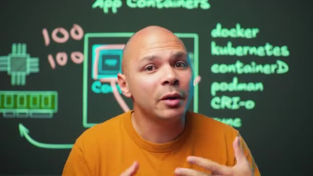
*📸 00:12:34 — Le créateur explique, avec en fond un diagramme illustrant l'architecture des conteneurs, incluant des schémas de CPU et de mémoire, ainsi qu'une liste de technologies de conteneurisation.*

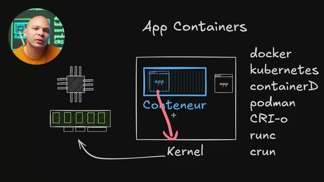
*📸 00:12:39 — Gros plan sur un diagramme d'architecture de conteneurs, montrant la relation entre une application, son conteneur et la communication directe avec le kernel. Des schémas de CPU et RAM sont visibles, ainsi qu'une liste de runtimes et orchestrateurs.*

---

### ⏱️ `[00:12:45 - 00:13:08]` | Segment #33

**🔊 Audio (Transcription Intégrale Mot pour Mot en Français) :**
> Donc si j'ai besoin d'applications qui ont elles besoin de versions différentes du kernel, je ne vais pas pouvoir utiliser des conteneurs par exemple. L'autre convénient, c'est qu'en termes de sécurité, la conteneurisation, c'est une technologie qui est un peu plus jeune. Et donc c'est déjà arrivé, ça a probablement continué à arriver, même si c'est quand même de plus en plus rare, qu'une application dans un conteneur puisse exploiter un bug dans la conteneurisation et donc puisse potentiellement sortir et affecter des fichiers ou des problèmes qui sont sur la même machine haute.

**👁️ Analyse Visuelle d'Écran (gemini-3.5-flash-lite) :**
**Interface & Outils** : Schéma d'architecture système (diapositive explicative) avec incrustation vidéo du présentateur dans le coin supérieur gauche.

**Contenu textuel & Code** : - Représentations graphiques de composants matériels : CPU, barrette de RAM.
- Bloc central représentant un conteneur et ses applications ("App" / "Conteneur") relié par une flèche au "Kernel" hôte.
- Liste textuelle des technologies et runtimes de conteneurs : `docker`, `kubernetes`, `containerD`, `podman`, `CRI-o`, `runc`, `crun`.

**Action / Démonstration** : Analyse et explication conceptuelle des limites des conteneurs, notamment la dépendance vis-à-vis du noyau (Kernel) unique de la machine hôte et les implications de sécurité associées à cette technologie plus jeune que la virtualisation traditionnelle.

*📸 00:13:02 — Schéma technique d'architecture détaillant le fonctionnement des conteneurs d'applications ("App Containers") partageant le Kernel de l'hôte avec accès aux ressources physiques (CPU, RAM) et répertoriant les principaux runtimes et orchestrateurs (Docker, Kubernetes, containerD, Podman, CRI-O, runc, crun).*

---

### ⏱️ `[00:13:08 - 00:13:27]` | Segment #34

**🔊 Audio (Transcription Intégrale Mot pour Mot en Français) :**
> J'avais déjà fait une vidéo il y a quelques années sur une des failles qui permettait de faire ça. Ça a quand même peu de choses à arriver, c'est assez rare. Mais si on est très, très soucieux de sa sécurité, si par exemple, j'offre un service où je vais mettre des conteneurs de différents clients différents sur la même infrastructure, et bien là, peut-être que je vais vouloir plutôt utiliser des machines virtuelles ou plutôt des micro-VM. Parce que les micro-VM ont un peu ces deux avantages-là.

**👁️ Analyse Visuelle d'Écran (gemini-3.5-flash-lite) :**
**Interface & Outils** : Diagramme conceptuel, liste de technologies de conteneurisation.

**Contenu textuel & Code** : Architecture d'un conteneur d'application, référence aux outils d'orchestration et runtimes de conteneurs (Docker, Kubernetes, containerd, Podman, CRI-O, runc).

**Action / Démonstration** : Explication des principes et des outils utilisés pour l'isolation et la gestion des conteneurs, notamment dans le contexte de l'hébergement mutualisé de services clients.

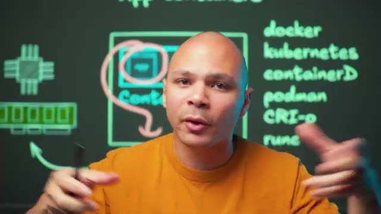
*📸 00:13:17 — Diagramme conceptuel illustrant l'encapsulation d'une application dans un conteneur ("App Containers"), accompagné d'une liste exhaustive des technologies et runtimes de conteneurisation clés comme Docker, Kubernetes, containerd, Podman, CRI-O et runc.*

---

### ⏱️ `[00:13:27 - 00:13:50]` | Segment #35

**🔊 Audio (Transcription Intégrale Mot pour Mot en Français) :**
> La légèreté des conteneurs, un petit peu moins léger, mais quand même très, très léger, mais la sécurité des machines virtuelles. Un autre gros avantage des conteneurs, c'est que mon application qui est dans mon conteneur ici, ça peut être le seul programme qui tourne dans mon conteneur. Je n'ai pas besoin d'avoir tout un OS qui tourne dans mon conteneur, j'ai juste mon application. En termes de taille, c'est très petit, parce que je vais juste avoir mon application et ce qu'elle a besoin. Je vais avoir un seul programme qui tourne, le 50 000 programmes que l'OS a besoin pour tourner, donc je vais avoir des meilleures performances aussi.

**👁️ Analyse Visuelle d'Écran (gemini-3.5-flash-lite) :**
**Interface & Outils** : Tableau blanc numérique d'architecture technique.

**Contenu textuel & Code** : - Schéma représentant un conteneur contenant uniquement l'application ("app"), relié au "Kernel", lui-même connecté à des représentations simplifiées de CPU et de mémoire RAM.
- Liste de technologies : docker, kubernetes, containerD, podman, CRI-o, runc, crun.

**Action / Démonstration** : Explication conceptuelle du fonctionnement d'un conteneur, mettant en avant sa légèreté par rapport à une machine virtuelle traditionnelle du fait qu'il ne nécessite pas l'exécution d'un système d'exploitation complet, mais uniquement de l'application cible ("app") s'appuyant sur le noyau de l'hôte.

*📸 00:13:33 — Schéma conceptuel d'un conteneur applicatif ("App Containers") s'exécutant au-dessus du Kernel de la machine hôte pour accéder aux ressources physiques (processeur, mémoire RAM). À droite, une liste d'outils et d'environnements d'exécution est affichée (docker, kubernetes, containerD, podman, CRI-o, runc, crun).*

---

### ⏱️ `[00:13:50 - 00:14:12]` | Segment #36

**🔊 Audio (Transcription Intégrale Mot pour Mot en Français) :**
> Et en termes de nombre de conteneurs que je peux mettre sur une même machine, ça va être beaucoup plus qu'une machine virtuelle, parce qu'encore une fois, comme je n'ai pas d'OS, imaginons que dans une machine virtuelle, j'ai besoin d'au moins, disons, 2 gigas pour l'OS, et ensuite peut-être que j'ai besoin d'un giga pour mon application, et bien ça veut dire que pour chacune des machines virtuelles, il faut que je réserve 3 gigas. Alors que là, avec mon conteneur, si mon application utilise 1 giga, et bien chaque conteneur va utiliser 1 giga de mémoire.

**👁️ Analyse Visuelle d'Écran (gemini-3.5-flash-lite) :**
**Interface & Outils** : Présentation ou face-caméra sans interface informatique partagée.

**Contenu textuel & Code** : Explications orales des concepts, architectures et retours d'expérience.

**Action / Démonstration** : Démonstration pédagogique et mise en perspective technique.

---

### ⏱️ `[00:14:13 - 00:14:31]` | Segment #37

**🔊 Audio (Transcription Intégrale Mot pour Mot en Français) :**
> Du coup, je peux techniquement mettre 3 fois plus de conteneurs que ce que je peux mettre de machines virtuelles, dans ce cas-là. En pratique, ça peut même potentiellement être plus, parce que les 1 giga de mémoire que mon conteneur a besoin ici, si mes conteneurs sont très similaires et ont besoin d'accéder exactement aux mêmes librairies, ces librairies-là peuvent être charlées une seule fois en mémoire. Et donc, si j'ai 50 conteneurs, je ne vais quand même consommer que 1 Go de RAM.

**👁️ Analyse Visuelle d'Écran (gemini-3.5-flash-lite) :**
**Interface & Outils** : Présentation ou face-caméra sans interface informatique partagée.

**Contenu textuel & Code** : Explications orales des concepts, architectures et retours d'expérience.

**Action / Démonstration** : Démonstration pédagogique et mise en perspective technique.

---

### ⏱️ `[00:14:31 - 00:14:52]` | Segment #38

**🔊 Audio (Transcription Intégrale Mot pour Mot en Français) :**
> Alors que si j'avais des machines virtuelles, 50 conteneurs, ça ferait 150 Go de RAM. Donc non seulement on a des meilleures performances en termes de CPU, mais en termes de RAM, on l'utilise aussi beaucoup moins avec des conteneurs qu'avec des machines virtuelles. Et en plus de ça, on économise aussi avec le disque dur, parce que l'image d'un conteneur, c'est souvent quelques mégas, quelques dizaines de mégas, alors qu'une image de machine virtuelle, c'est en gigas, si ce n'est parfois en dizaines de gigas.

**👁️ Analyse Visuelle d'Écran (gemini-3.5-flash-lite) :**
**Interface & Outils** : Schéma d'architecture technique dessiné sur tableau noir virtuel.

**Contenu textuel & Code** : - Mots-clés de l'écosystème cloud-native : `docker`, `kubernetes`, `containerd`, `podman`, `CRI-o`, `runc`.
- Icônes et schémas matériels : Processeur (CPU), barrette de mémoire vive (RAM) pointée par une flèche verte, et des blocs de conteneurs avec allocations de RAM simulées (ex: 1G, 2G).

**Action / Démonstration** : Explication théorique et comparative de l'efficacité énergétique et matérielle des conteneurs face aux machines virtuelles (VMs), en démontrant l'optimisation drastique de la RAM, du CPU et de l'espace disque grâce au partage du noyau de l'OS hôte.

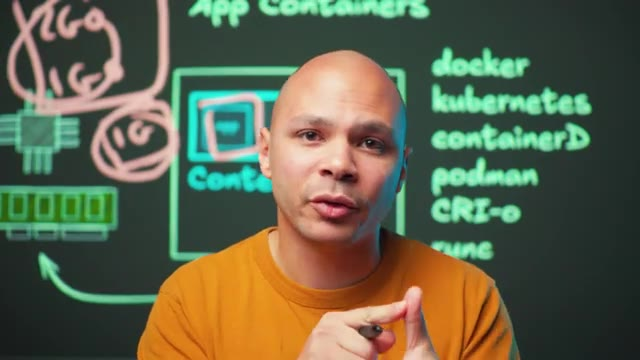
*📸 00:14:36 — Schéma d'architecture sur tableau noir numérique présentant les technologies de conteneurisation (Docker, Kubernetes, containerd, podman, CRI-O, runc) et des concepts d'allocation de ressources matérielles (CPU, RAM).*

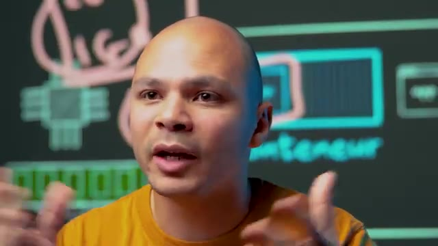
*📸 00:14:47 — Plan rapproché sur l'intervenant avec le même schéma d'architecture système (CPU, bloc "conteneur") visible en arrière-plan flouté.*

---

### ⏱️ `[00:14:52 - 00:15:11]` | Segment #39

**🔊 Audio (Transcription Intégrale Mot pour Mot en Français) :**
> Ensuite, on a un autre type de conteneur. Au lieu des conteneurs d'application, on a les conteneurs de système, les système containers. Donc là, on va quand même utiliser la technologie des conteneurs, la technologie des C-Groups qui est dans le canal Linux. Donc on va bénéficier de tous les avantages, c'est très rapide, c'est très léger. Mais au lieu d'avoir juste notre application, on va avoir notre réduction et on va aussi démarrer tout un OS à l'intérieur du conteneur.

**👁️ Analyse Visuelle d'Écran (gemini-3.5-flash-lite) :**
**Interface & Outils** : Présentation ou face-caméra sans interface informatique partagée.

**Contenu textuel & Code** : Explications orales des concepts, architectures et retours d'expérience.

**Action / Démonstration** : Démonstration pédagogique et mise en perspective technique.

---

### ⏱️ `[00:15:11 - 00:15:44]` | Segment #40

**🔊 Audio (Transcription Intégrale Mot pour Mot en Français) :**
> Et donc on va retrouver init, système D, et donc tous les programmes qui tournent sur une machine Linux classique. Ce qui fait que j'ai les avantages du conteneur, moins le temps de boot par exemple, parce qu'il faut quand même que là je démarre mon OS, donc ça prend quand même un certain temps. mais ça va quand même être plus rapide que sur une machine virtuelle. Et je vais avoir les avantages d'avoir tout un OS. Donc si par exemple mon application veut utiliser CronTab, c'est un autre programme qui tourne dans mon OS, et bien il est là, je peux l'utiliser. Donc en termes de compatibilité, les applications qui tournent dans un système container, elles n'ont même pas vraiment besoin d'être containerisées particulièrement, de savoir qu'elles sont dans un container, parce qu'elles vont avoir l'impression d'être dans un OS classique

**👁️ Analyse Visuelle d'Écran (gemini-3.5-flash-lite) :**
**Interface & Outils** : Présentation ou face-caméra sans interface informatique partagée.

**Contenu textuel & Code** : Explications orales des concepts, architectures et retours d'expérience.

**Action / Démonstration** : Démonstration pédagogique et mise en perspective technique.

---

### ⏱️ `[00:15:44 - 00:16:02]` | Segment #41

**🔊 Audio (Transcription Intégrale Mot pour Mot en Français) :**
> avec tous les fichiers et tous les programmes qu'il y a dans un OS classique. Et ça c'est possible avec des outils comme LXC. Je ne sais pas si vraiment il y a d'autres outils qui permettent de faire ça, mais qui sont toujours actuellement en développement. Mais LXC, c'est vraiment le runtime qui va permettre de démarrer ces fameux systèmes containers. Et on a LXD, qui va plutôt être l'outil qu'on va utiliser pour pouvoir démarrer ces containers.

**👁️ Analyse Visuelle d'Écran (gemini-3.5-flash-lite) :**
**Interface & Outils** : Présentation ou face-caméra sans interface informatique partagée.

**Contenu textuel & Code** : Explications orales des concepts, architectures et retours d'expérience.

**Action / Démonstration** : Démonstration pédagogique et mise en perspective technique.

---

### ⏱️ `[00:16:02 - 00:16:22]` | Segment #42

**🔊 Audio (Transcription Intégrale Mot pour Mot en Français) :**
> L'avantage aussi, ce qui est cool, c'est que LXD peut aussi démarrer des machines virtuelles. Donc ça veut dire qu'avec le même outil, on peut utiliser à la fois des containers et à la fois des machines virtuelles. C'est un outil que moi j'utilise par exemple pour faire mes formations. Je donne accès à des machines virtuelles à mes étudiants pour qu'ils fassent leurs projets dessus. Et il y a certains projets où je peux leur donner des conteneurs qui vont être des systèmes containers. C'est-à-dire que pour eux, ça va être comme une machine virtuelle, mais en fait, c'est un conteneur.

**👁️ Analyse Visuelle d'Écran (gemini-3.5-flash-lite) :**
**Interface & Outils** : Présentation ou face-caméra sans interface informatique partagée.

**Contenu textuel & Code** : Explications orales des concepts, architectures et retours d'expérience.

**Action / Démonstration** : Démonstration pédagogique et mise en perspective technique.

---

### ⏱️ `[00:16:23 - 00:16:43]` | Segment #43

**🔊 Audio (Transcription Intégrale Mot pour Mot en Français) :**
> Donc, j'ai les avantages de ça consommer moins, je peux en mettre plus sur la même machine, etc. Et pour certains projets qui ont besoin d'avoir vraiment une machine virtuelle, je peux utiliser exactement le même outil LXD. Et là, à ce moment-là, ça sera une machine virtuelle. Il y a certains projets, par exemple, quand on utilise Kubernetes ou quand on utilise Docker, c'est un peu compliqué d'avoir Docker à l'intérieur de Docker ou dans l'intérieur de Kubernetes. Et donc, du coup, c'est plus simple d'avoir une machine virtuelle que d'avoir un conteneur.

**👁️ Analyse Visuelle d'Écran (gemini-3.5-flash-lite) :**
**Interface & Outils** : Présentation ou face-caméra sans interface informatique partagée.

**Contenu textuel & Code** : Explications orales des concepts, architectures et retours d'expérience.

**Action / Démonstration** : Démonstration pédagogique et mise en perspective technique.

---

### ⏱️ `[00:16:43 - 00:17:04]` | Segment #44

**🔊 Audio (Transcription Intégrale Mot pour Mot en Français) :**
> même un système container, c'est en général pas vraiment faisable ou du moins pas faisable de manière sécurisée. Et au passage, il y a aussi une version qui s'appelle Incus qui est un fork de LXD parce que LXD a été récupéré par Ubuntu, il me semble. Donc pour pouvoir continuer à être open source, il y a le projet Incus qui permet de faire la même chose et donc de pouvoir avoir un cluster de machines et de pouvoir démarrer des machines virtuelles et des systèmes containers dedans.

**👁️ Analyse Visuelle d'Écran (gemini-3.5-flash-lite) :**
**Interface & Outils** : Tableau blanc numérique interactif de présentation d'architecture informatique.

**Contenu textuel & Code** : - Schéma fonctionnel avec les termes : "System Containers", "Conteneur", "Kernel", "LXC", "Lxd", "INCUS".
- Représentations graphiques de composants matériels : processeur (CPU) et mémoire vive (RAM).
- Logo officiel de Linux (Tux) à l'intérieur du bloc conteneur.

**Action / Démonstration** : Explication conceptuelle de la virtualisation par conteneurs système (LXC) et présentation de l'alternative open-source Incus, née suite à la reprise du projet LXD par Canonical (Ubuntu).

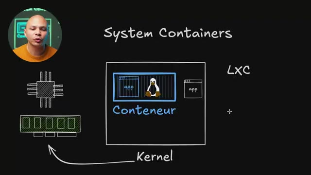
*📸 00:16:48 — Schéma explicatif de l'architecture d'un conteneur système (System Container) basé sur LXC, illustrant son interaction directe avec le noyau (Kernel) Linux et les ressources physiques (CPU, RAM).*

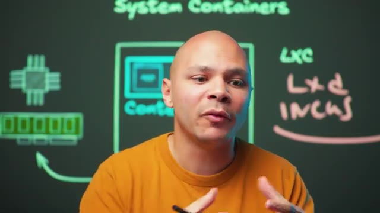
*📸 00:16:59 — Plan de présentation montrant les mentions de LXC, LXD et de son fork open-source Incus sur le tableau de présentation en arrière-plan.*

---

### ⏱️ `[00:17:05 - 00:17:24]` | Segment #45

**🔊 Audio (Transcription Intégrale Mot pour Mot en Français) :**
> Et donc pour résumer, on a d'un côté les machines virtuelles qui peuvent être soit des VM complètes avec tout un OS, etc. ou qui peuvent être des micro-EM. Donc là, on a tout enlevé, presque même pas d'OS et donc du coup, c'est très très léger. Et de l'autre côté, on a les conteneurs avec les systèmes conteneurs qui, eux, justement, contiennent un OS et ressemblent à une machine physique.

**👁️ Analyse Visuelle d'Écran (gemini-3.5-flash-lite) :**
**Interface & Outils** : Présentation ou face-caméra sans interface informatique partagée.

**Contenu textuel & Code** : Explications orales des concepts, architectures et retours d'expérience.

**Action / Démonstration** : Démonstration pédagogique et mise en perspective technique.

---

### ⏱️ `[00:17:24 - 00:17:44]` | Segment #46

**🔊 Audio (Transcription Intégrale Mot pour Mot en Français) :**
> Et on a les applications containers qui, eux, ont juste l'application qui tourne dedans. Et donc là, en fonction de ce qu'on a besoin, est-ce qu'on a besoin d'avoir quelque chose qui ressemble à un OS ou est-ce que ça peut être correct d'avoir juste l'application dans notre conteneur ou dans notre VM ? Et ensuite, est-ce qu'on veut utiliser la technologie de virtualisation, donc d'avoir un hyperviseur, ou est-ce qu'on veut utiliser la technologie de conteneurisation qui est contenue dans le kernel Linux.

**👁️ Analyse Visuelle d'Écran (gemini-3.5-flash-lite) :**
**Interface & Outils** : Présentation ou face-caméra sans interface informatique partagée.

**Contenu textuel & Code** : Explications orales des concepts, architectures et retours d'expérience.

**Action / Démonstration** : Démonstration pédagogique et mise en perspective technique.

---

### ⏱️ `[00:17:44 - 00:18:04]` | Segment #47

**🔊 Audio (Transcription Intégrale Mot pour Mot en Français) :**
> En fonction de ces deux paramètres, on va pouvoir choisir si on veut une VM classique, une micro-VM, un système container ou un application container. Si tu veux apprendre des outils DevOps avec moi, comme par exemple Ansible, Docker, Kubernetes, Prometheus ou GitLab, 3-4 fois par an, je fais une formation sur le DevOps en petits groupes. On apprend ça ensemble en live, on fait des exercices, des projets. Donc si ça t'intéresse, je te laisse un lien dans la description.

**👁️ Analyse Visuelle d'Écran (gemini-3.5-flash-lite) :**
**Interface & Outils** : Présentation ou face-caméra sans interface informatique partagée.

**Contenu textuel & Code** : Explications orales des concepts, architectures et retours d'expérience.

**Action / Démonstration** : Démonstration pédagogique et mise en perspective technique.

---

### ⏱️ `[00:18:04 - 00:18:13]` | Segment #48

**🔊 Audio (Transcription Intégrale Mot pour Mot en Français) :**
> Et je ne sais pas exactement quelle vidéo te recommander, mais normalement, YouTube a décidé que cette vidéo, c'est celle qui t'intéresserait le plus. Donc, je te laisse découvrir ça et on se retrouve là-bas.

**👁️ Analyse Visuelle d'Écran (gemini-3.5-flash-lite) :**
**Interface & Outils** : Présentation ou face-caméra sans interface informatique partagée.

**Contenu textuel & Code** : Explications orales des concepts, architectures et retours d'expérience.

**Action / Démonstration** : Démonstration pédagogique et mise en perspective technique.

---

