# 🎬 Je tente de devenir un expert Kubernetes en 7 jours

> **Chaîne** : [cocadmin](https://www.youtube.com/@cocadmin)  
> **Lien YouTube** : [https://www.youtube.com/watch?v=RlZfhw80c5E](https://www.youtube.com/watch?v=RlZfhw80c5E)  
> **Date de publication** : 20260120  
> **Durée** : 00:27:11  
> **Identifiant vidéo** : `RlZfhw80c5E`  
> **Transcription & Analyse** : `whisper-v3-large-turbo+gemini-3.5-flash-lite`  

---

## 📌 Synthèse Exécutive & Outils

### 💡 Résumé

Ce retour d'expérience documente le défi intense d'un ingénieur entreprenant de valider en une semaine l'écosystème complet des certifications Kubernetes (notamment le parcours « Cubestronaut »), incluant les certifications fondamentales, administratives (CKA), applicatives (CKAD) et sécuritaires (CKS). Confronté à des contraintes logistiques (nomadisme, travail en espace de coworking dans un ancien fort militaire belge) et à la rigueur drastique des examens de la Cloud Native Computing Foundation (CNCF), l'auteur expérimente l'écart entre l'apprentissage théorique par les quiz et la réalité des examens pratiques « les mains dans le cambouis ». 

La démarche technique s'articule autour de l'utilisation intensive de plateformes de formation par bundles, de tests blancs (*mock exams*) pour calibrer la vitesse d'exécution, et de la stratégie d'utilisation de la documentation officielle sous forte pression temporelle. L'approche démontre que la réussite à la certification **CKA** (Certified Kubernetes Administrator) ne repose pas uniquement sur la compréhension théorique des objets Kubernetes (Pods, Deployments, RBAC, réseaux, stratégies de backup), mais sur une vélocité d'exécution irréprochable et un usage chirurgical de la documentation officielle, le temps étant l'ennemi numéro un face aux questions complexes de dépannage (*troubleshooting*).

L'impact opérationnel pour un Administrateur Système ou un Développeur DevOps réside dans la prise de conscience des exigences du terrain : la gestion d'un cluster Kubernetes en production ne tolère aucune approximation. Les exigences de surveillance des proctors (surveillants d'examen) lors des sessions distantes et les pièges classiques de syntaxe (gestion des JSON/YAML, isolation des contextes via `kubectl config use-context`, manipulation des clusters cassés) rappellent que la maîtrise des outils bas niveau (`crictl`, `nerdctl`, configuration des services systemd pour kubelet) est indispensable pour maintenir la haute disponibilité des architectures conteneurisées.

### 🛠️ Outils, Modèles & Logiciels Présentés

* **Kubernetes (K8s)** : Orchestrateur de conteneurs open-source standard de l'industrie, au cœur de toutes les certifications visées pour la gestion, le déploiement et la mise à l'échelle des applications.
* **CKA (Certified Kubernetes Administrator)** : Certification CNCF axée sur l'installation, la configuration, la maintenance, le backup et l'administration globale d'un cluster de production.
* **CKAD (Certified Kubernetes Application Developer)** : Certification orientée développeurs pour concevoir, construire, configurer et exposer des applications natives Cloud sur Kubernetes.
* **CKS (Certified Kubernetes Security Specialist)** : Certification avancée dédiée au durcissement des clusters, à la sécurité des réseaux, à la gestion des identités et à l'analyse des vulnérabilités.
* **KCNA (Kubernetes and Cloud Native Associate)** : Certification d'entrée de gamme à choix multiples évaluant les connaissances fondamentales de l'écosystème Cloud Native (Kubernetes, Prometheus, Envoy, etc.).
* **KCSA (Kubernetes and Cloud Security Associate)** : Certification d'introduction axée sur la posture de sécurité globale des environnements conteneurisés et des architectures Kubernetes.
* **kubectl** : L'interface en ligne de commande (CLI) officielle pour communiquer avec l'API du plan de contrôle Kubernetes et piloter les ressources du cluster.
* **CRICTL / NERDCTL** : Outils de ligne de commande bas niveau pour interagir directement avec les runtimes de conteneurs sous-jacents (containerd) lors des phases de diagnostic et de *troubleshooting*.
* **Mock Exams (Examens Blancs)** : Tests pratiques d'entraînement intégrés aux plateformes de cours, essentiels pour valider ses acquis et s'habituer au format chronométré des certifications.

### 🔑 Points Clés & Enseignements Stratégiques

* **Ne pas confondre les niveaux de certification** : Bien identifier les sigles (KCNA vs KCSA) avant de lancer un test blanc pour éviter de perdre du temps sur des thématiques de sécurité avancée (Mutual TLS, politiques d'autorisation personnalisées) lors de révisions fondamentales.
* **La réalité des *Mock Exams* vs Examens Officiels** : Les examens blancs sont souvent plus prédictifs et linéaires que l'examen réel, qui introduit des micro-détails de syntaxe et des questions transverses nécessitant une concentration accrue.
* **Stratégie de passage de la KCNA (QCM)** : Pour les examens à choix multiples, l'utilisation de la méthode par élimination est une technique redoutable pour maximiser le score, même face à des questions dont la réponse exacte n'est pas maîtrisée à 100 %.
* **Gestion du temps à l'épreuve pratique (CKA)** : Sur un examen interactif de type CKA, le temps est le facteur limitant critique. Il est impossible de passer plus de quelques minutes à chercher une information inconnue dans la documentation officielle.
* **Maîtrise absolue de la documentation officielle** : Ne naviguez pas à l'aveugle dans la documentation pendant l'examen. Vous devez savoir exactement où trouver l'extrait YAML ou la commande spécifique dont vous avez besoin en un minimum de clics.
* **L'entraînement par la répétition (*Hands-on*)** : Contrairement aux QCM, la CKA exige une pratique répétée et réflexe des commandes `kubectl`. Si vous n'avez jamais manipulé un objet ou réparé un composant brisé avant l'examen, vous perdrez un temps précieux.
* **Rigueur des conditions de surveillance (*Proctoring*)** : Les examens certifiants exigent un environnement de test stérile. Débranchez les écrans secondaires, effacez les tableaux blancs, isolez tout appareil mobile (mode avion obligatoire) et retirez tout objet non autorisé de la table pour éviter une disqualification immédiate.
* **Interdiction formelle de verbalisation** : Ne lisez jamais les questions à haute voix et ne marmonnez pas pendant l'examen. Les algorithmes et surveillants de visioconférence interprètent toute parole comme une tentative de triche potentielle menant à l'expulsion de la session.
* **Pièges liés aux runtimes de conteneurs** : Ne vous fiez pas aveuglément aux vieux postulats (comme Docker et LXC) ; comprenez le rôle exact des runtimes modernes compatibles CRI (containerd, crictl) dans l'architecture actuelle de Kubernetes.
* **Importance du *Troubleshooting* système** : Un administrateur Kubernetes certifié doit maîtriser non seulement l'API Kubernetes, mais aussi les couches sous-jacentes (état des services `kubelet`, fichiers de configuration systemd, certificats TLS expirés, résolution DNS interne).
* **Résilience psychologique face au stress** : Le changement de dernière minute de salle de test ou les imprévus logistiques (comme un téléphone qui sonne par inadvertance) génèrent un pic de cortisol néfaste ; préparez votre espace physique bien en amont pour sécuriser votre concentration.

---

## ⏱️ Chronologie & Transcription Complète Audio & Visuelle (Mot pour Mot)

### ⏱️ `[00:00:00 - 00:00:18]` | Segment #01

**🔊 Audio (Transcription Intégrale Mot pour Mot en Français) :**
> Bon, moi, mon but, je ne vais pas vous le cacher, ce serait de faire ça, le programme Cubestronaut, d'être un Cubestronaut. Parce que tu vois les deux books ici, comment ils ont l'air heureux avec leur T-shirt Cubestronaut, donc moi j'ai envie d'avoir un sourire comme ça aussi. Et donc pour être un Cubestronaut, il faut ces certifications-là.

**👁️ Analyse Visuelle d'Écran (gemini-3.5-flash-lite) :**
**Interface & Outils** : Navigateur web affichant le site officiel de la Cloud Native Computing Foundation (CNCF).

**Contenu textuel & Code** : Texte de présentation du programme Cubestronaut et exigences de certifications Kubernetes.

**Action / Démonstration** : Navigation et présentation du site web du programme Cubestronaut de la CNCF.

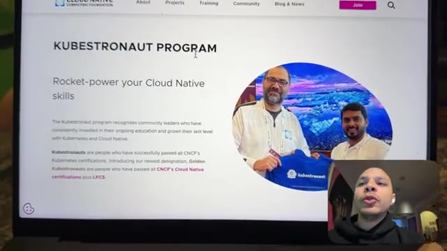
*📸 00:00:05 — Page web du programme "Kubestronaut Program" de la CNCF affichant la définition des certifiés et une photo de participants.*

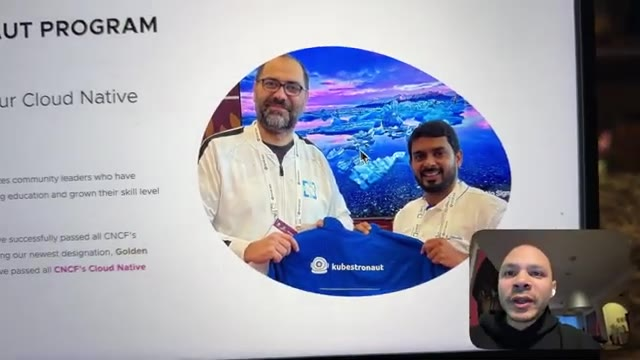
*📸 00:00:09 — Zoom sur l'image de la page web montrant deux personnes tenant un t-shirt siglé "Kubestronaut".*

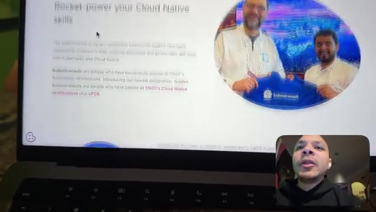
*📸 00:00:14 — Défilement de la page web du programme Cubestronaut de la CNCF sur l'écran d'un ordinateur portable.*

---

### ⏱️ `[00:00:19 - 00:00:39]` | Segment #02

**🔊 Audio (Transcription Intégrale Mot pour Mot en Français) :**
> Le problème, c'est qu'elles sont tellement difficiles que normalement ça prend des mois. Sauf que moi, en ce moment, je suis en voyage et j'aimerais faire ça en une semaine. Donc ils font tout ça pour pouvoir avoir la bête de veste ici, Cubestronaut. Donc la première la plus connue, c'est la CK, Certified QMetrize Administrator. C'est plus pour vraiment mettre en place le cluster, le backup et le gérer en tant qu'administrateur. Ensuite, tu as la CKAD qui est plus pour les développeurs.

**👁️ Analyse Visuelle d'Écran (gemini-3.5-flash-lite) :**
**Interface & Outils** : Navigateur web affichant un tableau blanc Excalidraw, webcam intégrée du créateur.

**Contenu textuel & Code** : Logos des certifications Linux Foundation : KCNA, KCSA, CKA (Certified Kubernetes Administrator), CKAD (Certified Kubernetes Application Developer), CKS (Certified Kubernetes Security Specialist).

**Action / Démonstration** : Présentation des différentes certifications Kubernetes abordées dans la vidéo et pointage vers la certification CKA.

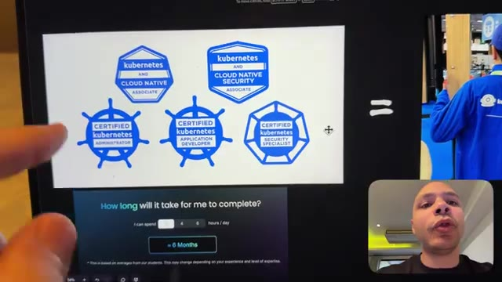
*📸 00:00:24 — Présentation des certifications Kubernetes (CKA, CKAD, CKS, KCNA, KCSA) sur une interface Excalidraw avec une main pointant vers la CKA.*

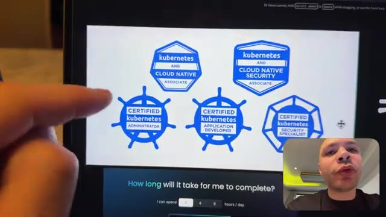
*📸 00:00:29 — Vue rapprochée des badges officiels des certifications Kubernetes et Cloud Native de la Linux Foundation.*

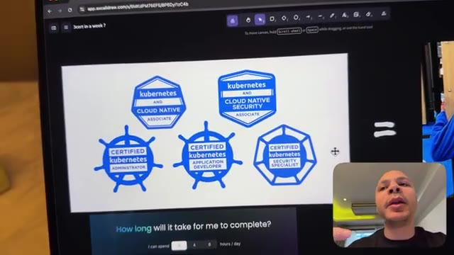
*📸 00:00:34 — Affichage global du tableau blanc interactif Excalidraw listant les certifications Kubernetes à préparer en une semaine.*

---

### ⏱️ `[00:00:39 - 00:00:58]` | Segment #03

**🔊 Audio (Transcription Intégrale Mot pour Mot en Français) :**
> Donc là, c'est plus utiliser les fonctionnalités d'un cluster Kubernetes en tant que développeur. Et ensuite, tu as la CKS qui est là encore plus avancée pour pouvoir sécuriser le réseau, etc. Et ensuite, tu as les deux bizarres ici qui sont les KCNA, qui est une version un peu plus facile de ces deux-là parce que celle-là, elle est en question à choix multiple.

**👁️ Analyse Visuelle d'Écran (gemini-3.5-flash-lite) :**
**Interface & Outils** : Navigateur web affichant un tableau blanc Excalidraw (app.excalidraw.com) illustrant les certifications de la Cloud Native Computing Foundation (CNCF).

**Contenu textuel & Code** : Logos graphiques des certifications Kubernetes de la CNCF : CKA, CKAD, CKS, KCNA, KCSA, ainsi qu'une interface de questionnaire de planification temporelle ("How long will it take for me to complete?").

**Action / Démonstration** : Le présentateur pointe successivement du doigt les différentes certifications Kubernetes (CKS, puis KCNA) pour expliquer leurs niveaux de difficulté et leurs objectifs respectifs.

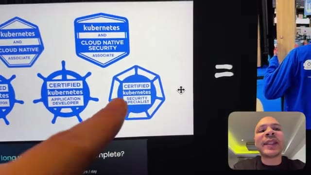
*📸 00:00:44 — Présentation sur Excalidraw montrant les logos des certifications Kubernetes (CKA, CKAD, CKS, KCNA, KCSA), avec un doigt pointant vers le logo CKS.*

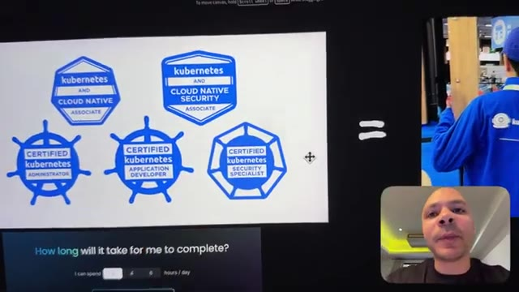
*📸 00:00:49 — Vue globale de l'écran avec Excalidraw affichant les certifications Kubernetes et une question sur le temps estimé de préparation en bas.*

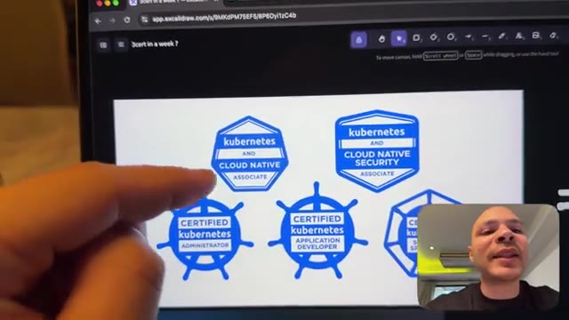
*📸 00:00:53 — Gros plan sur l'écran d'Excalidraw montrant les logos de certifications, avec le présentateur pointant vers le badge KCNA.*

---

### ⏱️ `[00:00:58 - 00:01:18]` | Segment #04

**🔊 Audio (Transcription Intégrale Mot pour Mot en Français) :**
> Alors que celle d'en bas, c'est vraiment les mains dans le cambouis. T'as le cluster, il est pété, il faut que tu le répartes. Et la KCSA, pareil, c'est la version un peu light de la KCS. Et pour pouvoir faire ça, normalement, c'est des dizaines d'heures de vidéos à se taper. Là, ici, il y avait un site où ils disent que ça prend environ 6 mois en moyenne pour pouvoir passer ça. Sauf que moi, je n'ai pas 6 mois. Je n'ai pas envie, en tout cas, de passer 6 mois là-dessus.

**👁️ Analyse Visuelle d'Écran (gemini-3.5-flash-lite) :**
**Interface & Outils** : Tableau blanc numérique / outil de mindmapping et site web de formation aux certifications Kubernetes.

**Contenu textuel & Code** : Logos des certifications Linux Foundation / CNCF : CKAD, CKA, CKS, KCNA, KCNSA et widget d'estimation de durée (≈ 6 Months pour 2h/jour).

**Action / Démonstration** : Présentation et explication des différentes certifications Kubernetes et du temps nécessaire pour les obtenir.

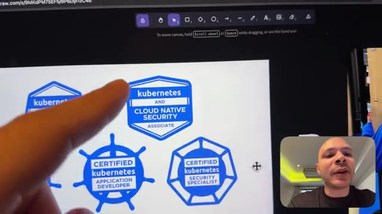
*📸 00:01:03 — Présentation des certifications CNCF/Kubernetes avec un focus sur la certification KCNA (Kubernetes and Cloud Native Security Associate).*

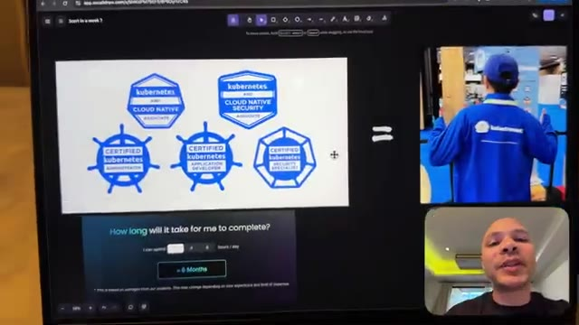
*📸 00:01:08 — Affichage global des certifications Kubernetes (KCNA, CKA, CKAD, CKS) et estimation du temps d'apprentissage (« How long will it take for me to complete? »).*

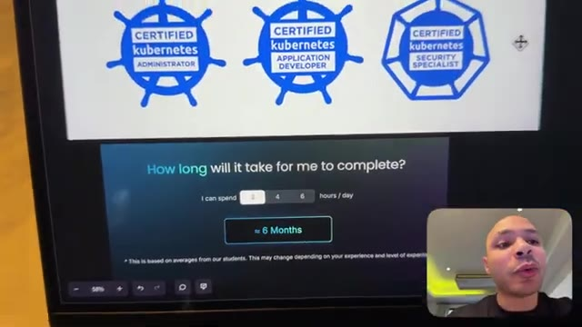
*📸 00:01:13 — Zoom sur l'interface d'estimation temporelle montrant une durée d'environ 6 mois pour se préparer aux certifications Kubernetes.*

---

### ⏱️ `[00:01:18 - 00:01:38]` | Segment #05

**🔊 Audio (Transcription Intégrale Mot pour Mot en Français) :**
> Je n'ai pas envie de passer des dizaines d'heures. Et en plus de ça, je suis en voyage, donc je n'ai pas vraiment le temps de traîner là-dessus. CK et CKAD. Si je peux faire les trois en une semaine, déjà c'est bien. Le cours, la dernière fois, franchement, j'ai trouvé que c'était pourri. Donc là, en fait, ce que j'ai fait, c'est que j'ai acheté juste les certifs.

**👁️ Analyse Visuelle d'Écran (gemini-3.5-flash-lite) :**
**Interface & Outils** : Navigateur web affichant la plateforme The Linux Foundation Education et des documents PDF de programmes de certification.

**Contenu textuel & Code** : "Certified Kubernetes Security Specialist (CKS) Exam Curriculum", "Certified Kubernetes Application Developer (CKAD) Exam Curriculum", "1x CKA+CKAD+CKS Cert Bundle ($498.00)".

**Action / Démonstration** : Présentation des programmes des certifications Kubernetes (CKA, CKAD, CKS) et affichage de la facture d'achat des vouchers d'examen sur la plateforme de la Linux Foundation.

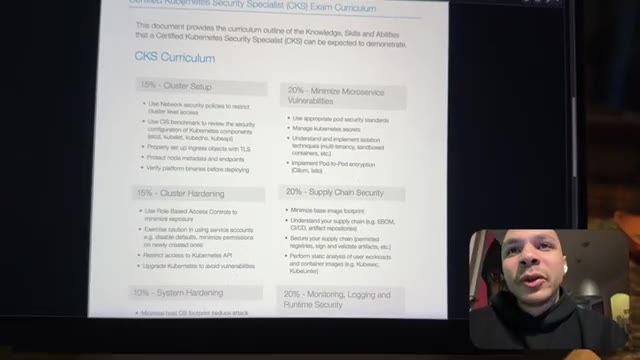
*📸 00:01:23 — Documentation officielle affichant le programme détaillé de la certification CKS (Certified Kubernetes Security Specialist) avec les différents domaines de compétences et pourcentages associés.*

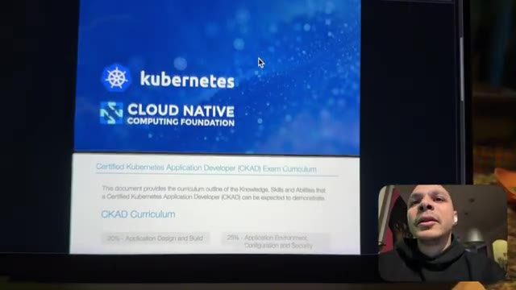
*📸 00:01:28 — Page de présentation du programme (curriculum) de la certification CKAD (Certified Kubernetes Application Developer) par la Cloud Native Computing Foundation (CNCF).*

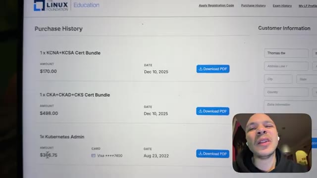
*📸 00:01:33 — Historique d'achats sur le portail de The Linux Foundation Education montrant l'achat de bundles de certifications Kubernetes (KCNA+KCSA et CKA+CKAD+CKS).*

---

### ⏱️ `[00:01:39 - 00:02:11]` | Segment #06

**🔊 Audio (Transcription Intégrale Mot pour Mot en Français) :**
> Donc j'ai acheté CK, CKAD, CKS. Et j'ai acheté KCNA et KCSA. En fait, ils avaient un bundle avec tout dedans, mais c'était plus cher que d'acheter les deux séparément. Je ne sais pas pourquoi. Et ouais, je l'ai acheté hier parce qu'ils ont leur offre du Black Friday. là donc du coup c'était moins cher. Ils ont souvent des promos. J'en ai eu pour 500, 600 balles à peu près. Et là on est le 11. Donc je commence aujourd'hui. Quoi ? C'est quoi ce script ?

**👁️ Analyse Visuelle d'Écran (gemini-3.5-flash-lite) :**
**Interface & Outils** : Navigateur web affichant le portail de la Linux Foundation / CNCF (Purchase History).

**Contenu textuel & Code** : Lignes de commande ou d'achat : "1 x KCNA+KCSA Cert Bundle" ($170.00), "1 x CKA+CKAD+CKS Cert Bundle" ($498.00), "1 x Kubernetes Admin" ($386.75).

**Action / Démonstration** : Présentation et vérification des achats de bundles de certifications Kubernetes réalisés lors d'une promotion.

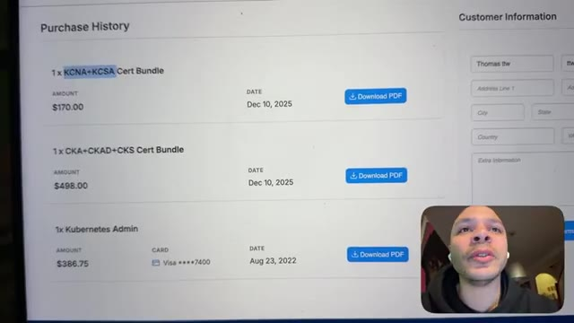
*📸 00:01:55 — Historique d'achats montrant les bundles de certifications Kubernetes (KCNA+KCSA et CKA+CKAD+CKS) avec leurs montants respectifs.*

---

### ⏱️ `[00:02:11 - 00:02:35]` | Segment #07

**🔊 Audio (Transcription Intégrale Mot pour Mot en Français) :**
> C'est quoi ce quiz de merde ? Mais Pierre, jamais de la vie t'as parlé de ça dans le cours. De Custom Authorization Policy. Quoi ? Je viens de réaliser un truc. Je crois franchement ça fait au au moins une heure, si ce n'est plus. Je viens de comprendre pourquoi les questions étaient hardcore.

**👁️ Analyse Visuelle d'Écran (gemini-3.5-flash-lite) :**
**Interface & Outils** : Navigateur web affichant une plateforme LMS / de cours en ligne.

**Contenu textuel & Code** : Menu de cours avec des sections comme "Introduction", "Overview of Cloud...", "Kubernetes Security", "Compliance and Security", et des sous-chapitres listés dans le panneau latéral gauche.

**Action / Démonstration** : Navigation ou consultation d'une plateforme d'apprentissage en ligne sur un ordinateur portable.

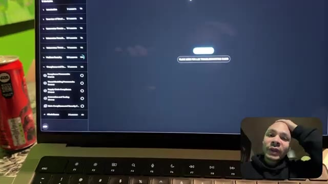
*📸 00:02:29 — Vue de l'écran d'un ordinateur portable affichant une interface de formation en ligne avec un menu latéral listant des modules de cours et de sécurité (Kubernetes Security, Compliance and Security, etc.).*

---

### ⏱️ `[00:02:35 - 00:02:57]` | Segment #08

**🔊 Audio (Transcription Intégrale Mot pour Mot en Français) :**
> C'est parce que depuis tout à l'heure, je suis en train de faire la KCSA pour la sécurité. Alors que celle que je voulais faire en premier, c'est la KCNA. Bref, j'ai vu K, quelque chose, je me suis dit, vas-y. Je me suis dit, mais je suis teubé ou quoi ? C'est censé être facile. Et je vois que des trucs de sécurité, de certificat, de mutual TLS, je me dis, mais c'est quoi ça ? Je n'ai jamais vu ça.

**👁️ Analyse Visuelle d'Écran (gemini-3.5-flash-lite) :**
**Interface & Outils** : Navigateur web / lecteur PDF affichant un document de documentation ou de formation CNCF.

**Contenu textuel & Code** : Titre "Kubernetes and Cloud Native Associate (KCNA) Exam Curriculum" avec le logo CNCF et Kubernetes.

**Action / Démonstration** : Présentation et consultation des prérequis et du programme officiel de la certification KCNA.

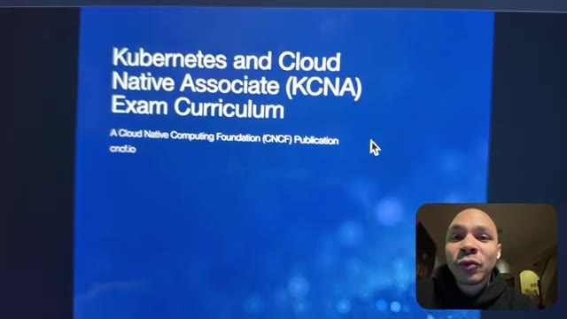
*📸 00:02:41 — Affichage à l'écran du programme de certification KCNA (Kubernetes and Cloud Native Associate) de la CNCF.*

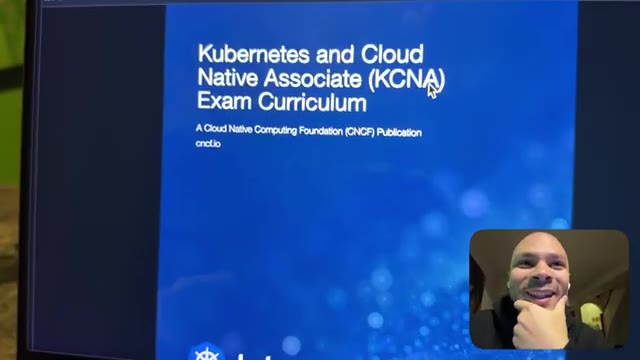
*📸 00:02:46 — Navigation sur le document du programme de la certification KCNA avec le curseur pointant sur le sigle.*

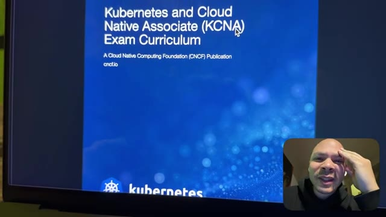
*📸 00:02:52 — Visualisation continue du curriculum de l'examen KCNA publié par la Cloud Native Computing Foundation.*

---

### ⏱️ `[00:02:57 - 00:03:33]` | Segment #09

**🔊 Audio (Transcription Intégrale Mot pour Mot en Français) :**
> On s'est jamais perdu, mais bon, ça fout le sonne un peu. jour 2 j'essaie encore de trouver un autre coworking hier j'ai pas réussi aujourd'hui je vais un autre qu'un peu plus loin et puis on va voir si c'est ouvert et s'ils me laissent réserver c'est dans un parc c'est dans un fort un peu je sais pas enfin c'est marqué fort numéro 5 et là il ya des remparts ou des morceaux donc j'imagine c'est un ancien un ancien fort ou un truc comme ça je pas mais ça a l'air cool. Ça risque d'être un autre problème c'est que je parle pas néerlandais.

**👁️ Analyse Visuelle d'Écran (gemini-3.5-flash-lite) :**
**Interface & Outils** : AUCUNE

**Contenu textuel & Code** : AUCUN

**Action / Démonstration** : AUCUNE

---

### ⏱️ `[00:03:33 - 00:04:01]` | Segment #10

**🔊 Audio (Transcription Intégrale Mot pour Mot en Français) :**
> Ça a l'air cool. Super. C'est posé. Il y a un écran. Tout ce qu'il faut. Donc je commence à taffer un peu sur ma KCNA mais je t'avoue que c'est un petit peu dur de se remettre dans le jus. Bon hier j'ai perdu trop de temps. J'ai fait d'autres trucs qui n'avaient pas de rapport pour la chaîne etc. Je m'endormais en regardant les cours etc. Donc là je pense que pour la KCNA, normalement je connais 90% déjà. Il faut avoir que ce qui est à 75% je crois pour passer. Là ce Ce qui veut dire, c'est qu'il y a des quiz sur toutes les parties.

**👁️ Analyse Visuelle d'Écran (gemini-3.5-flash-lite) :**
**Interface & Outils** : AUCUNE

**Contenu textuel & Code** : AUCUN

**Action / Démonstration** : AUCUNE

---

### ⏱️ `[00:04:01 - 00:04:22]` | Segment #11

**🔊 Audio (Transcription Intégrale Mot pour Mot en Français) :**
> Donc là, par exemple, j'ai le quiz sur les fondamentaux. Là, ici, j'ai le quiz sur les ressources, etc. Donc là, scheduling, bam, je vais aller dans le quiz. Et je vais faire ça, en fait. Je vais faire tous les quiz. Et après, on verra. Si il y a un quiz où vraiment j'ai un viewscore, j'irai passer à travers ça.

**👁️ Analyse Visuelle d'Écran (gemini-3.5-flash-lite) :**
**Interface & Outils** : Plateforme de formation en ligne (LMS) type KodeKloud dédiée aux cours Kubernetes.

**Contenu textuel & Code** : Menus de cours Kubernetes, listes de leçons et questions à choix multiples (QCM) sur les commandes `kubectl`.

**Action / Démonstration** : Navigation et sélection des différents quiz du cours Kubernetes sur la plateforme de formation.

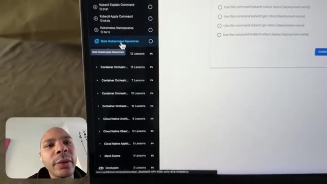
*📸 00:04:07 — Interface d'une plateforme d'apprentissage en ligne affichant le menu d'un cours Kubernetes avec des modules et quiz ('Quiz-Kubernetes Resources').*

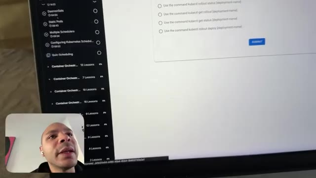
*📸 00:04:12 — Navigation dans le cours Kubernetes montrant les sections de quiz et de leçons ('Quiz-Scheduling', DaemonSets, Static Pods).*

---

### ⏱️ `[00:04:22 - 00:04:42]` | Segment #12

**🔊 Audio (Transcription Intégrale Mot pour Mot en Français) :**
> Plutôt que de juste faire les quiz, on verra si c'est hardcore ou si je passe tranquille. Donc je suis sur ma dernière question pour le premier quiz. Si j'ai eu bon à cette question. Ouais, j'ai eu bon et on va voir sur mon score. Oula, des confettises à l'air bien. Total 48, correct 42.

**👁️ Analyse Visuelle d'Écran (gemini-3.5-flash-lite) :**
**Interface & Outils** : Navigateur web affichant une plateforme de quiz e-learning sur Kubernetes.

**Contenu textuel & Code** : Question : "What is the purpose of the kubectl tool in Kubernetes?" avec plusieurs choix de réponses.

**Action / Démonstration** : Soumission de la dernière réponse du quiz et affichage des résultats avec animation de confettis.

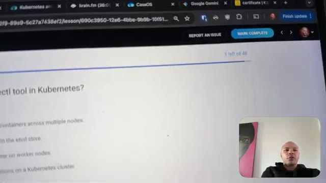
*📸 00:04:27 — Question de quiz sur Kubernetes affichée dans un navigateur web concernant l'outil kubectl.*

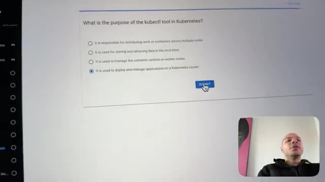
*📸 00:04:32 — Validation de la réponse à la question sur le rôle de kubectl dans Kubernetes avec le bouton "SUBMIT".*

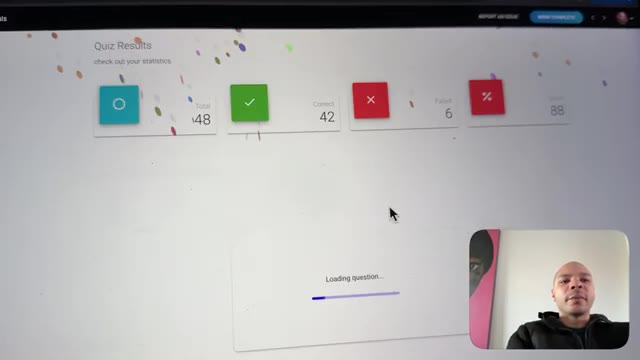
*📸 00:04:37 — Écran de résultats du quiz affichant les statistiques : Total 48, Correct 42, Failed 6, Score 88%.*

---

### ⏱️ `[00:04:43 - 00:05:04]` | Segment #13

**🔊 Audio (Transcription Intégrale Mot pour Mot en Français) :**
> Score 88%. Sachant qu'en plus, je pense qu'il y a des erreurs dans le coup. Quelle technologie Docker utilise pour ses conteneurs ? Ça dit LXC, c'est pas le cas. Donc techniquement, j'ai des points en plus. Tout ce qui était vraiment sur CRICTL, NERDCTL aussi, je ne savais pas. Mais en fait, c'est Docker, c'est la même chose. Est-ce que ça vaut le coup que je continue à étudier un peu ?

**👁️ Analyse Visuelle d'Écran (gemini-3.5-flash-lite) :**
**Interface & Outils** : Interface web de quiz ou d'examen de certification Kubernetes / DevOps avec webcam incrustée.

**Contenu textuel & Code** : Questions à choix multiples sur Kubernetes (`kubectl cluster-info`, `crictl`, rôles d'`etcd`, technologie de conteneur Docker).

**Action / Démonstration** : Révision des résultats d'un examen et discussion critique sur les réponses fournies (notamment l'erreur concernant Docker et LXC).

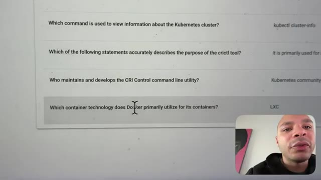
*📸 00:04:48 — Quiz technique affichant des questions sur Kubernetes, crictl et Docker (avec la question sur LXC en surbrillance).*

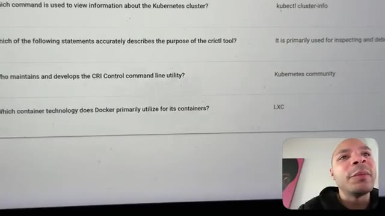
*📸 00:04:54 — Même vue du quiz technique avec le curseur pointant sur les questions d'évaluation DevOps.*

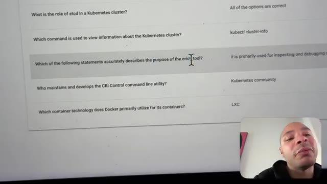
*📸 00:04:59 — Défilement vers le haut du quiz montrant les questions relatives à etcd, kubectl et crictl.*

---

### ⏱️ `[00:05:04 - 00:05:23]` | Segment #14

**🔊 Audio (Transcription Intégrale Mot pour Mot en Français) :**
> Mais c'est juste pour les fondamentaux. Finalement, j'ai fait les... Ils ont des mock exams ici, avec 60 questions d'un coup. Donc au lieu de faire des quiz au hasard, j'ai fait les mock exams. Donc là, je suis à la dernière question. Submit, j'ai raison. Next, on va voir combien j'ai. Confetti, 93%.

**👁️ Analyse Visuelle d'Écran (gemini-3.5-flash-lite) :**
**Interface & Outils** : Navigateur web affichant la plateforme e-learning KodeKloud (cours Kubernetes and Cloud-Native Associate - KCNA).

**Contenu textuel & Code** : Question de test à choix multiples : "Default Service type is:" avec les options ClusterIP, NodePort, ExternalName, LoadBalancer.

**Action / Démonstration** : Navigation et passage d'un examen blanc (Mock Exam) de certification Kubernetes en ligne.

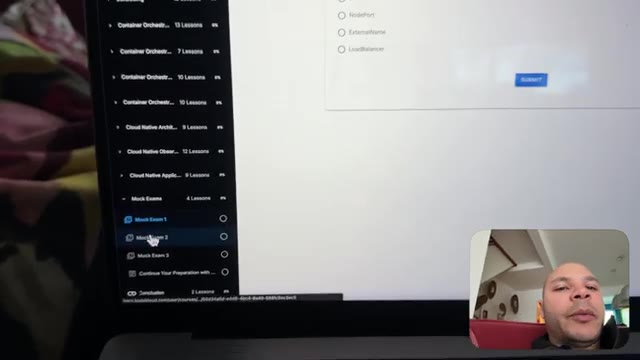
*📸 00:05:09 — Interface de la plateforme KodeKloud montrant la navigation dans les modules de préparation et les Mock Exams Kubernetes.*

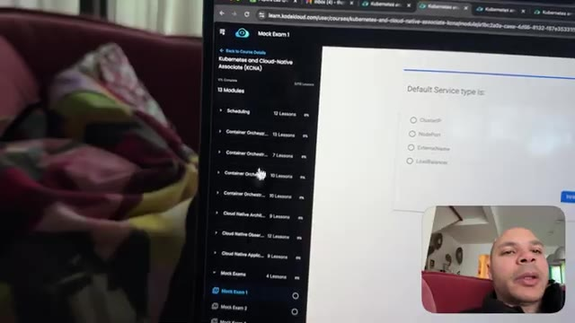
*📸 00:05:14 — Affichage d'une question de quiz Mock Exam sur les types de services Kubernetes (Default Service type).*

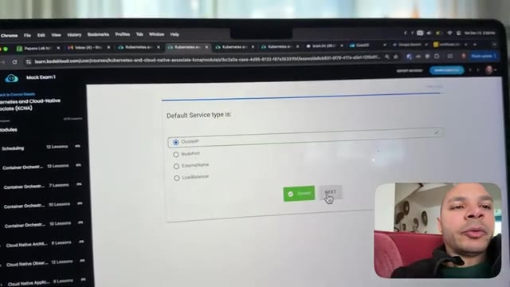
*📸 00:05:19 — Validation d'une réponse de quiz sur Kubernetes avec les boutons Submit et Next visibles.*

---

### ⏱️ `[00:05:23 - 00:05:56]` | Segment #15

**🔊 Audio (Transcription Intégrale Mot pour Mot en Français) :**
> donc effectivement le mock exam est plus facile que les exams du coup le premier exam que j'ai fait parce qu'en fait ils veulent tellement faire des questions spécifiques au chapitre que ça devient des questions vraiment des micro détails alors que ici, je commande un install moi j'ai mis remove alors que c'était un install bon bah voilà et après le format ici, disque SSD je crois que j'ai mis avec des guillemets, une erreur un peu bête aussi donc ouais, franchement je pense j'ai pas besoin de faire d'autres moques exacts je vais le schedule

**👁️ Analyse Visuelle d'Écran (gemini-3.5-flash-lite) :**
**Interface & Outils** : Navigateur web affichant la plateforme d'apprentissage en ligne KodeKloud avec un quiz de certification Kubernetes (KCNA).

**Contenu textuel & Code** : Résultats de quiz montrant un score de 93% (56/60), des questions à choix multiples sur Helm (--set, helm uninstall) et Kubernetes (nodeSelector).

**Action / Démonstration** : Revue des erreurs commises lors d'un examen blanc (mock exam) sur les notions de Kubernetes et Helm.

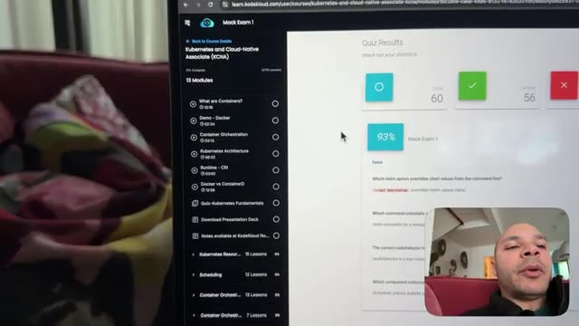
*📸 00:05:32 — Interface de KodeKloud affichant les résultats d'un examen blanc (Mock Exam 1) pour la certification KCNA (Kubernetes and Cloud-Native Associate), avec le score de 93% et des questions de quiz.*

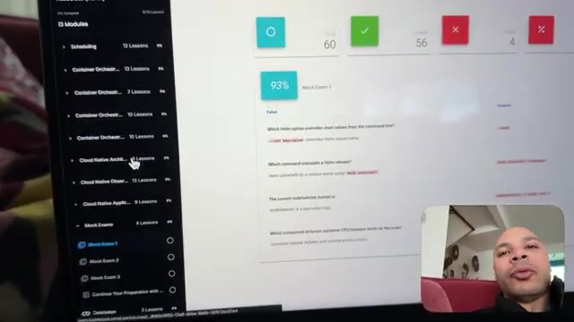
*📸 00:05:40 — Défilement de l'interface de cours KodeKloud montrant la liste des modules à gauche et le détail des questions de quiz échouées sur Helm et Kubernetes à droite.*

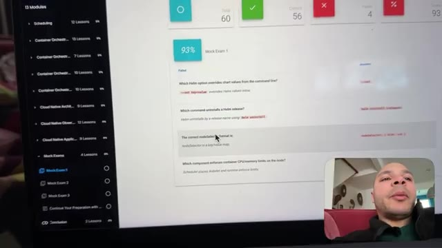
*📸 00:05:48 — Gros plan sur les questions de quiz ratées liées à Helm et au format du nodeSelector dans l'interface KodeKloud.*

---

### ⏱️ `[00:05:56 - 00:06:29]` | Segment #16

**🔊 Audio (Transcription Intégrale Mot pour Mot en Français) :**
> bon on est le lundi maintenant et je suis de retour dans le coworking à la fois ils m'ont donné un jour gratuit mais là je vais m'abonner parce que c'était cool et c'est comme un bon environnement t'as le proprio du coworking il est venu m'expliquer alors en fait c'est vraiment un fort c'est un fort que les belges ont construit pour se défendre des français dans les années 1800 quelque chose mais que finalement ça n'a pas vraiment servi et ils en ont un peu partout le long de la frontière et du coup c'est resté et ils les ont transformés

**👁️ Analyse Visuelle d'Écran (gemini-3.5-flash-lite) :**
**Interface & Outils** : AUCUNE

**Contenu textuel & Code** : AUCUN

**Action / Démonstration** : AUCUNE

---

### ⏱️ `[00:06:29 - 00:06:52]` | Segment #17

**🔊 Audio (Transcription Intégrale Mot pour Mot en Français) :**
> enfin celui-ci en tout cas ils l'ont transformé en coworking après à l'intérieur je me dis on dirait vraiment un labyrinthe ici c'est bizarre j'imagine que c'est fait exprès que ce soit un peu un labyrinthe vu que c'était un fort avant donc bref tout ça pour dire qu'on s'en fout j'ai scéulé mon passage de la KCNA pour tout à l'heure là dans deux heures je vais me prendre une petite salle de meeting Ça va, je suis confiant.

**👁️ Analyse Visuelle d'Écran (gemini-3.5-flash-lite) :**
**Interface & Outils** : AUCUNE

**Contenu textuel & Code** : AUCUN

**Action / Démonstration** : AUCUNE

---

### ⏱️ `[00:06:53 - 00:07:12]` | Segment #18

**🔊 Audio (Transcription Intégrale Mot pour Mot en Français) :**
> C'est juste choix, question multiple. Il me semble que c'est 75% de réussite. Donc bon, même si je fais quelques erreurs à droite, à gauche, ça devrait le faire. On verra. Et le reste du temps, je vais commencer à réviser. Je vais scuduler ma CKA et CKAD. J'ai réservé une salle de réunion. Ils m'ont dit, c'est la deuxième plus petite qu'on a.

**👁️ Analyse Visuelle d'Écran (gemini-3.5-flash-lite) :**
**Interface & Outils** : AUCUNE

**Contenu textuel & Code** : AUCUN

**Action / Démonstration** : Discussion en marchant sur la préparation et la planification des certifications CKA et CKAD.

---

### ⏱️ `[00:07:14 - 00:07:32]` | Segment #19

**🔊 Audio (Transcription Intégrale Mot pour Mot en Français) :**
> Ça, j'ai réservé pour une salle, one of one, une salle pour deux personnes. La salle, c'est un loft. C'est plus grand que mon appart. Je vais faire la 7e à la de 5 minutes. J'espère qu'ils ne vont pas me dire « il faut que ce soit un endroit fermé. » C'est fermé. Il y a une porte. Donc fermez-la. On verra.

**👁️ Analyse Visuelle d'Écran (gemini-3.5-flash-lite) :**
**Interface & Outils** : AUCUNE

**Contenu textuel & Code** : AUCUNE

**Action / Démonstration** : Le créateur filme l'espace de coworking qu'il a réservé (visite guidée du loft).

---

### ⏱️ `[00:07:32 - 00:08:08]` | Segment #20

**🔊 Audio (Transcription Intégrale Mot pour Mot en Français) :**
> On verra. On va voir ce qu'ils vont dire. Je viens de finir le test. C'était beaucoup plus chaud que dans le mock exam, que dans l'exam d'exemple. Il y avait quand même pas mal de questions qui étaient identiques ou très similaires. Moi, quand j'ai fait le mock exam, fait je les fais en 10 minutes, clac clac clac clac, j'ai eu 93%. Là ça m'a pris 40 minutes pour faire le même nombre de questions, 60. Après forcément je prends un peu plus de temps pour être sûr et tout. Mais presque chaque question j'étais pas sûr. Franchement il y avait peut-être trois tiers et la moitié où j'étais soit 100% sûr, soit pas mal sûr. Après le reste j'en ai fait beaucoup par élimination,

**👁️ Analyse Visuelle d'Écran (gemini-3.5-flash-lite) :**
**Interface & Outils** : AUCUNE

**Contenu textuel & Code** : AUCUNE

**Action / Démonstration** : Témoignage face caméra sur le niveau de difficulté d'un examen technique passé récemment

---

### ⏱️ `[00:08:08 - 00:08:28]` | Segment #21

**🔊 Audio (Transcription Intégrale Mot pour Mot en Français) :**
> mais ouais c'était plus dur. Ça m'a vraiment pris plus de temps, plus de concentration et tout. Mais je pense pas que j'aurais 93% comme dans le test. Les surveillants sont quand même très stricts. Alors on me dit « Ouais, il y a une télé dans la salle, assure-toi qu'elle est débranchée. » Je lui ai montré que le câble est débranché.

**👁️ Analyse Visuelle d'Écran (gemini-3.5-flash-lite) :**
**Interface & Outils** : AUCUNE

**Contenu textuel & Code** : AUCUN

**Action / Démonstration** : Explication orale du contexte de passage d'un examen technique avec des contraintes de surveillance.

---

### ⏱️ `[00:08:28 - 00:08:47]` | Segment #22

**🔊 Audio (Transcription Intégrale Mot pour Mot en Français) :**
> Il m'a dit « Ah, il y a un tableau, montre-moi ce qu'est sur le tableau. » Je lui ai montré qu'il n'y avait rien sur le tableau. Ensuite il me dit « Monte-moi ton téléphone. » Je lui ai montré que mon téléphone était loin, etc. J'avais mon passeport sur la table, il me dit « Monte la table et tout. » Il me dit « Ouais, enlève ton passeport et tout. » Donc ouais, ils sont très stricts là-dessus.

**👁️ Analyse Visuelle d'Écran (gemini-3.5-flash-lite) :**
**Interface & Outils** : Aucune interface technique, terminal ou console visible.

**Contenu textuel & Code** : Aucun contenu technique, code ou architecture réseau visible.

**Action / Démonstration** : Explication en face-caméra d'une anecdote sans manipulation technique ou informatique.

---

### ⏱️ `[00:08:47 - 00:09:21]` | Segment #23

**🔊 Audio (Transcription Intégrale Mot pour Mot en Français) :**
> pas non plus que ça te laisse te stresser mais c'est sûr que ça stresse t'as vraiment l'impression qu'il pense que tu triches et qu'il va chercher le moindre truc moi j'avais oublié de mettre mon téléphone en mode avion donc au milieu du truc mon téléphone il commence à sonner je me dis ah putain il va me casser la tête j'ai déjà vu des postes sur Reddit où les mecs ils se parlaient eux-mêmes ils lisaient une question et boum ils se sont fait kikker de l'exam donc t'as pas le droit de parler t'as pas le droit de regarder en dehors de ton écran t'as pas le droit de rien faire comme déjà t'as le stress de l'exam tu te sens encore plus stressé parce qu'ils sont vraiment hyper stricts.

**👁️ Analyse Visuelle d'Écran (gemini-3.5-flash-lite) :**
**Interface & Outils** : AUCUNE

**Contenu textuel & Code** : AUCUN

**Action / Démonstration** : Témoignage verbal du créateur concernant une anecdote d'entretien technique à distance, sans manipulation ni affichage technique.

---

### ⏱️ `[00:09:21 - 00:09:41]` | Segment #24

**🔊 Audio (Transcription Intégrale Mot pour Mot en Français) :**
> Je viens de recevoir les notes tout de suite. Ça disait que ça allait mettre 24 heures, mais j'ai reçu direct. Et en fait, j'ai 93%. Et c'était bien 75 qu'il fallait. Donc j'ai fait exactement le même score que ce que j'ai fait dans le mock exam, mais ça m'a pris 10 fois la concentration et 3 fois le temps.

**👁️ Analyse Visuelle d'Écran (gemini-3.5-flash-lite) :**
**Interface & Outils** : Navigateur web affichant la page de résultats de certification Cloud Native / Kubernetes.

**Contenu textuel & Code** : Texte "Exam Results", "Status: Pass", "Your Score: 93%", et "Score Needed: 75%".

**Action / Démonstration** : Consultation et présentation des résultats d'un examen de certification technique réussi.

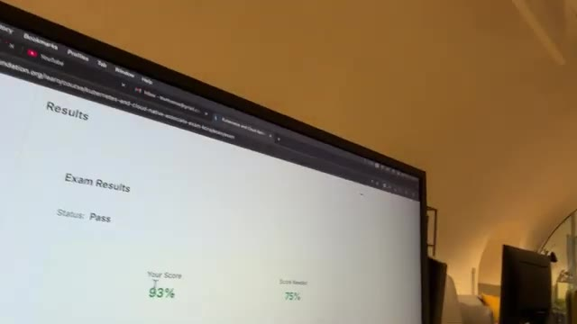
*📸 00:09:31 — Affichage à l'écran des résultats d'examen montrant un score de réussite (Pass) de 93% pour un score requis de 75%.*

---

### ⏱️ `[00:09:41 - 00:10:00]` | Segment #25

**🔊 Audio (Transcription Intégrale Mot pour Mot en Français) :**
> C'est plus dur, mais effectivement, le fait de procéder par élimination, Ça fait qu'il y a beaucoup de questions que j'ai pu avoir sans savoir exactement. Maintenant que j'ai réussi la KCNA, c'était seulement la plus facile. Et maintenant, je vais passer la CKA, qui est beaucoup plus difficile parce que c'est vraiment les mains dans le cambouis. Donc, tu peux pas faire par élimination.

**👁️ Analyse Visuelle d'Écran (gemini-3.5-flash-lite) :**
**Interface & Outils** : Aucune interface technique affichée.

**Contenu textuel & Code** : Aucun contenu technique (code, terminal, architecture).

**Action / Démonstration** : Discussion générale sur les certifications Kubernetes (KCNA vs CKA) sans manipulation technique à l'écran.

---

### ⏱️ `[00:10:00 - 00:10:22]` | Segment #26

**🔊 Audio (Transcription Intégrale Mot pour Mot en Français) :**
> Il faut vraiment savoir ce que tu fais. Bon, là, je viens de finir mon mock exam pour la CKA. On va voir c'est quoi mon score. Tu peux le savoir direct. 37 sur 73. Ça veut dire la moitié. Donc, c'est bof, tu vois. Donc là, ce que je vais faire, c'est que je vais passer à travers, je vais voir qu'est-ce que j'ai eu, qu'est-ce que j'ai pas eu. Et ouais, il y a plein de questions que j'ai flagged et que j'ai juste pas réussi parce que j'avais jamais fait avant.

**👁️ Analyse Visuelle d'Écran (gemini-3.5-flash-lite) :**
**Interface & Outils** : Navigateur web affichant la plateforme d'examen Killer.sh (CKA Simulator) et terminal Linux intégré.

**Contenu textuel & Code** : Commandes crictl ps | grep, manipulation de fichiers de log (/opt/course/17/pod-container.txt), et rapport de notation par sous-tâches (Question 1, Question 2, Question 3).

**Action / Démonstration** : Analyse des résultats d'un examen blanc CKA et vérification de conteneurs via crictl pour le troubleshooting de pods Kubernetes.

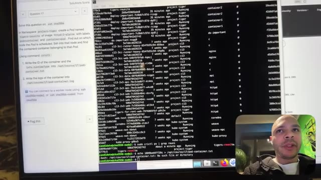
*📸 00:10:05 — Interface du simulateur d'examen CKA (Killer.sh) affichant un terminal Linux avec l'exécution de la commande crictl et un panneau de questions textuel sur le côté gauche.*

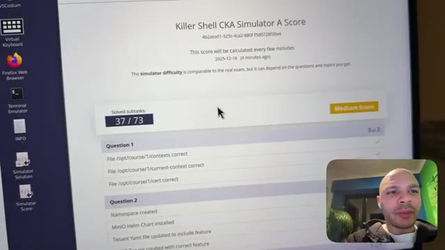
*📸 00:10:11 — Écran de résultats du simulateur Killer.sh affichant le score global de l'examen blanc CKA (37 sur 73) ainsi que le détail des sous-tâches validées pour la Question 1.*

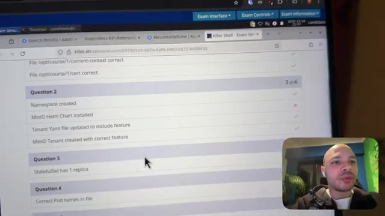
*📸 00:10:17 — Suite du rapport de score du simulateur d'examen CKA montrant le détail des questions validées ou échouées (Question 2 et Question 3).*

---

### ⏱️ `[00:10:23 - 00:10:44]` | Segment #27

**🔊 Audio (Transcription Intégrale Mot pour Mot en Français) :**
> C'est vraiment le temps, le souci. Parce que techniquement, tu peux tout faire parce que t'as accès à la doc. Donc si t'as assez de temps, tu peux fouiller dans la doc le faire et tout. Mais il y a des trucs, si tu l'as jamais fait avant, tu vas passer 30 minutes dans la doc. Et t'as que 12 heures, donc tu peux pas passer 30 minutes par question. Donc c'est vraiment... Il faut l'avoir déjà fait avant, plusieurs fois. Et savoir exactement où elle est. si tu as besoin d'aller dans la doc, c'est vraiment pour prendre une information spécifique.

**👁️ Analyse Visuelle d'Écran (gemini-3.5-flash-lite) :**
**Interface & Outils** : Navigateur web affichant l'interface du simulateur d'examen Killer.sh (CKA Simulator) avec des onglets de documentation et un environnement de bureau Linux virtuel.

**Contenu textuel & Code** : Enoncé de la question d'examen Kubernetes : création d'un Pod dans un namespace spécifique, recherche du nœud d'exécution, connexion SSH et manipulation avec la commande crictl pour extraire des informations de conteneur (ID, runtimeType, logs).

**Action / Démonstration** : Présentation et analyse d'un cas pratique de l'examen CKA illustrant la complexité et la technicité des questions soumises aux candidats.

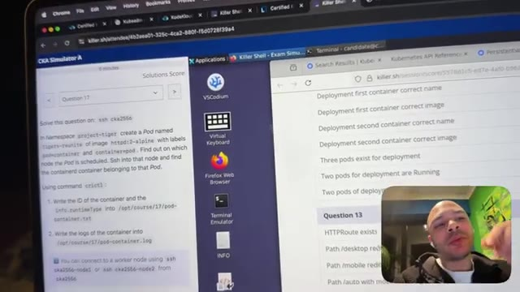
*📸 00:10:28 — Interface du simulateur d'examen CKA (Killer.sh) affichant une question pratique sur Kubernetes avec un panneau latéral montrant les critères d'évaluation et le score.*

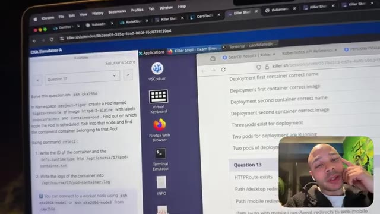
*📸 00:10:34 — Vue similaire sur le simulateur CKA (Killer.sh) mettant en évidence une question complexe nécessitant l'utilisation de l'outil crictl sur un nœud Kubernetes distant.*

---

### ⏱️ `[00:10:44 - 00:11:06]` | Segment #28

**🔊 Audio (Transcription Intégrale Mot pour Mot en Français) :**
> Tu sais exactement où est-ce que tu vas chercher dans la doc. J'ai encore un peu de temps pour essayer de voir ce qui n'a pas été. Et puis demain, parce que là, j'ai ce qu'il y a pour demain, donc je n'ai pas le choix. Et maintenant, c'est le jour J. Je suis prêt, du moins, j'espère. Et je passe la CKA. Certified Kubernetes Administrator. Je viens de finir la CKA. Et voilà le drama.

**👁️ Analyse Visuelle d'Écran (gemini-3.5-flash-lite) :**
**Interface & Outils** : Aucune interface ou console affichée.

**Contenu textuel & Code** : Aucun code, commande ou métrique visible.

**Action / Démonstration** : Discussion générale et retour d'expérience sur la préparation à la certification CKA sans manipulation technique en direct.

---

### ⏱️ `[00:11:07 - 00:11:27]` | Segment #29

**🔊 Audio (Transcription Intégrale Mot pour Mot en Français) :**
> Je suis encore tressé. J'ai pas eu la même salle que l'année dernière fois. C'était une salle avec un mur en verre. Quand j'y vais, ça se passe bien. Il me fait, vas-y, vérifie la salle. Et il me dit rien de spécial. Je me dis, OK, tranquille. Je commence. Au bout de 15 minutes, déjà, je vois les premières questions sont plus costauds que quand je l'avais passé il y a 2-3 ans.

**👁️ Analyse Visuelle d'Écran (gemini-3.5-flash-lite) :**
**Interface & Outils** : AUCUNE

**Contenu textuel & Code** : AUCUN

**Action / Démonstration** : Témoignage du créateur concernant le stress lié au changement de salle d'examen ou d'entretien.

---

### ⏱️ `[00:11:27 - 00:12:01]` | Segment #30

**🔊 Audio (Transcription Intégrale Mot pour Mot en Français) :**
> Quand je l'avais fait il y a 2-3 ans, il y avait une moitié de questions qui étaient grave faciles. Genre la question, tu la feras en 2-3 minutes. Et les autres questions, il y avait quelques questions qui étaient un peu plus dures. là c'était bizarre parce qu'en gros la plupart des questions étaient moyennes dures il n'y avait pas de questions super faciles que tu fais genre il y avait peut-être une ou deux après c'est peut-être moi qui manque de pratique aussi souvent j'ai remarqué quand je commence je panique un peu j'arrive pas à les premières questions je me dis ah putain ça y est c'est mort maintenant j'ai l'habitude je me dis vas-y je vais continuer ça va le faire au bout de 10-20 minutes

**👁️ Analyse Visuelle d'Écran (gemini-3.5-flash-lite) :**
**Interface & Outils** : AUCUNE

**Contenu textuel & Code** : AUCUN

**Action / Démonstration** : Discussion face caméra et présentation générale sans manipulation technique affichée.

---

### ⏱️ `[00:12:01 - 00:12:22]` | Segment #31

**🔊 Audio (Transcription Intégrale Mot pour Mot en Français) :**
> le tchat il s'ouvre le mec il me dit ouais il y a des gens derrière toi comment ça se fait Je lui dis mais mec, le mur est en vert. C'est pour ça que tu vois des gens passer derrière. Et je lui dis c'est pour ça que j'ai fait exprès, je me suis assis dos au mur. Comme ça, je peux pas voir ni rien. Il me dit ah ok c'est bon d'accord, tant que tu leur parles pas c'est correct.

**👁️ Analyse Visuelle d'Écran (gemini-3.5-flash-lite) :**
**Interface & Outils** : AUCUNE

**Contenu textuel & Code** : AUCUNE

**Action / Démonstration** : Explication informelle et discussion avec le tchat sans support technique ni manipulation logicielle.

---

### ⏱️ `[00:12:22 - 00:12:43]` | Segment #32

**🔊 Audio (Transcription Intégrale Mot pour Mot en Français) :**
> Déjà ça m'interrompt, ça me perturbe un peu. Et là genre 20 minutes plus tard, ça me met genre alerte, violation, warning et tout. Je fais comme moi. Et là ça se trouve il me dit ouais j'ai vu quelqu'un dans la pièce et tout. Je fais comme quoi ? Qu'est-ce que tu racontes ? Je lui dis « Non, mais il n'y a personne à la pièce. » Il me dit « Ouais, j'ai vu derrière toi quelqu'un qui est passé. » Je lui dis « Non, mais je t'ai expliqué.

**👁️ Analyse Visuelle d'Écran (gemini-3.5-flash-lite) :**
**Interface & Outils** : AUCUNE

**Contenu textuel & Code** : AUCUNE

**Action / Démonstration** : AUCUNE

---

### ⏱️ `[00:12:43 - 00:13:08]` | Segment #33

**🔊 Audio (Transcription Intégrale Mot pour Mot en Français) :**
> Il y a 10 minutes, le mur est en vert. C'est normal, tu vois derrière. » Il remet 10 minutes à checker. Donc, à l'instant-là, je continue mon exam. Au bout d'un minute, il me dit « Ah, excuse-moi, c'est bon. » Quand tu mets une violation, ça veut dire que c'est un warning. S'il y a un autre warning, boum, t'es kick-out, quoi qu'il arrive. Donc, je me prends un warning pour rien. Et là, il me dit « Ah, excusez-moi. » je panique et tout.

**👁️ Analyse Visuelle d'Écran (gemini-3.5-flash-lite) :**
**Interface & Outils** : AUCUNE

**Contenu textuel & Code** : AUCUNE

**Action / Démonstration** : AUCUNE

---

### ⏱️ `[00:13:08 - 00:13:28]` | Segment #34

**🔊 Audio (Transcription Intégrale Mot pour Mot en Français) :**
> Donc, en plus, t'as le temps. Franchement, j'avais pas beaucoup de temps et tout. Finalement, j'arrive aux dernières questions. Il me reste quand même 7 minutes pour pouvoir repasser. Mais il y avait quand même, vu que j'ai regardé, il y avait 6 questions que j'avais flac. C'est-à-dire que je sais que j'ai pas réussi. Il manque quelque chose, tu vois. Et donc, je suis repassé sur les 6. Il y en a peut-être une ou deux où j'ai pu prendre un peu de temps pour corriger des trucs.

**👁️ Analyse Visuelle d'Écran (gemini-3.5-flash-lite) :**
**Interface & Outils** : AUCUNE

**Contenu textuel & Code** : AUCUNE

**Action / Démonstration** : AUCUNE

---

### ⏱️ `[00:13:28 - 00:13:48]` | Segment #35

**🔊 Audio (Transcription Intégrale Mot pour Mot en Français) :**
> De ce que j'ai vu hier, en gros, même si t'as pas la question en entier, t'as des points quand même si t'as fait une partie des trucs. Donc c'est pour ça que je suis repassé à travers tout. Là on verra. Je pense si la dernière fois ça m'a envoyé mon score direct. Donc là je vais voir si j'ai reçu mon score. Et si j'ai passé ou pas. Au moins il y a quelques questions où j'ai rien fait du tout. Parce que je savais pas du tout. Il y a pas mal de questions où j'ai fait un petit peu.

**👁️ Analyse Visuelle d'Écran (gemini-3.5-flash-lite) :**
**Interface & Outils** : Aucune interface ou console affichée.

**Contenu textuel & Code** : Aucun code, terminal ou architecture visible.

**Action / Démonstration** : Discussion générale face caméra.

---

### ⏱️ `[00:13:48 - 00:14:24]` | Segment #36

**🔊 Audio (Transcription Intégrale Mot pour Mot en Français) :**
> Donc il suffit que dans les autres questions. J'ai loupé un truc, une faute d'inattention ou quoi. C'est sûr que j'étais grave stressé. Le mec il mettait la pression et tout. Je vais aller voir si j'ai reçu. Mais j'ai pas envie de voir. Mais vas-y on va voir. Moi j'ai pas reçu. je pense comme j'ai eu le warning ils vont revu mon truc je pense à 24 heures un truc comme ça donc bon j'ai toujours pas mes scores et au final ça m'a bien découragé cette histoire de warning violation warning et tout ça m'a trop

**👁️ Analyse Visuelle d'Écran (gemini-3.5-flash-lite) :**
**Interface & Outils** : Aucune interface affichée.

**Contenu textuel & Code** : Aucun contenu technique, code ou métrique visible.

**Action / Démonstration** : Discussion générale du créateur, aucune manipulation ou configuration technique.

---

### ⏱️ `[00:14:24 - 00:14:49]` | Segment #37

**🔊 Audio (Transcription Intégrale Mot pour Mot en Français) :**
> stressé pourtant tu vois si je loupe je peux la repasser ça me change absolument rien tu vois mais je sais pas le stress tu vas d'être d'être accusé, ça me tue. Donc ouais, ça m'a découragé un petit peu. J'allais grinder pour pouvoir commencer à réviser la CKAD derrière, parce que le problème c'est que derrière la CKAD et j'ai encore rien fait du tout.

**👁️ Analyse Visuelle d'Écran (gemini-3.5-flash-lite) :**
**Interface & Outils** : Aucune interface technique, terminal ou logiciel visible (vlog en extérieur).

**Contenu textuel & Code** : Aucun code, commande ou architecture visible.

**Action / Démonstration** : Le créateur s'exprime en marchant à l'extérieur, partageant son ressenti et ses réflexions sur ses certifications.

---

### ⏱️ `[00:14:49 - 00:15:11]` | Segment #38

**🔊 Audio (Transcription Intégrale Mot pour Mot en Français) :**
> Et techniquement, le challenge des 7 jours finit demain. J'avais prévu de le passer demain. Je pense que demain je vais prendre un jour en plus pour réviser. Il y a pas mal de choses qui sont similaires. Une bonne partie. Peut-être une moitié, peut-être un peu plus, mais il y a pas mal de choses qui sont pas dedans. et puis je le schedulerai pour le jour d'après. Ça fera un challenge 8 jours au lieu de 7 jours.

**👁️ Analyse Visuelle d'Écran (gemini-3.5-flash-lite) :**
**Interface & Outils** : AUCUNE

**Contenu textuel & Code** : AUCUN

**Action / Démonstration** : AUCUNE

---

### ⏱️ `[00:15:12 - 00:15:39]` | Segment #39

**🔊 Audio (Transcription Intégrale Mot pour Mot en Français) :**
> Alors, on est deux jours plus tard et j'ai enfin reçu mon score. En fait, j'ai reçu mon score hier. Et je ne l'ai pas vu. J'ai eu 61. Il fallait 66 pour passer. Donc, j'ai loupé. Quelque part, je préfère louper et le repasser et le passer avec un score convenable Plutôt que de passer avec 67 sur 66 et dire « Ouais, je l'ai eu ! » Alors que je l'ai eu à un demi-point près.

**👁️ Analyse Visuelle d'Écran (gemini-3.5-flash-lite) :**
**Interface & Outils** : AUCUNE

**Contenu textuel & Code** : AUCUNE

**Action / Démonstration** : AUCUNE

---

### ⏱️ `[00:15:39 - 00:16:00]` | Segment #40

**🔊 Audio (Transcription Intégrale Mot pour Mot en Français) :**
> Du coup, ça veut dire aussi que j'ai perdu le challenge en 7 jours parce que je n'ai toujours pas passé la CKAD. J'avais commencé un peu à réviser pour, mais j'ai dû attendre 24 heures avant d'avoir mes résultats. Et après, ça prend 24 heures pour voir ce qu'il y a eu un examen. Je ne peux pas le programmer le week-end parce que le week-end, je n'ai pas accès au coworking. Là, je vais les programmer pour lundi, je pense. Comme ça, aujourd'hui, je vais réviser encore un peu CKAD.

**👁️ Analyse Visuelle d'Écran (gemini-3.5-flash-lite) :**
**Interface & Outils** : AUCUNE

**Contenu textuel & Code** : AUCUNE

**Action / Démonstration** : Explication en marchant concernant l'échec du challenge de 7 jours sur la certification CKAD.

---

### ⏱️ `[00:16:00 - 00:16:34]` | Segment #41

**🔊 Audio (Transcription Intégrale Mot pour Mot en Français) :**
> Ce qui est bien, c'est que ça te dit à peu près ce que tu as loupé. ça te dit pas exactement les questions mais ça te donne les catégories que t'as loupées mais également je sais ce qui m'a manqué ça m'a dit troubleshooting il y avait une question que j'ai pas du tout faite franchement il y a des questions que j'ai vraiment paniqué troubleshooting, il y avait une question c'était on a set up un nouveau cluster mais il marche pas répare le moi j'étais comme des rires tu veux que je fasse quoi et donc je savais pas trop quoi faire et j'ai juste pas fait c'était la dernière question donc j'ai dû perdre pas mal de points là dessus mais maintenant je sais à peu près quoi faire et il y avait une question, c'était installer un truc avec Helm

**👁️ Analyse Visuelle d'Écran (gemini-3.5-flash-lite) :**
**Interface & Outils** : Aucune interface technique affichée

**Contenu textuel & Code** : Aucun contenu technique ou graphique visible

**Action / Démonstration** : Le créateur s'exprime en marchant dans la rue, aucun outil ni code n'est manipulé

---

### ⏱️ `[00:16:34 - 00:17:06]` | Segment #42

**🔊 Audio (Transcription Intégrale Mot pour Mot en Français) :**
> et la deuxième partie de la question, c'était faire un Helm Chart sur je sais pas quoi et moi j'ai vu créer un Helm Chart, j'ai paniqué, j'ai fait « Ah ouais, c'est mort, je sais pas comment faire » alors qu'en fait, un Helm Chart, c'est juste un manifeste Kubernetes avec des templates à droite à gauche quand il y a besoin mais juste, j'ai vu la question, j'ai paniqué et en fait, il y a plein de questions comme ça, quand tu vois la question, tu dis « Ah ouais, les bâtards, ils m'ont douillé, ils m'ont mis une question grave dure » et en fait, tu fais la question et tu dis « Ah ouais, en fait, non, c'est pas si compliqué » Mais je pense avec le stress que ça me rajoutait, le mec qui mettait des warnings de toutes les deux minutes,

**👁️ Analyse Visuelle d'Écran (gemini-3.5-flash-lite) :**
**Interface & Outils** : AUCUNE

**Contenu textuel & Code** : AUCUNE

**Action / Démonstration** : Explication en marchant sur la perception erronée de la complexité des Helm Charts en Kubernetes.

---

### ⏱️ `[00:17:06 - 00:17:29]` | Segment #43

**🔊 Audio (Transcription Intégrale Mot pour Mot en Français) :**
> qui me disait « attends, mets pas ta main devant ta bouche, fais pas ci, il y a quelqu'un qui passe derrière toi et tout », ça m'a trop stressé. C'est pas aussi juste le fait que le surveillant m'a niqué un petit peu. Il y a un peu de ça, mais il y a aussi beaucoup de « si j'étais meilleur, je serais passé largement ». Peut-être que j'aurais perdu 5-10 points, mais j'aurais quand même passé. Donc je peux pas non plus mettre toute la faute sur ça.

**👁️ Analyse Visuelle d'Écran (gemini-3.5-flash-lite) :**
**Interface & Outils** : AUCUNE

**Contenu textuel & Code** : AUCUN

**Action / Démonstration** : AUCUNE

---

### ⏱️ `[00:17:29 - 00:18:03]` | Segment #44

**🔊 Audio (Transcription Intégrale Mot pour Mot en Français) :**
> il y a une grande partie aussi que j'ai juste j'ai pas pris le truc assez au sérieux tu vois je suis allé un peu à l'arrache donc je vais repasser et puis on verra de retour dans la forêt donc non on est le lundi suivant donc on est bien loin du défi 7 jours on est plus sur un 14 jours ou sur un 8 9 jours ouvrables aujourd'hui c'est qu'un deuxième deuxième essai là je suis quand même assez confiant je suis pas trop à garner ce week-end réviser un peu j'ai quand même essayé de boucher les trous un peu. Je me suis fait des petites fiches, etc. Je pense que je vous partagerai.

**👁️ Analyse Visuelle d'Écran (gemini-3.5-flash-lite) :**
**Interface & Outils** : AUCUNE

**Contenu textuel & Code** : AUCUNE

**Action / Démonstration** : Discussion en marchant en extérieur, explication de projets personnels ou de retours d'expérience sans support visuel technique.

---

### ⏱️ `[00:18:03 - 00:18:33]` | Segment #45

**🔊 Audio (Transcription Intégrale Mot pour Mot en Français) :**
> Si je n'ai pas la flemme, je vous partagerai. Je vous mettrai un lien en bas. Je me suis aussi fait des exemples de questions par chaque catégorie en fonction des questions que j'ai pu voir, etc. Et comme ça, pour être sûr de savoir que tout ce que j'ai vu, ou du moins toutes les questions que j'ai vues jusqu'à présent, je connais la réponse ou du moins le cheminement pour pouvoir la trouver. Donc là, j'ai encore 2-3 trucs, les Ingress et les Apew Gateway, que je veux pratiquer un peu plus pour pouvoir être sûr que dans l'exemple je puisse être efficace.

**👁️ Analyse Visuelle d'Écran (gemini-3.5-flash-lite) :**
**Interface & Outils** : Aucune interface ou console affichée.

**Contenu textuel & Code** : Aucun contenu technique (code, commandes, architecture).

**Action / Démonstration** : Explication orale en marchant concernant le partage de ressources de préparation de questions.

---

### ⏱️ `[00:18:33 - 00:18:57]` | Segment #46

**🔊 Audio (Transcription Intégrale Mot pour Mot en Français) :**
> C'est vraiment deux choses différentes entre savoir ce qu'il faut faire et savoir le faire rapidement. Et ça il faut de la pratique, il n'y a pas vraiment de secret quoi. Là je viens de finir la CK que je passe pour la deuxième fois. Je ne veux pas trop trop flex mais là je suis très très confiant. J'étais mille fois moins stressé que la dernière fois. Je n'ai pas eu de problème. Le Le serveur, il m'a pas cassé la tête une seule fois.

**👁️ Analyse Visuelle d'Écran (gemini-3.5-flash-lite) :**
**Interface & Outils** : Aucune interface ou terminal affiché

**Contenu textuel & Code** : Aucun contenu technique, de code ou de configuration visible

**Action / Démonstration** : Discours du créateur en mode vlog / face-caméra sur son expérience de certification CKA

---

### ⏱️ `[00:18:58 - 00:19:16]` | Segment #47

**🔊 Audio (Transcription Intégrale Mot pour Mot en Français) :**
> Je fais bien gaffe parce qu'il n'y a rien qui passe derrière moi ou quoi. Donc il m'a pas saoulé. J'ai pas eu de « Oh, tu mets ta main devant ta bouche. » « Oh, genre la dernière fois aussi, j'avais eu mon ordi, il a bugué. » « Le micro, il bugait. » Du coup, j'ai dû redémarrer mon ordi. Alors j'étais en retard et tout. Bref. Là, j'ai pas eu de problème ou qu'il n'y a rien. Aucun problème. J'ai fait toutes les questions.

**👁️ Analyse Visuelle d'Écran (gemini-3.5-flash-lite) :**
**Interface & Outils** : Aucun outil, terminal ou console affiché.

**Contenu textuel & Code** : Aucun code, commande ou architecture visible.

**Action / Démonstration** : Aucune manipulation ou explication technique réalisée.

---

### ⏱️ `[00:19:16 - 00:19:49]` | Segment #48

**🔊 Audio (Transcription Intégrale Mot pour Mot en Français) :**
> C'était quand même chaud. J'ai fini vraiment... J'aurais bien aimé avoir un autre 10 minutes de plus. il y a deux questions où je pense qu'il manque quelque chose où j'ai fait la plupart mais il manque un petit truc et j'avais pas assez de temps pour trop fouiller voir c'était quoi le souci toutes les autres questions, normalement je pense après ça se peut que je fasse une erreur d'inattention on verra, peut-être je vais en savoir le résultat et je vais me faire K-O maintenant il reste encore CKAD je vais essayer de la faire dans deux jours je vais essayer demain, je vais venir et je vais réviser CKAD

**👁️ Analyse Visuelle d'Écran (gemini-3.5-flash-lite) :**
**Interface & Outils** : AUCUNE

**Contenu textuel & Code** : AUCUN

**Action / Démonstration** : AUCUNE

---

### ⏱️ `[00:19:49 - 00:20:11]` | Segment #49

**🔊 Audio (Transcription Intégrale Mot pour Mot en Français) :**
> voir ce qu'il manque parce que jusqu'à présent, je n'ai pas vraiment regardé. C'est ça qui est un peu difficile. Mais je sais que la plupart des trucs sont similaires, donc je vais essayer de voir ce qui me manque. Essayer d'enchaîner CKAD demain et scheduler pour mercredi. Et comme ça, si je passe mercredi, ça fera moins de deux semaines pour les trois certifs.

**👁️ Analyse Visuelle d'Écran (gemini-3.5-flash-lite) :**
**Interface & Outils** : AUCUNE

**Contenu textuel & Code** : AUCUNE

**Action / Démonstration** : AUCUNE

---

### ⏱️ `[00:20:11 - 00:20:31]` | Segment #50

**🔊 Audio (Transcription Intégrale Mot pour Mot en Français) :**
> Ça va. Sachant qu'à l'année, j'ai passé deux fois. Et que bon, après, peut-être la CKAD, je la passerai deux fois aussi. J'espère pas. Mais au final, je suis quand même bien mieux content de la passer, d'avoir un bon score. On verra encore. Je ne sais pas encore, mais je préfère la passer avec un bon score plutôt que la passer avec un 2 points près parce que j'ai eu chaud.

**👁️ Analyse Visuelle d'Écran (gemini-3.5-flash-lite) :**
**Interface & Outils** : Aucune interface ou console affichée.

**Contenu textuel & Code** : Aucun code, configuration ou métrique technique visible.

**Action / Démonstration** : Discussion générale sur le passage de certifications.

---

### ⏱️ `[00:20:31 - 00:20:50]` | Segment #51

**🔊 Audio (Transcription Intégrale Mot pour Mot en Français) :**
> Ok, donc là, je viens de faire le simulateur CKD et je suis à 16 sur 22, sachant que dans l'examen, il y a 16 ou 17 questions. Donc, je peux avoir assez de temps pour le reste, mais j'ai eu assez de temps pour faire les 16 premières. Donc, c'est déjà un bon signe.

**👁️ Analyse Visuelle d'Écran (gemini-3.5-flash-lite) :**
**Interface & Outils** : Navigateur web affichant le simulateur CKAD (Certified Kubernetes Application Developer) et terminal Linux intégré.

**Contenu textuel & Code** : Énoncé d'un exercice Kubernetes nécessitant la création d'un conteneur sidecar (image busybox:1.31.0) dans un déploiement existant avec un volume partagé, et un terminal affichant des logs.

**Action / Démonstration** : Consultation de l'énoncé de la question 16 du simulateur CKAD et vérification de la progression (16 sur 22).

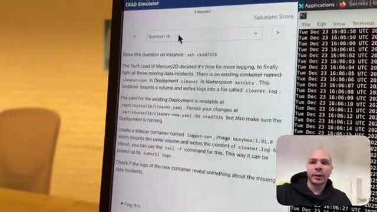
*📸 00:20:36 — Affichage du simulateur d'examen CKAD montrant l'énoncé de la question 16 sur l'ajout d'un conteneur sidecar (logger-con) dans Kubernetes, avec un terminal ouvert sur la droite.*

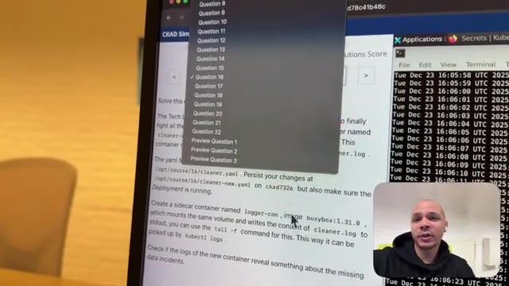
*📸 00:20:40 — Affichage du simulateur CKAD avec le menu déroulant des questions ouvert, montrant la progression de l'examen de la question 1 à 22.*

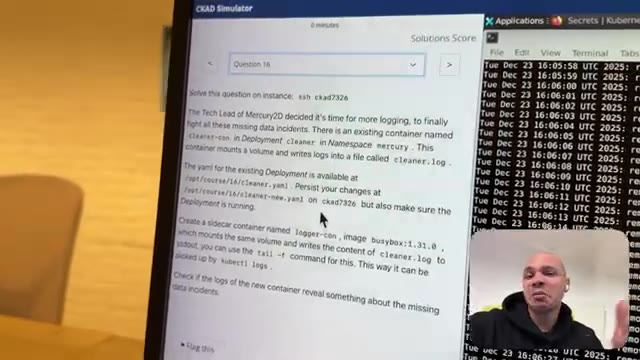
*📸 00:20:45 — Retour à la vue principale du simulateur CKAD montrant l'énoncé de l'exercice Kubernetes pour le déploiement 'cleaner'.*

---

### ⏱️ `[00:20:50 - 00:21:10]` | Segment #52

**🔊 Audio (Transcription Intégrale Mot pour Mot en Français) :**
> On va voir combien j'ai eu en score. Donc ça c'est mon score tout à l'heure. Je vais refresh. 82. Alors que je n'ai pas tout fini. Alors qu'il me manque quelques questions. Donc en fait ce qui va surtout être important c'est où est-ce que je me suis chier. Donc là par exemple ici, j'ai oublié de delete.

**👁️ Analyse Visuelle d'Écran (gemini-3.5-flash-lite) :**
**Interface & Outils** : Navigateur web affichant l'interface du Killer Shell pour l'examen CKAD (Certified Kubernetes Application Developer).

**Contenu textuel & Code** : Scores de simulation CKAD (47/113 puis 82/113), listes de questions et sous-tâches relatives à Kubernetes (namespaces, pods, jobs, Helm charts).

**Action / Démonstration** : Rafraîchissement de la page de score du simulateur d'examen CKAD et analyse des résultats par sous-tâche.

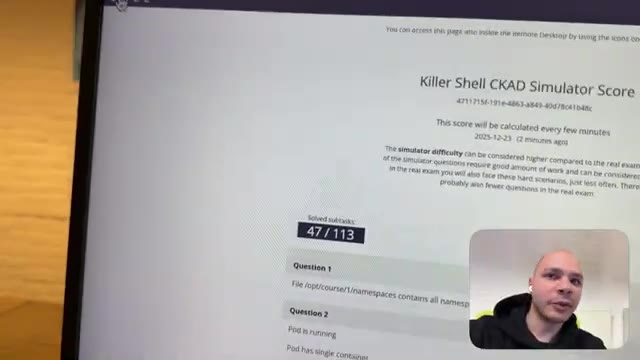
*📸 00:20:55 — Interface du simulateur Killer Shell CKAD affichant un score partiel de 47/113 sous forme de sous-tâches résolues.*

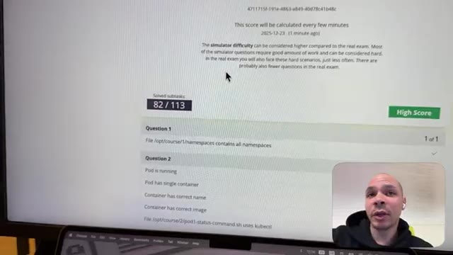
*📸 00:21:00 — Interface du simulateur CKAD montrant la mise à jour du score à 82/113 avec un badge vert indiquant "High Score".*

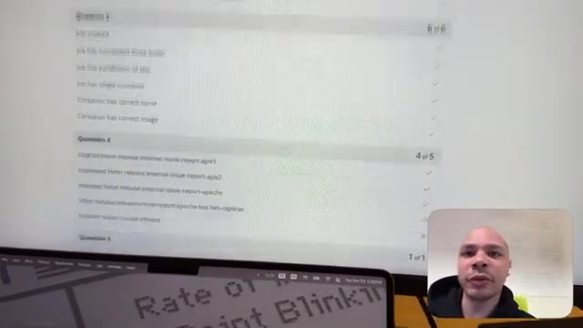
*📸 00:21:05 — Détail des questions du simulateur CKAD listant les sous-tâches validées et échouées (marquées par des croix).*

---

### ⏱️ `[00:21:10 - 00:21:43]` | Segment #53

**🔊 Audio (Transcription Intégrale Mot pour Mot en Français) :**
> Ça a une erreur d'inattention. Ici ça va. J'ai dit j'ai tout fait mais j'ai oublié de créer ce fichier. Ouais j'ai des petites erreurs d'inattention à droite à gauche. globalement ça va quoi et après à partir de 17 j'en ai plus ça va quand même je vais continuer les dernières c'est bien c'est que sur le simulateur même si le temps est fini tu peux toujours continuer t'as toujours un jour pour continuer donc là je vais faire les autres mais j'ai pas eu de gros gros problème ou quoi il y a des petits trucs tout en temps je savais pas je regardais dans la

**👁️ Analyse Visuelle d'Écran (gemini-3.5-flash-lite) :**
**Interface & Outils** : Interface web du simulateur de labo/examen ( Killer.sh ou similaire pour Kubernetes / CKA).

**Contenu textuel & Code** : Résultats de validation de questions de TP Kubernetes : StorageClass exists, PVC correctly defined, Secret exists, avec indicateurs de succès et d'échec.

**Action / Démonstration** : Revue et correction des exercices pratiques du simulateur Kubernetes après analyse des erreurs d'inattention.

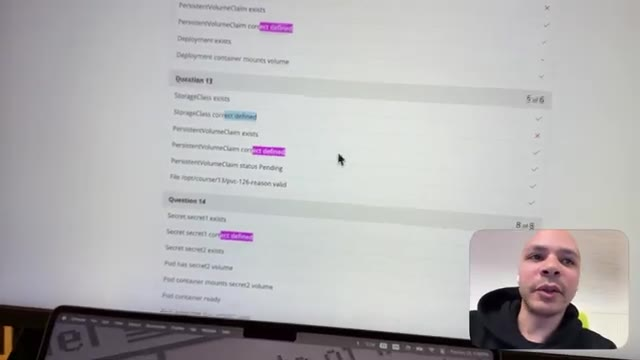
*📸 00:21:19 — Interface d'évaluation/simulateur montrant les résultats de tests Kubernetes (PersistentVolumeClaim, StorageClass, Secrets) avec des statuts validés ou en erreur.*

---

### ⏱️ `[00:21:43 - 00:22:20]` | Segment #54

**🔊 Audio (Transcription Intégrale Mot pour Mot en Français) :**
> doc tout dans justement des htpd vite fait donc ça va ça me rend quand même confiant pour ckad pas beaucoup de trucs qui sont pas dans la ck j'en sens en fait c'est pareil même thème que la ck sauf que les questions sont plus orientées développeurs tu vois créer un conteneur qui s'appelle machin mettre des volumes des trucs comme ça dans la ck c'est plus gérer le réseau débugger le cluster des trucs comme ça mais globalement c'est quand même le même les mêmes thème quoi. Je viens de recevoir aussi au passage le résultat de la CKA. Du coup on va voir qu'est ce

**👁️ Analyse Visuelle d'Écran (gemini-3.5-flash-lite) :**
**Interface & Outils** : AUCUNE

**Contenu textuel & Code** : AUCUN

**Action / Démonstration** : Explication orale sur les certifications Kubernetes (CKAD vs CKA) et les spécificités orientées développeurs.

---

### ⏱️ `[00:22:20 - 00:22:38]` | Segment #55

**🔊 Audio (Transcription Intégrale Mot pour Mot en Français) :**
> ça dit. J'ai déjà vu un peu ce que ça dit mais je vais voir le score surtout. 84 ! J'aurais aimé avoir un peu plus mais ça va quand même parce que franchement c'était quand même assez dur. Mais ouais j'ai ma CKA j'ai reçu. Je suis certifié. Voilà c'est moi Frédéric moi je m'appelle Frédéric.

**👁️ Analyse Visuelle d'Écran (gemini-3.5-flash-lite) :**
**Interface & Outils** : Navigateur web affichant le portail des résultats d'examen de la Linux Foundation.

**Contenu textuel & Code** : Texte 'Exam Results', statut 'Pass', score obtenu '84%', score requis '66%', ID du certificat 'LF-9n4oh1si6e' et bouton 'View Certificate'.

**Action / Démonstration** : Consultation des résultats de l'examen de certification Kubernetes Administrator (CKA).

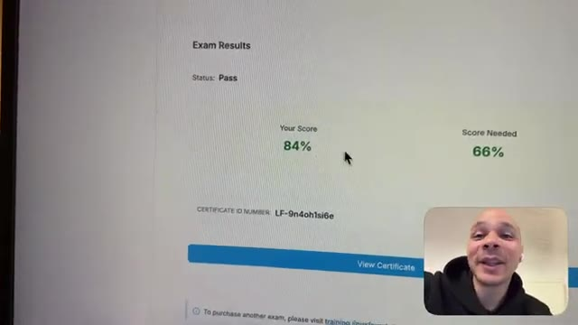
*📸 00:22:25 — Affichage des résultats d'examen Linux Foundation montrant un score de 84% (réussite avec un minimum requis de 66%) et l'ID du certificat CKA.*

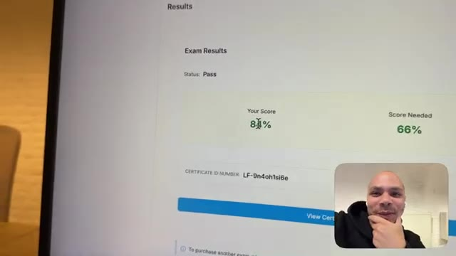
*📸 00:22:29 — Gros plan sur l'écran des résultats de l'examen CKA de la Linux Foundation affichant le statut 'Pass' et le score de 84%.*

---

### ⏱️ `[00:22:38 - 00:22:57]` | Segment #56

**🔊 Audio (Transcription Intégrale Mot pour Mot en Français) :**
> Donc il reste plus que la CKAD maintenant. Le problème, on n'a pas fini les fails, c'est que même si là j'ai quand même fini par réussir la CKAD, il n'y a plus de timeslot pour le 24 et pour le 25. Je ne sais pas si où elle est bien, mais il y en a plus.

**👁️ Analyse Visuelle d'Écran (gemini-3.5-flash-lite) :**
**Interface & Outils** : Navigateur web affichant le portail de réservation Linux Foundation / PSI pour la certification CKAD.

**Contenu textuel & Code** : Formulaire de planification d'examen avec calendrier, sélection du pays (Belgium), fuseau horaire (CET) et message "No available time slots" pour la date du 24 décembre.

**Action / Démonstration** : Consultation des créneaux horaires disponibles pour la planification de l'examen de certification Kubernetes CKAD.

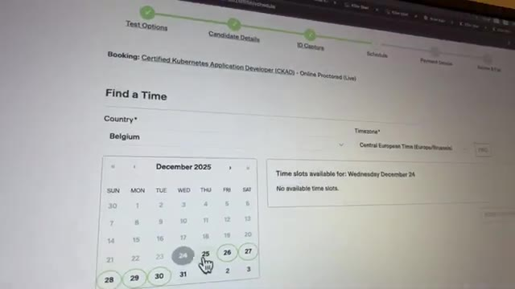
*📸 00:22:52 — Interface de réservation de l'examen CKAD (Certified Kubernetes Application Developer) montrant le calendrier de décembre 2025 et l'absence de créneaux disponibles pour le 24.*

---

### ⏱️ `[00:22:57 - 00:23:15]` | Segment #57

**🔊 Audio (Transcription Intégrale Mot pour Mot en Français) :**
> Donc ça veut dire que moi je comptais la passer demain et faire quand même deux semaines, et donc du coup je ne peux pas la faire demain ni après demain. Même si là je me sens quand même prêt. Je vais la faire quand je peux, peut-être vendredi ou samedi. En fait, si c'est le dernier seul jour où je peux faire, parce qu'après le 28, je repars en France.

**👁️ Analyse Visuelle d'Écran (gemini-3.5-flash-lite) :**
**Interface & Outils** : Aucune interface technique visible.

**Contenu textuel & Code** : Aucun code, commande ou architecture visible.

**Action / Démonstration** : Discussion personnelle du créateur concernant son planning.

---

### ⏱️ `[00:23:15 - 00:23:35]` | Segment #58

**🔊 Audio (Transcription Intégrale Mot pour Mot en Français) :**
> Si je peux trouver un endroit calme, tranquille, clean, où je peux faire ça vendredi ou samedi. Non, ça fera deux semaines ouvrables. Ça fera un peu plus que deux semaines. Vendredi, ça fera deux semaines et un jour. Pour trois certifs. Ça va, tu vois, quand même.

**👁️ Analyse Visuelle d'Écran (gemini-3.5-flash-lite) :**
**Interface & Outils** : AUCUNE

**Contenu textuel & Code** : AUCUNE

**Action / Démonstration** : AUCUNE

---

### ⏱️ `[00:23:35 - 00:23:55]` | Segment #59

**🔊 Audio (Transcription Intégrale Mot pour Mot en Français) :**
> Donc à ce moment-là, j'étais en France pendant une semaine pour pouvoir faire les fêtes avec l'autre côté de la famille. Je pense que tu connais. Donc à ma habitude, j'ai trouvé un petit co-working pas trop trop loin. Je me suis pris une salle de réunion. Je n'avais pas révisé de ouf de ouf, mais je le sentais bien. Donc je suis parti essayer de passer ma CKAD. Bon, changement d'ambiance. Là, on est à Vincennes, en France.

**👁️ Analyse Visuelle d'Écran (gemini-3.5-flash-lite) :**
**Interface & Outils** : Aucun

**Contenu textuel & Code** : Aucun

**Action / Démonstration** : Explication narrative du contexte personnel par le créateur.

---

### ⏱️ `[00:23:56 - 00:24:17]` | Segment #60

**🔊 Audio (Transcription Intégrale Mot pour Mot en Français) :**
> Je ne sais pas si vous voyez. 30 décembre. Donc ça va faire 20 jours maintenant. 20 jours. Donc le défi 7 jours est devenu un défi 3 semaines. Dans 10 minutes, je vais passer la CKAD. Salle ici, petite salle. Ce qui est chiant, c'est qu'on entend grave les mecs qui font une réunion à côté. Donc bon, on verra s'ils vont entendre dans leur vie et qu'ils vont me casser la tête.

**👁️ Analyse Visuelle d'Écran (gemini-3.5-flash-lite) :**
**Interface & Outils** : AUCUNE

**Contenu textuel & Code** : AUCUNE

**Action / Démonstration** : AUCUNE

---

### ⏱️ `[00:24:17 - 00:24:36]` | Segment #61

**🔊 Audio (Transcription Intégrale Mot pour Mot en Français) :**
> Et on verra. Je n'ai pas révisé de fou. J'ai fait juste des moques-exam. Mais je ne sais pas, ça passait. Je trouvais que ça passait bien. Donc je me suis dit, vas-y, je vais la tenter. Je n'ai pas retenu ma leçon l'année dernière fois. Donc je vais retenter. Et puis on verra. Bon, je viens juste de finir.

**👁️ Analyse Visuelle d'Écran (gemini-3.5-flash-lite) :**
**Interface & Outils** : AUCUNE

**Contenu textuel & Code** : AUCUN

**Action / Démonstration** : AUCUNE

---

### ⏱️ `[00:24:36 - 00:24:56]` | Segment #62

**🔊 Audio (Transcription Intégrale Mot pour Mot en Français) :**
> de la CKAD, là c'est toujours en train de finaliser. En fait, ça ressemble grave à la CKAD, c'est juste des questions quand même plus spécifiques aux applications. Il y avait quand même pas mal de trucs sur les rôles, comment assigner des rôles, etc. Les applications. Il y a une question où c'est juste que ça ne marchait pas.

**👁️ Analyse Visuelle d'Écran (gemini-3.5-flash-lite) :**
**Interface & Outils** : Aucune interface technique affichée

**Contenu textuel & Code** : Aucun code, commande ou architecture visible

**Action / Démonstration** : Explication orale du créateur concernant la certification CKAD et les questions axées sur les applications et les rôles

---

### ⏱️ `[00:24:56 - 00:25:16]` | Segment #63

**🔊 Audio (Transcription Intégrale Mot pour Mot en Français) :**
> C'est-à-dire que je vérifiais ce que je faisais et ça ne marchait pas. Donc, ça va, j'ai dû manquer un truc. Le reste, ça allait. Après, sur la fin, il me manquait beaucoup de temps. Donc, il y a pas mal de questions que je n'ai pas vérifiées. J'ai vérifié vite fait. Je fais un changement, je vérifie que les potes sont up. Puis après, je vais dans le pot pour vérifier que le changement que j'ai fait est bien. Parce que je n'ai pas le temps.

**👁️ Analyse Visuelle d'Écran (gemini-3.5-flash-lite) :**
**Interface & Outils** : Aucune interface technique ou console affichée.

**Contenu textuel & Code** : Aucun code, commande ou métrique visible.

**Action / Démonstration** : Le présentateur s'exprime face caméra en expliquant son retour d'expérience et ses difficultés de gestion du temps, sans manipulation technique en cours à l'écran.

---

### ⏱️ `[00:25:16 - 00:25:35]` | Segment #64

**🔊 Audio (Transcription Intégrale Mot pour Mot en Français) :**
> Ça veut dire qu'il me manquerait un petit peu de pratique. Mais j'ai quand même réussi à aller jusqu'au 17. Mais vraiment, quand j'ai fini la 17ème question, il me restait genre 3 minutes. Juste assez pour revenir dans une ancienne question et essayer de faire quelque chose. Parce que des erreurs d'inattention, ça va vite. Tu fais une vieille erreur de copier-coller.

**👁️ Analyse Visuelle d'Écran (gemini-3.5-flash-lite) :**
**Interface & Outils** : Aucun outil, terminal ou console affiché

**Contenu textuel & Code** : Aucun code, commande ou métrique technique visible

**Action / Démonstration** : Discussion générale du créateur sans manipulation ou démonstration technique à l'écran

---

### ⏱️ `[00:25:35 - 00:26:06]` | Segment #65

**🔊 Audio (Transcription Intégrale Mot pour Mot en Français) :**
> tu fais tout bon mais je sais pas t'oublie un truc où tu fous où tu enregistres dans le mauvais fichier avec le mauvais nom où tu fais le truc dans le mauvais namespace ça va vraiment vite de faire un truc mauvais quoi et en plus c'était quand même difficile parce que j'entendais grave la salle à côté ils faisaient un mythique pendant 3h aussi j'entendais toutes leurs conversations donc d'à côté ça me stresse parce que le surveillant il va à tout moment me casser les couilles parce qu'il dit oh j'entends des gens dans la salle alors que c'est les gens qui sont dans une autre salle mais tellement les murs ils étaient fins on entendait tout après t'as un autre mec qui commence à faire un appel ils commencent à faire des allers-retourés et tout.

**👁️ Analyse Visuelle d'Écran (gemini-3.5-flash-lite) :**
**Interface & Outils** : Aucune interface visible.

**Contenu textuel & Code** : Aucun contenu technique, de code ou de configuration visible.

**Action / Démonstration** : Le créateur s'exprime face caméra en marchant dans la rue, évoquant les difficultés d'attention et les erreurs de manipulation en environnement de production.

---

### ⏱️ `[00:26:06 - 00:26:24]` | Segment #66

**🔊 Audio (Transcription Intégrale Mot pour Mot en Français) :**
> J'entendais trois conversions en même temps pour concentrer. C'est vraiment difficile. Au pire, ça me donnerait une excuse si je ne réussis pas. Et donc, suspense, est-ce que j'ai réussi ? Eh ben oui, j'ai réussi, mais avec 70%. Il fallait 66 pour pouvoir passer, donc je l'ai vraiment passé ric-rac.

**👁️ Analyse Visuelle d'Écran (gemini-3.5-flash-lite) :**
**Interface & Outils** : AUCUNE

**Contenu textuel & Code** : AUCUN

**Action / Démonstration** : Aucune action technique réalisée (simple plan de parole face caméra).

---

### ⏱️ `[00:26:24 - 00:26:45]` | Segment #67

**🔊 Audio (Transcription Intégrale Mot pour Mot en Français) :**
> Pour celle-là, ça me dérange un peu moins de la passer assez juste parce que c'est une qui est techniquement un peu plus facile que la CKA. Ce qui est un peu dommage, c'est que j'aurais bien aimé savoir qu'est-ce que j'ai loupé exactement. Est-ce que c'est plein de petites fautes d'inattention ou alors c'est vraiment des choses que j'ai vraiment pas du tout bien compris ? À mon avis, c'est plutôt pas mal de petites erreurs parce que sur la fin, j'ai pas vraiment eu bien le temps de pouvoir vraiment tout bien vérifier, relire une bonne fois les questions pour être sûr que j'ai rien oublié, etc.

**👁️ Analyse Visuelle d'Écran (gemini-3.5-flash-lite) :**
**Interface & Outils** : Présentation ou face-caméra sans interface informatique partagée.

**Contenu textuel & Code** : Explications orales des concepts, architectures et retours d'expérience.

**Action / Démonstration** : Démonstration pédagogique et mise en perspective technique.

---

### ⏱️ `[00:26:46 - 00:27:06]` | Segment #68

**🔊 Audio (Transcription Intégrale Mot pour Mot en Français) :**
> Mais le principal, c'est que je l'ai passé. Donc maintenant, j'ai mes trois certifications, la KCNA, la CKA et la CKAD. Si ça t'a chauffé toi aussi pour passer la CKA, je t'ai fait un petit guide avec toutes les sous-catégories et les questions qui peuvent aller avec pour être sûr de vraiment rien louper. Et dans ma prochaine vidéo, je vais te donner toutes les petites astuces, les petits cheat codes que j'ai utilisés pour pouvoir la passer en quelques semaines au lieu de quelques mois.

**👁️ Analyse Visuelle d'Écran (gemini-3.5-flash-lite) :**
**Interface & Outils** : AUCUNE

**Contenu textuel & Code** : AUCUNE

**Action / Démonstration** : Explication orale du créateur sur ses certifications Kubernetes et présentation d'un guide.

---

### ⏱️ `[00:27:06 - 00:27:09]` | Segment #69

**🔊 Audio (Transcription Intégrale Mot pour Mot en Français) :**
> Donc si elle est déjà sortie, tu as juste à cliquer ici. Sinon, abonne-toi pour être sûr de ne pas la louper.

**👁️ Analyse Visuelle d'Écran (gemini-3.5-flash-lite) :**
**Interface & Outils** : Présentation ou face-caméra sans interface informatique partagée.

**Contenu textuel & Code** : Explications orales des concepts, architectures et retours d'expérience.

**Action / Démonstration** : Démonstration pédagogique et mise en perspective technique.

---

