# 🎬 Passe ta certif tellement facilement qu’on va t’accuser de triche

> **Chaîne** : [cocadmin](https://www.youtube.com/@cocadmin)  
> **Lien YouTube** : [https://www.youtube.com/watch?v=de0Mm9xT_2U](https://www.youtube.com/watch?v=de0Mm9xT_2U)  
> **Date de publication** : 20260219  
> **Durée** : 00:21:09  
> **Identifiant vidéo** : `de0Mm9xT_2U`  
> **Transcription & Analyse** : `whisper-v3-large-turbo+gemini-3.5-flash-lite`  

---

## 📌 Synthèse Exécutive & Outils

### 💡 Résumé

La préparation aux certifications Kubernetes exige traditionnellement des mois d'efforts et des dizaines d'heures de formation théorique. La vidéo de la chaîne *cocadmin* propose un changement radical de paradigme en détaillant une méthodologie accélérée pour réussir les examens KCNA, CKA et CKAD en seulement quelques jours. Le problème concret réside dans la procrastination, l'inefficacité des parcours d'apprentissage linéaires et la mauvaise gestion du stress ou des spécificités techniques le jour J (bogues matériels, gestion du temps, ergonomie du terminal distant).

La solution technique et organisationnelle s'articule autour d'un parcours d'apprentissage hybride et ultra-optimisé : planification impérative de la date d'examen pour s'imposer un cadre temporel, consommation accélérée des cours vidéo (x2/x3), validation rapide des acquis par des quiz ciblés, et usage intensif d'environnements de test en conditions réelles (*Killer.sh*, *Killer Coda*, *Cloud Code*). Pour l'épreuve elle-même, l'intervenant démontre des techniques chirurgicales de navigation dans la documentation officielle, l'utilisation stratégique du terminal Linux, l'évitement des pièges de configuration matérielle (comme les claviers internationaux) et la gestion granulaire des points par question pour maximiser le score.

L'impact opérationnel pour un SysAdmin, un ingénieur DevOps ou un développeur est majeur : cette approche permet non seulement d'obtenir des certifications reconnues sur le marché sans sacrifier des mois de productivité, mais elle renforce également les compétences pratiques d'ingénierie par la répétition ciblée d'exercices d'infrastructure sous contrainte de temps. L'apprentissage se transforme ainsi en un exercice d'efficacité opérationnelle pure, directement transposable aux interventions de production sur les clusters Kubernetes.

### 🛠️ Outils, Modèles & Logiciels Présentés

* **Kubernetes (KCNA, CKA, CKAD)** : Les certifications de référence de la Cloud Native Computing Foundation (CNCF) validant les compétences sur les objets, l'administration et le développement d'applications sur Kubernetes.
* **Killer.sh** : La plateforme d'examen blanc officielle fournie avec l'achat de la certification, offrant des conditions de difficulté et des sets de questions très proches de l'examen réel.
* **Killer Coda** : Une plateforme interactive gratuite proposant des scénarios d'exercices ciblés par chapitres pour réviser des points techniques spécifiques en quelques minutes.
* **Cloud Code** : Une plateforme de formation e-learning (disponible aussi sur Udemy) combinant cours écrits, vidéos et exercices pratiques par catégorie.
* **VS Code / Desktop Virtuel Linux** : Les environnements de travail et interfaces graphiques mis à disposition dans la machine virtuelle de l'examen.
* **Clipboard Manager** : Un utilitaire intégré au système Linux distant permettant de conserver un historique des copier-coller pour réutiliser des blocs de texte d'une question à l'autre.

### 🔑 Points Clés & Enseignements Stratégiques

* **Programmer la date avant tout** : Fixer une date d'examen à un mois dès le départ pour s'obliger à structurer son temps et éliminer le piège de la procrastination perpétuelle.
* **Adapter le format d'apprentissage au profil** : Privilégier les ressources écrites pour scanner rapidement ce que l'on maîtrise déjà, et réserver les cours vidéo aux sujets totalement inconnus.
* **Valider par les quiz** : Utiliser les questions d'entraînement et les quiz de fin de chapitre pour identifier immédiatement les lacunes techniques sans perdre de temps à relire l'intégralité des cours.
* **Accélération des vidéos (x2 / x3)** : Diviser par deux ou trois le temps passé sur les formations vidéo (souvent longues de 20 à 30 heures) grâce à l'utilisation de plugins de lecture rapide.
* **Tirer parti des 36 heures de session sur Killer.sh** : Lancer l'examen blanc pendant un week-end et exploiter la persistance de la session pour analyser toutes les questions à son rythme au-delà du temps imparti.
* **Préparer un environnement de test rigoureux** : Lancer le logiciel de surveillance jusqu'à 30 minutes avant l'heure prévue pour parer aux pannes techniques (caméra, micro, redémarrage d'ordinateur) et éviter l'élimination directe.
* **Valider la disposition du clavier** : Utiliser un clavier américain classique pour l'examen afin d'éviter les bugs critiques de saisie (caractères spéciaux, guillemets) causés par des configurations internationales ou françaises dans le bureau virtuel distant.
* **Ne jamais abandonner une question difficile** : Réaliser au moins les étapes simples d'une question complexe pour grappiller des points précieux, quitte à la *flaguer* et y revenir ou l'abandonner si elle est totalement hors de portée.
* **Maîtriser la navigation dans la documentation officielle** : S'entraîner en amont à trouver instantanément les bons manifestes YAML dans les sections *Concepts* ou *Tasks* de la doc Kubernetes pour éviter des recherches chronophages le jour J.
* **Tout faire via le terminal Linux** : Éviter l'utilisation de VS Code pour la manipulation des fichiers de configuration et privilégier la ligne de commande (générateurs d'objets `kubectl run --dry-client`, édition rapide).
* **Activer le gestionnaire de presse-papiers (*Clipboard Manager*)** : Utiliser l'historique de copier-coller dans l'environnement Linux distant pour réutiliser facilement des chaînes de caractères d'une question précédente.
* **Disposer d'un espace physique irréprochable** : S'isoler dans une pièce propre, sans désordre, écrans superflus ou tableaux visibles en arrière-plan pour éliminer le stress lié aux exigences des surveissants distants.

---

## ⏱️ Chronologie & Transcription Complète Audio & Visuelle (Mot pour Mot)

### ⏱️ `[00:00:00 - 00:00:18]` | Segment #01

**🔊 Audio (Transcription Intégrale Mot pour Mot en Français) :**
> Je viens juste de passer les certifications Kubernetes KCNA, CKA et CKAD et je vais te partager mes 30 petites astuces secrètes personnelles que j'ai utilisées pour pouvoir les passer en juste quelques jours au lieu de plusieurs mois. Si vous avez suivi avant, ça m'aurait sûrement évité de louper la CK la première fois. À mon avis, la toute première chose qu'il faut faire, c'est programmer son jour de passage.

**👁️ Analyse Visuelle d'Écran (gemini-3.5-flash-lite) :**
**Interface & Outils** : AUCUNE

**Contenu textuel & Code** : AUCUNE

**Action / Démonstration** : Présentation orale du sujet de la vidéo (astuces pour certifications Kubernetes).

---

### ⏱️ `[00:00:18 - 00:00:38]` | Segment #02

**🔊 Audio (Transcription Intégrale Mot pour Mot en Français) :**
> Parce que si tu ne fais pas ça, tu vas toujours avoir du temps pour pouvoir la passer, tu vas toujours remettre au lendemain et ça ne va jamais arriver. Alors que si dès début, tu te fixes une date, tu te dis « ok, je vais le faire en un mois » et que tu te mets ta date de passage dans un mois, tu n'auras pas le choix de te forcer, de trouver du temps pour pouvoir réviser, pour pouvoir le faire. Ensuite, pour les cours, tu peux trouver pas mal de ressources. Personnellement, moi j'ai trouvé que les ressources écrites sont plus efficaces pour les choses qu'on connaît déjà.

**👁️ Analyse Visuelle d'Écran (gemini-3.5-flash-lite) :**
**Interface & Outils** : AUCUNE

**Contenu textuel & Code** : AUCUN

**Action / Démonstration** : Explication orale et conseils de productivité sans manipulation d'outils techniques.

---

### ⏱️ `[00:00:39 - 00:01:02]` | Segment #03

**🔊 Audio (Transcription Intégrale Mot pour Mot en Français) :**
> Ça permet de scanner beaucoup plus vite, donc facilement pouvoir trouver exactement ce qu'on a besoin d'apprendre. Par contre, pour ce qui est des choses complètement nouvelles, c'est mieux d'avoir des ressources vidéo. C'est plus facile de suivre, de rester concentré et de comprendre avec à la fois l'image et le son. Donc si tu n'as pas du tout ou très peu d'expérience avec Kubernetes, je te conseillerais plus des cours vidéo. Si tu as quand même un peu de la bouteille, je te conseillerais de passer à travers d'abord les cours écrits et ensuite pour les trucs qui te manquent, de regarder la version vidéo.

**👁️ Analyse Visuelle d'Écran (gemini-3.5-flash-lite) :**
**Interface & Outils** : AUCUNE

**Contenu textuel & Code** : AUCUN

**Action / Démonstration** : Explication théorique sur les différents formats de ressources d'apprentissage.

---

### ⏱️ `[00:01:02 - 00:01:23]` | Segment #04

**🔊 Audio (Transcription Intégrale Mot pour Mot en Français) :**
> Au passage, pour les choses que tu connais déjà, je te conseille aussi de faire directement un quiz, de ne pas passer trop de temps à vérifier que tu connais exactement toutes les lignes du cours. Si tu fais un quiz, ça va rapidement te donner une idée de ce que tu connais, ce que tu ne connais pas et ce sur quoi il va falloir réviser un petit peu. Quand je dis un quiz, c'est les questions de la certification qui correspondent au chapitre que tu es en train de réviser. Pour ce qui est des cours vidéo, le problème c'est que ça prend beaucoup de temps à passer, c'est souvent des cours de 20h, 30h.

**👁️ Analyse Visuelle d'Écran (gemini-3.5-flash-lite) :**
**Interface & Outils** : Terminal KodeKloud Hands-On lab (Kubernetes environment) avec un prompt `controlplane ~ -> k run`.

**Contenu textuel & Code** : Commande Kubernetes tronquée : `k run`.

**Action / Démonstration** : Préparation ou exécution d'une commande de création de pod Kubernetes dans un environnement de lab interactif.

*📸 00:01:08 — Interface d'un terminal en ligne (KodeKloud Hands-On lab) montrant une ligne de commande Kubernetes avec l'alias `k run`.*

---

### ⏱️ `[00:01:23 - 00:01:52]` | Segment #05

**🔊 Audio (Transcription Intégrale Mot pour Mot en Français) :**
> Donc je te recommande absolument de t'habituer à les écouter en vitesse x2. Il y a des plugins que tu peux installer dans ton rédicateur, tu peux mettre un peu plus vite x2, x3. Mais ça c'est plus si la personne parle un peu lentement ou si tu es vraiment habitué. Mais du coup si tu fais tout en x2, tu passes de 20 à 10 heures, ça fait quand même sauver pas mal de temps. Donc déjà juste avec ces astuces, si tu programmes ta certification, ce qui fait que tu vas devoir te mettre dessus direct parce que tu as l'impression, qu'ensuite que tu fais des questions d'entraînement au lieu de direct rentrer dans les cours pour savoir exactement ce qui te manque, et qu'enfin pour les choses qui te manquent, tu les regardes en 2x ou en 3x, ça va faire passer ta période d'apprentissage de 30 heures ou plus à juste quelques jours.

**👁️ Analyse Visuelle d'Écran (gemini-3.5-flash-lite) :**
**Interface & Outils** : Aucune interface technique ou outil affiché.

**Contenu textuel & Code** : Aucun code, commande ou architecture visible.

**Action / Démonstration** : Explication orale sans manipulation ou démonstration technique.

---

### ⏱️ `[00:01:52 - 00:02:11]` | Segment #06

**🔊 Audio (Transcription Intégrale Mot pour Mot en Français) :**
> Ce qui ne fait pas de sens parce que quelques jours, c'est plus que 30 heures. Mais bon, on a compris. À juste quelques heures. Pour ce qui est des ressources, il y a évidemment Tiller.sh qui permet de passer des exams d'entraînement qui sont compris au moment où tu achètes la certification. Ce qui est cool, c'est que tu as droit à deux examens avec deux sets de questions complètement différentes. Donc tu as un groupe de 22 questions et tu as un autre groupe de 22 questions.

**👁️ Analyse Visuelle d'Écran (gemini-3.5-flash-lite) :**
**Interface & Outils** : Navigateur web affichant une plateforme de préparation aux certifications Kubernetes et Cloud Native.

**Contenu textuel & Code** : Badges et descriptifs des examens CKAD (Certified Kubernetes Application Developer) et CNPE (Certified Cloud Native Platform Engineer) avec options de simulation.

**Action / Démonstration** : Présentation des ressources d'entraînement et des simulateurs d'examens disponibles pour les certifications Kubernetes.

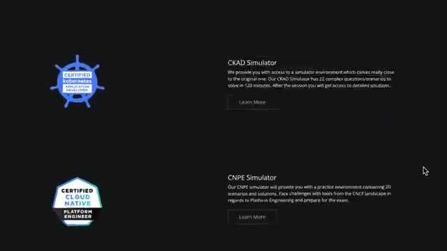
*📸 00:02:02 — Capture d'écran montrant les simulateurs d'examens Kubernetes (CKAD Simulator et CNPE Simulator) avec descriptions et badges officiels.*

---

### ⏱️ `[00:02:11 - 00:02:31]` | Segment #07

**🔊 Audio (Transcription Intégrale Mot pour Mot en Français) :**
> Et quand tu commences, tu as un compte à rebours de deux heures. Mais quand le compte à rebours expire, tu peux quand même continuer. Ça permet juste de savoir si tu as été assez rapide ou non. Mais c'est quand même cool de pouvoir continuer. Ta session reste ouverte pendant 36 heures, donc un jour et demi. Ça peut être bien de peut-être commencer pendant un week-end. Comme ça, tu peux continuer l'après-midi, le lendemain, pour vraiment passer à travers toutes les questions. Dans le passé, ces exams-là, ils étaient plus faciles que la vraie certification.

**👁️ Analyse Visuelle d'Écran (gemini-3.5-flash-lite) :**
**Interface & Outils** : Aucune interface technique, terminal ou code affiché.

**Contenu textuel & Code** : Aucun contenu technique, diagramme ou métrique visible.

**Action / Démonstration** : Explication orale sans support visuel technique à l'écran.

---

### ⏱️ `[00:02:31 - 00:02:51]` | Segment #08

**🔊 Audio (Transcription Intégrale Mot pour Mot en Français) :**
> Mais je pense que maintenant, c'est à peu près le même niveau. La seule différence, c'est que dans la vraie certification, tu vas avoir 16, 17 questions. Alors que là, dans ton exemple, tu vas avoir 22 questions. Mais sinon, en termes de difficulté, c'est quand même assez similaire. Ensuite, tu as Killer Coda, qui est très similaire à Killer.sh, où tu vas pouvoir trouver des questions plus spécifiques. Donc là, ça ne va pas vraiment être un exam entier, ça va plus être deux, trois questions sur un sujet.

**👁️ Analyse Visuelle d'Écran (gemini-3.5-flash-lite) :**
**Interface & Outils** : Navigateur web affichant la plateforme Killer Coda (KLLR CODA).

**Contenu textuel & Code** : Page d'accueil des scénarios CKA (Certified Kubernetes Administrator) avec description des exercices d'entraînement Kubernetes.

**Action / Démonstration** : Présentation de la plateforme Killer Coda et de ses fonctionnalités pour préparer la certification Kubernetes.

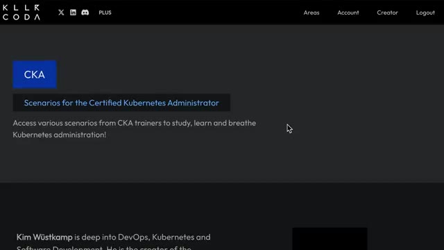
*📸 00:02:46 — Interface de la plateforme Killer Coda présentant les scénarios d'entraînement pour la certification CKA (Certified Kubernetes Administrator).*

---

### ⏱️ `[00:02:51 - 00:03:12]` | Segment #09

**🔊 Audio (Transcription Intégrale Mot pour Mot en Français) :**
> Donc ça peut être cool si tu veux réviser vraiment un chapitre en particulier, tu peux faire des questions qui sont juste pour ce chapitre-là, et ça prend juste quelques minutes, et c'est gratuit. Ensuite, pour les cours, moi j'ai utilisé Cloud Code. L'avantage, c'est que justement, ils ont les cours vidéo, mais aussi les versions écrites, donc ça permet un peu de switcher pour pouvoir aller plus vite quand on a besoin. Et ils ont aussi pas mal d'exopratiques qui sont spécifiques à chaque catégorie, donc ça permet d'être sûr qu'on a bien assimilé tous les concepts de chaque chapitre.

**👁️ Analyse Visuelle d'Écran (gemini-3.5-flash-lite) :**
**Interface & Outils** : Interface web KodeKloud (plateforme de formation certifiante Cloud/Kubernetes), schéma explicatif interactif et terminal virtuel intégré.

**Contenu textuel & Code** : Schéma du contrôleur Kubernetes illustrant les interactions entre le Node-Controller, le kube-apiserver et les nœuds worker, ainsi que la commande `kubectl get nodes` listant les workers et leur état.

**Action / Démonstration** : Explication pédagogique du fonctionnement interne de Kubernetes (architecture du Controller Manager et gestion des statuts de nœuds) dans le cadre de la préparation à la certification CKA.

*📸 00:03:02 — Interface de la plateforme KodeKloud montrant un schéma d'architecture Kubernetes (Node-Controller et kube-apiserver) pour la certification CKA, avec un menu de modules à gauche et un terminal intégré affichant `kubectl get nodes`.*

---

### ⏱️ `[00:03:12 - 00:03:31]` | Segment #10

**🔊 Audio (Transcription Intégrale Mot pour Mot en Français) :**
> La différence avec Killer.sh et Killer Coda, c'est que j'ai trouvé que les questions ressemblaient un petit peu moins à celles qu'on trouve dans la vraie certification. Celles qu'on voit sur Killer.sh, c'est vraiment le même format, c'est vraiment très très très proche de ce qu'il y a dans la vraie certification. Alors que dans Cloud Code, ils vont faire des questions qui sont plus spécifiques au chapitre, ce qui fait que parfois elles vont même être un petit peu plus difficiles que ce qu'on va voir dans la vraie certif.

**👁️ Analyse Visuelle d'Écran (gemini-3.5-flash-lite) :**
**Interface & Outils** : Aucune interface ou console affichée.

**Contenu textuel & Code** : Aucun contenu technique, code ou commande visible.

**Action / Démonstration** : Le présentateur s'exprime face caméra en expliquant les différences entre les plateformes de préparation aux certifications.

---

### ⏱️ `[00:03:31 - 00:03:50]` | Segment #11

**🔊 Audio (Transcription Intégrale Mot pour Mot en Français) :**
> Pour Cloud Code, c'est pas trop trop cher. Ils ont une espèce de version avec Kia, honnêtement, GTC, ça sert un peu à rien. Donc tu peux juste prendre l'abonnement normal, ça suffit largement. Et ce cours sur la CK, il est aussi disponible sur Udemy pour encore un petit peu moins cher. Ça dépend parce qu'il y a les promos qui changent tout le temps, mais tu peux facilement trouver à 10, 15 balles. Et je pense que ça te donne droit aux labs qui sont sur Cloud Code aussi.

**👁️ Analyse Visuelle d'Écran (gemini-3.5-flash-lite) :**
**Interface & Outils** : Navigateur web affichant la plateforme d'apprentissage en ligne Udemy.

**Contenu textuel & Code** : Page de cours Udemy pour la certification CKA (Certified Kubernetes Administrator) avec les détails de notation (4.7/5), le nombre d'apprenants (414k+) et les options d'achat/abonnement (12,99 €).

**Action / Démonstration** : Présentation visuelle de la plateforme Udemy et du cours de préparation à la certification CKA recommandé pendant la discussion.

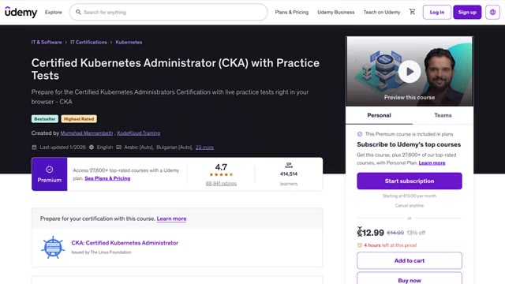
*📸 00:03:45 — Capture d'écran du navigateur affichant la page Udemy du cours 'Certified Kubernetes Administrator (CKA) with Practice Tests' créé par Mumshad Mannambeth (KodeKloud Training).*

---

### ⏱️ `[00:03:50 - 00:04:10]` | Segment #12

**🔊 Audio (Transcription Intégrale Mot pour Mot en Français) :**
> Et ça, c'est à vérifier. Une autre source que j'ai bien aimée aussi, c'est une que j'ai faite quand j'ai loupé ma CK pour la première fois. Je suis passé à travers toutes les catégories et sous-catégories des questions qu'il y a dans la CK. Et pour chacune de ces catégories, j'ai essayé de trouver des questions qui correspondaient. Et de cette manière, ça m'a permis d'être sûr que j'avais aucun trou dans mes connaissances, parce qu'il n'y avait pas un truc que j'ai oublié de réviser. Parce que comme du coup, je n'ai pas fait tout exactement dans l'ordre, ça se peut qu'il y ait des trucs qu'on peut oublier.

**👁️ Analyse Visuelle d'Écran (gemini-3.5-flash-lite) :**
**Interface & Outils** : Outil de mindmapping / tableau blanc interactif

**Contenu textuel & Code** : Schéma arborescent détaillant les catégories d'examen CKA : "Services & Networking", "Pod connectivity", "Network policies", avec des sous-tâches associées.

**Action / Démonstration** : Explication de la méthode de révision basée sur l'analyse exhaustive des catégories et sous-catégories de l'examen CKA.

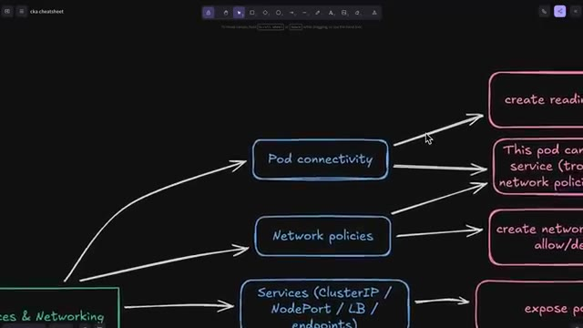
*📸 00:04:05 — Carte mentale (mindmap) montrant la catégorisation des sujets CKA (Services & Networking, Pod connectivity, Network policies) avec des exemples de questions pratiques.*

---

### ⏱️ `[00:04:11 - 00:04:36]` | Segment #13

**🔊 Audio (Transcription Intégrale Mot pour Mot en Français) :**
> Donc si ça t'intéresse, je te mets le lien dans la description pour que tu puisses regarder ça aussi. Ensuite, pour ce qui est du jour J, un des trucs les plus importants, c'est d'avoir un environnement clean, calme, avec personne qui va venir te déranger, avec pas de bordel en dessous de ton bureau ou derrière toi ou quoi. Comme ça, ça t'évite d'avoir la pression supplémentaire du surveillant qui va te dire « Ah, derrière toi, il y a un tableau, derrière toi, il y a une télé, etc. » Autre petite astuce aussi, tu peux démarrer ton examen jusqu'à 30 minutes avant la date que tu as planifiée.

**👁️ Analyse Visuelle d'Écran (gemini-3.5-flash-lite) :**
**Interface & Outils** : AUCUNE

**Contenu textuel & Code** : AUCUN

**Action / Démonstration** : Présentation orale face caméra sans manipulation technique ni affichage d'interface.

---

### ⏱️ `[00:04:36 - 00:04:58]` | Segment #14

**🔊 Audio (Transcription Intégrale Mot pour Mot en Français) :**
> Moi, je te conseille de le démarrer avant parce que moi, ça m'est arrivé la première fois que j'ai passé ma CK, que mon ordi bug, que mon micro ne marche pas et que j'ai besoin de redémarrer mon ordi. Donc, ça m'a rajouté encore plus de stress parce que 30 minutes après la date que tu as programmée, tu ne peux plus passer la certification du tout. Ça te compte comme si tu avais loupé. Donc, ce n'est pas la fin du monde parce que tu as droit à deux passages et ce serait bête de perdre un passage juste parce que tu arrivais un peu en retard.

**👁️ Analyse Visuelle d'Écran (gemini-3.5-flash-lite) :**
**Interface & Outils** : AUCUNE

**Contenu textuel & Code** : AUCUN

**Action / Démonstration** : Explication orale et retour d'expérience sur le passage de la certification CKA, conseils sur la gestion du temps et des préparatifs.

---

### ⏱️ `[00:04:58 - 00:05:22]` | Segment #15

**🔊 Audio (Transcription Intégrale Mot pour Mot en Français) :**
> Un autre truc aussi qui est vraiment important, c'est de tester l'environnement. Tu as deux moyens de le tester. La première façon, c'est justement sur Killer.sh, comme on a vu, qui va être vraiment très similaire à l'environnement que tu vas avoir dans la certification. Ça permet de t'habituer à être en remote desktop, à utiliser le contrôle HIV, etc. Mais tu peux aussi faire un test avec le vrai logiciel de test pour être sûr qu'il fonctionne sur ton ordi, qu'il s'installe bien, qu'il est bien mis à jour, que ta webcam est bien détectée, que ton micro fonctionne, etc.

**👁️ Analyse Visuelle d'Écran (gemini-3.5-flash-lite) :**
**Interface & Outils** : Navigateur web avec l'interface Killer.sh (CKA Simulator A), terminal Linux, panneau de questions d'examen Kubernetes.

**Contenu textuel & Code** : Commandes Linux et Kubernetes (`ls /`, `k get svc`), affichage des services Kubernetes (ClusterIP 10.96.0.1) et consignes d'exercice de certification CKA.

**Action / Démonstration** : Démonstration de l'environnement de test Killer.sh simulant l'interface de l'examen Kubernetes CKA avec un terminal et des exercices pratiques.

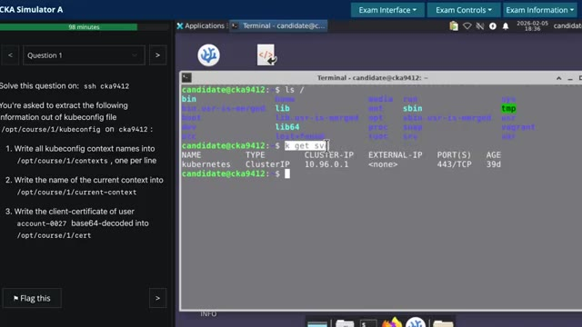
*📸 00:05:10 — Interface de simulation Killer.sh pour la certification CKA affichant un panneau de questions à gauche et un terminal Linux interactif à droite.*

---

### ⏱️ `[00:05:23 - 00:05:58]` | Segment #16

**🔊 Audio (Transcription Intégrale Mot pour Mot en Français) :**
> Donc ça, je te conseille de le faire peut-être la veille ou quelque chose comme ça. Comme ça, tu es sûr que l'ordi que tu vas utiliser pour la certification fonctionne bien que tu es bien habitué etc par exemple moi je me suis rendu compte que j'utilisais un clavier américain international et donc les guillemets ça marchait pas dans la machine virtuelle en remote desktop que on confondit même si j'avais deux coureurs salles le jour de l'examen j'étais niqué je pouvais juste pas faire de guillemets genre j'allais perdre vraiment en plein de points à cause de ça donc pour le coup c'était comme moi je te conseille d'utiliser un clavier américain classique c'est un clavier français ou un clavier spécial test l'avant pour bien assurer que le copier coller fonctionne les caractères spéciaux fonctionnent

**👁️ Analyse Visuelle d'Écran (gemini-3.5-flash-lite) :**
**Interface & Outils** : AUCUNE

**Contenu textuel & Code** : AUCUNE

**Action / Démonstration** : Explication orale des bonnes pratiques à suivre la veille d'une certification technique.

---

### ⏱️ `[00:05:58 - 00:06:27]` | Segment #17

**🔊 Audio (Transcription Intégrale Mot pour Mot en Français) :**
> etc. Ensuite quand t'es dans la certification, la fois où j'ai passé où j'étais vraiment stressé, il y avait des questions où j'ai vraiment paniqué. J'ai lu le premier livre de la question, je me faisais « Ah ouais ça c'est mort, je connais pas c'est trop dur ». Je passais à la question suivante. Alors que si tu réussis même juste des petites étapes de la question, ça compte pour des points. Donc ça vaut le coup, même pour une question qui a l'air super dure ou quoi, d'au moins essayer pour voir ce que tu peux faire dedans pour pouvoir récupérer le maximum de points possible. Si par contre tu vois que la question c'est vraiment ça concerne quelque chose que t'as jamais vu, que t'as jamais fait, mieux c'est vraiment de la flaguer et de passer à la suivante parce que tu vas perdre vraiment trop de temps à aller dans la documentation etc.

**👁️ Analyse Visuelle d'Écran (gemini-3.5-flash-lite) :**
**Interface & Outils** : Interface de quiz/examen technique (type Killer.sh ou plateforme de lab Kubernetes).

**Contenu textuel & Code** : Instructions d'exercice Kubernetes : extraction de contextes kubeconfig, nom du contexte courant, et décodage base64 de certificat client.

**Action / Démonstration** : Présentation d'un exemple concret de question d'examen de certification Kubernetes (CKA).

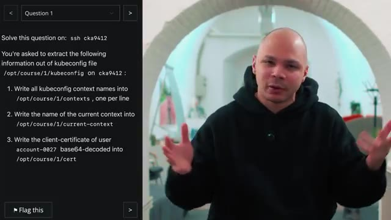
*📸 00:06:05 — Question d'examen CKA (Certified Kubernetes Administrator) affichée à l'écran concernant l'extraction d'informations d'un fichier kubeconfig.*

---

### ⏱️ `[00:06:27 - 00:06:49]` | Segment #18

**🔊 Audio (Transcription Intégrale Mot pour Mot en Français) :**
> Et en parlant de documentation, il faut justement que tu t'entraînes à aller chercher dans la documentation. Parce que tu as droit à la doc pendant la certification, sauf que si c'est quelque chose que tu dois apprendre ou que tu dois découvrir un petit peu pendant la certif, c'est mort. Tu n'as vraiment pas beaucoup de temps pour faire toutes les questions. Donc si tu vas dans la doc, c'est parce que tu sais exactement ce que tu veux chercher, ce que tu veux aller copier dedans. Donc pour ça, je te conseille de vraiment passer du temps dans la doc pour pouvoir naviguer dedans et trouver exactement ce que tu as besoin le plus rapidement possible.

**👁️ Analyse Visuelle d'Écran (gemini-3.5-flash-lite) :**
**Interface & Outils** : Navigateur web affichant la documentation officielle Kubernetes (kubernetes.io).

**Contenu textuel & Code** : Résultats de recherche pour la requête "kind: pvc", listant des rubriques telles que Persistent Volumes, Configuration de Pods avec du stockage persistant, et erreurs de liaison PVC.

**Action / Démonstration** : Recherche rapide dans la documentation officielle Kubernetes pour trouver des exemples de manifestes PersistentVolumeClaim (PVC) en vue de la préparation d'une certification.

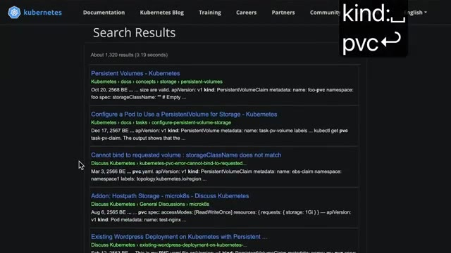
*📸 00:06:33 — Page de résultats de recherche sur le site officiel de documentation Kubernetes montrant des articles sur les Persistent Volumes et PVC.*

---

### ⏱️ `[00:06:49 - 00:07:25]` | Segment #19

**🔊 Audio (Transcription Intégrale Mot pour Mot en Français) :**
> Par exemple, il y a certains types d'objets dans Kubernetes. le plus rapide c'est d'aller dans la doc pour pouvoir copier coller du yamel pour pouvoir ensuite le coller dans ton terminal donc parfois dans la partie concept il ya des bons exemples parfois il y en a pas parfois il faut aller dans la partie tasque ou là c'est plus qu'une espèce d'exo qui a dans la doc ou là il ya des meilleurs exemples et donc ça si tu le sectes a l'habitude d'aller exactement sur le bon lien quand tu cherches quelque chose ça te fait gagner énormément temps ensuite maintenant dans le terminal ce que tu dois tout faire dans le terminal techniquement tu as accès à vs code etc mais si tu dois copier coller les trucs dans vs code franchement tu vas jamais t'en sortir donc oublie tu vas vraiment devoir tout faire dans le terminal première chose c'est d'activer le clipboard manager dans la machine virtuelle linux quota tu peux activer

**👁️ Analyse Visuelle d'Écran (gemini-3.5-flash-lite) :**
**Interface & Outils** : AUCUNE

**Contenu textuel & Code** : AUCUN

**Action / Démonstration** : Explication orale sur la structure de la documentation officielle Kubernetes (concepts et tâches).

---

### ⏱️ `[00:07:25 - 00:07:49]` | Segment #20

**🔊 Audio (Transcription Intégrale Mot pour Mot en Français) :**
> un petit programme qui permet de garder un historique de tes copier coller ce qui fait quand tu copies plusieurs choses tu peux venir coller quelque chose que tu as copié dans une question précédente par exemple ça pareil c'est quelque chose que tu peux t'entraîner à faire quand tu es dans killer.sh notre petite astuce qui fait gagner un peu de temps dans le terminal c'est d'activer la copie à la sélection donc pareil tu as dans les paramètres du terminal et c'est le tout dernier paramètre donc ça prend vraiment trois secondes à activer et ça va faire qu'à chaque fois que tu vas surligner quelque chose avec ta souris dans le terminal, ça va le copier.

**👁️ Analyse Visuelle d'Écran (gemini-3.5-flash-lite) :**
**Interface & Outils** : Interface web du simulateur CKA (killer.sh) et terminal Linux GNOME Terminal.

**Contenu textuel & Code** : Commandes de base Linux (`ls /`), menus d'édition et options de configuration du terminal.

**Action / Démonstration** : Navigation dans l'environnement d'examen CKA et configuration des options de copie/collage et du terminal.

*📸 00:07:31 — Interface de l'exercice CKA Simulator avec un terminal Linux affichant la commande `ls /`.*

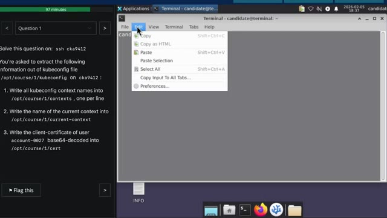
*📸 00:07:37 — Menu "Edit" ouvert dans le terminal du simulateur d'examen CKA.*

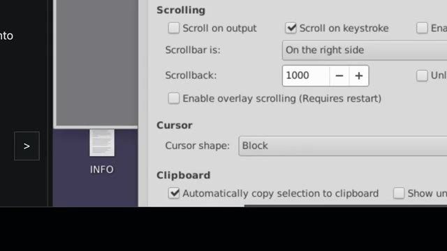
*📸 00:07:43 — Fenêtre de préférences du terminal montrant les paramètres de défilement et du presse-papiers.*

---

### ⏱️ `[00:07:49 - 00:08:14]` | Segment #21

**🔊 Audio (Transcription Intégrale Mot pour Mot en Français) :**
> Parce que comme le copier-coller dans le bureau à distance, il n'est vraiment pas très pratique. Parce que si tu es dans un navigateur, il faut juste que tu fasses CTRL-C, mais si tu es dans le terminal, il faut que tu fasses CTRL-SHIFT-C. Et parfois, ça bug, ça t'ajoute des caractères. Donc, c'est beaucoup plus pratique de juste pouvoir sélectionner ce que tu as besoin et hop, tu peux directement le coller. Une autre chose aussi, c'est de dézoomer dans le terminal avec CTRL-C. Pareil, ça prend juste une seconde. Ça permet de pouvoir voir beaucoup plus d'informations dans ton terminal, surtout si tu as un laptop avec pas un super gros écran.

**👁️ Analyse Visuelle d'Écran (gemini-3.5-flash-lite) :**
**Interface & Outils** : Terminal Linux graphique, interface de bureau distant.

**Contenu textuel & Code** : Commandes kubectl (k get pods), noms de pods Kubernetes (msg-processor, msg-worker), blocs de clés/certificats en base64.

**Action / Démonstration** : Sélection de texte directement dans le terminal pour illustrer la manipulation du copier-coller dans un environnement distant.

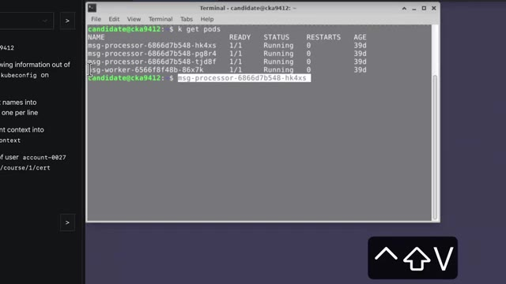
*📸 00:08:02 — Terminal Linux affichant la sortie de la commande k get pods et une sélection de texte à la souris.*

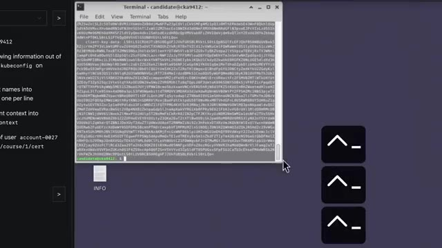
*📸 00:08:08 — Terminal Linux affichant du contenu encodé en base64 issu d'un fichier de configuration Kubernetes (kubeconfig).*

---

### ⏱️ `[00:08:14 - 00:08:51]` | Segment #22

**🔊 Audio (Transcription Intégrale Mot pour Mot en Français) :**
> pour le coup une autre astuce ça pourrait être potentiellement d'utiliser le plus grand laptop ou le plus grand écran que tu as parce que tu as vraiment pas beaucoup d'espace quand par exemple tu affiches le code yaml d'un objet ça prend facile 50 sans ligne donc si tu as un tout petit terminal c'est dur c'est dur à voir parlant de visibilité aussi un truc qui m'a pas mal gêné c'est que par défaut le fond d'écran du terminal c'est un espèce de gris foncé et la couleur de la police c'est un espèce de gris clair donc tu as un espèce de gris sur gris où tu vois pas grand chose donc un autre que je changeais aussi direct dès le début de la certif c'est de mettre le fond écran du terminal en noir et pour moi en tout cas sur mon ordi ça rendait le terminal beaucoup plus lisible en particulier quant à une police qui est plus petite ça c'est pour l'application terminale en

**👁️ Analyse Visuelle d'Écran (gemini-3.5-flash-lite) :**
**Interface & Outils** : Terminal Linux (GNOME Terminal), interface d'exercice Kubernetes / CKA.

**Contenu textuel & Code** : Fichier YAML de configuration Kubernetes affichant des certificats et clés utilisateur encodés en base64, instruction d'examen CKA dans le volet de gauche.

**Action / Démonstration** : Explication sur la nécessité d'un grand écran pour visualiser confortablement les fichiers YAML longs de Kubernetes dans le terminal.

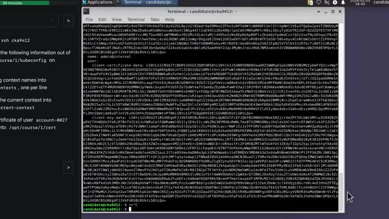
*📸 00:08:42 — Capture d'écran d'un environnement de terminal Linux affichant un fichier de configuration YAML volumineux (type kubeconfig) avec des données encodées en base64.*

---

### ⏱️ `[00:08:51 - 00:09:26]` | Segment #23

**🔊 Audio (Transcription Intégrale Mot pour Mot en Français) :**
> elle-même maintenant dans le shell une astuce qui permet de gagner pas mal de temps d'éviter de scroller parce que pareil quand tu es dans un bureau à distance le scroll bug un peu il n'est pas très doux donc le plus je peux éviter de scroller le plus ça me fait sauver du temps donc quelque chose que je fais souvent c'est d'utiliser un pageur comme laisse par exemple ce qui fait que si par exemple je vais afficher le yamel d'un objet au lieu de juste l'afficher directement dans mon terminal je fais un pipe laisse ce qui fait que ça me l'affiche dans un pager comme une espèce de lecteur de fichiers texte donc comme ça tu peux scroller au clavier soit ligne par ligne soit page par page tu peux aussi chercher le don etc et ensuite quand tu fais q tu quittes et tu retrouves ton terminal exactement la dernière commande que tu as fait

**👁️ Analyse Visuelle d'Écran (gemini-3.5-flash-lite) :**
**Interface & Outils** : Terminal Linux (GNOME Terminal ou émulateur similaire sous environnement Ubuntu/Debian pour CKA).

**Contenu textuel & Code** : Affichage d'un fichier YAML de configuration (`kubeconfig`) avec des sections utilisateurs, clusters, et des données de certificats (`client-certificate-data`, `client-key-data`).

**Action / Démonstration** : Présentation de la problématique du défilement (scroll) dans un terminal distant et introduction des commandes de pagination (`less`, `more`) pour naviguer efficacement sans utiliser la souris.

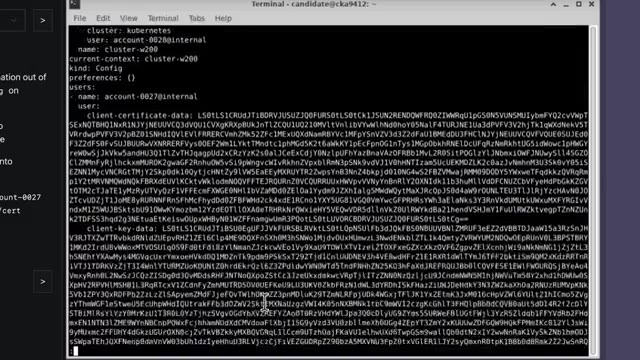
*📸 00:09:17 — Terminal Linux affichant un fichier de configuration YAML de cluster Kubernetes (Kubeconfig) contenant des données sensibles encodées en base64 (certificats et clés clients).*

---

### ⏱️ `[00:09:26 - 00:10:01]` | Segment #24

**🔊 Audio (Transcription Intégrale Mot pour Mot en Français) :**
> sans avoir à scroller 50 mille pour pouvoir voir les commandes que tu as fait juste avant donc pour moi ça fait gagner pas mal de temps ensuite même les petites astuces qui sont pas valables juste pour l'assertif mais qui aide à gagner du temps donc ça va être d'utiliser contrôler contre r ça permet de chercher dans ton historique une commande que tu as fait donc c'était vite à avoir à faire flèche du haut flèche du haut dix fois pour retrouver une commande donc si tu veux récupérer une commande dans lequel il va marquer pot dedans tu fais contrôler r pod et boum ça te la récupère direct contrôle a et contrôle e ça permet d'aller directement au début et à la fin de ta ligne comme tu es souvent en train d'éditer des longues commandes cube ctl la vitesse du curseur par défaut elle est vraiment lente donc si tu dois faire gauche gauche gauche gauche ou droit droit

**👁️ Analyse Visuelle d'Écran (gemini-3.5-flash-lite) :**
**Interface & Outils** : Terminal Linux (bash/sh), interface d'examen (CKA).

**Contenu textuel & Code** : Commande `cat /opt/course/1/kubeconfig | less` dans le terminal.

**Action / Démonstration** : Démonstration de l'affichage d'un fichier de configuration Kubernetes de manière paginée dans le terminal.

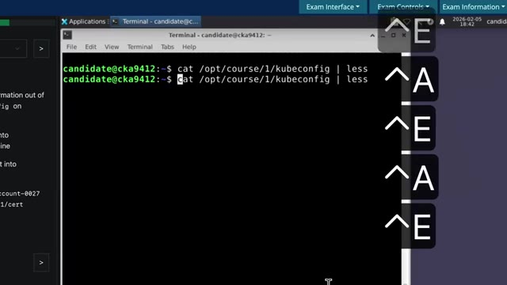
*📸 00:09:52 — Terminal Linux montrant l'utilisation de la commande cat avec redirection vers less pour afficher un fichier de configuration Kubernetes.*

---

### ⏱️ `[00:10:01 - 00:10:36]` | Segment #25

**🔊 Audio (Transcription Intégrale Mot pour Mot en Français) :**
> droit droit droit pour pouvoir aller d'un côté ou de l'autre de ta commande tu vas perdre énormément de temps. Échap point c'est aussi un raccourci que j'utilise tout le temps qui permet de récupérer le dernier argument de la commande précédente. Donc si par exemple tu viens de créer un fichier YAML avec VI et le nom du fichier et le nom du fichier peut-être qui peut être un peu long parce qu'il y a son chemin etc. Ensuite si tu veux l'appliquer tu fais kubectl apply-f et là tu fais échap point et ça te copie tout le chemin du fichier que tu viens d'éditer et ça te le met dans ta commande actuelle. Par là ça te fait gagner un petit peu de temps. Un autre raccourci qui ne sert pas super souvent mais que dans une ou deux questions peut être utile c'est sudo point exclamation point exclamation et ça permet si tu as fait une commande et que tu as oublié de la

**👁️ Analyse Visuelle d'Écran (gemini-3.5-flash-lite) :**
**Interface & Outils** : Aucun terminal, console ou interface logicielle visible.

**Contenu textuel & Code** : Aucun code, commande ou métrique visible (discussion théorique sur des raccourcis shell).

**Action / Démonstration** : Explication orale par le créateur sur l'utilisation de raccourcis clavier Linux/Bash (Échap + point pour récupérer le dernier argument).

---

### ⏱️ `[00:10:36 - 00:11:10]` | Segment #26

**🔊 Audio (Transcription Intégrale Mot pour Mot en Français) :**
> faire en sudo parce que par exemple tu voulais redémarrer un service site en train de débuguer un club led par exemple chose comme ça au lieu d'avoir à le retapper toute la commande et de mettre sudo au départ tu peux juste faire sudo pour l'exclamation point exclamation et ça va trop faire la dernière commande que tu as fait mais en mode sudo aussi est souvent des questions du style créer un petit script qui vous permet de récupérer l'état des pods dans tel namespace et enregistrer le à tel endroit est ce que je faisais au départ je faisais ma commande pour pouvoir faire mon script une fois que ça marchait je copiais et ensuite j'ouvrais mon fichier et je venais de coller ça peut perdre un petit peu de temps parce que même si j'ai la copie à la sélection automatique c'est si tu sélectionne mal oublié un caractère au début ou à la fin que je suis comme

**👁️ Analyse Visuelle d'Écran (gemini-3.5-flash-lite) :**
**Interface & Outils** : Terminal Linux / GNOME Terminal avec interface graphique de bureau.

**Contenu textuel & Code** : Commande `systemctl restart kubelet` demandant une authentification par mot ainsi que le prompt `candidate@cka9412:~$`.

**Action / Démonstration** : Exécution d'une commande systemctl sur un service critique (kubelet) nécessitant des privilèges d'administration.

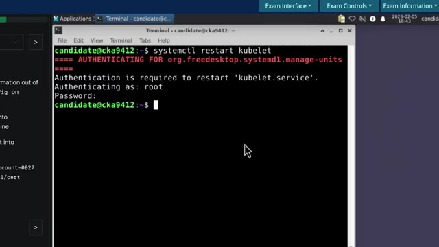
*📸 00:10:45 — Terminal Linux affichant une invite de commande et l'exécution d'une commande systemctl nécessitant une authentification root.*

---

### ⏱️ `[00:11:10 - 00:11:32]` | Segment #27

**🔊 Audio (Transcription Intégrale Mot pour Mot en Français) :**
> ça c'est trop que tu peux te faire avoir bêtement parce que tu avais la bonne commande mais juste d'ailleurs il manquait un caractère que juste comme ça donc pour éviter ça maintenant ce que je fais une fois que ma commande et fonctionne bien eh ben je vais au début de ma commande avec contrôle a et je fais juste écho guillemets je vais à la fin avec contrôle e je rajoute un guillemet et ensuite je rajoute chevron et le chemin vers lequel ils veulent que tu enregistres ton script Si je fais comme maintenant, je suis sûr que ça va être exactement la bonne commande que je vais mettre dans mon fichier.

**👁️ Analyse Visuelle d'Écran (gemini-3.5-flash-lite) :**
**Interface & Outils** : Terminal Linux interactif au sein d'une interface d'examen (type CKA/Killer.sh).

**Contenu textuel & Code** : Commandes affichées : `k get deploy -n default` et `echo "k get deploy -n default"`.

**Action / Démonstration** : Explication et démonstration de la technique d'encapsulation par des guillemets pour sécuriser ou inspecter une commande avant exécution.

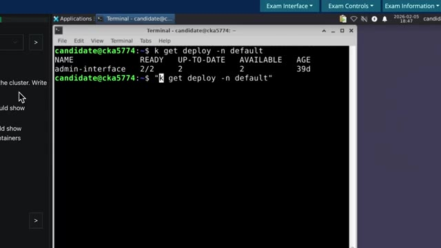
*📸 00:11:21 — Démonstration dans un terminal Linux de l'encapsulation d'une commande Kubernetes (kubectl abrégé en 'k') entre des guillemets précédés de la commande 'echo'.*

---

### ⏱️ `[00:11:32 - 00:11:50]` | Segment #28

**🔊 Audio (Transcription Intégrale Mot pour Mot en Français) :**
> Et je n'ai pas besoin d'utiliser copier-coller. Et je peux ensuite derrière exécuter mon fichier pour être vraiment sûr que tout a bien fonctionné, que ça fait bien ce que je fais. Et comme ça, je suis serein. Un truc aussi qui m'a aidé, c'est que sur mon Mac, j'ai inversé la touche Fn et la touche Control. Comme ça, la touche Control est au même endroit que sur les claviers sur PC. Et c'est aussi un peu plus facile pour pouvoir faire des Ctrl-C, Ctrl-V, Ctrl-Shift-C, etc.

**👁️ Analyse Visuelle d'Écran (gemini-3.5-flash-lite) :**
**Interface & Outils** : macOS System Settings (Préférences Système / Réglages du Clavier) et terminal Bash en arrière-plan.

**Contenu textuel & Code** : Fenêtre de configuration macOS affichant les options du clavier (raccourcis, touches de fonction, touches de modification) et lignes de commande Bash dans le terminal sous-jacent.

**Action / Démonstration** : Configuration des paramètres clavier sur macOS, ciblant la modification des touches (Fn et Control) tel qu'expliqué dans le discours.

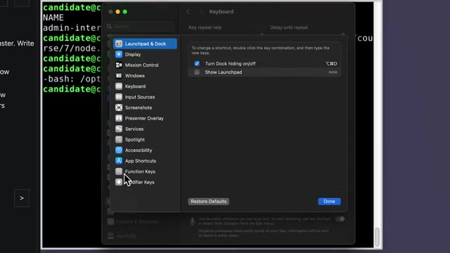
*📸 00:11:41 — Capture d'écran montrant les réglages Système de macOS avec le panneau de configuration du clavier ouvert au premier plan, superposé à un terminal en arrière-plan.*

---

### ⏱️ `[00:11:51 - 00:12:10]` | Segment #29

**🔊 Audio (Transcription Intégrale Mot pour Mot en Français) :**
> C'est quelque chose qui m'a aidé un peu dans la certification, mais que je te recommande même en dehors. parce que la touche contrôle, je trouve qu'elle est vraiment mal placée sur les claviers des MacBooks. Donc tout ça, c'était pour l'échelle. Maintenant, pour KubeCTL en particulier, ça va être vraiment la commande que tu vas utiliser 50 000 fois dans l'adcertif. Il va souvent te demander de créer des objets, créer des pods, créer des déploiements, créer des services, des ingress, des choses comme ça.

**👁️ Analyse Visuelle d'Écran (gemini-3.5-flash-lite) :**
**Interface & Outils** : Aucune interface ou terminal affiché.

**Contenu textuel & Code** : Aucun code, commande ou métrique visible.

**Action / Démonstration** : Explication orale sur l'ergonomie des claviers MacBook et l'utilisation intensive de la commande kubectl.

---

### ⏱️ `[00:12:10 - 00:12:30]` | Segment #30

**🔊 Audio (Transcription Intégrale Mot pour Mot en Français) :**
> À aucun moment, tu dois écrire des YAML à la main. Ça, c'est d'être, c'est trop facile de faire des erreurs, c'est trop dur de retenir ça de tête. Donc il faut toujours que tu partes de quelque chose qui est déjà fait. Donc il faut vraiment que tu connaisses par cœur les méthodes qui permettent de créer tous ces types d'objets qu'on peut te demander de faire dans l'assertif. Donc pour ça, tu dois utiliser kubectl create. Ça, ça permet de créer déjà une bonne partie des objets qu'on peut te demander.

**👁️ Analyse Visuelle d'Écran (gemini-3.5-flash-lite) :**
**Interface & Outils** : Aucune interface, terminal ou outil technique visible à l'écran.

**Contenu textuel & Code** : Aucun code, commande, architecture ou métrique affiché.

**Action / Démonstration** : Explication orale sur les bonnes pratiques d'infrastructure (évitement de la saisie manuelle de fichiers YAML).

---

### ⏱️ `[00:12:30 - 00:12:53]` | Segment #31

**🔊 Audio (Transcription Intégrale Mot pour Mot en Français) :**
> Tu as aussi run, ça qui va pouvoir te permettre de créer des pods. Et tu as aussi expose, qui va permettre de créer des services. Techniquement, tu peux aussi faire create service. Mais expose, je crois que ça permet directement de faire un service de type cluster IP. Donc ça peut être un petit peu plus rapide si tu sais exactement ce que tu veux faire. Il y a certains types d'objets Kubernetes que tu ne peux pas faire avec kubectl. Et donc pour cela, il faut absolument que tu saches exactement où chercher et quoi taper dans la barre de recherche de la documentation.

**👁️ Analyse Visuelle d'Écran (gemini-3.5-flash-lite) :**
**Interface & Outils** : AUCUNE

**Contenu textuel & Code** : AUCUNE

**Action / Démonstration** : Explication théorique des commandes Kubernetes `kubectl run` et `kubectl expose` par le formateur.

---

### ⏱️ `[00:12:53 - 00:13:13]` | Segment #32

**🔊 Audio (Transcription Intégrale Mot pour Mot en Français) :**
> pour pouvoir trouver directement un bon exemple de ce que tu as besoin. Donc souvent pour ce qui est autour des volumes, les physicals, volumes claims, etc., tu vas devoir aller dans la doc. Pour ce qui est des alias, ce n'était pas le cas avant, mais maintenant, il y a un alias qui est déjà activé qui permet juste de faire K au lieu de Cube, CTL. Et donc ça, dans Killer.sh et aussi dans le vrai environnement de certification, c'est déjà ajouté. L'autocomplétion est aussi déjà activée.

**👁️ Analyse Visuelle d'Écran (gemini-3.5-flash-lite) :**
**Interface & Outils** : Aucune (prise de vue face-caméra uniquement).

**Contenu textuel & Code** : Aucun (discussion orale sur les alias Kubernetes, notamment `k` pour `kubectl`, et la recherche de configurations de volumes dans la documentation).

**Action / Démonstration** : Explication orale concernant l'utilisation des alias préconfigurés et la recherche d'exemples de Physical Volumes et Volume Claims dans la documentation Kubernetes officielle.

---

### ⏱️ `[00:13:13 - 00:13:41]` | Segment #33

**🔊 Audio (Transcription Intégrale Mot pour Mot en Français) :**
> Avant pareil, il fallait que tu l'actives toi-même, maintenant c'est fait automatiquement. Et je te conseille de l'utiliser le maximum possible. Quand tu t'entraînes, toujours essayez de faire Tab pour pouvoir compléter le nom des namespace, le nom des pods, le nom des déploiements, etc. Si jamais tu aimes bien aussi utiliser la technique du dry run, donc pour rappel, quand tu vas créer un objet, au lieu de le créer, tu peux rajouter "-dryrun="client="yaml", ce qui permet de ne pas directement créer l'objet dans le cluster, mais de te donner le yaml qui correspondrait à cet objet, comme ça tu peux le modifier, etc.

**👁️ Analyse Visuelle d'Écran (gemini-3.5-flash-lite) :**
**Interface & Outils** : AUCUNE

**Contenu textuel & Code** : Commande Kubernetes illustrée en surimpression : `kubectl create svc mon-service --dry-run=client -o yaml`

**Action / Démonstration** : Explication théorique sur l'utilisation des commandes kubectl avec l'option dry-run pour générer des manifests YAML.

---

### ⏱️ `[00:13:42 - 00:14:03]` | Segment #34

**🔊 Audio (Transcription Intégrale Mot pour Mot en Français) :**
> Et évidemment, c'est super chiant à taper, par contre ce qui peut être bien c'est de le copier, comme ça tu l'as dans ton historique de terminal, et donc tu peux venir le récupérer facilement si jamais tu l'utilises souvent. Pour le coup, cette technique du dry run, je la déconseille un petit peu parce que je trouve qu'il y a une manière qui est beaucoup plus rapide de récupérer des YAML et de les modifier. C'est de directement créer l'objet. Donc tu fais ton kubectl create ou run ou expose, ce que tu veux.

**👁️ Analyse Visuelle d'Écran (gemini-3.5-flash-lite) :**
**Interface & Outils** : Aucune interface technique affichée.

**Contenu textuel & Code** : Aucun code, commande ou architecture visible.

**Action / Démonstration** : Explication orale sur l'utilisation de l'historique du terminal et la technique du dry run.

---

### ⏱️ `[00:14:03 - 00:14:25]` | Segment #35

**🔊 Audio (Transcription Intégrale Mot pour Mot en Français) :**
> Ça va créer l'objet. Évidemment, il ne va pas être comme tu veux. Mais ensuite, tu refais ta commande, mais au lieu de create, tu fais edit. Et donc là, ça va t'ouvrir via et tu pourras faire ta modification et enregistrer et ça va le faire directement. J'ai jamais eu de fois où je ne voulais vraiment pas le créer avant de le modifier parce qu'en général, tu le crées même s'il n'est pas correct. Ça ne cause pas vraiment de problème. Et c'est plus rapide que de rajouter le fameux tiret tiret dryrun égale client tiret O YAML, etc.

**👁️ Analyse Visuelle d'Écran (gemini-3.5-flash-lite) :**
**Interface & Outils** : Aucune interface technique ou console active visible.

**Contenu textuel & Code** : Mention textuelle de la commande "kubectl edit mon-service" en surimpression graphique.

**Action / Démonstration** : Explication orale par le créateur de la méthode pour modifier un objet Kubernetes directement après sa création.

---

### ⏱️ `[00:14:25 - 00:14:43]` | Segment #36

**🔊 Audio (Transcription Intégrale Mot pour Mot en Français) :**
> Par contre, je déconseille fortement de éditer des objets qui sont déjà créés dans le cluster qu'on t'a donné pour la question. Parce que ça m'est déjà arrivé d'éditer quelque chose et j'ai le réflexe de toujours sauvegarder ce que je fais à chaque fois que je modifie une ligne. C'est pas forcément un très bon réflexe. Et donc ça m'est arrivé d'effacer des morceaux d'un objet qui était déjà là, pré-créé.

**👁️ Analyse Visuelle d'Écran (gemini-3.5-flash-lite) :**
**Interface & Outils** : Terminal Linux (fenêtre XFCE Terminal), interface web d'examen de type Killer.sh pour la certification CKA.

**Contenu textuel & Code** : Commandes kubectl (`k get deploy`, `k get `) et énoncé d'une question d'examen sur la mise à jour d'un nœud Kubernetes.

**Action / Démonstration** : Manipulation de commandes kubectl dans un terminal pour interroger les déploiements d'un cluster Kubernetes dans le cadre d'un exercice pratique.

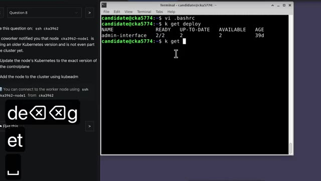
*📸 00:14:29 — Interface montrant un panneau de question d'examen Kubernetes et un terminal Linux exécutant des commandes kubectl.*

---

### ⏱️ `[00:14:44 - 00:15:12]` | Segment #37

**🔊 Audio (Transcription Intégrale Mot pour Mot en Français) :**
> Et dans la question, la plupart du temps, ça te dit ne modifiez pas les objets qui sont déjà présents ou ne modifiez pas ces parties-là, etc. Une fois que je l'avais modifié, pour pouvoir le remettre comme il était au départ, c'est super chaud. Donc ce que je te conseille, c'est si c'est des objets qui existent déjà, de faire juste un get-o-yaml et ensuite tu peux l'envoyer dans un fichier pour pouvoir faire tes motifs. Si jamais ça t'arrive de modifier un objet que tu n'aurais pas dû, tu peux regarder dans l'annotation pour pouvoir savoir exactement comment tout était configuré, pour pouvoir le réparer, mais bon, ça prend quand même pas mal de temps à faire, c'est ce que j'ai fini par faire.

**👁️ Analyse Visuelle d'Écran (gemini-3.5-flash-lite) :**
**Interface & Outils** : Aucune interface technique active (simple incrustation textuelle de sous-titre/commande).

**Contenu textuel & Code** : Commande kubectl affichée en incrustation : `kubectl get svc mon-service -o yaml > mon-service.yaml`

**Action / Démonstration** : Explication orale sur la bonne pratique de sauvegarde d'objets Kubernetes existants avant modification, avec illustration textuelle de la commande de sauvegarde.

---

### ⏱️ `[00:15:13 - 00:15:36]` | Segment #38

**🔊 Audio (Transcription Intégrale Mot pour Mot en Français) :**
> Ça te fait perdre du temps, ça te rajoute du stress, donc le mieux c'est juste de ne jamais éditer avec kubectl edit les objets qui sont préexistants. Très souvent, on va te demander de faire des opérations dans un namespace particulier. Et donc, moi j'ai pris l'habitude de faire k-n et le nom du namespace avant même de mettre toutes les options que je veux dans ma commande. Parce qu'en fait, le-n namespace, tu peux le mettre un peu là où tu veux dans la commande, mais si tu le mets à la fin, c'est beaucoup plus difficile de réutiliser tes commandes.

**👁️ Analyse Visuelle d'Écran (gemini-3.5-flash-lite) :**
**Interface & Outils** : Aucune interface technique, terminal ou code affiché (plans de type face-caméra uniquement).

**Contenu textuel & Code** : Aucun contenu technique visuel ou ligne de commande affichée à l'écran.

**Action / Démonstration** : Explication orale sur les risques de l'utilisation de la commande "kubectl edit" sur des objets préexistants en production et sur les bonnes pratiques de gestion des namespaces.

---

### ⏱️ `[00:15:36 - 00:15:59]` | Segment #39

**🔊 Audio (Transcription Intégrale Mot pour Mot en Français) :**
> Et comme ça, quand je vais faire une nouvelle commande kubectl, même si c'est une commande qui n'a pas trop de rapport avec celle que je viens de faire, je peux quand même garder mon k-n et le nom du namespace. Alors que s'il était au milieu ou à la fin de ma commande, j'aurais dû le retaper manuellement. Ça permet encore une fois de gagner une petite seconde ou deux dans ta commande. Et souvent, ce n'est même pas tant les une ou deux secondes que tu gagnes, mais c'est aussi l'espace mental de devoir refaire des choses, retaper quelque chose, faire trois actions au lieu d'une, etc.

**👁️ Analyse Visuelle d'Écran (gemini-3.5-flash-lite) :**
**Interface & Outils** : Présentation ou face-caméra sans interface informatique partagée.

**Contenu textuel & Code** : Explications orales des concepts, architectures et retours d'expérience.

**Action / Démonstration** : Démonstration pédagogique et mise en perspective technique.

---

### ⏱️ `[00:15:59 - 00:16:17]` | Segment #40

**🔊 Audio (Transcription Intégrale Mot pour Mot en Français) :**
> Une autre chose qui est aussi très très bien important, ça m'a coûté pas mal de points dans ma CKAD, c'est de toujours vérifier ce qu'on fait. Même si tu es sûr de toi, tu penses que tu as réglé le problème, toujours faire une commande supplémentaire, un kubectl get ou un kubectl describe, pour vraiment s'assurer que la modification que tu viens de faire, elle a bien été faite, dans le bon namespace, sur le bon objet, etc.

**👁️ Analyse Visuelle d'Écran (gemini-3.5-flash-lite) :**
**Interface & Outils** : Aucune interface technique, terminal ou logiciel affiché.

**Contenu textuel & Code** : Aucun contenu technique, code ou commande visible.

**Action / Démonstration** : Explication orale de conseils pour la certification CKAD (vérification systématique des modifications).

---

### ⏱️ `[00:16:17 - 00:16:35]` | Segment #41

**🔊 Audio (Transcription Intégrale Mot pour Mot en Français) :**
> On pourrait vraiment éviter de perdre des points bêtement parce que tu n'étais pas dans bon espèce ou tu as oublié un caractère ou quelque chose comme ça. Ou si tu es en train de gérer des services ou des ingresses ou des choses comme ça, toujours faire un petit curl pour vérifier que la requête est bien passée, bien arrivée dans ton pod comme il faut, etc. Donc bref, savoir vérifier ce qu'on vient de faire, que ce qu'on vient de faire a bien été fait et fonctionne correctement.

**👁️ Analyse Visuelle d'Écran (gemini-3.5-flash-lite) :**
**Interface & Outils** : Aucune interface affichée.

**Contenu textuel & Code** : Aucun contenu technique ou de code visible.

**Action / Démonstration** : Explication orale sur les bonnes pratiques de vérification réseau (curl, services, ingresses Kubernetes).

---

### ⏱️ `[00:16:36 - 00:16:55]` | Segment #42

**🔊 Audio (Transcription Intégrale Mot pour Mot en Français) :**
> Une autre erreur que j'avais tendance à beaucoup faire et qui m'a fait perdre beaucoup de temps, c'est de ne pas lire la question en entier. Parce que souvent, je vais lire le début de la question et je vais vite vouloir commencer pour pouvoir gagner du temps. Mais en fait, en lisant la question au complet, ça permet de savoir que, par exemple, je n'ai pas besoin de créer moi-même mon fichier. Peut-être que le fichier, il existe déjà quelque part. Ou de faire attention à quelque chose en particulier parce que parfois, c'est à la fin de la question que ça nous dit attention à ne pas faire ça.

**👁️ Analyse Visuelle d'Écran (gemini-3.5-flash-lite) :**
**Interface & Outils** : Aucun outil, terminal ou interface graphique visible.

**Contenu textuel & Code** : Aucun code, commande ou architecture visible.

**Action / Démonstration** : Explication théorique/pédagogique sur la méthodologie de résolution de problèmes et de passage d'examens techniques.

---

### ⏱️ `[00:16:55 - 00:17:27]` | Segment #43

**🔊 Audio (Transcription Intégrale Mot pour Mot en Français) :**
> Donc, je pensais que je gagnais du temps en répondant à la question avant d'avoir tout le lire. Mais en fait, tu perds du temps parce que tu dois modifier ce que tu as fait. Donc, vraiment lire la question en entier avant de commencer à y répondre. Et une fois qu'on a fini d'y répondre, de relier à la fin pour s'assurer que toutes les petites erreurs qu'on peut te faites, les noms des namespaces, les noms des objets, etc., que tout matche bien pour être sûr que tu as tous les points. Maintenant, je pense que c'est super important d'être confortable dans Vim parce que comme tu fais tout dans le terminal, si tu n'es pas super confortable avec Vim ou que tu n'as pas les bonnes astuces pour pouvoir aller faire tes opérations rapidement, tu vas perdre du temps, tu vas devoir trop réfléchir et ça augmente tes chances de louper l'assertif.

**👁️ Analyse Visuelle d'Écran (gemini-3.5-flash-lite) :**
**Interface & Outils** : AUCUNE

**Contenu textuel & Code** : AUCUN

**Action / Démonstration** : Explication orale et méthodologique sur la gestion du temps lors de la lecture et de la réponse aux questions.

---

### ⏱️ `[00:17:27 - 00:17:47]` | Segment #44

**🔊 Audio (Transcription Intégrale Mot pour Mot en Français) :**
> Donc entraîne-toi avec vraiment les bases de Vim, pas besoin d'être un tueur. Ce que moi je trouve qui est le plus utile, ça va être évidemment copier-coller dans Vim avec le mouvement Y pour Yank. Je ne sais pas pourquoi il s'appelle Yank, mais en tout cas copier dans Vim, c'est Y. Donc on peut soit copier un mot avec YW, W pour Word, ou on peut copier le plus souvent une ligne avec YY, ça va nous copier toute la ligne.

**👁️ Analyse Visuelle d'Écran (gemini-3.5-flash-lite) :**
**Interface & Outils** : Terminal Linux, éditeur de texte en ligne de commande (Vim/Nano).

**Contenu textuel & Code** : Fichier de configuration YAML Kubernetes (API version apps/v1, kind: Deployment, métadonnées, replicas, selecteurs et conteneurs httpd:2-alpine).

**Action / Démonstration** : Édition et manipulation d'un manifeste de déploiement Kubernetes pour illustrer l'utilisation des commandes de base de l'éditeur de texte.

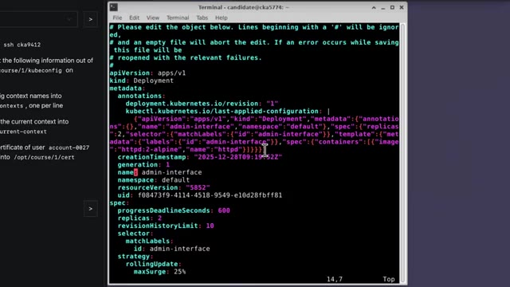
*📸 00:17:42 — Terminal Linux affichant une session d'édition d'un manifeste Kubernetes (Deployment) au format YAML.*

---

### ⏱️ `[00:17:48 - 00:18:13]` | Segment #45

**🔊 Audio (Transcription Intégrale Mot pour Mot en Français) :**
> Si on veut déplacer une ligne, donc en fait faire un espèce de couper-coller, on peut faire Delete, donc D, D, ça va nous effacer toute la ligne. Et ensuite, on peut utiliser P pour pouvoir la coller, là où on a besoin. Ça va rechercher, ça permet aussi de gagner dans un moment temps, au lieu de faire Feshjuba, Feshjuba, Feshjuba pour aller là où tu veux, et bien tu peux juste faire Slash le mot que tu cherches, ça va t'amener directement là où tu veux. Et aussi, très important, comme on gère du YAML, savoir indenter et désindenter des lignes ou carrément des blocs de lignes.

**👁️ Analyse Visuelle d'Écran (gemini-3.5-flash-lite) :**
**Interface & Outils** : Aucune interface technique ou console affichée.

**Contenu textuel & Code** : Aucun code, commande ou architecture visible.

**Action / Démonstration** : Explication orale des raccourcis clavier de Vim pour couper, copier et coller des lignes.

---

### ⏱️ `[00:18:13 - 00:18:42]` | Segment #46

**🔊 Audio (Transcription Intégrale Mot pour Mot en Français) :**
> Parce que comme tu es toujours en train de copier-coller du YAML, très souvent, des blocs de code ne sont pas tout à fait bien indentés par rapport à ce que tu as copié dans la doc ou des choses comme ça. Pour indenter juste une ligne, c'est chevron droite, chevron droite. Ou si tu veux indenter tout un bloc, tu appuies sur V pour passer en mode sélection. Tu sélectionnes tout ce que tu as besoin, et ensuite tu fais chevron juste une fois, et ça va te décaler tout ce bloc-là. Quelque chose qui sert de temps en temps, c'est que si tu fais un HTML et qu'il est mal formé, parce que tu as mal copié quelque chose, ou tu as mal indenté, ou il y a quelque chose qui bug, en tout cas, ça va souvent te dire, il y a un problème à la ligne 83.

**👁️ Analyse Visuelle d'Écran (gemini-3.5-flash-lite) :**
**Interface & Outils** : Terminal Linux, éditeur de texte Vim, interface de terminal graphique.

**Contenu textuel & Code** : Code YAML de configuration de déploiement Kubernetes (spec, containers, image, resources, restartPolicy, etc.) et indicateur de mode visuel Vim.

**Action / Démonstration** : Démonstration de l'utilisation des commandes Vim pour la sélection et l'indentation de blocs de code YAML dans un contexte Kubernetes.

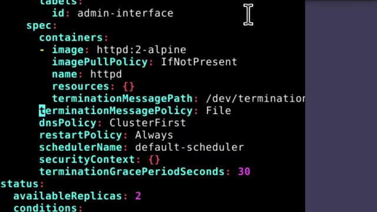
*📸 00:18:20 — Gros plan sur un éditeur de texte en ligne de commande affichant du code YAML avec des paramètres de conteneur Kubernetes (spec, containers, image httpd).*

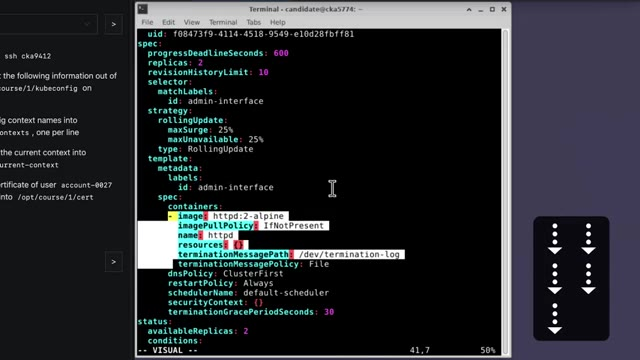
*📸 00:18:27 — Vue globale du terminal Linux en mode édition Vim montrant un fichier YAML de configuration Kubernetes avec une sélection visuelle de blocs de texte active en bas de l'écran (-- VISUAL --).*

---

### ⏱️ `[00:18:42 - 00:19:06]` | Segment #47

**🔊 Audio (Transcription Intégrale Mot pour Mot en Français) :**
> Et donc, pareil, si tu vas à la ligne 83, dans Vim, tu fais 2 points, 83, boum, ça t'amène directement là. Ça te fait gagner pas mal de temps, plutôt que de faire 83 fois flèche du bas, flèche du bas, flèche du bas. Un petit renconcer aussi qui n'est pas méga populaire, mais que j'aime bien utiliser, tu sais peut-être déjà, mais quand tu fais DW, ça va te delete un word, tu t'es effacé un mot, ou si tu fais DB, ça va te delete le mot qui est avant ton curseur, mais tu peux aussi faire DIW et ça va te effacer le mot dans lequel tu es en ce moment.

**👁️ Analyse Visuelle d'Écran (gemini-3.5-flash-lite) :**
**Interface & Outils** : Éditeur de texte / terminal avec coloration syntaxique.

**Contenu textuel & Code** : Manifeste Kubernetes au format YAML (spec de déploiement, containers, image httpd:2-alpine, imagePullPolicy, resources, dnsPolicy, restartPolicy).

**Action / Démonstration** : Explication et manipulation de fichiers de configuration pour la gestion de conteneurs.

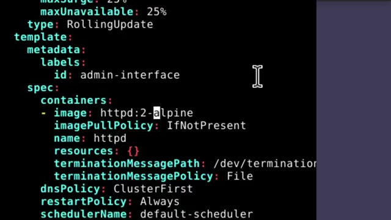
*📸 00:18:54 — Affichage d'un fichier de configuration YAML dans un éditeur (type Vim/VSCode) montrant un manifeste Kubernetes.*

---

### ⏱️ `[00:19:07 - 00:19:31]` | Segment #48

**🔊 Audio (Transcription Intégrale Mot pour Mot en Français) :**
> Donc si par exemple, tu es dans le mot Kubernetes et que tu es sur le caractère E, au lieu d'aller à la fin du mot ou au début du mot pour pouvoir faire DW, tu peux juste faire DIW et ça va t'effacer le mot dans lequel tu es en ce moment. Ça suffit parce qu'on est souvent en train d'éditer des fiches YAML et devoir remplacer des éléments à certains endroits. Un autre petit raccourci qui est un petit peu plus niche, un petit peu plus anecdotique, mais qui fait gagner pas mal de temps, c'est pouvoir incrémenter et décrémenter des chiffres.

**👁️ Analyse Visuelle d'Écran (gemini-3.5-flash-lite) :**
**Interface & Outils** : AUCUNE

**Contenu textuel & Code** : AUCUNE

**Action / Démonstration** : Explication orale de commandes Vim (raccourci diw pour supprimer un mot) pour l'édition de fichiers YAML Kubernetes.

---

### ⏱️ `[00:19:32 - 00:19:55]` | Segment #49

**🔊 Audio (Transcription Intégrale Mot pour Mot en Français) :**
> Donc avec CTRL A et CTRL X. Souvent tu vas avoir par exemple un service qui va pointer vers le port 80-80 et dans la question on va te dire qu'il faut que ça pointe vers le 80-81. Donc là, au lieu de faire flèche du bas, flèche du bas, flèche du bas pour aller jusqu'à là où il y avait 80, ensuite W, ou alors flèche droite pour aller à cet endroit-là, venir en mode insertion avec I, effacer le dernier 0, rajouter le chiffre 1, sortir du mode insertion, sauvegarder et quitter, c'est genre 5 en d'action.

**👁️ Analyse Visuelle d'Écran (gemini-3.5-flash-lite) :**
**Interface & Outils** : Terminal Linux, éditeur de texte en ligne de commande pour Kubernetes (`kubectl edit`).

**Contenu textuel & Code** : Fichier YAML de définition d'un Service Kubernetes (`apiVersion: v1`, `kind: Service`, `name: mon-service`, `port: 8080`, `targetPort: 8080`).

**Action / Démonstration** : Explication de la modification rapide d'une configuration de port dans un service Kubernetes pour remplacer le port 8080 par 8081.

*📸 00:19:43 — Terminal Linux affichant l'édition d'un fichier manifeste Kubernetes YAML (service `mon-service`) avec une configuration de port pointant vers 8080.*

---

### ⏱️ `[00:19:55 - 00:20:28]` | Segment #50

**🔊 Audio (Transcription Intégrale Mot pour Mot en Français) :**
> Tu peux simplement faire slash pour rechercher. 80 pour arriver directement où tu as besoin. Là tu fais CTRL A et ça va incrémenter 80 80, donc ça vers 80 81. Et ensuite autre petite astuce dans l'astuce, tu peux faire 2.x au lieu de faire 2.wq. Ça te fait économiser un caractère. Et donc là c'est juste trois étapes, chercher, incrémenter, quitter au lieu de 50 étapes à faire flèche flèche flèche flèche. Et si tu veux vraiment pratiquer ça un petit peu, franchement je trouve que ça vaut le coup de prendre même juste 30 minutes et utiliser Vim Tutor. Sur toutes les machines où tu as Vim installé, tu peux taper et ça va te faire un tutoriel de Vim avec des petits exercices à faire.

**👁️ Analyse Visuelle d'Écran (gemini-3.5-flash-lite) :**
**Interface & Outils** : Aucune interface technique ou console affichée.

**Contenu textuel & Code** : Aucun code, commande ou architecture visible à l'écran.

**Action / Démonstration** : Explication orale d'une astuce de manipulation textuelle ou d'édition (recherche, incrémentation et fermeture).

---

### ⏱️ `[00:20:28 - 00:20:47]` | Segment #51

**🔊 Audio (Transcription Intégrale Mot pour Mot en Français) :**
> C'est vraiment le coup de passer à travers les premiers exercices pour pouvoir se familiariser, s'habituer aux raccourcis les plus utiles et aussi découvrir des raccourcis qui sont peut-être un peu plus niches mais qui font gagner un peu plus de temps. Et comme je disais tout à l'heure, le but, c'est pas juste de devoir gagner une demi-seconde à droite ou à gauche, même si sur toute la durée de la certification, ça fait quand même gagner des précieuses minutes qui peuvent faire la différence entre passer ou louper.

**👁️ Analyse Visuelle d'Écran (gemini-3.5-flash-lite) :**
**Interface & Outils** : AUCUNE

**Contenu textuel & Code** : AUCUNE

**Action / Démonstration** : Explication orale de concepts généraux sur les raccourcis et l'efficacité, sans manipulation sur un outil.

---

### ⏱️ `[00:20:47 - 00:21:06]` | Segment #52

**🔊 Audio (Transcription Intégrale Mot pour Mot en Français) :**
> Mais c'est aussi, ça te libère un peu l'esprit. Si tu sais comment faire des actions sans réfléchir en une ou deux étapes au lieu de 10 étapes, ça te libère énormément d'espace mental pour pouvoir réfléchir à autre chose. Comme je l'ai dit tout à l'heure, je te mets en description le guide avec des exemples de questions pour chacune des sous-catégories que tu peux avoir dans la CK. Et si tu veux savoir comment ça s'est passé quand j'ai passé mes trois certifs, je te laisse aller voir cette vidéo.

**👁️ Analyse Visuelle d'Écran (gemini-3.5-flash-lite) :**
**Interface & Outils** : Application de mindmapping / tableau blanc en ligne (type Miro ou équivalent).

**Contenu textuel & Code** : Schéma heuristique (mindmap) titré "Cheat Sheet CKA cocadmin" listant les commandes et concepts Kubernetes par catégories (Storage, Troubleshooting, Cluster Architecture, Services & Networking, etc.).

**Action / Démonstration** : Présentation visuelle et explication d'une antisèche (cheat sheet) structurée pour simplifier et accélérer les actions sur Kubernetes (certification CKA).

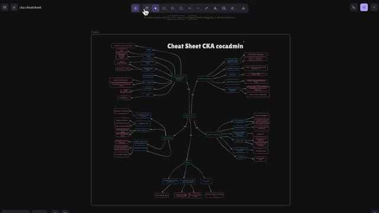
*📸 00:21:02 — Vue d'une mindmap interactive (type whiteboard/diagramme) représentant la "Cheat Sheet CKA cocadmin" structurée par thématiques Kubernetes.*

---

