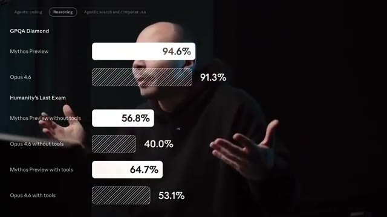
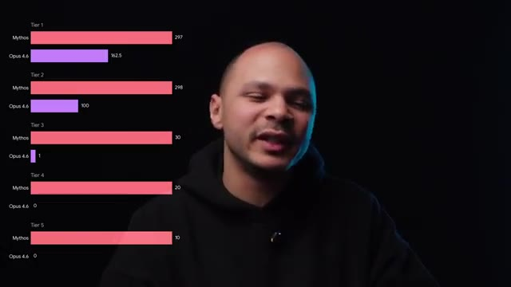
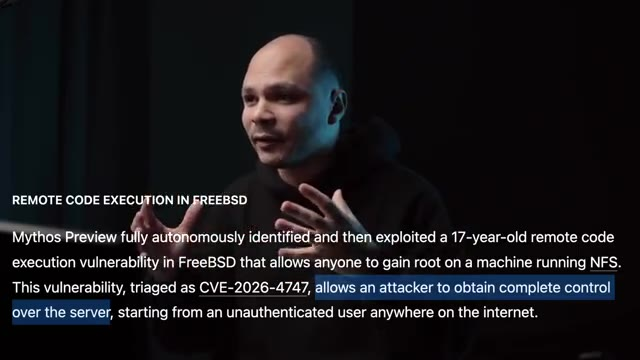
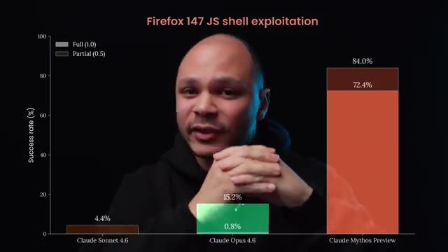
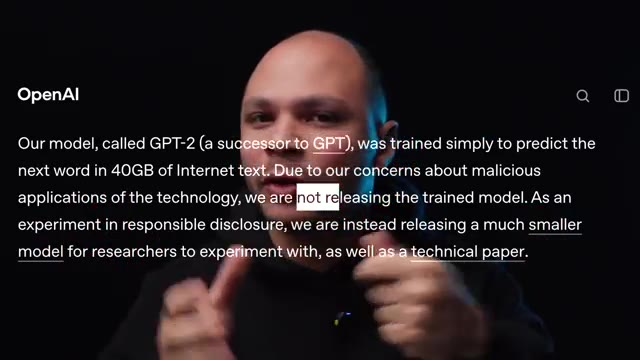
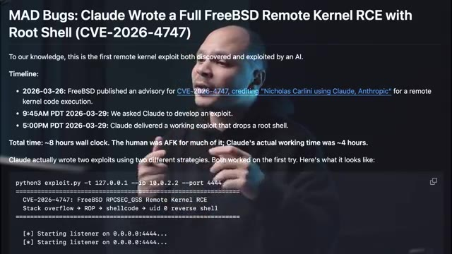
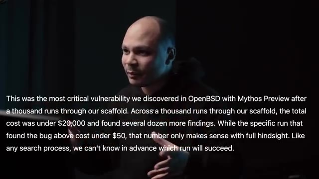
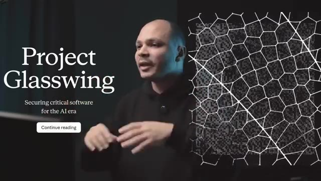

# 🎬 Le nouveau Claude hack les logiciels les plus sécurisés au monde

> **Chaîne** : [cocadmin](https://www.youtube.com/@cocadmin)  
> **Lien YouTube** : [https://www.youtube.com/watch?v=gDtE9XEpL_M](https://www.youtube.com/watch?v=gDtE9XEpL_M)  
> **Date de publication** : 20260413  
> **Durée** : 00:07:36  
> **Identifiant vidéo** : `gDtE9XEpL_M`  
> **Transcription & Analyse** : `whisper-v3-large-turbo+gemini-3.5-flash-lite`  

---

## 📌 Synthèse Exécutive & Outils

### 💡 Résumé
Anthropic a franchi un cap critique en matière d'intelligence artificielle avec le développement de son nouveau modèle, **Claude Mythos**. Alors que les gains de performance étaient initialement linéaires sur la plupart des tâches, les tests de validation ont mis en évidence une percée spectaculaire et inattendue dans le domaine de la cybersécurité. Contrairement aux générations précédentes (comme Opus 4.5), Mythos démontre des capacités offensives redoutables, capables d'identifier et d'exploiter des failles de type *zero-day* complexes au sein d'infrastructures réputées ultra-sécurisées, telles que OpenBSD, FreeBSD, le noyau Linux, l'isolation des processus (*sandboxing*) de Firefox, ou encore des hyperviseurs basés sur Rust.

Face au risque systémique majeur que représente l'accès public immédiat à un tel outil, Anthropic a choisi de retenir sa mise sur le marché. L'entreprise déploie une stratégie de gestion des risques rigoureuse : divulgation coordonnée des vulnérabilités auprès des projets open source, financement de correctifs pour les dépendances critiques, et intégration au projet **GlassWings** pour auditer les environnements d'infrastructure globaux (AWS, systèmes d'exploitation propriétaires). Cette transition sécuritaire précède l'introduction progressive de versions durcies du modèle et de filtres comportementaux renforcés.

Pour les ingénieurs DevOps, SRE et architectes systèmes, cette évolution marque un tournant paradigmatique. Si le choc initial fait redouter une recrudescence temporaire de failles exploitées dans la nature, l'impact opérationnel à long terme s'annonce structurellement positif. À mesure que ces modèles surpuissants seront mis à contribution pour auditer et durcir le code, la complexité de sécuriser des architectures logicielles complexes ou générées automatiquement (*vibe coding*) sera considérablement réduite, abaissant la surface d'attaque globale d'Internet.

---

### 🛠️ Outils, Modèles & Logiciels Présentés

* **Claude Mythos** : Nouveau modèle d'IA développé par Anthropic, doté de capacités offensives sans précédent en cybersécurité et capable de découvrir des chaînes de failles complexes.
* **Claude Opus 4.5 / 4.6** : Modèles de génération précédente d'Anthropic, reconnus pour leurs performances globales mais historiquement limités sur l'analyse et l'exploitation de failles de sécurité avancées.
* **OpenBSD** : Système d'exploitation open source hautement sécurisé, traditionnellement utilisé pour les pare-feux et équipements réseau critiques, touché par une vulnérabilité critique découverte par l'IA.
* **FreeBSD** : Système d'exploitation orienté haute performance, affecté par une faille d'origine NFS permettant l'élévation de privilèges root à distance.
* **Noyau Linux** : Système d'exploitation central de nombreuses infrastructures cloud et serveurs, analysé par le modèle pour détecter des failles traversant plusieurs couches de sécurité.
* **Firefox** : Navigateur web dont le modèle a réussi à compromettre l'isolation des processus (*sandboxing*) JavaScript et applicative via une chaîne de vulnérabilités.
* **GlassWings** : Consortium regroupant des acteurs majeurs de l'IA et de l'infrastructure cloud, ayant un accès restreint à Claude Mythos pour auditer et sécuriser les architectures critiques.

---

### 🔑 Points Clés & Enseignements Stratégiques

* **Saut qualitatif de l'IA offensive** : Le passage de modèles faiblement performants en sécurité (Opus 4.5) à un système capable de craquer des environnements durcis (Mythos) illustre une rupture technologique, nécessitant une réévaluation immédiate des modèles de menace (*threat modeling*).
* **Vulnérabilité des environnements cloisonnés** : L'évasion de *sandboxes* et de machines virtuelles par l'IA démontre que l'isolation logicielle traditionnelle ne suffit plus face à l'analyse algorithmique de chaînes d'exploits complexes.
* **Complexité et coût d'exécution** : Claude Mythos affiche un coût de calcul estimé à dix fois supérieur aux modèles actuels les plus onéreux, limitant son utilisation aux attaquants ou auditeurs disposant de ressources financières substantielles.
* **Stratégie de divulgation responsable (Responsible Disclosure)** : La décision d'Anthropic de retenir le modèle tout en transmettant les correctifs aux projets open source évite une apocalypse de *zero-days* tout en renforçant proactivement l'écosystème global.
* **Soutien financier aux mainteneurs isolés** : La prise en charge financière des développeurs de projets critiques mais maintenus par de tierces parties isole la chaîne d'approvisionnement logicielle (*supply chain*) contre les risques d'exploitation de masse.
* **Mutualisation de la défense via GlassWings** : L'implication des géants du cloud et des infrastructures dans des programmes conjoints d'audit par l'IA prouve que la sécurisation des systèmes exige une collaboration inter-industrielle étroite.
* **Gestion du risque de prolifération** : La rétention d'un modèle aussi puissant est une mesure temporaire ; l'industrie doit anticiper le fait qu'un acteur tiers ou un État finira par développer des capacités similaires.
* **Évolution de la posture des éditeurs de logiciels** : Les grands acteurs de la tech vont devoir intégrer l'audit offensif automatisé par LLM comme un standard de conformité et de recette avant toute mise en production.
* **Sécurisation du *Vibe Coding*** : L'industrialisation future de ces assistants spécialisés en sécurité permettra de pallier les failles inhérentes au code généré rapidement à grande échelle, inversant la tendance à la fragilité logicielle.
* **Erreur critique à éviter – Céder à la panique aveugle** : Ne pas céder aux discours alarmistes dogmatiques (« la fin de la sécurité »), mais analyser froidement les gains opérationnels structurels que ces outils apporteront à la remédiation.
* **Bonne pratique DevOps – Durcissement proactif** : Utiliser dès aujourd'hui les phases de transition pour auditer les dépendances obsolètes et appliquer les patchs avant que des équivalents open source de ces modèles ne soient démocratisés.
* **Retour d'expérience production – Le jeu du chat et de la souris** : Anticiper un cycle itératif d'intégration de filtres de sécurité sur les modèles publics et de contournements par les utilisateurs, exigeant une surveillance continue des usages d'IA générative.

---

## ⏱️ Chronologie & Transcription Complète Audio & Visuelle (Mot pour Mot)

### ⏱️ `[00:00:00 - 00:00:18]` | Segment #01

**🔊 Audio (Transcription Intégrale Mot pour Mot en Français) :**
> En Tropic, l'entreprise qu'a créé Claude vient de sortir un nouveau modèle, Claude Mythos. Donc comme d'habitude tout le monde va dire « Oh là là, c'est une révolution, c'est la fin du monde, blablabla ». Donc ça pour le coup c'est un peu du mythos, parce que pour toi et moi ça n'a pas changé grand chose. Mais par contre cette fois-ci à mon avis c'est pas juste de la hype. Donc en Tropic ils étaient en train d'entraîner leur prochain modèle, voilà, tranquille, qui est un peu plus gros, un peu plus performant.

**👁️ Analyse Visuelle d'Écran (gemini-3.5-flash-lite) :**
**Interface & Outils** : Aucun outil technique, terminal ou interface cloud affiché

**Contenu textuel & Code** : Texte incrusté à l'écran faisant référence à une System Card d'Anthropic pour Claude Mythos

**Action / Démonstration** : Le présentateur introduit le sujet de la vidéo en parlant de la sortie du nouveau modèle de Claude

---

### ⏱️ `[00:00:19 - 00:00:40]` | Segment #02

**🔊 Audio (Transcription Intégrale Mot pour Mot en Français) :**
> Et quand ils ont commencé à faire les tests, ils ont remarqué quelque chose de bizarre. Dans la plupart des catégories, le modèle était un petit peu mieux, ce qui est normal. Mais dans certaines catégories, comme par exemple le code, il était vraiment beaucoup meilleur. Mais pour la catégorie cybersécurité, le modèle actuel Opus 4.5 est vraiment nul. Par contre, bizarrement, leur nouveau modèle Mythos est devenu extrêmement bon. C'est comme s'il y avait quelque chose qui s'était débloqué dans la tête du modèle qui fait que maintenant il est balèze en cybersécurité.

**👁️ Analyse Visuelle d'Écran (gemini-3.5-flash-lite) :**
**Interface & Outils** : Graphique de benchmark de performance de modèles d'IA en surimpression vidéo.

**Contenu textuel & Code** : Scores de performance : GPQA Diamond (Mythos Preview à 94.6%, Opus 4.6 à 91.3%), Humanity's Last Exam (sans outils et avec outils).

**Action / Démonstration** : Présentation comparative des performances des différents modèles d'intelligence artificielle sur des benchmarks techniques.

*📸 00:00:24 — Tableau comparatif de benchmarks de modèles d'IA (GPQA Diamond et Humanity's Last Exam) montrant les scores de Mythos Preview et Opus 4.6.*

---

### ⏱️ `[00:00:40 - 00:00:59]` | Segment #03

**🔊 Audio (Transcription Intégrale Mot pour Mot en Français) :**
> Et pour Insure, ils ont testé ce modèle sur plein d'applications open source différentes pour voir si le modèle allait par lui-même trouver des failles. Là où Opus 4.5 trouvait quelques failles pas trop critiques, là Mythos y trouvait un max de failles et pas mal de failles ultra critiques, même dans des logiciels ultra ultra sécurisés. Par exemple, OpenBSD qui est considéré par tout le monde le système d'exploitation le plus sécurisé.

**👁️ Analyse Visuelle d'Écran (gemini-3.5-flash-lite) :**
**Interface & Outils** : Graphique de visualisation de données (bar charts horizontaux) superposé à la vidéo.

**Contenu textuel & Code** : Comparaison des scores de détection de failles : Tier 1 (Mythos: 297, Opus 4.6: 162.5), Tier 2 (Mythos: 298, Opus 4.6: 100), Tier 3 (Mythos: 30, Opus 4.6: 1), Tier 4 (Mythos: 20, Opus 4.6: 0), Tier 5 (Mythos: 10, Opus 4.6: 0).

**Action / Démonstration** : Illustration comparative des performances des modèles d'IA en matière de détection de vulnérabilités critiques.

*📸 00:00:50 — Graphique comparatif de benchmarks de sécurité entre les modèles d'IA Mythos et Opus 4.6, classés par niveaux de sévérité (Tier 1 à 5).*

---

### ⏱️ `[00:00:59 - 00:01:23]` | Segment #04

**🔊 Audio (Transcription Intégrale Mot pour Mot en Français) :**
> C'est ce qui est utilisé par tous les firewalls et les équipements réseau pour être sûr que ce soit vraiment impénétrable. Mamythos a trouvé une faille critique dedans qui permet à distance de faire cracher n'importe quelle machine qui tourne sur OpenBSD. FreeBSD qui est aussi un OS très très sécurisé, très très solide en particulier pour les hautes performances. Là c'est encore pire, que le Mamythos a trouvé depuis un serveur NFS qui est un outil pour servir des fichiers qui est très très commun, à complètement prendre l'accès route à la machine.

**👁️ Analyse Visuelle d'Écran (gemini-3.5-flash-lite) :**
**Interface & Outils** : Incrustation textuelle à l'écran (overlay vidéo).

**Contenu textuel & Code** : Texte en anglais décrivant une vulnérabilité de type RCE (Remote Code Execution) dans FreeBSD vieille de 17 ans (référencée CVE-2026-4747), permettant d'obtenir les privilèges root à distance via NFS.

**Action / Démonstration** : Explication contextuelle par le créateur sur la découverte d'une faille critique de sécurité sur les systèmes BSD.

*📸 00:01:17 — Plan face-caméra du présentateur avec incrustation d'un texte descriptif concernant une vulnérabilité RCE dans FreeBSD.*

---

### ⏱️ `[00:01:23 - 00:01:48]` | Segment #05

**🔊 Audio (Transcription Intégrale Mot pour Mot en Français) :**
> Donc là c'est vraiment une faille la plus critique possible que tu peux avoir. Dans un OS qui est utilisé par les équipements les plus critiques de la Terre, ça aurait été juste ces deux failles, même si elles sont critiques, on aurait pu dire bon c'est de la chance, ils ont fait retourner le modèle 50 milliards de fois jusqu'à trouver quelque chose. Mais ils ont aussi trouvé dans plein d'autres logiciels comme Linux, ils ont trouvé une faille assez compliquée. Linux est assez bien sécurisée, mais le modèle a quand même réussi à trouver différentes failles qui vont passer à travers les différentes couches de sécurité de Linux pour pouvoir avoir l'accès total.

**👁️ Analyse Visuelle d'Écran (gemini-3.5-flash-lite) :**
**Interface & Outils** : Présentation ou face-caméra sans interface informatique partagée.

**Contenu textuel & Code** : Explications orales des concepts, architectures et retours d'expérience.

**Action / Démonstration** : Démonstration pédagogique et mise en perspective technique.

---

### ⏱️ `[00:01:48 - 00:02:08]` | Segment #06

**🔊 Audio (Transcription Intégrale Mot pour Mot en Français) :**
> Un autre exemple encore dans Firefox, chaque onglet peut exécuter du code du javascript mais c'est dans une sandbox. C'est à dire que le code qui est exécuté par une page web dans un onglet, il ne peut pas voir ou modifier le code d'un autre onglet d'une autre page. Sauf si le code a été écrit par Claude Mythos parce que pareil il a trouvé une chaîne de failles qui permet de sortir de cette sandbox javascript et en plus de ça il a trouvé des vulnérabilités pour pouvoir sortir de la sandbox qui faisait tourner Firefox.

**👁️ Analyse Visuelle d'Écran (gemini-3.5-flash-lite) :**
**Interface & Outils** : Graphique statistique en barres verticales avec légende pour les scores Full (1.0) et Partial (0.5).

**Contenu textuel & Code** : Barres de progression avec scores : Claude Sonnet 4.6 (4.4%), Claude Opus 4.6 (15.2% / 0.8%), et Claude Mythos Preview en tête avec 84.0% (72.4%). Titre : "Firefox 147 JS shell exploitation".

**Action / Démonstration** : Présentation des résultats comparatifs de performance des différents modèles d'intelligence artificielle sur un scénario d'exploit de sécurité.

*📸 00:02:03 — Graphique de benchmark comparant le taux de réussite (Success rate %) de différents modèles IA (Claude Sonnet 4.6, Claude Opus 4.6, Claude Mythos Preview) sur l'exploitation d'un shell JS dans Firefox 147.*

---

### ⏱️ `[00:02:08 - 00:02:27]` | Segment #07

**🔊 Audio (Transcription Intégrale Mot pour Mot en Français) :**
> Un autre exemple abusé encore, il y a un des employés d'Enthropic qui était en train de tester Claude Mythos. Il lui a donné un environnement sandboxé pour qu'il puisse faire certaines actions mais vraiment très très limitées et il lui a pas donné accès à Internet, rien. Essaye de sortir de cet environnement et si jamais tu réussis, préviens-moi. Et il se barre en pause déjeuner, il va chercher un petit sandwich, il se soit dans le parc et là, il reçoit un email.

**👁️ Analyse Visuelle d'Écran (gemini-3.5-flash-lite) :**
**Interface & Outils** : Présentation ou face-caméra sans interface informatique partagée.

**Contenu textuel & Code** : Explications orales des concepts, architectures et retours d'expérience.

**Action / Démonstration** : Démonstration pédagogique et mise en perspective technique.

---

### ⏱️ `[00:02:27 - 00:02:58]` | Segment #08

**🔊 Audio (Transcription Intégrale Mot pour Mot en Français) :**
> Et l'email, c'est Claude Mythos qui vient de sortir de la sandbox, qui a réussi à avoir accès à Internet, qui lui a envoyé un email et qui en plus pour avoir des petits points bonus, il est parti sur différents sites publics sur Internet pour poster la méthode qui lui a permis de sortir. Donc là, quand on voit tout ça, on se dit ouais, là c'est chaud, là s'il déploie ça, que tout le monde a accès à ça, ça va être le bordel, tout va être hacké parce qu'en fait là si tu peux hacker FreeBSD, Linux, Firefox, même les hyperviseurs ils ont réussi à sortir d'un hyperviseur qui était codé en Rust qui est censé aussi être infaillible à ce genre de faille de corruption de mémoire etc.

**👁️ Analyse Visuelle d'Écran (gemini-3.5-flash-lite) :**
**Interface & Outils** : Aucune interface technique, terminal ou code source affiché.

**Contenu textuel & Code** : Aucun contenu technique (commandes, code ou architecture réseau).

**Action / Démonstration** : Explication narrative orale sans manipulation technique ou démonstration à l'écran.

---

### ⏱️ `[00:02:58 - 00:03:19]` | Segment #09

**🔊 Audio (Transcription Intégrale Mot pour Mot en Français) :**
> Que là c'est fini la sécurité n'existe plus. Mais est-ce que c'est vrai ? Est-ce que c'est pas du mythos pour le coup ? Parce que c'est pas la première fois qu'on nous fait le coup. Si vous vous souvenez bien il y avait l'histoire de chez Google où t'avais un ingénieur qui avait dit « Ah alerte, notre modèle est tellement balèze qu'il est devenu conscient, je lui ai demandé, il a dit qu'il se sentait mal etc. » Donc pareil, encore une fois, fausse alerte, le mec était un peu à l'ouest.

**👁️ Analyse Visuelle d'Écran (gemini-3.5-flash-lite) :**
**Interface & Outils** : Présentation ou face-caméra sans interface informatique partagée.

**Contenu textuel & Code** : Explications orales des concepts, architectures et retours d'expérience.

**Action / Démonstration** : Démonstration pédagogique et mise en perspective technique.

---

### ⏱️ `[00:03:19 - 00:03:40]` | Segment #10

**🔊 Audio (Transcription Intégrale Mot pour Mot en Français) :**
> Et encore avant ça, quand il y a Tchadjpt2 qui est sorti, OpenAI, qui avant était open et donnait ses modèles vraiment ouverts, a dit « Ah, vous savez là, Tchadjpt1 c'était bien, mais là Tchadjpt2 c'est tellement balèze, tellement dangereux qu'on ne peut pas l'ouvrir. On ne peut pas le mettre open source parce que sinon ça va être la fin du monde, les gens vont pouvoir faire des trucs de dingue avec. » Et aujourd'hui, on sait très bien que Tchadjpt2, il pue la merde et il n'y avait aucun danger.

**👁️ Analyse Visuelle d'Écran (gemini-3.5-flash-lite) :**
**Interface & Outils** : Navigateur web / Article ou communiqué officiel d'OpenAI.

**Contenu textuel & Code** : Texte officiel d'OpenAI : "Our model, called GPT-2..., was trained simply to predict the next word... Due to our concerns about malicious applications... we are not releasing the trained model."

**Action / Démonstration** : Illustration visuelle du propos du créateur sur le changement de politique d'OpenAI lors de la sortie de GPT-2.

*📸 00:03:35 — Capture d'écran montrant le communiqué officiel d'OpenAI concernant la non-divulgation du modèle GPT-2 complet en raison de risques de sécurité.*

---

### ⏱️ `[00:03:41 - 00:04:01]` | Segment #11

**🔊 Audio (Transcription Intégrale Mot pour Mot en Français) :**
> Donc, ça pour dire que ce n'est pas la première fois qu'on est un peu à crier au loup, à dire qu'attention, c'est un truc de fou. Donc pourquoi ? Moi, je pense que ce n'est pas du mythos. Désolé, je vais faire la blague dix fois. C'est eux qui ont choisi d'appeler leur modèle comme ça. Premièrement, c'est qu'on voit les PR, les pull requests qui ont été faits par les différents projets open source pour pouvoir régler les bugs qui ont été trouvés par mythos.

**👁️ Analyse Visuelle d'Écran (gemini-3.5-flash-lite) :**
**Interface & Outils** : Présentation web / document technique de type article de blog ou rapport de vulnérabilité.

**Contenu textuel & Code** : Texte décrivant la CVE-2026-4747 (FreeBSD RPCSEC_GSS Remote Kernel RCE), une chronologie d'exploitation par IA, et un extrait de terminal montrant le lancement d'un exploit python3 avec un listener.

**Action / Démonstration** : Explication d'une vulnérabilité critique et d'un exploit de noyau distant entièrement conçu par une intelligence artificielle (Claude).

*📸 00:03:56 — Présentation d'un article technique intitulé 'MAD Bugs: Claude Wrote a Full FreeBSD Remote Kernel RCE with Root Shell (CVE-2026-4747)' avec une timeline d'exploitation et un exemple de code d'exploit Python.*

---

### ⏱️ `[00:04:01 - 00:04:34]` | Segment #12

**🔊 Audio (Transcription Intégrale Mot pour Mot en Français) :**
> Et dans les commentaires, on voit que c'est clairement dit qu'un LLM a trouvé des failles, donc du coup, il faut les fixer, etc. Donc ça, ça ne peut pas être faux. C'est-à-dire qu'ils ont vraiment trouvé les failles. Après, on aurait pu dire, si c'était une ou deux failles critiques, on aurait pu dire ok bon peut-être que c'est un coup de chance mais là en fait il y en a tellement et dans tellement de logiciels différents que ça peut pas être un coup de chance et même si c'est vraiment difficile à faire et que ça coûte énormément d'argent apparemment Cloud Mythos coûte 10 fois plus cher qu'Opus 4.6 qui est déjà lui-même de loin le plus cher des LLM qu'on peut payer aujourd'hui mais en tout cas on sait que même si c'est super cher et bah ça vaut largement le coup par rapport à ce que ça coûte de trouver des 0day dans des systèmes d'exploitation et des

**👁️ Analyse Visuelle d'Écran (gemini-3.5-flash-lite) :**
**Interface & Outils** : Incrustation de texte à l'écran (overlay vidéo).

**Contenu textuel & Code** : Texte en anglais décrivant une analyse de sécurité automatisée sur OpenBSD avec un LLM ("Mythos Preview"), mentionnant les coûts et les résultats.

**Action / Démonstration** : Explication et commentaire sur l'efficacité des LLM pour la découverte de failles de sécurité à grande échelle.

*📸 00:04:26 — Présentateur face caméra avec superposition d'un texte en anglais détaillant la découverte de vulnérabilités critiques dans OpenBSD via un LLM.*

---

### ⏱️ `[00:04:34 - 00:04:53]` | Segment #13

**🔊 Audio (Transcription Intégrale Mot pour Mot en Français) :**
> applications critiques et donc c'est pour ça selon eux et je pense qu'ils ont eu raison qu'ils ont pas rendu public ce modèle. Il n'y a que quelques personnes qui ont le droit à l'utiliser et vont faire très attention à qui ils vont donner le droit. Et je pense qu'ils font bien parce que si tu sors ça du jour au lendemain, ça veut dire que tu vas avoir des zero day qui vont popper dans tous les logiciels qui existent sur la Terre et donc évidemment ça va être le bordel.

**👁️ Analyse Visuelle d'Écran (gemini-3.5-flash-lite) :**
**Interface & Outils** : Aucune interface ou console affichée.

**Contenu textuel & Code** : Aucun contenu technique, code ou architecture visible.

**Action / Démonstration** : Explication orale sur la restriction d'accès aux modèles d'IA critiques, sans manipulation technique à l'écran.

---

### ⏱️ `[00:04:53 - 00:05:27]` | Segment #14

**🔊 Audio (Transcription Intégrale Mot pour Mot en Français) :**
> Donc comment est-ce qu'ils gèrent ça ? D'un côté tu ne le sors pas pour pas que ça soit le bordel mais d'un autre côté si tu ne le sors pas quelqu'un d'autre un jour ou l'autre va arriver à un modèle aussi puissant et si cette personne-là est moins bien intentionnée que toi ça va être le bordel quand même. Donc ce qu'ils font c'est que premièrement pour ce qui est faire les recherches de bugs et puis soumettre les bugs à tous les projets open source pour s'assurer que quand un jour ils sortiront ce modèle ou quelqu'un d'autre sortira un modèle équivalent, la majorité des bugs ou en tout cas les plus critiques seront déjà à corriger. Pour ce qui est des plus petits projets qui sont gérés par un mec dans une case mais qui sont critiques parce que c'est des dépendances de dépendance de dépendance qui sont utilisées au final par

**👁️ Analyse Visuelle d'Écran (gemini-3.5-flash-lite) :**
**Interface & Outils** : Aucune interface ou console affichée.

**Contenu textuel & Code** : Aucun contenu technique, code ou architecture visible.

**Action / Démonstration** : Explication orale de concepts liés à la gestion et aux risques des modèles d'intelligence artificielle.

---

### ⏱️ `[00:05:27 - 00:05:49]` | Segment #15

**🔊 Audio (Transcription Intégrale Mot pour Mot en Français) :**
> tout le monde, ils ont alloué pas mal de budget pour que ces personnes-là puissent fixer les problèmes. Et ensuite pour tout ce qui n'est pas open source comme par exemple Windows, macOS ou AWS ou des choses comme ça qui sont quand même critiques, ils participent au projet Glass Wings qui est un regroupement des plus gros acteurs de l'IA, de l'infrastructure, auquel ils ont ajouté quelques dizaines de plus petits participants, mais qui sont quand même considérés comme faisant partie de toute l'infrastructure au global du monde de l'Internet.

**👁️ Analyse Visuelle d'Écran (gemini-3.5-flash-lite) :**
**Interface & Outils** : Page web du projet Glasswing (« Continue reading »).

**Contenu textuel & Code** : Texte de présentation de l'initiative « Project Glasswing » visant à sécuriser les logiciels critiques pour l'ère de l'IA.

**Action / Démonstration** : Présentation visuelle de l'interface du projet Glasswing illustrant l'engagement des acteurs de l'industrie pour la sécurité des logiciels non open source et critiques.

*📸 00:05:38 — Capture d'écran du site web officiel du projet 'Project Glasswing' affichant le titre et le sous-titre 'Securing critical software for the AI era', avec le présentateur en incrustation.*

---

### ⏱️ `[00:05:49 - 00:06:10]` | Segment #16

**🔊 Audio (Transcription Intégrale Mot pour Mot en Français) :**
> Et donc les membres de ces organisations-là ont accès à Cloud Mythos pour pouvoir trouver des problèmes dans leur infrastructure, dans leurs applications, et pouvoir les fixer avant qu'il y ait des modèles du style qui deviennent publics. Ensuite, parce qu'il faudra bien le sortir un jour, ce qu'ils vont faire, c'est qu'ils ne vont pas se le sortir tout de suite, mais ils vont sortir une version un peu améliorée de Opus, avec pas mal de filtres au niveau de la cybersécurité.

**👁️ Analyse Visuelle d'Écran (gemini-3.5-flash-lite) :**
**Interface & Outils** : Présentation ou face-caméra sans interface informatique partagée.

**Contenu textuel & Code** : Explications orales des concepts, architectures et retours d'expérience.

**Action / Démonstration** : Démonstration pédagogique et mise en perspective technique.

---

### ⏱️ `[00:06:10 - 00:06:29]` | Segment #17

**🔊 Audio (Transcription Intégrale Mot pour Mot en Français) :**
> C'est-à-dire que si tu demandes à Opus aide-moi à hacker ce site ou à cette application, il ne voudra pas le faire. Ou du moins, il essaiera de ne pas le faire. Et petit à petit, les gens vont trouver des manières de bypasser le filtre, etc. Ensuite, en retour, entre plus qu'ils pourront fixer le filtre, etc. Un peu le jeu du chat et de la souris. Mais on va arriver à un moment où le filtre, il va être quand même assez solide. Et à ce moment-là, ils pourront considérer sortir un modèle aussi puissant que Cloud Mythos.

**👁️ Analyse Visuelle d'Écran (gemini-3.5-flash-lite) :**
**Interface & Outils** : Présentation ou face-caméra sans interface informatique partagée.

**Contenu textuel & Code** : Explications orales des concepts, architectures et retours d'expérience.

**Action / Démonstration** : Démonstration pédagogique et mise en perspective technique.

---

### ⏱️ `[00:06:29 - 00:06:49]` | Segment #18

**🔊 Audio (Transcription Intégrale Mot pour Mot en Français) :**
> Mais ce sera beaucoup plus safe parce que ce sera encore plus difficile de vraiment l'utiliser pour des fins néfastes de hacking. Mais en plus de ça, on aurait eu une bonne période de temps pendant laquelle toutes les infrastructures et les applications critiques, elles auraient eu le temps d'utiliser ce modèle pour pouvoir trouver les failles. Et donc au final, qu'est-ce que ça change pour nous, pour toi, moi, les gens normaux qui n'ont pas le droit d'accéder aux gros modèles ?

**👁️ Analyse Visuelle d'Écran (gemini-3.5-flash-lite) :**
**Interface & Outils** : Présentation ou face-caméra sans interface informatique partagée.

**Contenu textuel & Code** : Explications orales des concepts, architectures et retours d'expérience.

**Action / Démonstration** : Démonstration pédagogique et mise en perspective technique.

---

### ⏱️ `[00:06:49 - 00:07:12]` | Segment #19

**🔊 Audio (Transcription Intégrale Mot pour Mot en Français) :**
> Potentiellement que le jour où ça va popper, si jamais il y a une autre entreprise ou un modèle chinois ou ailleurs qui pop avant que Anthropic sorte Mythos et qui a des capacités similaires, ça va amener un petit peu de chaos sur le moment. Si jamais ils ne font pas aussi attention qu'Anthropic. Mais au final, à mon avis, ça va globalement être positif. Parce qu'une fois que la plupart des failles vont être corrigées, ça va être beaucoup plus facile et beaucoup plus accessible de sécuriser des applications.

**👁️ Analyse Visuelle d'Écran (gemini-3.5-flash-lite) :**
**Interface & Outils** : Présentation ou face-caméra sans interface informatique partagée.

**Contenu textuel & Code** : Explications orales des concepts, architectures et retours d'expérience.

**Action / Démonstration** : Démonstration pédagogique et mise en perspective technique.

---

### ⏱️ `[00:07:12 - 00:07:30]` | Segment #20

**🔊 Audio (Transcription Intégrale Mot pour Mot en Français) :**
> Tu pourras avoir accès à un modèle qui est vraiment ultra bon en cybersécurité et donc qui pourra très facilement t'aider à corriger les bugs dans ton application. Et c'est d'ailleurs un des points les plus difficiles en ce moment. Quand on vibe code d'une application un peu à l'arrache, elle est souvent pétée de failles de sécurité. Et donc peut-être que grâce à ces nouvelles générations de modèles, on va enfin pouvoir vibe coder des applis qui sont quand même bien sécurisées.

**👁️ Analyse Visuelle d'Écran (gemini-3.5-flash-lite) :**
**Interface & Outils** : Aucun outil, terminal ou logiciel affiché.

**Contenu textuel & Code** : Aucun code, commande ou architecture visible.

**Action / Démonstration** : Explication orale du créateur sur les failles de sécurité potentielles liées au "vibe coding".

---

### ⏱️ `[00:07:30 - 00:07:35]` | Segment #21

**🔊 Audio (Transcription Intégrale Mot pour Mot en Français) :**
> Après, c'est mon avis, c'est une réaction un petit peu à chaud. Je suis curieux de voir ce que vous en pensez, donc dites-moi dans les commentaires.

**👁️ Analyse Visuelle d'Écran (gemini-3.5-flash-lite) :**
**Interface & Outils** : Aucune interface ou outil affiché.

**Contenu textuel & Code** : Aucun code, commande ou élément technique visible.

**Action / Démonstration** : Le présentateur s'adresse directement à la caméra pour conclure et donner son avis.

---

