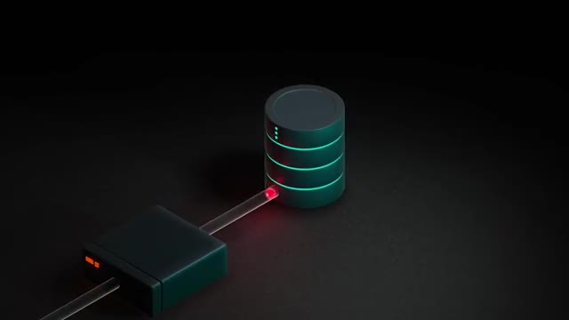
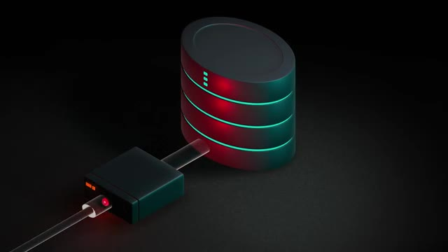
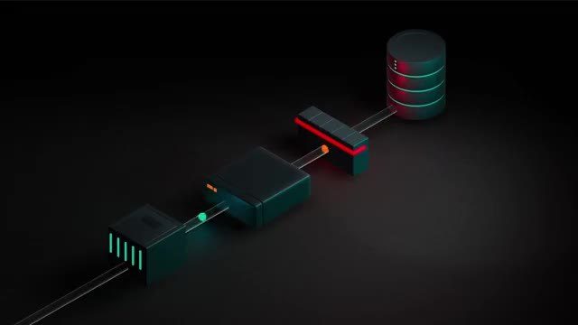
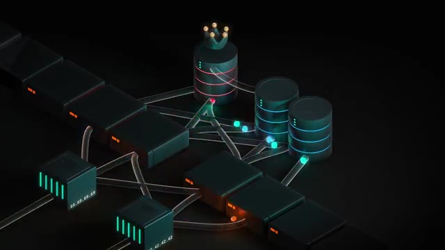
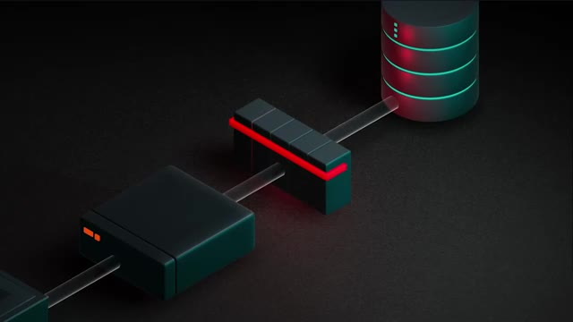

# 🎬 Comment ChatGPT tourne sur UN SEUL serveur de base de données ??

> **Chaîne** : [cocadmin](https://www.youtube.com/@cocadmin)  
> **Lien YouTube** : [https://www.youtube.com/watch?v=Awu5RoPmy-0](https://www.youtube.com/watch?v=Awu5RoPmy-0)  
> **Date de publication** : 20260417  
> **Durée** : 00:11:18  
> **Identifiant vidéo** : `Awu5RoPmy-0`  
> **Transcription & Analyse** : `whisper-v3-large-turbo+gemini-3.5-flash-lite`  

---

## 📌 Synthèse Exécutive & Outils

### 💡 Résumé

Face à une croissance fulgurante de 0 à 100 millions d'utilisateurs en un an, puis à des pics d'acquisition massifs atteignant un million de nouveaux inscrits par heure lors du lancement de fonctionnalités comme *Imagine*, OpenAI a fait face à un défi d'architecture titanesque. Alors que la couche applicative (stateless) se prête naturellement au *scaling horizontal* par simple ajout de serveurs, la persistance des données reposait sur une base de données relationnelle monolithique : PostgreSQL. Le sharding et la distribution d'une base relationnelle hautement transactionnelle représentant une refonte logicielle trop complexe et chronophage en temps de crise, OpenAI a dû faire le choix pragmatique de maintenir un unique serveur de base de données principal verticalement optimisé.

Pour éviter l'effondrement du système face à l'effet domino des requêtes expirées et des reouvertures de connexions en cascade, l'équipe a audité et optimisé le moteur relationnel en s'attaquant au talon d'Achille de PostgreSQL : le mécanisme *MVCC (Multiversion Concurrency Control)* et ses coûts d'écriture élevés. En combinant la réduction drastique des requêtes d'écriture superflues, l'adoption de *lazy writes* (regroupement par lots), la simplification des requêtes complexes, la mise en place d'une politique agressive de *rate limiting* multicouche, l'implémentation de caches en mémoire vive et l'introduction d'un routage par priorités, ils ont soulagé drastiquement la base de données. Les charges d'écriture alternatives ont quant à elles été déportées vers des solutions NoSQL managées, tandis qu'une architecture de secours (standby passive) a été mise en place pour pallier le risque de *Single Point of Failure (SPOF)*.

Pour un ingénieur DevOps ou un architecte système, ce cas d'étude illustre une leçon magistrale de résilience opérationnelle : la complexité logicielle et l'infrastructure distribuée ne doivent pas être des réflexes automatiques face à la charge. L'optimisation algorithmique des requêtes, l'ingénierie de la résilience aux frontières de l'application (rate limits, priorisation) et l'exploitation maximale d'une brique monolithique bien dimensionnée surpassent souvent, en situation d'urgence, une migration distribuée prématurée.

### 🛠️ Outils, Modèles & Logiciels Présentés

* **PostgreSQL** : Système de gestion de base de données relationnelle (SGBDR) principal d'OpenAI, hautement performant en lecture grâce au MVCC mais soumis à des goulots d'étranglement verticaux lors des fortes charges en écriture.
* **MVCC (Multiversion Concurrency Control)** : Modèle de gestion de la concurrence de PostgreSQL qui duplique les lignes modifiées pour garantir des lectures non bloquantes, au détriment d'une consommation accrue de ressources CPU et I/O lors des écritures et du nettoyage (*vacuum*).
* **CosmosDB (Azure)** : Base de données NoSQL distribuée et managée par Microsoft Azure, utilisée par OpenAI pour déporter les nouvelles fonctionnalités aux besoins massifs en écriture.
* **Load Balancer (Équilibreur de charge)** : Composant frontal chargé de distribuer le trafic applicatif et d'appliquer les premières strates de limitation de débit (*rate limiting*).
* **Connection Pooler (Gestionnaire de connexions)** : Intergiciel positionné entre la couche applicative et la base de données pour mutualiser les connexions et faire respecter les limites de requêtes (*rate limits*).
* **MongoDB / DocumentDB (AWS)** : Équivalents de bases de données orientées documents non relationnelles mentionnés à titre de comparaison architecturale avec CosmosDB.

### 🔑 Points Clés & Enseignements Stratégiques

* **Dissociation Stateless vs Statefull** : Les serveurs applicatifs scale-out horizontalement sans friction majeure grâce à l'absence d'état local, contrairement aux moteurs de persistance relationnels soumis à la consistance forte.
* **Le piège du Scaling Horizontal relationnel** : Distribuer un SGBD relationnel face à des centaines de millions d'utilisateurs génère des conflits de concurrence critiques (verrous ou corruption de données) qui proscrivent le sharding improvisé en urgence.
* **La spirale de la mort par épuisement** : Un pic d'usage sature la base de données, allonge les temps de réponse, provoque l'expiration des requêtes, déclenche des réessais massifs (*retries*) par l'application et conduit à un écrasement total du système dont il est impossible de réchapper sans régulation amont.
* **Mitigation du coût MVCC** : Puisque chaque modification de ligne dans PostgreSQL implique la duplication complète de celle-ci et un nettoyage ultérieur, la réduction drastique du nombre d'écritures directes est un prérequis absolu d'optimisation.
* **Implémentation de *Lazy Writes* (Batching)** : Grouper les opérations d'écriture en lots (ex: 50 à 100 requêtes agrégées) permet de remplacer de multiples transactions coûteuses par une unique opération, réduisant l'empreinte I/O sur le stockage.
* **Délestage de la complexité applicative** : Préférer découper des requêtes complexes en plusieurs requêtes simples exécutées par l'application (qui peut scaler horizontalement) plutôt que de surcharger le moteur de base de données avec des jointures lourdes.
* **Rate Limiting Multicouche** : Installer des barrières de protection étanches à chaque niveau (Load Balancer, couches applicatives, Connection Pooler) pour empêcher structurellement un trafic anormal ou un bug applicatif d'asphyxier la base de données.
* **Mise en cache agressive** : Utiliser de la mémoire vive pour stocker les données chaudes et réduire drastiquement le volume de requêtes atteignant directement le moteur SQL.
* **Hiérarchisation dynamique des requêtes** : Attribuer un système de priorité pour garantir que les fonctionnalités vitales du produit restent opérationnelles au détriment des services secondaires en cas de surcharge critique.
* **Déport vers le NoSQL** : Isoler les nouveaux services aux patterns d'écriture atypiques ou massifs vers des bases de données non relationnelles managées (comme Azure CosmosDB) pour s'affranchir des limites des SGBD relationnels.
* **Atténuation du Single Point of Failure (SPOF)** : Associer à la machine principale un second serveur de base de données strictement identique configuré en standby passif, prêt à basculer automatiquement en cas de défaillance matérielle.

---

## ⏱️ Chronologie & Transcription Complète Audio & Visuelle (Mot pour Mot)

### ⏱️ `[00:00:00 - 00:00:24]` | Segment #01

**🔊 Audio (Transcription Intégrale Mot pour Mot en Français) :**
> Comment ça se fait que Chagipetechia 800 millions d'utilisateurs n'a que un seul serveur de base de données ? À la base, OpenAI a grossi presque de 0 jusqu'à 100 millions d'utilisateurs en juste un an. Comme c'est une croissance qu'on n'a jamais vu avant, ils sont partis d'une infrastructure qui était relativement petite. Le souci, c'est qu'au fur et à mesure qu'ils rajoutent des fonctionnalités, par exemple quand ils ont lancé Imagine pour pouvoir générer des images, ils ont une croissance encore plus abusée où ils ont eu jusqu'à 100 millions de nouveaux utilisateurs en une semaine.

**👁️ Analyse Visuelle d'Écran (gemini-3.5-flash-lite) :**
**Interface & Outils** : AUCUNE

**Contenu textuel & Code** : AUCUN

**Action / Démonstration** : Explication orale de l'historique de croissance et de l'infrastructure initiale d'OpenAI.

---

### ⏱️ `[00:00:24 - 00:00:47]` | Segment #02

**🔊 Audio (Transcription Intégrale Mot pour Mot en Français) :**
> Ils avaient même des pics à 1 million de nouveaux utilisateurs par heure, donc c'est vraiment une échelle abusée. Donc pour gérer ça, normalement, il faut vraiment une infra de fou. Donc pour l'application TIAJPT, les serveurs applicatifs, normalement, c'est pas trop un problème parce que tant que ta carte de crédit est passe, tu peux juste ajouter des serveurs et ça pose pas trop de soucis parce que c'est des problèmes qui sont stateless, ils ont pas d'état. C'est-à-dire que quand ta requête, elle arrive sur le serveur numéro 12 ou sur le serveur numéro 260, pour l'utilisateur, ça change.

**👁️ Analyse Visuelle d'Écran (gemini-3.5-flash-lite) :**
**Interface & Outils** : AUCUNE

**Contenu textuel & Code** : AUCUN

**Action / Démonstration** : AUCUNE

---

### ⏱️ `[00:00:47 - 00:01:21]` | Segment #03

**🔊 Audio (Transcription Intégrale Mot pour Mot en Français) :**
> C'est le même code qui tourne sur les deux serveurs. Donc on appelle ça du scaling horizontal. Le souci, c'est que ces serveurs derrière, ils communiquent avec une base de données pour pouvoir enregistrer tes données, enregistrer ce que tu fais, récupérer tes informations, etc. Et dans cet article, il nous explique qu'ils utilisent PostgreSQL, qui est une base de données relationnelle. Et les bases de données relationnelles, tu peux pas vraiment les scaler horizontalement comme ça à l'infini. Parce que imagine que tu as plusieurs bases de données et que tu as des centaines de millions d'utilisateurs, c'est sûr que tu vas avoir plusieurs requêtes qui vont vouloir modifier la même donnée et qui vont arriver sur deux serveurs différents. Et dans ce cas-là, comment est-ce que tu fais ? Est-ce que celui qui arrive en deuxième, il écrase ce qu'a fait le premier ? Et dans ce cas-là, tu vas avoir une base de données qui peut potentiellement être corrompue ? Ou la deuxième solution, ce serait que quand tu fais

**👁️ Analyse Visuelle d'Écran (gemini-3.5-flash-lite) :**
**Interface & Outils** : Animation 3D d'architecture système (non interactive)

**Contenu textuel & Code** : Représentation visuelle de flux de données (connexions) entre des instances applicatives et un stockage relationnel (type base de données).

**Action / Démonstration** : Explication théorique du scaling horizontal et de la persistance des données connectées aux différents serveurs.

*📸 00:00:56 — Schéma 3D isométrique illustrant la communication réseau entre un serveur/nœud et une base de données.*

---

### ⏱️ `[00:01:21 - 00:01:53]` | Segment #04

**🔊 Audio (Transcription Intégrale Mot pour Mot en Français) :**
> la première requête tu bloques la base de données ce qui fait que tu ne peux pas continuer à faire de modifications en parallèle et donc tu ralentis énormément ta base de données. Et bloquer ta base de données c'est la dernière chose que tu veux faire quand tu as des millions d'utilisateurs. Donc la seule solution qui reste c'est juste le scaling vertical c'est à dire avoir une machine qui a un CPU plus balèze, qui a plus de mémoire et qui a des disques durs plus rapides. Le premier problème avec ça c'est que évidemment il y a une limite au bout d'un moment tu peux pas juste rajouter de la mémoire et des CPU. Et deuxièmement quand il y a des pics d'usage ce qui leur arrive quand ils sortent une nouvelle fonctionnalité au départ ta base de données fonctionne normalement parce qu'elle est à peu près à la bonne taille, il y a un pic d'utilisation qui arrive et donc là ça commence à ralentir, les requêtes prennent de plus en plus de temps.

**👁️ Analyse Visuelle d'Écran (gemini-3.5-flash-lite) :**
**Interface & Outils** : Animation 3D schématique illustrant une base de données et des flux de requêtes.

**Contenu textuel & Code** : Représentation visuelle d'une base de données avec des indicateurs de blocage/saturation en rouge.

**Action / Démonstration** : Explication du problème de verrouillage (locking) des bases de données lors de modifications concurrentes.

*📸 00:01:37 — Animation 3D symbolisant un nœud de base de données bloqué (voyants rouges) recevant une requête de trafic.*

---

### ⏱️ `[00:01:53 - 00:02:17]` | Segment #05

**🔊 Audio (Transcription Intégrale Mot pour Mot en Français) :**
> Au bout d'un certain temps il y a des requêtes qui sont tellement lentes qu'elles commencent à expirer et quand elles sont expirées et bah les serveurs explicatifs derrière ils vont réessayer et donc ça va rajouter encore plus de requêtes et donc même si c'était un petit pic qui était vraiment juste temporaire et bah tu as complètement tout pété ton application, elle ne peut jamais revenir dans un état normal parce qu'il y a trop trop de requêtes qui réessayent, réessayent en permanence et la base de données ne peut jamais récupérer. Donc d'habitude quand ça ça arrive on on met en place ce qu'on appelle du sharding, c'est-à-dire qu'on va découper nos données en morceaux.

**👁️ Analyse Visuelle d'Écran (gemini-3.5-flash-lite) :**
**Interface & Outils** : AUCUNE

**Contenu textuel & Code** : AUCUN

**Action / Démonstration** : Explication verbale d'un problème d'architecture et de surcharge réseau.

---

### ⏱️ `[00:02:17 - 00:02:38]` | Segment #06

**🔊 Audio (Transcription Intégrale Mot pour Mot en Français) :**
> Par exemple, si on a 100 millions d'utilisateurs, on va mettre 10 millions d'utilisateurs sur un serveur, 10 millions sur un autre, 10 millions sur un autre. Et si on garde des serveurs de la même taille, ça fait qu'on peut supporter 10 fois plus d'utilisateurs maintenant. Le problème, c'est qu'ils n'ont pas eu le temps de se poser, de dire « Ok, on va faire une migration, on va rejeter des machines, etc. » Parce que ce n'est pas aussi simple que juste allumer 9 nouvelles machines. Il faut vraiment refaire toute l'application pour qu'elle soit consciente qu'il y a certains utilisateurs qui sont dans certains serveurs.

**👁️ Analyse Visuelle d'Écran (gemini-3.5-flash-lite) :**
**Interface & Outils** : AUCUNE

**Contenu textuel & Code** : AUCUN

**Action / Démonstration** : Explication théorique sur la répartition de charge (load balancing) et la scalabilité horizontale des serveurs.

---

### ⏱️ `[00:02:44 - 00:03:02]` | Segment #07

**🔊 Audio (Transcription Intégrale Mot pour Mot en Français) :**
> Mais si tu as des fonctionnalités qui ont besoin de récupérer un groupe d'utilisateurs ou des choses comme ça, ben là tu commences à devoir aller chercher dans différents serveurs, c'est le bordel, c'est trop compliqué. Enfin c'est faisable, mais ça prend vraiment beaucoup de temps avant de tout refaire. Donc à la place, ils se sont dit, ok, avant qu'on parte sur un truc de fou comme ça, si on soulève le capot de PostgreSQL, qu'est-ce qui fait vraiment que la base de données au bout d'un moment est ralentie ?

**👁️ Analyse Visuelle d'Écran (gemini-3.5-flash-lite) :**
**Interface & Outils** : AUCUNE

**Contenu textuel & Code** : AUCUNE

**Action / Démonstration** : Explication orale de la problématique d'accès aux données réparties sur différents serveurs.

---

### ⏱️ `[00:03:02 - 00:03:29]` | Segment #08

**🔊 Audio (Transcription Intégrale Mot pour Mot en Français) :**
> Ils ont réalisé que dans PostgreSQL, c'est principalement les requêtes en écriture qui font ralentir la base de données. Et ça, c'est à cause du MVCC pour Multiversion Concurrency Control. Et ce système, c'est la façon dont sont gérées les requêtes en écriture dans la base de données. Quand Poseray reçoit une requête qui doit modifier une ligne dans la base de données, ce qu'il va faire, c'est d'abord créer une copie de cette ligne, ensuite faire les modifications qu'il y a à faire, terminer toute la transaction, le reste des requêtes qu'il y a à faire, et une fois que tout est fini, il va marquer l'ancienne ligne comme étant effacée.

**👁️ Analyse Visuelle d'Écran (gemini-3.5-flash-lite) :**
**Interface & Outils** : Graphique de visualisation de table de base de données (tableau SQL superposé).

**Contenu textuel & Code** : Tableau avec des enregistrements utilisateurs (ex: Martin Léa, Diallo Moussa, Nguyen Camille, Bernard Hugo) et une ligne dupliquée/surlignée pour illustrer le mécanisme de versioning.

**Action / Démonstration** : Explication visuelle du Multiversion Concurrency Control (MVCC) et de la gestion des modifications de lignes en écriture dans PostgreSQL.

*📸 00:03:22 — Affichage d'un tableau de base de données relationnelle (schéma avec ID, Nom, Prénom, Adresse, Email, Rôle) illustrant le fonctionnement du MVCC.*

---

### ⏱️ `[00:03:29 - 00:03:55]` | Segment #09

**🔊 Audio (Transcription Intégrale Mot pour Mot en Français) :**
> Ce qui fait que pendant ce temps-là, pendant qu'on est en train de faire notre requête d'écriture, même si ça prend un peu de temps, il y a plein de requêtes en lecture qui peuvent continuer à être faites sur l'ancienne version. Et dès que la nouvelle version est prête, boum, les requêtes en lecture peuvent venir récupérer la nouvelle version. Et donc ce système, c'est exactement pour ça que Postgre est très très bon en lecture, parce que c'est jamais bloqué, mais c'est aussi pour ça que les écritures sont beaucoup plus lentes, parce qu'il faut recopier la ligne entière, même si on veut changer juste une seule colonne, et en plus de ça, il faut pouvoir de temps en temps repasser à travers toute la base donnée pour pouvoir enlever, nettoyer les anciennes versions. Et ça, ça consomme beaucoup de ressources.

**👁️ Analyse Visuelle d'Écran (gemini-3.5-flash-lite) :**
**Interface & Outils** : AUCUNE

**Contenu textuel & Code** : AUCUN

**Action / Démonstration** : Explication orale du fonctionnement des requêtes en lecture/écriture concurrente sur une architecture distribuée.

---

### ⏱️ `[00:03:56 - 00:04:17]` | Segment #10

**🔊 Audio (Transcription Intégrale Mot pour Mot en Français) :**
> Donc ils se sont dit, ok, ce qu'on va faire, avant de commencer à faire un truc de ouf, on va déjà optimiser et faire en sorte qu'on va faire le moins de requêtes en écriture possible. Donc première chose, on va dans le code, on va essayer de voir toutes les requêtes en écriture qu'on fait, qu'on n'avait pas vraiment besoin de faire ou qu'étaient des bugs ou des choses comme ça. Donc ça déjà, boum, ça libère un petit peu notre base de données. Ensuite, là où on peut, on va faire des lazy writes, c'est-à-dire qu'on va faire comme des batchs.

**👁️ Analyse Visuelle d'Écran (gemini-3.5-flash-lite) :**
**Interface & Outils** : AUCUNE

**Contenu textuel & Code** : AUCUN

**Action / Démonstration** : Explication orale sans manipulation ou affichage technique.

---

### ⏱️ `[00:04:17 - 00:04:42]` | Segment #11

**🔊 Audio (Transcription Intégrale Mot pour Mot en Français) :**
> C'est-à-dire que si on reçoit une requête en écriture, on va peut-être pas la faire tout de suite, on va peut-être la mettre en cache ou quelque chose comme ça. Et quand on en a un certain nombre, par exemple on en a 50, on en a 100, et bien là, boum, on va faire une seule grosse requête à la base de données. Ce qui fait qu'au lieu d'avoir 50 petites actions et de devoir nettoyer 50 fois derrière, on a juste une grosse action et ça c'est plus efficace. Ensuite, ils vont optimiser leurs requêtes. Donc évidemment, c'est déjà pas mal optimisé, mais ils vont essayer de simplifier les requêtes et de ne pas envoyer une requête qui est trop compliquée, qui prend trop de temps dans la base de données.

**👁️ Analyse Visuelle d'Écran (gemini-3.5-flash-lite) :**
**Interface & Outils** : AUCUNE

**Contenu textuel & Code** : AUCUNE

**Action / Démonstration** : Explication orale et gestuelle d'un concept d'architecture système (mise en cache des requêtes en écriture).

---

### ⏱️ `[00:04:42 - 00:05:02]` | Segment #12

**🔊 Audio (Transcription Intégrale Mot pour Mot en Français) :**
> Et donc s'ils ont besoin de faire une requête qui est compliquée, ils ont remarqué qu'il valait mieux la découper en plusieurs requêtes plus simples, plus rapides à faire pour la base de données. Et ensuite, une fois qu'on a récupéré tout ça dans l'application, on peut remixer pour pouvoir avoir ce qu'on a besoin à la base. Donc ça prend peut-être un peu plus de ressources au niveau de l'application, mais au niveau de l'application, c'est moins grave parce qu'on peut scaler horizontale, alors que la base de données, on veut lui éviter le plus d'efforts possibles.

**👁️ Analyse Visuelle d'Écran (gemini-3.5-flash-lite) :**
**Interface & Outils** : Overlay graphique minimaliste affichant une requête SQL structurée.

**Contenu textuel & Code** : SELECT id, full_name, email, role FROM users WHERE active = true ORDER BY created_at DESC;

**Action / Démonstration** : Explication de l'optimisation des requêtes SQL et de la simplicité des requêtes SELECT.

*📸 00:04:47 — Interface graphique incrustée montrant un flux de requêtes SQL et une requête SELECT simple sur la table users.*

---

### ⏱️ `[00:05:03 - 00:05:25]` | Segment #13

**🔊 Audio (Transcription Intégrale Mot pour Mot en Français) :**
> Ensuite, ils ont rajouté le plus de rate limit possible. C'est-à-dire qu'à tous les niveaux, que ce soit au niveau du load balancer qui reçoit les requêtes des utilisateurs, que ce soit au niveau de l'application qui va envoyer des requêtes à la base de données, ou même au niveau du pooler qui est entre la base de données et l'application, on va en parler juste après, on va mettre en place plein de limites pour que même s'il y a des gros pics ou il y a un bug qui fait qu'on doit envoyer plein de requêtes, on ne va jamais envoyer trop de requêtes à la base de données.

**👁️ Analyse Visuelle d'Écran (gemini-3.5-flash-lite) :**
**Interface & Outils** : Schéma graphique 3D d'architecture réseau et applicative.

**Contenu textuel & Code** : Représentation visuelle d'un pipeline de requêtes comprenant un load balancer, un composant applicatif, un pooler de connexions et une base de données.

**Action / Démonstration** : Explication de la mise en place de rate limits à différents niveaux de l'infrastructure (load balancer, application, pooler et base de données).

*📸 00:05:08 — Schéma d'architecture en 3D illustrant le flux de données entre un load balancer, une application et une base de données.*

---

### ⏱️ `[00:05:25 - 00:05:44]` | Segment #14

**🔊 Audio (Transcription Intégrale Mot pour Mot en Français) :**
> Parce que comme on sait, si on envoie vraiment trop de requêtes d'un coup, la base de données ne va jamais pouvoir tout encaisser et va se faire des doses. Donc, il vaut mieux les limiter avant même d'en arriver là. Et dans la liste des optimisations, ils ont aussi rajouté du cache pour pouvoir avoir moins de requêtes à envoyer à la base de données ou avoir un serveur qui va garder une petite partie de ce qu'il y a dans la base de données, mais en mémoire vive. Comme ça, c'est beaucoup plus rapide. Et donc, on a beaucoup moins de requêtes.

**👁️ Analyse Visuelle d'Écran (gemini-3.5-flash-lite) :**
**Interface & Outils** : Présentation vidéo en face-caméra sans interface technique directe

**Contenu textuel & Code** : Texte à l'écran définissant l'acronyme DDOS (Distributed Denial of Service)

**Action / Démonstration** : Explication théorique sur la gestion de la charge des requêtes et l'utilisation de caches pour soulager la base de données

---

### ⏱️ `[00:05:44 - 00:06:05]` | Segment #15

**🔊 Audio (Transcription Intégrale Mot pour Mot en Français) :**
> Et donc ça va venir libérer pas mal notre base de données sans qu'on ait besoin de modifier notre application. Une autre chose aussi qui les a aidés à éviter pas mal de problèmes, c'est d'ajouter un système de priorité aux requêtes. Donc tout ce qui est vraiment indispensable au fonctionnement de l'application, ça va avoir une priorité qui est plus élevée. Et tout ce qui est des fonctionnalités un petit peu moins importantes ou des nouvelles fonctionnalités, elles vont avoir une moins grosse priorité.

**👁️ Analyse Visuelle d'Écran (gemini-3.5-flash-lite) :**
**Interface & Outils** : Aucune interface technique, terminal ou console affiché.

**Contenu textuel & Code** : Aucun code, commande ou architecture visible.

**Action / Démonstration** : Explication orale des concepts d'optimisation de base de données et de priorisation des requêtes.

---

### ⏱️ `[00:06:05 - 00:06:26]` | Segment #16

**🔊 Audio (Transcription Intégrale Mot pour Mot en Français) :**
> Ce qui fait que si on fait un déploiement et qu'il y a un bug et que ça génère beaucoup de requêtes, et bien ça a moins grosse priorité que les fonctionnalités qui sont déjà là, qui sont importantes. Et pareil, si jamais il y a un pic et qu'on peut vraiment pas subvenir à toutes les requêtes, au moins, celles qui sont vraiment importantes, elles vont être faites. Mais celles qui sont moins importantes, moins utilisées, peut-être qu'elles vont arrêter de fonctionner ou fonctionner moins vite ou des choses comme ça. Mais au moins, le produit, les fonctionnalités principales de Chagipédé continuent à fonctionner pour tout le monde.

**👁️ Analyse Visuelle d'Écran (gemini-3.5-flash-lite) :**
**Interface & Outils** : Aucune interface technique, terminal ou outil affiché.

**Contenu textuel & Code** : Aucun code, configuration ou diagramme technique détaillé visible.

**Action / Démonstration** : Explication théorique et conceptuelle face caméra sur la gestion des flux de requêtes et des priorités applicatives.

---

### ⏱️ `[00:06:26 - 00:06:53]` | Segment #17

**🔊 Audio (Transcription Intégrale Mot pour Mot en Français) :**
> Ensuite, pour toutes les nouvelles fonctionnalités qui ont vraiment des gros besoins en écriture, ils ont déporté sur un autre système de base de données qui s'appelle CosmoDB, qui est une base de données non relationnelle. C'est un peu comme MongoDB ou DocumentDB sur AWS et qui est hébergé, géré par Azure. Et donc ça, c'est plus facile à skiller. Mais ça, c'est vraiment juste pour les nouvelles fonctionnalités où ils n'ont pas le choix. Le principal reste quand même sur Postgre. Juste au passage, si tu es développeur freelance et que tu veux apprendre le DevOps pour pouvoir valoriser ton profit, je fais une formation deux, trois fois par an avec un petit groupe où on apprend ensemble les outils DevOps les plus en demande.

**👁️ Analyse Visuelle d'Écran (gemini-3.5-flash-lite) :**
**Interface & Outils** : Présentation ou face-caméra sans interface informatique partagée.

**Contenu textuel & Code** : Explications orales des concepts, architectures et retours d'expérience.

**Action / Démonstration** : Démonstration pédagogique et mise en perspective technique.

---

### ⏱️ `[00:06:53 - 00:07:23]` | Segment #18

**🔊 Audio (Transcription Intégrale Mot pour Mot en Français) :**
> Donc si ça t'intéresse, je te mets un petit lien dans la description. Maintenant, ils ont bien optimisé tout ça. Il reste quand même un petit problème. Un gros problème, c'est que quand tu as une seule base de données, c'est un single point of fire. C'est-à-dire que si cette base de données tombe, boum, là, il n'y a plus rien qui marche. Donc ce qu'ils ont fait, c'est qu'ils ont rajouté une deuxième machine qui est identique avec la première. Mais cette deuxième base de données, elle ne va pas être utilisée par les applications. Elle reste là en gros en secours. Et si la première bug, il y a un problème matériel qui fait que la machine déconne, automatiquement cette deuxième machine va venir prendre le relais.

**👁️ Analyse Visuelle d'Écran (gemini-3.5-flash-lite) :**
**Interface & Outils** : AUCUNE

**Contenu textuel & Code** : AUCUN

**Action / Démonstration** : Explication orale sur le risque de point unique de défaillance (SPOF) d'une base de données unique.

---

### ⏱️ `[00:07:23 - 00:07:46]` | Segment #19

**🔊 Audio (Transcription Intégrale Mot pour Mot en Français) :**
> Ce qui fait qu'on va avoir une toute petite indisponibilité le temps qu'on réalise que la première base de données est KO. Mais normalement en quelques secondes ça vient prendre le relais. Et ensuite ce qu'ils ont fait c'est qu'ils ont rajouté des répliques en lecture seule. Donc ça va être des nouveaux serveurs qui vont se synchroniser avec la base de données primaire. et ces serveurs-là vont servir seulement les requêtes en lecture. Et l'avantage de ça, c'est que comme ils n'ont pas besoin de se synchroniser entre eux, ils sont juste synchronisés avec une seule source de vérité, on peut rajouter presque autant qu'on veut.

**👁️ Analyse Visuelle d'Écran (gemini-3.5-flash-lite) :**
**Interface & Outils** : Animation 3D illustrant une architecture distribuée et du réseau.

**Contenu textuel & Code** : Représentation visuelle d'une base de données principale (marquée d'une couronne) et de deux répliques en lecture seule connectées via des flux de données.

**Action / Démonstration** : Explication de la haute disponibilité et de la mise en place de répliques en lecture seule pour la répartition de charge et la tolérance aux pannes.

*📸 00:07:40 — Schéma animé 3D représentant une architecture de bases de données avec un nœud principal (master) et des répliques synchronisées.*

---

### ⏱️ `[00:07:46 - 00:08:06]` | Segment #20

**🔊 Audio (Transcription Intégrale Mot pour Mot en Français) :**
> On verra juste après pourquoi presque. Et donc ça, ça va énormément libérer notre base de données primaire parce que maintenant, elle ne va recevoir que les requêtes en écriture. Maintenant, on commence à être pas trop mal, mais il reste un petit souci, c'est qu'ils ont toujours une base de données primaire, mais ils peuvent avoir des milliers, des dizaines de milliers de serveurs applicatifs devant qui tabassent notre base de données. Et chacun de ces serveurs doit se connecter à la base de données au cas où ils ont des requêtes en écriture à faire.

**👁️ Analyse Visuelle d'Écran (gemini-3.5-flash-lite) :**
**Interface & Outils** : Aucun outil, terminal ou console affiché.

**Contenu textuel & Code** : Aucun code, commande ou métrique visible.

**Action / Démonstration** : Explication orale de concepts d'architecture de bases de données.

---

### ⏱️ `[00:08:07 - 00:08:26]` | Segment #21

**🔊 Audio (Transcription Intégrale Mot pour Mot en Français) :**
> Et donc, toutes ces connexions, elles consomment du CPU, elles consomment de la mémoire et ça charge notre base de données pour rien. Enfin, pas pour rien, mais si on pouvait éviter, ça serait mieux. Et donc, pour éviter, ils ont utilisé ce qu'on appelle un pooler. C'est-à-dire quelque chose qu'on va mettre juste devant notre base de données et qui va recevoir les connexions. Ce qui fait que c'est le pooler qui va gérer les connexions avec tous les serveurs applicatifs. Après, on peut rajouter pas mal de poolers en fonction de...

**👁️ Analyse Visuelle d'Écran (gemini-3.5-flash-lite) :**
**Interface & Outils** : Animation 3D schématique d'architecture de flux de données.

**Contenu textuel & Code** : Schéma illustrant un composant intermédiaire (pooler) connecté à une base de données cylindrique.

**Action / Démonstration** : Explication visuelle du rôle d'un pooler de connexions positionné devant la base de données pour optimiser les ressources.

*📸 00:08:16 — Représentation graphique 3D d'une architecture réseau montrant un pooler placé en amont d'une base de données.*

---

### ⏱️ `[00:08:26 - 00:08:49]` | Segment #22

**🔊 Audio (Transcription Intégrale Mot pour Mot en Français) :**
> Le plus on rajoute de machines, le plus on peut rajouter de poolers. On peut aussi les mettre plus proches des machines pour que les connexions soient plus rapides, etc. Et donc du coup, la base de données, elle reçoit juste quelques-unes des connexions, même s'il y a 100 000 serveurs derrière qui se connaissent. Donc là, en termes d'infra, ça, bon, on est solide. Par contre, en termes de schéma de base de données, il y a des trucs où il faut commencer à faire attention. Parce que quand on change une table, par exemple, il y a une colonne, c'est des chiffres et on veut changer, on veut que ce soit des chaînes de caractères.

**👁️ Analyse Visuelle d'Écran (gemini-3.5-flash-lite) :**
**Interface & Outils** : AUCUNE

**Contenu textuel & Code** : AUCUNE

**Action / Démonstration** : Explication orale par le présentateur de la gestion des connexions et de la scalabilité de l'infrastructure sans manipulation à l'écran.

---

### ⏱️ `[00:08:49 - 00:09:07]` | Segment #23

**🔊 Audio (Transcription Intégrale Mot pour Mot en Français) :**
> Dans Postgre, ça, ça déclenche une réécriture complète de la table. Et ça, on sait que c'est mort. Surtout quand tu as des centaines de millions d'utilisateurs, tu ne peux pas réécrire la table de zéro alors qu'on sait que les écritures c'est ce qui est plus lent en postgrés. Donc chez OpenAI les changements de schémas de base donnée sont interdits. Tu n'as pas le droit tu ne peux pas. Physiquement tu ne peux pas si tu fais un changement la base donnée elle explose. Il y a quand même certains petits changements que tu peux faire.

**👁️ Analyse Visuelle d'Écran (gemini-3.5-flash-lite) :**
**Interface & Outils** : AUCUNE

**Contenu textuel & Code** : AUCUN

**Action / Démonstration** : Explication orale sur les contraintes de réécriture de table dans PostgreSQL et les politiques de schémas chez OpenAI.

---

### ⏱️ `[00:09:07 - 00:09:42]` | Segment #24

**🔊 Audio (Transcription Intégrale Mot pour Mot en Français) :**
> Par exemple tu peux ajouter ou supprimer une colonne parce que ça ça déclenche pas une réécriture complète de la table. Donc ce qui fait que si tu veux faire une modification tu peux quand même et ça va être en plusieurs étapes. Donc si par exemple tu veux passer de chiffres à texte et ben tu vas devoir ajouter une nouvelle colonne qui va être du texte et qui va copier la prosca dans la première et ensuite tu feras une suppression de l'ancienne colonne et donc du coup tu fais que ta modification en deux parties comme ça par contre c'est vraiment des petits changements ils ont limité à cinq secondes les changements de schémas si le migration de ton schéma de base donnée prend plus que cinq secondes c'est dead c'est refusé tu pourras pas le faire trouve une autre solution des bruit torts ils ont aussi ajouté un rec limite c'est à dire que si tu

**👁️ Analyse Visuelle d'Écran (gemini-3.5-flash-lite) :**
**Interface & Outils** : Graphique ou tableau visuel représentant une base de données.

**Contenu textuel & Code** : Tableau avec les colonnes : ID, NOM, DATE_NAISSANCE (chiffres), DATE_NAISSANCE_2 (format chaîne entre guillemets), VILLE, et des données d'exemple (Lea Martin, Moussa Diallo, Camille Nguyen).

**Action / Démonstration** : Explication technique sur la modification de la structure d'une base de données par l'ajout d'une colonne pour changer de type de données sans réécriture complète.

*📸 00:09:24 — Illustration graphique d'une table de base de données avec l'ajout d'une nouvelle colonne 'DATE_NAISSANCE_2' au format texte pour illustrer la modification de structure en plusieurs étapes.*

---

### ⏱️ `[00:09:42 - 00:10:15]` | Segment #25

**🔊 Audio (Transcription Intégrale Mot pour Mot en Français) :**
> ajoutes par exemple une nouvelle colonne et cette nouvelle colonne comme elle est vide et bah tu dois venir copier des données dedans tu peux pas d'un coup venir remplir cette colonne parce que ça va faire des écritures et encore une fois ça va éclater la base de données. Donc tu peux faire des écritures dedans mais tu as un rate limit très très strict. Donc parfois il y a des changements qui font dans la base de données qui prennent plus d'une semaine à réécrire dans les nouvelles colonnes de la base de données. Parce qu'ils veulent vraiment minimiser au maximum le nombre d'écritures par seconde qu'ils font dans la base. Donc en faisant tout ça ils ont réglé le problème d'écriture. Ils disent même qu'ils ont encore pas mal de marge pour pouvoir grossir. L'avantage c'est que comme maintenant ils ont 800 millions d'utilisateurs ils savent qu'ils ne peuvent pas

**👁️ Analyse Visuelle d'Écran (gemini-3.5-flash-lite) :**
**Interface & Outils** : Interface graphique visuelle représentant un schéma de table de base de données relationnelle.

**Contenu textuel & Code** : Tableau avec les colonnes : ID, NOM, DATE_NAISSANCE, DATE_NAISSANCE_2, VILLE et les données associées pour Léa Martin, Moussa Diallo et Camille Nguyen.

**Action / Démonstration** : Explication visuelle de l'ajout d'une nouvelle colonne dans une table de base de données et de son impact sur la structure des données.

*📸 00:09:50 — Illustration graphique montrant une table de base de données avec l'ajout d'une nouvelle colonne 'DATE_NAISSANCE_2'.*

---

### ⏱️ `[00:10:15 - 00:10:49]` | Segment #26

**🔊 Audio (Transcription Intégrale Mot pour Mot en Français) :**
> faire x100 donc s'ils voient qu'ils ont de la marge pour faire x3, x4 ça va ils sont tranquilles. Mais pour les requêtes en lecture ça continue à tabasser parce que dans la plupart des applications le nombre de requêtes en lecture c'est dix fois peut-être cent fois le nombre de requêtes en lecture que tu fais. Et donc pour ça ils ont rajouté 50 bases en lecture seuls qui se synchronisent avec la première juste pour pouvoir absorber le nombre de requêtes en lecture. Et donc 50 ça leur suffit mais ça génère un nouveau problème c'est que notre base de données primaire, principale. Si il faut qu'elle se synchronise avec 50 autres serveurs, ça veut dire qu'elle doit débiter au niveau du réseau, au niveau du CPU, ça consomme des ressources aussi pour pouvoir

**👁️ Analyse Visuelle d'Écran (gemini-3.5-flash-lite) :**
**Interface & Outils** : AUCUNE

**Contenu textuel & Code** : AUCUN

**Action / Démonstration** : Explication orale sans support technique visuel à l'écran.

---

### ⏱️ `[00:10:49 - 00:11:18]` | Segment #27

**🔊 Audio (Transcription Intégrale Mot pour Mot en Français) :**
> se synchroniser avec tout le monde. Et donc encore une fois, si on peut éviter à cette base de pouvoir faire ce travail là, et bien on va le faire. Et l'astuce qu'ils ont trouvé, c'est de faire une réplication en cascade. C'est à dire que la base de données principale, elle va juste se synchroniser avec une ou deux autres machines en lecture seule et ensuite ces deux autres machines vont se synchroniser elles-mêmes avec deux trois autres machines qui vont elles-mêmes se synchroniser avec deux trois autres machines, ce qui fait une espèce de cascade comme ça. Ce qui fait qu'au bout normalement toutes les bases de données vont arriver dans le même état mais la base de née principale n'est pas obligée de débiter à fond à 50 autres machines. Elle fait juste copier à une ou deux machines et puis tranquille.

**👁️ Analyse Visuelle d'Écran (gemini-3.5-flash-lite) :**
**Interface & Outils** : AUCUNE

**Contenu textuel & Code** : AUCUNE

**Action / Démonstration** : Explication orale de l'architecture de réplication en cascade des bases de données par le créateur.

---

