# 🎬 3 ados créent un NAS de 30Pb en un weekends et économisent 3 Millions.

> **Chaîne** : [cocadmin](https://www.youtube.com/@cocadmin)  
> **Lien YouTube** : [https://www.youtube.com/watch?v=Kx8obgfUECU](https://www.youtube.com/watch?v=Kx8obgfUECU)  
> **Date de publication** : 20260521  
> **Durée** : 00:12:18  
> **Identifiant vidéo** : `Kx8obgfUECU`  
> **Transcription & Analyse** : `whisper-v3-large-turbo+gemini-3.5-flash-lite`  

---

## 📌 Synthèse Exécutive & Outils

### 💡 Résumé

Cinq jeunes entrepreneurs, confrontés à la nécessité de stocker un dataset titanesque de 30 pétaoctets (30 000 téraoctets) de vidéos pour entraîner un modèle d'IA comportementale (capable d'interagir avec un ordinateur comme un humain), ont été confrontés à des coûts prohibitifs de stockage cloud. Les estimations initiales auprès des hyperscalers (AWS S3, Azure) s'élevaient à plus de 1,1 million de dollars par mois, réduites à 270 000 dollars par mois après négociations chez Cloudflare. Plutôt que de plier face à cette facture récurrente, ils ont fait le pari audacieux de concevoir, monter et exploiter leur propre infrastructure de stockage on-premise en un seul week-end, baptisé le « Storage Stacking Saturday ».

Pour contourner la complexité et les coûts des solutions de stockage distribué traditionnelles (comme Ceph), ils ont opté pour une approche d'ingénierie pragmatique et minimaliste. En louant un espace en colocation doté d'une liaison Internet dédiée à 100 Gb/s et en s'approvisionnant en matériel d'occasion sur eBay (serveurs Xeon reconditionnés, châssis JBOD et disques durs), ils ont assemblé un cluster physique de 2 400 disques répartis sur 100 boîtes JBOD et 10 serveurs nœuds. Côté logiciel, ils ont rejeté les architectures complexes au profit d'une stack ultra-légère combinant le serveur web **Nginx** et un script de routage/gestion sur mesure de seulement 200 lignes écrit en **Rust**. 

L'impact opérationnel et financier est radical : l'investissement initial total (matériel, câblage, frais d'installation et main-d'œuvre collaborative) s'élève à 426 500 dollars, assorti de frais récurrents mensuels (électricité et bande passante) de 17 000 dollars. L'infrastructure devient ainsi financièrement rentable en moins de deux mois par rapport à la solution Cloudflare, tout en démontrant qu'une tolérance aux pannes métier (permettre la perte de quelques pourcents de données non critiques pour l'entraînement d'une IA) permet d'affranchir les équipes des SLAs industriels hors de prix (les "13 neuf" de fiabilité d'AWS).

---

### 🛠️ Outils, Modèles & Logiciels Présentés

* **AWS S3 (Amazon Simple Storage Service)** : Service de stockage objet cloud hautement disponible et sécurisé, utilisé ici comme étalon de référence aux coûts exorbitants pour de tels volumes.
* **Cloudflare Object Storage** : Alternative cloud compatible S3 offrant des tarifs réduits mais restant économiquement non viable sur le long terme pour 30 Pb.
* **Châssis JBOD (Just a Bunch of Disks)** : Boîtiers matériels d'extension (100 unités utilisées, accueillant chacune 24 disques) permettant de connecter un grand nombre de disques durs à un serveur sans logique RAID matérielle complexe.
* **Serveurs d'occasion (eBay)** : Nœuds de calcul de seconde main (10 unités équipées de deux CPU Intel Xeon 20 cores / 40 threads et de 128 Go de RAM DDR4) achetés à bas coût après l'expiration de leur garantie constructeur.
* **Nginx** : Serveur web haute performance et ultra-rapide détourné ici pour servir directement les fichiers et requêtes de stockage.
* **Rust** : Langage de programmation système performant et sécurisé, utilisé pour rédiger un script minimaliste de 200 lignes orchestrant l'accès aux données.
* **Infrastructures de colocation (Datacenters tiers)** : Implantation physique louée pour héberger les racks, bénéficiant d'une alimentation électrique dédiée et d'une connectivité Internet symétrique à 100 Gb/s.

---

### 🔑 Points Clés & Enseignements Stratégiques

* **Adéquation SLA / Besoins Métier** : Ne payez jamais pour une haute disponibilité extrême (ex: 13 "neufs" chez AWS) si votre charge de travail tolère la perte de 1 % à 10 % de données non critiques et facilement régénérables.
* **Analyse du Coût Total de Possession (TCO)** : Un investissement matériel initial élevé (CapEx de ~426k$) est rapidement amorti face à des abonnements cloud récurrents (OpEx de 270k$/mois) dès lors que l'on accepte de porter la responsabilité opérationnelle de la maintenance.
* **Approche d'Ingénierie Minimaliste (KISS)** : Le remplacement d'un système de fichiers distribué complexe (comme Ceph ou Inio) par une stack basique (Nginx + script Rust de 200 lignes) réduit drastiquement la dette technique de compréhension et de diagnostic.
* **Mutualisation et Effet de Levier Humain** : L'organisation d'événements communautaires (« Storage Stacking Saturday ») permet de résoudre des goulots d'étranglement logistiques massifs (assemblage de 2 400 disques) à moindre coût grâce à l'aide collaborative.
* **Risques du Daisy-Chaining matériel** : Le chaînage en série des boîtiers JBOD (brancher une boîte à une autre à la suite) crée des goulots d'étranglement de performance et des points de défaillance uniques en cascade à éviter en production critique.
* **Gestion du Réseau sans DHCP** : L'absence de serveurs DHCP sur des switches d'occasion impose une rigueur absolue dans l'adressage IP statique, qui reste gérable sur de petites volumétries de serveurs.
* **Sécurité et Topologie Réseau (NAT vs IP Publiques)** : Assigner des adresses IP publiques directes à chaque machine sans NAT simplifie l'architecture mais exige un durcissement drastique et rigoureux des pare-feux pour éviter toute exposition non désirée.
* **Isolation des Flux de Gestion (Out-of-Band)** : Dissocier le réseau de données haute performance (100 Gb/s) d'un réseau secondaire plus lent dédié à l'administration et au debugging est une bonne pratique indispensable pour la maintenabilité.
* **Piège de la Densité et du Dimensionnement Disque** : L'utilisation de disques de 12 To (dans ce cas précis) peut s'avérer sous-optimale en termes de densité par rapport à des capacités supérieures, augmentant mécaniquement le nombre de composants mécaniques à manipuler et de points de panne potentiels.
* **Arbitrage entre Support Constructeur et Occasion** : Acheter du matériel d'occasion hors garantie (serveurs sur eBay) offre un ratio prix/performance imbattable, mais exige de sur-provisionner le stock de pièces détachées (hot-spare) pour anticiper les pannes matérielles courantes.

---

## ⏱️ Chronologie & Transcription Complète Audio & Visuelle (Mot pour Mot)

### ⏱️ `[00:00:00 - 00:00:18]` | Segment #01

**🔊 Audio (Transcription Intégrale Mot pour Mot en Français) :**
> Il y a 5 ados qui avaient besoin de stocker 30 000 terabytes. Et à la place de faire comme tout le monde et le mettre chez AWS ou chez Azure ou Grandflair, ils ont créé en un week-end leur propre data center. Il y a pas mal de choses qu'ils ont fait à l'arrache et qu'ils regrettent un peu, mais en termes de prix et de performance, ils sont largement au-dessus des géants du cloud. Donc pourquoi ils avaient besoin de tout ce stockage ?

**👁️ Analyse Visuelle d'Écran (gemini-3.5-flash-lite) :**
**Interface & Outils** : Matériel physique de datacenter (châssis de serveurs rackables, disques durs, boîtes de matériel NetApp).

**Contenu textuel & Code** : Assemblage physique de serveurs et installation de composants de stockage de données.

**Action / Démonstration** : Manipulation matérielle et assemblage de serveurs pour la mise en place d'une infrastructure de stockage locale (homelab/datacenter).

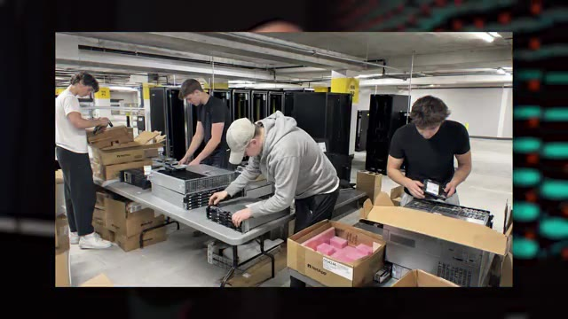
*📸 00:00:09 — Jeunes ingénieurs/admins assemblant et préparant du matériel serveur et des baies de stockage dans un datacenter ou un local technique.*

---

### ⏱️ `[00:00:18 - 00:00:46]` | Segment #02

**🔊 Audio (Transcription Intégrale Mot pour Mot en Français) :**
> Ils ont monté une boîte, qui est d'ailleurs une association à but long la créative je crois, pour pouvoir faire le modèle ultime d'intelligence artificielle. Et pourquoi je dis ultime ? Ce n'est pas juste pour encore hyper un projet à la con, c'est qu'il s'est de faire une IA qui utilise un ordinateur comme un humain. C'est-à-dire en comprenant ce qu'il y a sur l'écran, et en tapant son clavier et en bougeant la souris. Donc s'il y a certaines IA text qui arrivent à faire un petit peu ça en ce moment, mais en fait c'est un petit peu à l'arrache où l'IA prend un screenshot de ton écran, ensuite pour cliquer sur un élément elle utilise une API de ton navigateur pour aller cliquer à ce endroit-là, ou alors on utilise ta ligne de commande pour faire certaines actions.

**👁️ Analyse Visuelle d'Écran (gemini-3.5-flash-lite) :**
**Interface & Outils** : Interfaces graphiques multiples, environnements de développement, jeux, outils de vision par ordinateur, fenêtres d'applications variées.

**Contenu textuel & Code** : Collage d'écrans illustrant des cas d'usage d'IA (navigation dans des jeux, analyse d'images, manipulation d'OS, graphismes 3D, tableaux de bord).

**Action / Démonstration** : Illustration visuelle par montage d'écran de la polyvalence d'une IA capable d'interagir avec divers logiciels et interfaces comme un humain.

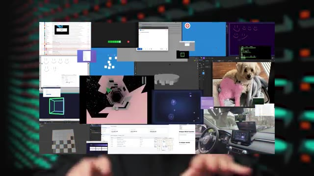
*📸 00:00:32 — Capture d'écran composite affichant une multitude de fenêtres, interfaces logicielles, jeux et environnements graphiques gérés ou analysés par une intelligence artificielle (vision par ordinateur, interactions multimodales).*

---

### ⏱️ `[00:00:46 - 00:01:10]` | Segment #03

**🔊 Audio (Transcription Intégrale Mot pour Mot en Français) :**
> Donc en fait ça passe toujours plus ou moins par du texte, par des API, des choses comme ça. Ce qui fait que des actions aussi simples que juste faire un drag and drop, ton IA aujourd'hui, elle ne peut pas le faire. Alors qu'une IA qui est vraiment faite pour ça, elle pourra à terme utiliser n'importe quelle application qu'un humain utilise. Donc aussi bien un navigateur qu'un logiciel de navigation 3D qu'aussi bien joué à Counter-Strike. Le problème pour pouvoir entraîner une IA comme ça, c'est que le de lui fournir beaucoup de texte, il faut lui fournir beaucoup de vidéos. Et la vidéo, ça prend mille fois plus de place que le texte.

**👁️ Analyse Visuelle d'Écran (gemini-3.5-flash-lite) :**
**Interface & Outils** : Logiciel de modélisation 3D (Blender)

**Contenu textuel & Code** : Vues multiples d'un modèle 3D d'engrenage en cours de conception, avec le texte explicatif 'various rollouts'.

**Action / Démonstration** : Illustration visuelle du processus de modélisation 3D et des différentes étapes ou variantes ('rollouts') d'un objet technique.

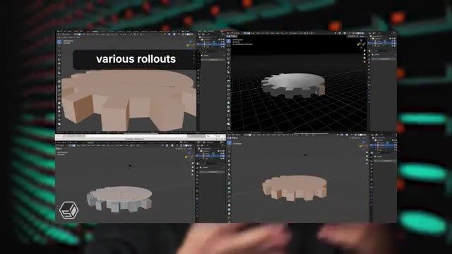
*📸 00:01:04 — Capture d'écran montrant une interface de modélisation 3D (Blender) divisée en quatre fenêtres avec le texte 'various rollouts'.*

---

### ⏱️ `[00:01:10 - 00:01:31]` | Segment #04

**🔊 Audio (Transcription Intégrale Mot pour Mot en Français) :**
> Et donc ils ont récupéré un petit dataset de 30 petabytes de vidéos, c'est 30 000 terabytes de vidéos de personnes qui font des actions dans différents logiciels sur un ordinateur. Et Et maintenant qu'ils ont tout ça, il faut le stocker quelque part pour pouvoir le donner au modèle qu'on va entraîner. Et donc, comme tout le monde, ils vont sur AWS, ils regardent S3 qui a le service de stockage d'objets, de fichiers.

**👁️ Analyse Visuelle d'Écran (gemini-3.5-flash-lite) :**
**Interface & Outils** : Aucune interface ou console active affichée.

**Contenu textuel & Code** : Aucun code, commande ou diagramme technique.

**Action / Démonstration** : Explication orale du stockage d'un dataset massif sur AWS par le créateur.

---

### ⏱️ `[00:01:31 - 00:01:53]` | Segment #05

**🔊 Audio (Transcription Intégrale Mot pour Mot en Français) :**
> Ils vont dans la petite calculette et ça leur dit qu'ils vont devoir payer 1.130.000 dollars par mois pour pouvoir stocker ça. Donc là déjà, ils se disent, bon, ils ont levé un petit peu d'argent, donc ils ne sont pas non plus à la rue, mais ils se disent, si on doit lâcher un million par mois, comment on va faire ? Donc ils regardent un petit peu d'autres fournisseurs. Azure, c'est pas à prépare. Ensuite, ils regardent Cloudflare, qui est quand même beaucoup moins cher pour un service qui est compatible à Best 3, qui est assez similaire.

**👁️ Analyse Visuelle d'Écran (gemini-3.5-flash-lite) :**
**Interface & Outils** : AWS Pricing Calculator (interface web de tarification cloud Amazon Web Services).

**Contenu textuel & Code** : Estimation de coût mensuel ("Monthly cost") affichée à 1 135 974.40 USD, service Amazon Simple Storage Service (S3) mentionné.

**Action / Démonstration** : Explication et commentaire sur un devis cloud excessif lié au stockage de données sur AWS.

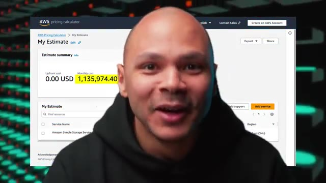
*📸 00:01:37 — Capture d'écran de l'AWS Pricing Calculator montrant une estimation de coût mensuel cloud de 1 135 974,40 USD.*

---

### ⏱️ `[00:01:53 - 00:02:11]` | Segment #06

**🔊 Audio (Transcription Intégrale Mot pour Mot en Français) :**
> Et ils arrivent à avoir quelques discounts, quelques petites promotions, parce que c'est quand même un assez gros volume où tu peux avoir une petite promo. Et on leur donne un nouveau prix qui est beaucoup mieux, mais qui est de 270 000 dollars par mois encore. Donc, c'est toujours cher. Tu vois, ça fait un petit 2 millions par an pour stocker des vidéos, c'est quand même chiant.

**👁️ Analyse Visuelle d'Écran (gemini-3.5-flash-lite) :**
**Interface & Outils** : Aucune interface technique, console ou terminal affiché.

**Contenu textuel & Code** : Aucun contenu technique, code source, commande ou métrique visible.

**Action / Démonstration** : Explication orale du présentateur concernant les coûts de stockage cloud et les remises négociées.

---

### ⏱️ `[00:02:11 - 00:02:32]` | Segment #07

**🔊 Audio (Transcription Intégrale Mot pour Mot en Français) :**
> Donc, ils réfléchissent et ils se disent, ok, ces services-là, ils sont faits pour un certain type d'utilisation, c'est-à-dire qu'ils ont une très grande disponibilité et une très bonne fiabilité. Par exemple, AWS, ils ont 13 neuf de fiabilité. Ça veut dire que chaque année, ils ont 0,000000 avec 13 0% de chance de perdre un des fichiers que tu leur as donnés.

**👁️ Analyse Visuelle d'Écran (gemini-3.5-flash-lite) :**
**Interface & Outils** : Diapositive de présentation cloud AWS (Amazon S3).

**Contenu textuel & Code** : Texte et métriques sur la durabilité d'Amazon S3 (99.999999999% / 11 9s), la sécurité, la disponibilité et les performances de stockage d'objets.

**Action / Démonstration** : Explication théorique des niveaux de durabilité et de fiabilité offerts par le stockage cloud AWS S3.

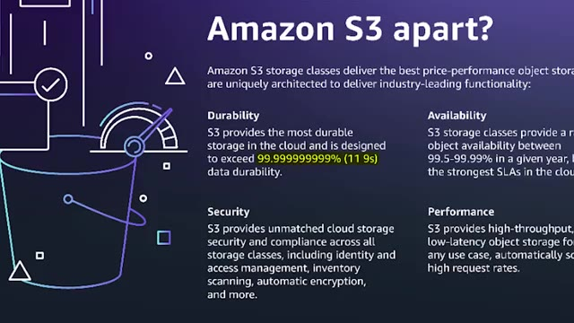
*📸 00:02:27 — Diapositive technique présentant les caractéristiques d'Amazon S3, notamment sa durabilité (99.999999999% soit 11 neuf), sa disponibilité, sa sécurité et ses performances.*

---

### ⏱️ `[00:02:32 - 00:02:51]` | Segment #08

**🔊 Audio (Transcription Intégrale Mot pour Mot en Français) :**
> Donc autant dire que c'est quasi sûr qu'ils perdent aucun fichier. Parce qu'en gros, tes données, ils ne les mettent pas juste dans un disque dur. Ils les redondent dans plusieurs disques, dans plusieurs serveurs, dans plusieurs régions, dans plein d'endroits dans le monde. Ce qui fait que même s'il y a la 3e guerre mondiale, tes données seront encore là. Mais eux, dans leur cas, ils n'ont pas vraiment besoin de ça. Parce que toutes ces données qu'ils ont récupérées, elles sont faciles à récupérer et à régénérer.

**👁️ Analyse Visuelle d'Écran (gemini-3.5-flash-lite) :**
**Interface & Outils** : Aucune interface, terminal ou console affichés.

**Contenu textuel & Code** : Aucun code, commande ou diagramme d'architecture visible.

**Action / Démonstration** : Explication orale du concept de haute disponibilité et de redondance géographique des données.

---

### ⏱️ `[00:02:51 - 00:03:10]` | Segment #09

**🔊 Audio (Transcription Intégrale Mot pour Mot en Français) :**
> C'est juste des gens qui utilisent leur ordi. Et ce ne sont pas des données critiques. Imaginons qu'ils perdent 1%, 2%, 5%, 10% des vidéos qu'ils ont. Ils peuvent quand même continuer à entraîner leur modèle d'IA. Ça ne va pas faire une très grosse différence qui l'entraîne avec 95% des vidéos ou 100% des vidéos. Donc, ils n'ont pas besoin de cette extrême fiabilité que les fournisseurs de cloud utilisent.

**👁️ Analyse Visuelle d'Écran (gemini-3.5-flash-lite) :**
**Interface & Outils** : Navigateur web affichant une interface de réservation en ligne en caractères chinois.

**Contenu textuel & Code** : Formulaire de recherche de vols (villes de départ et d'arrivée, dates, options de voyage).

**Action / Démonstration** : Navigation ou démonstration sur un site web tiers pour illustrer le sujet abordé.

*📸 00:02:56 — Capture d'écran montrant l'interface d'un site web de voyage (Ctrip/Trip.com en chinois) avec un curseur de souris pointant sur un champ de recherche de vol.*

---

### ⏱️ `[00:03:10 - 00:03:31]` | Segment #10

**🔊 Audio (Transcription Intégrale Mot pour Mot en Français) :**
> Donc, ils se disent, est-ce qu'on ne pourrait pas nous-mêmes fabriquer une solution qui pourrait matcher avec ce que nous, on a besoin de faire ? Donc là, ils commencent à regarder un petit peu dans tous les espaces de colocation. c'est les data centers qui existent où tu peux ramener tes serveurs, tes hacks. Tu fais juste louer l'espace et l'énergie pour pouvoir faire leur propre data center. Ils voient que le prix, ça peut préparer partout. Donc, ils prennent celui qui est le plus proche de leur loco pour pouvoir aller facilement débugger si jamais il y a un problème.

**👁️ Analyse Visuelle d'Écran (gemini-3.5-flash-lite) :**
**Interface & Outils** : AUCUNE

**Contenu textuel & Code** : AUCUNE

**Action / Démonstration** : Explication orale du concept d'hébergement en colocation (colocation de serveurs en data center) sans support technique visuel direct

---

### ⏱️ `[00:03:31 - 00:03:53]` | Segment #11

**🔊 Audio (Transcription Intégrale Mot pour Mot en Français) :**
> Et donc, en termes de coût, là, on leur dit, vous allez payer 7500 dollars par mois pour Internet. Ça fait cher Internet, mais c'est un Internet 100 gigabits dédié. Donc, c'est un Internet qui a de la patate, tu vois. Et vous allez payer 10 000 dollars par mois en électricité. Parce que comme on va voir, ils vont avoir besoin de beaucoup de serveurs et ces serveurs-là, il faut les alimenter. Donc ça veut dire qu'on passe de 270 000 dollars chez Cloudflare à juste 17 000 dollars par mois.

**👁️ Analyse Visuelle d'Écran (gemini-3.5-flash-lite) :**
**Interface & Outils** : Incrustation de texte vidéo (aucun terminal, code ou interface technique active).

**Contenu textuel & Code** : Mention textuelle des coûts d'infrastructure ('10 000$ / MOIS ÉLECTRICITÉ').

**Action / Démonstration** : Explication orale des coûts d'infrastructure liés à la consommation électrique des serveurs en datacenter.

*📸 00:03:42 — Plan face-caméra avec incrustation du texte '10 000$ / MOIS ÉLECTRICITÉ' illustrant les coûts énergétiques des serveurs.*

---

### ⏱️ `[00:03:53 - 00:04:14]` | Segment #12

**🔊 Audio (Transcription Intégrale Mot pour Mot en Français) :**
> Donc là c'est une réduction de plus que fois 10. Je sais pas, c'est 270 divisé par 17, 15. Donc c'est 15 fois moins cher par mois. Maintenant tu vas me dire, ok c'est 15 fois moins cher mais les serveurs ils sont pas gratuits, il faut les trouver quelque part. Et ils ont un certain prix. Et donc là ils commencent à regarder qu'est-ce qu'ils peuvent utiliser. Et en fait ils vont simplement sur eBay pour pouvoir acheter des serveurs de seconde main.

**👁️ Analyse Visuelle d'Écran (gemini-3.5-flash-lite) :**
**Interface & Outils** : Aucun outil, terminal ou console affiché.

**Contenu textuel & Code** : Aucun contenu technique (code, commande ou architecture) n'est visible.

**Action / Démonstration** : Explication verbale par le créateur sur l'optimisation des coûts des serveurs.

---

### ⏱️ `[00:04:14 - 00:04:33]` | Segment #13

**🔊 Audio (Transcription Intégrale Mot pour Mot en Français) :**
> Parce que les serveurs d'occasion, une fois qu'ils sont passés leur période de garantie, les entreprises s'en débarrassent, elles les vendent pour vraiment presque rien, pour pouvoir acheter des nouveaux, pour pouvoir garder la garantie. Ce qui fait que tu peux te retrouver avec des serveurs qui ont juste quelques années, mais qui coûtent 10 fois, 20 fois moins cher que le prix neuf d'il y a quelques années. Et donc ils donnent la liste exacte. Ils en ont pour 300 000 dollars juste en disques durs.

**👁️ Analyse Visuelle d'Écran (gemini-3.5-flash-lite) :**
**Interface & Outils** : Aucune interface ou console affichée.

**Contenu textuel & Code** : Aucun contenu technique, code ou métrique visible.

**Action / Démonstration** : Explication orale du créateur sur l'achat de serveurs d'occasion en entreprise.

---

### ⏱️ `[00:04:33 - 00:04:53]` | Segment #14

**🔊 Audio (Transcription Intégrale Mot pour Mot en Français) :**
> Donc ça, ces disques, ils ont acheté 9 je crois. Et ils ont pris des disques durs de 12 Tera, ce qu'ils ont un petit peu regretté plus tard, je t'expliquerai juste après. Ensuite ils ont utilisé des G-Bod pour Just a Bunch of Discs. Donc en fait c'est comme un châssis dans lequel tu vas mettre tes disques, mais c'est pas un ordi en fait, c'est juste vraiment une boîte où tu peux brancher les disques. Et après cette boîte tu peux la brancher à une machine et cette machine là elle aura accès à tous les disques qui sont dedans.

**👁️ Analyse Visuelle d'Écran (gemini-3.5-flash-lite) :**
**Interface & Outils** : Matériel physique (Disk Shelf / JBOD NetApp DS4246 et caddies de disques durs 3.5 pouces).

**Contenu textuel & Code** : Présentation physique d'un boîtier d'extension de stockage JBOD (NetApp DS4246) et de caddies de disques durs pour homelab.

**Action / Démonstration** : Explication du matériel de stockage, illustration des disques durs 12 To et du concept de JBOD.

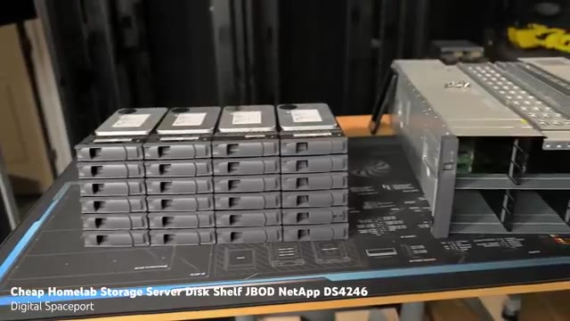
*📸 00:04:48 — Vue matérielle (homelab) montrant des tiroirs de disques durs et un châssis JBOD NetApp DS4246.*

---

### ⏱️ `[00:04:53 - 00:05:12]` | Segment #15

**🔊 Audio (Transcription Intégrale Mot pour Mot en Français) :**
> Donc ça permet de brancher plein de disques dans une seule machine. Donc ces châssis là ils ont acheté 100 parce qu'évidemment t'as 2400 disques donc il t'en faut pas mal. Et donc chaque châssis pouvait stocker 24 disques. Et ensuite comme là jusqu'à là ils ont toujours pas de machine, pas de serveur, ils ont acheté 10 serveurs pour 6000 balles sur repair. Donc ça fait 600 balles le serveur, c'est quand même pas trop cher. Surtout quoi ? Les serveurs sont pas mal.

**👁️ Analyse Visuelle d'Écran (gemini-3.5-flash-lite) :**
**Interface & Outils** : AUCUNE

**Contenu textuel & Code** : AUCUNE

**Action / Démonstration** : Explication orale sur l'architecture de stockage et l'achat de châssis pour disques durs

---

### ⏱️ `[00:05:12 - 00:05:32]` | Segment #16

**🔊 Audio (Transcription Intégrale Mot pour Mot en Français) :**
> C'est des serveurs avec 128Go de RAM, DDR4, un petit peu ancienne, mais quand même bon. Et deux CPU Intel Xeon qui ont chacun 20 corps, 40 threads. Donc ça te fait 40 CPU par machine, 80 threads et 128Go de RAM par machine. Donc ils ont quand même une bonne infra costaud pour pouvoir héberger tous ces fichiers-là.

**👁️ Analyse Visuelle d'Écran (gemini-3.5-flash-lite) :**
**Interface & Outils** : Présentation vidéo de matériel serveur (carte mère de type serveur bi-socket Intel Xeon).

**Contenu textuel & Code** : Illustration visuelle du matériel serveur : sockets CPU Intel Xeon E5, emplacements DIMM pour mémoire RAM.

**Action / Démonstration** : Explication technique sur l'architecture matérielle des serveurs de l'infrastructure (processeurs Xeon, nombre de cœurs/threads et mémoire RAM).

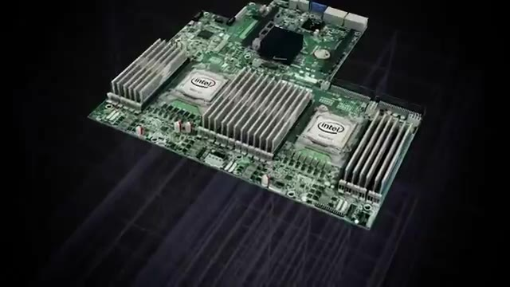
*📸 00:05:17 — Vue d'ensemble d'une carte mère de serveur bi-socket avec processeurs Intel Xeon et slots mémoire RAM.*

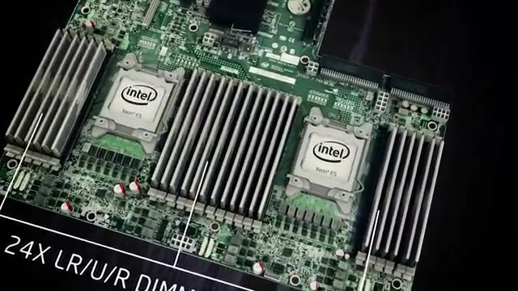
*📸 00:05:22 — Gros plan sur la carte mère serveur montrant les deux sockets Intel Xeon E5 et les slots pour modules mémoire LR/U/R DIMM (24x).*

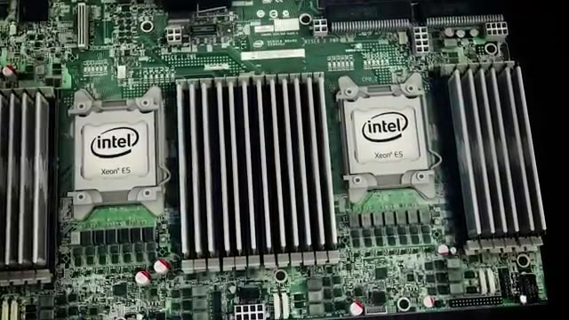
*📸 00:05:27 — Zoom rapproché sur les processeurs Intel Xeon E5 et les bancs de mémoire vive DDR4 disposés autour des sockets.*

---

### ⏱️ `[00:05:32 - 00:05:54]` | Segment #17

**🔊 Audio (Transcription Intégrale Mot pour Mot en Français) :**
> Ensuite, ils ont quelques petits frais supplémentaires. Le data center, il leur a chargé un petit frais d'installation. Ils ont eu besoin aussi de certains contracteurs, parce que pour pouvoir assembler tout ça, ça prend quand même du temps. 2400 disques, ça prend du temps à l'insérer un par un. Et ils ont eu aussi un autre 20 000 balles de câbles, de switches, de routers, etc. Et donc, en tout, ils en ont eu pour une facture de 426 500 dollars.

**👁️ Analyse Visuelle d'Écran (gemini-3.5-flash-lite) :**
**Interface & Outils** : Photographie de l'espace de déballage et d'assemblage hardware en datacenter.

**Contenu textuel & Code** : Emballages cartons, polystyrène expansé, et palettes de composants serveur à assembler.

**Action / Démonstration** : Illustration visuelle du travail d'assemblage physique et du déballage des disques durs et serveurs par les contracteurs.

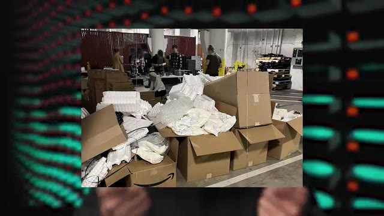
*📸 00:05:43 — Entrepôt ou zone de stockage montrant des cartons d'emballage et du matériel informatique en cours de déballage par des techniciens.*

---

### ⏱️ `[00:05:55 - 00:06:14]` | Segment #18

**🔊 Audio (Transcription Intégrale Mot pour Mot en Français) :**
> Donc là, on se dit peut-être que c'est plus cher que Cloudflare, sauf que Cloudflare, souvenez-vous, c'est chaque mois qu'il faut payer les 300 000. Alors que là, 426 000, ils les payent une fois et les serveurs, ils les ont pour toujours. C'est-à-dire que le premier mois, ils payent un peu plus de 420 000, mais ensuite, tous les autres mois, ils ne payent que 17 000. Au bout de juste un mois et demi, c'est déjà rentable. Mais c'est rentable que si ça fonctionne et que les performances sont équivalents à ce qu'ils auraient eu dans le cloud.

**👁️ Analyse Visuelle d'Écran (gemini-3.5-flash-lite) :**
**Interface & Outils** : Aucun outil, terminal ou interface n'est affiché.

**Contenu textuel & Code** : Aucun code, commande, architecture ou métrique visible.

**Action / Démonstration** : Explication orale sur les coûts comparatifs entre un service cloud mensuel (Cloudflare) et l'achat de serveurs physiques.

---

### ⏱️ `[00:06:14 - 00:06:35]` | Segment #19

**🔊 Audio (Transcription Intégrale Mot pour Mot en Français) :**
> Et donc là, le premier problème, c'est que quand tu dois assembler 100 GBOD, 10 machines et 2400 disques durs, même si tu es 5, c'est mort. Il faut plus de main d'oeuvre. Ils se sont dit « vas-y, on va le faire en un week-end et on va appeler ça le Storage Stacking Saturday ». Donc la petite blague parce que c'est leur S3 à eux. En fait, ils ont invité tous leurs potes. Ils leur ont dit « venez ce week-end, on va assembler des disques.

**👁️ Analyse Visuelle d'Écran (gemini-3.5-flash-lite) :**
**Interface & Outils** : Aucun outil technique, terminal ou interface logicielle n'est affiché.

**Contenu textuel & Code** : Aucun code, commande ou métrique technique n'est visible.

**Action / Démonstration** : Explication orale de concepts d'infrastructure matérielle (assemblage de baies de stockage JBOD et disques durs).

---

### ⏱️ `[00:06:35 - 00:06:54]` | Segment #20

**🔊 Audio (Transcription Intégrale Mot pour Mot en Français) :**
> On vous paiera la main d'œuvre, les pizzas et on vous filera même des disques durs à la fin. Et donc c'est comme ça qu'ils ont réussi à tout assembler et à avoir une infra qui fonctionne en juste un week-end pour beaucoup moins cher. Et donc comment est-ce que ça fonctionne ? Ils n'ont pas utilisé des logiciels comme Cephe ou comme Inio qui sont des systèmes de fichiers distribués qui permet du point de vue d'un OS de voir tout ça comme un seul gros disque dur.

**👁️ Analyse Visuelle d'Écran (gemini-3.5-flash-lite) :**
**Interface & Outils** : Aucun outil technique, terminal ou console affiché.

**Contenu textuel & Code** : Aucun code, configuration ou architecture visible.

**Action / Démonstration** : Explication orale sans manipulation technique à l'écran.

---

### ⏱️ `[00:06:54 - 00:07:14]` | Segment #21

**🔊 Audio (Transcription Intégrale Mot pour Mot en Français) :**
> Parce que c'est des logiciels qui sont distribués, qui sont souvent assez compliqués à gérer, à mettre en place, à apprendre, etc. Et ils ont des besoins qui sont vraiment très simples. Il faut juste qu'ils aient la liste des fichiers et qu'ils soient capables de récupérer celui qu'ils ont besoin. Donc ils ont utilisé Nginx, qui est un serveur web très connu, très simple, très performant aussi. Et ils ont rajouté par-dessus un petit script en Rust de 200 lignes.

**👁️ Analyse Visuelle d'Écran (gemini-3.5-flash-lite) :**
**Interface & Outils** : AUCUNE

**Contenu textuel & Code** : AUCUNE

**Action / Démonstration** : Explication orale sur l'utilisation d'un serveur web Nginx pour répondre à des besoins simples de distribution de fichiers.

---

### ⏱️ `[00:07:14 - 00:07:34]` | Segment #22

**🔊 Audio (Transcription Intégrale Mot pour Mot en Français) :**
> D'un côté, on peut se dire, c'est peut-être plus compliqué si tu fais ton propre truc que si tu utilises des technologies qui existent déjà, comme Seth. Mais d'un autre côté, si c'est juste un petit script de 200 lignes, c'est potentiellement beaucoup plus simple. Pour ce qui est du réseau, les switches qu'ils avaient achetés d'occasion, ils n'avaient pas de DHCP, manque de bol. faire de l'adressage IP manuel. Ce qui n'est pas si grave parce qu'ils ont juste une dizaine de serveurs.

**👁️ Analyse Visuelle d'Écran (gemini-3.5-flash-lite) :**
**Interface & Outils** : AUCUNE

**Contenu textuel & Code** : AUCUNE

**Action / Démonstration** : Explication orale sans support visuel technique.

---

### ⏱️ `[00:07:34 - 00:07:53]` | Segment #23

**🔊 Audio (Transcription Intégrale Mot pour Mot en Français) :**
> Ils n'ont aussi pas utilisé de NAT. En général, ce que tu fais, c'est que tu as une adresse publique qui est accessible via Internet. Et ensuite, derrière, tu as tes serveurs qui se partagent cette adresse IP. Là, ils ont donné une adresse IP à chacune de leurs machines pour qu'elle soit chacune accessible directement depuis Internet. C'est du point de vue sécurité pas fou. Mais d'un autre côté, le NAT, à la base, ce n'est pas censé être une fonction de sécurité.

**👁️ Analyse Visuelle d'Écran (gemini-3.5-flash-lite) :**
**Interface & Outils** : Aucune interface technique ou graphique affichée.

**Contenu textuel & Code** : Aucun contenu technique textuel ou visuel affiché.

**Action / Démonstration** : Explication orale de concepts réseaux (NAT, adresses IP publiques vs privées).

---

### ⏱️ `[00:07:53 - 00:08:17]` | Segment #24

**🔊 Audio (Transcription Intégrale Mot pour Mot en Français) :**
> Donc, à partir du moment où tu as un bon firewall, normalement, c'est correct. Ils ont aussi un autre réseau secondaire de gestion qui est beaucoup plus lent que leur réseau 100 gigabits, mais qui est juste pour pouvoir faire une modif quand ils ont besoin, pour débugger, etc. Une autre chose un peu bizarre dans leur infra, c'est qu'ils ont fait du daisy-chaining. C'est-à-dire qu'au lieu de brancher chaque serveur à une dizaine de boîtes de disques, ils ont branché le serveur à une boîte qui est branchée à une autre boîte, qui est branchée à une autre boîte, qui est branchée à une autre boîte.

**👁️ Analyse Visuelle d'Écran (gemini-3.5-flash-lite) :**
**Interface & Outils** : Incrustation textuelle à l'écran illustrant un concept d'infrastructure réseau.

**Contenu textuel & Code** : Texte affiché : "Daisy Chaining (Connexion en chaîne)".

**Action / Démonstration** : Explication du concept de topologie réseau en cascade (Daisy Chaining) utilisée dans l'infrastructure présentée.

*📸 00:08:11 — Plan face-caméra du présentateur avec incrustation du texte technique "Daisy Chaining (Connexion en chaîne)".*

---

### ⏱️ `[00:08:17 - 00:08:36]` | Segment #25

**🔊 Audio (Transcription Intégrale Mot pour Mot en Français) :**
> Ce qui fait que pour pouvoir accéder aux données qui sont dans une certaine boîte, ça doit passer à travers toutes les autres boîtes pour pouvoir entrer dans le serveur. Donc ça fonctionne, c'est quelque chose qu'ils regrettent un petit peu, de ne pas avoir eu la possibilité en interne d'avoir un réseau un peu plus performant. Mais globalement, en termes de performance, ils sont assez satisfaits parce qu'ils n'ont pas trop dépensé plus que ce qu'ils pensaient.

**👁️ Analyse Visuelle d'Écran (gemini-3.5-flash-lite) :**
**Interface & Outils** : AUCUNE

**Contenu textuel & Code** : AUCUN

**Action / Démonstration** : Explication orale du présentateur concernant l'architecture réseau et le routage des données, sans manipulation technique à l'écran.

---

### ⏱️ `[00:08:36 - 00:08:56]` | Segment #26

**🔊 Audio (Transcription Intégrale Mot pour Mot en Français) :**
> Ça n'a pas non plus pris beaucoup plus de temps que ce qu'ils pensaient parce que ce n'est pas leur projet de base. Pour eux, c'est vraiment juste un side project de week-end à faire. Et ça marche très bien, même mieux que ce qu'ils avaient quand ils avaient commencé à faire quelques tests chez Cloudflare où parfois ils étaient limités en termes de bande passante parce que Cloudflare ne pouvait juste pas assumer un aussi gros débit. Là, c'est leur propre serveur, leur propre connexion dédiée.

**👁️ Analyse Visuelle d'Écran (gemini-3.5-flash-lite) :**
**Interface & Outils** : Aucune interface ou console affichée.

**Contenu textuel & Code** : Aucun contenu technique, code ou métrique visible.

**Action / Démonstration** : Explication orale sans manipulation ou démonstration technique à l'écran.

---

### ⏱️ `[00:08:56 - 00:09:14]` | Segment #27

**🔊 Audio (Transcription Intégrale Mot pour Mot en Français) :**
> et donc ils sont 100 gigabits juste pour eux tout le temps. Et donc, c'est vraiment beaucoup plus performant que ce qu'ils auraient pu avoir dans le cloud pour beaucoup plus cher. Donc, à ce niveau-là, c'est vraiment très beau. Et maintenant, ça nous mène aux leçons qu'ils ont tirées de cette expérience et aux petits regrets, les petites choses qu'ils auraient pu améliorer. Le truc qui a été le plus chiant, c'est vraiment l'installation. Parce que 2400 disques, c'est vraiment énorme.

**👁️ Analyse Visuelle d'Écran (gemini-3.5-flash-lite) :**
**Interface & Outils** : Aucune interface visible.

**Contenu textuel & Code** : Aucun contenu technique, de code ou d'architecture affiché.

**Action / Démonstration** : Présentation orale et discussion sur l'infrastructure réseau et les performances comparées entre cloud et infrastructure dédiée.

---

### ⏱️ `[00:09:14 - 00:09:35]` | Segment #28

**🔊 Audio (Transcription Intégrale Mot pour Mot en Français) :**
> Parce que chaque disque, il faut mettre 4 vis dedans pour pouvoir les mettre dans un petit plateau. Et ce petit plateau-là, ensuite, tu viens le mettre dans le serveur. Et ça, même si ça prend 2 minutes à faire, x 2400 fois, ça prend plus qu'un week-end. Donc au final, même si ces G-Bod là étaient les moins chers et les disques de 12 Tera étaient les moins chers au giga, ils regrettent un petit peu parce que s'ils avaient dépensé un tout petit peu plus, ils auraient pu prendre des G-Bod qui se chargent par le dessus.

**👁️ Analyse Visuelle d'Écran (gemini-3.5-flash-lite) :**
**Interface & Outils** : Matériel physique (châssis serveur et tiroirs de disques durs).

**Contenu textuel & Code** : Châssis de stockage JBOD NetApp DS4246 avec emplacements pour disques durs.

**Action / Démonstration** : Présentation visuelle et manipulation d'un boîtier de stockage externe pour illustrer les contraintes d'installation des disques durs.

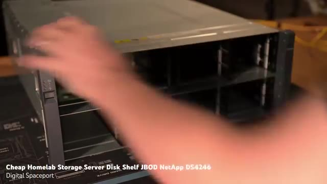
*📸 00:09:19 — Présentation matérielle d'un tiroir de stockage JBOD NetApp DS4246 pour homelab.*

---

### ⏱️ `[00:09:35 - 00:09:54]` | Segment #29

**🔊 Audio (Transcription Intégrale Mot pour Mot en Français) :**
> Et donc dans ce cas là, tu n'as pas besoin de visser, tu fais juste le glisser directement dans le port SATA. Donc ça prend beaucoup moins de temps. Et en plus de ça, s'ils avaient utilisé des disques plus gros, de disques par exemple de 24 Tera, de 32 Tera, et bien ça divise par deux ton nombre de disques. Donc au final, s'ils avaient ces G-Bod là qui peuvent héberger 96 disques au lieu de 24, ça aurait divisé par quatre le nombre de G-Bod qu'ils auraient besoin.

**👁️ Analyse Visuelle d'Écran (gemini-3.5-flash-lite) :**
**Interface & Outils** : AUCUNE

**Contenu textuel & Code** : AUCUNE

**Action / Démonstration** : Explication orale de concepts techniques (stockage SATA, JBOD, densité de disques).

---

### ⏱️ `[00:09:54 - 00:10:29]` | Segment #30

**🔊 Audio (Transcription Intégrale Mot pour Mot en Français) :**
> par 4 le nombre d'installations dans les racks, le nombre de câbles à brancher, etc. Et s'ils avaient utilisé des disques de 24 Tera au lieu de 12, ils auraient eu deux fois moins de disques, donc ils auraient consommé deux fois moins d'énergie, ils auraient eu deux fois moins de disques à installer et ça aurait divisé par 10 la complexité de câbles, de châssis, d'espace, de rack, ils auraient payé aussi moins cher par mois. Ils auraient eu aussi besoin de 10 fois moins de main d'oeuvre pour pouvoir installer tous ces disques parce qu'ils auraient besoin de beaucoup moins d'espace, beaucoup moins d'énergie. Même s'ils auraient coûté un tout petit peu plus cher, ça aurait été beaucoup plus simple. Donc c'est une des choses qu'ils regrettent le plus. Ensuite la deuxième chose c'est qu'ils ont utilisé de la fibre parce que forcément tu dis 100 gigas je peux pas faire ça avec un câble ethernet sauf qu'ils ont pas mal de problèmes de réseau parce qu'en fait tu

**👁️ Analyse Visuelle d'Écran (gemini-3.5-flash-lite) :**
**Interface & Outils** : AUCUNE

**Contenu textuel & Code** : AUCUNE

**Action / Démonstration** : Explication orale sur l'impact de la densité des disques durs (capacité, consommation énergétique, complexité de câblage) dans un datacenter.

---

### ⏱️ `[00:10:29 - 00:11:04]` | Segment #31

**🔊 Audio (Transcription Intégrale Mot pour Mot en Français) :**
> peux pas brancher direct la fibre dans ton serveur il faut la mettre dans un transceiver et le transceiver il a un firmware il faut que le firmware il matche avec le firmware du switch dans lequel tu le mets et en fonction des marques des modèles et tout c'est un peu casse tête et pour les distances qu'ils ont à parcourir en fait tu peux utiliser des câbles en cuivre faut juste qu'ils soient de bonne qualité qu'ils soient pas trop longs et ça peut fonctionner en 100 gigabits et t'as pas eu tout ce souci de firmware etc potentiellement je crois qu'il ya des transceivers qui sont un peu générique dans lequel tu peux mettre à la volée exactement le bon firmware que tu as besoin. Mais bon, c'est sûr que si tu peux juste avoir un câble Ethernet, c'est beaucoup moins cher, beaucoup plus simple et ça marche tout le temps. Ensuite le Daisy Chaining, comme je te disais plus tôt, c'est quelque chose qu'ils regardent un petit peu. Ils auraient préféré avoir un réseau

**👁️ Analyse Visuelle d'Écran (gemini-3.5-flash-lite) :**
**Interface & Outils** : AUCUNE

**Contenu textuel & Code** : AUCUNE

**Action / Démonstration** : Explication théorique sur l'utilisation des transceivers et de leurs contraintes de micrologiciel avec les switches réseau.

---

### ⏱️ `[00:11:04 - 00:11:36]` | Segment #32

**🔊 Audio (Transcription Intégrale Mot pour Mot en Français) :**
> en interne qui est potentiellement un peu plus performant que ce qu'ils peuvent utiliser avec leur adresse IP publique de 100 gigas. Mais bon, pour le coup, tant que tu peux tirer 100 gigabits dessus, ça va. Un truc qui était chiant aussi, c'est que pendant l'installation, tu as besoin de débugger pas mal de choses parce que forcément ça ne marche jamais du premier coup. Et ce qui les freiner souvent, c'est de devoir trouver simplement un écran, un clavier pour pouvoir aller se brancher dans chacune des machines, pour pouvoir débugger dans le data center. Le fait d'avoir une espèce de KVM portable ou un chariot pour pouvoir brancher direct sur les serveurs, ça leur aurait sauvé pas mal de temps au moment de l'installation. Et moi, ce que je trouve intéressant dans cette histoire,

**👁️ Analyse Visuelle d'Écran (gemini-3.5-flash-lite) :**
**Interface & Outils** : Aucun outil, terminal ou interface graphique n'est affiché.

**Contenu textuel & Code** : Aucun code, commande ou métrique technique n'est visible.

**Action / Démonstration** : Explication orale du créateur concernant la configuration réseau et le debugging d'installation.

---

### ⏱️ `[00:11:36 - 00:12:10]` | Segment #33

**🔊 Audio (Transcription Intégrale Mot pour Mot en Français) :**
> c'est que le cloud, c'est une très bonne solution. C'est géré pour toi, tu n'as pas de problème, c'est automatiquement mis à jour, automatiquement géré, automatiquement sauvegardé, blablabla. Et toutes ces fonctionnalités, elles ont un coût. Et parfois, on n'a pas besoin de ces fonctionnalités. Donc en fait on finit par payer quelque chose dont on n'a pas forcément besoin. Et donc c'est intéressant de temps en temps de remettre tout ça en cause et de se dire qu'est-ce que j'ai vraiment besoin et est-ce que je pourrais pas moi-même très rapidement faire quelque chose qui va être mieux parce qu'ils ont eu des meilleures performances que ce qu'ils ont dans le cloud pour beaucoup beaucoup beaucoup moins cher parce qu'ils ont pas toutes les fonctionnalités qu'ils ont pas besoin. Si t'es dev freelance et que l'infra s'intéresse et que t'aimerais apprendre le DevOps pour pouvoir vraiment valoriser ton profil,

**👁️ Analyse Visuelle d'Écran (gemini-3.5-flash-lite) :**
**Interface & Outils** : Aucune interface ou console affichée.

**Contenu textuel & Code** : Aucun contenu technique, code ou architecture visible.

**Action / Démonstration** : Explication orale du créateur sur les coûts et les fonctionnalités du cloud.

---

### ⏱️ `[00:12:10 - 00:12:18]` | Segment #34

**🔊 Audio (Transcription Intégrale Mot pour Mot en Français) :**
> deux ou trois fois par an je fais une formation en petits groupes où on voit tous les outils DevOps les plus en demande. Je te mets un petit lien dans la description pour être prévenu de la prochaine session.

**👁️ Analyse Visuelle d'Écran (gemini-3.5-flash-lite) :**
**Interface & Outils** : Écran externe affichant un diagramme d'architecture cloud/réseau et ordinateur portable.

**Contenu textuel & Code** : Schéma d'architecture technique avec des serveurs web derrière un load balancer.

**Action / Démonstration** : Explication de concepts d'architecture réseau et de distribution de charge pour les formations.

*📸 00:12:14 — Le créateur devant son poste de travail présentant un schéma d'architecture réseau avec un load balancer et des instances.*

---

