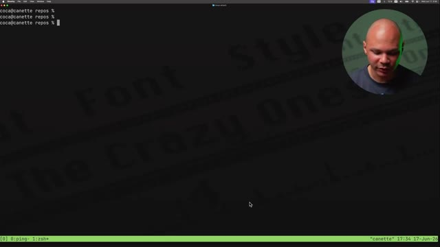
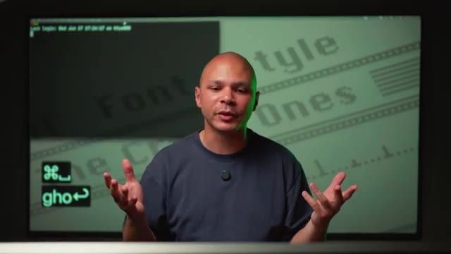
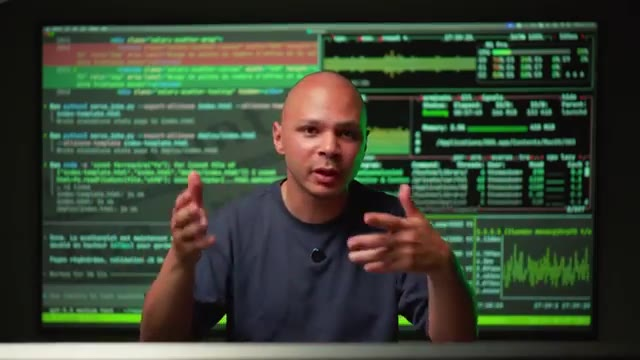

# 🎬 Le nouvel outils préféré des vibe codeurs!

> **Chaîne** : [cocadmin](https://www.youtube.com/@cocadmin)  
> **Lien YouTube** : [https://www.youtube.com/watch?v=tNIKU-N_Yc4](https://www.youtube.com/watch?v=tNIKU-N_Yc4)  
> **Date de publication** : 20260901  
> **Durée** : 00:15:36  
> **Identifiant vidéo** : `tNIKU-N_Yc4`  
> **Transcription & Analyse** : `whisper-v3-large-turbo+gemini-3.5-flash-lite`  

---

## 📌 Synthèse Exécutive & Outils

### 💡 Résumé
Dans cette vidéo intitulée **Le nouvel outils préféré des vibe codeurs!**, cocadmin propose une immersion approfondie dans les problématiques concrètes d'infrastructure, de systèmes et d'ingénierie logicielle.

### 🛠️ Outils, Modèles & Logiciels Présentés
- **Linux & Outils Systèmes** : Administration système, automatisation et surveillance.
- **Conteneurisation & Cloud** : Déploiement et gestion d'environnements résilients.

### 🔑 Points Clés & Enseignements Stratégiques
- Maîtriser les fondamentaux réseau et système pour diagnostiquer efficacement les pannes.
- Privilégier les architectures simples et observables en environnement de production.

---

## ⏱️ Chronologie & Transcription Complète Audio & Visuelle (Mot pour Mot)

### ⏱️ `[00:00:00 - 00:00:22]` | Segment #01

**🔊 Audio (Transcription Intégrale Mot pour Mot en Français) :**
> Ça c'est Temux, c'est un outil qui a presque 20 ans et qui est redevenu un peu de nulle part le nouvel outil préféré des VibeCodeur. Je vais juste montrer exactement comment l'utiliser, comme ça toi aussi tu pourras booster ta productivité. Donc là on est dans Temux, mais ce qu'on voit surtout c'est les différentes applications en ligne de commande que je suis en train d'utiliser. Et on voit qu'à gauche là j'ai Codex, à droite j'ai un outil pour voir les stats de mon système et en bas j'ai des petits graphes pour mon réseau.

**👁️ Analyse Visuelle d'Écran (gemini-3.5-flash-lite) :**
**Interface & Outils** : Présentation ou face-caméra sans interface informatique partagée.

**Contenu textuel & Code** : Explications orales des concepts, architectures et retours d'expérience.

**Action / Démonstration** : Démonstration pédagogique et mise en perspective technique.

---

### ⏱️ `[00:00:22 - 00:00:42]` | Segment #02

**🔊 Audio (Transcription Intégrale Mot pour Mot en Français) :**
> Ça c'est la première utilité de Temux, c'est qu'on peut découper une fenêtre de terminale en autant de shell qu'on veut. Donc là par exemple, si je veux créer une nouvelle fenêtre, et bien là, je suis dans un nouveau terminal. Si j'en veux un deuxième, boum, je peux couper en deux, je peux couper aussi dans l'autre sens, je peux recouper dans ce sens-là, etc. Je peux revenir dessus, je peux cliquer, je peux changer, je peux revenir là où j'y étais, etc.

**👁️ Analyse Visuelle d'Écran (gemini-3.5-flash-lite) :**
**Interface & Outils** : Terminal macOS, shell Zsh, multiplexeur de terminaux Tmux.

**Contenu textuel & Code** : Invite de commande `coca@canette repos %` et barre d'état Tmux affichant l'index des fenêtres `[0] 0:ping- 1:zsh*` et les informations système (nom d'hôte "canette", date et heure).

**Action / Démonstration** : Initialisation et présentation d'une session Tmux propre avant d'illustrer la création de nouvelles fenêtres et le découpage de l'écran en plusieurs volets (splittage vertical/horizontal).

*📸 00:00:32 — Terminal macOS exécutant une session Tmux avec une invite de commande zsh et la barre de statut verte active en bas de l'écran.*

---

### ⏱️ `[00:00:42 - 00:01:01]` | Segment #03

**🔊 Audio (Transcription Intégrale Mot pour Mot en Français) :**
> Donc le gros avantage de ça, c'est qu'on peut facilement passer d'une fenêtre à une autre, d'un panel à un autre, et tout ça 100% au clavier. Donc on n'a pas besoin de bouger notre main, d'aller sur la souris, d'aller cliquer sur un tab, etc. On peut vraiment faire tout ce qu'on veut au clavier. Mais ça ne s'arrête pas là. Parce que si par exemple je suis là et je sais pas, mon terminal il crache. Hop, boum, voilà c'est fermé.

**👁️ Analyse Visuelle d'Écran (gemini-3.5-flash-lite) :**
**Interface & Outils** : Présentation ou face-caméra sans interface informatique partagée.

**Contenu textuel & Code** : Explications orales des concepts, architectures et retours d'expérience.

**Action / Démonstration** : Démonstration pédagogique et mise en perspective technique.

---

### ⏱️ `[00:01:01 - 00:01:20]` | Segment #04

**🔊 Audio (Transcription Intégrale Mot pour Mot en Français) :**
> Voilà, oh non j'ai perdu mon terminal, j'ai perdu mes connexions etc. Mais en fait non, je peux juste revenir mon terminal, il va se rouvrir. Donc évidemment j'ai tout perdu sauf si je tape Tmux Attach pour me réattacher à ma station Tmux et là boum, je récupère tout. Je récupère tous mes onglets, je récupère tous mes panneaux, toutes mes fenêtres et mes applications elles ont continué de tourner pendant que mon terminal était complètement KO.

**👁️ Analyse Visuelle d'Écran (gemini-3.5-flash-lite) :**
**Interface & Outils** : Terminal (probablement iTerm2 ou Terminal.app) sous macOS.

**Contenu textuel & Code** : Commande `tmux attach`, informations de dernière connexion (`Last login`), prompt utilisateur (`coca@canette ~ %`).

**Action / Démonstration** : Démonstration de l'utilisation de la commande `tmux attach` pour restaurer une session de travail persistante après une interruption du terminal.

*📸 00:01:06 — Plan sur le créateur devant un écran affichant un terminal macOS avec un prompt utilisateur et des informations de dernière connexion.*

*📸 00:01:11 — Gros plan sur un terminal macOS présentant la commande `tmux attach` tapée au prompt, avec le créateur en incrustation.*

---

### ⏱️ `[00:01:20 - 00:01:46]` | Segment #05

**🔊 Audio (Transcription Intégrale Mot pour Mot en Français) :**
> Et donc si j'ai des problèmes qui étaient en train de tourner, ils n'ont pas du tout arrêté, si j'avais des connexions SSH en cours à des serveurs, elles sont restées actives. Et tout ça comme si de rien n'était alors que mon terminal entier était kill et KO. Justement, diviser l'écran pour avoir plus de terminaux et avoir des sessions qui sont persistantes, c'est exactement ce qu'on a envie quand on commence à goûter un peu au choix du vibe coding. Parce qu'on veut lancer plein d'argent en même temps qui vont faire différentes choses pour être plus productif. En même temps, si on veut faire autre chose et qu'on ferme notre ordi et qu'on a des connexions, des programmes, etc.

**👁️ Analyse Visuelle d'Écran (gemini-3.5-flash-lite) :**
**Interface & Outils** : Présentation ou face-caméra sans interface informatique partagée.

**Contenu textuel & Code** : Explications orales des concepts, architectures et retours d'expérience.

**Action / Démonstration** : Démonstration pédagogique et mise en perspective technique.

---

### ⏱️ `[00:01:46 - 00:02:12]` | Segment #06

**🔊 Audio (Transcription Intégrale Mot pour Mot en Français) :**
> Et bah c'est chiant. On est obligé un peu de laisser notre ordi allumé pour que tout continue à tourner. Alors qu'avec Tmux par exemple je pourrais l'utiliser sur un serveur à distance qui va être mon serveur de développement et même si je paie internet, même si mon ordi explose, mes programmes, mes achats continuent à tourner sur mon serveur. Et quand je reviens sur le serveur depuis un autre ordi, je peux reprendre exactement depuis là où j'en étais. Donc on peut dire ok, t'es bien gentil, tu tapes des touches un peu au hasard sur ton clavier et ça fait des trucs dans Tmux, comment est-ce que ça marche concrètement ? Première chose, il faut l'installer si tu l'as pas.

**👁️ Analyse Visuelle d'Écran (gemini-3.5-flash-lite) :**
**Interface & Outils** : Terminal Linux, multiplexeur de terminaux (Tmux), moniteur système de type dashboard CLI.

**Contenu textuel & Code** : Commandes de parsing Python (`python3 parse_jobs.py`), logs de déploiement de templates, invite de commande shell (`cocadmin@laptop repo $`), graphiques d'activité CPU et mémoire.

**Action / Démonstration** : Explication de l'intérêt d'exécuter des processus persistants sur un serveur de développement distant via Tmux pour s'affranchir des coupures réseau ou de l'extinction de la machine locale.

*📸 00:01:53 — Vue en angle du présentateur devant son écran affichant des logs d'exécution de scripts Python de parsing et de génération de templates HTML (`parse_jobs.py`).*

*📸 00:01:59 — Plan centré montrant un écran divisé en multiplexage (Tmux) avec l'exécution de tâches automatisées à gauche et un tableau de bord de monitoring système (métriques CPU, mémoire, processus actifs) à droite.*

*📸 00:02:05 — Présentateur mimant une action devant son terminal affichant l'invite de commande locale `cocadmin@laptop repo $`.*

---

### ⏱️ `[00:02:12 - 00:02:31]` | Segment #07

**🔊 Audio (Transcription Intégrale Mot pour Mot en Français) :**
> Si t'es sur Mac tu peux faire brou install Tmux. Si t'es sur Linux ou WSL tu peux faire apt install Tmux. Ok ? Comme d'habitude, rien de compliqué. Maintenant que tu l'as installé pour lancer tes mux, c'est très simple. Tu tapes juste tes mux. Et hop ! Là, tu vas t'ouvrir un nouveau terminal, une nouvelle session en bas. Et tu vas avoir cette fameuse ligne verte en bas ici.

**👁️ Analyse Visuelle d'Écran (gemini-3.5-flash-lite) :**
**Interface & Outils** : Présentation ou face-caméra sans interface informatique partagée.

**Contenu textuel & Code** : Explications orales des concepts, architectures et retours d'expérience.

**Action / Démonstration** : Démonstration pédagogique et mise en perspective technique.

---

### ⏱️ `[00:02:31 - 00:03:03]` | Segment #08

**🔊 Audio (Transcription Intégrale Mot pour Mot en Français) :**
> Ça, c'est quelque chose évidemment que tu peux customiser comme tu veux, etc. Mais par défaut, c'est comme ça. Et là, tu vois ici, il y a marqué ZSH. Ça veut dire que le programme qui est en train de tourner dans mon premier espace, ma première fenêtre, c'est ZSH qui est le shell que j'utilise. Ce que je peux aussi faire, c'est lancer tes mux et donner un nom à ma session. Et comme ça, si j'ai différents projets, je peux avoir une session par projet et facilement passer de l'un à l'autre. On va dire New pour une nouvelle session. Et ensuite, "-s", pour donner le nom et on va dire projet 1. Et là, ça m'a lancé, pareil, une nouvelle session, sauf que ici, elle s'appelle projet 1. Donc, je pourrais facilement y revenir.

**👁️ Analyse Visuelle d'Écran (gemini-3.5-flash-lite) :**
**Interface & Outils** : Présentation ou face-caméra sans interface informatique partagée.

**Contenu textuel & Code** : Explications orales des concepts, architectures et retours d'expérience.

**Action / Démonstration** : Démonstration pédagogique et mise en perspective technique.

---

### ⏱️ `[00:03:03 - 00:03:32]` | Segment #09

**🔊 Audio (Transcription Intégrale Mot pour Mot en Français) :**
> Si maintenant, je veux créer un panneau, c'est comme ça que ça s'appelle dans Temux, on a des fenêtres et on a des panneaux. Donc là, si je veux diviser mon écran en deux, je vais créer un deuxième panneau. Et donc, dans Temux, tout va commencer par un raccourci clavier qu'on appelle parfois le leader qui va être par défaut CTRL B. Donc, je vais faire CTRL B, je relâche, et là ensuite je vais faire une commande qui va être juste pour Tmux. Donc là par exemple je vais faire % et % ça coupe l'écran en deux. Si je voulais couper l'écran horizontalement, je ferais encore commande B et cette fois guillemets et ça me coupe l'écran horizontalement.

**👁️ Analyse Visuelle d'Écran (gemini-3.5-flash-lite) :**
**Interface & Outils** : Présentation ou face-caméra sans interface informatique partagée.

**Contenu textuel & Code** : Explications orales des concepts, architectures et retours d'expérience.

**Action / Démonstration** : Démonstration pédagogique et mise en perspective technique.

---

### ⏱️ `[00:03:32 - 00:04:06]` | Segment #10

**🔊 Audio (Transcription Intégrale Mot pour Mot en Français) :**
> Si je veux changer de panneau, encore une fois je vais faire CTRL B et ensuite je vais faire soit les flèches par exemple, la flèche du haut et là on voit que ce qui est surligné en vert là c'est le panneau dans lequel je suis en ce moment. Si je veux passer sur celui de gauche, je fais CTRL B et gauche et là je peux écrire dans celui de gauche. Ce que moi j'utilise souvent qui est un peu plus pratique, c'est de faire CTRL B O et en fait CTRL B O ça va juste passer de l'un à l'autre et tourner comme ça. Maintenant si je veux créer une deuxième fenêtre pour pouvoir faire autre chose, peut-être un autre projet ou faire un truc vite fait à côté, je vais faire encore une fois CTRL B et C pour Create, pour créer une nouvelle fenêtre. Et donc là, hop,

**👁️ Analyse Visuelle d'Écran (gemini-3.5-flash-lite) :**
**Interface & Outils** : Présentation ou face-caméra sans interface informatique partagée.

**Contenu textuel & Code** : Explications orales des concepts, architectures et retours d'expérience.

**Action / Démonstration** : Démonstration pédagogique et mise en perspective technique.

---

### ⏱️ `[00:04:06 - 00:04:27]` | Segment #11

**🔊 Audio (Transcription Intégrale Mot pour Mot en Français) :**
> je suis dans une nouvelle fenêtre. Si maintenant je veux revenir dans mon ancienne fenêtre, je vais faire CTRL B, P pour Previous, la précédente. Et si je veux retourner encore dans l'autre, je peux faire CTRL B N pour Next. Et donc comme ça avec N et P, on peut se balader de fenêtre en fenêtre. Imaginons que je veux sortir de Tmux, je vais faire CTRL B D pour me détacher de ma session. Ça ne veut pas dire que ce qui était dedans est parti, c'est encore là.

**👁️ Analyse Visuelle d'Écran (gemini-3.5-flash-lite) :**
**Interface & Outils** : Présentation ou face-caméra sans interface informatique partagée.

**Contenu textuel & Code** : Explications orales des concepts, architectures et retours d'expérience.

**Action / Démonstration** : Démonstration pédagogique et mise en perspective technique.

---

### ⏱️ `[00:04:27 - 00:04:45]` | Segment #12

**🔊 Audio (Transcription Intégrale Mot pour Mot en Français) :**
> D'ailleurs si je fais Tmux LS, je peux voir la liste des sessions. J'ai la session que j'avais avant avec mes 10 000 tables et j'ai la session que j'ai créée qui s'appelle projet 1. Et si je veux revenir dedans, je vais faire Tmux Attach-T projet 1. Et boum, je retourne dans ma session.

**👁️ Analyse Visuelle d'Écran (gemini-3.5-flash-lite) :**
**Interface & Outils** : Présentation ou face-caméra sans interface informatique partagée.

**Contenu textuel & Code** : Explications orales des concepts, architectures et retours d'expérience.

**Action / Démonstration** : Démonstration pédagogique et mise en perspective technique.

---

### ⏱️ `[00:04:45 - 00:05:06]` | Segment #13

**🔊 Audio (Transcription Intégrale Mot pour Mot en Français) :**
> Donc maintenant que tu sais utiliser Tmux, peut-être que tu te demandes « Mais attends, c'est quoi le rapport avec le vibe coding ? » Justement, un des trucs qu'on peut faire avec Tmux, c'est démarrer une session en lui donnant une commande directement à exécuter. Donc par exemple, si je fais Tmux, new, parce que je vais créer une nouvelle session, "-s", pour lui donner un nom, on va dire session, et ensuite je peux lui donner la commande que je veux faire tourner dedans.

**👁️ Analyse Visuelle d'Écran (gemini-3.5-flash-lite) :**
**Interface & Outils** : Présentation ou face-caméra sans interface informatique partagée.

**Contenu textuel & Code** : Explications orales des concepts, architectures et retours d'expérience.

**Action / Démonstration** : Démonstration pédagogique et mise en perspective technique.

---

### ⏱️ `[00:05:06 - 00:05:26]` | Segment #14

**🔊 Audio (Transcription Intégrale Mot pour Mot en Français) :**
> Par exemple, ping 1.1.1.1. Et donc là, quand je fais ça, automatiquement, au lieu de me lancer par défaut mon bash ou mon shell ou mon zsh, et bien là ça me lance la commande que je veux passer qui est ping. Et donc ça j'ai réussi à le faire sans avoir à cliquer nulle part. Pour aller encore même un petit peu plus loin, je peux faire la même chose, mais ici il y a rajouté "-d", pour pouvoir le lancer en arrière-plan.

**👁️ Analyse Visuelle d'Écran (gemini-3.5-flash-lite) :**
**Interface & Outils** : Présentation ou face-caméra sans interface informatique partagée.

**Contenu textuel & Code** : Explications orales des concepts, architectures et retours d'expérience.

**Action / Démonstration** : Démonstration pédagogique et mise en perspective technique.

---

### ⏱️ `[00:05:26 - 00:05:45]` | Segment #15

**🔊 Audio (Transcription Intégrale Mot pour Mot en Français) :**
> Donc là il n'y a rien qui se passe, mais si je fais tmux-ls, et bien j'ai ma session ici qui est créée par tmux, avec ping qui tourne dedans. Et donc si je fais tmux-attach session, et bien hop, j'arrive dans mon ping qui tourne depuis que je l'ai démarré tout à l'heure. Un autre exemple, si là je lance ce script, ça va automatiquement me lancer un benchmark de l'algorithme Bubble Sort.

**👁️ Analyse Visuelle d'Écran (gemini-3.5-flash-lite) :**
**Interface & Outils** : Présentation ou face-caméra sans interface informatique partagée.

**Contenu textuel & Code** : Explications orales des concepts, architectures et retours d'expérience.

**Action / Démonstration** : Démonstration pédagogique et mise en perspective technique.

---

### ⏱️ `[00:05:46 - 00:06:05]` | Segment #16

**🔊 Audio (Transcription Intégrale Mot pour Mot en Français) :**
> Et donc je vais avoir une fenêtre en bas avec Btop pour pouvoir voir mon utilisation de CPU, etc. Et au-dessus, je vais avoir une autre fenêtre qui va être en train d'exécuter l'algorithme Bubble Sort en Kotlin, qui a été créé par JetBrains, le sponsor de cette vidéo. Et quand on regarde ce benchmark, quelque chose qui est très intéressant, c'est les performances de Kotlin. Parce que ce qui se passe, c'est que la toute première itération de la boucle de l'algorithme Bubble Sort, c'est un petit peu lent parce que c'est interprété.

**👁️ Analyse Visuelle d'Écran (gemini-3.5-flash-lite) :**
**Interface & Outils** : Présentation ou face-caméra sans interface informatique partagée.

**Contenu textuel & Code** : Explications orales des concepts, architectures et retours d'expérience.

**Action / Démonstration** : Démonstration pédagogique et mise en perspective technique.

---

### ⏱️ `[00:06:05 - 00:06:28]` | Segment #17

**🔊 Audio (Transcription Intégrale Mot pour Mot en Français) :**
> Mais ensuite, la JVM, une fois qu'elle a vu cette première itération, elle va générer du code machine à la volée pour optimiser la boucle spécifiquement pour mon processeur de ma machine. Ce qui fait qu'on a des performances qui sont très très proches des langages de bas niveau. Mais par contre, contrairement à un langage de bas niveau, mon code Kotlin, il peut compiler en bytecode pour la JVM, pour tourner sur mon ordi, sur Windows, sur Android, mais aussi en code natif pour tourner sur iOS ou alors en code JavaScript pour tourner dans un navigateur.

**👁️ Analyse Visuelle d'Écran (gemini-3.5-flash-lite) :**
**Interface & Outils** : Présentation ou face-caméra sans interface informatique partagée.

**Contenu textuel & Code** : Explications orales des concepts, architectures et retours d'expérience.

**Action / Démonstration** : Démonstration pédagogique et mise en perspective technique.

---

### ⏱️ `[00:06:28 - 00:06:50]` | Segment #18

**🔊 Audio (Transcription Intégrale Mot pour Mot en Français) :**
> Et donc, quelle que soit ma machine, j'aurai toujours les meilleures performances possibles en gardant juste une seule code base. Et aussi un code largement plus facile à maintenir que du code natif. Donc si ça t'intéresse, pour les 15 ans de Kotlin, JetBrains propose des cours qui sont gratuits pour Kotlin jusqu'au 9 octobre. Je te mets le lien dans la description. Et donc ça, j'ai pu le faire sans jamais cliquer nulle part. Je peux facilement lancer des terminaux avec des commandes dedans qui tournent pour toujours, facilement rentrer pour voir ce qui se passe et sortir pour pouvoir faire autre chose.

**👁️ Analyse Visuelle d'Écran (gemini-3.5-flash-lite) :**
**Interface & Outils** : Présentation ou face-caméra sans interface informatique partagée.

**Contenu textuel & Code** : Explications orales des concepts, architectures et retours d'expérience.

**Action / Démonstration** : Démonstration pédagogique et mise en perspective technique.

---

### ⏱️ `[00:06:50 - 00:07:14]` | Segment #19

**🔊 Audio (Transcription Intégrale Mot pour Mot en Français) :**
> Et si je peux faire tout ça directement avec des lignes de commandes, eh bien ça veut dire que tes agents IA aussi peuvent le faire. Par exemple, ton agent peut lancer ton serveur de dev, avoir les logs qui tournent dedans, et quand il a besoin, il peut facilement retourner dedans pour le redémarrer, ou alors il peut voir les logs. et tout ça en tapant juste une commande sans que ça le bloque ou que ça pourrisse sa fenêtre de contexte. Pour aller même encore plus loin, ton agent peut lancer d'autres agents dans d'autres terminaux et pouvoir surveiller ce qu'ils font, leur donner d'autres commandes, etc.

**👁️ Analyse Visuelle d'Écran (gemini-3.5-flash-lite) :**
**Interface & Outils** : Présentation ou face-caméra sans interface informatique partagée.

**Contenu textuel & Code** : Explications orales des concepts, architectures et retours d'expérience.

**Action / Démonstration** : Démonstration pédagogique et mise en perspective technique.

---

### ⏱️ `[00:07:14 - 00:07:40]` | Segment #20

**🔊 Audio (Transcription Intégrale Mot pour Mot en Français) :**
> Donc moi par exemple, je n'en suis pas encore là, mais souvent ce que je fais, c'est que je vais avoir mon codex par exemple, ou ça peut être ton cloud, qui va tourner dans un morceau du terminal. Et de l'autre côté, soit je vais avoir un autre agent pour pouvoir faire quelque chose qui n'a pas trop de rapport, ou souvent aussi je vais avoir juste un autre terminal pour pouvoir continuer à faire des choses manuellement. Et dans une autre fenêtre, c'est-à-dire fenêtre au sens de Tmux, et bah quand je fais CTRL-B-N et bah là je vais avoir pareil un ou deux ou trois terminaux qui vont m'afficher les logs des différents programmes sur lesquels je suis en train de travailler.

**👁️ Analyse Visuelle d'Écran (gemini-3.5-flash-lite) :**
**Interface & Outils** : Présentation ou face-caméra sans interface informatique partagée.

**Contenu textuel & Code** : Explications orales des concepts, architectures et retours d'expérience.

**Action / Démonstration** : Démonstration pédagogique et mise en perspective technique.

---

### ⏱️ `[00:07:40 - 00:08:01]` | Segment #21

**🔊 Audio (Transcription Intégrale Mot pour Mot en Français) :**
> Donc je peux avoir par exemple les logs du frontend, les logs du backend, les logs de ma base de 2, etc. Donc je peux facilement voir tous mes logs dans ma deuxième fenêtre et facilement revenir ici dans mon codex pour pouvoir relancer d'autres prompts. Donc maintenant on sait comment et pourquoi l'utiliser. Moi pour aller un petit peu plus loin, il y a pas mal de paramètres et de personnalisation qu'on peut ajouter dans Temux. Donc moi en général j'aime bien avoir le minimum de configuration possible, si possible même aucune configuration.

**👁️ Analyse Visuelle d'Écran (gemini-3.5-flash-lite) :**
**Interface & Outils** : Présentation ou face-caméra sans interface informatique partagée.

**Contenu textuel & Code** : Explications orales des concepts, architectures et retours d'expérience.

**Action / Démonstration** : Démonstration pédagogique et mise en perspective technique.

---

### ⏱️ `[00:08:01 - 00:08:35]` | Segment #22

**🔊 Audio (Transcription Intégrale Mot pour Mot en Français) :**
> comme ça quand je change de machine, je ne suis pas perdu. Mais là j'ai ajouté un petit peu plus de trucs que d'habitude juste pour vous montrer ce qui est possible. Les deux paramètres que moi je vais mettre tout le temps, ça va être activer la souris. Donc en fait tu vas simplement créer un fichier dans ton répertoire personnel qui s'appelle .tmux.conf et dedans tu vas rajouter set-g mouse on ce qui va activer la souris. Donc là par exemple si j'ouvre un deuxième panneau, je peux choisir mon panneau en cliquant dessus tout simplement. Donc là à droite je peux écrire des commandes et là je peux revenir à gauche en cliquant dessus. Après en général c'est pas tant pouvoir cliquer parce qu'un des gros avantages de TEMUX c'est justement de tout pouvoir faire au

**👁️ Analyse Visuelle d'Écran (gemini-3.5-flash-lite) :**
**Interface & Outils** : Présentation ou face-caméra sans interface informatique partagée.

**Contenu textuel & Code** : Explications orales des concepts, architectures et retours d'expérience.

**Action / Démonstration** : Démonstration pédagogique et mise en perspective technique.

---

### ⏱️ `[00:08:35 - 00:08:56]` | Segment #23

**🔊 Audio (Transcription Intégrale Mot pour Mot en Français) :**
> clavier et de ne pas perdre ce petit temps à devoir toucher ta souris de temps en temps. Mais moi j'utilise surtout pour pouvoir redimensionner les fenêtres parce que sans ça, sans la souris, il y a un raccourci pour le faire au clavier mais c'est vraiment bizarre. Je sais plus c'est quoi je crois c'est CTRL-B, ALT, gauche mais là même sur mon ordi ça marche pas donc je pense que sur Mac c'est encore différent c'est bizarre. Alors que là juste avec la souris, boum boum je peux redimensionner facilement.

**👁️ Analyse Visuelle d'Écran (gemini-3.5-flash-lite) :**
**Interface & Outils** : Présentation ou face-caméra sans interface informatique partagée.

**Contenu textuel & Code** : Explications orales des concepts, architectures et retours d'expérience.

**Action / Démonstration** : Démonstration pédagogique et mise en perspective technique.

---

### ⏱️ `[00:08:56 - 00:09:27]` | Segment #24

**🔊 Audio (Transcription Intégrale Mot pour Mot en Français) :**
> Un truc qui te donne la souris aussi, c'est que tu peux facilement sélectionner du texte. Donc là par exemple, j'ai désactivé la souris. Imaginons que je voudrais sélectionner ces deux lignes ici. Si je vais jusque là, ça va. Mais dès que je sélectionne la deuxième ligne, tu vois qu'en fait ça me sélectionne ce qu'il y a dans l'autre terminal à côté. Donc c'est pas bon du tout. Donc pour pouvoir le réactiver, on peut faire encore une fois CTRL-B, deux points pour pouvoir donner une petite commande de configuration et dire set mouse on. Et là, boum, ça me réactive ma souris et je peux cliquer. Pour pas avoir à taper à chaque fois set mouse on, tu le mets dans ton ton fichier de config et c'est bon, c'est pour toujours.

**👁️ Analyse Visuelle d'Écran (gemini-3.5-flash-lite) :**
**Interface & Outils** : Présentation ou face-caméra sans interface informatique partagée.

**Contenu textuel & Code** : Explications orales des concepts, architectures et retours d'expérience.

**Action / Démonstration** : Démonstration pédagogique et mise en perspective technique.

---

### ⏱️ `[00:09:27 - 00:09:46]` | Segment #25

**🔊 Audio (Transcription Intégrale Mot pour Mot en Français) :**
> Un truc aussi qui est bien, c'est de mettre l'historique à 100 000 ou autant que tu veux parce que par défaut, comme c'est un très vieux programme, la limite je crois que c'est 2 000 ou 4 000, un truc comme ça. Et 2 000 lignes dans un terminal, ça va vraiment vite. Tu vas regarder des logs, tu affiches un truc, boum, ça va vraiment très très vite.

**👁️ Analyse Visuelle d'Écran (gemini-3.5-flash-lite) :**
**Interface & Outils** : Présentation ou face-caméra sans interface informatique partagée.

**Contenu textuel & Code** : Explications orales des concepts, architectures et retours d'expérience.

**Action / Démonstration** : Démonstration pédagogique et mise en perspective technique.

---

### ⏱️ `[00:09:46 - 00:10:10]` | Segment #26

**🔊 Audio (Transcription Intégrale Mot pour Mot en Français) :**
> Donc là tu vois par exemple, je suis dans mon codec, je veux voir ce qui s'est passé avant et bah je peux scroller, scroller, scroller, scroller, scroller, scroller jusqu'à 100 000 lignes par terminal. Le seul des avantages, c'est que ça consomme un petit peu de RAM sur la machine, mais sans mes lignes de texte, ça ne va jamais être un truc de fou. Donc ça pourrait même être 1 million, 10 millions, ça ne devrait pas vraiment gêner. Ensuite, dans les autres options qui ne sont pas indispensables, mais bon, c'est quand même bon à voir, c'est des options qui vont changer l'ordre des fenêtres.

**👁️ Analyse Visuelle d'Écran (gemini-3.5-flash-lite) :**
**Interface & Outils** : Présentation ou face-caméra sans interface informatique partagée.

**Contenu textuel & Code** : Explications orales des concepts, architectures et retours d'expérience.

**Action / Démonstration** : Démonstration pédagogique et mise en perspective technique.

---

### ⏱️ `[00:10:10 - 00:10:28]` | Segment #27

**🔊 Audio (Transcription Intégrale Mot pour Mot en Français) :**
> Donc quand tu crées plusieurs fenêtres, par défaut, ta première fenêtre, ça va être la fenêtre 0 et ta deuxième fenêtre, ça va être la fenêtre 1 et la troisième, ça va être la 2, etc. Donc ce n'est pas super logique. En plus de ça, tu peux passer de fenêtre en fenêtre en faisant CTRL B 1, CTRL B 2, CTRL B 3, etc. Et si ta première fenêtre, c'est 0, tu dois faire CTRL B 0, c'est un peu loin sur le clavier.

**👁️ Analyse Visuelle d'Écran (gemini-3.5-flash-lite) :**
**Interface & Outils** : Présentation ou face-caméra sans interface informatique partagée.

**Contenu textuel & Code** : Explications orales des concepts, architectures et retours d'expérience.

**Action / Démonstration** : Démonstration pédagogique et mise en perspective technique.

---

### ⏱️ `[00:10:28 - 00:10:47]` | Segment #28

**🔊 Audio (Transcription Intégrale Mot pour Mot en Français) :**
> Donc, tout ça, ça permet de faire en sorte qu'on commence à 1 et faire en sorte que quand tu fermes une fenêtre, par exemple, si tu fermes la 3, la 4 devient la 3. Comme ça, tu n'as pas des trous dans tes nombres de fenêtres. Ça, ça permet d'activer le mode 256 couleurs. Parfois, c'est déjà le cas par défaut, mais parfois, ce n'est pas le cas. Donc, quand tu le mets, tu es sûr que ça a toujours marché. Et ça peut servir dans certains programmes, par exemple, Btop.

**👁️ Analyse Visuelle d'Écran (gemini-3.5-flash-lite) :**
**Interface & Outils** : Présentation ou face-caméra sans interface informatique partagée.

**Contenu textuel & Code** : Explications orales des concepts, architectures et retours d'expérience.

**Action / Démonstration** : Démonstration pédagogique et mise en perspective technique.

---

### ⏱️ `[00:10:47 - 00:11:06]` | Segment #29

**🔊 Audio (Transcription Intégrale Mot pour Mot en Français) :**
> c'est un programme en ligne de commande qui utilise pas mal de couleurs différentes. Et si tu n'as pas les 256 couleurs, c'est un petit peu plus moche. Mais ça va, ça reste utilisable aussi. Et ici pour Visual Activity, c'est peut-être plus quand tu démarres. Ça peut être cool quand je fais CTRL-B. Tu vois qu'en bas à gauche, ça s'allume. Ça veut dire que je sais que je suis en mode Tmux pour lancer une commande derrière.

**👁️ Analyse Visuelle d'Écran (gemini-3.5-flash-lite) :**
**Interface & Outils** : Présentation ou face-caméra sans interface informatique partagée.

**Contenu textuel & Code** : Explications orales des concepts, architectures et retours d'expérience.

**Action / Démonstration** : Démonstration pédagogique et mise en perspective technique.

---

### ⏱️ `[00:11:07 - 00:11:39]` | Segment #30

**🔊 Audio (Transcription Intégrale Mot pour Mot en Français) :**
> Si je fais échappe, je retourne en mode normal où les commandes ou les raccourcis clavier ou les choses que je vais faire, ça va rentrer directement dans mon application. Ça ne va pas rentrer dans Tmux. donc ça permet de visuellement savoir ce qu'on est en train de faire. Mais honnêtement quand tu as l'habitude après une ou deux semaines tu n'as plus vraiment besoin de ça. Donc ça c'est des trucs un peu de base mais comme je te dis, Tmux tu peux vraiment le customiser à fond et tu peux surtout rajouter des plugins pour pouvoir rajouter ou modifier des fonctionnalités. Et donc le premier plugin à installer c'est TPM qui va être en fait ton manager de plugins pour Tmux Plugin Manager qui va permettre de simplement installer des plugins avec cette petite commande

**👁️ Analyse Visuelle d'Écran (gemini-3.5-flash-lite) :**
**Interface & Outils** : Présentation ou face-caméra sans interface informatique partagée.

**Contenu textuel & Code** : Explications orales des concepts, architectures et retours d'expérience.

**Action / Démonstration** : Démonstration pédagogique et mise en perspective technique.

---

### ⏱️ `[00:11:39 - 00:12:13]` | Segment #31

**🔊 Audio (Transcription Intégrale Mot pour Mot en Français) :**
> ici, Add Plugin. Et donc tu peux installer ton Plugin Manager avec ton Plugin Manager. Tu as juste à mettre cette commande-là. Ensuite, tu fais CTRL-B majuscule-I et hop, il va partir dans ta liste et installer les plugins qui ne sont pas encore installés. Un des plugins qui peut être intéressant, c'est justement TmuxSensible. C'est en fait une liste de configuration que la plupart des gens considèrent comme des trucs qui devraient presque être là par défaut, comme là ce que je viens de te montrer. Donc ça peut être intéressant à rajouter. Moi, j'aime bien savoir ce qu'il y a dans ma config, donc je ne l'ai pas ajouté. Ensuite, un plugin qui est un peu cool, si tu aimes bien avoir un terminal un peu fancy, c'est Tmux2K en référence à Powerline2K pour ceux qui connaissent.

**👁️ Analyse Visuelle d'Écran (gemini-3.5-flash-lite) :**
**Interface & Outils** : Présentation ou face-caméra sans interface informatique partagée.

**Contenu textuel & Code** : Explications orales des concepts, architectures et retours d'expérience.

**Action / Démonstration** : Démonstration pédagogique et mise en perspective technique.

---

### ⏱️ `[00:12:13 - 00:12:33]` | Segment #32

**🔊 Audio (Transcription Intégrale Mot pour Mot en Français) :**
> qui permet de customiser un peu plus la barre des tâches en bas. Là tu vois que ma barre des tâches, par rapport à celle que j'ai avant, qui est la barre par défaut, la fameuse barre verte, ben là elle est un petit peu plus custom. Elle est verte mais elle est verte sur noir et tu peux choisir la couleur, tu peux mettre des petites icônes, tu peux mettre par exemple ton utilisation de CPU, ton utilisation de ta RAM, dans quel dossier tu es, dans quelle branche de ton repo git tu es, etc.

**👁️ Analyse Visuelle d'Écran (gemini-3.5-flash-lite) :**
**Interface & Outils** : Présentation ou face-caméra sans interface informatique partagée.

**Contenu textuel & Code** : Explications orales des concepts, architectures et retours d'expérience.

**Action / Démonstration** : Démonstration pédagogique et mise en perspective technique.

---

### ⏱️ `[00:12:33 - 00:12:54]` | Segment #33

**🔊 Audio (Transcription Intégrale Mot pour Mot en Français) :**
> Et donc tout ce qu'on voit après ici, c'est simplement juste pour mettre la couleur en vert sur noir, choisir le thème, il y a plusieurs thèmes aussi pour Tmux2K, et ensuite pour le dire que je veux la CPU, la RAM et le temps. Et donc du coup, on voit le CPU, la RAM et le temps ici. Et vraiment, les plugins et les customisations de Terminal, c'est vraiment un truc dans lequel tu peux plonger et ne plus jamais ressortir.

**👁️ Analyse Visuelle d'Écran (gemini-3.5-flash-lite) :**
**Interface & Outils** : Présentation ou face-caméra sans interface informatique partagée.

**Contenu textuel & Code** : Explications orales des concepts, architectures et retours d'expérience.

**Action / Démonstration** : Démonstration pédagogique et mise en perspective technique.

---

### ⏱️ `[00:12:54 - 00:13:13]` | Segment #34

**🔊 Audio (Transcription Intégrale Mot pour Mot en Français) :**
> Donc moi, je te conseille d'aller regarder ce repo qui s'appelle Awesome Temux et qui va retrouver plein de ressources, plein de configurations, plein d'outils, de plugins, de thèmes, etc. Et donc tu peux plonger là-dedans pendant des heures et des heures. Mais il faut quand même garder en tête que ce qui est intéressant, c'est utiliser le Terminal, pas juste changer les couleurs. Après, Tmux, ça reste un outil quand même qui a plus de 18 ans.

**👁️ Analyse Visuelle d'Écran (gemini-3.5-flash-lite) :**
**Interface & Outils** : Présentation ou face-caméra sans interface informatique partagée.

**Contenu textuel & Code** : Explications orales des concepts, architectures et retours d'expérience.

**Action / Démonstration** : Démonstration pédagogique et mise en perspective technique.

---

### ⏱️ `[00:13:13 - 00:13:33]` | Segment #35

**🔊 Audio (Transcription Intégrale Mot pour Mot en Français) :**
> Donc non seulement il aurait le droit de passer le permis, mais surtout, il y a des alternatives un peu plus modernes qui commencent à popper justement pour tout ce qui est vibe coding, utilisation des agents, etc. Et un des exemples, c'est Cmux, qui s'inspire un petit peu du nom de Tmux. Et il y a beaucoup de similarités avec Tmux, comme le fait que tu peux avoir différentes fenêtres, sauf que là, tu as des tables sur le côté pour tes différentes fenêtres, qui peuvent être par exemple tes différents projets.

**👁️ Analyse Visuelle d'Écran (gemini-3.5-flash-lite) :**
**Interface & Outils** : Présentation ou face-caméra sans interface informatique partagée.

**Contenu textuel & Code** : Explications orales des concepts, architectures et retours d'expérience.

**Action / Démonstration** : Démonstration pédagogique et mise en perspective technique.

---

### ⏱️ `[00:13:33 - 00:14:07]` | Segment #36

**🔊 Audio (Transcription Intégrale Mot pour Mot en Français) :**
> Et tu peux aussi découper avec des raccourcis un petit peu moins bizarres que sur Tmux, où tu peux simplement faire commander pour ajouter un terminal ou alors commande shift D pour le couper horizontalement. Et en plus, tu as des fonctionnalités un petit peu plus modernes comme par exemple tu peux avoir un navigateur parmi un des tables que tu veux utiliser. Et donc si tu es en train de coder, tu es en train d'essayer de voir le résultat, tu peux aller directement dans ton navigateur pour le voir tout en étant dans la même application sans avoir à switcher ou sans avoir à gauche un navigateur, un droit, un terminal, etc. Un autre truc qui est cool aussi dans CEMUX et qui ne pourra jamais être fait dans TEMUX, c'est que le zoom des fenêtres reste indépendant. Donc là par exemple,

**👁️ Analyse Visuelle d'Écran (gemini-3.5-flash-lite) :**
**Interface & Outils** : Présentation ou face-caméra sans interface informatique partagée.

**Contenu textuel & Code** : Explications orales des concepts, architectures et retours d'expérience.

**Action / Démonstration** : Démonstration pédagogique et mise en perspective technique.

---

### ⏱️ `[00:14:07 - 00:14:39]` | Segment #37

**🔊 Audio (Transcription Intégrale Mot pour Mot en Français) :**
> je peux avoir une grosse fenêtre et à gauche je peux avoir une petite fenêtre avec une petite police. Et ça comme Tmux et une application en ligne de commande et bah ça tourne dans ton terminal comme une seule et même application et donc du coup tu peux pas avoir différentes tailles de police pour certaines parties de l'écran. Un autre truc aussi que les gens aiment bien dans Tmux c'est qu'il y a des notifications quand t'es dans Cloud Code ou dans Codex et que l'agent est en train de te demander quelque chose et bah t'as une notification qui pop dans Tmux. Du coup si t'en a plusieurs qui tournent, tu peux facilement savoir lequel a besoin de ton attention. Mais en vrai ce genre de truc là tu peux l'avoir dans Tmux aussi si tu veux bidouiller un petit peu et Et personnellement, moi, ça fait très longtemps que j'utilise Tmux, donc je suis habitué aux raccourcis un petit peu plus tard.

**👁️ Analyse Visuelle d'Écran (gemini-3.5-flash-lite) :**
**Interface & Outils** : Présentation ou face-caméra sans interface informatique partagée.

**Contenu textuel & Code** : Explications orales des concepts, architectures et retours d'expérience.

**Action / Démonstration** : Démonstration pédagogique et mise en perspective technique.

---

### ⏱️ `[00:14:39 - 00:15:03]` | Segment #38

**🔊 Audio (Transcription Intégrale Mot pour Mot en Français) :**
> Et j'aime bien le fait que ce soit un outil qui est standard, que tu peux l'installer facilement partout. Par exemple, Tmux, ça ne marche que sur Mac. Là, Tmux, je peux l'avoir sur mon PC, sur mon Mac, sur mon serveur Linux à distance, ça marche partout pareil. Et surtout, Tmux, tu as la persistance, ce que tu n'as pas vraiment dans Tmux. C'est-à-dire que quand on ferme et qu'on le réouvre, il va garder l'arrangement des différentes fenêtres, mais il n'y a pas vraiment gardé la session qui tourne en arrière-plan.

**👁️ Analyse Visuelle d'Écran (gemini-3.5-flash-lite) :**
**Interface & Outils** : Présentation ou face-caméra sans interface informatique partagée.

**Contenu textuel & Code** : Explications orales des concepts, architectures et retours d'expérience.

**Action / Démonstration** : Démonstration pédagogique et mise en perspective technique.

---

### ⏱️ `[00:15:03 - 00:15:31]` | Segment #39

**🔊 Audio (Transcription Intégrale Mot pour Mot en Français) :**
> Là, les trois fenêtres que j'ai sur le côté, on dirait que c'est la même chose, mais en fait, elles ont toutes redémarré. Donc s'il y avait un programme qui tournait dedans, il aurait été killé. Donc personnellement, je ne suis pas encore méga fan, mais peut-être que dans un futur proche, il va y avoir des outils un peu plus modernes qui vont pouvoir peut-être remplacer tes mux, mais je pense qu'on n'en est pas encore là. Si tu es développeur freelance et que tu sens qu'il y a de plus en plus de missions que tu loupes parce qu'elles demandent d'avoir des skills DevOps, deux ou trois fois par an, je fais une formation en petit groupe de six semaines pour pouvoir te rebooster, pour pouvoir pratiquer et apprendre tout ce que tu as besoin pour être OP en DevOps.

**👁️ Analyse Visuelle d'Écran (gemini-3.5-flash-lite) :**
**Interface & Outils** : Présentation ou face-caméra sans interface informatique partagée.

**Contenu textuel & Code** : Explications orales des concepts, architectures et retours d'expérience.

**Action / Démonstration** : Démonstration pédagogique et mise en perspective technique.

---

### ⏱️ `[00:15:31 - 00:15:34]` | Segment #40

**🔊 Audio (Transcription Intégrale Mot pour Mot en Français) :**
> Je te mets le lien en bas et pour tous les autres, je vous suggère d'aller voir cette vidéo.

**👁️ Analyse Visuelle d'Écran (gemini-3.5-flash-lite) :**
**Interface & Outils** : Présentation ou face-caméra sans interface informatique partagée.

**Contenu textuel & Code** : Explications orales des concepts, architectures et retours d'expérience.

**Action / Démonstration** : Démonstration pédagogique et mise en perspective technique.

---

