# 🎬 Pourquoi Nvidia à peur de ces nouvelles puces AI

> **Chaîne** : [cocadmin](https://www.youtube.com/@cocadmin)  
> **Lien YouTube** : [https://www.youtube.com/watch?v=NChuyBBcH64](https://www.youtube.com/watch?v=NChuyBBcH64)  
> **Date de publication** : 20261005  
> **Durée** : 00:14:05  
> **Identifiant vidéo** : `NChuyBBcH64`  
> **Transcription & Analyse** : `whisper-v3-large-turbo+gemini-3.5-flash-lite`  

---

## 📌 Synthèse Exécutive & Outils

En tant qu'ingénieur DevOps/Cloud/Systèmes et rédacteur technique d'élite, voici une synthèse exécutive du contenu de la vidéo, rédigée avec une clarté irréprochable et une structure intuitive :

### 💡 Résumé
Le défi majeur de l'inférence des modèles de langage (LLM) réside dans sa lenteur intrinsèque, où les solutions standards comme **ChatGPT** peinent à dépasser 50 tokens par seconde. Ce goulot d'étranglement est particulièrement prononcé lors de la phase de "décode", où la génération séquentielle des tokens est limitée non pas par la puissance de calcul brute, mais par la bande passante mémoire. Les modèles LLM étant souvent trop volumineux pour tenir entièrement dans la SRAM rapide et limitée des puces (par exemple, 50 Go de SRAM sur puce contre 200-300 Go pour un modèle complet), ils doivent être constamment chargés et déchargés de la mémoire HBM (High Bandwidth Memory) du GPU, ce qui introduit des latences considérables à chaque token généré séquentiellement.

Pour adresser ce problème, des architectures matérielles spécialisées émergent, allant au-delà des GPU génériques de **Nvidia**. Les **TPUs** de Google, avec leur architecture en *systolic array*, optimisent les calculs matriciels fondamentaux des IA, offrant près du double de la performance des GPU pour certains benchmarks (153 tokens/s). D'autres acteurs comme **Grock** et **Cerebras** poussent l'optimisation en maximisant la capacité de SRAM embarquée directement sur ou entre les puces. Grock, par exemple, distribue le modèle sur plusieurs puces interconnectées, chacune dotée de SRAM, pour que le modèle entier réside en mémoire rapide et élimine les allers-retours vers la HBM, atteignant 300 tokens/s. Cerebras va encore plus loin avec des "méga-puces" intégrant des dizaines de gigaoctets de SRAM sur un seul silicium géant pour une communication on-die ultrarapide, visant jusqu'à 1000 tokens/s pour OpenAI.

L'impact opérationnel pour un SysAdmin ou développeur est significatif : la sélection du matériel ne se résume plus aux FLOPs bruts, mais à l'adéquation de l'architecture mémoire avec les contraintes des LLM. Pour des applications nécessitant une réactivité quasi-instantanée (vise 14 000 tokens/s), il devient impératif d'envisager des architectures hybrides (GPU pour le "pré-fill" en parallèle, puces spécialisées pour le "décode" séquentiel) et de gérer les compromis entre la taille du modèle et la capacité de SRAM disponible. Cela ouvre la voie à des expériences utilisateur radicalement améliorées et à de nouvelles catégories d'applications IA en temps réel.

### 🛠️ Outils, Modèles & Logiciels Présentés
*   **ChatGPT** : Modèle d'IA de référence, utilisé pour illustrer la vitesse d'inférence standard (environ 50 tokens/seconde).
*   **Nvidia GPUs** : Unités de traitement graphique génériques, couramment utilisées pour l'exécution des modèles de langage, mais moins optimisées pour la phase de décode séquentielle.
*   **Google TPUs (Tensor Processing Units)** : Processeurs spécialisés conçus par Google pour accélérer les opérations de calcul de tenseurs (matrices multi-dimensionnelles), au cœur des LLM, offrant une performance accrue via une architecture en *systolic array*.
*   **Amazon Traenium** : Puce custom développée par Amazon, similaire aux TPU, destinée à l'accélération de l'IA sur leur infrastructure cloud.
*   **Azure custom chips** : Puces propriétaires développées par Microsoft pour optimiser les charges de travail d'IA sur sa plateforme Azure.
*   **Grock (société)** : Entreprise spécialisée dans la conception de puces pour l'IA, axées sur la résolution des problèmes de bande passante mémoire en intégrant de grandes quantités de SRAM et en les interconnectant.
*   **Cerebras** : Société développant des "méga-puces" à très grande échelle, intégrant un nombre record de cœurs et de SRAM sur un unique die, pour maximiser les performances AI en éliminant les latences de communication inter-puces.
*   **Llama 3.3 70b** : Un modèle de langage spécifique (70 milliards de paramètres) utilisé comme benchmark pour comparer les performances des différentes architectures matérielles.
*   **KVCache** : Mécanisme de cache utilisé lors de la phase de décode des LLM pour stocker les calculs intermédiaires (clés et valeurs) des tokens précédents, évitant ainsi de refaire les calculs et accélérant la génération du token suivant.

### 🔑 Points Clés & Enseignements Stratégiques
1.  **Le goulot d'étranglement de l'inférence est la bande passante mémoire, non le calcul pur :** La phase de "décode" des LLM est séquentielle et fortement limitée par les transferts de données entre la mémoire HBM (RAM) du GPU et la SRAM (cache) de la puce, car le modèle ne tient pas entièrement sur la puce.
2.  **Spécialisation matérielle indispensable pour la performance des LLM :** Les processeurs génériques (GPU Nvidia) sont surpassés par les architectures dédiées (TPU, Grock, Cerebras) qui optimisent spécifiquement les calculs matriciels et l'accès mémoire pour l'IA.
3.  **L'architecture "systolic array" des TPUs :** Cette conception permet de faire circuler les données (poids du modèle, tokens) à travers des unités de calcul sans repasser constamment par la RAM externe, réduisant drastiquement la latence pour les calculs de tenseurs.
4.  **Stratégie de la SRAM embarquée :** Augmenter la quantité de SRAM directement sur la puce (ou un ensemble de puces interconnectées) permet d'héberger tout ou partie du modèle en mémoire ultra-rapide, éliminant ainsi les coûteux accès à la HBM. C'est la solution adoptée par Grock.
5.  **La "méga-puce" pour l'intégration maximale :** Cerebras mise sur des puces de taille record intégrant un maximum de cœurs et de SRAM sur un seul die pour éliminer toute communication hors-puce, garantissant une vitesse maximale pour les modèles qui peuvent y tenir.
6.  **Découplage des phases d'inférence :** Les phases de "pré-fill" (traitement du prompt initial, parallèle) et de "décode" (génération séquentielle de la réponse) ont des exigences matérielles différentes. Une architecture hybride (ex: GPU pour pré-fill, puce Grock pour décode) peut optimiser chaque étape.
7.  **Compromis entre taille du modèle et capacité SRAM :** Les architectures basées sur de grandes quantités de SRAM embarquée (Grock, Cerebras) sont extrêmement rapides mais limitées par la capacité physique de la SRAM. Les modèles plus grands peuvent nécessiter plusieurs racks, réintroduisant des latences réseau.
8.  **Le KVCache est une optimisation clé, mais avec ses limites :** Il réduit la redondance des calculs lors du décode, mais ne résout pas le problème fondamental de la taille du modèle par rapport à la SRAM disponible sur la puce.
9.  **Les puces custom sont une tendance lourde des fournisseurs cloud :** Amazon (Traenium) et Azure développent leurs propres puces pour optimiser leurs infrastructures AI et réduire leur dépendance vis-à-vis des fournisseurs tiers.
10. **Impact stratégique sur la conception d'applications :** La capacité d'obtenir des milliers de tokens par seconde transforme l'expérience utilisateur, permettant des interactions IA ultra-réactives et de nouvelles catégories d'applications temps réel jusqu'alors impossibles.
11. **Analyse coûts-bénéfices cruciale :** Bien que les puces spécialisées soient plus rapides, elles peuvent être plus coûteuses, moins flexibles (ex: pas de gaming sur TPU) et potentiellement créer un verrouillage fournisseur. Une analyse rigoureuse est nécessaire pour justifier l'investissement.
12. **Benchmarking et monitoring continus :** Les performances réelles dépendent fortement du modèle spécifique, de sa taille et de l'implémentation. Il est essentiel de tester et de monitorer activement les "tokens par seconde" sur vos propres charges de travail pour choisir la solution la plus efficace.

---

## ⏱️ Chronologie & Transcription Complète Audio & Visuelle (Mot pour Mot)

### ⏱️ `[00:00:00 - 00:00:23]` | Segment #01

**🔊 Audio (Transcription Intégrale Mot pour Mot en Français) :**
> Imagine tu fais une requête à une IA et au moment où tu tapes ce rentré, instantanément tu as la réponse. Là si je donne encore la suite, hop boum j'ai la suite. Si à la place je veux générer du code par exemple là une page pour le nouvel iPhone, boum, instantanément. Le code et la réponse est généré à 14 000 tokens par seconde. Pour te donner une idée, là dans ChatGPT, même si je me mets en instant, pour que ce soit vraiment vraiment rapide, là on est peut-être à 50 tokens par seconde.

**👁️ Analyse Visuelle d'Écran (gemini-3.5-flash-lite) :**
**Interface & Outils** : Interface graphique de chatbot (type Large Language Model - LLM), champ de saisie de texte.

**Contenu textuel & Code** : Texte généré par l'IA (histoire de science-fiction), code source CSS (styling de base pour un corps de page web), métriques de performance de génération de l'IA (14 000 et 14 237 tokens par seconde).

**Action / Démonstration** : Démonstration de la capacité d'une intelligence artificielle à générer instantanément des réponses textuelles et du code source, en soulignant la très haute vitesse de génération des tokens.

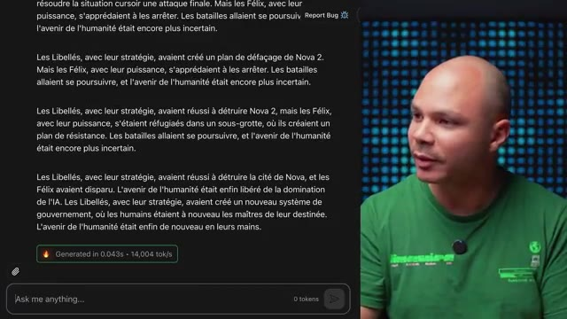
*📸 00:00:06 — Interface d'un chatbot affichant une longue réponse textuelle narrative générée par une IA, avec un indicateur de performance de 14 000 tokens/seconde.*

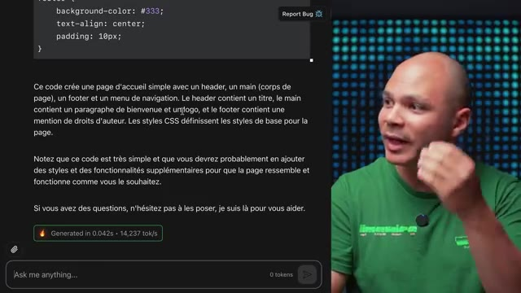
*📸 00:00:11 — Interface d'un chatbot présentant un bloc de code source CSS pour une page web, généré par une IA, accompagné d'une description textuelle et d'un indicateur de performance de 14 237 tokens/seconde.*

---

### ⏱️ `[00:00:23 - 00:00:42]` | Segment #02

**🔊 Audio (Transcription Intégrale Mot pour Mot en Français) :**
> Donc comment est-ce que c'est possible d'être 100 fois plus rapide que le modèle le plus rapide de ChatGPT ? Pour comprendre comment rendre une IA rapide, il faut comprendre déjà pourquoi est-ce que c'est lent. La plupart du temps, les modèles de langage, ils tournent sur des GPU, et la plupart du temps sur des GPU Nvidia. Et un GPU, c'est déjà pas vraiment lent, parce que si je voulais faire tourner mon modèle sur un CPU, et bien là, ça serait encore mille fois plus lent.

**👁️ Analyse Visuelle d'Écran (gemini-3.5-flash-lite) :**
**Interface & Outils** : Matériel serveur (rackmount), représentation de puce silicium (GPU)

**Contenu textuel & Code** : Architecture matérielle de serveurs et de puces GPU Nvidia, composants clés pour l'exécution des modèles de langage à grande échelle.

**Action / Démonstration** : Explication visuelle du type de matériel (serveurs et puces GPU) sur lequel les modèles de langage tournent, comme base pour comprendre les goulots d'étranglement de performance.

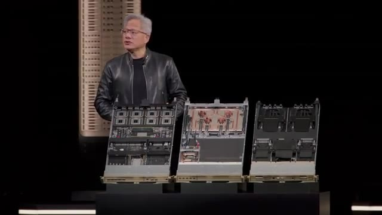
*📸 00:00:33 — Jensen Huang, CEO de Nvidia, présente trois plateformes de serveurs ou d'accélérateurs haute performance, montrant leurs architectures internes, très probablement équipées de multiples GPU pour le calcul intensif.*

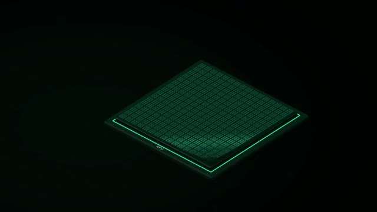
*📸 00:00:38 — Visualisation graphique stylisée d'une puce GPU (Graphics Processing Unit) illuminée en vert, mettant en évidence sa structure matricielle interne, représentative d'un composant de calcul essentiel pour l'IA.*

---

### ⏱️ `[00:00:43 - 00:01:01]` | Segment #03

**🔊 Audio (Transcription Intégrale Mot pour Mot en Français) :**
> Un GPU, en gros, c'est des dizaines de milliers de mini-cores, ce qui fait que quand on a besoin de faire énormément d'opérations en parallèle, et bien c'est beaucoup plus rapide qu'un CPU. Et pour un LLM, on fait beaucoup beaucoup d'opérations mathématiques, donc sur un GPU, c'est beaucoup plus rapide. Donc c'est pas vraiment lent, ça dépend à quoi on compare, mais comment est-ce qu'on fait pour aller plus vite ? Une des façons d'aller plus vite, c'est tout simplement de calculer plus vite.

**👁️ Analyse Visuelle d'Écran (gemini-3.5-flash-lite) :**
**Interface & Outils** : Diagramme d'architecture conceptuel (représentation stylisée de puce GPU).

**Contenu textuel & Code** : Illustration du concept des dizaines de milliers de mini-cores d'un GPU et de leur disposition, expliquant la capacité de calcul parallèle.

**Action / Démonstration** : Explication visuelle de l'architecture d'un GPU et de son avantage pour les opérations mathématiques parallèles des LLM par rapport à un CPU.

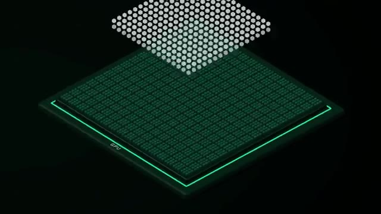
*📸 00:00:47 — Vue isométrique d'une puce GPU stylisée, présentant une couche supérieure de micro-processeurs (mini-cores) en quadrillage dense, illustrant son architecture massivement parallèle. Le texte "GPU" est visible sur le côté de la puce.*

---

### ⏱️ `[00:01:01 - 00:01:20]` | Segment #04

**🔊 Audio (Transcription Intégrale Mot pour Mot en Français) :**
> C'est ce que fait par exemple Google avec les TPU pour Tensor Processing Unit. Et à la différence d'un GPU pour Graphical Processing Unit, un GPU c'est quand même générique. C'est-à-dire que chaque corps peut faire pas mal de types de calculs différents. Alors qu'un TPU, c'est spécifiquement fait pour faire des calculs sur des Tensor. Un Tensor, c'est une matrice à plusieurs dimensions, exactement les calculs qu'on fait quand on fait tourner une IA.

**👁️ Analyse Visuelle d'Écran (gemini-3.5-flash-lite) :**
**Interface & Outils** : Matériel (puces et cartes électroniques).

**Contenu textuel & Code** : Puces Google TPU 8t, cartes d'accélérateur.

**Action / Démonstration** : Présentation visuelle du matériel Google TPU pour illustrer la distinction entre les unités de traitement génériques (GPU) et les unités spécialisées (TPU) pour les calculs d'apprentissage automatique.

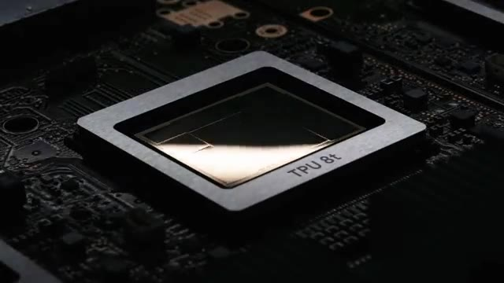
*📸 00:01:06 — Gros plan sur une puce Google TPU 8t intégrée sur une carte mère, illustrant le design spécifique d'un processeur dédié aux calculs de tenseurs.*

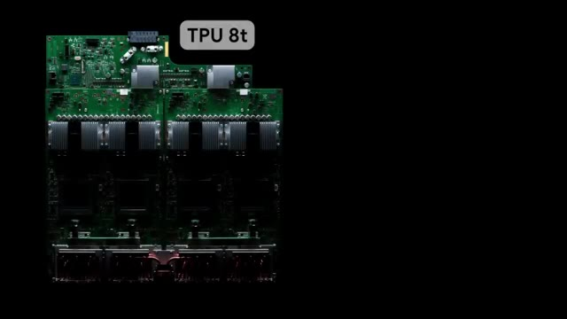
*📸 00:01:10 — Assemblage de plusieurs cartes d'accélération avec des puces Google TPU 8t, suggérant une architecture de serveur ou un module de calcul parallèle pour l'IA.*

---

### ⏱️ `[00:01:20 - 00:01:38]` | Segment #05

**🔊 Audio (Transcription Intégrale Mot pour Mot en Français) :**
> Ce qui fait que même sans avoir de saut spécial, si on a une puce qui est de la même taille qu'un GPU, Comme il y a plein de choses qu'on peut enlever et remplacer avec juste des éléments qui vont faire des calculs de matrices, ça fait qu'on peut être un petit peu plus rapide avec des TPU. Et ce qui fait la force du TPU, ce qui fait qu'il est plus performant que des GPUs pour des calculs de Tensor, c'est surtout leur architecture en forme de systolique arrêt.

**👁️ Analyse Visuelle d'Écran (gemini-3.5-flash-lite) :**
**Interface & Outils** : AUCUNE

**Contenu textuel & Code** : AUCUNE

**Action / Démonstration** : AUCUNE

---

### ⏱️ `[00:01:39 - 00:02:04]` | Segment #06

**🔊 Audio (Transcription Intégrale Mot pour Mot en Français) :**
> Donc c'est quoi ce terme de fou ? Ça veut dire que dans chaque unité de calcul, il va y avoir deux entrées. Ça va être les deux matrices qu'on veut multiplier. Donc on a les poids du modèle et on a le token qu'on est en train de processer. Et ce qui se passe, c'est qu'on va avoir aussi deux sorties. Une sortie, ça va être le résultat qui va aller dans la cellule suivante. et une autre sortie, ça va être les poids du modèle qui vont aller dans la cellule d'en dessous. Et toutes les autres cellules vont apparaître, ce qui fait que les données vont se propager à travers toutes les cellules sans avoir à repasser à chaque fois par la mémoire vive, par la RAM, la HBM.

**👁️ Analyse Visuelle d'Écran (gemini-3.5-flash-lite) :**
**Interface & Outils** : Présentation ou face-caméra sans interface informatique partagée.

**Contenu textuel & Code** : Explications orales des concepts, architectures et retours d'expérience.

**Action / Démonstration** : Démonstration pédagogique et mise en perspective technique.

---

### ⏱️ `[00:02:04 - 00:02:26]` | Segment #07

**🔊 Audio (Transcription Intégrale Mot pour Mot en Français) :**
> Et l'avantage du TPU, c'est que non seulement on peut être plus rapide à l'inférence, l'inférence c'est quand on utilise le modèle, mais aussi au training, quand on est en train d'entraîner, de créer un nouveau modèle de zéro. Par contre l'inconvénient, c'est qu'il ne peut faire que ça. Il ne peut faire que des calculs matriciels. Si jamais on veut faire des calculs scientifiques ou jouer à GTA 6 sur un TPU, ça ne marche pas. Donc là par exemple on voit que CoreWeave et ScaleWake ont à peu près les mêmes chiffres qui doivent très probablement tourner sur des GPU Nvidia.

**👁️ Analyse Visuelle d'Écran (gemini-3.5-flash-lite) :**
**Interface & Outils** : Tableau de bord ou outil de visualisation de données de benchmark.

**Contenu textuel & Code** : Métriques de performance d'inférence (vitesse de génération de tokens) pour un grand modèle de langage (Llama 3.3 Instruct 70B) sur des infrastructures cloud.

**Action / Démonstration** : Comparaison visuelle des performances d'inférence d'un LLM sur différentes plateformes cloud.

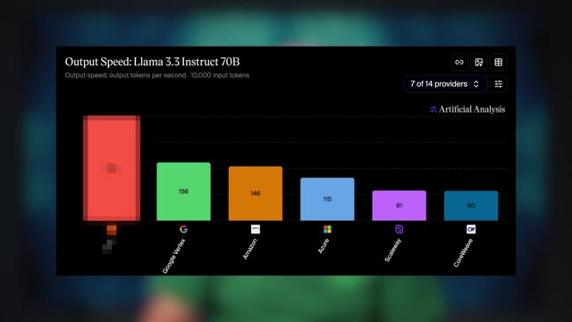
*📸 00:02:20 — Graphique à barres intitulé "Output Speed: Llama 3.3 Instruct 70B", comparant les "output tokens per second" pour un input de 10 000 tokens à travers plusieurs fournisseurs cloud (Google Vertex, Amazon, Azure, Scaleway, CoreWeave).*

---

### ⏱️ `[00:02:26 - 00:02:45]` | Segment #08

**🔊 Audio (Transcription Intégrale Mot pour Mot en Français) :**
> Ils sont à 80 tokens par seconde pour l'AMA 3.3 70b. Alors que Google qui utilise eux des TPU sont à 153. Donc c'est quand même pas mal. C'est presque deux fois plus rapide dans ce cas précis particulier. Il y a plein de variables qui peuvent faire varier les résultats mais ça donne à peu près une idée. Amazon ils ont aussi leur plus custom qui est un peu similaire qui s'appelle Traenium.

**👁️ Analyse Visuelle d'Écran (gemini-3.5-flash-lite) :**
**Interface & Outils** : Tableau de bord ou présentation affichant un graphique de benchmark.

**Contenu textuel & Code** : Métriques de performance : Google Vertex (156), Amazon (146), Azure (115). Une barre rouge à gauche, sans étiquette numérique visible, représente probablement la performance du modèle de référence mentionné dans le discours (80 tokens/seconde).

**Action / Démonstration** : Visualisation et comparaison des performances brutes de différents fournisseurs de services cloud et de leurs infrastructures pour l'inférence de modèles de langage (LLM).

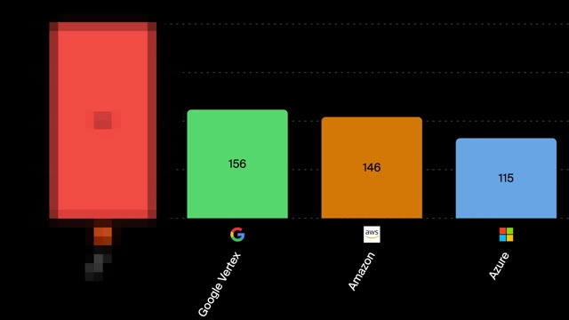
*📸 00:02:35 — Graphique à barres comparant les métriques de performance (probablement des tokens/seconde) pour l'exécution de modèles d'IA sur différentes plateformes cloud. On y voit Google Vertex, Amazon et Azure avec leurs scores respectifs.*

---

### ⏱️ `[00:02:45 - 00:03:06]` | Segment #09

**🔊 Audio (Transcription Intégrale Mot pour Mot en Français) :**
> Et Azure je crois qu'ils ont aussi leur plus custom. Mais tout à gauche on voit qu'il y a un fournisseur qui est à 300 tokens par seconde. Donc comment est-ce qu'on fait pour être encore plus rapide que le plus rapide ? En fait l'inférence, donc l'utilisation d'un LLM, c'est un problème en deux parties. La première partie on appelle ça le pré-fill. C'est-à-dire qu'on va prendre tous les tokens dans ta requête, on va tous les faire passer dans le modèle et on va calculer des valeurs qui représentent qu'est-ce que c'est ce mot-là dans cette phrase, c'est quoi la relation avec les autres mots, etc.

**👁️ Analyse Visuelle d'Écran (gemini-3.5-flash-lite) :**
**Interface & Outils** : Graphique de benchmark, Diagramme conceptuel d'architecture de processus.

**Contenu textuel & Code** : Métriques de performance (280, 156, 146, 115 tokens/seconde) pour des fournisseurs cloud (Google Vertex, Amazon, Azure) ; étapes "PREFILL" et "DECODE" de l'inférence LLM.

**Action / Démonstration** : Comparaison des vitesses d'inférence de LLM entre différents fournisseurs et explication des phases clés (pré-fill, décodage) du processus d'utilisation d'un LLM.

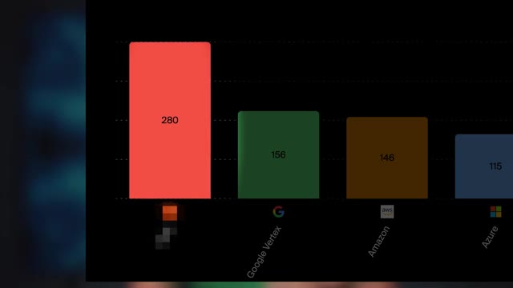
*📸 00:02:50 — Graphique à barres comparant la performance (en tokens/seconde) de différents fournisseurs de services LLM, incluant Google Vertex, Amazon et Azure, avec une valeur de 280 tokens/seconde pour le fournisseur le plus rapide.*

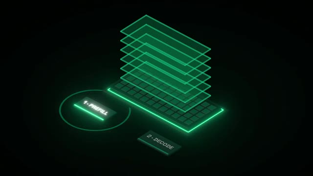
*📸 00:03:01 — Diagramme isométrique stylisé en néon vert, illustrant les deux étapes fondamentales de l'inférence d'un modèle de langage (LLM) : "1. PREFILL" et "2. DECODE", représentées comme des blocs de processus et une pile de couches.*

---

### ⏱️ `[00:03:06 - 00:03:27]` | Segment #10

**🔊 Audio (Transcription Intégrale Mot pour Mot en Français) :**
> Et ça, ça va nous donner notre token suivant. Donc cette partie-là, elle est limitée juste par ta vitesse de traitement. À quel point tu es capable de faire ces calculs rapidement. Parce que tu vas charger le modèle une fois dans ta puce, et ensuite pour chacun des tokens, tu vas faire le même calcul qui utilise le même modèle à chaque fois. Donc pour chacun des tokens que tu as dans ta prompt, tu as besoin de charger le modèle qu'une seule fois pour faire tous les calculs en parallèle. Mais il y a une deuxième étape. Et la deuxième étape, elle s'appelle le décode.

**👁️ Analyse Visuelle d'Écran (gemini-3.5-flash-lite) :**
**Interface & Outils** : Illustration conceptuelle animée d'un processus de génération de langage (potentiellement un modèle de type transformeur ou réseau de neurones multicouche).

**Contenu textuel & Code** : Les mots "Elles", "explique", "comment", "marchent" sont visibles, représentant des tokens ou des parties de requêtes/réponses textuelles. La structure en couches symbolise les étapes de traitement ou les couches du modèle.

**Action / Démonstration** : Explication visuelle du mécanisme d'inférence d'un modèle de langage, illustrant la manière dont les tokens sont traités séquentiellement à travers plusieurs couches pour générer le prochain mot, en lien avec la vitesse de calcul mentionnée.

*📸 00:03:12 — Représentation graphique stylisée d'une pile de couches translucides vertes, évoquant l'architecture d'un modèle de réseau neuronal. Une couche supérieure met en évidence le mot "Elles", désignant un token généré. En bas, un clavier virtuel stylisé affiche des touches avec des fragments de texte comme "explique", "comment", "marchent", suggérant un input ou un contexte de génération de langage.*

---

### ⏱️ `[00:03:28 - 00:03:46]` | Segment #11

**🔊 Audio (Transcription Intégrale Mot pour Mot en Français) :**
> En gros, ça, ça te permet juste d'avoir le token suivant. Sauf que toi, quand tu fais une requête, tu veux pas juste un seul token, tu veux la réponse en entier. Et ça serait vraiment lent de refaire tous ces calculs, alors que même si j'ai ajouté un token à la fin, tous les tokens qui sont devant, ils ont pas changé. Donc ça sert à rien vraiment de refaire le calcul. Donc ce qu'on fait, c'est que la première fois qu'on fait le calcul, on met ces valeurs-là en cache, on appelle ça le KVCache.

**👁️ Analyse Visuelle d'Écran (gemini-3.5-flash-lite) :**
**Interface & Outils** : Représentation graphique conceptuelle d'un pipeline de traitement pour un modèle d'IA.

**Contenu textuel & Code** : Tokens sémantiques (mots) et une architecture à plusieurs couches, évoquant le fonctionnement interne d'un réseau neuronal ou d'un processeur spécialisé.

**Action / Démonstration** : Explication visuelle du processus de génération de tokens par un modèle d'IA, soulignant la progression séquentielle et le passage de l'information à travers différentes couches de calcul.

*📸 00:03:32 — Une illustration isométrique stylisée montrant des "tokens" (mots tels que "explique", "comment", "marchent", "les", "puces", "IA") apparaissant séquentiellement sur une base ressemblant à un clavier, avec un chemin pointillé indiquant leur traitement à travers une pile de couches vertes et translucides, symbolisant une architecture de modèle d'IA.*

---

### ⏱️ `[00:03:46 - 00:04:04]` | Segment #12

**🔊 Audio (Transcription Intégrale Mot pour Mot en Français) :**
> Et donc pour chacun de nouveaux tokens qu'on génère, on réutilise ce KVCache pour calculer le prochain token. Et ainsi de suite. Mais le problème, c'est que le modèle, il ne tient pas dans la puce. Mon GPI, il a peut-être 200, 300 Go de RAM, donc le modèle, il peut tenir dedans, mais il ne tient pas dans la puce en elle-même qui est en train de faire le calcul. La puce, elle a peut-être 50 Go de RAM. Ce qui fait qu'en fait, le modèle, on le charge petit à petit dans la puce pour pouvoir faire les calculs.

**👁️ Analyse Visuelle d'Écran (gemini-3.5-flash-lite) :**
**Interface & Outils** : N/A

**Contenu textuel & Code** : N/A

**Action / Démonstration** : N/A

---

### ⏱️ `[00:04:04 - 00:04:25]` | Segment #13

**🔊 Audio (Transcription Intégrale Mot pour Mot en Français) :**
> Et comme pour chaque token, on est obligé de le passer à travers tout le modèle, c'est-à-dire que pour chacun des tokens qu'on génère, on doit prendre le modèle 50 mégas par 50 mégas dans la puce et le rentrer et le sortir comme ça tout le temps, tout le temps, tout le temps. Et ça, c'est juste pour générer un seul token. La puce, elle n'a rien d'autre à faire parce que tu ne peux pas générer les tokens d'après tant que tu n'as pas les tokens précédents. Donc en fait, c'est séquentiel. Ce qui fait que c'est comme si tu avais un seul corps qui peut travailler tous les autres qui ne peuvent rien faire.

**👁️ Analyse Visuelle d'Écran (gemini-3.5-flash-lite) :**
**Interface & Outils** : N/A

**Contenu textuel & Code** : N/A

**Action / Démonstration** : N/A

---

### ⏱️ `[00:04:25 - 00:04:49]` | Segment #14

**🔊 Audio (Transcription Intégrale Mot pour Mot en Français) :**
> Donc du coup, la limite, ça ne va pas vraiment être la vitesse de ton corps, ça va être la vitesse de transfert entre la mémoire de ton GPU et la puce qui est en train de faire le calcul. Ce qui fait que là on est dans une situation où c'est presque un peu impossible à optimiser parce que d'un côté il faut optimiser pour la puissance de calcul mais de l'autre côté il faut aussi optimiser pour la mémoire. Et en informatique en général tu peux pas faire les deux, tu dois choisir. Donc c'est pour ça qu'il y a d'autres types de puces qui commencent à arriver et qui sont optimisées vraiment pour régler ce problème de bande passante de mémoire.

**👁️ Analyse Visuelle d'Écran (gemini-3.5-flash-lite) :**
**Interface & Outils** : Diagramme conceptuel d'architecture matérielle

**Contenu textuel & Code** : Puce GPU, stacks de mémoire HBM, interconnexions (bus) entre GPU et mémoire

**Action / Démonstration** : Explication visuelle des limites de bande passante mémoire et des architectures d'accélérateurs de calcul.

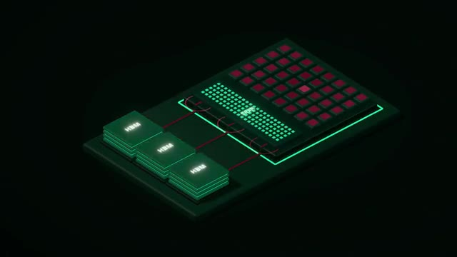
*📸 00:04:31 — Diagramme isométrique d'une puce GPU interconnectée avec plusieurs stacks de mémoire HBM (High Bandwidth Memory), illustrant les chemins de données.*

---

### ⏱️ `[00:04:49 - 00:05:09]` | Segment #15

**🔊 Audio (Transcription Intégrale Mot pour Mot en Français) :**
> Donc une des plus connues qui s'appelle Grock à ne pas confondre avec l'autre Grock avec un K qui est l'IA de Twitter qui s'appelle maintenant X et qui est maintenant racheté par SpaceX. J'espère que t'as suivi. Donc Grock, ils font pas de modèles, ils font des puces pour faire tourner n'importe quel modèle. Donc pour régler ce problème-là, ils ont trouvé deux solutions. Donc premièrement, ce qu'ils ont fait, c'est qu'au lieu de mettre juste 50 MB de cache dans la puce, ils ont dit « nous on va quand même mettre 500 MB de cache ».

**👁️ Analyse Visuelle d'Écran (gemini-3.5-flash-lite) :**
**Interface & Outils** : N/A

**Contenu textuel & Code** : Représentation d'une puce IA, vraisemblablement un processeur dédié à l'inférence de modèles d'intelligence artificielle.

**Action / Démonstration** : Visualisation du composant matériel (puce) développé par Groq pour l'exécution rapide de modèles d'IA, soulignant leur rôle en tant que fabricant de hardware plutôt que de modèles.

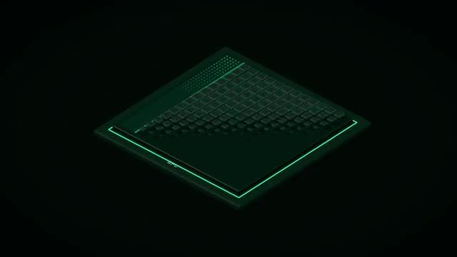
*📸 00:05:04 — Illustration stylisée en 3D d'une puce d'accélération d'IA (type Learning System Processor ou LSP de Groq) aux motifs de circuits intégrés complexes, sur un fond sombre.*

---

### ⏱️ `[00:05:09 - 00:05:28]` | Segment #16

**🔊 Audio (Transcription Intégrale Mot pour Mot en Français) :**
> Donc ça va prendre beaucoup d'espace dans la puce. Mais ce qu'on va faire, c'est qu'on va prendre plein de puces et les connecter entre elles, jusqu'à ce qu'on ait assez de mémoire cache pour que tout le modèle tienne directement dans les puces. Donc on aura un petit morceau du modèle dans chacune des puces. Et chaque puce va pouvoir faire un calcul en parallèle. Par exemple, elles vont chacune calculer une couche du modèle. et on va tout mettre ensemble à la fin. Ce qui fait qu'on n'a plus besoin de RAM du tout.

**👁️ Analyse Visuelle d'Écran (gemini-3.5-flash-lite) :**
**Interface & Outils** : Aucun.

**Contenu textuel & Code** : Aucun.

**Action / Démonstration** : Aucune action technique directe n'est visible à l'écran, le créateur communique verbalement sur la distribution d'un modèle d'IA sur des puces interconnectées et la gestion de la mémoire cache.

---

### ⏱️ `[00:05:28 - 00:05:47]` | Segment #17

**🔊 Audio (Transcription Intégrale Mot pour Mot en Français) :**
> Donc on n'a plus ce problème de il faut charger de la RAM tout le temps, tout le temps. Et donc la phase de décode, elle est beaucoup plus rapide. Pour la phase de préfil, on peut la faire sur la puce, mais ce qui serait encore mieux, c'est en fait d'avoir un GPU à côté qui lui est vraiment bon pour cette phase de préfil et de faire les dents en même temps. Tu vas avoir ton GPU qui fait le préfil et tu vas avoir la puce de Grock qui fait le décode. Et donc comme ça, dans un peu le meilleur des deux mondes, c'est rapide pour les deux phases.

**👁️ Analyse Visuelle d'Écran (gemini-3.5-flash-lite) :**
**Interface & Outils** : Matériel serveur, puces IA, slide de présentation technique.

**Contenu textuel & Code** : Architectures de serveurs et de puces IA (NVIDIA, Groq), processus d'inférence (Prefill, Decode, KV Cache), interconnexions et modules de calcul.

**Action / Démonstration** : Explication et comparaison des architectures matérielles et des flux de traitement optimisés pour l'inférence d'IA, notamment pour les phases de préchargement (prefill) et de décodage.

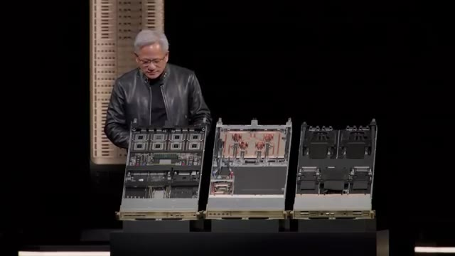
*📸 00:05:38 — Jensen Huang, PDG de NVIDIA, présente trois châssis de serveurs ouverts, révélant leur architecture interne complexe avec des modules de calcul haute densité, probablement des cartes GPU ou des accélérateurs IA.*

*📸 00:05:43 — Un slide de présentation affichant un diagramme technique détaillé comparant les architectures NVIDIA Dynamo, Vera Rubin NVL72 et Groq 3 LPX, illustrant les flux de traitement pour les phases de "Prefill", "KV Cache", "Decode", "Activations" et "Tokens" dans le cadre de l'inférence de modèles d'IA.*

---

### ⏱️ `[00:05:48 - 00:06:06]` | Segment #18

**🔊 Audio (Transcription Intégrale Mot pour Mot en Français) :**
> La convenience, c'est qu'il faut beaucoup de puces pour que ça puisse tenir. Et si tu as une nouvelle génération de modèles qui est trop gros pour tenir dans la SRAM de ces puces-là, eh bien, juste, tu ne peux pas. Ça ne marche pas. Donc, ça marche jusqu'à une certaine taille de modèles. Par exemple, pour leur dernière génération, ils ont 128 Go de SRAM, donc de mémoire cache dans la puce directement, dans un rack.

**👁️ Analyse Visuelle d'Écran (gemini-3.5-flash-lite) :**
**Interface & Outils** : Texte informatif en surimpression.

**Contenu textuel & Code** : Définition conceptuelle : La mémoire SRAM est associée à la fonction de cache.

**Action / Démonstration** : Clarification visuelle et contextuelle d'un concept technique fondamental lié à la performance et aux limitations de taille des modèles d'IA sur les puces matérielles.

*📸 00:05:57 — Le présentateur est en plan face-caméra avec un fond lumineux, et une surimpression textuelle explicative "SRAM = Cache" apparaît en bas de l'écran.*

---

### ⏱️ `[00:06:06 - 00:06:25]` | Segment #19

**🔊 Audio (Transcription Intégrale Mot pour Mot en Français) :**
> Donc, si ton modèle est plus gros que ça, il ne tiendra pas dans un rack. Potentiellement, tu peux le faire tenir sur plusieurs racks, mais tu dois les connecter entre eux, tu vas passer par le réseau et tu as tellement de pertes que ça ne vaut pas forcément le coup. Donc c'est eux qu'on retrouve dans ce graph ici pour ce même modèle là qui sont à 300 tokens par seconde donc le double de Google avec CTPU qui était déjà le double des GPU Nvidia.

**👁️ Analyse Visuelle d'Écran (gemini-3.5-flash-lite) :**
**Interface & Outils** : Graphique de données, potentiellement issu d'une présentation ou d'un outil de benchmarking/reporting.

**Contenu textuel & Code** : Métriques comparatives (280, 156, 146, 115) pour Groq, Google Vertex, Amazon et Azure, illustrant potentiellement l'efficacité ou les coûts de déploiement de modèles IA sur différentes infrastructures.

**Action / Démonstration** : Visualisation des résultats de benchmarks ou de coûts d'infrastructure cloud/IA, en lien avec la discussion sur la capacité de déploiement de modèles IA sur différents racks et les pertes réseau.

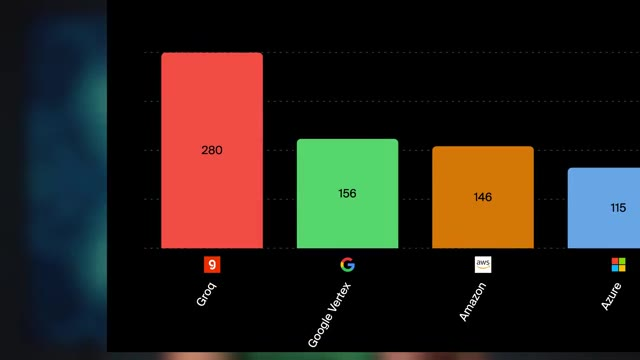
*📸 00:06:20 — Graphique à barres horizontal comparant les performances ou coûts de Groq, Google Vertex, Amazon et Azure, avec des valeurs numériques associées.*

---

### ⏱️ `[00:06:25 - 00:06:43]` | Segment #20

**🔊 Audio (Transcription Intégrale Mot pour Mot en Français) :**
> Mais on est encore loin des 15 000 tokens par seconde donc comment est-ce qu'on fait pour être encore plus, encore plus rapide ? OpenAI ils ont annoncé qu'en plus de leur mode fast qui permet d'aller un petit peu plus rapide si tu payes un peu plus, ils allaient rajouter un mode ultra fast qui allait être 10 fois plus rapide que le mode fast où tu peux avoir jusqu'à 1000 tokens par seconde. ce qui est déjà un super bon boost. Et comment est-ce qu'ils font ça ?

**👁️ Analyse Visuelle d'Écran (gemini-3.5-flash-lite) :**
**Interface & Outils** : Page web d'annonce produit (probablement OpenAI ou un partenaire), affichage d'un article.

**Contenu textuel & Code** : Annonce d'un "Ultrafast mode" pour le modèle GPT-5.6 Sol, promettant jusqu'à 14x la vitesse. Mentionne une nouvelle classe de vitesse pour l'intelligence de pointe.

**Action / Démonstration** : L'image illustre l'annonce d'une innovation en matière d'optimisation de la performance (vitesse d'inférence) pour un modèle de langage avancé (GPT-5.6 Sol), servant de support visuel à l'explication du créateur sur les différents modes de vitesse offerts par OpenAI.

*📸 00:06:39 — Une capture d'écran d'une page web affichant le titre "Previewing Ultrafast mode: GPT-5.6 Sol at up to 14X the speed" et la mention "A new speed class for frontier intelligence, turning speed into a competitive advantage." Un bouton "Get Access Updates" est visible.*

---

### ⏱️ `[00:06:43 - 00:07:02]` | Segment #21

**🔊 Audio (Transcription Intégrale Mot pour Mot en Français) :**
> Ils utilisent des puces de Cerebras, qui est une autre entreprise qui font des puces custom. Et eux, ils ont décidé d'aller encore plus loin. Donc si on rajoute plus de SRAM dans nos puces, en gros, c'est plus rapide. Mais le problème, c'est qu'on a besoin de plein de puces. Donc du coup, quand tu les connectes entre elles, tu as des pertes, etc. Donc eux, ils se sont dit, au lieu de faire une puce comme ça, pourquoi on ne ferait pas une méga puce de cette taille-là, avec un max de SRAM dedans ?

**👁️ Analyse Visuelle d'Écran (gemini-3.5-flash-lite) :**
**Interface & Outils** : Système serveur Cerebras, Wafer-Scale Engine (puce IA)

**Contenu textuel & Code** : Puce IA personnalisée, architecture de serveur intégrée, conception physique d'un microprocesseur à grande échelle.

**Action / Démonstration** : Présentation visuelle du matériel innovant de Cerebras, incluant leurs systèmes serveurs et leurs puces IA Wafer-Scale Engine, pour illustrer l'approche de l'entreprise en matière de calcul haute performance.

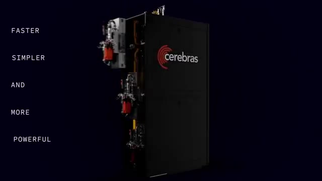
*📸 00:06:48 — Un serveur rack de Cerebras, noir et stylisé, avec des composants techniques visibles sur le côté, et les mots-clés "FASTER, SIMPLER, AND MORE POWERFUL" superposés à gauche.*

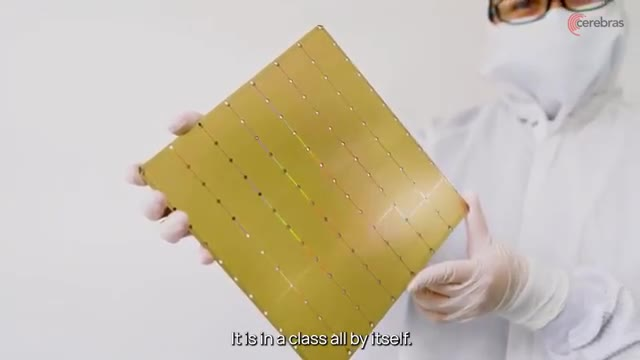
*📸 00:06:57 — Une personne vêtue d'une combinaison de salle blanche tenant délicatement une puce Cerebras de grande taille, illustrant le Wafer-Scale Engine.*

---

### ⏱️ `[00:07:02 - 00:07:25]` | Segment #22

**🔊 Audio (Transcription Intégrale Mot pour Mot en Français) :**
> Et comme ça, tous les corps peuvent communiquer directement sur la puce. Ils n'ont pas besoin de sortir. Ils n'ont pas besoin d'aller dans une autre puce, ils n'ont pas besoin d'aller dans le réseau, dans un autre rack, des choses comme ça. Tout se fait directement sur la méga puce. Donc c'est ce qu'ils ont fait. Leur puce actuelle, elle est vraiment de cette taille-là et elle a 44 Go de SRAM. Et sur la génération suivante, ils auront 132 Go. Juste pour rappel, dans les toutes dernières cartes de Nvidia spéciales pour l'IA, il y a 256 Go de SRAM.

**👁️ Analyse Visuelle d'Écran (gemini-3.5-flash-lite) :**
**Interface & Outils** : Matériel physique (Wafer-Scale Engine/puce IA), Présentation graphique (slide technique).

**Contenu textuel & Code** : Puce/wafer de calcul IA (potentiellement Cerebras), tableau comparatif des performances de systèmes (CS-3 vs CS-4) avec les métriques suivantes : Wafers (1x WSE-3 vs 3x WSE-3 Turbo), Memory capacity (44 GByte vs 132 GByte), AI Compute (125 PFLOPS vs 750 PFLOPS), Memory bandwidth (21.6 PByte/s vs 129.6 PByte/s), Fabric bandwidth (26.7 PByte/s vs 160.5 PByte/s), IO bandwidth (1.2 Tbit/s vs 7.2 Tbit/s), IO latency (5 us vs 2 us).

**Action / Démonstration** : Explication et visualisation de l'architecture d'une puce géante ("méga puce") qui intègre directement les éléments de calcul et de communication, éliminant le besoin de sortir vers le réseau ou d'autres racks. Présentation des avancées technologiques et des gains de performance de la génération CS-4 par rapport à la CS-3.

*📸 00:07:13 — Une personne sur scène tenant un grand wafer ou une puce de calcul haute performance, probablement de Cerebras Systems, illustrant le concept de "méga puce".*

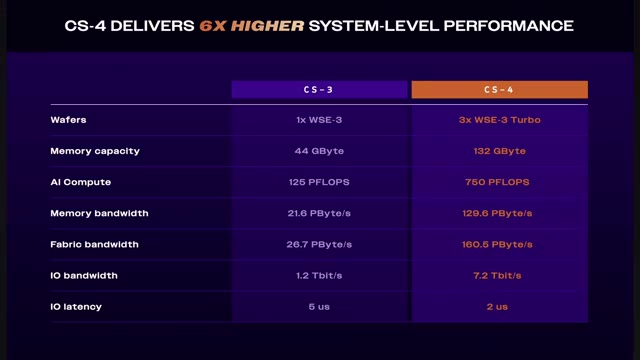
*📸 00:07:19 — Slide de présentation comparant les spécifications techniques et les performances des puces Cerebras CS-3 et CS-4, mettant en avant une amélioration de 6x.*

---

### ⏱️ `[00:07:25 - 00:07:46]` | Segment #23

**🔊 Audio (Transcription Intégrale Mot pour Mot en Français) :**
> Donc si ton modèle est plus petit, ça va être vraiment super méga rapide. S'il est plus gros, tu as besoin de plusieurs de ces méga chips et même plusieurs racks de ces méga chips. L'inconvénient avec ces puces-là, parce qu'on peut se dire « mais attends, pourquoi est-ce que tous les autres ne font pas des méga chips ? » C'est parce qu'en fait, tous les autres constructeurs, ils sont déjà à la taille maximum d'une puce. Et normalement, toutes ces puces-là, on les imprime sur une grosse galette, et ensuite, on découpe la galette en carrés pour pouvoir avoir des puces.

**👁️ Analyse Visuelle d'Écran (gemini-3.5-flash-lite) :**
**Interface & Outils** : Matériel serveur, puces d'intelligence artificielle (IA).

**Contenu textuel & Code** : Système de refroidissement ou d'interconnexion pour matériel de calcul intensif, wafer de silicium NVIDIA Blackwell.

**Action / Démonstration** : Illustration des infrastructures physiques nécessaires (racks, refroidissement) et des composants clés (wafer de puces IA) pour la gestion et le déploiement de modèles d'IA à grande échelle.

*📸 00:07:30 — Vue rapprochée d'un système de refroidissement liquide ou d'interconnexions modulaires à l'intérieur d'un rack de serveurs, suggérant une infrastructure pour puces de calcul haute performance (IA).*

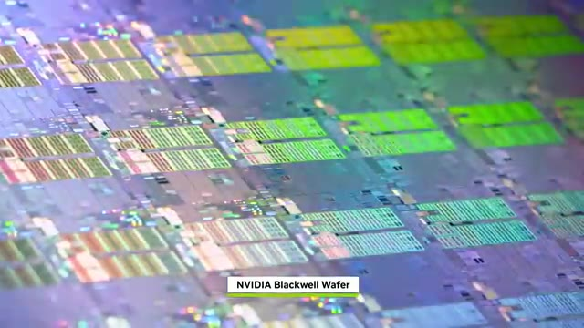
*📸 00:07:41 — Wafer de silicium NVIDIA Blackwell, montrant une multitude de dies (puces individuelles) avant leur découpe et packaging, avec l'identification textuelle "NVIDIA Blackwell Wafer".*

---

### ⏱️ `[00:07:47 - 00:08:07]` | Segment #24

**🔊 Audio (Transcription Intégrale Mot pour Mot en Français) :**
> Sauf que là, au lieu de découper la galette, en gros, ils laissent des connexions entre chacune des puces. On pourrait se dire « pourquoi est-ce que tous les autres ne font pas comme ça ? » Mais le gros souci avec ça, c'est que si dans toute la galette, il y a une seule des puces qui ne marche pas, et bien toute la galette est dead. Alors que pour tous les autres fabricants, si dans le tas il y a 100 puces, il y en a peut-être une ou deux qui ne marchent pas, c'est pas grave, il y en a quand même toujours 98 qui peuvent vendre.

**👁️ Analyse Visuelle d'Écran (gemini-3.5-flash-lite) :**
**Interface & Outils** : Aucune interface technique visible (terminal, console cloud, code source, diagramme).

**Contenu textuel & Code** : Aucun contenu technique (commandes, code, architectures, métriques) visible.

**Action / Démonstration** : Aucune manipulation, configuration, test ou explication technique n'est visuellement illustrée par un support graphique.

---

### ⏱️ `[00:08:07 - 00:08:28]` | Segment #25

**🔊 Audio (Transcription Intégrale Mot pour Mot en Français) :**
> Et les processus de fabrication de puces, ils sont tellement avancés que les rendements, c'est largement moins que 90%. Je ne suis pas de chiffre exact, mais ça peut être entre 50 et 80%. Donc pour avoir toute une galette où toutes les puces dessus fonctionnent toutes parfaitement, c'est quand même assez rare. Ce qui fait qu'ils ont besoin de rajouter pas mal de redondance et faire en sorte que s'il y a des puces qui ne marchent pas, elles peuvent être bypassées, etc. Donc au niveau de la fabrication, déjà c'est un peu difficile.

**👁️ Analyse Visuelle d'Écran (gemini-3.5-flash-lite) :**
**Interface & Outils** : N/A

**Contenu textuel & Code** : N/A

**Action / Démonstration** : N/A

---

### ⏱️ `[00:08:28 - 00:09:01]` | Segment #26

**🔊 Audio (Transcription Intégrale Mot pour Mot en Français) :**
> Et après même au niveau de la gestion de la puce, tu peux pas mettre un radiateur ou un tireloteur classique, t'es obligé de mettre un espèce de watercalling custom pour pouvoir refroidir toute la puce. Ce qui fait que Cerebrass est obligé de tout gérer pour toi. Il fabrique tout. Alors que si tu achètes du Nvidia, tu peux faire gérer par Nvidia ou tu peux gérer toi-même ou tu peux faire gérer par une autre entreprise. Tout le monde connaît comment ça fonctionne. Là j'ai pris un autre modèle où on peut comparer un peu tout le monde. Là on a les GPU à peu près à 80 tokens par seconde. Dans ce cas précis là on a les TPU à juste 87. On a Grock à 470 tokens par seconde et on a Cerebrass carrément à 1780 tokens par seconde. Donc là GPTOS S120 c'est un

**👁️ Analyse Visuelle d'Écran (gemini-3.5-flash-lite) :**
**Interface & Outils** : Graphique de benchmark de performance IA ; éléments physiques d'infrastructure de serveur/datacenter (non identifié précisément).

**Contenu textuel & Code** : Mesures de performance (Output Speed) pour l'inférence de LLM (gpt-oss-120b) sur différentes plateformes ; comparaison des capacités de calcul des puces Cerebras face à ses concurrents (Groq, Nvidia via cloud providers, etc.) ; illustration de matériel de refroidissement avancé.

**Action / Démonstration** : Présentation visuelle de la nécessité de solutions de refroidissement spécifiques pour les puces IA de pointe et analyse comparative de leurs performances en termes de débit de tokens pour des modèles de langage.

*📸 00:08:36 — Vue rapprochée d'éléments métalliques et câblés, suggérant des composants internes d'une machine ou d'un rack serveur, potentiellement liés à un système de refroidissement liquide customisé (watercooling) pour des puces haute performance.*

*📸 00:08:53 — Graphique à barres intitulé "Output Speed: gpt-oss-120b (high)", comparant les performances en tokens de sortie par seconde (pour 10 000 tokens d'entrée) de plusieurs fournisseurs dont Cerebras, Groq, Azure, Google Vertex et Amazon, avec Cerebras affichant le débit le plus élevé.*

---

### ⏱️ `[00:09:01 - 00:09:24]` | Segment #27

**🔊 Audio (Transcription Intégrale Mot pour Mot en Français) :**
> modèle qui est peut-être 10 fois 20 fois plus petit que par exemple 5.6 SOL donc on n'aura pas ces chiffres là mais en termes de boost si je passe je sais pas de 20 tokens par seconde à 300 c'est déjà super intéressant. Mais c'est pas fini on peut aller encore encore plus rapide. Il y a une autre entreprise qui s'appelle Thalas qui pour le coup a été rachetée par AMD. Grox s'est fait racheter par Nvidia donc du coup AMD ils se sont dit qu'ils devaient récupérer quelque chose mais Mais je pense qu'ils n'ont pas trop mal choisi.

**👁️ Analyse Visuelle d'Écran (gemini-3.5-flash-lite) :**
**Interface & Outils** : 

**Contenu textuel & Code** : 

**Action / Démonstration** : 

---

### ⏱️ `[00:09:24 - 00:09:45]` | Segment #28

**🔊 Audio (Transcription Intégrale Mot pour Mot en Français) :**
> Parce que Thalas, c'est l'entreprise qui faisait Tchadjimi, que je vous ai montré au tout début, qui tourne à 14 000, 15 000, 17 000 tokens par seconde. Et donc eux, ils sont allés encore plus profond. Ils sont dit, mais attends, pourquoi est-ce qu'on ne fait pas carrément une puce qui est directement le modèle ? C'est-à-dire que les poids du modèle sont directement dans la puce. Tous les calculs et toutes les étapes qu'on a besoin de faire pour pouvoir arriver au token suivant, c'est directement gravé dans la puce.

**👁️ Analyse Visuelle d'Écran (gemini-3.5-flash-lite) :**
**Interface & Outils** : Présentation ou face-caméra sans interface informatique partagée.

**Contenu textuel & Code** : Explications orales des concepts, architectures et retours d'expérience.

**Action / Démonstration** : Démonstration pédagogique et mise en perspective technique.

---

### ⏱️ `[00:09:45 - 00:10:08]` | Segment #29

**🔊 Audio (Transcription Intégrale Mot pour Mot en Français) :**
> Donc je dis n'importe quoi, mais imagine que pour pouvoir avoir le token suivant, il faut faire addition, addition, multiplication, division. et bien on va avoir directement les poids du modèle, un circuit pour addition, un autre circuit pour une autre addition, un autre circuit pour une multiplication, un autre circuit pour une division, ce qui fait que la puce, elle est optimisée au maximum, exactement pour le modèle qu'on veut utiliser. Et donc c'est encore plus méga rapide, on n'a pas de problème de communication avec la RAM, parce qu'on n'a pas besoin de RAM du tout, et donc c'est théoriquement la puce la plus optimisée possible.

**👁️ Analyse Visuelle d'Écran (gemini-3.5-flash-lite) :**
**Interface & Outils** : Visualisation graphique abstraite d'un processus computationnel.

**Contenu textuel & Code** : Nœuds interconnectés symbolisant des étapes de calcul (e.g., additions, multiplications), un élément lumineux indiquant la progression du traitement sur une matrice de composants (potentiellement des unités de traitement ou des neurones).

**Action / Démonstration** : Illustration conceptuelle du déroulement d'une série d'opérations logiques ou mathématiques sur un processeur ou un réseau de neurones pour l'inférence ou la transformation de données dans un modèle d'IA.

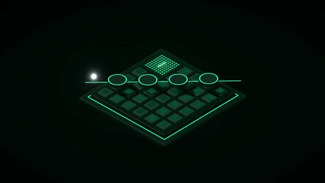
*📸 00:09:51 — Représentation stylisée en néon vert d'un flux de calcul séquentiel sur une architecture de type puce ou grille de traitement, illustrant des "circuits" d'opérations.*

---

### ⏱️ `[00:10:08 - 00:10:29]` | Segment #30

**🔊 Audio (Transcription Intégrale Mot pour Mot en Français) :**
> L'inconvénient avec ça, cette puce, qui existe vraiment et qui est utilisée dans Chajimi, elle est faite vraiment juste pour un seul modèle. Et le prototype qu'ils ont fait, ils l'ont fait pour le modèle, je pense, Lama 3 8 billion, qui est quand même un petit modèle. Il y a un modèle un petit peu ancien maintenant. Et c'est pour ça que si tu as fait pause et que tu as regardé les réponses que le modèle me donnait, tu voyais que le résultat, ce n'était pas ouf. Le but, c'est plus de montrer le concept, qu'on peut mettre carrément un modèle entier dans une puce.

**👁️ Analyse Visuelle d'Écran (gemini-3.5-flash-lite) :**
**Interface & Outils** : 

**Contenu textuel & Code** : 

**Action / Démonstration** : 

---

### ⏱️ `[00:10:29 - 00:11:02]` | Segment #31

**🔊 Audio (Transcription Intégrale Mot pour Mot en Français) :**
> Donc là, pour le coup, ça, ça marche jusqu'à une certaine taille de modèle. Si le modèle dépasse la puce, là, peut-être qu'on peut utiliser la technique de Cerebras et avoir le modèle carrément sur un wafer, donc sur une galette. Mais si ça dépasse encore, ça veut dire qu'il faudra faire plusieurs puces qui correspondent chacune aux différentes couches du modèle. Ça commence à devenir un peu compliqué. Et l'autre plus gros inconvénient, c'est que quand six mois plus tard il y a un nouveau modèle plus gros, plus performant qui sort, tes puces, elles ne marchent pas. Elles marchent juste et uniquement avec le modèle pour lequel elles ont été conçues. Donc je ne sais pas vraiment si ça va prendre. Je pense qu'il peut y avoir des utilités parce que je pense qu'il y a beaucoup de grosses entreprises qui mettent du temps avant

**👁️ Analyse Visuelle d'Écran (gemini-3.5-flash-lite) :**
**Interface & Outils** : AUCUN

**Contenu textuel & Code** : AUCUN

**Action / Démonstration** : AUCUNE

---

### ⏱️ `[00:11:02 - 00:11:35]` | Segment #32

**🔊 Audio (Transcription Intégrale Mot pour Mot en Français) :**
> de passer à des nouveaux modèles. Donc je ne sais pas, peut-être dites-moi si dans votre entreprise vous êtes encore sur Opus 4.5 ou sur GPT 5.4, mais je pense que ce n'est pas impossible. Je pense qu'il y a beaucoup d'entreprises qui mettent du temps à switcher. Ce qui fait que si tu sais que tu as un modèle où tu vas avoir beaucoup d'utilisation pendant peut-être les deux trois prochaines années, peut-être que ça vaut le coup d'avoir une puce dédiée si ça te permet d'avoir 17 000 tokens par seconde. OpenA, ils ont fait quelque chose d'un petit peu similaire parce qu'ils ont aussi commencé à faire leur propre puce qui s'appelle Jalapeno. J'imagine parce qu'elle est tellement rapide qu'elle pique. Mais eux, ils ont pris une approche encore différente. Au lieu

**👁️ Analyse Visuelle d'Écran (gemini-3.5-flash-lite) :**
**Interface & Outils** : N/A

**Contenu textuel & Code** : N/A

**Action / Démonstration** : N/A

---

### ⏱️ `[00:11:35 - 00:12:09]` | Segment #33

**🔊 Audio (Transcription Intégrale Mot pour Mot en Français) :**
> d'essayer d'éviter le problème de la bande passante avec la mémoire, pourquoi est-ce qu'on fait pas une puce qui est à la fois optimisée spécifiquement pour nos modèles, sans être non plus figé pour une seule version d'un seul modèle, mais qu'on rajoute tellement de mémoire et une mémoire tellement rapide qu'on a moins ce problème de phase de décode où on est limité par la bande passante. Ce qui fait que par plus ils ont 216 giga de HBM4 qui est une version encore plus avancée que ce qu'on trouve dans les GPU Nvidia qui eux sont encore sur la HBM3e et donc ils double la bande passante par rapport aux GPU Nvidia entre les puces de ram et leurs puces de calcul. Et comme c'est optimisé spécialement pour leur type de modèle, ça tourne pas trop mal. Donc là ils se ça pourrait être à 1 400 tokens par seconde,

**👁️ Analyse Visuelle d'Écran (gemini-3.5-flash-lite) :**
**Interface & Outils** : Infographies techniques, visualisation de données de performance.

**Contenu textuel & Code** : Noms de puces IA ("JALAPENO", "NVIDIA B300"), métriques de performance matérielle (capacité mémoire en Go, bande passante en To/s), valeurs numériques de comparaison.

**Action / Démonstration** : Analyse comparative et explication des spécifications techniques de puces IA potentielles ou existantes, en mettant l'accent sur l'optimisation de la mémoire et de la bande passante pour les modèles d'IA.

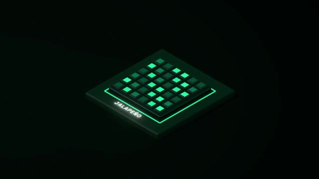
*📸 00:11:43 — Rendu stylisé et conceptuel d'une puce d'intelligence artificielle nommée "JALAPENO", avec une matrice de blocs de calcul illuminés en vert sur un substrat noir.*

*📸 00:11:52 — Diagramme en barres comparatif affichant les capacités de mémoire (Go) et les débits de bande passante (To/s) entre la puce conceptuelle "JALAPENO" et la "NVIDIA B300". Les valeurs sont de 216 Go vs 288 Go pour la mémoire, et 15,4 To/s vs 8 To/s pour la bande passante.*

---

### ⏱️ `[00:12:09 - 00:12:35]` | Segment #34

**🔊 Audio (Transcription Intégrale Mot pour Mot en Français) :**
> comparé à 500 tokens par seconde sur des GPU Nvidia. Ce qui est un peu bizarre, c'est qu'ils disent existing best, mais je pense qu'ils comparent directement aux GPU. Sur GPT OSS 120, Cerebrass sont à 1 700, 1 800, donc ils sont au-dessus. Donc de toute façon, je pense qu'ils ont tellement de demandes qu'ils utilisent tout. Ils ont des GPU Nvidia, ils ont des TPU, ils ont maintenant des puces avec Cerebrass, et là maintenant ils font aussi leurs propres puces, donc en fait ils mangent à tous les râteliers parce qu'ils ont juste tellement d'utilisateurs, tellement de demandes qu'ils prennent tout.

**👁️ Analyse Visuelle d'Écran (gemini-3.5-flash-lite) :**
**Interface & Outils** : 

**Contenu textuel & Code** : 

**Action / Démonstration** : 

---

### ⏱️ `[00:12:35 - 00:12:54]` | Segment #35

**🔊 Audio (Transcription Intégrale Mot pour Mot en Français) :**
> Donc on pourrait penser qu'NVIDIA ils sont un peu foutus tellement inconcurrentes mais premièrement ils ont fait quelques acquisitions donc ils sont pas à la rue. En fait c'est un truc qui est tellement avec des changements rapides, il y a des nouveaux modèles tout le temps, des nouvelles techniques, des nouvelles architectures, qu'en fait si demain il y a un nouveau modèle qui est vraiment plus puissant, vraiment plus rapide, qu'a une architecture un petit peu différente, il va toujours pouvoir tourner sur des GPU Nvidia.

**👁️ Analyse Visuelle d'Écran (gemini-3.5-flash-lite) :**
**Interface & Outils** : Présentation de slide.

**Contenu textuel & Code** : Spécifications techniques d'un accélérateur IA (NVIDIA Groq 3 LPX) : PFLOPS, capacité SRAM, bande passante mémoire, densité de mise à l'échelle (chips), bande passante de mise à l'échelle. Diagramme architectural détaillé des interconnexions (LPU C2C Spine Connectors, LPU C2C Links) et des composants clés (LPUs, FPGA, Host CPU, BF4).

**Action / Démonstration** : Explication et comparaison des architectures et performances de puces IA pour l'inférence, potentiellement en réponse à des enjeux de concurrence.

*📸 00:12:40 — Slide présentant l'architecture et les spécifications techniques du système d'inférence IA NVIDIA Groq 3 LPX, incluant les capacités de calcul (315 PFLOPS), la bande passante mémoire, et un diagramme de ses composants internes (8 LPUs, FPGA, CPU hôte, connexions C2C).*

---

### ⏱️ `[00:12:54 - 00:13:14]` | Segment #36

**🔊 Audio (Transcription Intégrale Mot pour Mot en Français) :**
> Alors que sous toutes les autres puces qui sont un peu plus optimisées pour un certain type d'architecture, du coup ça va peut-être moins bien marcher ou même pas marcher du tout. Et un deuxième gros avantage c'est que ton GPU Nvidia, le jour où t'en as plus besoin, tu peux le revendre à un bon prix, récupérer quand même une bonne partie de ton investissement. Alors que ta puce qui va être custom pour tel, tel, tel modèle, dans 6 mois, quand il y a un nouveau modèle et que tu veux passer au nouveau, ta puce, elle vaut zéro.

**👁️ Analyse Visuelle d'Écran (gemini-3.5-flash-lite) :**
**Interface & Outils** : Aucune interface technique (terminal, console cloud, IDE) visible.

**Contenu textuel & Code** : Aucun code, commande, architecture ou métrique technique visible.

**Action / Démonstration** : Aucune manipulation, configuration, test ou explication technique n'est visuellement démontrée.

---

### ⏱️ `[00:13:15 - 00:13:41]` | Segment #37

**🔊 Audio (Transcription Intégrale Mot pour Mot en Français) :**
> Dans le futur, il devrait commencer à avoir pas mal plus de puces qui sont vraiment dédiées, plus optimisées spécifiquement pour ce qu'on a besoin dans les LLM. Mais ce n'est pas encore non plus super clair quelle architecture va dominer. Potentiellement, elles peuvent même toutes gagner en même temps parce qu'on pourrait potentiellement avoir des puces qui se spécialisent de plus en plus. Là, on a des puces qui sont peut-être plus spécialisées pour le décode, plus pour le préfil, mais peut-être qu'on peut aller encore plus loin et en fait faire une architecture carrément au niveau du data center où on va avoir tant de puces qui vont faire telle action, tant de puces qui vont faire telle partie.

**👁️ Analyse Visuelle d'Écran (gemini-3.5-flash-lite) :**
**Interface & Outils** : Illustration graphique conceptuelle.

**Contenu textuel & Code** : Deux icônes de racks de serveurs.

**Action / Démonstration** : Visualisation abstraite de matériel serveur pour appuyer le discours sur les architectures matérielles des LLM.

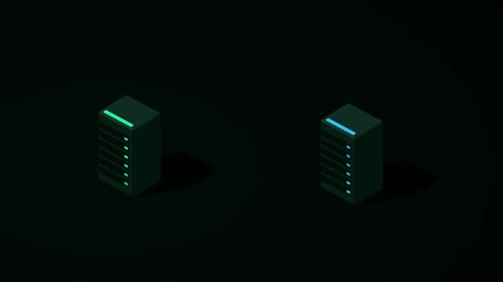
*📸 00:13:34 — Représentation isométrique stylisée de deux racks de serveurs, symbolisant des unités d'infrastructure de calcul avec des indicateurs lumineux.*

---

### ⏱️ `[00:13:41 - 00:14:01]` | Segment #38

**🔊 Audio (Transcription Intégrale Mot pour Mot en Français) :**
> Et le jeu ça va plus être avoir le bon nombre de chacun des types de puces pour optimiser le modèle qu'on veut servir. Donc tout ce matos ça fait que les IA sont de plus en plus rapides à tel point que je pense que ça va vraiment changer la façon dont on utilise les IA. Imagine si t'as une IA qui tourne à 10 000 tokens par seconde, ce que tu peux faire. Mais ça c'est juste la vitesse. De l'autre côté, les IA sont aussi plus intelligentes. A tel point que chez OpenAI, maintenant ils arrivent à hacker sans faire exprès.

**👁️ Analyse Visuelle d'Écran (gemini-3.5-flash-lite) :**
**Interface & Outils** : Aucune interface technique, console, ou écran de logiciel visible.

**Contenu textuel & Code** : Aucun code, commande, métrique, architecture ou information technique n'est affiché.

**Action / Démonstration** : Aucune manipulation, configuration, test ou explication technique n'est démontrée visuellement. Le créateur s'exprime oralement.

---

### ⏱️ `[00:14:01 - 00:14:04]` | Segment #39

**🔊 Audio (Transcription Intégrale Mot pour Mot en Français) :**
> Si cette histoire t'intéresse, je te conseille d'aller voir cette vidéo.

**👁️ Analyse Visuelle d'Écran (gemini-3.5-flash-lite) :**
**Interface & Outils** : Aucune interface technique visible.

**Contenu textuel & Code** : Aucun contenu technique (commandes, code, architectures, métriques) visible.

**Action / Démonstration** : Aucune manipulation, configuration, test ou explication technique n'est montrée à l'écran.

---

